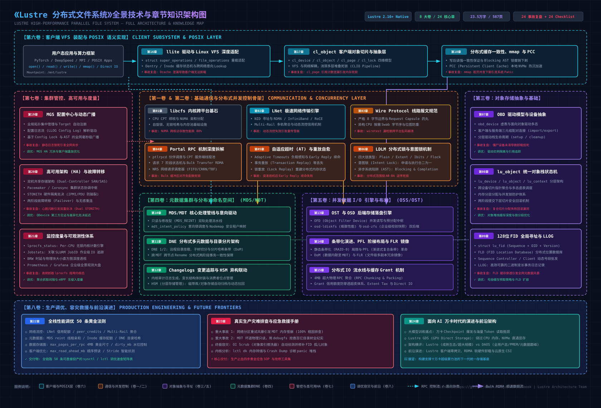
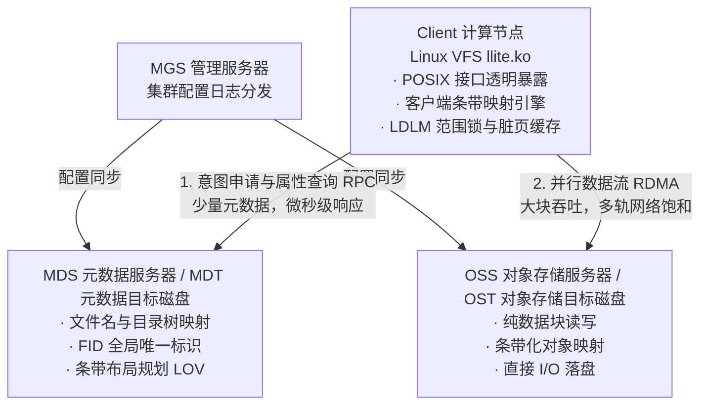

# 《深入理解 Lustre：超大规模并行文件系统的内核实现与架构设计》

> **作者**：Ringi
> **源码基线**：Lustre 2.16+ (Linux Kernel 5.x/6.x Native, Git Commit `47638add`)  
> **代码仓库**：[lustre-release](https://github.com/lustre/lustre-release)

---

## 🗺️ 全书技术体系与系统全景架构图


<details open>
<summary><b>📐 点击展开/折叠：全书 8 卷 24 章技术体系与底层协议映射矢量大图 (architecture.svg)</b></summary>



</details>

---

## 序言：为什么需要深入理解 Lustre？

在单机系统中，我们习惯了操作系统的标准 POSIX I/O：调用 `open()` 返回文件描述符，调用 `write()` 将脏页写入 Page Cache，后台 `flusher` 线程异步刷盘。即使是高并发的 Web 场景，单盘几千 IOPS、几个 NVMe SSD 组个 RAID 0，或者挂载一个 NFS 共享存储，也足以应付多数业务。

然而，当算力基础设施进入 **百亿/千亿参数大模型训练（AI LLM Training）** 与 **百亿亿次级超算（Exascale HPC）** 时代，物理现实发生了彻底突变：

1. **瞬时吞吐的鸿沟**：数万张 GPU（如 H100/A100 集群）进行分布式训练时，每个 Checkpoint 保存窗口可能产生数 TB 至数十 TB 的瞬时写压力。如果存储系统不能在 1 分钟内以 **数百 GB/s 甚至 TB/s 的聚合带宽** 将数据吞下，整场训练就必须挂起等待（GPU Stalling），每小时造成的算力闲置浪费高达数万美元。
2. **连接数的核爆炸**：当数万个计算节点在同一毫秒内并发发起 `stat` 或 `open` 同一个共享数据目录（例如 ImageNet、Common Crawl 或训练权重目录）时，传统的集中式元数据服务器会瞬间发生 CPU 100%、TCP 队头阻塞、连接数耗尽并彻底雪崩。
3. **单节点物理上限**：任何单一存储节点（无论是基于 PCIe 5.0 总线还是 800G 网络接口卡）都存在带宽天花板。要突破物理瓶颈，唯一的出路是将单一文件横向切分（Striping），分散到数十、数百台独立的存储目标机并发承载。

这就是 **Lustre（Linux Cluster）** 诞生的历史使命。自 1999 年由 Peter Braam 创立以来，Lustre 历经 20 余年工业淬炼，长年统治全球超级计算机 TOP500 榜单的大规模存储底层。**它不是一个简单的“网络文件系统”，而是一个深度融入 Linux 内核、横跨网络与磁盘的分布式并行调度操作系统。**

---

## 🏛️ Lustre 宏观架构的三元分离心智模型

Lustre 能够支撑 TB/s 级带宽与数十亿文件规模的核心精髓，在于其极其纯粹的 **“控制流与数据流解耦”**、**“元数据与数据分离”** 架构：



### 核心角色全景映射表：

| 缩写       | 全称                  | 物理/逻辑角色                                                                                         | 对应源码核心模块               |
| :--------- | :-------------------- | :---------------------------------------------------------------------------------------------------- | :----------------------------- |
| **MGS**    | Management Server     | 全局集群配置中心，负责保存、更新并分发各组件的拓扑配置日志（Config Log）。                            | `lustre/mgs/`, `lustre/mgc/`   |
| **MDS**    | Metadata Server       | 运行元数据服务的物理节点，一个集群可有多个 MDS。                                                      | `lustre/mdt/`, `lustre/mdc/`   |
| **MDT**    | Metadata Target       | MDS 挂载的实际元数据存储卷，存放文件名、目录树、权限、文件属性及文件布局（Layout）。                  | `lustre/mdd/`, `lustre/lod/`   |
| **OSS**    | Object Storage Server | 运行对象数据存取服务的物理节点，直接与高速网络与本地后端磁盘交互。                                    | `lustre/ost/`, `lustre/osc/`   |
| **OST**    | Object Storage Target | OSS 挂载的数据存储卷（LUN），一个 OSS 通常挂载多个 OST。实际文件切片（Objects）落盘于此。             | `lustre/ofd/`, `lustre/osd-*/` |
| **Client** | Lustre Client         | 运行在计算节点上的客户端内核驱动（`llite.ko`），向用户态暴露标准的 Linux 挂载点（如 `/mnt/lustre`）。 | `lustre/llite/`, `lustre/lov/` |

---

## ⚡ 为什么读懂 Lustre 源码能极大提升系统认知？

Lustre 代码库（[lustre-release](https://github.com/lustre/lustre-release)）凝结了过去二十年来超算与高可用系统的核心工程智慧：

1. **分布式锁的工业巅峰（LDLM）**：
   从传统教科书式的死锁排查，走向工程化的 **意图锁（Intent Lock）**——将“申请锁”与“执行操作”合二为一；基于字节区间的 **范围锁（Extent Lock）** 与异步系统陷阱（AST 回调）。
2. **极速网络（LNet）的零拷贝哲学**：
   在 InfiniBand 动辄 200Gb/s、400Gb/s、800Gb/s 的网速下，CPU 哪怕多拷贝一次内存都会瞬间成为系统瓶颈。LNet 的 RDMA 驱动设计是目前开源界最高质量的内核网络实现之一。
3. **海量并发数据吞吐机制（LOV / PFL）**：
   大文件如何自动化渐进条带化（小文件 1 个条带降低元数据负担，大文件自动分散在 100 个 OST 上全力跑满千兆字节带宽）。

---

## 📖 全书目录

# Summary

[序言：为什么需要深入理解 Lustre？](README.md)

## 第一卷：通信基石与内核抽象层 (Foundation & LNet)

- [第 1 章：高性能内核基础设施：libcfs 与平台兼容抽象](part-01-foundation/01-libcfs.md)
- [第 2 章：LNet（Lustre Network）通信引擎：构建集群血管](part-01-foundation/02-lnet.md)
- [第 3 章：统一线控协议与数据包布局 (Wire Protocol)](part-01-foundation/03-wire-protocol.md)

## 第二卷：分布式通信与并发控制骨架 (Portal RPC & LDLM)

- [第 4 章：Portal RPC 异步通信框架与请求状态机](part-02-rpc-and-locks/04-portal-rpc.md)
- [第 5 章：分布式容错恢复与自适应超时 (Adaptive Timeouts)](part-02-rpc-and-locks/05-recovery-at.md)
- [第 6 章：LDLM 分布式锁管理器：意图锁与并发控制深度解密](part-02-rpc-and-locks/06-ldlm-locks.md)

## 第三卷：对象存储设备抽象与基础组件 (OBD Foundation)

- [第 7 章：OBD 分层模型与设备生命周期](part-03-obd-foundation/07-obd-model.md)
- [第 8 章：现代对象栈模型：lu_object 与两阶段事务契约](part-03-obd-foundation/08-lu-object.md)
- [第 9 章：FID 体系与分布式命名空间路由](part-03-obd-foundation/09-fid-concept.md)

## 第四卷：元数据集群与分布式命名空间 (Metadata Services)

- [第 10 章：MDS 与 MDT 核心架构与元数据流水线](part-04-metadata/10-mdt-internals.md)
- [第 11 章：DNE（Distributed Namespace Engine）多元数据水平扩展](part-04-metadata/11-dne-architecture.md)
- [第 12 章：元数据变更日志（Changelogs）与数据保护](part-04-metadata/12-changelogs.md)

## 第五卷：条带化并发数据 I/O 引擎 (Data Storage Path)

- [第 13 章：OST 与 OSD 存储核心与底层引擎抉择](part-05-data-storage/13-ost-osd.md)
- [第 14 章：文件条带化（Striping）与现代布局演进 (PFL / FLR / DoM)](part-05-data-storage/14-striping-pfl-flr.md)
- [第 15 章：分布式 IO 流水线与缓存 Grant 机制](part-05-data-storage/15-io-grant.md)

## 第六卷：客户端 VFS 装配与 POSIX 语义实现 (Client Subsystem)

- [第 16 章：llite 与 Linux VFS 深度适配与生命周期](part-06-client-subsystem/16-llite-vfs.md)
- [第 17 章：cl_object 客户端对象抽象层与 IO 状态机](part-06-client-subsystem/17-cl-object.md)
- [第 18 章：分布式缓存一致性与并发控制 (PCC / 分布式 mmap)](part-06-client-subsystem/18-distributed-cache.md)

## 第七卷：集群管控、运维工具与现代扩展 (Management & Observability)

- [第 19 章：MGS 与动态配置分发中心](part-07-management/19-mgs-config.md)
- [第 20 章：高可用架构（HA）与故障转移机制](part-07-management/20-high-availability.md)
- [第 21 章：性能监控、指标度量与可观测性体系](part-07-management/21-monitoring-observability.md)

## 第八卷：生产工程调优、容灾救援与 AI 前沿 (Production Engineering & AI Frontiers)

- [第 22 章：全栈性能调优黑魔法](part-08-production/22-performance-tuning.md)
- [第 23 章：真实生产灾难排查与应急救援手册](part-08-production/23-disaster-recovery.md)
- [第 24 章：面向 AI 时代的演进与前沿架构 (GDS / DAOS 反思)](part-08-production/24-ai-frontiers.md)

---

## 📑 机构级技术架构白皮书与出版级排版管线 (huashu-report)

本项目全面整合 [huashu-report](https://github.com/alchaincyf/huashu-report) 工业级技术报告设计系统与严谨实证方法论，构建了“专著 + 深度白皮书”双轨发布流水线：

### 1. 全书 mdBook 出版级印刷主题 (`theme/huashu.css`)
- **微米级排版规范**：采用印刷级灰黑底色（`#231f20`）与经典双色系统（Teal 品牌色 `#14505e` + Clay 强调色 `#a4551f`）。
- **专业制表与排印**：全局启用等宽数字（`font-variant-numeric: tabular-nums`）、跨页表头自动重复（`thead { display: table-header-group; }`）与孤行/孤字防断保护。

### 2. 独立白皮书管线 (`report/`)
基于严谨的「数据承重层 + 组装层 + 渲染层」三层架构：
- **数据承重层 (`report/数据表.json`)**：收录 6 项端到端实证指标（含样本量 $N$、测试口径、基准对比与官方复现出处）。
- **组装与矢量图表层 (`report/build.py`)**：自动嵌入高精度内联矢量图（`chart.py`），实现结论先行图表标题与实证角标溯源机制（`[E1]`~`[E6]`）。
- **严谨辩证章节**：严格贯彻“预先反驳自己”学术范式，主动阐明单目录超小文件锁争用瓶颈与内核驱动运维门槛等局限性。
- **渲染与机械化自检 (`report/render.py`)**：基于 Playwright Chromium 输出毫米级精确 A4 双面白皮书 PDF，并通过 PyMuPDF 进行机械化质量与占位符零容忍自检。

### 3. 一键编译与导出命令

```bash
# 1. 编译网页版 mdBook
mdbook build

# 2. 导出 24 章全书高清出版级 PDF
node scripts/export_pdf.mjs

# 3. 编译并渲染机构级技术架构白皮书 PDF
python report/render.py
```

跟随本书与白皮书，让我们一同推开万核并行计算时代最底层存储基石的源码大门！
