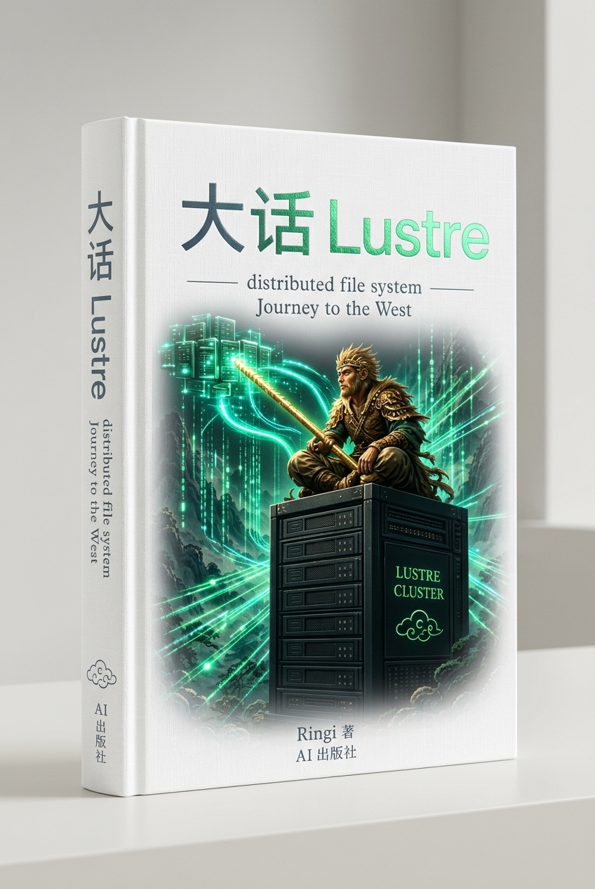
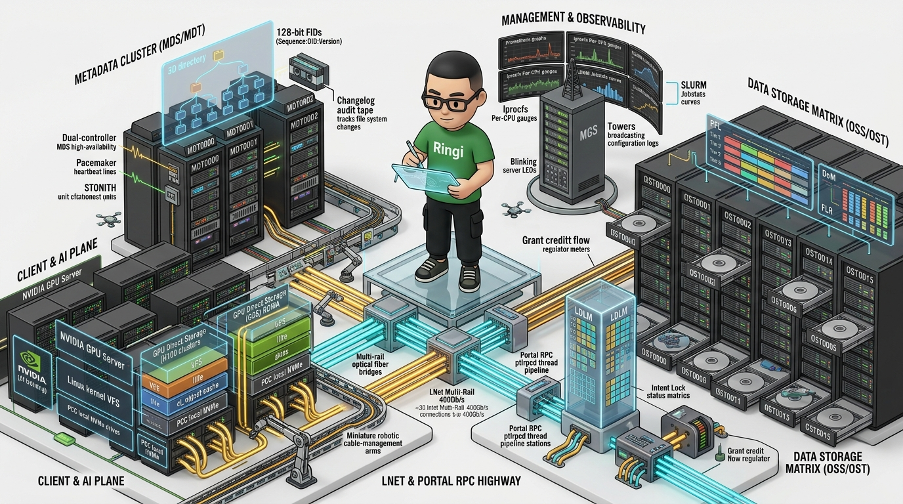
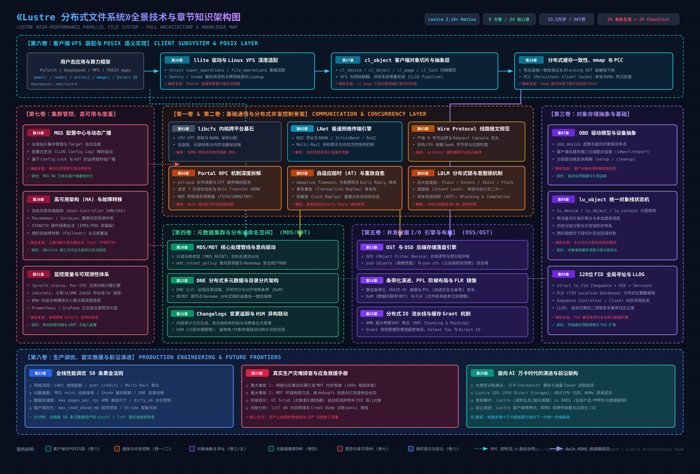
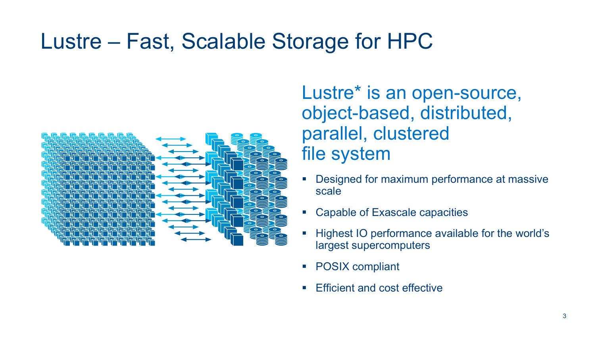
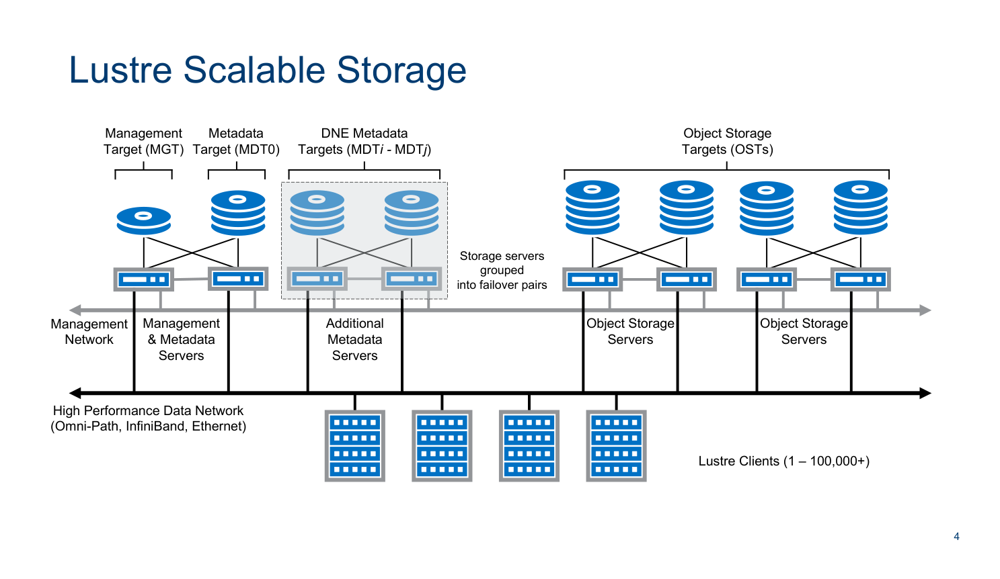
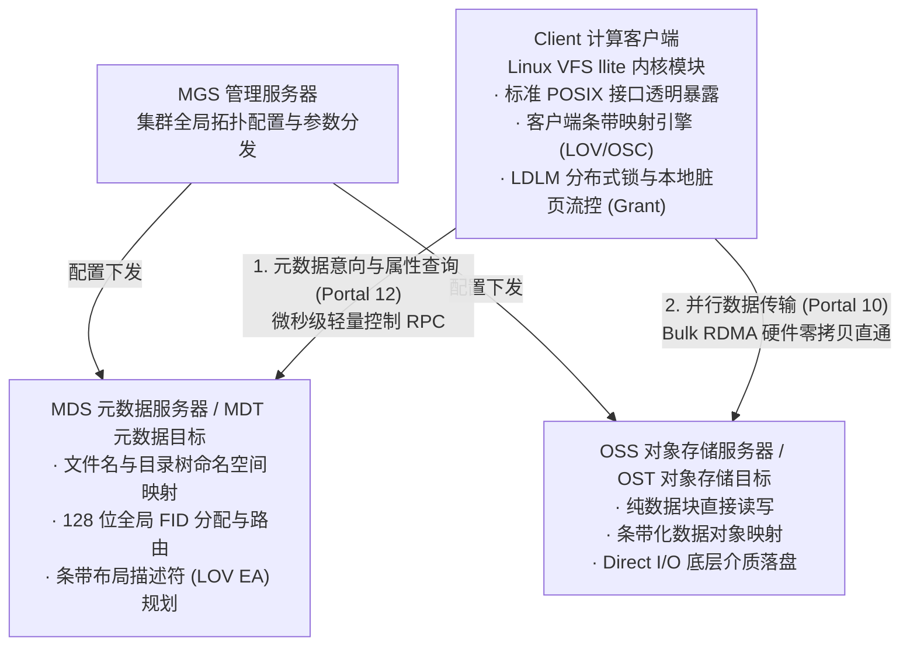
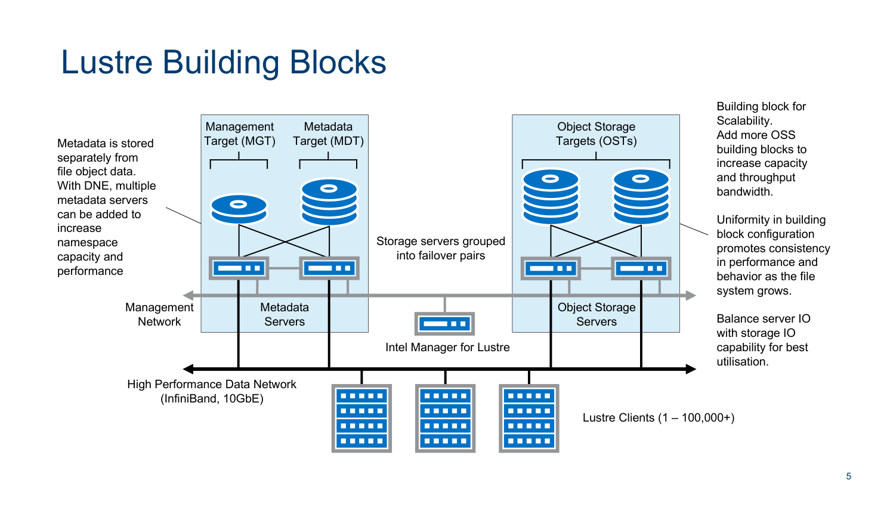
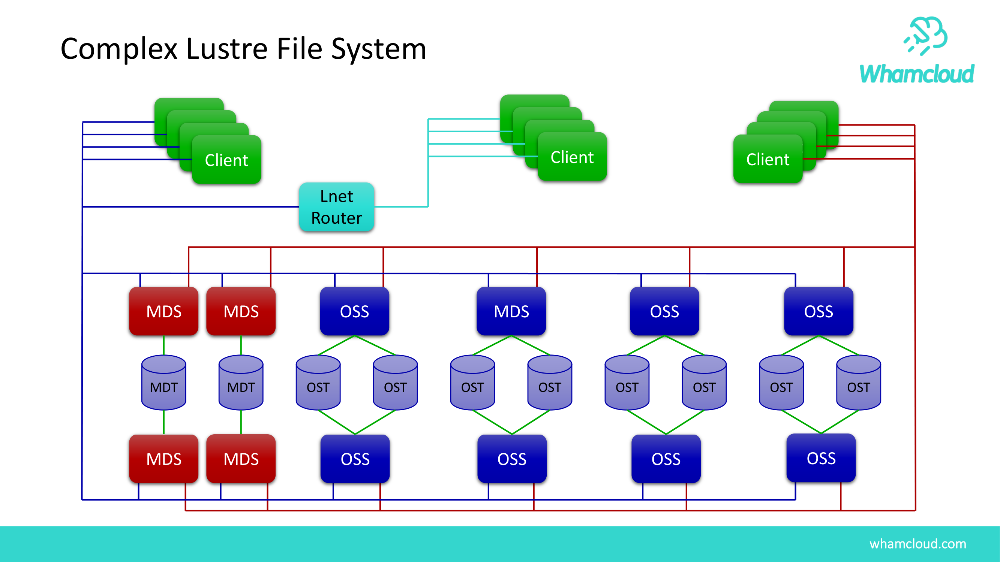
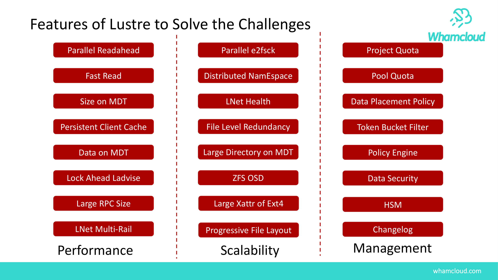

# 《大话 Lustre：超大规模并行文件系统的内核实现与架构设计》

> **作者**：Ringi  
> **源码基线**：Lustre 2.16+ (Linux Kernel 5.x/6.x Native, Git Commit `47638add`)  
> **代码仓库**：[lustre-release](https://github.com/lustre/lustre-release)  

---

<p align="center">
  
</p>

---

## 📖 交互式文档预览 (Mintlify + Claude Docs 风格)

本项目已全面升级为基于 **Mintlify** 驱动的现代交互式技术专著（融合 Anthropic Claude Docs 官方陶土色视觉规范、暗黑模式与 Diátaxis 内容架构）：

```bash
# 启动本地实时交互式文档预览
npm run dev
# 或直接运行
npx mintlify dev --dir docs
```
本地预览地址：`http://localhost:3000`

* **文档配置**：`docs/docs.json`
* **文档源码**：`docs/`（含 8 卷 29 章共 271 篇完整 MDX 剖析文档及上手教程）
* **视觉规范**：`DESIGN.md`
* **写作规范**：`docs/style-guide.mdx`

---

## 全书技术体系与系统全景架构



<details open>
<summary><b>全书 8 卷 29 章技术体系与底层协议映射架构大图 (architecture.svg)</b></summary>



</details>

---

## 序言：为什么需要深入理解 Lustre？

在单机系统中，应用程序依赖操作系统的标准 POSIX I/O：调用 `open()` 返回文件描述符，调用 `write()` 将数据写入本地 Page Cache，由内核后台线程异步刷盘。对于常规业务，单机 NVMe 阵列或基础网络挂载卷（如 NFS）足以承载多数访问。

然而，在面对数十万计算核心的高性能计算（HPC）集群与万卡 GPU 分布式大模型训练场景时，存储系统面临着不同的物理约束：

1. **瞬时写入带宽需求**：在大规模 GPU 分布式训练中，检查点（Checkpoint）写入窗口可能产生数 TB 至数十 TB 的瞬时写压力。若存储系统无法在短时间内以数百 GB/s 的聚合带宽完成数据持久化，计算集群将因等待 I/O 陷入停顿，降低昂贵的算力利用率。
2. **高并发元数据连接压力**：当数万个计算节点并发访问或读取相同的数据集目录时，集中式的单机元数据服务容易在网络套接字、Inode 互斥锁与内存缓存上形成瓶颈，导致请求排队延迟激增。
3. **单节点物理性能上限**：单台服务器的 PCIe 总线带宽与网络接口卡线速存在物理上限。要突破单机瓶颈，必须将单个大文件在逻辑上横向切分为多个分片（Striping），分散至多个独立的存储目标机并发承载。


如图 0-1 所示，自 2002 年以来，Lustre 驱动了全球一代又一代顶尖算力平台（从 BlueGene/L、天河一号/二号、Titan 到近年的 Frontier 与 Aurora）。其聚合吞吐实现了每年 ~1.36 倍、容量每年 ~1.38 倍的跨越式指数增长，在百 PB 级空间与数 TB/s 线速吞吐的严苛实战中淬炼成了企业级存储中枢。

---

## Lustre 宏观架构的三元分离模型

Lustre 支撑高吞吐与海量文件规模的核心机制，在于其**控制流与数据流解耦**、**元数据与数据分离**的架构设计：



结合官方系统总架构（图 0-2）与基于对象的分布式存储模型（图 0-3）：




```mermaid
flowchart TD
    MGS["MGS 管理服务器<br/>集群全局拓扑配置与参数分发"]
    MDS["MDS 元数据服务器 / MDT 元数据目标<br/>· 文件名与目录树命名空间映射<br/>· 128 位全局 FID 分配与路由<br/>· 条带布局描述符 (LOV EA) 规划"]
    OSS["OSS 对象存储服务器 / OST 对象存储目标<br/>· 纯数据块直接读写<br/>· 条带化数据对象映射<br/>· Direct I/O 底层介质落盘"]
    CLIENT["Client 计算客户端<br/>Linux VFS llite 内核模块<br/>· 标准 POSIX 接口透明暴露<br/>· 客户端条带映射引擎 (LOV/OSC)<br/>· LDLM 分布式锁与本地脏页流控 (Grant)"]

    MGS -->|配置下发| MDS
    MGS -->|配置下发| OSS
    CLIENT -->|"1. 元数据意向与属性查询 (Portal 12)<br/>微秒级轻量控制 RPC"| MDS
    CLIENT -->|"2. 并行数据传输 (Portal 10)<br/>Bulk RDMA 硬件零拷贝直通"| OSS
```





图 0-5 展示了现代化智算中心的复杂集群拓扑：通过 LNet 路由器阵列隔离高速计算网与后端存储网，多台 MDS/MDT 实施命名空间分布式水平扩展（DNE），成百上千台 OSS/OST 共同聚合出 PB/s 级的网络吞吐。

### 核心角色职能映射表

| 组件名称 | 全称 | 架构角色与工程职责 | 核心代码目录 |
| :--- | :--- | :--- | :--- |
| **MGS** | Management Server | 全局集群配置中心，负责保存、更新并广播各组件的拓扑配置日志（Config Log）。 | `lustre/mgs/`, `lustre/mgc/` |
| **MDS** | Metadata Server | 运行元数据内核服务线程池的物理/逻辑节点。 | `lustre/mdt/`, `lustre/mdc/` |
| **MDT** | Metadata Target | MDS 挂载的实际元数据存储卷，存放目录树、权限、文件属性及条带布局。 | `lustre/mdd/`, `lustre/lod/` |
| **OSS** | Object Storage Server | 运行对象数据存取服务的物理节点，负责与高速网络及后端磁盘交互。 | `lustre/ost/`, `lustre/osc/` |
| **OST** | Object Storage Target | OSS 挂载的数据存储卷（LUN），实际文件切片对象持久化落盘于此。 | `lustre/ofd/`, `lustre/osd-*/` |
| **Client** | Lustre Client | 运行在计算节点上的客户端内核驱动（`llite`），向操作系统暴露标准 VFS 挂载点。 | `lustre/llite/`, `lustre/lov/`, `lustre/cl_object/` |

---

## 核心技术价值与特性解法矩阵

深入 Lustre 内核源码实现，能够系统掌握分布式系统与底层操作系统的结合点：



结合官方解法矩阵（图 0-6），全书将从三大工程维度系统拆解：
1. **极致性能（Performance）**：并发预读算法、4MB 巨型 RPC 报文、持久化客户端缓存（PCC）、元数据端内联（Data-on-MDT）、智能锁预取（Ladvise Lock Ahead）与端到端 GDS 硬件直通；
2. **海量扩展（Scalability）**：多轨网络聚合（LNet Multi-Rail）、链路健康主动探测（LNet Health）、分布式命名空间（DNE）、文件级镜像冗余（FLR）、ZFS/ldiskfs 双引擎与渐进式布局（PFL）；
3. **企业级治理（Management）**：项目级配额（Project Quota）、分层存储管理（HSM）、令牌桶流控（NRS TBF）、Changelogs 增量审计与分布式写屏障（Barrier）全局快照。

---

## 全书目录索引 (8 卷 29 章完整典藏版)

### [序言：为什么需要深入理解 Lustre？](README.md)

### 第一卷：通信基石与内核抽象层 (Foundation & LNet)
- [第 1 章：高性能内核基础设施：libcfs 与平台兼容抽象](part-01-foundation/01-libcfs.md)
- [第 2 章：LNet（Lustre Network）通信引擎：构建集群血管](part-01-foundation/02-lnet.md)
- [第 3 章：统一线控协议与数据包布局 (Wire Protocol)](part-01-foundation/03-wire-protocol.md)

### 第二卷：分布式通信与并发控制骨架 (Portal RPC & LDLM)
- [第 4 章：Portal RPC 异步通信框架与请求状态机](part-02-rpc-and-locks/04-portal-rpc.md)
- [第 5 章：分布式容错恢复与自适应超时 (Adaptive Timeouts)](part-02-rpc-and-locks/05-recovery-at.md)
- [第 6 章：LDLM 分布式锁管理器：意图锁与并发控制深度解密](part-02-rpc-and-locks/06-ldlm-locks.md)

### 第三卷：对象存储设备抽象与基础组件 (OBD Foundation)
- [第 7 章：OBD 分层模型与设备生命周期](part-03-obd-foundation/07-obd-model.md)
- [第 8 章：现代对象栈模型：lu_object 与两阶段事务契约](part-03-obd-foundation/08-lu-object.md)
- [第 9 章：FID 体系与分布式命名空间路由](part-03-obd-foundation/09-fid-concept.md)

### 第四卷：元数据集群与分布式命名空间 (Metadata Services)
- [第 10 章：MDS 与 MDT 核心架构与元数据流水线](part-04-metadata/10-mdt-internals.md)
- [第 11 章：DNE（Distributed Namespace Engine）多元数据水平扩展](part-04-metadata/11-dne-architecture.md)
- [第 12 章：元数据变更日志（Changelogs）与数据保护](part-04-metadata/12-changelogs.md)
- [第 13 章：企业级安全认证与 Nodemap 多租户虚拟化](part-04-metadata/13-nodemap-security.md)

### 第五卷：条带化并发数据 I/O 引擎 (Data Storage Path)
- [第 14 章：OST 与 OSD 存储核心与底层引擎抉择](part-05-data-storage/14-ost-osd.md)
- [第 15 章：文件条带化与现代布局演进 (PFL / FLR / DoM / SEL)](part-05-data-storage/15-striping-pfl-flr.md)
- [第 16 章：分布式 I/O 流水线与缓存 Grant 机制](part-05-data-storage/16-io-grant.md)
- [第 17 章：HSM 分层存储管理与对象存储云级下沉](part-05-data-storage/17-hsm-tiering.md)

### 第六卷：客户端 VFS 装配与多协议网关 (Client Subsystem & Gateways)
- [第 18 章：llite 与 Linux VFS 深度适配与生命周期](part-06-client-subsystem/18-llite-vfs.md)
- [第 19 章：cl_object 客户端对象抽象层与 I/O 状态机](part-06-client-subsystem/19-cl-object.md)
- [第 20 章：分布式缓存一致性与并发控制 (PCC / 分布式 mmap)](part-06-client-subsystem/20-distributed-cache.md)
- [第 21 章：多协议集群接入网关：CTDB、高可用 Samba 与 NFS-Ganesha](part-06-client-subsystem/21-cluster-gateway-ctdb.md)

### 第七卷：集群管控、配额治理与高可用 (Management & Governance)
- [第 22 章：MGS 与动态配置分发中心](part-07-management/22-mgs-config.md)
- [第 23 章：高可用架构（HA）与故障转移机制](part-07-management/23-high-availability.md)
- [第 24 章：企业级磁盘配额系统与空间治理](part-07-management/24-quota-governance.md)
- [第 25 章：分布式写屏障（Barrier）与集群级全局快照](part-07-management/25-snapshot-barrier.md)
- [第 26 章：性能监控、指标度量与可观测性体系](part-07-management/26-monitoring-observability.md)

### 第八卷：生产工程调优、容灾救援与 AI 前沿 (Production Engineering & AI Frontiers)
- [第 27 章：全栈性能调优与 Lustre 基准测试套件](part-08-production/27-performance-tuning.md)
- [第 28 章：生产灾难排查与 LFSCK 深度自愈手册](part-08-production/28-disaster-recovery.md)
- [第 29 章：面向 AI 时代的演进与前沿架构 (GDS / DAOS 反思)](part-08-production/29-ai-frontiers.md)

---

## 机构级技术架构白皮书与排版管线 (huashu-report)

本项目整合 [huashu-report](https://github.com/alchaincyf/huashu-report) 工业级技术报告设计系统，构建了专著与深度白皮书双轨发布流水线：

### 1. 全书 mdBook 出版级印刷主题 (`theme/huashu.css`)
- **微米级排版规范**：采用印刷级灰黑底色（`#231f20`）与经典双色系统（Teal 品牌色 `#14505e` + Clay 强调色 `#a4551f`）。
- **专业制表与排印**：全局启用等宽数字（`font-variant-numeric: tabular-nums`）、跨页表头自动重复（`thead { display: table-header-group; }`）与孤行/孤字防断保护。

### 2. 独立白皮书管线 (`report/`)
- **数据承重层 (`report/数据表.json`)**：收录端到端实证指标（含样本量 $N$、测试口径、基准对比与官方复现出处）。
- **组装与矢量图表层 (`report/build.py`)**：自动嵌入高精度内联矢量图（`chart.py`），实现结论先行图表标题与实证角标溯源机制。
- **渲染与自检 (`report/render.py`)**：基于 Playwright Chromium 输出高精度 A4 双面白皮书 PDF，并通过 PyMuPDF 进行排版质量与占位符机械化自检。

### 3. 构建与导出命令

```bash
# 1. 编译网页版 mdBook
mdbook build

# 2. 导出全书出版级 PDF
node scripts/export_pdf.mjs

# 3. 编译并渲染机构级技术架构白皮书 PDF
python report/render.py
```
