# Understanding Lustre Internals
> Authoritative Reference: ORNL Technical Report on Lustre File System Architecture & Internals.

CONTENTS

5.1 Introduction . . . . . . . . . . . . . . . . . . . . . . . . . . . . . . . . . . . . . . . . . . . 25 5.2 obd_device Structure . . . . . . . . . . . . . . . . . . . . . . . . . . . . . . . . . . . . . . 26 5.3 MGC Life Cycle . . . . . . . . . . . . . . . . . . . . . . . . . . . . . . . . . . . . . . . . 27 5.4 Obd Device Life Cycle . . . . . . . . . . . . . . . . . . . . . . . . . . . . . . . . . . . . . 30 5.4.1 class_attach() . . . . . . . . . . . . . . . . . . . . . . . . . . . . . . . . . . . . . . 30 5.4.2 obd_export Structure . . . . . . . . . . . . . . . . . . . . . . . . . . . . . . . . . . 31 5.4.3 class_setup() . . . . . . . . . . . . . . . . . . . . . . . . . . . . . . . . . . . . . . 33 5.4.4 class_precleanup() and class_cleanup() . . . . . . . . . . . . . . . . . . . . . . . . 35 5.5 Imports and Exports . . . . . . . . . . . . . . . . . . . . . . . . . . . . . . . . . . . . . . . 38 5.6 Useful APIs in Obdclass . . . . . . . . . . . . . . . . . . . . . . . . . . . . . . . . . . . . 39 6. LIBCFS . . . . . . . . . . . . . . . . . . . . . . . . . . . . . . . . . . . . . . . . . . . . . . . . 40 6.1 Introduction . . . . . . . . . . . . . . . . . . . . . . . . . . . . . . . . . . . . . . . . . . . 40 6.2 Data Encryption Support in Libcfs . . . . . . . . . . . . . . . . . . . . . . . . . . . . . . . 40 6.3 CPU Partition Table Management . . . . . . . . . . . . . . . . . . . . . . . . . . . . . . . 43 6.4 Debugging Support and Failure Injection . . . . . . . . . . . . . . . . . . . . . . . . . . . . 45 6.5 Additional Supporting Software in Libcfs . . . . . . . . . . . . . . . . . . . . . . . . . . . 45 7. File Identifiers, FID Location Database, and Object Index . . . . . . . . . . . . . . . . . . . . . . 45 7.1 File Identifier (FID) . . . . . . . . . . . . . . . . . . . . . . . . . . . . . . . . . . . . . . . 45 7.1.1 Reserved Sequence Numbers and Object IDs . . . . . . . . . . . . . . . . . . . . . 47 7.1.2 fid Kernel Module . . . . . . . . . . . . . . . . . . . . . . . . . . . . . . . . . . 48 7.2 FID Location Database (FLD) . . . . . . . . . . . . . . . . . . . . . . . . . . . . . . . . . 49 7.3 Object Index (OI) . . . . . . . . . . . . . . . . . . . . . . . . . . . . . . . . . . . . . . . . 50 8. REFERENCES . . . . . . . . . . . . . . . . . . . . . . . . . . . . . . . . . . . . . . . . . . . . 53

## LIST OF FIGURES

1 Lustre file system components in a basic cluster . . . . . . . . . . . . . . . . . . . . . . . . 4 2 Normal RAID0 file striping in Lustre . . . . . . . . . . . . . . . . . . . . . . . . . . . . . . 5 3 Using FID to access a file’s Layout EA and corresponding OST objects . . . . . . . . . . . 7 4 Basic view of Lustre software stack . . . . . . . . . . . . . . . . . . . . . . . . . . . . . . 8 5 Lustre I/O operation: Lustre client requesting file data. . . . . . . . . . . . . . . . . . . . . 9 6 Communication between llite and mgc through obdclass. . . . . . . . . . . . . . . . . . . . 20 7 Data structures involved in the communication between mgc and llite subsystems. . . . . . . 20 8 mgc_setup() call graph starting from Lustre file system mounting. . . . . . . . . . . . . . . 21 9 mgc_process_config() call graph . . . . . . . . . . . . . . . . . . . . . . . . . . . . . . . . 23 10 mgc_setup() vs. mgc_cleanup() . . . . . . . . . . . . . . . . . . . . . . . . . . . . . . . . . 24 11 Obd device life cycle workflow for MGC . . . . . . . . . . . . . . . . . . . . . . . . . . . 28 12 Workflow of class_attach() function in obd device lifecycle . . . . . . . . . . . . . . . . . . 31 13 Workflow of class_setup() function in obd device lifecycle . . . . . . . . . . . . . . . . . . 33 14 Lustre unmounting and initiation of class_cleanup() in obd device lifecycle. . . . . . . . . . 36 15 class_cleanup() workflow in obd device lifecycle. . . . . . . . . . . . . . . . . . . . . . . . 37 16 Import and export pair in Lustre . . . . . . . . . . . . . . . . . . . . . . . . . . . . . . . . 38 17 Communication between ost and mdt server obd devices in Lustre . . . . . . . . . . . . . . 39

## LIST OF TABLES

2 Lustre scalability and performance numbers . . . . . . . . . . . . . . . . . . . . . . . . . . 3 3 Lustre Test Suite components . . . . . . . . . . . . . . . . . . . . . . . . . . . . . . . . . . 10 4 Lustre unit, feature and regression tests . . . . . . . . . . . . . . . . . . . . . . . . . . . . . 11 5 Tests in acceptance-small test suite . . . . . . . . . . . . . . . . . . . . . . . . . . . . . . . 12 6 Lustre tests environment variables . . . . . . . . . . . . . . . . . . . . . . . . . . . . . . . 13 7 lfs utility options . . . . . . . . . . . . . . . . . . . . . . . . . . . . . . . . . . . . . . . . 15 8 lctl utility options . . . . . . . . . . . . . . . . . . . . . . . . . . . . . . . . . . . . . . . . 17

## ACRONYMS

HPC High Performance Computing ORNL Oak Ridge National Laboratory API Application Programming Interface GNU GNU’s Not Unix DDN DataDirect Networks POSIX Portable Operating System Interface LFSCK Lustre File System Checker ZFS Z File System Ext4 Fourth Extended File System RDMA Remote Direct Memory Access TCP Transmission Control Protocol MMP Multiple Mount Protection ACL Access Control List SSK Shared-Secret Key MGS Management Server MGT Management Target MDS Metadata Server MDT Metadata Target OSS Object Storage Server OST Object Storage Target FDR Fourteen Data Rate IB Infiniband OPA Omni-Path Architecture LNet Lustre Networking RAID Redundant Array of Independent Disks PFL Progressive File Layout DoM Data on MDT SEL Self Extending Layout DNE Distributed Namespace EA Extended Attribute OSC Object Storage Client LMV Logical Metadata Volume VFS Virtual File System LOV Logical Object Volume PTL-RPC Portal Remote Procedure Call LDLM Lustre Distributed Lock Manager OBD Object Based Disk OFD OBD Filter Device OSD Object Storage Device MDC Metadata Client LTS Lustre Test Suites HSM Hierarchical Storage Manager IOR Interleaved or Random MGC Management Client

LRU Least Recently Used FLD FID Location Database FID File Identifier LWP Light Weight Proxy CPT CPU Partition Table NUMA Non-Uniform Memory Access SMP Symmetric Multi-Processing OSP Object Storage Proxy OI Object Index IGIF Inode and Generation In FID IDIF Object ID In FID UUID Universally Unique Identifier NID Network Identifier

## ABSTRACT

## Lustre Architecture

### What is Lustre?

### Lustre Features

ABSTRACT

The Lustre file system has become a preferred storage resource for systems on the Top500 list, and it is often the file system of choice for small- to medium-sized HPC systems that require parallel shared access to data. Several resources exist to help users deploy and configure Lustre, but the same cannot be said for resources that explain the inner workings of the Lustre source code. A previous ORNL technical report entitled “Understanding Lustre Filesystem Internals” (ORNL/TM-2009/117) provided an excellent summary of Lustre subsystem operations. However, that report is over a decade old and is based on Lustre version 1.6. Since that report was published, Lustre has evolved significantly. Several subsystems underwent significant code changes and many new features have been added to the file system, bringing the current Lustre version up to 2.15.

This report aims to document and explain the internal workings of the latest version of the Lustre file system. It will provide more complete and up-to-date information than the previous technical report and should serve as a foundational document for anyone interested in Lustre software development. Key data structures will be described along with the APIs used for interaction among the various Lustre subsystems. Although the Lustre software is constantly being developed, the details in this document should remain relevant for the forseeable future.

1. Lustre Architecture

1.1 What is Lustre?

Lustre is a GNU General Public licensed, open-source distributed parallel file system developed and maintained by DataDirect Networks (DDN). Due to the extremely scalable architecture of the Lustre file system, Lustre deployments are popular in scientific supercomputing, as well as in the oil and gas, manufacturing, rich media, and finance sectors. Lustre presents a POSIX interface to its clients with parallel access capabilities to the shared file objects. As of this writing, Lustre is the most widely used file system on the top 500 fastest computers in the world. Lustre is the file system of choice on 7 out of the top 10 fastest computers in the world today, over 70% of the top 100, and also for over 60% of the top 500 [5].

1.2 Lustre Features

Lustre is designed for scalability and performance. The aggregate storage capacity and file system bandwidth can be scaled up by adding more servers to the file system, and performance for parallel applications can often be increased by utilizing more Lustre clients. Some practical limits are shown in Table 2 along with values from known production file systems.

Lustre has several features that enhance performance, usability, and stability. Some of these features include:

• POSIX Compliance: With few exceptions, Lustre passes the full POSIX test suite. Most operations are atomic to ensure that clients do not see stale data or metadata. Lustre also supports mmap() file IO.

• Online file system checking: Lustre provides a file system checker (LFSCK) to detect and correct file system inconsistencies. LFSCK can be run while the file system in online and in production, minimizing potential downtime.

### Lustre Components

• Controlled file layouts: The file layouts that determine how data is placed across the Lustre servers can be customized on a per-file basis. This allows users to optimize the layout to best fit their specific use case.

• Support for multiple backend file systems: When formatting a Lustre file system, the underlying storage can be formatted as either ldiskfs (a performance-enhanced version of ext4) or ZFS.

• Support for high-performance and heterogeneous networks: Lustre can utilize RDMA over low latency networks such as Infiniband or Intel OmniPath in addition to supporting TCP over commodity networks. The Lustre networking layer provides the ability to route traffic between multiple networks making it feasible to run a single site-wide Lustre file system.

• High-availability: Lustre supports active/active failover of storage resources and multiple mount protection (MMP) to guard against errors that may results from mounting the storage simultaneously on multiple servers. High availability software such as Pacemaker/Corosync can be used to provide automatic failover capabilities.

• Security features: Lustre follows the normal UNIX file system security model enhanced with POSIX ACLs. The root squash feature limits the ability of Lustre clients to perform privileged operations. Lustre also supports the configuration of Shared-Secret Key (SSK) security.

• Capacity growth: File system capacity can be increased by adding additional storage for data and metadata while the file system in online.

1.3 Lustre Components

Lustre is an object-based file system that consists of several components:

• Management Server (MGS) - Provides configuration information for the file system. When mounting the file system, the Lustre clients will contact the MGS to retrieve details on how the file system is configured (what servers are part of the file system, failover information, etc.). The MGS can also proactively notify clients about changes in the file system configuration and plays a role in the Lustre recovery process.

• Management Target (MGT) - Block device used by the MGS to persistently store Lustre file system configuration information. It typically only requires a relatively small amount of space (on the order to 100 MB).

• Metadata Server (MDS) - Manages the file system namespace and provides metadata services to clients such as filename lookup, directory information, file layouts, and access permissions. The file system will contain at least one MDS but may contain more.

• Metadata Target (MDT) - Block device used by an MDS to store metadata information. A Lustre file system will contain at least one MDT which holds the root of the file system, but it may contain multiple MDTs. Common configurations will use one MDT per MDS server, but it is possible for an MDS to host multiple MDTs. MDTs can be shared among multiple MDSs to support failover, but each MDT can only be mounted by one MDS at any given time.

• Object Storage Server (OSS) - Stores file data objects and makes the file contents available to Lustre clients. A file system will typically have many OSS nodes to provide a higher aggregate capacity and network bandwidth.

Table 2. Lustre scalability and performance numbers

Feature Current Practical Range Known Production Usage Client Scalability 100 - 100,000 50,000+ clients, many in the 10,000 to 20,000 range Client Performance Single client: 90% of network bandwidth Aggregate: 10 TB/s

Single client: 4.5 GB/s (FDR IB, OPA1), 1000 metadata ops/sec Aggregate: 2.5 TB/s OSS Scalability Single OSS: 1-32 OSTs per OSS Single OST (ldiskfs): 300M objects, 256TiB per OST Single OST (ZFS): 500M objects, 256TiB per OST OSS count: 1000 OSSs w/ up to 4000 OSTs

Single OSS (ldiskfs): 32x8TiB OSTs per OSS, 8x32TiB OSTs per OSS Single OSS (ZFS): 1x72TiB OST per OSS OSS count: 450 OSSs w/ 1000 4TiB OSTs, 192 OSSs w/ 1344 8TiB OSTs, 768 OSSs w/ 768 72TiB OSTs OSS Performance Single OSS: 15 GB/s Aggregate: 10 TB/s

Single OSS: 10 GB/s Aggregate: 2.5 TB/s MDS Scalability Single MDS: 1-4 MDTs per MDS Single MDT (ldiskfs): 4 billion files, 8 TiB per MDT Single MDT (ZFS): 64 billion files, 64 TiB per MDT MDS count: 256 MDSs w/ up to 265 MDTs

Single MDS: 3 billion files MDS count: 7 MDSs w/ 7x 2 TiB MDTs in production (256 MDSs w/ 256 64 GiB MDTs in testing)

MDS Performance 50,000 create ops/sec, 200,000 metadata stat ops/sec

15,000 create ops/sec, 50,000 metadata stat ops/sec File system Scalability Single File (max size): 32 PiB (ldiskfs) or 263 bytes (ZFS) Aggregate: 512 PiB total capacity, 1 trillion files

Single file (max size): multi-TiB Aggregate: 55 PiB capacity, 8 billion files

• Object Storage Target (OST) - Block device used by an OSS node to store the contents of user files. An OSS node will often host several OSTs. These OSTs may be shared among multiple hosts, but just like MDTs, each OST can only be mounted on a single OSS at any given time. The total capacity of the file system is the sum of all the individual OST capacities.

• Lustre Client - Mounts the Lustre file system and makes the contents of the namespace visible to the users. There may be hundreds or even thousands of clients accessing a single Lustre file sysyem. Each client can also mount more than one Lustre file system at a time.

• Lustre Networking (LNet) - Network protocol used for communication between Lustre clients and servers. Supports RDMA on low-latency networks and routing between heterogeneous networks.

The collection of MGS, MDS, and OSS nodes are sometimes referred to as the “frontend”. The individual OSTs and MDTs must be formatted with a local file system in order for Lustre to store data and metadata on those block devices. Currently, only ldiskfs (a modified version of ext4) and ZFS are supported for this

### Lustre File Layouts

purpose. The choice of ldiskfs or ZFS if often referred to as the “backend file system”. Lustre provides an abstraction layer for these backend file systems to allow for the possibility of including other types of backend file systems in the future.

Figure 1 shows a simplified version of the Lustre file system components in a basic cluster. In this figure, the MGS server is distinct from the MDS servers, but for small file systems, the MGS and MDS may be combined into a single server and the MGT may coexist on the same block device as the primary MDT.

Management Server (MGS) Management  Target (MGT)

Object Storage Servers (OSSs)

Object Storage Targets (OSTs) Lustre Clients

Ethernet or InifniBand Network

Metadata Targets (MDTs) Metadata Servers (MDSs)

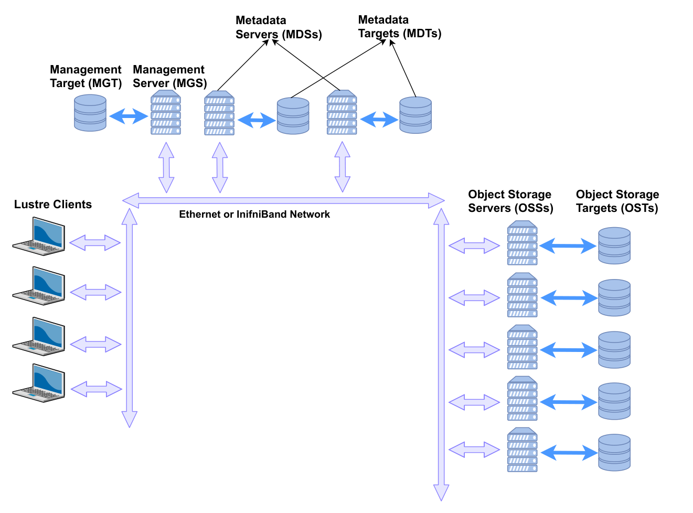

*Figure 1. Lustre file system components in a basic cluster*

1.4 Lustre File Layouts

Lustre stores file data by splitting the file contents into chunks and then storing those chunks across the storage targets. By spreading the file across multiple targets, the file size can exceed the capacity of any one storage target. It also allows clients to access parts of the file from multiple Lustre servers simultaneously, effectively scaling up the bandwidth of the file system. Users have the ability to control many aspects of the file’s layout by means of the lfs setstripe command, and they can query the layout for an existing file using the lfs getstripe command.

File layouts fall into one of two categories:

1. Normal / RAID0 - File data is striped across multiple OSTs in a round-robin manner.

#### Normal (RAID0) Layouts

OSC0 OSC1 OSC2

LOV

1

OST0 OST1 OST2

1 2

4 5

7

File A data

File B data

File C data

Object

3

6

1

2

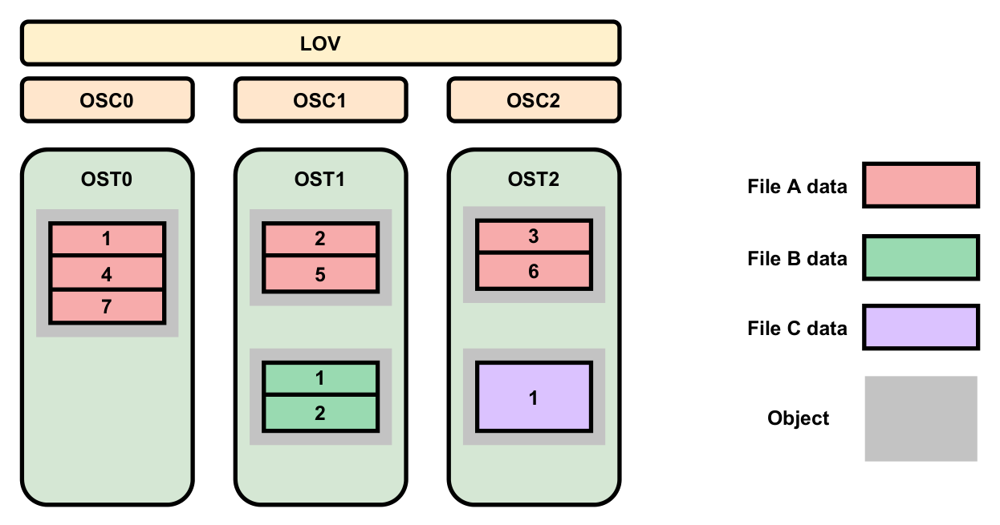

*Figure 2. Normal RAID0 file striping in Lustre*

2. Composite - Complex layouts that involve several components with potentially different striping patterns.

1.4.1 Normal (RAID0) Layouts

A normal layout is characterized by a stripe count and a stripe size. The stripe count determines how many OSTs will be used to store the file data, while the stripe size determines how much data will be written to an OST before moving to the next OST in the layout. As an example, consider the file layouts shown in Figure 2 for a simple file system with 3 OSTs residing on 3 different OSS nodes *. Note that Lustre indexes the OSTs starting at zero.

File A has a stripe count of three, so it will utilize all OSTs in the file system. We will assume that it uses the default Lustre stripe size of 1MB. When File A is written, the first 1MB chunk gets written to OST0. Lustre then writes the second 1MB chunk of the file to OST1 and the third chunk to OST2. When the file exceeds 3 MB in size, Lustre will round-robin back to the first allocated OST and write the fourth 1MB chunk to OST0, followed by OST1, etc. This illustrates how Lustre writes data in a RAID0 manner for a file. It should be noted that although File A has three chunks of data on OST0 (chunks #1, #4, and #7), all these chunks reside in a single object on the backend file system. From Lustre’s point of view, File A consists of three objects, one per OST. Files B and C show layouts with the default Lustre stripe count of one, but only File B uses the default stripe size of 1MB. The layout for File C has been modified to use a larger stripe size of 2MB. If both File B and File C are 2MB in size, File B will be treated as two consecutive chunks written to the same OST whereas File C will be treated as a single chunk. However, this difference is mostly irrelevant since both files will still consist of a single 2MB object on their respective OSTs.

*Ignore the LOV and OSC components for the moment. These are client-related pieces that will not be discussed at this point.

#### Composite Layouts

#### Distributed Namespace

1.4.2 Composite Layouts

A composite layout consists of one or more components each with their own specific layout. The most basic composite layout is a Progressive File Layout (PFL). Using PFL, a user can specify the same parameters used for a normal RAID0 layout but additionally specify a start and end point for that RAID0 layout. A PFL can be viewed as an array of normal layouts each of which covers a consecutive non-overlapping region of the file. PFL allows the data placement to change as the file increases in size, and because Lustre uses delayed instantiation, storage for subsequent components is allocated only when needed. This is particularly useful for increasing the stripe count of a file as the file grows in size.

The concept of a PFL has been extended to include two other layouts: Data on MDT (DoM) and Self Extending Layout (SEL). A DoM layout is specified just like a PFL except that the first component of the file resides on the same MDT as the file’s metadata. This it typically used to store small amounts of data for quick access. A SEL is just like a PFL with the addition that an extent size can be supplied for one or more of the components. When a component is instantiated, Lustre only instantiates part of the component to cover the extent size. When this limit is exceeded, Lustre examines the OSTs assigned to the component to determine if any of them are running low on space. If not, the component is extended by the extent size. However, if an OST does run low on space, Lustre can dynamically shorten the current component and choose a different set of OSTs to use for the next component of the layout. This can safeguard against full OSTs that might generate a ENOSPC error when a user attempts to append data to a file.

Lustre has a feature called File Level Redundancy (FLR) that allows a user to create one or more mirrors of a file, each with its own specific layout (either normal or composite). When the file layout is inspected using lfs getstripe, it appears like any other composite layout. However, the lcme_mirror_id field is used to identify which mirror each component belongs to.

1.4.3 Distributed Namespace

The metatdata for the root of the Lustre file system resides on the primary MDT. By default, the metadata for newly created files and directories will reside on the same MDT as that of the parent directory, so without any configuration changes, the metadata for the entire file system would reside on a single MDT. In recent versions, a featured called Distributed Namespace (DNE) was added to allow Lustre to utilize multiple MDTs and thus scale up metadata operations. DNE was implemented in multiple phases, and DNE Phase 1 is referred to as Remote Directories. Remote Directories allow a Lustre administrator to assign a new subdirectory to a different MDT if its parent directory resides on MDT0. Any files or directories created in the remote directory also reside on the same MDT as the remote directory. This creates a static fan-out of directories from the primary MDT to other MDTs in the file system. While this does allow Lustre to spread overall metadata operations across mutliple servers, operations with any single directory are still constrained by the performance of a single MDS node. The static nature also prevents any sort of dynamic load balancing across MDTs.

DNE Phase 2, also known as Striped Directories, removed some of these limitations. For a striped directory, the metadata for all files and subdirectories contained in that directory are spread across multiple MDTs. Similar to how a file layout contains a stripe count, a striped directory also has a stripe count. This determines how many MDTs will be used to spread out the metadata. However, unlike file layouts which spread data across OSTs in a round-robin manner, a striped directory uses a hash function to calculate the MDT where the metadata should be placed. The upcoming DNE Phase 3 expands upon the ideas in DNE Phase 2 to support the creation of auto-striped directories. An auto-striped directory will start with a stripe

#### File Identifiers and Layout Attributes

### Lustre Software Stack

count of 1 and then dynamically increase the stripe count as the number of files/subdirectories in that directory grows. Users can then utilize striped directories without knowing a priori how big the directory might become or having to worry about choosing a directory stripe count that is too low or too high.

1.4.4 File Identifiers and Layout Attributes

Lustre identifies all objects in the file system through the use of File Identifiers (FIDs). A FID is a 128-bit opaque identifier used to uniquely reference an object in the file system in much the same way that ext4 uses inodes or ZFS uses dnodes. When a user accesses a file, the filename is used to lookup the correct directory entry which in turn provides the FID for the MDT object corresponding to that file. The MDT object contains a set of extended attributes, one of which is called the Layout Extended Attribute (or Layout EA). This Layout EA acts as a map for the client to determine where the file data is actually stored, and it contains a list of the OSTs as well as the FIDs for the objects on those OSTs that hold the actual file data. Figure 3 shows an example of accessing a file with a normal layout of stripe count 3.

FID

Layout EA

OST0 Object A

OST1 Object B

OST2 Object C

Object A Data Stripe 0

Object B Data Stripe 1

Object C Data Stripe 2

OST0

OST1

OST2

Layout EA stored on MDT

Data stored on

OSTs

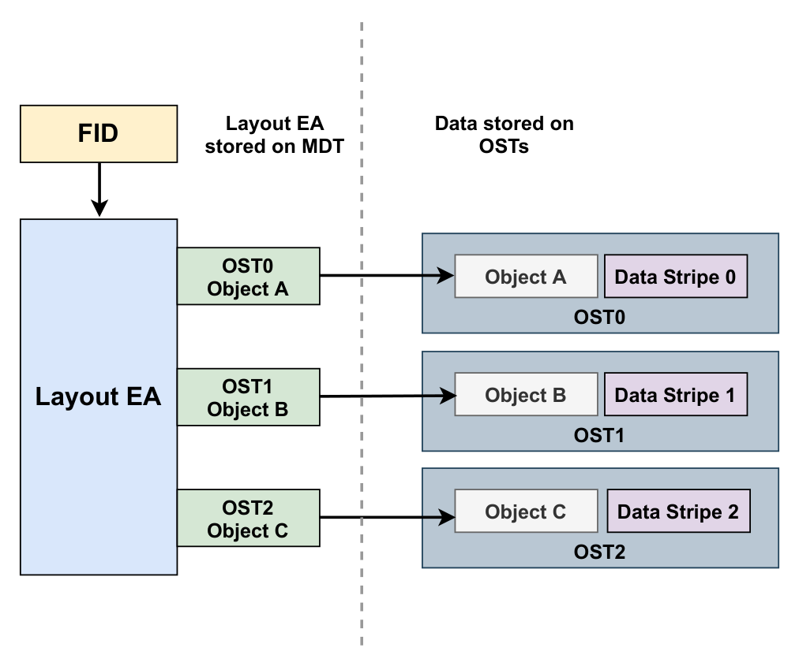

*Figure 3. Using FID to access a file’s Layout EA and corresponding OST objects*

1.5 Lustre Software Stack

The Lustre software stack is composed of several different layered components. To provide context for more detailed discussions later, a basic diagram of these components is illustrated in Figure 4†. The arrows in this diagram represent the flow of a request from a client to the Lustre servers. System calls for

†There are more interactions between components than are shown in the diagram, but this simplified view is presented in order to illustrate some of the key interactions.

operations like read and write go through the Linux Virtual File System (VFS) layer to the Lustre LLITE layer which implements the necessary VFS operations. If the request requires metadata access, it is routed to the Logical Metadata Volume (LMV) that acts as an abstraction layer for the Metadata Client (MDC) components. There is a MDC component for each MDT target in the file system. Similarly, requests for data are routed to the Logical Object Volume (LOV) which acts as an abstraction layer for all of the Object Storage Client (OSC) components. There is an OSC component for each OST target in the file system. Finally, the requests are sent to the Lustre servers by first going through the Portal RPC (PTL-RPC) subsystem and then over the wire via the Lustre Networking (LNet) subsystem.

Requests arriving at the Lustre servers follow the reverse path from the LNet subsystem up through the PTL-RPC layer, finally arriving at either the OSS component (for data requests) or the MDS component (for metadata requests). Both the OSS and MDS components are multi-threaded and can handle requests for multiple storage targets (OSTs or MDTs) on the same server. Any locking requests are passed to the Lustre Distributed Lock Manager (LDLM). Data requests are passed to the OBD Filter Device (OFD) and then to the Object Storage Device (OSD). Metadata requests go from the MDS straight to the OSD. In both cases, the OSD is responsible for interfacing with the backend file system (either ldiskfs or ZFS) through the Linux VFS layer.

VFS

LLITE

LOV LMV

MDC OSC-1 OSC-N

PTL-RPC

LNET

Data Metadata

. . .

VFS

OSD

OFD LDLM

OSS

PTL-RPC

LNET

Data req Lock req

Dispatch req

VFS

OSD

LFSCK LDLM

MDS

PTL-RPC

LNET

Metadata

req

Metadata

lock req

Dispatch req

Client OSS MDS

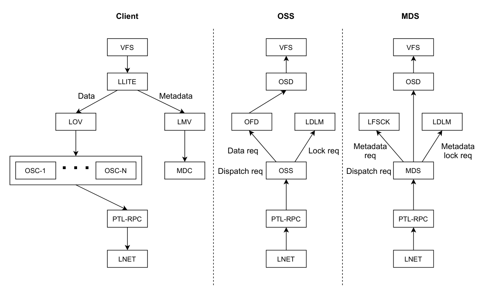

*Figure 4. Basic view of Lustre software stack*

Figure 5 provides a simple illustration of the interactions in the Lustre software stack for a client requesting file data. The Portal RPC and LNet layers are represented by the arrows showing communications between the client and the servers. The client begins by sending a request through the MDC to the MDS to open the file. The MDS server responds with the Layout EA for the file. Using this information, the client can determine which OST objects hold the file data and send requests through the LOV/OSC layer to the OSS servers to access the data.

### Detailed Discussion of Lustre Components

L O

V

OSC

OSC

OSC

LMV

MDC MDC

Object A

data stripe 0

data stripe 3

data stripe 6

Object C

data stripe 2

data stripe 5

data stripe 8

Object B

data stripe 1

data stripe 4

data stripe 7

MDS

OSSs

1 2

3

1

2

3

File open request

Return Layout EA FID (Obj. A, Obj. B, Obj. C)

Read or write objects in parallel

Client

*Figure 5. Lustre I/O operation: Lustre client requesting file data.*

1.6 Detailed Discussion of Lustre Components

The descriptions of key Lustre concepts provided in this overview are intended to provide a basis for the more detailed discussion in subsequent Chapters. The remaining Chapters dive deeper into the following topics:

• Chapter 2. (Tests): Describes the testing framework used to test Lustre functionality and detect regressions.

• Chapter 3. (Utils): Covers command line utilities used to format and configure a Lustre file systems as well as user tools for setting file striping parameters.

• Chapter 4. (MGC): Discusses the MGC subsystem responsible for communications between Lustre nodes and the Lustre management server.

• Chapter 5. (Obdclass): Discusses the obdclass subsystem that provides an abstraction layer for other Lustre components including MGC, MDC, OSC, LOV, and LMV.

• Chapter 6. (Libcfs): Covers APIs used for process management and debugging support.

• Chapter 7. (File Identifiers, FID Location Database, and Object Index): Explains how object identifiers are generated and mapped to data on the backend storage.

This document extensively references parts of Lustre source code maintained by open source community [4].

## TESTS

### Lustre Test Suites

### Terminology

### Testing Lustre Code

2. TESTS

This chapter describes various tests and testing frameworks used to test Lustre functionality and performance.

2.1 Lustre Test Suites

Lustre Test Suites (LTS) is the largest collection of tests used to test Lustre file system. LTS consists of over 1600 tests, organized by their purpose and function. It is mainly composed of bash scripts, C programs and external applications. LTS provides various utilities to create, start, stop and execute tests. LTS can be used to execute test process automatically or in discrete steps. Using LTS the test process can be run as a group of tests or individual tests. LTS also allows to experiment with configurations and features such as ldiskfs, ZFS, DNE and HSM (Hierarchical Storage Manager). Tests in LTS are located in /lustre/tests directory in Lustre source tree and the major components in the test suite are given in Table 3.

Table 3. Lustre Test Suite components

Name Description auster auster is used to run the Lustre tests. It can be used to run groups of tests, individual tests, or sub-tests. It also provides file system setup and cleanup capabilities. acceptance-small.sh The acceptance-small.sh script is a wrapper around auster that runs the test group ‘regression’ unless tests are specified on the command line. functions.sh The functions.sh script provides functions for run_*.sh tests such as run_dd.sh or run_dbench.sh. test-framework.sh The test-framework.sh provides the fundamental functions needed by tests to create, setup, verify, start, stop, and reformat a Lustre file system.

2.2 Terminology

In this Section we describe relevant terminology related to Lustre Test Suites. All scripts and applications packaged as part of the lustre-tests-*.rpm and lustre-iokit-*.rpm are termed as Lustre Test Suites. The individual suites of tests contained in /usr/lib64/lustre/tests directory are termed as Test Suite. An example test suite is sanity.sh. A test suite is composed of Individual Tests. An example of an individual test is test 4 from large-lun.sh test suite. Test suites can be bundled into a group for back-to-back execution (e.g. regression). Some of the LTS test examples include - Regression (sanity, sanityn), Feature Specific (sanity-hsm, sanity-lfsck, ost-pools), Configuration (conf-sanity), Recovery and Failures (recovery-small, replay-ost-single) and so on. Some of the active Lustre unit, feature and regression tests and their short description are given in Table 4.

2.3 Testing Lustre Code

When programming with Lustre, the best practices for testing are test often and test early in the development cycle. Before submitting the code changes to Lustre source tree, developer must ensure that the code passes acceptance-small test suite. To create a new test case, first find the bug that reproduces an

#### Bypassing Failures

Table 4. Lustre unit, feature and regression tests

Name Description conf-sanity A set of unit tests that verify the configuration tolls, and runs Lustre with multiple different setups to ensure correct operation in unusual system configurations. insanity A set of tests that verify the multiple concurrent failure conditions. large-scale Large scale tests that verify version based recovery features. metadata-updates Tests that metadata updates are properly completed when multiple clients delete files and modify the attributes of files. parallel-scale Runs functional tests, performance tests (e.g. IOR), and a stress test (simul). posix Automates POSIX compliance testing. Assuming that the POSIX source is already installed on the system, it sets up loop back ext4 file system, then install, build and run POSIX binaries on ext4. Then runs POSIX again on Lustre and compares results from ext4 and Lustre. recovery-small A set of unit tests that verify RPC replay after communications failure. runtests Simple basic regression tests that verify data persistence across write, unmount, and remount. This is one of the few tests that verifies data integrity across a full file system shutdown and remount, unlike many tests which at most only verify the existence/size of files. sanity A set of regression tests that verify operation under normal operating conditions. This tests a large number of unusual operations that have previously caused functional or data correctness issues with Lustre. Some of the tests are Lustre specific, and hook into the Lustre fault injection framework using lctl set_param fail_loc=X command to activate triggers in the code to simulate unusual operating conditions that would otherwise be difficult or impossible to simulate. sanityn Tests that verify operations from two clients under normal operating conditions. This is done by mounting the same file system twice on a single client, in order to allow a single script/program to execute and verify file system operations on multiple “clients” without having to be a distributed program itself.

issue, fix the bug and then verify the fixed code passes the existing tests. This means that the newly found bug/defect is not covered by the test cases from the test suite. After making sure that any of the existing test cases do not cover the new defect, a new test case can be introduced to exclusively test the bug.

2.3.1 Bypassing Failures

While testing Lustre, if one or more test cases are failing due to an issue not related to the bug that is currently being fixed, bypass option is available for the failing tests. For e.g., to skip sanity.sh sub-tests 36g and 65 and all of insanity.sh set the environment as,

export SANITY_EXCEPT="36g 65" export INSANITY=no

#### Test Framework Options

A single line command can also be used to skip these tests when running acceptance-small test, as shown below.

SANITY_EXCEPT="36g 65" INSANITY=no ./acceptance-small.sh

2.3.2 Test Framework Options

The examples below show how to run a full test or sub-tests from the acceptance-small test suite.

• Run all tests in a test suite with the default setup.

cd lustre/tests sh ./acceptance-small.sh

• Run only recover-small and conf-sanity tests from acceptance-small test suite.

ACC_SM_ONLY="recovery-small conf-sanity" sh ./acceptance-small.sh

• Run only tests 1, 3 and 4 from sanity.sh.

ONLY="1 3 4" sh ./sanity.sh

• skip tests 1 to 30 and run remaining tests in sanity.sh.

EXCEPT="`seq 1 30`" sh sanity.sh

Lustre provides flexibility to easily add new tests to any of its test scripts.

Table 5. Tests in acceptance-small test suite

Name Description RUNTESTS This is a basic regression test with unmount/remount. SANITY Verifies Lustre operation under normal operating conditions. DBENCH Dbench benchmark for simulating N clients to produce the file system load. SANITYN Verifies operations from two clients under normal operating conditions. LFSCK Tests e2fsck and lfsck to detect and fix file system corruption. LIBLUSTRE Runs a test linked to a liblustre client library. CONF_SANITY Verifies various Lustre configurations (including wrong ones), where the system must behave correctly. RECOVERY_SMALL Verifies RPC replay after a communications failure (message loss). INSANITY Tests multiple concurrent failure conditions.

### Acceptance Small (acc-sm) Testing on Lustre

### Lustre Tests Environment Variables

2.4 Acceptance Small (acc-sm) Testing on Lustre

acceptance small (acc-sm) testing for Lustre is used to catch bugs in the early development cycles [6]. The acceptance-small.sh test scripts are located in the lustre/tests directory. acc-sm test suite contains three branches - b1_6 branch (18 tests), b1_8_gate branch (28 tests), and HEAD branch (30 tests). The functionality of some of the commonly used tests in acc-sm suite is listed in Table 5. The order in which tests need to be executed is defined in the acceptance-small.sh script and in each test script.

2.5 Lustre Tests Environment Variables

This Section describes environment variables used to drive the Lustre tests. The environment variables are typically stored in a configuration script in lustre/tests/cfg/$NAME.sh, accessed by NAME=name environment variable within the test scripts. The default configuration for a single-node test is NAME=local, which accesses the lustre/tests/cfg/local.sh configuration file. Some of the important environment variables and their purpose for Lustre cluster configuration are listed in Table 6.

Table 6. Lustre tests environment variables

Variable Purpose Typical Value mds_HOST The network hostname of the primary MDS host. Uses local host name if unset.

mdsnode-1

ost_HOST The network hostname of the primary OSS host. Uses local host name if unset.

ossnode-1

mgs_HOST The network hostname of the primary MGS host. Uses $mds_HOST if unset.

mgsnode

CLIENTS A comma separated list of the clients to be used for testing.

client-1, client-2, client-3 RCLIENTS A comma separated list of the remote clients to be used for testing. One client actually executes the test framework, the other clients are remote clients.

client-1, client-3 (which would imply that client-2 is actually running the test framework.) NETTYPE The network infrastructure to be used in LNet notation.

tcp or o2ib

mdsfailover_HOST If testing high availability, the hostname of the backup MDS that can access the MDT storage.

mdsnode-2

ostfailover_HOST If testing high availability, the hostname of the backup OSS that can access the OST storage.

ossnode-2

MDSCOUNT Number of MDTs to use (valid for Lustre 2.4 and later).

1

MDSSIZE The size of the MDT storage in kilobytes. This can be smaller than the MDT block device, to speed up testing. Use the block device size if unspecified or equal to zero.

200000

MGSNID LNet Node ID if it does not map to the primary address of $mgs_HOST for $NETTYPE.

$mgs_HOST

## UTILS

### Introduction

MGSSIZE The size of the MGT stoarge in kilobytes, if it is separate from the MDT device. This can be smaller than the MGT block device, to speed up testing. Use the block device size if unspecified or equal to zero.

16384

REFORMAT Whether the file system will be reformatted between tests.

true

OSTCOUNT The number of OSTs that are being provided by the OSS on $ost_HOST.

1

OSTSIZE Size of the OST storage in kilobytes. Can be smaller than the OST block device, to speed up testing. Use the block device size if unspecified or equal to zero.

1000000

FSTYPE File system type to use for all OST and MDT devices.

ldiskfs, zfs

FSNAME The Lustre file system name to use for testing. Uses lustre by default.

testfs

MOUNT Mount point to use for the client test file system(s). Defaults to /mnt/$FSNAME if unspecified.

/mnt/testfs

DIR Directory in which to run the Lustre tests. Must be within the mount point specified by $MOUNT. Defaults to $MOUNT if unspecified.

$MOUNT

TIMEOUT Lustre timeout to use during testing, in seconds. Reduced from the default to speed testing.

20

PDSH The parallel shell command to use for running shell operations on one or more remote hosts.

pdsh -w nodes[1-5]

MPIRUN Command to use for launching MPI test programs.

mpirun

3. UTILS

3.1 Introduction

The administrative utilities provided with Lustre software allow to set up Lustre file system in different configurations. Lustre utilities provide a wide range of configuration options for creating a file system on a block device, scaling Lustre file system by adding additional OSTs or clients, changing stripe layout for data etc. Examples of some Lustre utilities include,

• mkfs.lustre - This utility is used to format a disk for a Lustre service.

• tunefs.lustre - This is used to modify configuration information on a Lustre target disk.

• lctl - lctl is used to control Lustre features via ioctl interfaces, including various configuration, maintenance and debugging features.

• mount.lustre - This is used to start Lustre client or server on a target.

### User Utilities

#### lfs

• lfs - lfs is used for configuring and querying options related to files.

In the following Sections we describe various user utilities and system configuration utilities in detail.

3.2 User Utilities

In this section we describe a few important user utilities provided with Lustre [1].

3.2.1 lfs

lfs can be used for configuring and monitoring Lustre file system. Some of most common uses of lfs are, create a new file with a specific striping pattern, determine default striping pattern, gather extended attributes for specific files, find files with specific attributes, list OST information and set quota limits. Some of the important lfs options are shown in Table 7.

Table 7. lfs utility options

Option Description changelog changelog can show the metadata changes happening on MDT. Users can also specify start and end points of the changelog as optional arguments. df df reports the usage of all mounted Lustre file systems. For each Lustre target UUID (Universally Unique Identifier), used and available space on the targets, and mount point are reported. The path option allows users to specify a file system path and if specified df reports usage for the specified file system. find find searches the directory tree rooted at the given directory/file path name for files that match the specified parameters. find can also have various options such as --atime, --mtime, --type, --user etc. For example --atime allows to find files based on last accessed time, similarly --mtime allows to find files based on last modified time. getstripe getstripe obtains and lists striping information for the specified filename or directory. By default, the stripe count, stripe size, pattern, stripe offset, and OST indices and their IDs are returned. For composite layout files all the above fields are displayed for all the components in the layout. setstripe setstripe allows users to create new files with a specific file layout/stripe pattern configuration. Note that changing the stripe layout of an existing file is not possible using setstripe.

A few examples on the usage of lfs utility is shown below.

• Create a file name file1 striped on three OSTs with 32KB on each stripe

$ lfs setstripe -s 32k -c 3 /mnt/lustre/file1

• Show the default stripe pattern on a given directory (dir1).

#### lfs _migrate

#### lctl

#### llog_reader

$ lfs getstripe -d /mnt/lustre/dir1

• List detailed stripe allocation for a give file, file2.

lfs getstripe -v /mnt/lustre/file2

3.2.2 lfs _migrate

The lfs_migrate utility is used to migrate file data between Lustre OSTs. This utility does the migration in two steps. It first copies the specified files to set of temporary files. This can be performed using lfs setstripe options, if specified. It can also optionally verify if the file contents have changed or not. The second step is to then swap the layout between the temporary file and the original file (or even renaming the temporary file to the original filename). lfs_migrate is a tool that helps users to balance or manage space usage among Lustre OSTs.

3.2.3 lctl

The lctl utility is used for controlling and configuring Lustre file system. lctl allows the following capabilities - control Lustre via an ioctl interface, setup Lustre in various configurations, and access debugging features of Lustre. Issuing lctl command on Lustre client gives a prompt that allows to execute lctl sub-commands. Some of the common commands associated with lctl are dl, device, network up/down, list_nids, ping nid, and conn_list.

To get help with lctl commands lctl help <COMMAND> or lctl --list-commands can be used.

Another important use of lctl command is accessing Lustre parameters. lctl get, set_param provides a platform-independent interface to the Lustre tunables. When the file system is running, lctl set_param command can be used to set parameters temporarily on the affected nodes. The syntax of this command is,

lctl set_param [-P] [-d] obdtype.obdname.property=value

In this command, -P option is used to set parameters permanently, -d deletes permanent parameters. To obtain current Lustre parameter settings, lctl get_param command can be used on the desired node. For example,

lctl get_param [-n] obdtype.obdname.parameter

Some of the common commands associated with lctl and their description are shown in Table 8.

3.2.4 llog_reader

The llog_reader utility translates a Lustre configuration log into human-readable form. The syntax of this utility is,

llog_reader filename

#### mkfs.lustre

### mount.lustre

Table 8. lctl utility options

Option Description dl Shows all the local Lustre OBD devices. list_nids Prints all NIDs (Network Identifiers) on the local node. LNet must be running to execute this command. ping nid Checks the LNet layer connectivity between Lustre components via an LNet ping. This can use LNet fabric such as TCP or IB. network up | down Starts or stops LNet, or selects a network type for other lctl LNet commands. device devname Selects the specified OBD device. All subsequent commands depend on the device being set. conn_list Prints all the connected remote NIDs for a given network type.

llog_reader reads and parses the binary formatted Lustre’s on-disk configuration logs. To examine a log file on a stopped Lustre server, mount its backing file system as ldiskfs or zfs, then use llog_reader to dump the log file’s contents. For example,

mount -t ldiskfs /dev/sda /mnt/mgs llog_reader /mnt/mgsCONFIGS/tfs-client

This utility can also be used to examine the log files when Lustre server is running. The ldiskfs-enabled debugfs utility can be used to extract the log file, for example,

debugfs -c -R 'dump CONFIGS/tfs-client /tmp/tfs-client' /dev/sds llog_reader /tmp/tfs-client

3.2.5 mkfs.lustre

The mkfs.lustre utility is used to format a Lustre target disk. The syntax of this utility is,

mkfs.lustre target_type [options] device

where target_type can be OST, MDT, networks to which to restrict this OST/MDT and MGS. After formatting, the disk using mkfs.lustre, it can be mounted to start the Lustre service. Two important options that can be specified along with this command are --backfstype=fstype and --fsname=filesystem_name. The former forces a particular format for the backing file system such as ldiskfs (default) or zfs and the later specifies the Lustre file system name of which the disk is part of (default name for file system is lustre).

3.3 mount.lustre

The mount.lustre utility is used to mount the Lustre file system on a target or client. The syntax of this utility is,

mount -t lustre [-o options] device mountpoint

After mounting users can use the Lustre file system to create files/directories and execute several other Lustre utilities on the file system. To unmount a mounted file system the umount command can be used as

### tunefs.lustre

## MGC

### Introduction

shown below.

umount device mountpoint

Some of the important options used along with this utility are discussed below with the help of examples.

• The following mount command mounts Lustre on a client at the mount point /mnt/lustre with MGS running on a node with nid 10.1.0.1@tcp.

mount -t lustre 10.1.0.1@tcp:/lustre /mnt/lustre

• To start the Lustre metadata service from /dev/sda on a mount point /mnt/mdt the following command can be used.

mount -t lustre /dev/sda /mnt/mdt

3.4 tunefs.lustre

The tunefs.lustre utility is used to modify configuration information on a Lustre target disk. The syntax of this utility is,

tunefs.lustre [options] /dev/device

However the tunefs utility does not reformat the disk or erase the contents on the disk. The parameters specified using tunefs are set in addition to the old parameters by default. To erase old parameters and use newly specified parameters, use the following options with tunefs.

tunefs.lustre --erase-params --param=new_parameters

4. MGC

4.1 Introduction

The Lustre client software involves primarily three components, management client (MGC), a metadata client (MDC), and multiple object storage clients (OSCs), one corresponding to each OST in the file system. Among this, the management client acts as an interface between Lustre virtual file system layer and Lustre management server (MGS). Lustre targets register with MGS to register information with MGS while Lustre clients contact MGS to retrieve information from it.

The major functionalities of MGC are Lustre log handling, Lustre distributed lock management and file system setup. MGC is the first obd device created in Lustre obd device life cycle. An obd device in Lustre provides a level of abstraction on Lustre components such that generic operations can be applied without knowing the specific devices you are dealing with. The remaining Sections in this Chapter describe MGC module initialization, various MGC obd operations and log handling in detail. In the following Sections we will be using the terms clients and servers to represent service clients and servers created to communicate between various components in Lustre. Whereas the physical nodes representing Lustre’s clients and servers will be explicitly mentioned as ‘Lustre clients’ and ‘Lustre servers’.

### MGC Module Initialization

### MGC obd Operations

4.2 MGC Module Initialization

When the MGC module initializes, it registers MGC as an obd device type with Lustre using class_register_type() as shown in Source Code 1. Obd device data and metadata operations are defined using the obd_ops and md_ops structures respectively. Since MGC deals with metadata in Lustre, it has only obd_ops operations defined. However the metadata client (MDC) has both metadata and data operations defined since the data operations are used to implement Data on Metadata (DoM) functionality in Lustre. The class_register_type() function passes &mgc_obd_ops, NULL, false, LUSTRE_MGC _NAME, and NULL as its arguments. LUSTRE_MGC_NAME is defined as “mgc” in include/obd.h.

Source Code 1. class_register_type() function defined in obdclass/genops.c

int class_register_type(const struct obd_ops *dt_ops,

const struct md_ops *md_ops, bool enable_proc, struct lprocfs_vars *vars, const char *name, struct lu_device_type *ldt)

4.3 MGC obd Operations

MGC obd operations are defined by mgc_obd_ops structure as shown in Source Code 2. Note that all MGC obd operations are defined as function pointers. This type of programming style avoids complex switch cases and provides a level of abstraction on Lustre components such that the generic operations can be applied without knowing the details of specific obd devices.

Source Code 2. mgc_obd_ops structure defined in mgc/mgc_request.c

static const struct obd_ops mgc_obd_ops = { .o_owner = THIS_MODULE, .o_setup = mgc_setup, .o_precleanup = mgc_precleanup, .o_cleanup = mgc_cleanup, .o_add_conn = client_import_add_conn, .o_del_conn = client_import_del_conn, .o_connect = client_connect_import, .o_disconnect = client_disconnect_export, .o_set_info_async = mgc_set_info_async, .o_get_info = mgc_get_info, .o_import_event = mgc_import_event, .o_process_config = mgc_process_config, };

In Lustre one of the ways two subsystems share data is with the help of obd_ops structure. To understand how the communication between two subsystems work let us take an example of mgc_get_info() from the mgc_obd_ops structure. The subsystem llite makes a call to mgc_get_info() (in llite/llite_lib.c) by passing a key (KEY_CONN_DATA) as an argument. But notice that llite invokes obd_get_info() instead of mgc_get_info(). obd_get_info() is defined in include/obd_class.h as shown in Figure 6. We can see that this function invokes an OBP macro by passing an obd_export device structure and a get_info operation. The definition of this macro concatenates o with op (operation) so that the resulting function call becomes o_get_info().

### mgc_setup()

So how does llite make sure that this operation is directed specifically towards MGC obd device? obd_get_info() from llite/llite_lib.c has an argument called sbi->ll_md_exp. The sbi structure is a type of ll_sb_info defined in llite/llite_internal.h (refer Figure 7). And the ll_md_exp field from ll_sb_info is a type of obd_export structure defined in include/lustre_export.h. obd_export structure has a field *exp_obd which is an obd_device structure (defined in include/obd.h). Another MGC obd operation obd_connect() retrieves export using the obd_device structure. Two functions involved in this process are class_name2obd() and class_num2obd() defined in obdclass/genops.c.

In the following Sections we describe some of the important MGC obd operations in detail.

4.4 mgc_setup()

mgc_setup() is the initial routine that gets executed to start and setup the MGC obd device. In Lustre MGC is the first obd device that is being setup as part of the obd device life cycle process. To understand when mgc_setup() gets invoked in the obd device life cycle, let us explore the workflow from the Lustre module initialization.

obd_get_info( ...,          sbi->ll_md_exp, ... );

llite/llite_lib.c

.... #define OBP(dev, op)    (dev)-> obd_type->typ_dt_ops->o_ ## op

.... ....

static inline int obd_get_info( ..., struct obd_export *exp, ... ) { .... rc = OBP(exp->exp_obd, get_info) ( ... ); ... }

include/obd_class.h

static const struct obd_ops mgc_obd_ops = { ....  .o_get_info = mgc_get_info, .... }

mgc/mgc_request.c

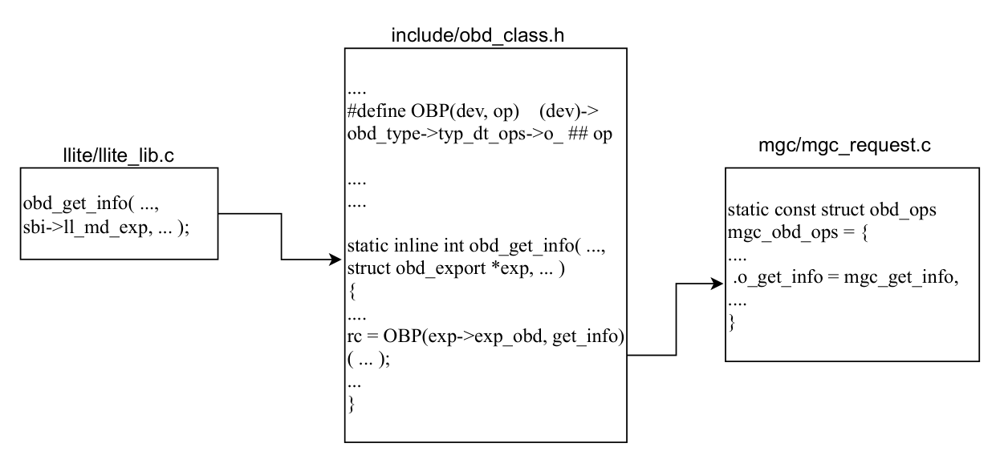

*Figure 6. Communication between llite and mgc through obdclass.*

struct ll_sb_info { ... struct obd_export  *ll_md_exp; ...  } *sbi

struct obd_export { ... struct obd_device  *exp_obd; ...  }

struct obd_device { ... struct obd_type                 *obd_type; struct obd_uuid                  obd_uuid; char obd_name[MAX_OBD_NAME]; ...  }

llite/llite_internal.h include/lustre_export.h include/obd.h

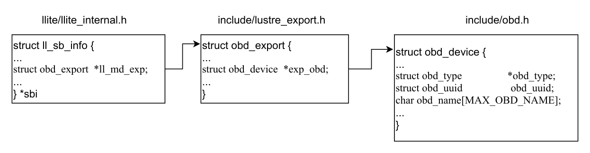

*Figure 7. Data structures involved in the communication between mgc and llite subsystems.*

The Lustre module initialization begins from the lustre_init() routine defined in llite/super25.c (shown in Figure 8). This routine is invoked when the ‘lustre’ module gets loaded. lustre_init() invokes register_filesystem(&lustre_fs_type) which registers ‘lustre’ as the file system and adds it to the list of file systems the kernel is aware of for mount and other syscalls. lustre_fs_type structure is defined in the same file as shown in Source Code 3.

When a user mounts Lustre, the lustre_mount() gets invoked as evident from this structure. lustre_mount() is defined in the same file and which in turn calls mount_nodev() routine. The mount_nodev() invokes its call back function lustre_fill_super() which is also defined in llite/super25.c. lustre_fill_super() is the entry point for the mount call from the Lustre client into Lustre.

lustre_fill_super() invokes lustre_start_mgc() defined in obdclass/obd_mount.c. This sets up the MGC obd device to start processing startup logs. The lustre_start_simple() routine called here starts the MGC obd device (defined in obdclass/obd_mount.c). lustre_start_simple() eventually leads to the invocation of obdclass specific routines class_attach() and class_setup() (described in detail in the Chapter 5.) with the help of a do_lcfg() routine that takes obd device name and a lustre configuration command (lcfg_command) as arguments. Various lustre configuration commands are LCFG_ATTACH, LCFG_DETACH, LCFG_SETUP, LCFG_CLEANUP and so on. These are defined in include/uapi/linux/lustre/lustre_cfg.h as shown in Source Code 4.

lustre_init() register_filesystem(

&lustre_fs_type) lustre_mount() mount_nodev()

lustre_fill_super() lustre_start_mgc() lustre_start_simple() do_lcfg(obdname, ...,

LCFG_SETUP, ... );

class_process_config() class_setup() obd_setup() mgc_setup()

Linux kernel

function

called when user

calls mount

kernel function to mount a file system Lustre module

initialization

call back of mount_nodev() Set up mgc obd to process startup logs class lifecycle starts obd device lifecycle

starts

Process configuration

commands

calls specific obd

device setup

calls mgc_setup() using OBP macro

MGC obd device

specific setup

*Figure 8. mgc_setup() call graph starting from Lustre file system mounting.*

The first lcfg_command that is being passed to do_lcfg() routine is LCFG_ATTACH which will result in the invocation of obdclass function class_attach(). We will describe class_attach() in detail in Chapter 5. The second lcfg_command passed to do_lcfg() function is LCFG_SETUP which will result in the invocation of mgc_setup() eventually. do_lcfg() calls class_process_config() (defined in obdclass/obd_config.c) and passes the lcfg_command that it received. In case of LCFG_SETUP command the class_setup() routine gets invoked. This is defined in the same file and its primary duty is to create hashes and self export and call obd device specific setup. The device specific setup call is in turn

#### Operation

### Lustre Log Handling

invoked through another routine called obd_setup(). obd_setup() is defined in include/obd_class.h as an inline function in the same way obd_get_info() is defined. obd_setup() calls the device specific setup routine with the help of the OBP macro (refer Section 4.3 and Figure 6). Here, in case of MGC obd device mgc_setup() defined as part of the mgc_obd_ops structure (shown in Source Code 2) gets invoked by the obd_setup() routine. Note that the yellow colored blocks in Figure 8 will be referenced again in Chapter 5. to illustrate the lifecycle of the MGC obd device.

Source Code 3. lustre_fs_type structure defined in llite/super25.c

static struct file_system_type lustre_fs_type = { .owner = THIS_MODULE, .name = "lustre", .mount = lustre_mount, .kill_sb = lustre_kill_super, .fs_flags = FS_RENAME_DOES_D_MOVE, };

Source Code 4. Lustre configuration commands defined in include/uapi/linux/lustre/lustre_cfg.h

enum lcfg_command_type { LCFG_ATTACH = 0x00cf001, /**< create a new obd instance */ LCFG_DETACH = 0x00cf002, /**< destroy obd instance */ LCFG_SETUP = 0x00cf003, /**< call type-specific setup */ LCFG_CLEANUP = 0x00cf004, /**< call type-specific cleanup

*/ LCFG_ADD_UUID = 0x00cf005, /**< add a nid to a niduuid */ . . . . . };

4.4.1 Operation

mgc_setup() first adds a reference to the underlying Lustre PTL-RPC layer. Then it sets up an RPC client for the obd device using client_obd_setup() (defined in ldlm/ldlm_lib.c). Next mgc_llog_init() initializes Lustre logs which will be processed by MGC at the MGS server. These logs are also sent to the Lustre client and the client side MGC mirrors these logs to process the data. The tunable parameters persistently set at MGS are sent to MGC and Lustre logs processed at the MGC initializes these parameters. In Lustre the tunables have to be set before Lustre logs are processed and mgc_tunables_init() helps to initialize these tunables. Few examples of the tunables set by this function are conn_uuid, uuid, ping and dynamic_nids and can be viewed in /sys/fs/lustre/mgc directory by logging into any Lustre client. kthread_run() starts an mgc_requeue_thread which keeps reading the lustre logs as the entries come in. A flowchart showing the mgc_setup() workflow is shown in Figure 10.

4.5 Lustre Log Handling

Lustre extensively makes use of logging for recovery and distributed transaction commits. The logs associated with Lustre are called ‘llogs’ and config logs, startup logs and change logs correspond to various kinds of llogs. As described in Chapter 3. Section 3.2.4, the llog_reader utility can be used to read these Lustre logs. When a Lustre target registers with MGS, the MGS constructs a log for the target.

#### Log Processing in MGC

### mgc_precleanup() and mgc_cleanup()

Similarly, a lustre-client log is created for the Lustre client when it is mounted. When a user mounts the Lustre client, it triggers to download the Lustre config logs on the client. As described earlier MGC subsystem is responsible for reading and processing the logs and sending them to Lustre clients and Lustre servers.

4.5.1 Log Processing in MGC

The lustre_fill_super() routine described in Section 4.4 makes a call to ll_fill_super() function defined in llite/llite_lib.c. This function initializes a config log instance specific to the super block passed from lustre_fill_super(). Since the same MGC may be used to follow multiple config logs (e.g. ost1, ost2, Lustre client), the config log instance is used to keep the state for a specific log. Afterwards lustre_fill_super() invokes lustre_process_log() which gets a config log from MGS and starts processing it. lustre_process_log() gets called for both Lustre clients and Lustre servers and it continues to process new statements appended to the logs. It first resets and allocates lustre_cfg_bufs (which temporarily store log data) and calls obd_process_config() which eventually invokes the obd device specific mgc_process_config() (as shown in Figure 9) with the help of OBP macro. The lcfg_command passed to mgc_process_config() is LCFG_LOG_START which gets the config log from MGC, starts processing it and adds the log to list of logs to follow. config_log_add() defined in the same file accomplishes the task of adding the log to the list of active logs watched for updates by MGC. Few other important log processing functions in MGC are - mgc_process_log (that gets a configuration log from the MGS and processes it), mgc_process_recover_nodemap_log (called if the Lustre client was notified for target restarting by the MGS), and mgc_apply_recover_logs (applies the logs after recovery).

lustre_process_log(): Gets a config log from MGS and processes it

obd_process_config(): Calls mgc device specific process_config

mgc_process_config():  LCFG_LOG_START gets the config log from the MGS, processes it to start any services, and adds it to the list logs to watch

include/obd_class.h obdclass/obd_mount.c

mgc/mgc_request.c

*Figure 9. mgc_process_config() call graph*

4.6 mgc_precleanup() and mgc_cleanup()

Cleanup functions are important in Lustre in case of file system unmounting or any unexpected errors during file system setup. The class_cleanup() routine defined in obdclass/obd_config.c starts the process of shutting down an obd device. This invokes mgc_precleanup() (through obd_precleanup()) which makes sure that all the exports are destroyed before shutting down the obd device. mgc_precleanup() first decrements the mgc_count that was incremented during mgc_setup(). The mgc_count keeps the count of the running MGC threads and makes sure not to shut down any threads prematurely. Next it waits for any requeue thread to gets completed and calls obd_cleanup_client_import(). obd_cleanup_client_import() destroys client side import

### mgc_import_event()

interface of the obd device. Finally mgc_precleanup() invokes mgc_llog_fini() which cleans up the lustre logs associated with the MGC. The log cleaning is accomplished by llog_cleanup() routine defined in obdclass/llog_obd.c.

mgc_cleanup() function deletes the profiles for the last MGC obd using class_del_profiles() defined in obdclass/obd_config.c. When MGS sends a buffer of data to MGC, the lustre profiles helps to identify the intended recipients of the data. Next the lprocfs_obd_cleanup() routine (defined in obdclass/lprocfs_status.c) removes sysfs and debugfs entries for the obd device. It then decrements the reference to PTL-RPC layer and finally calls client_obd_cleanup(). This function (defined in ldlm/ldlm_lib.c) makes the obd namespace point to NULL, destroys the client side import interface and finally frees up the obd device using OBD_FREE macro. Figure 10 shows the workflows for both setup and cleanup routines in MGC parallely. The class_cleanup() routine defined in obd_config.c starts the MGC shut down process. Note that after the obd_precleanup(), uuid-export and nid-export hashtables are freed up and destroyed. uuid-export HT stores uuids for different obd devices where as nid-export HT stores ptl-rpc network connection information.

ptlrpc_addref()

client_obd_setup()

mgc_llog_init()

mgc_tunables_init()

kthread_run( mgc_requeue_thread)

stop mgc_requeue thread

obd_cleanup_client_

import()

mgc_llog_fini()

class_del_profiles() (only for the last MGC)

lprocfs_obd_cleanup()

ptlrpcd_decref()

client_obd_cleanup()

mgc_setup()

mgc_precleanup() and mgc_cleanup()

*Figure 10. mgc_setup() vs. mgc_cleanup()*

4.7 mgc_import_event()

The mgc_import_event() function handles the events reported at the MGC import interface. The type of import events identified by MGC are listed in obd_import_event enum defined in include/lustre_import.h as shown in Source Code 5. Client side imports are used by the clients to

## OBDCLASS

### Introduction

communicate with the exports on the server (for instance if MDS wants to communicate with MGS, MDS will be using its client import to communicate with MGS’ server side export). More detailed description of import and export interfaces on obd device is given in Chapter 5.

Source Code 5. obd_import_event enum defined in include/lustre_import.h

enum obd_import_event { IMP_EVENT_DISCON = 0x808001, IMP_EVENT_INACTIVE = 0x808002, IMP_EVENT_INVALIDATE = 0x808003, IMP_EVENT_ACTIVE = 0x808004, IMP_EVENT_OCD = 0x808005, IMP_EVENT_DEACTIVATE = 0x808006, IMP_EVENT_ACTIVATE = 0x808007, };

Some of the remaining obd operations for MGC such as client_import_add_conn(), client_import_del_conn(), client_connect_import() and client_disconnect_export() will be explained in obdclass and ldlm Chapters.

5. OBDCLASS

5.1 Introduction

The obdclass subsystem in Lustre provides an abstraction layer that allows generic operations to be applied on Lustre components without having the knowledge of specific components. MGC, MDC, OSC, LOV, LMV are examples of obd devices in Lustre that make use of the obdclass generic abstraction layer. The obd devices can be connected in different ways to form client-server pairs for internal communication and data exchange in Lustre. Note that the client and server referred here are service clients and servers roles temporarily assumed by the obd devices but not physical nodes representing Lustre clients and Lustre servers.

Obd devices in Lustre are stored internally in an array defined in obdclass/genops.c as shown in Source Code 6. The maximum number of obd devices in Lustre per node is limited by MAX_OBD_DEVICES defined in include/obd.h (shown in Source Code 7). The obd devices in the obd_devs array are indexed using an obd_minor number (see Source Code 8). An obd device can be identified using its minor number, name or uuid. A uuid is a unique identifier that Lustre assigns for obd devices. lctl dl utility (described in Chapter 3. Section 3.2.3) can be used to view all local obd devices and their uuids on Lustre clients and Lustre servers.

Source Code 6. obd_devs array defined in obdclass/genops.c

static struct obd_device *obd_devs[MAX_OBD_DEVICES];

Source Code 7. MAX_OBD_DEVICES defined in include/obd.h

#define MAX_OBD_DEVICES 8192

### obd_device Structure

5.2 obd_device Structure

The structure that defines an obd device is shown in Source Code 8.

Source Code 8. obd_device structure defined in include/obd.h

struct obd_device {

struct obd_type *obd_type; __u32 obd_magic; int obd_minor; struct lu_device *obd_lu_dev; struct obd_uuid obd_uuid; char obd_name[MAX_OBD_NAME]; unsigned long

obd_attached:1, obd_set_up:1, . . . . . obd_stopping:1, obd_starting:1, obd_force:1, . . . . . struct rhashtable obd_uuid_hash; struct rhltable obd_nid_hash; struct list_head obd_nid_stats; struct list_head obd_exports; struct list_head obd_unlinked_exports; struct list_head obd_delayed_exports; struct obd_export *obd_self_export; struct obd_export *obd_lwp_export; struct kset obd_kset; struct kobj_type obd_ktype; . . . . .

};

The first field in this structure is obd_type (shown in Source Code 11) that defines the type of the obd device - a metadata or bulk data device or both. obd_magic is used to identify data corruption with an obd device. Lustre assigns a magic number to the obd device during its creation phase and later asserts it in different parts of the source code to make sure that it returns the same magic number to ensure data integrity. As described in previous Section obd_minor is the index of the obd device in obd_devs array. An lu_device entry indicates if the obd device is a real device such as an ldiskfs or zfs based block device. obd_uuid and obd_name fields are used for uuid and name of the obd device as the field names suggest. obd_device structure also includes various flags to indicate the current status of the obd device. Some of those are obd_attached (completed attach), obd_set_up (finished setup), abort_recovery (recovery expired), obd_stopping (started cleanup), obd_starting (started setup) and so on. obd_uuid_hash and obd_nid_hash are uuid-export and nid-export hash tables for the obd device respectively. An obd device is also associated with several linked lists pointing to obd_nid_stats,

### MGC Life Cycle

obd_exports, obd_unlinked_exports and obd_delayed_exports. Some of the remaining relevant fields of this structure are obd_exports, kset and kobject device model abstractions, timeouts for recovery, proc entries, directory entry, procfs and debugfs variables.

5.3 MGC Life Cycle

As described in Chapter 4. MGC is the first obd device setup and started by Lustre in the obd device life cycle. To understand the lifecycle of MGC obd device let us start from the generic file system mount function vfs_mount(). vfs_mount() is directly invoked by the mount system call from the user and handles the generic portion of mounting a file system. It then invokes file system specific mount function, that is lustre_mount() in case of Lustre. The lustre_mount() defined in llite/llite_lib.c invokes the kernel function mount_nodev() (as shown in Source Code 9) which invokes lustre_fill_super() as its call back function.

Source Code 9. lustre_mount() function defined in llite/llite_lib.c

static struct dentry *lustre_mount(struct file_system_type *fs_type, int flags,

const char *devname, void *data) {

return mount_nodev(fs_type, flags, data, lustre_fill_super); }

lustre_fill_super() function is the entry point for the mount call into Lustre. This function initializes lustre superblock, which is used by the MGC to write a local copy of config log. The lustre_fill_super() routine calls ll_fill_super() which initializes a config log instance specific for the superblock. The config_llog_instance structure is defined in include/obd_class.h as shown in Source Code 10. The cfg_instance field in this structure is unique to this superblock. This unique cfg_instance is obtained using ll_get_cfg_instance() function defined in include/obd_class.h. The config_llog_instance structure also has a uuid (obtained from obd_uuid field of ll_sb_info structure defined in llite/llite_internal.h) and a callback handler defined by the function class_config_llog_handler(). We will come back to this callback handler later in the MGC life cycle process. The color coded blocks in Figure 11 were also part of mgc_setup() call graph shown in Figure 8 in Chapter 4..

Source Code 10. config_llog_instance structure is defined in include/obd_class.h

struct config_llog_instance {

unsigned long cfg_instance; struct super_block *cfg_sb; struct obd_uuid cfg_uuid; llog_cb_t cfg_callback; int cfg_last_idx; /* for partial llog processing */ int cfg_flags; __u32 cfg_lwp_idx; __u32 cfg_sub_clds; };

The file system name field (ll_fsinfo) of ll_sb_info structure is populated by copying the profile name obtained using the get_profile_name() function. get_profile_name() defined in

include/lustre_disk.h obtains a profile name corresponding to the mount command issued from the user from the lustre_mount_data structure.

Then ll_fill_super() then invokes the lustre_process_log() function (see Figure 11) which gets the config logs from MGS and starts processing them. This function is called from both Lustre clients and Lustre servers and it will continue to process new statements appended to the logs. lustre_process_log() is defined in obdclass/obd_mount.c. The three parameters passed to this function are superblock, logname and config log instance. The config instance is unique to the super block which is used by the MGC to write to the local copy of the config log and the logname is the name of the llog to be replicated from the MGS. The config log instance is used to keep the state for the specific config log (can be from ost1, ost2, Lustre client etc.) and is added to the MGC’s list of logs to follow. lustre_process_log() then calls obd_process_config() that uses the OBP macro (refer Section 4.3) to call MGC specific mgc_process_config() function. mgc_process_config() gets the config log from the MGS and processes it to start any services. Logs are also added to the list of logs to watch.

vfs_mount() lustre_fill_super() ll_fill_super()

lustre_process_

log() obd_process_

config() mgc_process_

config()

config_log_add()

mgc_process_log() mgc_process_

cfg_log()

lu_env_init()

llog_get_context()

mgc_llog_local_

copy()

class_config_parse_

llog()

llog_init_handle()

class_config_llog_

handler()

*Figure 11. Obd device life cycle workflow for MGC*

We now describe the detailed workflow of mgc_process_config() by describing the functionalities of each sub-function that it invokes. The config_log_add() function categorizes the data in config log based on if the data is related to - ptl-rpc layer, configuration parameters, nodemaps and barriers. The log data related to each of these categories is then copied to memory using the function config_log_find_or_add(). mgc_process_config() next calls mgc_process_log() and it gets a config log from MGS and processes it. This function is called for both Lustre clients and Lustre servers to

process the configuration log from the MGS. The MGC enqueues a DLM lock on the log from the MGS and if the lock gets revoked, MGC will be notified by the lock cancellation callback that the config log has changed, and will enqueue another MGS lock on it, and then continue processing the new additions to the end of the log. Lustre prevents the updation of the same log by multiple processes at the same time. The mgc_process_log() then calls mgc_process_cfg_log() function which reads the log and creates a local copy of the log on the Lustre client or Lustre server. This function first initializes an environment and a context using lu_env_init() and llog_get_context() respectively. The mgc_llog_local_copy() routine is used to create a local copy of the log with the environment and context previously initialized. Real time changes in the log are parsed using the function class_config_parse_llog(). Under read only mode, there will be no local copy or local copy will be incomplete, so Lustre will try to use remote llog first.

The class_config_parse_llog() function is defined in obdclass/obd_config.c. The arguments passed to this function are the environment, context and config log instance initialized in mgc_process_cfg_log() function and the config log name. The first log that is being parsed by the class_config_parse_llog() function is start_log. start_log contains configuration information for various Lustre file system components, obd devices and file system mounting process. class_config_parse_llog() first acquires a lock on the log to be parsed using a handler function (llog_init_handle()). It then continues the processing of the log from where it last stopped till the end of the log. To process the logs two entities are used by this function - 1) an index to parse through the data in the log, and 2) a callback function that processes and interprets the data. The call back function can be a generic handler function like class_config_llog_handler() or it can be customized. Note that this is the call back handler initialized by the config_llog_instance structure as previously mentioned (see Source Code 10). Additionally, the callback function provides a config marker functionality that allows to inject special flags for selective processing of data in the log. The callback handler also initializes lustre_cfg_bufs to temporarily store the log data. Afterwards the following actions take place in this function: translate log names to obd device names, append uuid with obd device name for each Lustre client mount and finally attach the obd device.

Each obd device then sets up a key to communicate with other devices through secure ptl-rpc layer. The rules for creating this key are stored in the config log. The obd device then creates a connection for communication. Note that the start log contains all state information for all configuration devices and the lustre configuration buffer (lustre_cfg_bufs) stores this information temporarily. The obd device then use this buffer to consume log data. The start log resembles to a virtual log file and it is never stored on the disk. After creating a connection, the handler performs data mining on the logs to extract information (uuid, nid etc.) required to form Lustre config_logs. The parameter llog_rec_hdr (passed with class_config_llog_handler() function) decides what type of information should be parsed from the logs. For instance OBD_CFG_REC indicates the handler to scan obd device configuration information and CHANGELOG_REC asks to parse for changelog records. Using the extracted nid and uuid information about the obd device, the handler now invokes class_process_config() routine. This function repeats the cycle of obd device creation for other obd devices. Notice that the only obd device exists in Lustre at this point in the life cycle is MGC. The class_process_config() function calls the generic obd class functions such as class_attach(), class_add_uuid(), class_setup() depending upon the lcfg_command that it receives for a specific obd device.

### Obd Device Life Cycle

#### class_attach()

5.4 Obd Device Life Cycle

In this Section we describe the work flow of various obd device life cycle functions such as class_attach(), class_setup(), class_precleanup(), class_cleanup(), and class_detach().

5.4.1 class_attach()

The first method that is called in the life cycle of an obd device is class_attach() and the corresponding lustre config command is LCFG_ATTACH. The class_attach() method is defined in obdclass/obd_config.c. It registers and adds the obd device to the list of obd devices. The list of obd devices is defined in obdclass/genops.c using *obd_devs[MAX_OBD_DEVICES]. The attach function first checks if the obd device type being passed is valid. The obd_type structure is defined in include/obd.h (as shown in Source code 11). Two types of operations defined in this structure are obd_ops (i.e., data operations) and md_ops (i.e., metadata operations). These operations determine if the obd device is destined to perform data or metadata operations or both.

The lu_device_type field of obd_type structure makes sense only for real block devices such as zfs and ldiskfs osd devices. Furthermore the lu_device_type differentiates metadata and data devices using the tags LU_DEVICE_MD and LU_DEVICE_DT respectively. An example of an lu_device_type structure defined for ldiskfs osd_device_type is shown in Source Code 12.

Source Code 11. obd_type structure defined in include/obd.h

struct obd_type {

const struct obd_ops *typ_dt_ops; const struct md_ops *typ_md_ops; struct proc_dir_entry *typ_procroot; struct dentry *typ_debugfs_entry; #ifdef HAVE_SERVER_SUPPORT

bool typ_sym_filter; #endif

atomic_t typ_refcnt; struct lu_device_type *typ_lu; struct kobject typ_kobj; };

Source Code 12. lu_device_type structure for ldiskfs osd_device_type defined in osdldiskfs/osd_handler.c

static struct lu_device_type osd_device_type = { .ldt_tags = LU_DEVICE_DT, .ldt_name = LUSTRE_OSD_LDISKFS_NAME, .ldt_ops = &osd_device_type_ops, .ldt_ctx_tags = LCT_LOCAL, };

The class_attach() then calls a class_newdev() function which creates, allocates a new obd device and initializes it. A complete workflow of the class_attach() function is shown in Figure 12. The class_get_type() function invoked by class_newdev() registers already created obd device and loads

#### obd_export Structure

the obd device module. All obd device loaded has metadata or data operations (or both) defined for them. For instance the LMV obd device has its md_ops and obd_ops defined in structures lmv_md_ops and lmv_obd_ops respectively. These structures and the associated operations can be seen in lmv/lmv_obd.c file. The obd_minor initialized here is the index of the obd device in obd_devs array.

The obd device then creates a self export using the function class_new_export_self(). The class_new_export_self() function invokes a __class_new_export() function which creates a new export, adds it to the hash table of exports and returns a pointer to it. Note that a self export is created only for a client obd device. The reference count for this export when created is 2, one for the hash table reference and the other for the pointer returned by this function itself. This function populates the obd_export structure defined in include/lustre_export.h (shown in Source Code 13). Various fields associated with this structure are explained in the next Section. Two functions that are used to increment and decrement the reference count for obd devices are class_export_get() and class_export_put() respectively. The last part of class_attach() is registering/listing the obd device in the obd_devs array which is done through class_register_device() function. This functions assigns a minor number to the obd device that can be used to lookup the device in the array.

class_process_config()

Calls generic obdclass

routines based on lfcg

command passed.

class_attach() Registers obd device

and adds it to obd_devs array.

LCFG_ ATTACH

obdclass/obd_config.c

class_newdev() Creates, allocates and initializes anew

obd device.

class_get_type() Registers obd device and loads the module.

class_new_export_self()

Creates a self export for

the obd device.

struct obd_export {   struct portals_handle exp_handle;   atomic_t exp_rpc_count;   struct obd_uuid exp_client_uuid;   . . . . . }

class_register_device()

Lists the obd device in

the obd_devs array.

obd_devs[ ] obd_minor

obdclass/genops.c

obdclass/genops.c

obdclass/genops.c

obdclass/genops.c obdclass/obd_config.c

*Figure 12. Workflow of class_attach() function in obd device lifecycle*

5.4.2 obd_export Structure

This Section describes some of the relevant fields of the obd_export structure (shown in Source Code 13) that represents a target side export connection (using ptlrpc layer) for obd devices in Lustre. This is also used to connect between layers on the same node when there is no network connection between the nodes. For every connected client there exists an export structure on the server attached to the same obd device. Various fields of this structure are described below.

• exp_handle - On connection establishment, the export handle id is provided to client and the

subsequent client RPCs contain this handle id to identify which export they are talking to.

• Set of counters described below is used to track where export references are kept. exp_rpc_count is the number of RPC references, exp_cb_count counts commit callback references, exp_replay_count is the number of queued replay requests to be processed and exp_locks_count keeps track of the number of lock references.

Source Code 13. obd_export structure defined in include/lustre_export.h

struct obd_export {

struct portals_handle exp_handle; atomic_t exp_rpc_count; atomic_t exp_cb_count; atomic_t exp_replay_count; atomic_t exp_locks_count; #if LUSTRE_TRACKS_LOCK_EXP_REFS

struct list_head exp_locks_list; spinlock_t exp_locks_list_guard; #endif

struct obd_uuid exp_client_uuid; struct list_head exp_obd_chain; struct work_struct exp_zombie_work; struct list_head exp_stale_list; struct rhash_head exp_uuid_hash; struct rhlist_head exp_nid_hash; struct hlist_node exp_gen_hash; struct list_head exp_obd_chain_timed; struct obd_device *exp_obd; struct obd_import *exp_imp_reverse; struct nid_stat *exp_nid_stats; struct ptlrpc_connection *exp_connection; __u32 exp_conn_cnt; struct cfs_hash *exp_lock_hash; struct cfs_hash *exp_flock_hash; };

• exp_locks_list maintains a linked list of all the locks and exp_locks_list_guard is the spinlock that protects this list.

• exp_client_uuid is the UUID of client connected to this export.

• exp_obd_chain links all the exports on an obd device.

• exp_zombie_work is used when the export connection is destroyed.

• The structure also maintains several hash tables to keep track of uuid-exports, nid-exports and last received messages in case of recovery from failure. (exp_uuid_hash, exp_nid_hash and exp_gen_hash).

• The obd device for this export is defined by the pointer *exp_obd.

#### class_setup()

• *exp_connection - This defines the portal rpc connection for this export.

• *exp_lock_hash - This lists all the ldlm locks granted on this export.

• This structure also has additional fields such as hashes for posix deadlock detection, time for last request received, linked list to replay all requests waiting to be replayed on recovery, lists for RPCs handled, blocking ldlm locks and special union to deal with target specific data.

5.4.3 class_setup()

The primary duties of class_setup() routine are create hashtables and self-export, and invoke the obd type specific setup() function. As an initial step this function obtains the obd device from obd_devs array using obd_minor number and asserts the obd_magic number to make sure data integrity. Then it sets the obd_starting flag to indicate that the set up of this obd device has started (refer Source Code 8). Next the uuid-export and nid-export hashtables are setup using Linux kernel builtin functions rhashtable_init() and rhltable_init(). For the nid-stats hashtable Lustre uses its custom implementation of hashtable namely cfs_hash.

class_setup() Creates hash tables and

self export and invokes

obd device specific

setup().

obdclass/obd_config.c

obd_starting = 1

obd_setup() Pre-stage before

invoking device

specific setup.

struct obd_device, LCFG_SETUP

client_obd_setup()

Invoked by specific

client obd device.

struct client_obd {   struct rw_semaphore cl_sem;   struct obd_uuid cl_target_uuid;   struct obd_import cl_import;   . . . . . }

include/obd.h

ldlm_get_ref()

ptlrpc_init_client()

class_new_import()

Device specific setup such as mgc_setup(),

lwp_setup() etc.

struct obd_import {   refcount_t imp_refcount;   struct ptlrpc_connection *imp_connection;   struct ptlrpc_client *imp_client;    . . . . . }

include/lustre_import.h

client_import_add_connection()

ptlrpc_uuid_to_connection()

uuid

ldlm_namespace_new()

ldlm/ ldlm_lib.c

include/obd_class.h

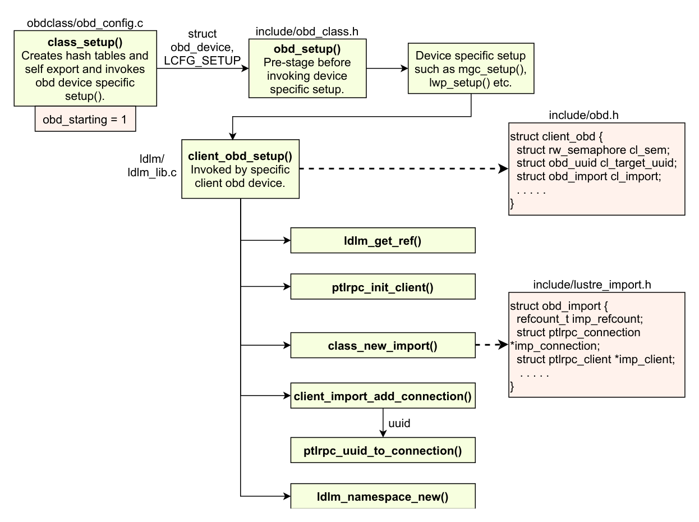

*Figure 13. Workflow of class_setup() function in obd device lifecycle*

A generic device setup function obd_setup() defined in include/obd_class.h is then invoked by

class_setup() by passing the odb_device structure populated and the corresponding lcfg command (LCFG_SETUP). This leads to the invocation of device specific setup routines from various subsystems such as mgc_setup(), lwp_setup(), osc_setup_common() and so on. All of these setup routines invoke a client_obd_setup() routine that acts as a pre-setup stage before the creation of imports for the clients as shown in Figure 13. The client_obd_setup() (see ldlm/ldlm_lib.c) function populates client_obd structure defined in include/obd.h (shown in Source Code 14). Note that the client_obd_setup() routine is called only in case of client obd devices like osp, lwp, mgc, osc, and mdc.

Source Code 14. client_obd structure defined in include/obd.h

struct client_obd {

struct rw_semaphore cl_sem; struct obd_uuid cl_target_uuid; struct obd_import *cl_import; /* ptlrpc connection state */ size_t cl_conn_count; __u32 cl_default_mds_easize; __u32 cl_max_mds_easize; struct cl_client_cache *cl_cache; atomic_long_t *cl_lru_left; atomic_long_t cl_lru_busy; atomic_long_t cl_lru_in_list; . . . . . };

client_obd structure is mainly used for page cache and extended attributes management. It comprises of fields pointing to obd device uuid and import interfaces, counter to keep track of client connections and fields to represent maximum and default extended attribute sizes. Few other fields used for cache handling are cl_cache (LRU cache for caching OSC pages), cl_lru_left (available LRU slots per OSC cache), cl_lru_busy (number of busy LRU pages), and cl_lru_in_list (number of LRU pages in the cache for this client_obd). Please also refer source code to see additional fields in the structure.

The client_obd_setup() then obtains an LDLM lock to setup the LDLM layer references for this client obd device. Further it sets up ptl-rpc request and reply portals using the ptlrpc_init_client() routine defined in ptlrpc/client.c. The client_obd structure defines a pointer to the obd_import structure defined in include/lustre_import.h. The obd_import structure represents ptl-rpc imports that are client-side view of remote targets. A new import connection for the obd device is created using the function class_new_import(). The class_new_import() method populates obd_import structure defined in include/lustre_import.h (see Source Code 15).

The obd_import structure represents the client side view of a remote target. This structure mainly consists of fields representing ptl-rpc layer client and active connections on it, client side ldlm handle and various flags representing the status of imports such as imp_invalid, imp_deactive, and imp_replayable. There are also linked lists pointing to lists of requests that are retained for replay, waiting for a reply, and waiting for recovery to complete.

The client_obd_setup() then adds an initial connection for the obd device to the ptl-rpc layer by invoking client_import_add_conn() method. This method uses ptl-rpc layer specific routine ptlrpc_uuid_to_connection() to return a ptl-rpc connection specific for the uuid passed for the remote

#### class_precleanup() and class_cleanup()

obd device. Finally client_obd_setup() creates a new ldlm namespace for the obd device that it just set up using the ldlm_namespace_new() routine. This completes the setup phase in the obd device lifecycle and the newly setup obd device can now be used for communications between subsystems in Lustre.

Source Code 15. obd_import structure defined in include/lustre_import.h

struct obd_import { refcount_t imp_refcount; struct lustre_handle imp_dlm_handle; struct ptlrpc_connection *imp_connection; struct ptlrpc_client *imp_client; struct list_head imp_replay_list; struct list_head imp_sending_list; struct list_head imp_delayed_list; enum lustre_imp_state imp_state; struct obd_import_conn *imp_conn_current; unsigned long imp_invalid:1, imp_deactive:1, imp_replayable:1, . . . . . };

5.4.4 class_precleanup() and class_cleanup()

Lustre unmount process begins from the ll_umount_begin() function defined as part of the lustre_super_operations structure (shown in Source Code 16). The ll_umount_begin() function accepts a super_block from which the metadata and data exports for the obd_device are extracted using the class_exp2obd() routine. The obd_force flag from obd_device structure is set to indicate that cleanup will be performed even though the obd reference count is greater than zero. Then it periodically checks and waits to finish until there are no outstanding requests from vfs layer.

Source Code 16. lustre_super_operations structure defined in llite/super25.c const struct super_operations lustre_super_operations = { .alloc_inode = ll_alloc_inode, .destroy_inode = ll_destroy_inode, .drop_inode = ll_drop_inode, .evict_inode = ll_delete_inode, .put_super = ll_put_super, .statfs = ll_statfs, .umount_begin = ll_umount_begin, .remount_fs = ll_remount_fs, .show_options = ll_show_options, };

The cleanup cycle then invokes the ll_put_super() routine defined in llite/llite_lib.c. This

unmount()

system call

ll_unmount_begin()

Extracts exports and waits for outstanding requests from vfs layer

ll_put_super() Obtains config instance

and profilename and

initiates cleanup.

llite/llite_lib.c

ll_get_cfg_instance()

Obtains config

instance.

get_profile_name() Obtains profilename.

lustre_end_log() Stops following updates for the config log instance.

superblock, profilename, config log instance

include/obd_class.h

superblock superblock

obd_process_config()

Generic process config

function

obd_device = mgc,

LCFG_LOG_END

mgc_process_config()

Initiates termination of

config log for the obd

device.

config_log_end() Finds the config log and stops watching updates for

the log.

class_devices_in_group()

Iterates through obd devices and sets obd_force

Initiates class_cleanup()

llite/llite_lib.c

include/lustre_disk.h obdclass/obd_mount.c obdclass/genops.c

include/obd_class.h

mgc/mgc_request.c

mgc/mgc_request.c

obd_force = 1

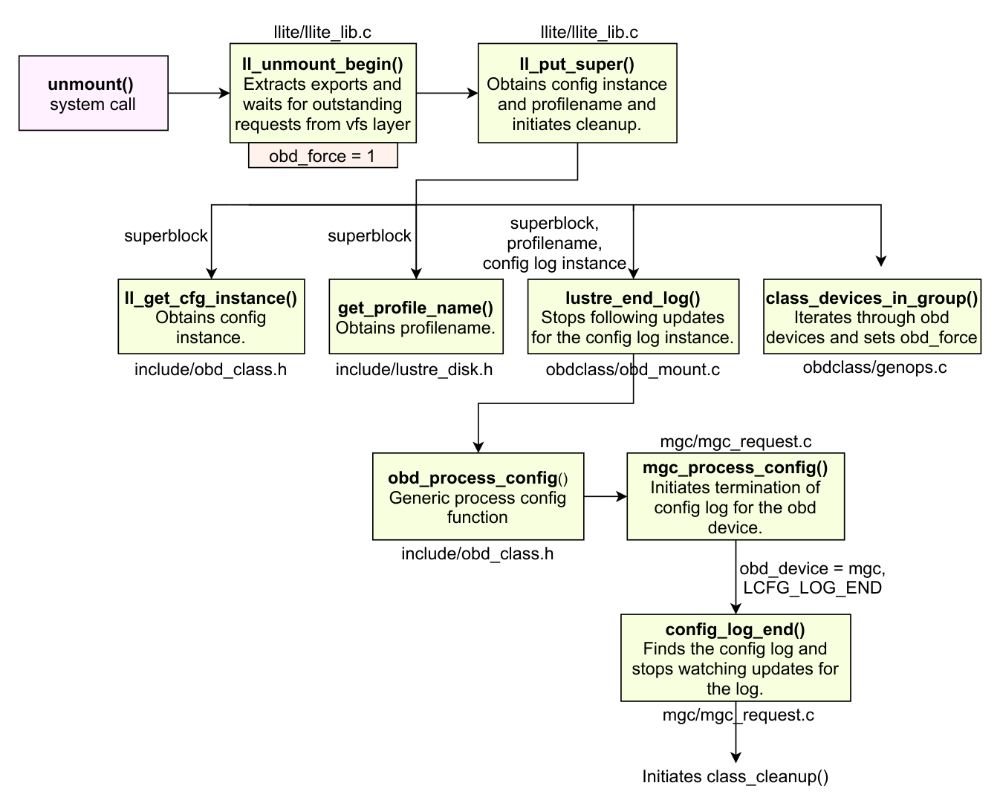

*Figure 14. Lustre unmounting and initiation of class_cleanup() in obd device lifecycle.*

function obtains the cfg_instance and profile name corresponding to the super_block using ll_get_cfg_instance() and get_profile_name() functions respectively. Next it invokes lustre_end_log() routine by passing the super block, profile name and a config llog instance initialized here. The lustre_end_log() function defined in obdclass/obd_mount.c ensures to stop following updates for the config log corresponding to the config llog instance passed. lustre_end_log() resets lustre config buffers and calls obd_process_config() by passing the lcfg command LCFG_LOG_END and MGC as obd device. This results in the invocation of mgc_process_config() which calls config_log_end() method when LCFG_LOG_END is passed. The config_log_end() finds the config log and stops watching updates for the log.

Further ll_put_super() invokes class_devices_in_group() method which iterates through the obd devices with same group uuid and sets the obd_force flag for all the devices. Afterwards it calls class_manual_cleanup() routine which invokes obdclass functions class_cleanup() and class_detach() in the order. The class_cleanup() is invoked through class_process_config() by passing the LCFG_CLEANUP command.

class_cleanup() starts the shut down process of the obd device. This first sets the obd_stopping flag to indicate that cleanup has started and then waits for any already arrived connection requests to complete. Once all the requests are completed it disconnects all the exports using class_disconnect_exports() function (shown in Figure 14). It then invokes obd generic function obd_precleanup() that ensures that all exports get destroyed. obd_precleanup() calls device specific precleanup function (e.g. mgc_precleanup()). class_cleanup() then destroys the uuid-export, nid-export, and nid-stats hashtables and invokes class_decref() function. class_decref() function asserts that all exports are destroyed.

class_manual_cleanup()

Performs cleanup and detachment of obd device

class_process_config() class_cleanup() Starts obd device shut down process

LCFG_ CLEANUP

obd_stopping = 1

class_disconnect_exports() Disconnects all the exports for

the obd device

obd_precleanup() Makes sure all exports

are destroyed.

Device specific

precleanup is

invoked.

class_decref()

class_process_config() class_detach()

LCFG_ DETACH

obd_attached = 0

class_unregister_device() class_decref()

class_unlink_export() class_export_put() class_free_dev()

obd_cleanup() Device specific cleanup is invoked. class_put_type()

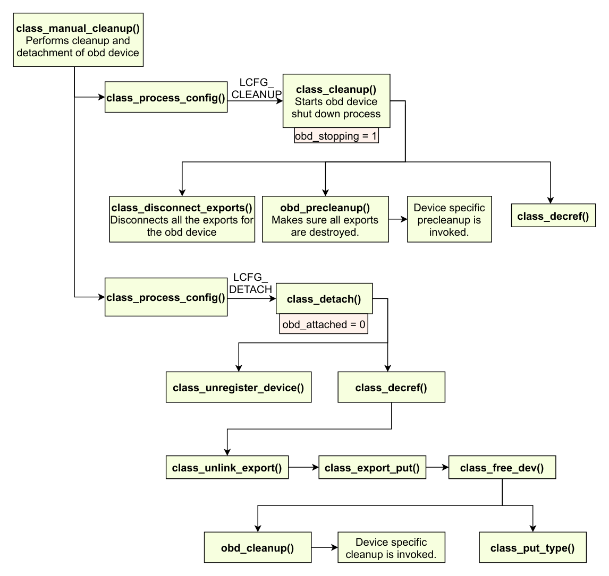

*Figure 15. class_cleanup() workflow in obd device lifecycle.*

class_manual_cleanup() then invokes class_detach() function by passing the LCFG_DETACH command. class_detach() (defined in obdclass/obd_config.c) makes the obd_attached flag to zero and unregisters the device (frees the slot in obd_devs array) using class_unregister_device() function. Next it invokes the class_decref() routine that destroys the last export (self export) by calling class_unlink_export() method. class_unlink_export() calls class_export_put() that frees

### Imports and Exports

the obd device using class_free_dev() function. class_free_dev() calls device specific cleanup through obd_cleanup() and finally invokes class_put_type() routine that unloads the module. This is the end of the life cycle for the obd device. An end to end workflow of class_cleanup() routine is illustrated in Figure 15.

5.5 Imports and Exports

Obd devices in Lustre are components including lmv, lod, lov, mdc, mdd, mdt, mds, mgc, mgs, obdecho, ofd, osc, osd-ldsikfs, osd-zfs, osp, lwp, ost, and qmt. Among these mdc, mgc, osc, osp, and lwp are client obd devices meaning two server odb device components such as mdt and ost need one client device to establish communication between them. This is also applicable in case of a Lustre client communicating with Lustre servers. Client side obd devices consist of self export and import whereas server side obd devices consist of exports and reverse imports. A client obd device sends requests to the server using its import and the server receives requests using its export as illustrated in Figure 16. The imports on server obd devices are called reverse imports because they are used to send requests to the client obd devices. These requests are mostly callback requests sent by the server to clients infrequently. And the client uses it’s self export to receive these callback requests from the server.

obd_device

obd_exports export

import

export

import

export

import

obd_device

client_obd self_export

import

Server side obd device

(e.g. OST, MDS, MDT)

Client side obd device

(e.g. OSC, MDC, OSP)

Client server requests

Other client Other client

Callback requests

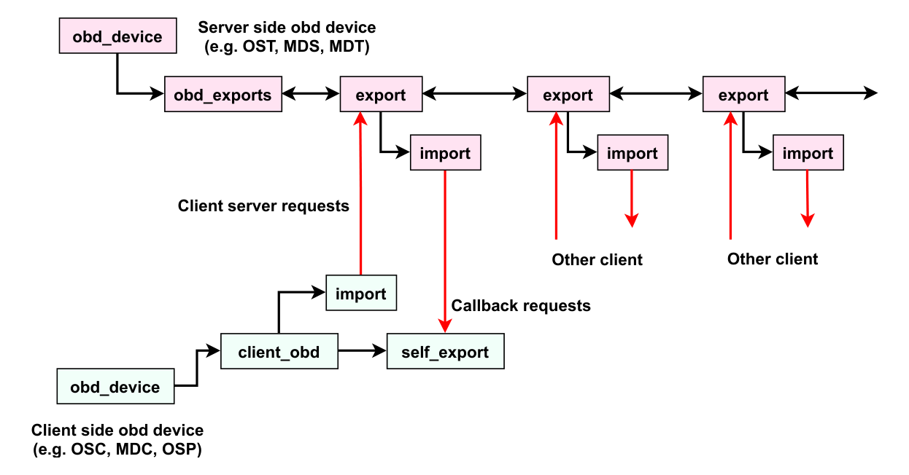

*Figure 16. Import and export pair in Lustre*

For any two obd devices to communicate with each other, they need an import and export pair [3]. For instance, let us consider the case of communication between ost and mdt obd devices. Logging into an OSS node and doing lctl dl shows the obd devices on the node and associated details (obd device status, type, name, uuid etc.). Examining /sys/fs/lustre directory can also show the obd devices corresponding to various device types. An example of the name of an obd device created for the data exchange between OST5 and MDT2 will be MDT2-lwp-OST5. This means that the client obd device that enables the communication here is lwp. A conceptual view of the communication between ost and mdt through import and export connections is shown in Figure 17. LWP (Light Weight Proxy) obd device manages connections

### Useful APIs in Obdclass

established from ost to mdt, and mdts to mdt0. An lwp device is used in Lustre to send quota and FLD query requests (see Chapter 7.). Figure 17 also shows the communication between mdt and ost through osp client obd device.

The obdfilter directory from /proc/fs/lustre lists osts present on the OSS node. All of these osts have their export connections listed in the nid format in their respective exports directory. The export connection information is stored in a file called export in each of the export connections directory. Viewing the export file corresponding to MDT2 shows the following fields.

• name: Shows the name of the ost device.

• client: The nid of the client export connection. (nid of MDT2 in this example.)

• connect_flags: Flags representing various configurations for the lnet and ptl-rpc connections between the obd devices.

• connect_data: Includes fields such as flags, instance, target_version, mdt_index and target_index.

• export_flags: Configuration flags for export connection.

• grant: Represents target specific export data.

OSS

OST

import

export

import self export

OSP

MDS

LWP

self export import

export

MDT

import

Server obd target

Server obd target Client obd device

Client obd device

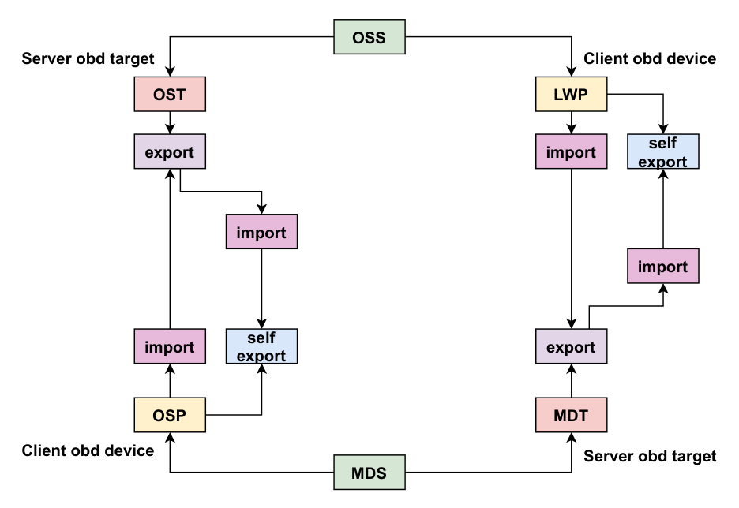

*Figure 17. Communication between ost and mdt server obd devices in Lustre*

5.6 Useful APIs in Obdclass

All obdclass related function declarations are listed in the file include/obd_class.h and their definitions can be seen in obdclass/genops.c Here we list some of the important obdclass function prototypes and their purpose for quick reference.

## LIBCFS

### Introduction

### Data Encryption Support in Libcfs

• class_newdev() - Creates a new obd device, allocates and initializes it.

• class_free_dev() - Frees an obd device.

• class_unregister_device() - Unregisters an obd device by feeing its slot in obd_devs array.

• class_register_device() - Registers obd device by finding a free slot in in obd_devs array and filling it with the new obd device.

• class_name2dev() - Returns minor number corresponding to an obd device name.

• class_name2obd() - Returns pointer to an obd_device structure corresponding to the device name.

• class_uuid2dev() - Returns minor number of an obd device when uuid is provided.

• class_uuid2obd() - Returns obd_device structure pointer corresponding to a uuid.

• class_num2obd() - Returns obd_device structure corresponding to a minor number.

• class_dev_by_str() - Finds an obd device in the obd_devs array by name or uuid. Also increments obd reference count if its found.

• get_devices_count() - Gets the count of the obd devices in any state.

• class_find_client_obd() - Searches for a client obd connected to a target obd device.

• class_export_destroy() - Destroys and export connection of an obd device.

• __class_new_export() - Creates a new export for an obd device and add its to the hash table of exports.

6. LIBCFS

6.1 Introduction

Libcfs provides APIs comprising of fundamental primitives for process management and debugging support in Lustre. Libcfs is used throughout LNet, Lustre, and associated utilities. Its APIs define a portable run time environment that is implemented consistently on all supported build targets [6]. Besides debugging support libcfs provides APIs for failure injection, Linux kernel compatibility, encryption for data, Linux 64 bit time addition, log collection using tracefile, string parsing support and capabilities for querying and manipulating CPU partition tables. Libcfs is the first module that Lustre loads. The module loading function can be found in tests/test-framework.sh script as shown in Source Code 17. When Lustre is mounted, mount_facet() function gets invoked and it calls load_modules() function. load_modules() invokes load_modules_local() that loads Lustre modules libcfs, lnet, obdclass, ptl-rpc, fld, fid, and lmv in the same order.

In the following Sections we describe libcfs APIs and functionalities in detail.

6.2 Data Encryption Support in Libcfs

Lustre implements two types of encryption capabilities - data on the wire and data at rest. Encryption over the wire protects data transfers between the physical nodes from Man-in-the-middle attacks. Whereas the

objective of encrypting data at rest is protection against storage theft and network snooping. Lustre 2.14+ releases provides encryption for data at rest. Data is encrypted on Lustre client before being sent to servers and decrypted upon reception from the servers. That way applications running on Lustre client see clear text and servers see only encrypted text. Hence access to encryption keys is limited to Lustre clients.

Source Code 17. Libcfs module loading script (tests/test-framework.sh)

mount_facet() { . . . . . module_loaded lustre || load_modules }

load_modules() { . . . . . load_modules_local }

load_modules_local() { . . . . . load_module ../libcfs/libcfs/libcfs . . . . . load_module ../lnet/lnet/lnet . . . . . load_module obdclass/obdclass load_module ptlrpc/ptlrpc load_module ptlrpc/gss/ptlrpc_gss load_module fld/fld load_module fid/fid load_module lmv/lmv . . . . . }

Data (at rest) encryption related algorithm and policy flags and data structures are defined in libcfs/include/uapi/linux/llcrypt.h (see Source Code 18 for encryption algorithm macros). Definition of an encryption key structure shown in Source Code 19 includes a name, the raw key and size fields. Maximum size of the encryption key is limited to LLCRYPT_MAX_KEY_SIZE. This file also contains ioctl definitions to add and remove encryption keys, and obtain encryption policy, and key status.

Source Code 18. Encryption algorithm macros defined in libcfs/include/uapi/linux/llcrypt.h

#define LLCRYPT_MODE_AES_256_XTS 1 #define LLCRYPT_MODE_AES_256_CTS 4 #define LLCRYPT_MODE_AES_128_CBC 5 #define LLCRYPT_MODE_AES_128_CTS 6

While userland headers for data encryption are listed in libcfs/include/uapi/linux/llcrypt.h, the corresponding kernel headers can be found in libcfs/include/libcfs/crypto/llcrypt.h. Some of the kernel APIs for data encryption are shown in Source code 20. The definitions of these APIs can be

found in libcfs/libcfs/crypto/hooks.c.

Support functions for data encryption are defined in libcfs/libcfs/crypto/crypto.c file. These include:

• llcrypt_release_ctx() - Releases a decryption context.

• llcrypt_get_ctx() - Gets a decryption context.

• llcrypt_free_bounce_page() - Frees a ciphertext bounce page.

• llcrypt_crypt_block() - Encrypts or decrypts a single file system block of file contents.

• llcrypt_encrypt_pagecache_blocks() - Encrypts file system blocks from a page cache page.

• llcrypt_encrypt_block_inplace() - Encrypts a file system block in-place.

• llcrypt_decrypt_pagecache_blocks() - Decrypts file system blocks in a page cache page.

• llcrypt_decrypt_block_inplace() - Decrypts a file system block in-place.

Setup and cleanup functions (llcrypt_init(), llcrypt_exit()) for file system encryption are also defined here. fname.c implements functions to encrypt and decrypt filenames, allocate and free buffers for file name encryption and to convert a file name from disk space to user space. keyring.c and keysetup.c implement functions to manage cryptographic master keys and policy.c provides APIs to find supported policies, check the equivalency of two policies and policy context management.

Source Code 19. llcrypt_key structure defined in libcfs/include/uapi/linux/llcrypt.h

#define LLCRYPT_MAX_KEY_SIZE 64 struct llcrypt_key { __u32 mode; __u8 raw[LLCRYPT_MAX_KEY_SIZE]; __u32 size; };

APIs and data structures that provide support for data encryption over the wire are listed in libcfs/include/libcfs/libcfs_crypto.h. The data structures include definitions for hash algorithm type, name, size and key and enum for various hash algorithms such as ALG_CRC32C, ALG_MD5, ALG_SHA1, ALG_SHA512 etc. Key APIs that help with data encryption are listed below.

• cfs_crypto_hash_type() - This function returns hash algorithm related information for the specified algorithm identifier. Hash information includes algorithm name, initial seed and hash size.

• cfs_crypto_hash_name() - This returns hash name for hash algorithm identifier.

• cfs_crypto_hash_digestsize() - Returns digest size for hash algorithm type.

• cfs_crypto_hash_alg() - Finds hash algorithm ID for the specified algorithm name.

• cfs_crypto_crypt_type() - Returns crypt algorithm information for the specified algorithm identifier.

• cfs_crypto_crypt_name() - Returns crypt name for crypt algorithm identifier.

### CPU Partition Table Management

• cfs_crypto_crypt_keysize() - Returns key size for crypto algorithm type.

• cfs_crypto_crypt_alg() - Finds crypto algorithm ID for the specified algorithm name.

Current version of Lustre supports only file name encryption whereas in future Lustre plans to extend the encryption capability for file contents as well.

6.3 CPU Partition Table Management

Libcfs includes APIs and data structures that help with CPU partition table management in Lustre. A CPU partition is a virtual processing unit and can have 1-N cores or 1-N NUMA nodes. Therefore a CPU partition is also viewed as a pool of processors.

Source Code 20. Kernel APIs for data encryption defined in libcfs/include/libcfs/crypto/llcrypt.h

//Prepares for a rename between possibly-encrypted directories static inline int llcrypt_prepare_rename(struct inode *old_dir,

struct dentry *old_dentry, struct inode *new_dir, struct dentry *new_dentry, unsigned int flags) //Prepares to lookup a name in a possibly-encrypted directory static inline int llcrypt_prepare_lookup(struct inode *dir,

struct dentry *dentry, struct llcrypt_name *fname)

// Prepares to change a possibly-encrypted inode's attributes static inline int llcrypt_prepare_setattr(struct dentry *dentry,

struct iattr *attr) //Prepares to create a possibly-encrypted symlink static inline int llcrypt_prepare_symlink(struct inode *dir,

const char *target, unsigned int len, unsigned int max_len, struct llcrypt_str *disk_link) //Encrypts the symlink target if needed static inline int llcrypt_encrypt_symlink(struct inode *inode,

const char *target, unsigned int len, struct llcrypt_str *disk_link)

A CPU partition table (CPT) consists of a set of CPU partitions. CPTs can have two modes of operation, NUMA and SMP denoted by CFS_CPU_MODE_NUMA and CFS_CPU_MODE_SMP respectively. Users can specify total number of CPU partitions while creating a CPT and ID of a CPU partition always starts from 0. For example: if there are 8 cores in the system, creating a CPT:

with cpu_npartitions=4: core[0, 1] = partition[0], core[2, 3] = partition[1] core[4, 5] = partition[2], core[6, 7] = partition[3]

cpu_npartitions=1: core[0, 1, ... 7] = partition[0]

Users can also specify CPU partitions by a string pattern.

cpu_partitions="0[0,1], 1[2,3]" cpu_partitions="N 0[0-3], 1[4-8]"

The first character “N” means following numbers are NUMA IDs. By default, Lustre modules should refer to the global cfs_cpt_tab, instead of accessing hardware CPUs directly, so concurrency of Lustre can be configured by cpu_npartitions of the global cfs_cpt_tab.

Source Code 21 and 22 show data structures that define CPU partition and CPT. A CPU partition consists of fields representing CPU mask (cpt_cpumask) and node mask (*cpt_nodemask) for the partition, NUMA distance between CPTs (*cpt_distance), spread rotor for NUMA allocator (cpt_spread_rotor) and NUMA node if cpt_nodemask is empty (cpt_node). Number of CPU partitions, structure representing partition tables and masks to represent all CPUs and nodes are the significant fields in the cfs_cpt_table structure.

Source Code 21. cfs_cpu_partition structure defined in libcfs/libcfs/libcfs_cpu.c

struct cfs_cpu_partition { cpumask_var_t cpt_cpumask; nodemask_t *cpt_nodemask; unsigned int *cpt_distance; unsigned int cpt_spread_rotor; int cpt_node; };

Source Code 22. cfs_cpt_table structure defined in libcfs/libcfs/libcfs_cpu.c

struct cfs_cpt_table {

unsigned int ctb_spread_rotor; unsigned int ctb_distance; int ctb_nparts; struct cfs_cpu_partition *ctb_parts; int *ctb_cpu2cpt; cpumask_var_t ctb_cpumask; int *ctb_node2cpt; nodemask_t *ctb_nodemask; };

Libcfs provides the following APIs to access and manipulate CPU partitions and CPTs.

• cfs_cpt_table_alloc() - Allocates a CPT given the number of CPU partitions.

• cfs_cpt_table_free() - Frees a CPT corresponding to the given reference.

• cfs_cpt_table_print() - Prints a CPT corresponding to the given reference.

• cfs_cpt_number() - Returns number of CPU partitions in a CPT.

### Debugging Support and Failure Injection

### Additional Supporting Software in Libcfs

## File Identifiers, FID Location Database, and Object Index

### File Identifier (FID)

• cfs_cpt_online() - returns the number of online CPTs.

• cfs_cpt_distance_calculate() - Calculates the maximum NUMA distance between all nodes in the from_mask and all nodes in the to_mask.

Additionally libcfs includes functions to initialize and remove CPUs, set and unset node masks and add and delete CPUs and nodes. Per CPU data and partition variables management functions are located in libcfs/libcfs/libcfs_mem.c file.

6.4 Debugging Support and Failure Injection

Lustre debugging infrastructure contains a number of macros that can be used to report errors and warnings. The debugging macros are defined in libcfs/include/libcfs/libcfs_debug.h. CERROR, CNETERR, CWARN, CEMERG, LCONSOLE, CDEBUG are examples of the debugging macros. Complete list of the debugging macros and their detailed description can be found in this link [2].

Failure macros defined in libcfs_fail.h are used to deliberately inject failure conditions in Lustre for testing purposes. CFS_FAIL_ONCE, CFS_FAILv SKIP, CFS_FAULT, CFS_FAIL_SOME are examples of such failure macros (see Source Code 23). Libcfs module defines the failure macros starting with the keyword CFS whereas Lustre redefines them in lustre/include/obd_support.h file starting with the keyword OBD. The hex values representing these failure macros are used in the lctl set_param fail_loc command inject specific failures. Instances of OBD_FAIL macro usage can be seen in llite/vvp_io.c file.

Source Code 23. CFS_FAIL macros defined in libcfs/include/libcfs/libcfs_fail.h

#define CFS_FAIL_SKIP 0x20000000 /* skip N times then fail */ #define CFS_FAIL_SOME 0x10000000 /* only fail N times */ #define CFS_FAIL_RAND 0x08000000 /* fail 1/N of the times */ #define CFS_FAIL_USR1 0x04000000 /* user flag */

6.5 Additional Supporting Software in Libcfs

Files located in libcfs/include/libcfs/linux furnish additional supporting software for Lustre for having 64-bit time, atomics, extended arrays and spin locks.

• linux-time.h - Implementation of portable time API for Linux for both kernel and user-level.

• refcount.h - Implements a variant of atomic_t specialized for reference counts.

• xarray.h - Implementation of large array of pointers that has the functionality of resizable arrays.

• processor.h - Provides spin_begin(), spin_cpu_yield() and spin_until_cond() capabilities for spin locks.

7. File Identifiers, FID Location Database, and Object Index

7.1 File Identifier (FID)

Lustre refers to all the data that it stores as objects. This includes not only the individual components of a striped file but also such things as directory entries, internal configuration files, etc. To identify an object,

Lustre assigns a File IDentifier (FID) to the object that is unique across the file system. ‡ A FID is a 128-bit number that consists of three components: a 64-bit sequence number, a 32-bit object ID, and a 32-bit version number. The data structure for a FID is shown in Source Code 24. As noted in the code, the version number is not currently used but is reserved for future purposes.

Source Code 24. FID structure (include/uapi/linux/lustre/lustre_user.h)

struct lu_fid {

/**

* FID sequence. Sequence is a unit of migration: all files (objects) * with FIDs from a given sequence are stored on the same server. * Lustre should support 2^64 objects, so even if each sequence * has only a single object we can still enumerate 2^64 objects. **/ __u64 f_seq; /* FID number within sequence. */ __u32 f_oid; /**

* FID version, used to distinguish different versions (in the sense * of snapshots, etc.) of the same file system object. Not currently * used. **/ __u32 f_ver; } __attribute__((packed));

Sequence numbers are controlled by the Lustre file system and allocated to clients. The entire space of sequence numbers is overseen by the sequence controller that runs on MDT0, and every storage target (MDTs and OSTs) runs a sequence manager. As the file system is started and the storage targets are brought online, each sequence manager contacts the sequence controller to obtain a unique range of sequence numbers (known as a super sequence). Every client that establishes a connection to a storage target will be granted a unique sequence number by the target’s sequence manager. This ensures that no two clients share a sequence number and that the same sequence number will always map to the same storage target.

When a client creates a new object on a storage target, the client allocates a new FID to use for the object. The FID is created by using the sequence number granted to the client by the storage target and adding a unique object ID chosen by the client. The client maintains a counter for each sequence number and increments that counter when a new object ID is needed. This combination of target-specific sequence number and client-chosen object ID (along with a version number of zero) is used to populate the lu_fid structure for the new object. It should be noted that FIDs are never reused within the same Lustre file system (with a few exceptions for special internal-only objects). If a client exhausts a sequence number and cannot create more FIDs, the client will contact the target and request a new sequence number.

It is important to understand that the use of the term “client” in this context does not just refer to Lustre file system clients that present the POSIX file system interface to end-users. A FID client is any node that is responsible for creating new objects, and this can include other Lustre servers. When a Lustre file system

‡There is one exception to FID uniqueness. Certain internal files (like accounting logs) may use the same FID on multiple storage targets since that information is never directly accessed from outside of the target.

#### Reserved Sequence Numbers and Object IDs

client uses the POSIX interface to create a new file, it will use a sequence number granted by an MDT target to construct a FID for the new file. This FID will be used to identify the object on the MDT that corresponds to this new file. However, the MDS server hosting the MDT will use the layout configuration for this new file to allocate objects on one or more OSTs that will contain the actual file data. In this scenario, the MDS is acting as a FID client to the OST targets. The MDS server will have been granted sequence numbers by the OST targets and use these sequence numbers to generate the FIDs that identify all the OST objects associated with the file layout.

7.1.1 Reserved Sequence Numbers and Object IDs

The sequence controller does not allocate certain sequence numbers to the sequence managers. These sequence numbers are reserved for special uses such as testing or compatibility with older Lustre versions. Information about these reserved sequence numbers can be found in include/lustre_fid.h. Below is a list of sequence ranges used by Lustre:

• IGIF (Inode and Generation In FID): sequence range = [12, 232 −1] This range is reserved for compatibility with older Lustre versions that previously identified MDT objects using the ext3 inode number on the backend file system. Since those inode values were only 32-bit integers, a FID can be generated for these older objects by simply using the inode number as the sequence number. Since ext3 reserves inodes 0-11 for internal purposed, these sequence numbers will be used for other internal purposes by Lustre.

• IDIF (object ID In FID): sequence range = [232, 233 −1] This range is reserved for older Lustre versions that identified OST objects using the inode number on the backend ext3 file system. Bit 33 is set to 1, and the OST index along with the high 16 bits of the inode number are encoded into the lower 32 bits of the sequence number.

• OST_MDT0: sequence = 0 Used to identify existing objects on old formatted OSTs before the introduction of FID-on-OST.

• LLOG: sequence = 1 Used internally for Lustre Log objects

• ECHO: sequence = 2 Used for testing OST IO performance.

• OST_MDT1 ... OST_MAX: sequence range = [3-9] Used for testing file systems with multiple MDTs prior to the release of DNE.

• Normal Sequences: sequence range = [233, 264 −1] This is the sequence range used in normal production and allocated to the sequence manager and clients. NOTE: The first 1024 sequence numbers in this range are reserved for system use.

The header file also contains some predefined object IDs that are used for local files such as user/group/project accounting logs, LFSCK checkpoints, etc. These are part of the local_oid enumeration, a portion of which is shown in Source Code 25.

#### fid Kernel Module 

Source Code 25. Portion of local_oid enumeration (include/lustre_fid.h)

enum local_oid { FLD_INDEX_OID = 3UL, FID_SEQ_CTL_OID = 4UL, FID_SEQ_SRV_OID = 5UL, ... ACCT_USER_OID = 15UL, ACCT_GROUP_OID = 16UL, LFSCK_BOOKMARK_OID = 17UL, ... LFSCK_NAMESPACE_OID = 4122UL, REMOTE_PARENT_DIR_OID = 4123UL, BATCHID_COMMITTED_OID = 4125UL, };

Unless otherwise noted, the remainder of this chapter will focus on FIDs that use Normal Sequences or ones reserved for special internal objects. It will not deal with sequences reserved for compatibility reasons (IGIF, IDIF, etc.).

7.1.2 fid Kernel Module

FID-related functions are built into the fid kernel module. The source code for this module is located in the lustre/fid directory. For Lustre clients, two files are used to build this module: lproc_fid.c and fid_request.c. The lproc_fid.c file just contains functions needed to support debugfs and won’t be discussed in detail here.

The fid_request.c file contains the core functions needed to support the FID client functionality. The module entry/exit points are fid_init() and fid_exit(), but these functions just call debugfs_create_dir(...) and debugfs_remove_recursive(...) to add/remove the necessary debugfs entries. The real initialization starts in the client_fid_init function. This function is registered as part of the OBD operations (struct obd_ops) to be invoked by the MDC and OSP subsystems. The function’s main responsibility is to allocate memory for a lu_client_seq structure which is then passed to seq_client_init(..) (an abbreviated version of which is shown in Source Code 26) where the structure is initialized. The cleanup routine starts in client_fid_fini(..) which then calls seq_client_fini(..). These two functions decrement the appropriate reference counts on other structures and free up the memory allocated to the lu_client_seq structure.

There are only two other functions exported by the fid module: seq_client_get_seq and seq_client_alloc_fid. The seq_client_get_seq function is mainly used by the OSP subsystem when requesting a new sequence number that will be used for precreating objects. The seq_client_alloc_fid function is used to request a new FID from the client’s currently allocated sequence. If the FID values in the current sequence are exhausted, a call is made to seq_client_alloc_seq to request a new sequence number.

### FID Location Database (FLD)

Source Code 26. Function seq_client_init used in fid module initialization

void seq_client_init(struct lu_client_seq *seq, struct obd_export *exp,

enum lu_cli_type type, const char *prefix, struct lu_server_seq *srv) { ... seq->lcs_srv = srv; seq->lcs_type = type; mutex_init(&seq->lcs_mutex); if (type == LUSTRE_SEQ_METADATA) seq->lcs_width = LUSTRE_METADATA_SEQ_MAX_WIDTH; else

seq->lcs_width = LUSTRE_DATA_SEQ_MAX_WIDTH; /* Make sure that things are clear before work is started. */ seq_client_flush(seq); if (exp) seq->lcs_exp = class_export_get(exp); snprintf(seq->lcs_name, sizeof(seq->lcs_name), "cli-%s", prefix); ... }

For the sequence controller and sequence manager nodes, the fid kernel module includes code from three additional files: fid_handler.c, fid_store.c, and fid_lib.c. The fid_lib.c file defines some special sequence ranges and reserved FIDs. The fid_store.c file contains functions used to persist sequence information to backend storage. The functions defined in this file are not exported by the module and are just used internally by the code in fid_handler.c. The fid_handler.c file contains the functions used by FID servers to handle requests from FID client for sequence number allocations. The fid module entry/exit points ( fid_init() and fid_exit()) make calls to fid_server_mod_init() and fid_server_mod_exit() to handle server-specific intialization and cleanup. Server requests are handled by the functions seq_server_check_and_alloc_super() and seq_server_alloc_meta().

7.2 FID Location Database (FLD)

Since no two storage targets ever share the same sequence numbers, a client can determine the location of an object based on the sequence number in the object’s FID. To do this, a lookup table that maps sequence numbers to storage tartgets must be maintained. This lookup table is called the FID Location Database (FLD). The full FLD is stored on MDT0, but each Lustre server will maintain a subset of the FLD for the sequences assigned to it. Clients can send queries to a server to request a FID lookup in the server FLD. The response is then added to the client’s local FLD cache to speed future lookups.

The code related to FLD is contained in the lustre/fld directory. The fld kernel module is built from the following source files:

• fld_internal.h - Contains structure definitions for FLD caching (as well as the function declarations used in the other *.c files.

• lproc_fld.c - Defines functions for debugfs support.

### Object Index (OI)

• fld_cache.c - Defines functions for caching results of FLD lookups on clients. These functions are only for internal use and are not exported by the module.

• fld_request.c - Defines module entry/exit points (fld_init() and fld_exit()) as well as the function used for looking up FLD entries (fld_client_lookup()).

• fld_index.c - Included only by FLD servers. Defines functions for managing the FLD database itself. Only the fld_insert_entry() function is exported for external use. All the other functions in this file are for internal use by the fld module.

• fld_handler.c - Included only by FLD servers. Defines the functions needed to handle FLD queries from clients.

7.3 Object Index (OI)

The Object Storage Device (OSD) layer acts as an abstraction between the MDT/OST layers and the underlying backend file system (ldiskfs or ZFS) used to store the actual objects. Although Lustre may use FIDs to reference all objects, the backend file system does not. It is the responsibility of the OSD abstraction layer to convert a Lustre FID into a storage cookie that can be used by the backend file system to locate the desired object. The term “storage cookie” is used to represent some identifier that is specific to the type of backend file system being used. In the case of ldiskfs, the storage cookie consists of the file system inode and generation number and is encapsulated in the osd_inode_id structure shown in Source Code 27.

Source Code 27. osd_inode_id structure (osd-ldiskfs/osd_oi.h)

/*

* Storage cookie. Datum uniquely identifying inode on the underlying file * system. * * osd_inode_id is the internal ldiskfs identifier for an object. It should * not be visible outside of the osd-ldiskfs. Other OSDs may have different * identifiers, so this cannot form any part of the OSD API. */ struct osd_inode_id { __u32 oii_ino; /* inode number */ __u32 oii_gen; /* inode generation */ };

The OSD layer must maintain a mapping between Lustre FIDs and the corresponding storage cookie. This mapping is referred to as the Object Index (OI). For ldiskfs, OI-related functions are declared in the header file lustre/osd-ldiskfs/osd_oi.h as shown in Source Code 28. The functions themselves are defined in lustre/osd-ldiskfs/osd_oi.c. The OI is implemented using the Index Access Module (IAM) functions defined in the lustre/osd-ldiskfs/osd_iam.* source files. For the ZFS backend, similar functionality is provided by code in lustre/osd-zfs/osd_oi.c although the implementation details differ from osd-ldiskfs.

Source Code 28. Functions for interacting with the Object Index (OI)

int osd_oi_init(struct osd_thread_info *info, struct osd_device *osd,

bool restored); void osd_oi_fini(struct osd_thread_info *info, struct osd_device *osd); int osd_oi_lookup(struct osd_thread_info *info, struct osd_device *osd,

const struct lu_fid *fid, struct osd_inode_id *id, enum oi_check_flags flags); int osd_oi_insert(struct osd_thread_info *info, struct osd_device *osd,

const struct lu_fid *fid, const struct osd_inode_id *id, handle_t *th, enum oi_check_flags flags, bool *exist); int osd_oi_delete(struct osd_thread_info *info,

struct osd_device *osd, const struct lu_fid *fid, handle_t *th, enum oi_check_flags flags); int osd_oi_update(struct osd_thread_info *info, struct osd_device *osd,

const struct lu_fid *fid, const struct osd_inode_id *id, handle_t *th, enum oi_check_flags flags);

## REFERENCES

8. REFERENCES

[1] Oracle and/or its affiliates and Intel Corporation. Lustre software release 2.x operations manual.

https://doc.lustre.org/lustre_manual.xhtml, 2017.

[2] DDNStorage. Lustre debugging for developers.

https://github.com/DDNStorage/lustre_manual_markdown, 2019.

[3] Feiyi Wang, H Sarp Oral, Galen M Shipman, Oleg Drokin, Di Wang, and He Huang. Understanding lustre internals. 4 2009.

[4] Whamcloud. Lustre source tree. https://git.whamcloud.com/?p=fs/lustre-release.git;a=summary, 2021.

[5] Whamcloud. Whamcloud community wiki. https://wiki.whamcloud.com/, 2021.

[6] Lustre Wiki. Lustre wiki - testing. https://wiki.lustre.org/Testing, 2020.
