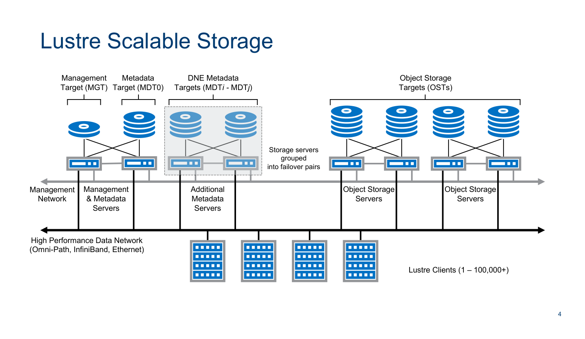
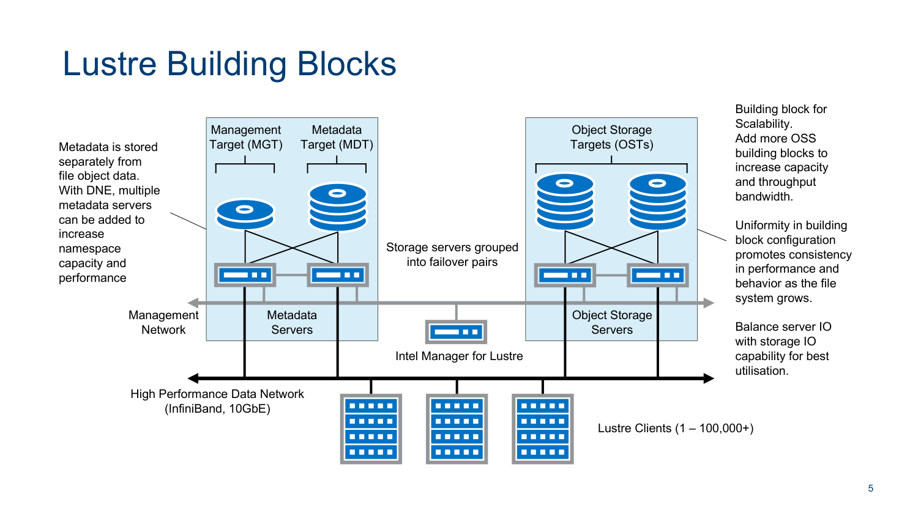
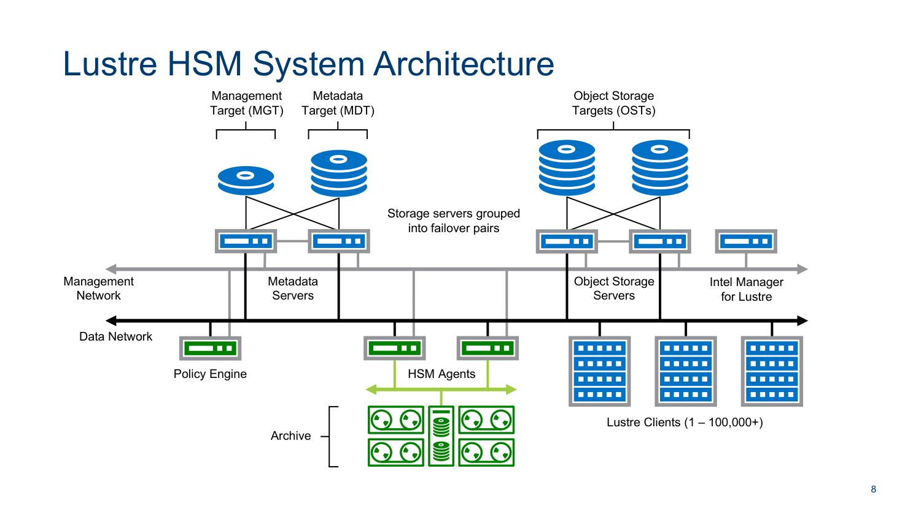
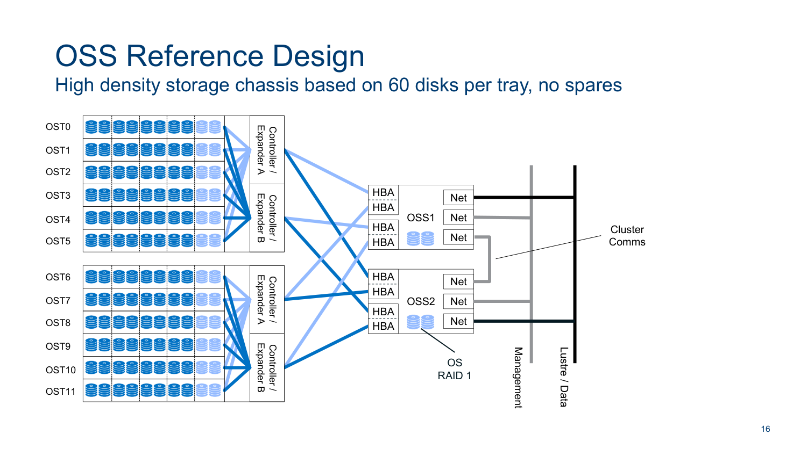
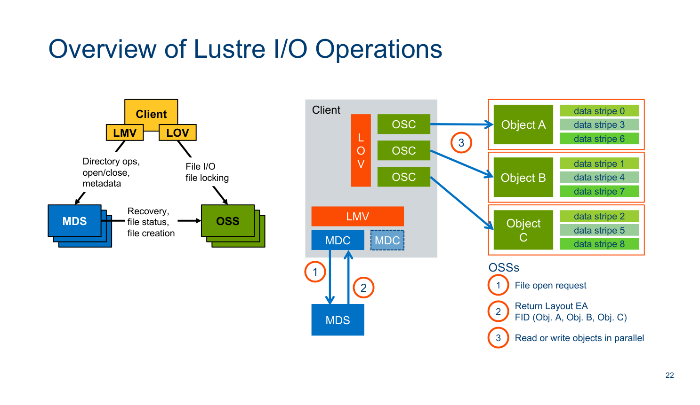
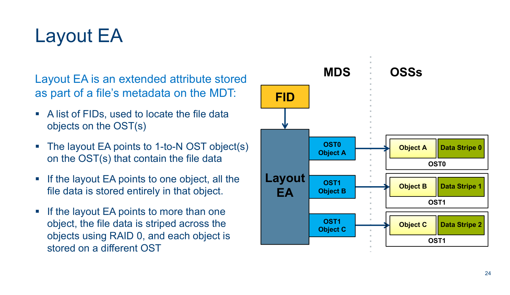
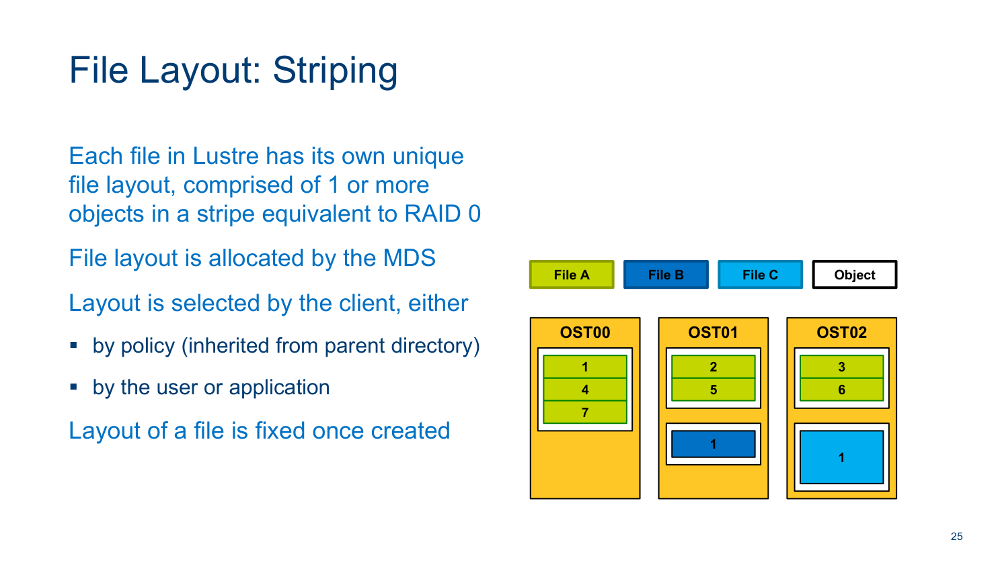

# Lustre Architecture (v4 Whitepaper)
> Authoritative Reference: Intel / Seagate Lustre Architecture Specification & Reference Designs.

### Introduction to Lustre* 
Architecture

### Lustre* systems and network administration

### October 2017

* Other names and brands may be claimed as the property of others

*Lustre High-Level Architecture Overview*

Lustre* is an open-source, distributed, parallel data storage platform designed for massive  scalability, high-performance, and high-availability. Popular with the HPC community, Lustre  is used to support the most demanding data-intensive applications. Lustre provides  horizontally scalable IO for data centres of all sizes, and is deployed alongside some of the  very largest supercomputers. The majority of the top 100 fastest computers, as measured by  top500.org, use Lustre for their high performance, scalable storage.

Lustre file systems can scale from very small platforms of a few hundred terabytes up to large  scale platforms with hundreds of petabytes, in a single, POSIX-compliant, name space.  Capacity and throughput performance scale easily.

Lustre runs on Linux-based operating systems and employs a client-server network  architecture. Lustre software services are implemented entirely within the Linux kernel, as  loadable modules. Storage is provided by a set of servers that can scale to populations  measuring up to several hundred hosts. Lustre servers for a single file system instance can, in  aggregate, present up to tens of petabytes of storage to thousands of compute clients  simultaneously, and deliver more than a terabyte-per-second of combined throughput.

*Lustre Distributed Object-Based Storage Model*

Lustre’s architecture uses distributed, object-based storage managed by servers and accessed  by client computers using an efficient network protocol. There are metadata servers,  responsible for storage allocation, and managing the file system name space, and object  storage servers, responsible for the data content itself. A file in Lustre is comprised of a  metadata inode object and one or more data objects.

Lustre is a client-server, parallel, distributed, network file system. Servers manage the  presentation of storage to a network of clients, and write data sent from clients to persistent  storage targets.

There are three different classes of server: • Management server provides configuration information, file system registries • Metadata servers record file system namespace, inodes. The metadata servers maintain  the file system index. • Object storage servers record file content in distributed binary objects. A single file is  comprised of 1 or more objects, and the data for that file is organized in stripes across the  objects. Objects are distributed across the available storage targets.

Lustre separates metadata (inode) storage from block data storage (file content). All file  metadata operations (creating and deleting files, allocating data objects, managing  permissions) are managed by the metadata servers. Metadata servers provide the index to  the file system. Metadata is stored in key-value index objects that store file system inodes:  file and directory names, permissions, block data locations, extended attributes, etc.

Lustre object storage servers write the data content out to persistent storage. Object servers  can be written to concurrently, and individual files can be distributed across multiple objects  on multiple servers. This allows very large files to be created and accessed in parallel by  processes distributed across a network of computer infrastructure. Block data is stored in  binary byte array data objects on a set of storage targets. A single Lustre "file" can be written  to multiple objects across many storage targets.

In addition to the metadata and object data, there is the management service, which is used  to keep track of servers, clients, storage targets and file system configuration parameters.

Clients aggregate the metadata name space and object data to present a coherent POSIX file  system to applications. Clients do not access storage directly: all I/O is sent over a network.  The Lustre client software splits IO operations into metadata and block data, communicating  with the appropriate services to service IO transactions. This is the key concept of Lustre’s  design – separate small, random, IOPS-intensive metadata traffic from the large, throughputintensive, streaming block IO.

*Lustre File System Cluster Components*

### The major components of a Lustre file system cluster are:

• MGS + MGT: Management service, provides a registry of all active Lustre servers and  clients, and stores Lustre configuration information. MGT is the management service  storage target used to store configuration data. • MDS + MDTs: Metadata service, provides file system namespace (the file system index),  storing the inodes for a file system. MDT is the metadata storage target, the storage  device used to hold metadata information persistently. Multiple MDS and MDTs can be  added to provide metadata scaling. • OSS + OSTs: Object Storage service, provides bulk storage of data. Files can be written in  stripes across multiple object storage targets (OSTs). Striping delivers scalable  performance and capacity for files. OSS are the primary scalable service unit that  determines overall aggregate throughput and capacity of the file system. • Clients: Lustre clients mount each Lustre file system instance using the Lustre Network  protocol (LNet). Presents a POSIX-compliant file system to the OS. Applications use  standard POSIX system calls for Lustre IO, and do not need to be written specifically for  Lustre. • Network: Lustre is a network-based file system, all IO transactions are sent using network  RPCs. Clients have no local persistent storage and are often diskless. Supports many  different network technologies, including OPA, IB, Ethernet.

### Lustre Networking

Applications do not run directly on storage servers: all application I/O is transacted over a

network. Lustre network I/O is transmitted using a protocol called LNet, derived from the  Portals network programming interface. LNet has native support for TCP/IP networks as well  as RDMA networks such as Intel Omni-Path Architecture (OPA) and InfiniBand. LNet supports  heterogeneous network environments. LNet can aggregate IO across independent interfaces,  enabling network multipathing. Servers and clients can be multi-homed, and traffic can be  routed using dedicated machines called LNet routers. Lustre network (LNet) routers provide a  gateway between different LNet networks. Multiple routers can be grouped into pools to  provide performance scalability and to provide multiple routes for availability.

The Lustre network protocol is connection-based: end-points maintain shared, coordinated  state. Servers maintain exports for each active connection from a client to a server storage  target, and clients maintain imports as an inverse of server exports. Connections are pertarget and per-client: if a server exports N targets to P clients, there will be (N * P) exports on  the server, and each client will have N imports from that server. Clients will have imports for  every Lustre storage target from every server that represents the file system.

Most Lustre protocol actions are initiated by clients. The most common activity in the Lustre  protocol is for a client to initiate an RPC to a specific target. A server may also initiate an RPC  to the target on another server, e.g. an MDS RPC to the MGS for configuration data; or an  RPC from MDS to an OST to update the MDS’s state with available space data. Object storage  servers never communicate with other object storage servers: all coordination is managed via  the MDS or MGS. OSS do not initiate connections to clients or to an MDS. An OSS is relatively  passive: it waits for incoming requests from either an MDS or Lustre clients.

### Lustre and Linux

The core of Lustre runs in the Linux kernel on both servers and clients. Lustre servers have a  choice of backend storage target formats, either LDISKFS (derived from EXT4), or ZFS (ported  from OpenSolaris to Linux). Lustre servers using LDISKFS storage require patches to the Linux  kernel. These patches are to improve performance, or to enable instrumentation useful  during the automated test processes in Lustre’s software development lifecycle. The list of  patches continues to reduce as kernel development advances, and there are initiatives  underway to completely remove customized patching of the Linux kernel for Lustre servers.

Lustre servers using ZFS OSD storage and Lustre clients do not require patched kernels. The  Lustre client software is being merged into mainstream Linux kernel, and is available in  kernel-staging.

### Lustre and High Availability

Service availability / continuity is sustained using a High Availability failover resource  management model, where multiple servers are connected to shared storage subsystems  and services are distributed across the server nodes. Individual storage targets are managed  as active-passive failover resources, and multiple resources can run in the same HA  configuration for optimal utilisation. If a server develops a fault, then any Lustre storage

target managed by the failed server can be transferred to a surviving server that is connected  to the same storage array. Failover is completely application-transparent: system calls are  guaranteed to complete across failover events.

In order to ensure that failover is handled seamlessly, data modifications in Lustre are  asynchronous and transactional. The client software maintains a transaction log. If there is a  server failure, the client will automatically re-connect to the failover server and replay  transactions that were not committed prior to the failure. Transaction log entries removed  once the client receives confirmation that the IO has been committed to disk.

All Lustre server types (MGS, MDS and OSS) support failover. A single Lustre file system  installation will usually be comprised of several HA clusters, each providing a discrete set of  metadata or object services that is a subset of the whole file system. These discrete HA  clusters are the building blocks for a high-availability, Lustre parallel distributed file system  that can scale to tens of petabytes in capacity and to more than one terabyte-per-second in  aggregate throughput performance.

Building block patterns can vary, which is a reflection the flexibility that Lustre affords  integrators and administrators when designing their high performance storage infrastructure.  The most common blueprint employs two servers joined to shared storage in an HA clustered  pair topology. While HA clusters can vary in the number of servers, a two-node configuration  provides the greatest overall flexibility as it represents the smallest storage building block  that also provides high availability. Each building block has a well-defined capacity and  measured throughput, so Lustre file systems can be designed in terms of the number of  building blocks that are required to meet capacity and performance objectives.

An alternative to the two-node HA building block, described in Scalable high availability for  Lustre with Pacemaker (video), was presented at LUG 2017 by Christopher Morrone. This is a  very interesting design and merits consideration.

A single Lustre file system can scale linearly based on the number of building blocks. The  minimum HA configuration for Lustre is a metadata and management building block that  provides the MDS and MGS services, plus a single object storage building block for the OSS  services. Using these basic units, one can create file systems with hundreds of OSSs as well as  several MDSs, using HA building blocks to provide a reliable, high-performance platform.

The values here are intended to reflect the potential scale of Lustre installations. The largest  Lustre installations used in production today are measured in 10’s of petabytes, with  projections for 100’s of petabytes within 2 years. Typical Lustre system deployments range in  capacity from 1 – 60PB, in configurations that can vary widely, depending on workload  requirements.

The values depicted for ZFS file system and file system size are theoretical, and in fact  represent a conservative projection of the scalability of ZFS with Lustre. If one were to make  a projection of ZFS scalability using the ZFS file system’s own theoretical values, the numbers  are so large as to be effectively meaningless in any useful assessment of capability.

### Lustre Storage Scalability

### Value using LDISKFS backend
Value using ZFS backend
Notes

Maximum stripe count 2000 2000 Limit is 160 for ldiskfs if "ea_inode"

### feature is not enabled on MDT

### Maximum stripe size
< 4GB
< 4GB

### Minimum stripe size
64KB
64KB

### Maximum object size
16TB
256TB

### Maximum file size
31.25PB
512PB*

### Maximum file system size
512PB
8EB*

### Maximum number of files or 
subdirectories per directory

### 10M for 48-byte filenames. 5M for

128-byte filenames.

### 248

### Maximum number of files in the 
file system

### 4 billion per MDT
256 trillion per MDT

### Maximum filename length
255 bytes
255 bytes

Maximum pathname length 4096 bytes 4096 bytes Limited by Linux VFS

### 6

*LNet Networking, Multi-Rail and LNet Routers*

From its inception, Lustre has been designed to enable data storage to move beyond the bottlenecks imposed by limitations in hardware.

Lustre is a distributed network file system and shares some of the characteristics common to  other network storage technology, namely that clients transact IO over a network and do not  write data locally, the servers support concurrency, and the data is presented as a single  coherent namespace.

Where Lustre differentiates itself from other network file systems, such as NFS or SMB, is in  its ability to seamlessly scale both capacity and performance linearly to meet the demands of  data-intensive applications with minimal additional administrative overhead. To increase  capacity and throughput, add more servers with the required storage. Lustre will  automatically incorporate new servers and storage, and the clients will leverage the new  capacity automatically. New capacity is automatically incorporated into the pool of available  storage.

Contrast this to traditional NFS deployments where capacity is often carved up into vertical  silos based on project or department, and presented to computers using complex automount maps that need to be maintained. Available capacity is often isolated and it is difficult to  balance utilisation, while performance is constrained to the capability of a single machine.

*Hierarchical Storage Management (HSM) Architecture*

Hierarchical Storage Management (HSM) is a collection of technologies and processes  designed to provide a cost-effective storage platform that balances performance, capacity  and long term retention (archival). Storage systems are organized into tiers, where the  highest-performance tier is on the shortest path to the systems where applications are  running; this is where the most active, or hottest, data is generated and consumed. As the  high-performance tier fills, data that is no longer being actively used (cooler data) will be  migrated to higher-capacity and generally lower-cost-per-terabyte storage platforms for  long-term retention. Data migration should ideally be managed automatically and  transparently to the end user.

Lustre provides a framework for incorporating an HSM tiered storage implementation. Lustre  fulfills the high performance storage tier requirement. When a file is created, a replica can be  made on the associated HSM archive tier, so that two copies of the file exist. As changes are  made to the file, these are replicated onto the archive copy as well. The process of replicating  data between Lustre and the archive is asynchronous, so there will be a delay in data  generated on Lustre being reflected in the archive tier. As the available capacity is gradually  consumed on the Lustre tier, the older, least frequently used files are "released" from Lustre,  meaning that the local copy is deleted from Lustre and replaced with a reference that points  to the archive copy. Applications are not aware of the locality of a file: from the application’s  perspective, files are accessed using the same system calls. Crucially, applications do not  need to be re-written in order to work with data stored on an HSM system. If a system call is  made to open a file that has been released (i.e. a file whose contents are located on the  archive tier only), the HSM software automatically dispatches a request to retrieve the file  from the archive and restore it to the Lustre file system. This may be noticeable in the form

of a delay, but is otherwise transparent to the application.

The diagram provides an overview of the hardware architecture for a typical Lustre + HSM  file system. The metadata servers have an additional process called the HSM Coordinator  that accepts, queues and dispatches HSM requests (this may also be referred to this as the  MDT Coordinator since the process runs on the metadata server – MDS). HSM commands are  submitted from Lustre clients, either through the command line or through a special-purpose  third-party application known as a Policy Engine. The Policy Engine software makes use of  Lustre's HSM API to interact with the HSM Coordinator. The HSM platform also requires an  interface between the Lustre file system tier and the archive tier. Servers called HSM Agents  (also known as Copytool servers) provide this interface.

Lustre provides reference implementations of the HSM Copytool. The copytool supplied with  Lustre uses POSIX interfaces to copy data to and from the archive. While this implementation  of copytool is completely functional, it has been created principally as an example of how to  develop copytools for other archive types, which may use different APIs. The copytool included with the Lustre software is intended as a reference implementation, and while it is  stable, it is not a high- performance tool and for that reason, may not be suitable for a  production environment. There are also several 3rd party copytools available, supporting a  range of archive storage systems.

The Policy Engine most commonly associated with Lustre is called Robinhood. Robinhood is  an open-source application with support for HSM. Robinhood tracks changes to the file  system, and records this information persistently in a relational database. Robinhood also  analyses the database and takes action based on a set of rules (called policies) defined by the  file system's maintainers. These rules govern how files and directories will be managed by the  HSM system, and the conditions under which to take an action. Among other things, policies  in Robinhood determine how often to copy files to the archive tier, and the criteria for  purging files from the Lustre tier in order to release capacity for new data.

*Lustre Integration with CTDB NFS/SMB Gateways*

Lustre was originally designed for HPC applications running on large clusters of Linux-based  servers and can present extremely high-capacity file systems with high performance.  As it  has matured, Lustre has found wider roles in IT system infrastructure, and has become  increasingly relevant to commercial enterprises as they diversify their workloads and invest in  massively-parallel software applications.

This broadening of scope for high-performance computing, coupled with increasing data  management expectations, is placing new demands on the technologies that underpin highperformance storage systems, including Lustre file systems. As a result, storage  administrators are being asked to provide access to data held on Lustre file systems from a  wide range of client devices and operating systems that are not normally supported by  Lustre.

To address this need, a bridge is required between the Linux-based Lustre platform and other  operating systems. The Samba project was originally created to fulfill this function for  standalone UNIX file servers. Samba is a project that implements the Server Message Block  (SMB) protocol originally developed by IBM and popularized by Microsoft Windows operating  systems. SMB is common throughout computer networks. Samba provides computers with  network-based access to files held on UNIX and Linux servers.

The Samba project developers also created a clustered software framework named Clustered  Trivial Database (CTDB). CTDB is a network-based cluster framework and clustered database  platform combined. CTDB is derived from the TDB database, which was originally developed  for use by the Samba project. CTDB allows multiple Samba servers to safely and seamlessly

run in a cooperative cluster to serve data held on parallel file systems such as Lustre. CTDB  provides a cluster framework and cluster-aware database platform that allows several Samba  instances running on different hosts to run in parallel as part of a scalable, distributed service  on top of a parallel file system. Each instance of Samba serves the same data on the same file  system, using the CTDB framework to manage coherency and locking.

Samba, running on a CTDB cluster that is backed by Lustre, provides computer systems that  don’t have native support for Lustre with network access to the data held on a Lustre file  system. By running Samba in a CTDB cluster backed by Lustre, one can create a parallel SMB  service running across multiple hosts that can scale to meet demand.

### Server Overview

### Each Lustre file system comprises, at a minimum:

• 1 Management service (MGS), with corresponding Management Target (MGT) storage • 1 or more Metadata service (MDS) with Metadata Target (MDT) storage • 1 or more Object storage service (OSS), with Object Storage Target (OST) storage

For High Availability, the minimum working configuration is:

• 2 Metadata servers, running MGS and MDS in failover configuration

• MGS service on one node, MDS service on the other node • Shared storage for the MGT and MDT volumes • 2 Object storage servers, running multiple OSTs in failover configuration

• Shared storage for the OST volumes • All OSTs evenly balanced across the OSS servers

### Management Service and Target

The MGS is a global resource that can be associated with one or more Lustre file systems. It  acts as a global registry for configuration information and service state. It does not  participate in file system operations, other than to coordinate the distribution of  configuration information.

• Provides configuration information for Lustre file systems • All Lustre components register with MGS on startup • Clients retrieve information on mount

### Lustre File System Architecture – Server Overview

Object Storage Targets (OSTs) Metadata Target (MDT0) Management Target (MGT)

### Storage servers

### grouped
into failover pairs

### Lustre Clients (1 – 100,000+)

High Performance Data Network (Omni-Path, InfiniBand, Ethernet)

### Management

### Network

### Object Storage

### Servers

### Object Storage

### Servers
Management

### & Metadata

### Servers

### Additional

### Metadata

### Servers

### DNE Metadata
Targets (MDTi - MDTj)

### 12

• Configuration information is stored on a storage target called the MGT • There is usually only one MGT for a given network, and a Lustre file system will  register with exactly one MGS

### Metadata Service and Targets

The MDS serves the metadata for a file system. Metadata is stored on a storage target called  the MDT. The MDS is responsible for the file system name space (the files and directories),  and file layout allocation. It is the MDS that determines where files will be stored in the pool  of object storage. Each Lustre file system must have at least one MDT served by an MDS, but  there can be many MDTs on a server. The MDS is a scalable resource: using a feature called  Distributed Namespace, a single file system can have metadata stored across many MDTs.  The MGS and MDS are usually paired into a high availability server configuration.

• Records and presents the file system name space • Responsible for defining the file layout (location of data objects) • Scalable resource (DNE)

### Object Storage Service (OSS) and Targets

• File content, stored as objects • Files may be striped across multiple targets • Massively Scalable

### Object Storage Devices (OSDs)

Lustre targets run on a local file system on Lustre servers, the generic term for which is an  “object storage device”, or OSD. Lustre supports two kinds of OSD file systems for back-end  storage: • LDISKFS, a modified version of EXT4. This is the original persistent storage device layer for  Lustre. Several features originally developed for Lustre LDISKFS have been incorporated  into the EXT file system. • ZFS, based on OpenZFS implementation from the ZFS on Linux project. ZFS is combines a  volume manager and a file system into a single, coherent storage platform. ZFS is an  extremely scalable file system and is well-suited for high-density storage systems. ZFS  provides integrated volume management capabilities, RAID protection, data integrity  protection, snapshots

Lustre* targets can be different types across servers in a single file system. Hybrid  LDISKFS/ZFS file systems are possible, for example combining LDISKFS MDTs and ZFS OSTs,  but generally it is recommended that for simplicity of administration, a file system uses a  single OSD type. Lustre Clients are unaffected by the choice of OSD file system.

For the most part, a Lustre storage target is just a regular file system. The on-disk format  comprises a few special directories for configuration files, etc. The Lustre ZFS OSD actually

bypasses the ZPL (ZFS POSIX Layer) to improve performance, but the on-disk format still  maintains compatibility with the ZPL.

A storage target can be created on almost any Linux block device. Using a whole block device  or ZFS pool is strongly preferred, but OSDs can be created on disk-partitions. LDISKFS OSDs will run on LVM. While not commonly used for the OSTs, LVM is useful for taking snapshots  and making backups of the MDT: the MDT is the file system index, without which none of the  data in Lustre is accessible, so it makes sense to regularly make a copy in case of a  catastrophic hardware failure. While in principal, a device backup of the OSTs might be  useful, the sheer scale of the task makes it impractical. Moreover, backups from the userspace Lustre clients is typically more effective and can target operationally critical data.

An alternative way to look at the problem is as follows: catastrophic loss of a single OST  means that some of the data in the file system may be lost; whereas catastrophic loss of the  root MDT means that all of the data is lost.

*High-Availability Metadata Server (MDS) Reference Design*

### Metadata Server Reference Design

The diagram above represents a typical design for a high-availability metadata server cluster.  It comprises two server machines, each with three network interfaces, and a storage array  that is connected to each machine.

The high performance data network is used for Lustre and other application traffic. Common  transports for the data network are Intel Omni-path, InfiniBand or 10/40/100Gb Ethernet.  The management network is used for systems management, monitoring and alerts traffic and  to provide access to baseband management controllers (BMCs) for servers and storage. The  dedicated secondary cluster network is a point-to-point, or cross-over cable, used exclusively  for cluster communications, usually used in conjunction with the management network to  ensure redundancy in the cluster communications framework.

Storage can be either a JBOD or an array with an integrated RAID controller.

The MDS has a high performance shared storage target, called the MDT (Metadata Target).  Metadata performance is dependent upon fast storage LUNs with high IOPs characteristics.  Metadata IO comprises very large rates of small, random transactions, and storage should be  designed accordingly. Flash-based storage is an ideal medium to complement the metadata  workload. Striped mirrors or RAID 1+0 arrangements are typical, and will yield the best  overall performance while ensuring protection against hardware failure. Storage is sized for  metadata IO performance, and a projection of the expected maximum number of inodes.

The MGS has a shared storage target, called the MGT (Management Target). MGT storage  requirements are very small, typically 100MB. When a JBOD configuration is used, e.g. for  ZFS-based storage, the MGT should be comprised of a single mirror of two drives – avoid the  temptation to create a single ZFS pool that contains both an MGT and MDT dataset – this  severely compromises the flexibility of managing resources in an HA cluster and creates an  unnecessary colocation dependency. Moreover, when a failure event occurs, both MGT and  MDT resources will need to failover at the same time, which will disable the imperative  recovery feature in Lustre and increase the time it takes services to resume operation. Some  intelligent storage arrays provide more sophisticated ways to carve out storage, allowing  more fine-grained control and enabling a larger proportion of the available storage to be  allocated to the MDT. The core requirement is to create a storage target that comprises a  mirror to provide redundancy.

The use of spares is entirely at the discretion of the system designer. Note that when  designing for ZFS, the use of the hot-spare feature is not recommended for shared storage  failover configurations. Instead, if spare a required, use them as  warm-standby devices (i.e.  present in the chassis but not incorporated into the ZFS configuration directly). Warm  standby’s will require operator intervention to activate as a replacement when a drive fails,  but will avoid issues with the hot spare capability in ZFS when used in HA. For example, any  pool that is sharing a global spare cannot be exported while the spare is being used; and  there is no arbitration or coordination of spare allocation across nodes – if two nodes make a  simultaneous attempt to allocate the spare, there is a race to acquire the device, which  makes the process unpredictable.

One pair of MDS servers can host multiple MDTs but only one MGT.

### MGS

• Manages filesystem configuration and tunable changes, for clients, servers and targets. • Registration point: new server and client components register with MGS during startup. • Servers and clients obtain Lustre configuration from MGS during mount and configuration  updates from MGS after mount. Think of it as a Directory service and global registry. • One per site / per file system • Each Lustre file system needs to register with an MGS • A MGS can serve one or more Lustre file systems • MGT stores global configuration information, provided upon request • The MGT should be not co-located on the same volume as the metadata target (MDT), as  the imperative recovery capability (critical, high speed recovery mechanism) of Lustre will  be disabled if MDT and MGT are co-located • Only one MGS service can run on a host: cannot mount multiple MGT volumes on a single  host • Storage requirements are minimal (approximately 100-200 MB). A single mirrored disk  configuration is sufficient. • Can run stand-alone but it is usually grouped with the root MDS (MDT0) of a file system in  an HA failover cluster.

### MDS

• One or more MDS per file system • Significant multi-threaded CPU use • Simultaneous access from many clients • Maintains the metadata, which includes information seen via stat() – owner, group,  filename, links, ctime, mtime, etc., and extended attributes, such as the File Identifier  (FID)†, Mapping of FID, OSTs and Object ID’s, Pool Membership, ACLs, etc. • Metadata is stored on one or more MDTs • An MDT stores metadata for exactly one Lustre file system • Many MDTs can serve a single file system, by using the Distributed Namespace (DNE)  feature • Maximum of 4096 MDTs per Lustre file system • File system is unavailable if MDT is unavailable • MDT size is based on the amount of files expected in file system

• Maximum of 4B inodes per MDT for ldiskfs MDT storage • For ZFS MDTs, inode capacity is limited only by the capacity of the storage  volume

† FIDs are described in a later section.

*High-Availability Object Storage Server (OSS) Reference Design*

The diagram above represents a typical design for a high-availability object storage server  cluster. It comprises two server machines, each with three network interfaces, and a storage  array that is connected to each machine.

The high performance data network is used for Lustre and other application traffic. Common  transports for the data network are Intel Omni-path, InfiniBand or 10/40/100Gb Ethernet.  The management network is used for systems management, monitoring and alerts traffic and  to provide access to baseband management controllers (BMCs) for servers and storage. The  dedicated secondary cluster network is a point-to-point, or cross-over cable, used exclusively  for cluster communications, usually used in conjunction with the management network to  ensure redundancy in the cluster communications framework.

Storage can be either a JBOD or an array with an integrated RAID controller.

The Object storage servers provide the  scalable bulk data storage for Lustre. IO transactions  are typically large with correspondingly large RPC payloads and require high throughput  bandwidth. Object storage servers move data between block storage devices and the  network. The OSS is used to transfer data held on devices called Object Storage Targets  (OSTs) to the Lustre clients, and manages read / write calls. Typically there are many Object  Storage Servers for a single Lustre file system, and represent Lustre’s core scalable unit: add  more OSS servers to increase capacity and throughput performance. A minimum of 2 servers  is required for high availability. The aggregate throughput of the file system is the sum of the  throughput of each individual OSS and the total storage capacity of the Lustre file system is  the sum of the capacities of all OSTs.

Each OSS may have several shared Object Storage Targets (OSTs), normally configured in a  RAID 6 or equivalent parity-based redundant storage configuration. This provides the best  balance of capacity, performance and resilience. The width, or number of disks, in each RAID  group should be determined based on the specific capacity or performance requirements for  a given installation. The historical precedent for RAID is to always create RAID groups that  have N+P disks per group, where N is a power of 2 and P is the amount of parity. For  example, for RAID 6, one might have ten disks: N=8 and P=2 (8+2). In many modern arrays,  this rule may in fact be redundant, and in the case of ZFS, the rule has been demonstrated to  be largely irrelevant. This is especially true when compression is enabled on ZFS, since the  core premise of using a power of 2 for the layout was to ensure aligned writes for small block  sizes that are also a power of 2, and also to support the idea of a full stripe write on RAID6 of  1MB without any read-modify-write overheads. These considerations do not generally apply  to ZFS. Furthermore, when designing solutions for ZFS, most workloads benefit from enabling  compression. When compression is enabled, the block sizes will not be  a power of two,  regardless of the layout, and workloads will benefit more from enabling compression in ZFS  than from RAIDZ sizing. For more detailed information:

https://www.delphix.com/blog/delphix-engineering/zfs-raidz-stripe-width-or-how-i-learnedstop-worrying-and-love-raidz

For hardware RAID solutions, RAID 6 (8+2) is still one the most common configurations, but  again, it is advised not to follow this rule blindly. Experiment with different layouts and try to  maximise the overall capacity utilisation of the storage system.

An OSS pair may have more than one storage array. Two or four arrays or enclosures  per OSS  pair is common. Some high-density configurations may have more. To ensure that  performance is consistent across server nodes, OST LUNs should be evenly distributed across  the OSS servers.

File data is stored on OSTs in byte-array data objects. A single file system will comprise many  OST volumes, to a maximum of 8150. The on-disk OST structure contains a few special  directories for configuration files, etc., and the file system data which accessed via object IDs.  Each object stores either a complete file (when stripe_count == 1) or part of a file (when  stripe_count > 1). The capacity limit of an individual LDISKFS OST is 128TB. There is no theoretical limitation with ZFS, but volumes up to 256TB have been tested.

### Client Overview

The Lustre client is kernel-based software that presents an aggregate view of the Lustre  services to the host operating system as a POSIX-compliant file system. To applications, a  Lustre client mount looks just like any other file system, with files organised in a directory  hierarchy. A Lustre client mount will be familiar to anyone with experience of UNIX or Linuxbased operating systems, and supports the features expected of a modern POSIX file system.

### Lustre Client Services

Lustre employs a client-server model for communication. Each connection has an sender (the  client end of the connection) and a receiver (the server process). The main client processes  are as follows:

• Management Client (MGC): The MGC process handles RPCs with the MGS. All servers  (even the MGS) run one MGC and every Lustre client runs one MGC for every MGS on the  network. • Metadata Client (MDC): The MDC handles RPCs with the MDS. Only Lustre clients initiate  RPCs with the MDS. Each client runs an MDC process for each MDT. • Object Storage Client (OSC): The OSC manages RPCs with a single OST. Both the MDS and  Lustre clients initiate RPCs to OSTs, so each of these machines runs one OSC per OST

### Lustre Network Routers

There is another Lustre service that is often seen in data centres, called a Lustre Network  Router, or more commonly, an “LNet router”. The LNet router is used to direct Lustre IO

### Lustre File System – Clients

Lustre client combines the metadata and object storage into a single, coherent  POSIX file system

### § Presented to the client OS as a file system mount point

### § Applications access data as for any POSIX file system

§ Applications do not therefore need to be re-written to run with Lustre

All Lustre client I/O is sent via RPC over a network connection

§ Clients do not make use of any node-local storage, can be diskless

### 19

between different networks, and can be used to bridge different network technologies as  well as routing between independent subnets. These routers are dedicated servers that do  not participate as clients of a Lustre file system, but provide a way to efficiently connect  different networks. For example, a router might be used to bridge a TCP/IP Ethernet fabric  and an RDMA OmniPath (OPA) fabric, or provide a route between OPA and InfiniBand, or  between two independent RDMA InfiniBand fabrics.

Routers are most commonly used to enable centralisation of Lustre server resources such  that the file systems can be made available to multiple administrative domains within a data  centre (e.g. to connect Lustre storage to multiple HPC clusters) or even between campuses  over a wide-area network. Multiple routers can be deployed at the edge of a fabric to  provide load-balancing and fault tolerance for a given route or set of routes.

### Protocols Overview

### Client IO, File IDs, Layouts

*Lustre Client Architecture and VFS Integration*

The Lustre client software provides an interface between the Linux virtual file system and the  Lustre servers. The client software is composed of several different services, each one  corresponding to the type of Lustre service it interfaces to. A Lustre client instance will  include a management client (MGC, not pictured), one or more metadata clients (MDC), and  multiple object storage clients (OSCs), one corresponding to each OST in the file system.

The MGC manages configuration information. Each MDC transacts file system metadata  requests to the corresponding MDT, including file and directory operations, and management  of metadata (e.g. assignment of permissions), and each OSC transacts read and write  operations to files hosted on its corresponding OST.

The logical metadata volume (LMV) aggregates the MDCs and presents a single logical  metadata namespace to clients, providing transparent access across all the MDTs. This allows  the client to see the directory tree stored on multiple MDTs as a single coherent namespace,  and striped directories are merged on the clients to form a single visible directory to users  and applications.

The logical object volume (LOV) aggregates the OSCs to provide transparent access across all  the OSTs. Thus, a client with the Lustre file system mounted sees a single, coherent,  synchronized namespace, and files are presented within that namespace as a single  addressable data object, even when striped across multiple OSTs. Several clients can write to  different parts of the same file simultaneously, while, at the same time, other clients can  read from the file.

When a client looks up a file name, an RPC is sent to MDS to get a lock, which will be either  one of the following: • Read lock with look-up intent • Write lock with create intent

The MDS returns a lock plus all the metadata attributes and file layout extended attribute  (EA) to the client. The file layout information returned by the MDS contains the list of OST  objects containing the file’s data, and the layout access pattern describing how the data has  been distributed across the set of objects. The layout information allows the client to access  data directly from the OSTs. Each file in the file system has a unique layout: objects are not  shared between files.

If the file is new, the MDS will also allocate OST objects for the file based on the requested  layout when the file is opened for the first time. The MDS allocates OST objects by issuing  RPCs to the object storage servers, which then create the objects and return object  identifiers. By structuring the metadata operations in this way, Lustre avoids the need for  further MDS communication once the file has been opened. After the file is opened, all  transactions are directed to the OSSs, until the file is subsequently closed.

All files and objects in a Lustre file system are referenced by a unique, 128-bit, deviceindependent File Identifier, or FID. The FID is the reference used by a Lustre client to identify  the objects for a file. Note that there is an FID for  each data object on the OSTs as well as  each metadata inode object on the MDTs. FIDs provide a replacement to UNIX inode numbers, which were used in Lustre releases prior to version 2.0.

When the mount command is issued on a Lustre client, the client will first connect to the  MGS in order to retrieve the configuration information for the file system. This will include  the location of the root of the file system, stored on MDT0. The client will then connect to  the MDS that is running MDT0 and will mount the file system root directory.

Metadata storage allocation for inodes differs depending on the choice of back-end  filesystem (LDISKFS or ZFS).

For LDISKFS metadata targets, the number of inodes for the MDT is calculated when the  device is formatted. By default, Lustre will format the MDT using the ratio of 2KB-per-inode.  The inode itself consumes 512 bytes, but additional blocks can be allocated to store extended  attributes when the initial space is consumed. This happens for example, when a file has  been striped across a lot of objects. Using this 2KB-per-inode ratio has proven to be a reliable  way to allocate capacity for the MDT.

The LDISKFS filesystem imposes an upper limit of 4 billion inodes per MDT. By default, the  MDT filesystem is formatted with one inode per 2KB of space, meaning 512 million inodes per TB of MDT space. In a Lustre LDISKFS file system, all the MDT inodes and OST objects are  allocated when the file system is first formatted. When the file system is in use and a file is  created, metadata associated with that file is stored in one of the pre-allocated inodes and  does not consume any of the free space used to store file data. The total number of inodes on a formatted LDISKFS MDT or OST cannot be easily changed. Thus, the number of inodes created at format time should be generous enough to anticipate near term expected usage,  with some room for growth without the effort of additional storage.

The ZFS filesystem dynamically allocates space for inodes and and inodes are allocated as  needed, which means that ZFS does not have a fixed ratio of inodes per unit of MDT space. A  minimum of 4kB of usable space is needed for each inode, exclusive of other overhead such  as directories, internal log files, extended attributes, ACLs, etc.

### Lustre inodes

### Lustre inodes are MDT inodes

§ Default inode size is 2K (actually an MDT inode is 512 bytes, plus up to 2K for EAs)

### – Metadata inode on-disk size is larger for ZFS

§ The maximum number of inodes per MDT in LDISKFS is 4 billion, but there is no practical limit for  ZFS

### Lustre inodes hold all the metadata for Lustre files

### Lustre inodes contain:

§ Typical metadata from stat() (UID, GID, permissions, etc.)

### §
Extended Attributes (EA)

### Extended Attributes contain:

### §
References to Lustre files (OSTs, Object ID, etc.)

§ OST Pool membership, POSIX ACLs, etc.

### 23

With older ZFS on Linux releases (prior to 0.7.0), Lustre xattrs would exceed the allocated  dnode space (512 bytes), and if 4KB sectors were used (ashift=12) then each MDT dnode would need (512+4096)*2 bytes of space (multiplied by 2 for the ditto copy, over and above  mirrored VDEV). With dynamic dnodes in the newer releases (or with 512-byte sectors, which  is increasingly rare) the space required is only (512+512)*2 bytes per dnode.

ZFS also reserves approximately 3% of the total storage space for internal and redundant  metadata, which is not usable by Lustre. Since the size of extended attributes and ACLs is  highly dependent on kernel versions and site-specific policies, it is best to over-estimate the  amount of space needed for the desired number of inodes, and any excess space will be  utilized to store more inodes. Note that the number of total and free inodes reported by lfs df -i for ZFS MDTs and OSTs is estimated based on the current average space used per  inode. When a ZFS filesystem is first formatted, this free inode estimate will be very  conservative (low) due to the high ratio of directories to regular files created for internal  Lustre metadata storage, but this estimate will improve as more files are created by regular  users and the average file size will better reflect actual site usage.

A Lustre file system uses extended attributes (EAs) contained in the metadata inode to store  additional information about a file. Examples of extended attributes are ACLs, layout (e.g.  striping) information, and the unique Lustre file identifier (FID) of the file. The layout EA  contains a list of all object IDs and their locations (that is, the OSTs that contain the objects).

For files with very wide stripes, the layout EA may be too large to store in the inode and will  be stored in separate blocks. Be careful when defining the layout for files, and try to make  sure that the layout is only as large / wide as needed: storing the EA in the inode whenever  possible avoids an extra, potentially expensive, disk seek.

Lustre internally uses a 128-bit file identifier (FID) for all files. To interface with user  applications, the 64-bit inode numbers are returned by the stat(), fstat(), and  readdir() system calls on 64-bit applications, and 32-bit inode numbers to 32-bit  applications.

*Lustre Client Read/Write Data and Metadata Flow*

When a client wants to read from or write to a file, it first fetches the list of object FIDs  containing the file’s data from the MDT inode for the file. The client then uses this  information to connect directly to the object storage servers where the data objects are  stored and transact I/O on the file.

Information about where file data is located on the OST(s) is stored as an extended attribute  called the layout EA. The layout EA is stored in an MDT inode identified by the FID for the file.  If the file is a regular file (not a directory or symbol link), the MDT inode points to 1-to-N OST  object(s) on the OST(s) that contain the file data. If the MDT layout EA points to one object,  all the file data is stored in that object. If the layout EA points to more than one object, the  file data is striped across the objects using RAID 0, and each object is stored on a different  OST.

*Lustre File Striping across OSTs*

One of the main factors leading to the high performance of Lustre file systems is the ability to  stripe data across multiple OSTs in a round-robin fashion. Users can optionally configure the  number of stripes, stripe size, and OSTs that are used for each file. Striping can be used to  improve performance enabling the aggregate bandwidth to a single file to exceed the  bandwidth of a single OST. The ability to stripe is also useful when a single OST does not have  enough free space to hold an entire file.

Striping allows segments or 'chunks' of data in a file to be stored on different OSTs. In the  Lustre file system, a RAID 0 pattern is used in which data is "striped" across a certain number  of objects. The number of objects in a single file is called the stripe_count. Each object  contains chunks of data from the file, and chunks are written to the file in a circular roundrobin manner. When the chunk of data being written to a particular object exceeds the stripe size, the next chunk of data in the file is stored on the next object.

When reading the data back from a file, the client needs to know the location of the OST  objects, the starting object, and the stripe width (or chunk size) in order to correctly retrieve  the file’s data with the same pattern that was used to write the file.

The maximum number of objects that can be used to store a single file is 2000, i.e. this is the  maximum number of OSTs that a single file can be striped across. File systems can be  comprised of more than 2000 OSTs, but a single file within that file system is restricted to no  more than 2000 OSTs, which puts an effective limit on the aggregate bandwidth for a single  file. It is, of course, a rather large limit. The size of a single object is governed by the  underlying storage file system, and the physical constraints of the hardware.

Introduced in Lustre software release 2.0, Lustre file identifiers (FIDs) replace UNIX inode numbers for identifying files or objects. FIDs are independent of the underlying file system  OSD, and enabled support for multiple MDTs (introduced in Lustre software release 2.4) and  ZFS (introduced in Lustre software release 2.4). Also introduced in release 2.0 is an LDISKFS  feature named FID-in-dirent (also known as dirdata) in which the FID is stored as part of the  name of the file in the parent directory. This feature significantly improves performance  when executing commands like ls, by reducing disk I/O. The FID-in-dirent is generated at the  time the file is created.

An FID is a 128-bit identifier that contains a unique 64-bit sequence number, a 32-bit object  ID (OID), and a 32-bit version number. The sequence number is unique across all Lustre  targets in a file system (OSTs and MDTs). FIDs are not bound to a specific target, they are  never re-used and FIDs can be generated by Lustre clients.

Sequences are granted to clients by servers. A sequence number is unique across all Lustre  targets (OSTs and MDTs) in a file system. When a client connects to a Lustre file system, a  new FID sequence is allocated. The sequence is discarded when the client disconnects, and it  is not re-used. When the client reconnects with the file system, a new sequence will be  allocated. Each sequence has a limited number of FIDs (128,000) which may be created  within its range. When the sequence is exhausted, a new sequence is started.

Sequence controller (MDT0) allocates super-sequence ranges to sequence managers. A  super-sequence is a large contiguous range of sequence numbers. Sequence managers  control distribution of sequences to clients, preventing FID collisions. The MDS and OSS

### Lustre File Identifier (FID)

Lustre file identifiers (FIDs) provide a device-independent replacement for UNIX inode numbers  to uniquely identify files or objects

A File Identifier (FID) is a unique 128-bit identifier for Lustre files and objects, comprising:

§ 64-bit sequence number – used to locate the storage target

### – Unique across all OSTs and MDTs in a file system

§ 32-bit object identifier (OID) – reference to the object within the sequence

§ 32-bit version number – currently unused; reserved for future work

FID-in-dirent feature stores the FID as part of the name of the file in the parent directory

§ Significantly improves performance for “ls” command executions by reducing disk I/O

§ The FID-in-dirent is generated at the time the file is created

§ Introduced in Lustre 2.0, FID-in-dirent is not compatible with the Lustre version 1.8 format

### 26

servers for a file system are all sequence managers. Ranges of sequence IDs are granted by  managers to Lustre clients as reservations, which allows the client to create the FID for new  files using a reserved sequence ID. When the existing allocation is exhausted, a new set of  sequence numbers is provided. A given sequence ID always maps to the same storage target,  and objects created within same sequence will be located on the same storage target.

An FID does not contain any location information. To determine the location of an object  from its FID, Lustre has the FID location database (FLDB). The FLDB is a database mapping a  sequence of FIDs to the specific target (MDT or OST) that manages the objects within the  sequence. The complete FLDB for a file system is on on MDT0. When DNE is enabled, every  MDT also has its own local FLD, a subset of the full FLDB. The FLDB is cached by all clients and  servers in the file system, but is typically only modified when new servers are added to the  file system.

The underlying filesystem still operates on inodes. An object index is stored on disk to handle  FID to on-disk inode mapping.

Lustre implements byte-granular file and fine-grained metadata locking. Multiple clients can  read and modify the same file or directory concurrently. The Lustre distributed lock manager  (LDLM) ensures that files are coherent between all clients and servers in the file system. The  MDT LDLM manages locks on inode permissions and pathnames. Each OST has its own LDLM  for locks on file stripes stored thereon, which scales locking performance as the file system  grows.

The LDLM also plays a part in resolving client failures. Recovery from client failure in a Lustre  file system is based on lock revocation and other resources, so surviving clients can continue  their work uninterrupted. If a client fails to respond to a blocking lock callback from the  Distributed Lock Manager (DLM), or fails to communicate with the server for a long period of  time (i.e., no pings), the client is forcibly removed from the cluster (evicted). This enables  other clients to acquire locks blocked by the dead client's locks, and also frees resources (file  handles, export data) associated with that client.

### Locking

### Distributed lock manager in the manner of OpenVMS

### Cache-coherent across all clients

Metadata server uses inode bit locks for file lookup, state (modification, open r/w/x), EAs and layout

§ Clients can fetch multiple bit locks for an inode in a single RPC

§ MDS manages all inode modifications to avoid lock resource contention

Object storage servers provide extent-based locks for OST objects

### §
File data locks are managed for each OST

§ Clients can be granted read extent locks for part or all of the file, allowing multiple concurrent readers  of the same file

§ Clients can be granted non-overlapping write extent locks for regions of the file

§ Multiple Lustre clients may access a single file concurrently for both read and write, avoiding  bottlenecks during file I/O

### 27

### Glossary
Just so there's no confusion…

DNE - Distributed Namespace Environment - feature to aggregate multiple MDTs (possibly on  many MDS’s) into a single filesystem  namespace

IDIF - OST object ID In FID - specific FID range  reserved for compatibility with pre-DNE OST  objects

IGIF - Inode and Generation In FID - specific FID  range reserved for compatibility from Lustre 1.x  MDT inode objects

FID - File IDentifier - unique 128-bit identifier for  every object within a single filesystem.

LMV - Logical Metadata Volume - client software  layer that handles client (llite) access to multiple  MDTs

LOD - Logical Object Device - MDS software  layer that handles access to multiple MDTs and  multiple OSTs

LOV - Logical Object Volume - client software  layer that handles client (llite) access to multiple  OSTs

MDC - MetaData Client - client software layer  that interfaces to the MDS

MDD - Metadata Device Driver - MDS software  layer that understands POSIX semantics for file  access

MDS - MetaData Server - software service that  manages access to filesystem namespace  (inodes, paths, permission) requests from the  client.

MDT - MetaData Target - storage device that  holds the filesystem metadata (attributes,  inodes, directories, xattrs, etc)

MGS - Management Server - service that helps  clients and servers with configuration

MGT - Management Target - storage device that  holds the configuration logs

OFD - Object Filter Device - OSS software layer  that handles file IO

OSC - Object Storage Client - client software  layer that interfaces to the OST

OSD - Object Storage Device - server software  layer that abstracts MDD and OFD access to  underlying disk filesystems like ldiskfs and ZFS

OSP - Object Storage Proxy - server software  layer that interfaces from one MDS to the OSD  on another MDS or another OSS

OSS - Object Storage Server - software service  that manages access to filesystem data (read,  write, truncate, etc)

OST - Object Storage Target - storage device  that holds the filesystem data (regular data files,  not directories, xattrs, or other metadata)

### 28

