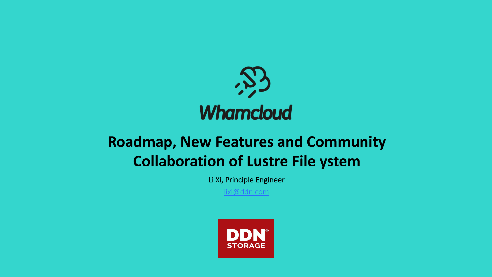
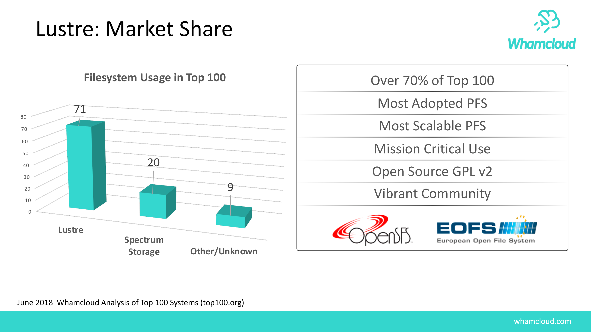
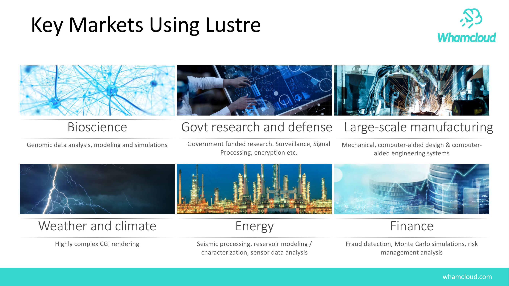
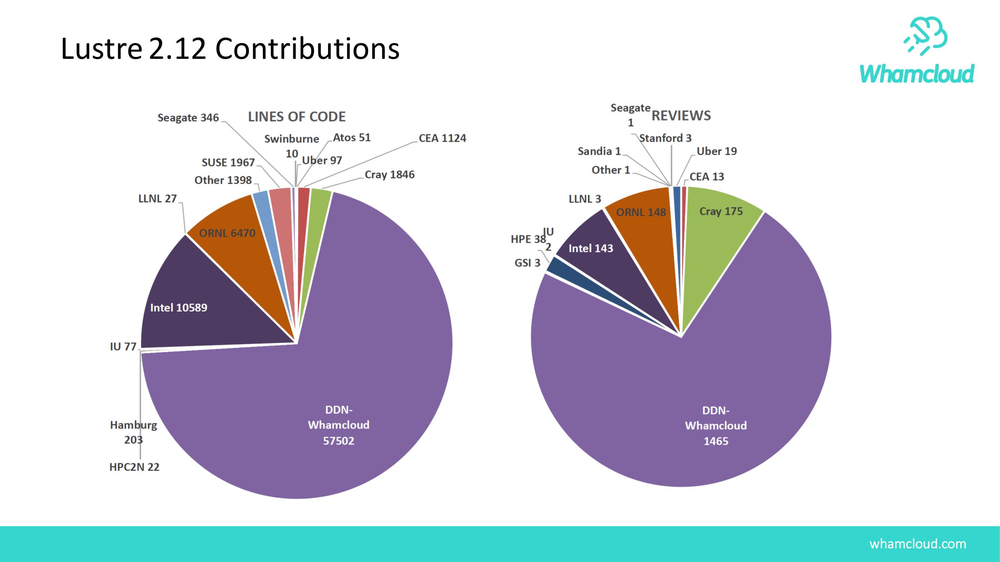
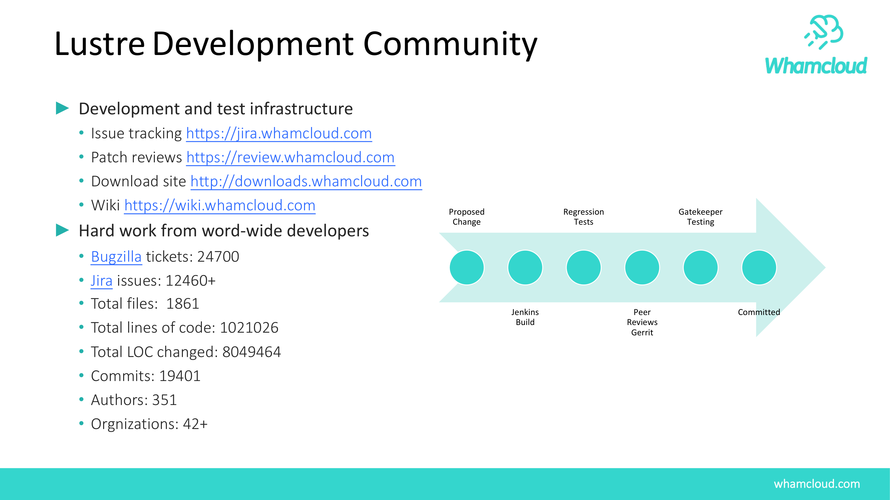
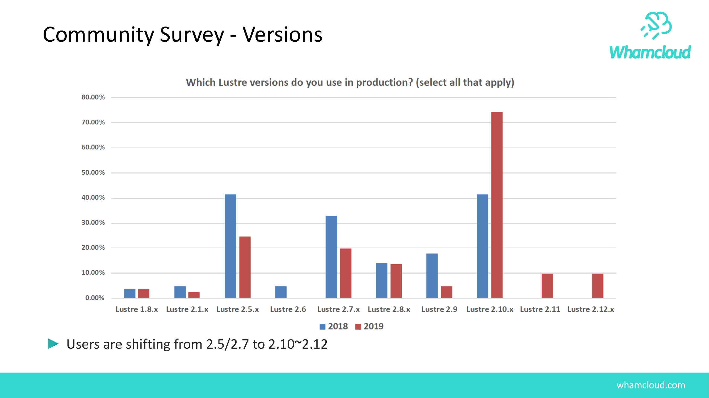
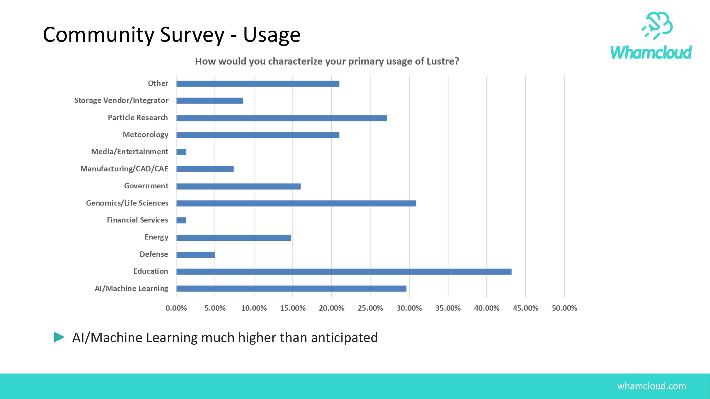
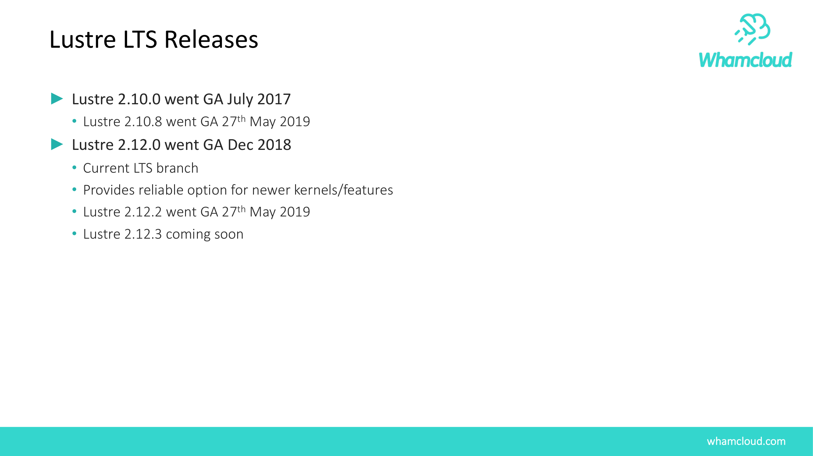
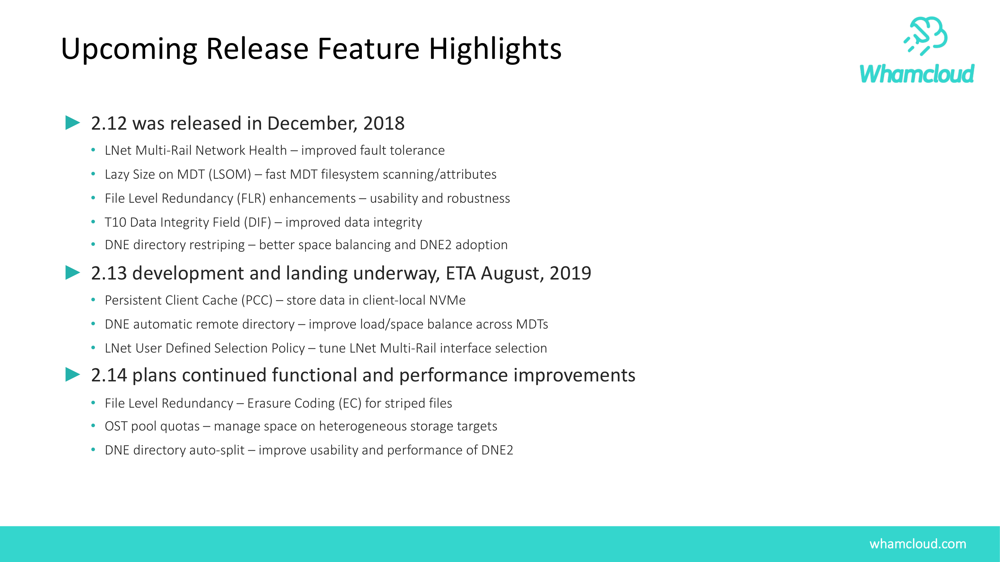
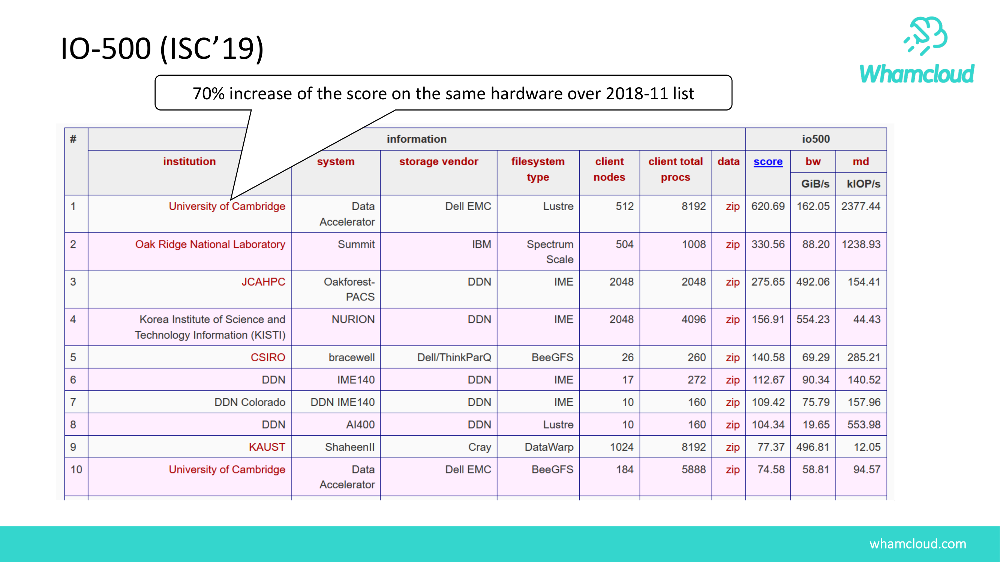

# Lustre Roadmap, New Features and Community Collaboration (2019)

> Authoritative Reference: Lustre Community Technical Roadmap & Architecture Evolution Presentation.

## Slide 1: Li Xi, Principle Engineer

### Key Points

- lixi@ddn.com
- Roadmap, New Features and Community
- Collaboration of Lustre File ystem

## Slide 2: whamcloud.com

### Key Points

- What is Lustre?
- ►Lustre is Software Defined Storage
- ►Provides a distributed, parallel, and scalable storage cluster
- • Attached directly to compute nodes or site-wide filesystem
- • Client access via network (Ethernet, OPA, InfiniBand)
- • 1 EB+ filesystem limit, 32 PB single file limit (1EB for ZFS)
- • Production file systems exceed 2TB/s, 50PB in size
- ►Maximum Performance at Massive Scale
- ►Open-Source (GPLv2) and POSIX compliant
- ►Extremely Efficient Use of Hardware Resources
- CPU
- DDR
- Local Storage
- I/O Node
- Lustre Parallel File  System
- Solid State Drives / Hard Disk Drives

## Slide 3: whamcloud.com

### Key Points

- 1999
- 2003
- 2007
- 2009
- 2010
- 2011
- 2012
- 2015
- 2017
- 2018
- 2019
- History of Lustre
- Illustrates the robustness of open source technology in the face of organizational changes
- 1.0
- 1.6
- 1.8
- 2.0
- 2.5
- 2.1
- 2.7
- 2.10
- 2.11
- 2.12

## Slide 4: whamcloud.com

### Key Points

- Over 70% of Top 100
- Most Adopted PFS
- Most Scalable PFS
- Mission Critical Use
- Open Source GPL v2
- Vibrant Community
- Lustre: Market Share
- June 2018  Whamcloud Analysis of Top 100 Systems (top100.org)
- 0
- 10
- 20
- 30
- 40
- 50
- 60
- 70
- 80
- Lustre
- Spectrum
- Storage
- Other/Unknown
- 71
- 20
- 9
- Filesystem Usage in Top 100

## Slide 5: whamcloud.com

### Key Points

- Key Markets Using Lustre
- Bioscience
- Govt research and defense Large-scale manufacturing
- Mechanical, computer-aided design & computer-
- aided engineering systems
- Genomic data analysis, modeling and simulations
- Weather and climate
- Energy
- Finance
- Fraud detection, Monte Carlo simulations, risk
- management analysis
- Highly complex CGI rendering
- Seismic processing, reservoir modeling /
- characterization, sensor data analysis
- Government funded research. Surveillance, Signal
- Processing, encryption etc.

## Slide 6: whamcloud.com

### Key Points

- Lustre 2.12 Contributions

## Slide 7: whamcloud.com

### Key Points

- LustreDevelopment Community
- ►Development and test infrastructure
- • Issue tracking https://jira.whamcloud.com
- • Patch reviews https://review.whamcloud.com
- • Download site http://downloads.whamcloud.com
- • Wiki https://wiki.whamcloud.com
- ►Hard work from word-wide developers
- • Bugzilla tickets: 24700
- • Jira issues: 12460+
- • Total files: 1861
- • Total lines of code: 1021026
- • Total LOC changed: 8049464
- • Commits: 19401
- • Authors: 351
- • Orgnizations: 42+
- Proposed
- Change
- Jenkins
- Build
- Regression
- Tests
- Peer
- Reviews
- Gerrit
- Gatekeeper
- Testing
- Committed

## Slide 8: whamcloud.com

### Key Points

- Community Survey - Versions
- ►Users are shifting from 2.5/2.7 to 2.10~2.12

## Slide 9: whamcloud.com

### Key Points

- Community Survey - Usage
- ►AI/Machine Learning much higher than anticipated

## Slide 10: whamcloud.com

### Key Points

- Lustre LTS Releases
- ►Lustre 2.10.0 went GA July 2017
- • Lustre 2.10.8 went GA 27th May 2019
- ►Lustre 2.12.0 went GA Dec 2018
- • Current LTS branch
- • Provides reliable option for newer kernels/features
- • Lustre 2.12.2 went GA 27th May 2019
- • Lustre 2.12.3 coming soon

## Slide 11: whamcloud.com

### Key Points

- Lustre Community Roadmap
- 2.11
- •
- Data on MDT
- •
- FLR Delayed Resync
- •
- Lock Ahead
- 2.13
- •
- Persistent Client Cache
- •
- Lnet Selection Policy
- •
- Self Extending Layouts
- 2.14
- •
- FLR Erasure Coding
- •
- Health Monitoring
- •
- DNE Auto Restriping
- 2.12
- •
- Lazy Size on MDT
- •
- LNet Health
- •
- DNE Dir Restriping

## Slide 12: whamcloud.com

### Key Points

- Upcoming Release Feature Highlights
- ►2.12 was released in December, 2018
- • LNet Multi-Rail Network Health – improved fault tolerance
- • Lazy Size on MDT (LSOM) – fast MDT filesystem scanning/attributes
- • File Level Redundancy (FLR) enhancements – usability and robustness
- • T10 Data Integrity Field (DIF) – improved data integrity
- • DNE directory restriping – better space balancing and DNE2 adoption
- ►2.13 development and landing underway, ETA August, 2019
- • Persistent Client Cache (PCC) – store data in client-local NVMe
- • DNE automatic remote directory – improve load/space balance across MDTs
- • LNet User Defined Selection Policy – tune LNet Multi-Rail interface selection
- ►2.14 plans continued functional and performance improvements
- • File Level Redundancy – Erasure Coding (EC) for striped files
- • OST pool quotas – manage space on heterogeneous storage targets
- • DNE directory auto-split – improve usability and performance of DNE2

## Slide 13: whamcloud.com

### Key Points

- IO-500 (ISC’19)
- 70% increase of the score on the same hardware over 2018-11 list

## Slide 14: whamcloud.com

### Key Points

- China LUG 2019 is coming!
- ►China local event other than global LUG/LAD
- ►Date: 2019/10/15 (Tue.) 9:00-17:00
- ►Place: The New World Beijing Hotel, Beijing City
- ►Website: http://lustrefs.cn
- ►Presenters:
- • \#jD _P9Q32jFQTL QW32ki-X_P08KN//c
- • 7
- jL0 =>I"KN,32 j+VY 41,Visiting Professor
- • ZjdL0 _P9 e_P9KN/KN
- • O6j][*fA _PKNSi-X_P<;%
- • @HjL eiXEGKN/KN
- • g)5jBi-X_P,08
- • !j?L0iRKNj5	QT^`a
- • MjC"(HPCQTiRbU$M%
- • Peter JonesjDDN/Whamcloud
$M.J
- • Andreas Dilger, DDN/Whamcloud
Lustre CTO
- • :&jDDN/Whamcloud
h'$M%

## Slide 15: Questions?

