# The Feature Development and Architecture Evolvement of Lustre Under New Challenges

> Authoritative Reference: Technical Report on Modern NVMe Tiering, FLR, PCC, DoM and Multi-Rail Innovations.

## Slide 1: Li Xi, Principle Engineer

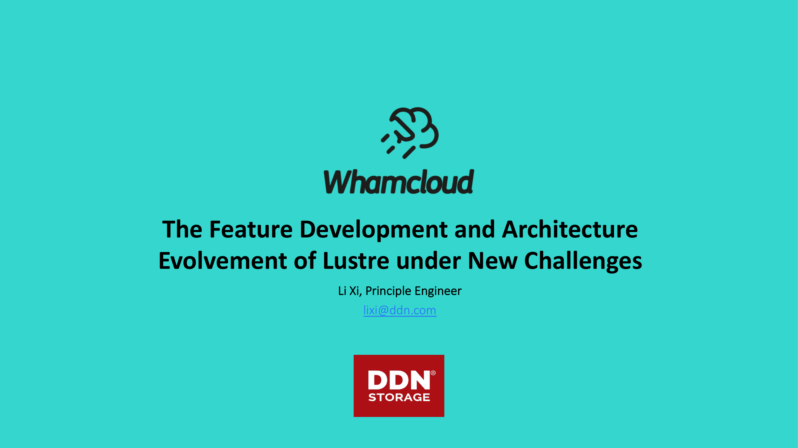

### Key Points & Architecture Data

- lixi@ddn.com
- The Feature Development and Architecture
- Evolvement of Lustre under New Challenges

## Slide 2: whamcloud.com

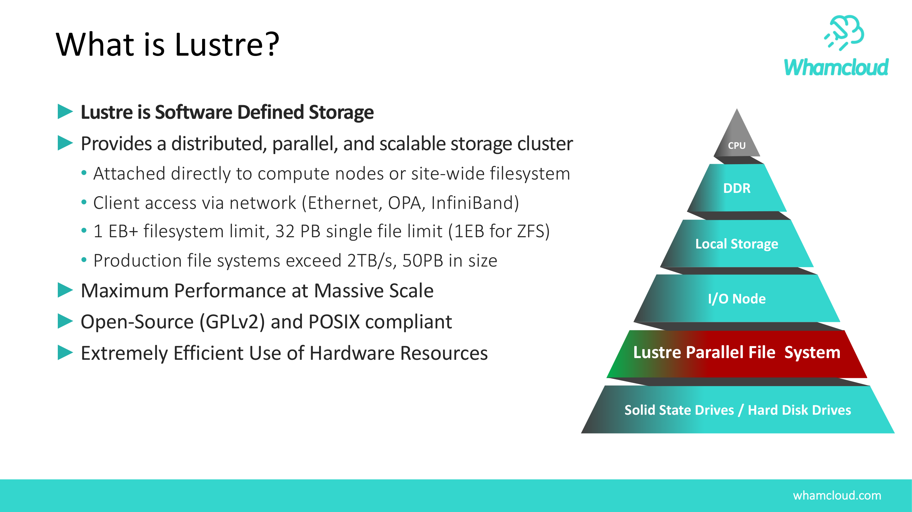

### Key Points & Architecture Data

- What is Lustre?
- ►Lustre is Software Defined Storage
- ►Provides a distributed, parallel, and scalable storage cluster
- • Attached directly to compute nodes or site-wide filesystem
- • Client access via network (Ethernet, OPA, InfiniBand)
- • 1 EB+ filesystem limit, 32 PB single file limit (1EB for ZFS)
- • Production file systems exceed 2TB/s, 50PB in size
- ►Maximum Performance at Massive Scale
- ►Open-Source (GPLv2) and POSIX compliant
- ►Extremely Efficient Use of Hardware Resources
- CPU
- DDR
- Local Storage
- I/O Node
- Lustre Parallel File  System
- Solid State Drives / Hard Disk Drives

## Slide 3: whamcloud.com

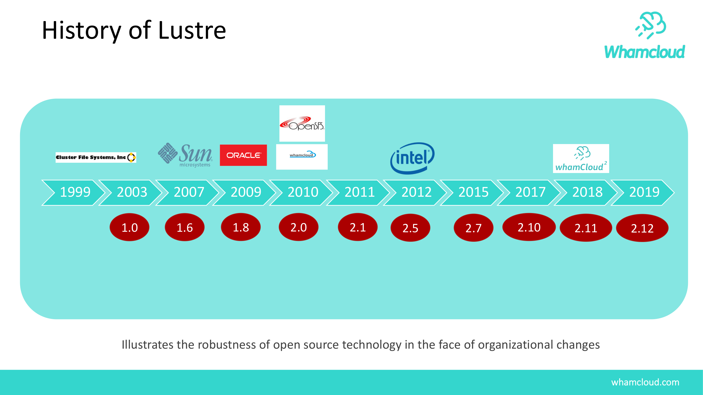

### Key Points & Architecture Data

- 1999
- 2003
- 2007
- 2009
- 2010
- 2011
- 2012
- 2015
- 2017
- 2018
- 2019
- History of Lustre
- Illustrates the robustness of open source technology in the face of organizational changes
- 1.0
- 1.6
- 1.8
- 2.0
- 2.5
- 2.1
- 2.7
- 2.10
- 2.11
- 2.12

## Slide 4: whamcloud.com

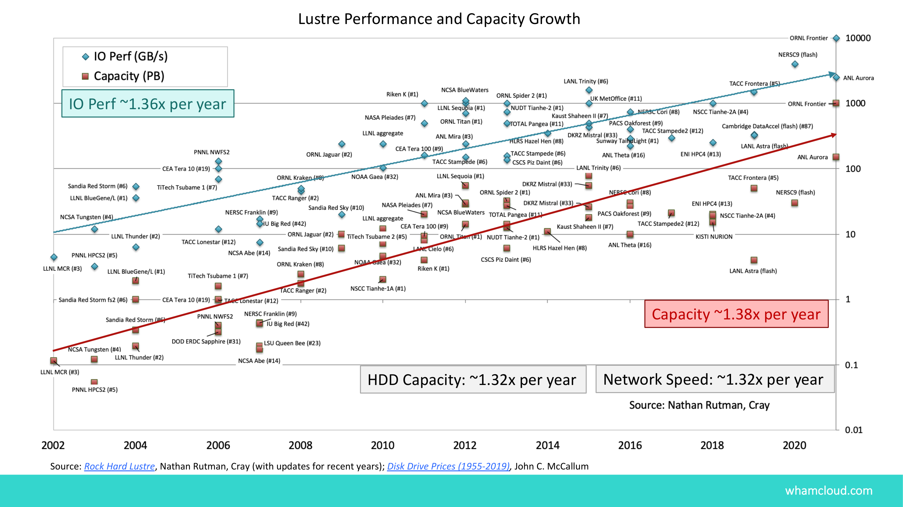

### Key Points & Architecture Data

- IO Perf ~1.36x per year
- Capacity ~1.38x per year
- Network Speed: ~1.32x per year
- HDD Capacity: ~1.32x per year
- Source: Rock Hard Lustre, Nathan Rutman, Cray (with updates for recent years); Disk Drive Prices (1955-2019), John C. McCallum
- Lustre Performance and Capacity Growth

## Slide 5: whamcloud.com

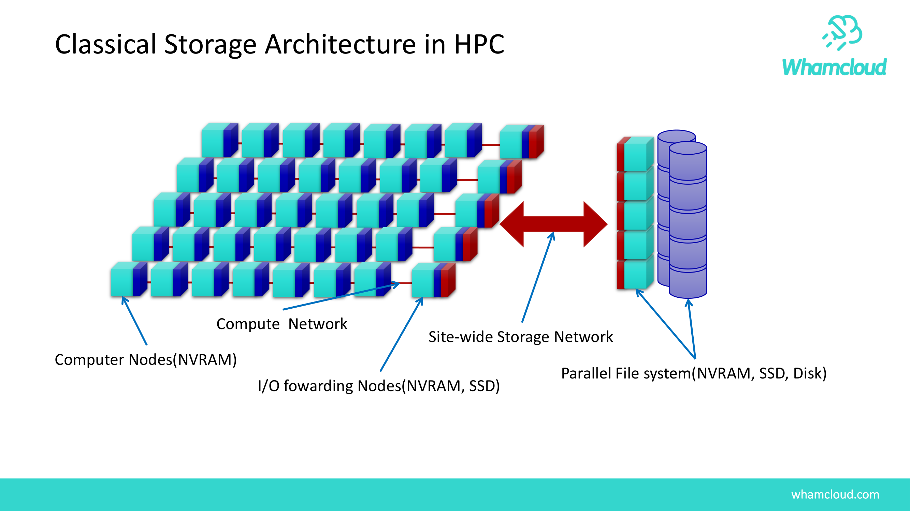

### Key Points & Architecture Data

- Classical Storage Architecture in HPC
- Computer Nodes(NVRAM)
- Compute  Network
- I/O fowarding Nodes(NVRAM, SSD)
- Site-wide Storage Network
- Parallel File system(NVRAM, SSD, Disk)

## Slide 6: whamcloud.com

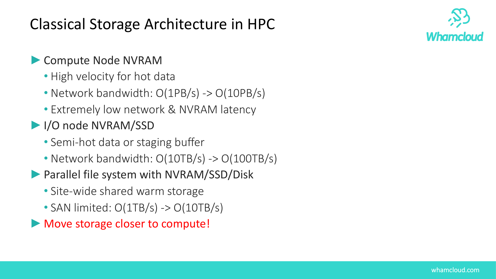

### Key Points & Architecture Data

- Classical Storage Architecture in HPC
- ►Compute Node NVRAM
- • High velocity for hot data
- • Network bandwidth: O(1PB/s) -> O(10PB/s)
- • Extremely low network & NVRAM latency
- ►I/O node NVRAM/SSD
- • Semi-hot data or staging buffer
- • Network bandwidth: O(10TB/s) -> O(100TB/s)
- ►Parallel file system with NVRAM/SSD/Disk
- • Site-wide shared warm storage
- • SAN limited: O(1TB/s) -> O(10TB/s)
- ►Move storage closer to compute!

## Slide 7: whamcloud.com

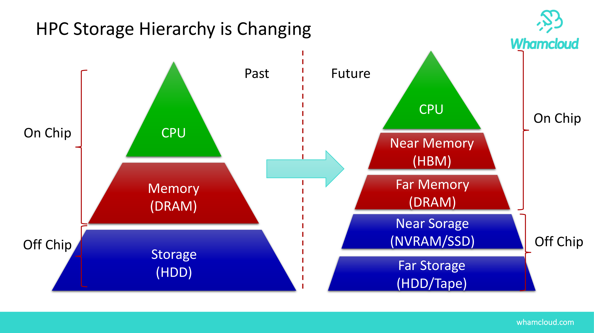

### Key Points & Architecture Data

- HPC Storage Hierarchy is Changing
- CPU
- Memory
- (DRAM)
- Storage
- (HDD)
- CPU
- Near Memory
- (HBM)
- Near Sorage
- (NVRAM/SSD)
- Far Memory
- (DRAM)
- Far Storage
- (HDD/Tape)
- Future
- Past
- On Chip
- Off Chip
- On Chip
- Off Chip

## Slide 8: whamcloud.com

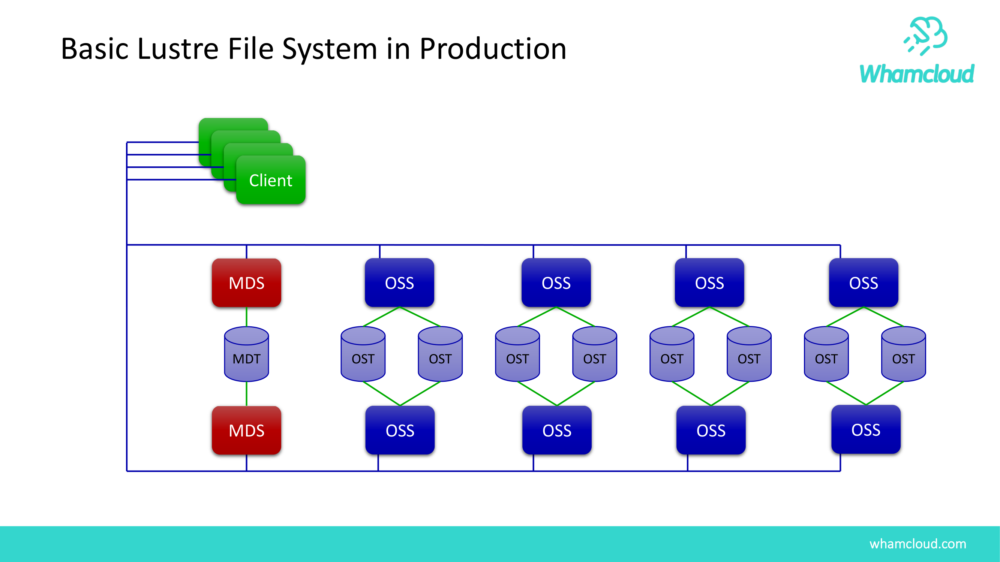

### Key Points & Architecture Data

- Basic Lustre File System in Production
- MDT
- OST
- OST
- OST
- OST
- OST
- OST
- OST
- OST
- MDS
- MDS
- OSS
- OSS
- OSS
- OSS
- OSS
- OSS
- OSS
- OSS
- Client
- Client
- Client
- Client

## Slide 9: whamcloud.com

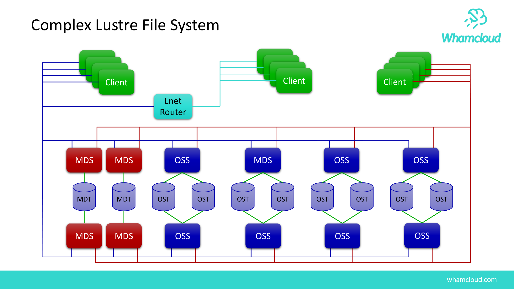

### Key Points & Architecture Data

- Complex Lustre File System
- MDT
- MDT
- OST
- OST
- OST
- OST
- OST
- OST
- OST
- OST
- MDS
- MDS
- MDS
- MDS
- OSS
- OSS
- OSS
- MDS
- OSS
- OSS
- OSS
- OSS
- Client
- Client
- Client
- Client
- Client
- Client
- Client
- Client
- Lnet
- Router
- Client
- Client
- Client
- Client

## Slide 10: whamcloud.com

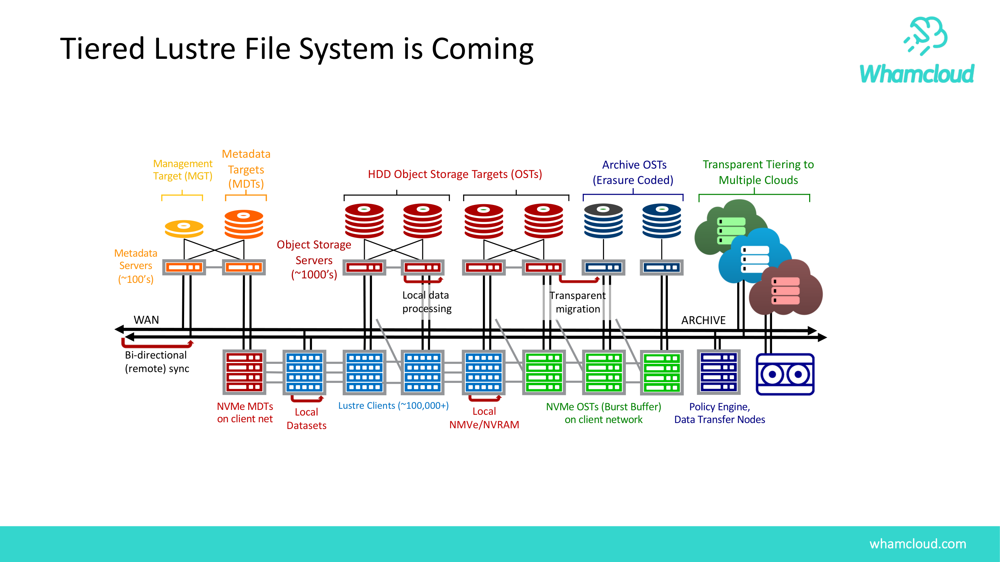

### Key Points & Architecture Data

- Tiered Lustre File System is Coming
- Local
- Datasets
- Local
- NMVe/NVRAM
- Metadata
- Servers
- (~100’s)
- Object Storage
- Servers
- (~1000’s)
- Metadata
- Targets
- (MDTs)
- Management
- Target (MGT)
- HDD Object Storage Targets (OSTs)
- Lustre Clients (~100,000+)
- NVMe MDTs
- on client net
- Archive OSTs
- (Erasure Coded)
- Policy Engine,
- Data Transfer Nodes
- NVMe OSTs (Burst Buffer)
- on client network
- Transparent Tiering to
- Multiple Clouds
- WAN
- ARCHIVE
- Local data
- processing
- Bi-directional
- (remote) sync
- Transparent
- migration

## Slide 11: whamcloud.com

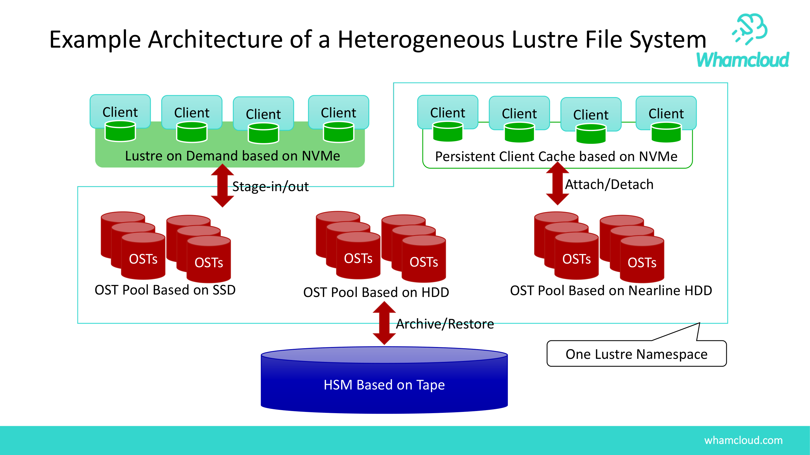

### Key Points & Architecture Data

- Example Architecture of a Heterogeneous Lustre File System
- OST
- OST
- OSTs
- OST
- OST
- OSTs
- OST Pool Based on SSD
- OST
- OST
- OSTs
- OST
- OST
- OSTs
- OST Pool Based on Nearline HDD
- OST
- OST
- OSTs
- OST
- OST
- OSTs
- OST Pool Based on HDD
- HSM Based on Tape
- Client
- Lustre on Demand based on NVMe
- Client
- Client
- Client
- Client
- Persistent Client Cache based on NVMe
- Client
- Client
- Client
- One Lustre Namespace
- Archive/Restore
- Attach/Detach
- Stage-in/out

## Slide 12: whamcloud.com

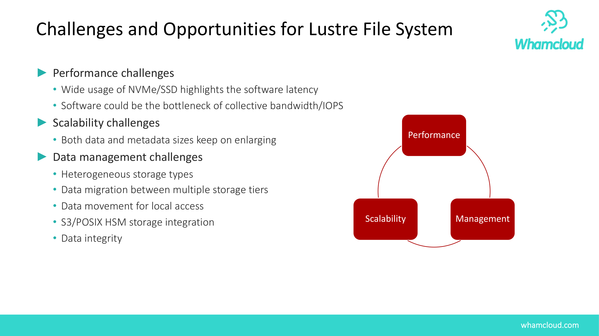

### Key Points & Architecture Data

- Challenges and Opportunities for Lustre File System
- ►Performance challenges
- • Wide usage of NVMe/SSD highlights the software latency
- • Software could be the bottleneck of collective bandwidth/IOPS
- ►Scalability challenges
- • Both data and metadata sizes keep on enlarging
- ►Data management challenges
- • Heterogeneous storage types
- • Data migration between multiple storage tiers
- • Data movement for local access
- • S3/POSIX HSM storage integration
- • Data integrity
- Performance
- Management
- Scalability

## Slide 13: whamcloud.com

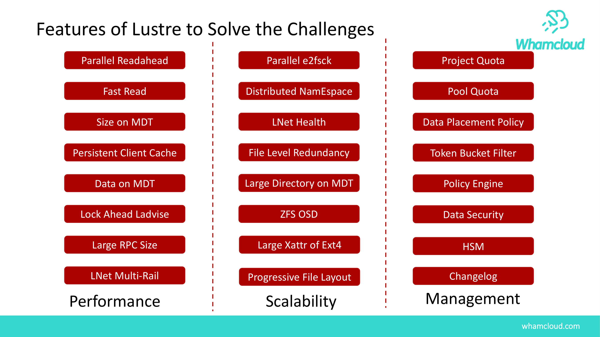

### Key Points & Architecture Data

- Features of Lustre to Solve the Challenges
- Distributed NamEspace
- Data on MDT
- Size on MDT
- Persistent Client Cache
- Parallel e2fsck
- Parallel Readahead
- Data Placement Policy
- LNet Health
- File Level Redundancy
- Token Bucket Filter
- Project Quota
- Pool Quota
- Fast Read
- Lock Ahead Ladvise
- Policy Engine
- Large RPC Size
- Large Directory on MDT
- LNet Multi-Rail
- ZFS OSD
- Data Security
- Performance
- Scalability
- Management
- HSM
- Changelog
- Large Xattr of Ext4
- Progressive File Layout

## Slide 14: whamcloud.com

### Key Points & Architecture Data

- Lustre Community Roadmap
- 2.11
- •
- Data on MDT
- •
- FLR Delayed Resync
- •
- Lock Ahead
- 2.13
- •
- Persistent Client Cache
- •
- Lnet Selection Policy
- •
- Self Extending Layouts
- 2.14
- •
- FLR Erasure Coding
- •
- Health Monitoring
- •
- DNE Auto Restriping
- 2.12
- •
- Lazy Size on MDT
- •
- LNet Health
- •
- DNE Dir Restriping

## Slide 15: whamcloud.com

### Key Points & Architecture Data

- Upcoming Release Feature Highlights
- ►2.12 was released in December, 2018
- • LNet Multi-Rail Network Health – improved fault tolerance
- • Lazy Size on MDT (LSOM) – fast MDT filesystem scanning/attributes
- • File Level Redundancy (FLR) enhancements – usability and robustness
- • T10 Data Integrity Field (DIF) – improved data integrity
- • DNE directory restriping – better space balancing and DNE2 adoption
- ►2.13 development and landing underway, ETA August, 2019
- • Persistent Client Cache (PCC) – store data in client-local NVMe
- • DNE automatic remote directory – improve load/space balance across MDTs
- • LNet User Defined Selection Policy – tune LNet Multi-Rail interface selection
- ►2.14 plans continued functional and performance improvements
- • File Level Redundancy – Erasure Coding (EC) for striped files
- • OST pool quotas – manage space on heterogeneous storage targets
- • DNE directory auto-split – improve usability and performance of DNE2

## Slide 16: whamcloud.com

### Key Points & Architecture Data

- IO-500 (ISC’19)
- 70% increase of the score on the same hardware over 2018-11 list

## Slide 17: whamcloud.com

### Key Points & Architecture Data

- China LUG 2019 is coming!
- ►China local event other than global LUG/LAD
- ►Date: 2019/10/15 (Tue.) 9:00-17:00
- ►Place: The New World Beijing Hotel, Beijing City
- ►Website: http://lustrefs.cn
- ►Presenters:
- • \#jD _P9Q32jFQTL QW32ki-X_P08KN//c
- • 7
- jL0 =>I"KN,32 j+VY 41,Visiting Professor
- • ZjdL0 _P9 e_P9KN/KN
- • O6j][*fA _PKNSi-X_P<;%
- • @HjL eiXEGKN/KN
- • g)5jBi-X_P,08
- • !j?L0iRKNj5	QT^`a
- • MjC"(HPCQTiRbU$M%
- • Peter JonesjDDN/Whamcloud
$M.J
- • Andreas Dilger, DDN/Whamcloud
Lustre CTO
- • :&jDDN/Whamcloud
h'$M%

## Slide 18: Questions?

