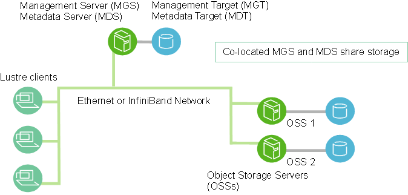
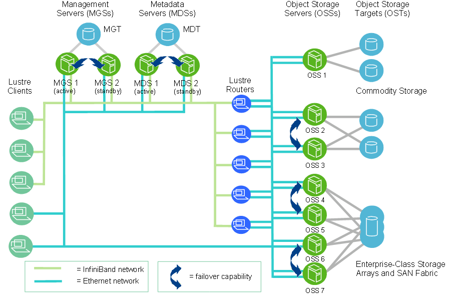
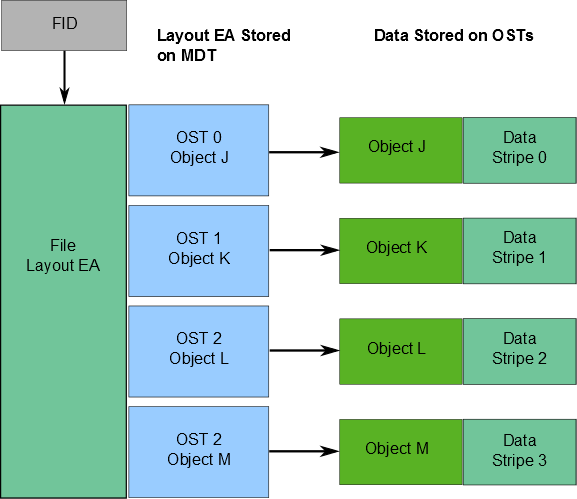
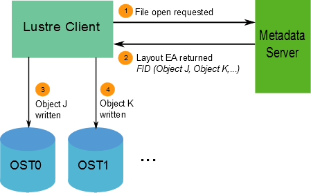
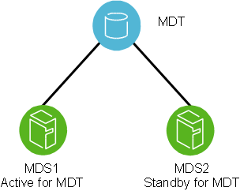
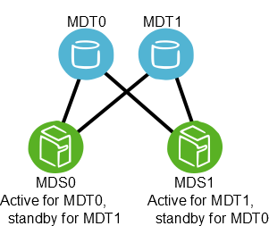
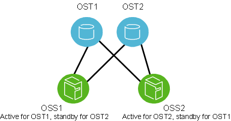

# 01 架构与核心组件详解 (第 1~4 章)

> 来源：官方 Lustre 中文操作手册 (Lustre Chinese Operations Manual)

本文档译自英文版 Lustre 操作手册（http://doc.lustre.org/lustre_manual.xhtml），并
按原文相同的许可证 （Creative CommonsAttribution-Share Alike 3.0 United States License
http://creativecommons.org/licenses/by-sa/3.0/us）免费分享。根本该许可证，任何人均可
复制、修改、分发本文档，以用于包含商业目的在内的任何用途，但需要遵循相同的许
可证。
我们（译者）由于时间仓促，无法保证本文档完全正确、有效。因此，您自阅读本
文档时起，即隐含着与我们达成了免责协议：本文作者和译者不为文档的任何错漏负
责。因此，为避免因武断操作而遭受损失，您在根据本文档执行关键操作之前，应予以
充分测试验证。如果您在生产系统上遇到棘手的Lustre 技术问题，应向相关厂商寻求专
业技术支持，而不应冒然尝试本文档中介绍的操作。
本文翻译工作由 China Open File System （COFS）委员会赞助。COFS 是一个非盈利
的行业组织，支持包括 Lustre 在内的开放、开源的文件系统和存储技术在中国社区的使
用和推广。COFS 以服务中国用户群体为宗旨，以实际应用需求为导向，以开源项目为
基础，以相关厂商为依托，组织社区活动，促进用户交流，构建活跃、进取的中国用户
社区，从而更好地促进Lustre 等开源先进技术在中国的推广和应用，进而促使开源项目
为中国用户的生产活动提供更好的支持。

## 第一章理解 Lustre 的架构


### 1.1 Lustre 文件系统是什么（又不是什么）

Lustre 架构是一种集群设计的存储架构。Lustre 架构的核心组件是Lustre 文件系
统。该文件系统运行于Linux 操作系统之上，提供符合POSIX 标准的UNIX 文件系统接
口。
Lustre 存储架构可用于多种类型的集群。最广为人知的是，它为众多全球最大的高
性能计算（HPC）集群赋能，为这些集群提供了数以万计的客户端系统、PB级的存储
容量和数百GB 每秒的1/O 吞吐率。许多HPC站点使用Lustre 文件系统作全站点级的
全局文件系统，为内部数十个群集提供服务。
Lustre 文件系统具备按需扩展容量和性能的能力，弱化了部署众多独立文件系统的
必要（如每个计算群集部署一个文件系统）。存储管理也得以简化，因为无需在计算集
群间复制数据。Lustre 文件系统不仅聚合了众多服务器的存储容量，也聚合了其1/O 吞
吐率，且可通过增加服务器而扩展。通过动态添加服务器，可轻松增加吞吐率和容量。
Lustre 文件系统可在众多工作环境中运行，但并不一定是所有应用程序的最佳选择。
虽然在一些使用场景下，因其强大的锁机制和数据一致性保障机制，Lustre 文件系统的

单服务器性能可能也比其他文件系统高，但使用Lustre 最合适的场景仍然是：应用所需
超过了单个服务器的能力。
目前，因为 Lustre 缺少软件级别的数据副本，Lustre 文件系统并不特别适合用这种
于“点对点”的使用模式：客户端和服务器运行在同一节点上，每个节点共享一小块存
储。在该使用模式下，如果一个节点（连同其上的客户端和服务器）发生故障，存储在
该节点上的数据将无法存取，直至该节点重启。

### 1.1.1. Lustre 的功能

Lustre 文件系统可运行多种发行版供应商提供的内核上。细节可查看本手册8.1节
"准备安装 Lustre 软件”。
一个 Lustre 系统可在客户端节点数量、磁盘存储量、带宽各方面进行扩展或裁剪。
其可扩展性和性能取决于系统中的可用磁盘、网络带宽以及服务器的处理能力。Lustre
文件系统可部署在多种配置下，这些配置可扩展到的容量和性能，超越了能在现有生产
系统看到的情况。
下表中列出了一些 Lustre 文件系统的可扩展性和性能特征（更完整的Lustre 文件系
统极限列表，可参看5.2 节）：
特征
当前实用范围
客户端可扩展性
100-100000
客户端性能
OSS 可扩展性
单客户端：1/O 性能为90%的网
络带宽。聚合：1/O性能为
50TB/s,50MIOPS。
单 OSS：支持1 到32个OST；
单OST：支持5亿对象，1024TiB
容量。OSS 数目：1000个 OSS，
4000个OST。
OSS性能
单OSS:15GB/s,1.5M IOPS。
聚合：50TB/$，5OM IOPS。
已知生产环境使用
50000+ 客户端，许多或在
10000~ 20000之间
单客户端：15 GB/s（HDR
IB），50000 IOPS。聚合：1/
O性能力10TB/s 10M IOPS。
单 OSS：连接4个OST。单
OST：容量 1024TiB。OSS
数目：450个 OSS,900个
基于750 TiB HDD的OST，
外加 450个基于 25 TiB
NVMe的OST。
单OSS: 10GB/s,1.5M
IOPS。
聚合：20TB/s，20M
IOPS。

特征
MDS 扩展性
MDS 性能
文件系统可扩展性
当前实用范围
已知生产环境使用
单MDS: 1到4个MDT。单
单个 MDS:40亿文件。
MDT: ldiskfs 情况下，单MDT
MDS 数目：生产环境中40
40亿个文件，16TiB 容量；ZFS
个MDS，40个4TiB的
情况下，单 MDT 640亿个文件，
MDT；测试环培中，256个
64TiB 容量。
MDS，256个64GiB的
MDT.
1M/s 的创建性能。2M/s 的 stat
100k/s的创建性能。200k/s
性能。
的 stat 性能。
单文件：基于ldiskfs 最大单文件 单文件：最大单文件几个
大小32PiB。聚合：512 PiB容
TiB。聚合：700 PiB 空间，
量，1万亿文件。
250亿文件。
其他 Lustre 软件性能特征如下：

- 性能增强的ext4 文件系统：Lustre 文件系统使用改进版的ext4 日志文件系统来存
储数据和元数据。该版本名为 ldiskfs，不仅性能有所提升且提供了 Lustre 文件系
统所需的附加功能。Lustre 也可使用 ZFS 作为 Lustre 的MDT、OST 和 MGS 存储
的后端文件系统。这使得 Lustre 能够在单个存储目标上利用 ZFS 的可扩展性和数
据完整性功能。

- 符合POSIX标准：POSIX测试可在 Lustre 客户端上完整通过，就像能在本地的
ext4 文件系统通过一样，只有少量例外。在集群环境下，大多数 Lustre操作都是原
子操作，因此客户端不会看到过期的数据或元数据。Lustre 文件系统支持 mmap0
文件1/O操作。

- 高性能异构网络：Lustre 软件支持各种高性能低延迟的网络，支持在 InfiniBand
（利用 OpenFabrics Enterprise Distribution, OFED）、Intel OmniPath 及其他高级网上
基于远程直接内存访问（Remote Direct Memory Access,RDMA）的方式获得快速、
高效等网络传输。Lustre 路由可将多个 RDMA 网络桥接起来，以获得最佳性能。
Lustre 软件也集成了网络诊断机制。

- 高可用：Lustre 文件系统支持双活故障切换，实现方式是利用OSTs（OSS 存储目
标）和MDT（MDS 存储目标）的共享存储分区。Lustre 文件系统可与各种高可用
（High Availability,HA）管理程序一起工作，以实现自动故障切换并消除单点故障
（No Single Point of Failure,NSPF）。这使得应用程序可以无感知地恢复。多重挂载

保护机制（Multiple Mount Protection,MIMP）提供了内在集成的防护机制，防止
因高可用系统的错误挂载而让文件系统遭受损坏。

- 安全：默认情况下，Lustre 只允许特权端口建立 TCP连接。UNIX组成员身份会在
MDS上进行验证。

- 访问控制列表（ACL）及扩展属性：Lustre 遵循UNIX 文件的安全模型，并使
用POSIX ACL 进行增强。值得推荐的是，它还有一些额外的安全功能，如root
squash。

- 互操作性：Lustre 文件系统可运行在各类CPU架构和大小端混合的群集上。在依
次发布的版本间，Lustre 具有互操作性。

- 基于对象的架构：客户端与盘上文件结构相互隔离，可在不影响客户端的情况下
升级存储架构。

- 字节粒度的文件锁和细粒度的元数据锁：众多客户端可同时读取和修改同一文件
或目录。Lustre 分布式锁管理器（Lustre Distributed Lock Manager, LDLM）确保
了文件在文件系统中所有客户端和服务器间保持一致。MDT锁管理器负责管理关
于inode 权限和路径名的锁。每个OST 各自的锁管理器，用于管理存储于其上的
文件条带的锁，其性能可随着文件系统的增大而扩展。

- 配额：Lustre 文件系统支持用户和组配额。

- 容量增长：通过在群集中新增 OST 和 MDT，可增加 Lustre 文件系统的容量和聚
合带宽，可而无需中断服务。

- 控制文件布局：跨OST 的文件布局，可以以文件、目录或整个文件系统为单位
进行配置。这使得我们可以在文件系统内，根据特定应用需求来优化文件1/0。
Lustre 文件系统使用 RAID-0 将数据条带化，并在OST 间平衡空间用量。

- 网络数据完整性保护：从客户端发送到OSS的所有数据具有校验码，和可防止数
据在传输过程中遭到破坏。

- MPI I/O:Lustre 架构具有专用的MPI ADIO 层，优化了并行1/0以匹配底层文件
系统的架构特点。

- NFS 和 CIFS 导出：Lustre 文件系统可以通过 NFS（基于 Linux knfsd 或 Ganesha）
或CIFS（基于Samba）重新导出，使其可以共享到非 Linux 客户端上（如Microsoft
Windows 和 Apple Mac OS X）。

- 灾难恢复工具：Lustre 文件系统提供在线分布式文件系统检查工具（LFSCK）。在
发生重大文件系统错误的情况下，该工具可恢复存储组件间的一致性。即使存在




*图 1: Lustre 组件 (Lustre Components Architecture)*

不一致，Lustre 文件系统仍可运行，而在文件系统正在使用时，LFSCK 也可运行，
因此即使LFSCK 尚未完成，文件系统仍可恢复生产。

- 性能监视：Lustre 文件系统提供了多种机制来进行性能检查和调优。

- 开放源代码：Lustre 软件遵循 GPL 2.0许可证，可在 Linux 操作系统上自由运行。

### 1.2. Lustre 组件

一个 Lustre 软件装置包含一个管理服务器（MGS）及一个或多个 Lustre 文件系统，
这些部件通过Lustre 网络（LNet）互连起来。下图给出了 Lustre 文件系统组件的一种基
础配置：
Management Server （MGS）
Metadata Server （MDS）
Management Target （MGT）
Metadata Target （MDT）
Co-located MGS and MDS share storage
Lustre clients
Ethernet or InfiniBand Network
OSS 1
但
OSS 2
Object Storage Servers
（OSSs）
图1:Lustre component

### 1.2.1. 管理服务器（MGS）

MGS 存储了集群中所有Lustre 文件系统的配置信息，并将此信息提供给其他 Lustre
组件。每个 Lustre 目标通过联系 MGS来提供信息，而 Lustre 客户通过联系 MGS获取
信息。
MGS 最好能有自己的存储空间，以便独立管理。但同时，MGS 可以与MDS放在
一起共享存储空间，如上图中所示。

### 1.2.2 Lustre 文件系统的组件

每个 Lustre 文件系统都由以下组件组成：

- 元数据服务器（Metadata Server,MIDS）-MDS 将存储在一个或多个MDT 中的
元数据提供给 Lustre 客户端使用。每个 MDS 管理Lustre 文件系统中的名字和目

录，并为一个或多个本地MDT 提供网络请求处理。

- 元数据目标（Metdata Targets,MIDT）- 每个文件系统都至少有一个 MDT，用于
存放根目录。MDT 将元数据（例如文件名，目录，权限和文件布局）存储在 MDS
外挂的存储上。虽然共享存储目标上的 MDT 对多个 MDS 可见，但一次只能由一
个 MDS访问。如果一个活跃的MDS 节点发生故障，另外一个 MDS节点可以接
管该 MDT，并将其服务提供给客户端。这被称为 MIDS 故障切换。
分布式命名空间环境（Distributed Namespace Environment, DNE）可支持多个MDT。
除了存储文件系统根目录的主 MDT 之外，还可添加其他 MIDS 节点，每个 MIDS 节点可
拥有自己的MDT，用以存储文件系统的子目录树。
自 Lustre 2.8版本起，DNE 还支持文件系统将单个目录下的子文件散布到多个
MDT 节点上。跨多个 MDT 分布的目录称条带化目录 （Striped Directory）。

- 对象存储服务器（OSS）：OSS 为一个或多个本地OST提供文件1/O服务并处理网
络请求。OSS 通常服务两个到八个 OST，每个 OST 容量多达16TiB。一个典型的
配置是：在一个专属节点上配备一个 MDT，在每个 OSS 节点上配置两个或更多
OST，在大量计算节点上安装客户端。

- 对象存储目标（OST）：用户的文件数据存储在一个或多个对象中，每个对象单独
位于 Lustre 文件系统的OST 中。每个文件的对象数目可由用户自行调配，对于特
定的工作负载，可自行调试以获得最佳性能。

- Lustre 客户端：Lustre 客户端可以是计算节点、可视化节点或桌面节点，它们运行
了 Lustre 客户端软件，从而可以挂载 Lustre 文件系统。
Lustre 客户端软件提供了一个接口，连接了 Linux 虚拟文件系统和 Lustre 服务
器。客户端软件包含一个管理客户端（Management Client,MGC）、一个元数据客户端
（Metadata Client, MDC）及多个对象存储客户端 （Object Storage Clients,OSC）。每个
OSC 对应文件系统中的一个 OST。
逻辑对象卷（Logical Object Volume,LOV）将OSC集合起来，以提供一种跨越所
有OST的透明访问。因此，挂载了 Lustre 文件系统的客户端看到的是一个单一的、一
致的、同步的命名空间。多个客户端可以同时写入同一文件的不同部位，而与此同时，
其他客户端也可以读取文件。
与LOV 为文件访问所提供的功能类似，逻辑元数据卷 （Logical Metadata Volume，
LMV）将MDC集合起来，以提供一种跨越所有 MDT 的透明访问。这使得客户端可将
分布在多个 MDT上的目录树视为一个单一的、一致的命名空间，并将条带化目录合并
到客户端形成一个单一目录以便用户和应用程序查看。
下表给出了每种 Lustre 文件系统组件所属存储的要求，以及使用硬件的合适特性。




*图 2: 大规模 Lustre 集群架构 (Lustre Cluster at Scale)*

MDS
OSS
客户端
所属存储的要求
1-2% 的文件系统容量
每个OST1到128TiB，
每个 OSS1到8个OST
无需本地存储
可取的硬件特性
强大的 CPU能力，充足的内存，快速的磁
盘存储。
良好的总线带宽，建议在OSS 间均衡分
配存储，并使之与网络带宽匹配。
低延迟，高带宽网络

### 1.2.3 Lustre 网络 （LNet）

Lustre Networking （LNet）是一种定制化网络API，提供了通信基础设施，用以处
理Lustre 文件系统服务器和客户端间的元数据和文件 T1O 数据通信。更多关于 LNet 的
介绍，请查看〝理解Lustre 网络（Lnet）"一章。

### 1.2.4 Lustre 集群

在大规模系统上，一个 Lustre 文件系统集群可包含数百个 OSS 和数千个客户端（如
下图所示）。Lustre 集群中可以使用多种类型的网络。OSS 间共享存储，因而可以启用故
障切换功能。更多关于故障切换的介绍，请查看“理解 Lustre 文件系统种的故障切换"
一章。
Management
Servers （MGSS）
MGT
Metadata
Servers （MDSs）
G MOT
Object Storage
Servers （OSSs）
Object Storage
Targets （OSTs）
已
OSS 1
Lustre
Clients
MGS 1
（active）
MGS 2
（standby）
MDS 1
（active）
MDS 2
（standby）
Lustre
Routers
Commodity Storage
回
回
回
= InfiniBand network
= Ethernet network
0SS 2
OSS 3
OSS 4
033 5
03S 6
OSS 7
^
= failover capability
图 2: Lustre cluster at scale
Enterprise-Class Storage
Arrays and SAN Fabric


### 1.3. Lustre 文件系统存储与1/0

Lustre 文件标识符 （File IDentifier,FID）在内部用于识别文件或对象，类似于本
地文件系统的 inode 号。FID 是一个128位的标识符，包含一个唯一的64位序列号
（Sequence Number,SEQ），一个32 位对象 ID （Object ID, OID）和一个32位版本号
（Version Number）。序列号在文件系统的所有 Lustre 目标（OST 和MDT）中保持唯一，
从而使得多个 MIDT 和 OST 能够唯一地识别对象，而不用依赖底层文件系统的标识符
（例如，inode 号）。这些底层文件系统的标识符则有可能在目标之间发生重叠和冲突。
FID 的SEQ编号也使得我们可以将FID 对应到相应的MDT或OST 上。
LFSCK 是文件系统一致性检查工具，它提供了对现有文件启用 FID-in-dirent 的功
能。其包含的功能如下：

- 验证每个目录条目上存储的FID，如果 FID 无效或缺失，则从 inode 中重新生成。

- 验证每个 inode的linkEA条目，如linkEA 无效或丢失，则重新生成。linkEA存储
了自己的文件名和父目录的FID。linkEA 以扩展属性的形式存储在每个 inode 中。
因此，可利用 linkEA 来仅从 FID 重建文件的完整路径。
有关文件数据在OST上所处位置的信息也以一个扩展属性的形式存储，称为布局
扩展属性 （Layout Extended Atribute, Layout EA）。布局扩展属性存储在 MDT 对象中
（具体如下图所示），MDT 对象则由FID 标识。若该文件是普通文件（非目录或符号链
接），则该 MDT 对象以1-N的方式指向多个位于 OST上的 OST 对象，这些 OST 对象
包含部分的文件数据。若该 MDT 文件指向一个 OST 对象，则所有的文件数据都存储在
该OST 对象中。若该 MDT 文件指向多个对象，则以RAID O的方式将文件数据条带化
（Stripe）到多个对象上，而每个 OST 对象分别存储在不同的OST上。关于 Lustre 文件
系统如何进行条带化，请参看1.3.1 节〝Lustre 文件系统和条带化”。




*图 3: MDS 故障切换模式 (MDS Failover Architecture)*




*图 4: OSS 故障切换模式 (OSS Failover Architecture)*

FID
Layout EA Stored
on MDT
Data Stored on OSTs
File
Layout EA
OST 0
Object J
OST 1
Object K
Object J
Data
Stripe 0
Object K
Data
Stripe 1
OST 2
Object L
Object L
Data
Stripe 2
OST 2
Object M
Object M
Data
Stripe 3
图3:Lustre cluster at scale
当客户端想要读写文件时，首先从文件的 MDT 对象中获取布局EA，然后使用这个
信息对文件执行1/O，此时会直接与存储了对象的OSS 节点进行交互。具体过程如下图
所示。
File open requested
Lustre Client
Metadata
Server
Layout EAreturned
FID （Object J, Objiect K..）
Object J
written
Object K
written
OSTO
OST1
图 4:Lustre cluster at scale
Lustre 文件系统的可用带宽由以下因素决定：

- 网络带宽等于OSS到存储目标的带宽之和。

- 磁盘带宽等于存储目标（OST）的磁盘带宽之和，受网络带宽限制。


*图 5: 双活共享存储硬件拓扑 (Dual-Attached Shared Storage)*


- 聚合带宽等于磁盘带宽和网络带宽的最小值。

- 可用的文件系统空间等于所有OST 的可用空间之和。

### 1.3.1. Lustre 文件系统条带化

Lustre 文件系统之所以性能高，主要原因之一是能够以轮询方式将数据条带化到多
个 OST 上。用户可根据需要为每个文件设置条带数量、条带大小和OST。
使用条带，可以让单个文件的聚合带宽超过单个 OST 的带宽，从而提高性能。同
时，当单个 OST没有足够的可用空间来容纳整个文件时，条带化也可发挥作用。关于
文件条带化的优点和缺点，请查看19.2 节*Lustre 文件布局（条带化）的一些考量”。
如下图所示，条带将文件的数据区段或区块存储在不同的 OST 中。在Lustre文件
系统中，数据以RAID 0的模式分条在若干数目的对象中。一个文件中的对象数目称为
stripe_count。
每个对象包含文件的一块数据，当写入特定对象的数据块超过 stripe _size 时，文件
的下一数据块将存储在下一对象中。
stripe_count 和 stripe _size 的默认值由文件系统设置，其中，stripe_count 为1，
stripe_size 为1MB。用户可以在每个目录或每个文件上更改这些值。
下图中，文件C的stripe_size 大于文件A 的stripe_size，这让C能将更多的数据存
储在文单个条带中。文件 A 的 stripe_count 为3，导致A 的数据分条在三个对象上。而
文件B和文件C的 stripe_count 是1。
OST 不会为未写入的数据预留空间。
LOV
OSC1
OSC2
OSC3
OST1
OST2
OST3
File A data
File B data
File C data
Object
图 5:Lustre cluster at scale
文件的最大大小不受单个目标大小的限制。在Lustre 文件系统中，文件可以跨越多
个对象（最多2000个）条带化，在ldiskfs 上，每个对象最大可达16 TiB，在 ZFS上，
每个对象最大可达256PiB。因而，ldiskts 的最大文件大小为31.25 PB，ZFS 的最大文件
大小为8EiB。Lustre 文件系统可支持最多2~63字节（8EB）的文件，只受限于 OST上
的可用空间。

注意
OST。
对于不支持ea_inode功能的ldiskfs 文件系统，其单文件的最大条带数为160个
尽管一个文件只能条带化到2000个对象上，但是Lustre 文件系统本身可拥有数干
个OST。访问单个文件的1/O带宽是文件所属所有对象的聚合1/O 带宽，可至多获得高
至2000个服务器的带宽。在具有2000多个OST的系统上，客户端通过同时执行多个
文件读写来完美利用文件系统总带宽。
更多关于条带化的信息，请参第19章，管理文件布局（条带化）及剩余空间。
扩展属性（xattrs）
Lustre 以 lov_user_md
_V1/lov_user.
md_v3 为数据结构，以扩展属性为存储形式，维
护其文件条带信息。在文件和目录创建时，扩展属性被创建。Lustre 以一系列 trusted 扩
展属性来存储一系列参数，这些参数只有root 才能访问。这些参数包括：- trusted.lov：
保存普通文件的布局信息，或存储在目录上的默认文件布局信息（非 root用户也可
以通过1ustre.1ov访问）。- trusted.Ima： 保存当前文件的FID 和额外的状态标志。-
trusted.Imv：保存一个条带化目录的布局（DNE 2），如果目录没有条带化，则此参数不
存在。-trusted.link：对每个硬链接，保存其父目录 FID+文件名（用于1fs fid2path）。
在文件中存储且公开展示的 xattr 可以用以下方式验证：
1 # getfattr -d -m - /mnt/testfs/file

## 第二章理解 Lustre 网络（LNet）

本章介绍 Lustre 网络 （LNET）。

### 2.1. LNet 简介

在包含一个或多个 Lustre 文件系统的集群中，Lustre 文件系统所需的网络通信基础
设施是通过 Lustre Networking （LNet） 功能来实现的。
LNet 支持许多常见的网络类型，如InfiniBand 和IP 网络，并支持多种不同网络类
型的同时可用及它们之间的路由。LNet 支持远程直接内存访问（Remote Direct Memory
Access,RDMA），只要底层网络支持这一特性，且安装了合适的Lustre 网络驱动程序
（Lustre Network Driver, LND）。结合服务器的故障切换机制，LNET的高可用和恢复功
能，可以实现恢复对应用透明。
LND 是一种可插拔驱动程序，可为特定网络类型提供支持。例如，ksocklInd 实现了
TCP Socket LND，是支持TCP 网络的驱动程序。LND会被加载到驱动程序堆栈中，每
种LND 对应着正在使用中的一种网络类型。
如何配置 Lnet 网络，请查看第九章，“配置 Lustre 网络（LNet）"。

如何管理 Lnet 网络，请查看第三部分，“管理Lustre"。

### 2.2. LNet 的主要功能

LNet 的主要功能包括：

- 远程直接内存访问，如果底层网络支持的话

- 支持多种常用的网络类型

- 高可用性和可恢复性

- 支持同时使用多种网络类型

- 多元网络间的路由
在各种不同网络互联间，LNet 可以让端到端的读写吞吐率达到或接近峰值带宽速
率。

### 2.3.Lustre 网络

Lustre 网络由运行Lustre 软件的客户端和服务器组成。它不局限于一个 LNet 子网，
倘若网络之间可以进行路由，它可以跨越多个网络。类似地，一个单独的网络可以包含
多个LNet 子网。
Lustre 网络堆栈由两层组成：LNet 代码模块和 LND。LNet 层在 LND 层之上操作，
其方式类似于网络层在数据链路层之上操作。LNet 层是无连接的、异步的，不进行传输
数据验证。LND 层是面向连接，通常进行数据传输验证。
LNet 通过唯一的标签进行标识，该标签由两部分组成，前一部分为LND 对应字
符串，后一部分为一个数字，如tcpO、o2ibO、o2ibl。LNet 上的每个节点至少有一个网
络标识符（Network IDentifier,NID）。NID 由网络接口地址和 LNet 标签组成，形式次：
*address*@*INet_label*.
例如：
1 192.168.1.2etcp0
2 10.13.24.908o2ib1
在某些情况下，Lustre 文件系统流量可能需要在多个 LNets 之间传递，这就需要用
到LNet 路由。请注意，LNet 路由不同于网络路由。

### 2.4. 支持的网络类型

LNet 代码模块所包含的 LNDs 支持以下网络类型：

- InfiniBand: OpenFabrics OFED （o2ib）

- TCP（包括 GigE、10GigE、IPoIB 等在内的任何可传输 TCP通信的网络）


- RapidArray:ra

- Quadrics: Elan

## 第三章 Lustre 文件系统的故障切换


### 3.1. 什么是故障切換

在高可用的（High-Availability,HA）系统中，通过使用冗余硬软件组件，可以让服
务得以在故障发生时自动恢复，从而最大限度地减少计划外停机时间。当失效情况发生
时，例如发生服务器宕机、存储设备宕机、网络故障或软件故障，在短暂中断后，系统
服务将继续运行。通常，可用性的衡量方法是系统必须处在可工作状态的时间比例。
可用性通过硬件和（或）软件的冗余来实现，这样，当主服务器发生故障或不可用
时，备用服务器将切换到就位状态，从而运行应用程序和相关资源。这个过程，称为故
障切换（Failover），其在高可用性系统中是自动的，而且在大多数情况下，是对应用完
全透明的。
支持故障切换的硬件装置需要一对服务器共享资源（通常共享的是物理存储设备，
该设备可能基于 SAN、NAS、硬件 RAID、SCSI 或光纤通道技术）。在设备级别上，存
储的共享方式必须基本上是透明的；相同的物理 LUN （Logical Unit Number） 必须在两
台服务器上可见。为了在物理存储级确保高可用，我们推荐使用RAID 阵列来防护硬盘
驱动器级别的故障。
注意
Lustre 软件暂不提供数据冗余，它完全依赖于备用存储设备的冗余。后端OST存储
应该采用 RAIDS，最好是RAID6。MDT 存储应次 RAIDI 或RAID10。

### 3.1.1 故障切换的功能

为了创建高可用的 Lustre 文件系统，需要使用电源管理软件或硬件、高可用（High
Availability,HA）软件，它们提供了故障切换的以下功能：

- 资源屏蔽：防止两个节点同时访问物理存储。

- 资源管理：作为故障切换的一部分，进行Lustre 资源的启动和停止、维护集群状
态、执行其他资源管理任务。

- 健康监控：验证硬件和网络资源的可用性，并根据Lustre 软件提供的健康指标进
行响应。
这些功能可以由各种软件和（或）硬件解决方案提供。更多关于如何配合 Lustre
使用电源管理软硬件和高可用 （High Availability，HA）软件的信息，请参考第十一章，
"在Lustre 文件系统中配置 Lustre 文件系统"。

HA 软件负责检测Lustre 服务器节点的故障并控制故障切换。Lustre 软件可与任何
含资源（1/O）屏蔽（fencing）功能的HA软件配合使用。为恰当地实现资源屏蔽，HA
软件必须能够完全关闭失效的服务器，或将其从共享存储设备上断开。若两个活动节点
同时访问一个存储设备，则可能严重损坏数据。

### 3.1.2故障切换配置类型

集群中的节点可以按照多种方式进行故障切换配置。它们通常成对配置（例如，两
个 OST 连接到同一共享存储设备），但也存在其他故障切换配置方式。故障切换配置方
式包括：

- '主动/被动”对：在此种配置中，主动节点供应资源并提供数据服务，而被动节点
则通常闲置待命。如果主动节点发生故障，则被动节点将接管并成为主动节点。

- 主动/主动”对：两个节点都处于活动状态，每个节点都提供资源的部分子集。当
发生故障时，故障节点上的资源由另一个节点接管。
如果文件系统仅包含单个 MDT，可将两个 MDS 配置“主动/被动"对，而OsS
可以用“主动/主动”的方式部署，从而既改进了 OST 的可用性又避免了额外开销。通
常，备用MDS是另一个 Lustre 文件系统的活跃 MDS，或者是 MGS，因此集群中没有
节点闲置。如果文件系统中包含多个 MDT，可以使用“主动/主动”故障切换配置来部署
MDS，从而为共享存储上的 MDT 提供服务。

### 3.2. Lustre 文件系统中的故障切换功能

Lustre 软件提供的故障切换功能可以在下面这种场景下发挥作用。当客户端尝试发
出 IO 时，但该Lustre 目标发生故障，这个客户端将反复尝试，直到从该Lustre 目标的
任一已配置的故障切換节点收到回复。除了完成1/O 操作所需的时间可能变长之外，用
户空间应用程序检测不到任何异常。
Lustre 文件系统的故障切换功能要求将两个节点配置一对故障切换对，这一对节
点间共享一个或多个存储设备。Lustre 文件系统可通过不同的配置，提供 MIDT 或OST
的故障切换能力。

- MDT 故障切换：可为同一个 MDT 配置两个 MDS 节点。在任何时刻，任一MDT
的服务只由一个 MDS 节点为提供。通过将两个或更多 MDT 分区放置在由两个
MDS 节点共享的存储上，当一个 MDS 发生故障时，另一个 MDS 可无服务的
MDT 提供服务。这也就是“主动/主动〝故障切换对 （active/active failover pair）。

- OST 故障切换：可为一个 OST 配置多个 OSS 节点，但在任何时刻，只有一个 OSS
节点为OST 提供服务。可使用umount/mount命令在可访问同一存储设备的OSS
节点之间移动 OST 服务。


```bash
在创建 Lustre 文件系统时（用mkfs.lustre命令），可使用--servicenode选项
```
来指定服务的故障切换节点。在激活 Lustre 文件系统后，也可以使用该选项来修改服
务的故障切换节点（tunefs.lustre命令）。关于这些工具的介绍，请参看**第44.13
节，'tunefs.lustre**。
Lustre 文件系统中的故障切换功能可用于在后续小版本间升级Lustre 软件，而无须
中断集群的运行。更多介绍，请参看第十七章“升级Lustre 文件系统"。
更多关于故障切换功能的配置，请参看第十一章〝配置 Lustre 文件系统的故障切
换'。
注意：Lustre 软件仅在文件系统级别提供故障切换功能。在完整的故障切换解决方
案中，系统级组件的故障切换功能（如节点故障检测或电源控制）必须由第三方工具提
供。
注意：OST 故障切换功能无法防止磁盘故障造成的损坏。假如用作 OST 的存储介
质（即物理磁盘）发生故障，则无法通过Lustre 软件提供的功能来恢复。我们强烈建议
在OST上使用某种形式的 RAID。Lustre 假设存储是可靠的，因此没有提供功能来提高
存储的可靠性。

### 3.2.1 MDT 故障切换配置（主动/被动）

如下图所示，通常会配置两个 MDS为“主动/被动”故障切换对。请注意，两个节
点都必须能够访问 MDT 和MGS的共享存储。主（主动）MDS 管理 Lustre 系统元数据
资源。当主 MDS发生故障，则从（被动）MDS将接管这些资源并为MDT和MGS提供
服务。
注意：在具有多个文件系统的环境中，MDS 可配置为类似主动/主动的模式，每个
MDS 管理这些Lustre 文件系统中元数据的一个子集。




*图 6: LNet Multi-Rail 拓扑*




*图 7: LNet 路由器架构*

MDT
MDS1
Active for MDT
MDS2
Standby for MDT
图 6:MDT_activepassive

### 3.2.2 MIDT 故障切换配置（主动/主动）

MIDT 设置可为“主动/主动”故障切换模式。故障切换集群由两个 MDS组成，如下
图所示。
MDTO
MDT1
MDSO
Active for MDTO.
standby for MDT1
MDS1
Active for MDT1，
standby for MDTO
图7:MDT_activeactive




*图 8: 跨网段 LNet 路由与客户端接入*


### 3.2.3 OST 故障切换配置（主动/主动）

OST通常配置负载均衡的、“主动/主动”式故障切换对。一个故障切换集群由两
个OSS组成，如下图所示。
注意：配置为故障切换对的 OSS 必须共享磁盘或 RAID。
OST1
OST2
OSS2
Active for OST1, standby for OST2 Active for OS T2, standby for OST1
图 8:OST_activeactive
在“主动/主动”式配置中，50%的可用 OST 分配给一个 OSS，其余的 OST 分配给
另一个 OSS。每个 OSS 作为半数OST 的主节点，又作为其余OST 的故障切换节点。
在这种模式下，如果一个 OSS 故障，那么另一个OSS 会接管所有剩余的OST。客
户端将尝试连接每个提供 OST 服务的OSS，直到其中一个有响应。OST上的数据是同
步写入的，而故障切换完成后，客户端会重新发起在OST 故障时正在进行但未提交到
磁盘的事务。
更多关于故障切换功能的配置，请参看第十一章，“配置 Lustre 文件系统的故障切
换"。

## 第四章安装概述

本章主要介绍了安排、安装和配置 Lustre 文件系统的全过程。
注意：如果 Lustre文件系统对您来说是个新事物，那么在安装之前，建议您本文档
的前面部分，以了解 Lustre 架构、文件系统组件和术语。

### 4.1. 安装 Lustre 软件的步骤

设置 Lustre 文件系统硬件、安装和配置Lustre 软件，请按以下顺序进行，并参阅下
列章节：
1.（必要）设置Lustre 文件系统硬件。

