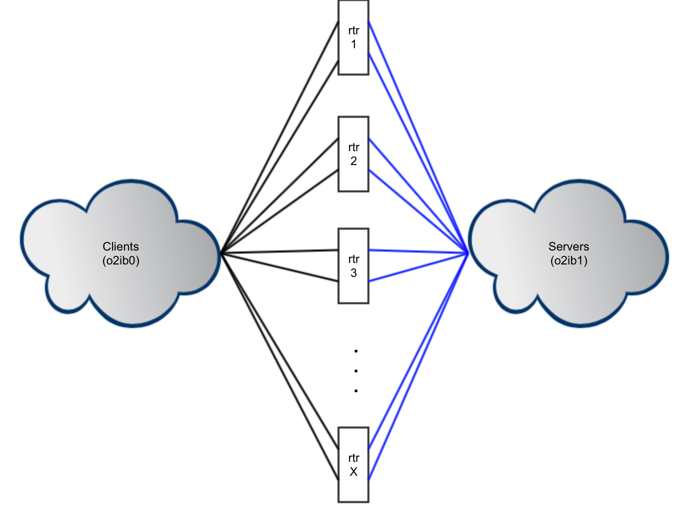

# 03 集群运维管理与灾备 (第 11~18 章)

> 来源：官方 Lustre 中文操作手册 (Lustre Chinese Operations Manual)

文件布局参数
默认值 说明
stripe_size
stripe_count
start_ost
1MB
在移到下一个 OST 之前写入一个 OST 的数据量。
单个文件所使用的 OSTs个数。
每个文件用于创建对象的首个 OST。默认值为-1，允许MIDS
根据可用空间和负载平衡来选择起始索引。强烈建议不要将此
参数的默认值更改为-1 以外的值。
使用1fs setstripe来更改文件布局配置。

### 10.2.3. 使用 Lustre 配置实用程序

如须进行其他附加配置，Lustre 提供了一些实用的配置工具：

- mkfs.lustre：用于Lustre服务器格式化磁盘。

- tunefs.lustre：用于在 Lustre 目标磁盘上修改配置信息。

- Ictl：用于通过ioctl 接口直接控制Lustre 功能，允许访问各种配置、维护和调试功
能。

- mount.lustre：用于启动 Lustre 客户端或目标服务器。
实用程序 Ifs 可用来配置和查询有关文件的一些不同选项功能。
注意
一些示例脚本可在 Lustre 软件安装目录中找到。如您安装了 Lustre 源代码，则脚本
位于 luster / tests 子目录中。利用这些脚本您可以快速设置一些简单的标准Lustre 配置。

## 第十一章 Lustre 故障切换配置


### 11.1. 故障切换环境设置

Lustre 软件提供了在 Lustre 文件系统层面的故障切换机制，但没有提供完整的故障
切换解决方案。一般来说，完整的故障切换解决方案会为失效的系统级别组件提供故障

切换功能，例如切换失效的硬件或应用，甚至切换失效的整个节点。但是Lustre没有提
供这部分功能。诸如节点监视、故障检测和资源保护等故障切换功能必须由外部HA软
件提供，例如 PowerMan，或由Linux 操作系统供应商提供的开源 Corosync 和 Pacemaker
软件包。其中，Corosync 提供了检测故障的支持，Pacemaker 则在检测到故障后采取行
动

### 11.1.1 选择电源设备

Lustre 文件系统中的故障切换需要使用远程电源控制（Remote Power Control, RPC）
机制，它具有多种配置。例如，Lustre 服务器节点可能配备了支持远程电源控制的
IPMI/BMC 设备。我们不推荐使用过去一度常见的相关软件。有关推荐的设备，请参阅
PowerMan 集群电源管理工具网站上的RPC支持设备列表。

### 11.1.2 选择电源管理软件

在将1/O 重定向到故障转移节点之前，需要验证故障节点已经关闭，Lustre 故障切
换机制需要 RPC 和管理功能软件来验证这一点。这样可以避免重复在两个节点上挂载
同一个服务，产生不可逆的数据损坏风险。Lustre 可使用很多不同的电源管理工具，但
最常见的两个软件包是 PowerMan 和 Linux-HA（又名 STONITH）。
PowerMan 集群电源管理工具可用于集中控制RPC设备。它为多种 RPC 提供了原
生支持，其专家级的配置简化了新设备添加操作。（最新版本的 PowerMan）
STONITH （Shoot The Other Node In The Head） 是一套电源管理工具，早在Red Hat
Enterprise Linux 6之前就已经包含在 Linux-HA 包中。Linux-HA 对许多电源控制设备具
备原生支持，具备可扩展性（使用Expect 脚本来进行自动化控制），提供了相关软件来
检测和处置故障。Red Hat Enterprise Linux 6之后，Linux-HA 在开源社区被 Corosync 和
Pacemaker 的组合所取代。Red Hat Enterprise Linux 用户可以从 Red Hat 获得使用 CMAN
的集群管理功能。

### 11.1.3选择高可用性软件

Lustre 文件系统必须设置高可用性（HA）软件以启用完整的Lustre 故障切换解决方
案。上述 HA软件包，除了PowerMan之外，都同时提供了电源管理和集群管理。使用
Pacemaker 来设置故障转移，请参阅：

- Pacemaker 项目网站


- 在 Lustre 文件系统中使用 Pacemaker 详解

### 11.2. 为故障切换而准备 Lustre 文件系统

为使Lustre 文件系统其具备高可用性，我们通过第三方 HA 应用程序对其进行配置
和管理。每个存储目标（MGT, MGS, OST）都必须与另一个备用节点相关联，以创建故
障切换对。当客户端挂载文件系统时，此配置信息由 MGS传送给客户端。
在挂载存储目标时，其配置信息会转发 MGS。与此相关的一些规则是：

- 初次挂载目标时，MGS 从目标读取配置信息（诸如 mgt vs.ost, failnode, fsname），
并将该存储目标配置到 Lustre 文件系统上。如果 MGS 是首次读取到这一挂载配
置，则该节点将成为该存储目标的"主"节点。

- 再次挂载目标时，MGS从目标读取当前配置，并根据需要重新配置 MGS 数据库
里的目标信息

```bash
使用mkfs.lustre命令格式化目标时，通过--servicenode选项来指定目标的
```
故障切换服务节点。在下面的示例中，文件系统 testfs 中编号为0的OST被格式化，两
个服务节点被指定成该 OST 的故障切换对：

```bash
1 mkfs.lustre --refornat --ost --fsname testfs --mgsnode-192.168.10.1Co3ib\
```
--index=0 --servicenode-192.168.10.78o2ib\
--servicenode-192.168.10.8@o2ib\
/dev/sdb
可为目标指定两个以上的潜在服务节点。可在任何指定的服务节点上载入目标。
在存储目标上配置 HA 时，Lustre 软件会启用该存储目标上的重复挂载保护
（Multiple Mount Protection, MIMP）。MMP 可防止多个节点同时挂载，从而造成目标上的
数据损坏。
如果 MGT 在格式化时被指定了多个服务节点，那么这个信息必须通过文件系统的
mount 命令传递给Lustre 客户端。在下面的示例中，我们在客户端上执行的 mount 命令，
指定了两个可为 MGT 提供服务的 MGSs 节点的 NIDs：

```bash
1 mount -t lustre 10.10.120.1@tcp1:10.10.120.2etcp1:/testfs /lustre/testfs
```
当客户端挂载文件系统时，MGS 向客户端提供文件系统的配置信息（MDT 和OST
的相关信息，每个目标关联的所有服务节点的 NID，以及当前载入目标的服务节点）。
随后，当客户端发起目标上的数据访问时，它会尝试每个指定的服务节点的 NID，直到
成功连接到目标。


## 第十二章 Lustre 文件系统监控配置


### 12.1.Lustre Changelogs

Changelogs（更新日志）功能负责记录文件系统名称空间或文件元数据变更事件。
诸如文件创建，删除，重命名，属性变更等，这些修改将与目标文件标识符（FID）、父
目录文件标识符、目标名称、时间戳及用户信息一起被记录下来。这些记录可用于多种
用途：-捕获最近的更改，存入归档系统。-利用 Changelogs 条目完成文件系统镜像的变
更精确复制。-设置监测脚本，作用于某些事件或目录。-维护一个粗略的审计跟踪（文
件/目录随时间戳变化，不含用户信息）。
Changelogs 的记录类型有：
值
MARK
CREAT
MIKDIR
HLINK
SLINK
MKNOD
UNLNK
RMDIR
RNMFM
RNMTO
OPEN *
CLOSE
LYOUT
TRUNC
SATTR
XATTR
HSM
说明
内部记录保存
常规文件创建
目录创建
硬链接
软链接
其他文件创建
常规文件移除
目录移除
重命名，原名称
重命名，目标名称
打开
关闭
Layout 变更
常规文件截短
属性变更
附加属性变更
HSM 相关事件

值
说明
MTIME
MTIME 变更
CTIME
CTIME 变更
ATIME *
ATIME 变更
MIGRT
文件迁移事件
FLRW
文件级别副本：文件初始写入
RESYNC
文件级别副本：文件重新同步
GXATR * 扩展属性访问（getxattr）
NOPEN * 被拒绝的文件打开
其中带*号的类型在默认情况下不会被记录。
Lustre 还提供了从文件标识符（FID）到文件路径，以及从文件路径到文件标识符
的操作，以方便将目标文件和父目录的文件标识符映射到文件系统命名空间。

### 12.1.1 Changelogs 相关命令

以下是一些与 Changelogs 相关的命令：

### 12.1.1.1 1ct1 changelog_register 由于 Changelog 记录需要在 MDT上占用一些

空间，系统管理员必须注册 Changelogs 用户。一旦 Changlog用户注册完成，Changelogs
功能则被打开。注册用户需指定哪些记录已经”处理完成”，系统则将清除已处理完成的
记录，直到遇到那些未被所有用户处理完成的记录。
要注册新的日志用户，请运行：
mds# lct1 --device fsname-MDTnumber changelog_register
超出注册用户的设置点的 Changelogs 条目不会被清除（请参阅 Ifs changelog_clear
相关信息）。

### 12.1.1.2 1fs changelog 在 MDT 上显示元数据变更（changelog 记录），请运行：

lfs changelog fsname-MDTnumber ［startrec ［endrec］ ］
可选择是否指定开始和结束记录。以下是 changelog 记录示例：
1 1 02MKDIR 15:15:21.977666834 2018.01.09 0x0 t=［0x200000402:0x1:0x0］
j=mkdir.500 ef=Oxf\

2 u=500:500 nid-10.128.11.15%tcp P-［0x200000007:0x1:0x01 pics
3 2 01CREAT 15:15:36.687592024 2018.01.09 0x0 t=［0×200000402:0x2:0×0］
j=cp.500 ef=0xf\
4 u=500:500 nid=10.128.11.159etcp p=［0x200000402:0x1:0x0］ chloe.jpg
5 3 06UNINK 15:15:41.305116815 2018.01.09 0x1 t=［0x200000402:0x2:0x0］
j=rm.500 ef=0xf\
6 u=500:500 nid-10.128.11.159etcp P=［0x200000402:0x1:0x0］ chloe.jpg
7 4 07RMDIR 15:15:46.468790091 2018.01.09 0x1 t=［0x200000402:0x1:0×0］
j=rmdir.500 ef=Oxf\
8 u=500:500 nid-10.128.11.159atcp p=［Ox200000007:0x1:0x0］ pics

### 12.1.1.3 1£s changelog_clear 为某个特定用户清除老的changelog 记录（该用户

不再需要的记录），请运行：
1fs changelog_clear mdt_name userid endrec
changelog_clear命令说明该用户对 endrec之前的 Changelog 记录已经不再感兴
趣，这也使得 MIDT 能够释放一部分磁盘空间。当 endrec 值为0时，表明清除到当前最
后一条记录。要运行 changelog_clear,changelog 用户必须已经通过Ictl 命令在 MDT节
点上注册。
当所有 changelog 用户处理完成了某个节点之前的记录时，记录被完全删除。

### 12.1.1.4 1ct1 changelog_deregister 注销 changelog 用户，请运行：

lct1 --device mdt_device changelog_deregister userid
changelog_deregister cll 在完成注销操作时，相当于快速执行了 Ifs changelog_clear
cl10命令。

### 12.1.2 Changelogs 命令示例

以下是一些不同的 Changelogs 命令的示例

- 注册 Changelog 用户
为某个设备 （lustre-MDT0000）注册
一个新的 Changelog 用户：
mds# lct1 --device lustre-MDT0000 changelog_register
lustre-MDT0000: Registered changelog
userid'cl1，

- 显示 Changelog 记录
在 MDT 上显示 Changelog 记录：

1 S lfs changelog lustre-MDT0000
2 1 02MKDIR 15:15:21.977666834 2018.01.09 0x0 t=［0x200000402:0x1:0x0］ ef=0xf\
3 u=500:500 nid-10.128.11.159tcp p=［0x200000007:0x1:0x0］ pics
4 2 01CREAT 15:15:36.687592024 2018.01.09 0x0 t=［0x200000402:0x2:0x0］ ef=Oxf\
5 u=500:500 nid=10.128.11.159tcp p=［Ox200000402:0x1:0x0］ chloe.jpg
6 3 06UNLNK 15:15:41.305116815 2018.01.09 0x1 t=［0x200000402:0x2:0x0］ ef=0xf\
7 u=500:500 nid-10.128.11.159atcp p=［0x200000402:0x1:0x0］ chloe.jpg
8 4 07RMDIR 15:15:46.468790091 2018.01.09 0x1 t=［0x200000402:0x1:0x0］ ef=0xf\
9 u=500:500 nid-10.128.11.159atcp p=［0x200000007:0x1:0x0］ pics
Changelog 记录包含了如下信息：
1 rec#
2 operation_type （numerical/text）
3 timestamp
4 datestamp
5 flags
6 t=target_FID
7 ef-extended flags
8 u=uid:gid
9 nid-client_NID
10 p parent_FID
11 target
_name
显示格式为：
1 rec# operation_type （numerical/text） timestamp datestamp flags t=target_FID\
2 ef-extended_ flags u=uid:gid nid-client_NID P-parent_FID target_name
如：
1 2 01CREAT 15:15:36.687592024 2018.01.09 0x0 t=［0x200000402:0x2:0x0］ ef=0xf\
2 u=500:500 nid-10.128.11.159atcp p=［Ox200000402:0x1:0x0］ chloe.jpg

- 清除 Changelog 记录
通知设备某个特定用户（c11）已经不需要相关记录（3及3之前的）：

```bash
$ lfs changelog_clear lustre-MDT0000 c11 3
```
确认 changelog_clear 操作成功，运行Ifs changelog。我们看到只显示了id-3以后的
条目：

1 $ lfs changelog lustre-MDT0000
2 4 07RMDIR 15:15:46.468790091 2018.01.09 0x1 t=［0x200000402:0x1:0x0］ ef=0xf\
3 u=500:500
nid-10.128.11.159gtcp P=［Ox200000007:0x1:0x01 Pics

- 注销 Changelog 用户
在某个设备上 （lustre-MDR0000） 注销某个 Changelog 用户 （c11）：
mds# lct1 --device lustre-MDT0000 changeloq_deregister Cl1
lustre-MDT0000: Deregistered changelog user 'cl1'
注销操作清除了该用户所有 Changelog 记录。
1 $ 1fs changelog lustre-MDT0000
2 5 00MARK 15:56:39.603643887 2018.01.09 0x0 t=［0x20001:0x0:0x0］ ef=Oxf\
3 u=500:500 nid=0e<0:0> P-10:0x50:0xb］ mdd_obd-lustre-MDT0000-0
注意
MARK 记录表明了 Changelog 记录状态变化。

- 显示 Changelog 索引及注册用户
显示某个设备 （lustre-MDR0000）上的当前最大 Changelog 索引及已注册的 Changelog
用户：

```bash
1 mds# lctl get_param mdd.lustre-DT0000.changelog_users
```
2 mdd.lustre-MDT0000.changelog_users-current index: 8
3 ID
index （idle seconds）
4 c12
8 （180）

- 显示 Changelog 掩码
在某个设备上 （lustre-MDR0000） 显示当前 Changelog 掩码：
1 mds# lct1 get param
mdd.lustre-MDT0000.changelog_mask
3 mdd.lustre-MDT0000.changelog_mask=
4 MARK CREAT MKDIR HLINK SLINK MIKNOD UNLNK RMDIR RENME RNMTO CLOSE LYOUT\
5 TRUNC SATTR XATTR HSM MTIME CTIME MIGRT

- 设置 Changelog 掩码
在某个设备上 （lustre-MIDR0000）设置 Changelog 掩码：


```bash
1 mds# lctl set_param mdd.lustre-MDT0000.changelog_mask-HLINK
```
2 mdd.lustre-MDT0000.changelog_mask-HL.INK
3 S lfs changelog_clear lustre-MDT0000 cl10
4 $ mkdir /mnt/lustre/mydir/foo
5 s cp /etc/hosts /mnt/lustre/mydir/foo/file
6 $ In /mnt/lustre/mydir/foo/file /mnt/lustre/mydir/myhardlink
只有掩码中有的条目类型才在Changelog 中显示：
1 $ lfs changelog lustre-MDT0000
2 9 03HLINK 16:06:35.291636498 2018.01.09 0x0 t=［0x200000402:0x4:0x0］ ef=0xf\
3 u=500:500 nid-10.128.11.159etcp p=［0x200000007:0x3:0x0］ myhardlink

### 12.1.3 Changelogs 审计

Lustre Changelogs 的一个特殊用例是审计。根据其在维基百科上的定义，信息技术
审计被用来评估机构的信息资产保护及合理分发信息至授权机构的能力。基本上，它根
据当前访问控制策略对所有数据访问进行控制，而这一操作通常通过分析访问日志来实
现。
审计可以用作考量当前安全情况的证据，但同时也是应参照遵循的准则。
Lustre Changelogs 提供了很好的审计机制，他是一个集中化的工具，易于交互。
Changelogs 包含了用于审计的所有必要信息：

- 文件标识符（FIDs）和目标名称可用于识别活动对象。

- UID/GID 和 NID 信息可用于识别活动主体。

- 时间戳可用于读取活动时间。

### 12.1.3.1启用审计功能

如果需要一个功能齐全的基于 Changelogs 的审计工具，必须启用一些额外的
Changelog 记录类型，以便能够记录诸如 OPEN，ATIME，GETXATTR 和 DENIED OPEN
等事件。请注意，启用这些记录类型可能会对性能造成一些影响。比如从文件系统的角
度来看，进行读操作时，记录 OPEN 和 GETXATTR 事件将生成 Changelog 记录写入。
从审计角度来看，能够记录 OPEN 或DENIED OPEN 等事件很重要。例如，如果使
用 Lustre 文件系统在致力于生命科学的系统上存储医疗记录，则数据隐私至关重要。管
理员可能需要知道某个病历有哪些医生访问或尝试访问，何时进行的访问；以及某个医
生访问了哪些医疗记录。
要启用所有更改日志条目类型，请执行：

```bash
1 mds# lctl set_param mdd.lustre-MDT0000.changelog_mask-AL.i
```

2 mdd.seb-MDT0000.changelog_mask-AIL
一旦所有必需的记录类型都被启用了，只需注册一个 Changelogs 用户，审计工具即
可运行。
注意，通过 nodemap 条目上的audit_mode 标志，可以控制哪些Lustre 客户端节点可
以触发文件系统访问事件在 Changelogs 生产记录。为防止某些节点（如备份，HSM代
理节点）使审计日志溢出，我们在 per-nodemap 基础上禁用审计。当 nodemap 条目中的
audit_mode 标志为1，且Changelogs 已被激活时，与此 nodemap 有关的客户端将能够完
成文件系统访问事件的 Changelogs 记录。当设置为0时，无论 Changelogs 是否激活，事
件都不会记录到 Changelogs 中。默认情况下，在新创建的 nodemap 条目中，audit_mode
标志被设置1。同时，它在'默认'nodemap 中也被设置力1。
为防止与 nodemap 有关的节点生成 Changelogs 条目，请执行以下操作：
1 mgs# lct1 nodemap_modify --name nml --property audit_mode --value 0

### 12.1.3.2 审计功能示例


- OPEN
OPEN changelog 条目的格式如下：
7 100PEN 13:38:51.510728296 2017.07.25 0×242 t=［0x200000401:0×2:0x0］\
ef=0x7 u=500:500 nid=10.128.11.159etcp m=-w-
它包含了有关打开模式的信息，格式为m =rwx。
在某种打开模式下，针对每个 UID/GID，只要该文件没有被关闭，OPEN条目只记
录一次。这样的话，即使有一个 MPI作业从不同的线程打开同一文件几干次，changelog
也不会溢出。它在不影响审计信息的情况下显着降低了ChangeLog 负载。同样，对于
CLOSE 条目，也只记录每个 UID / GID 的最后一条 CLOSE。

- GETXATTR
GETXATTR changelog 条目的格式如下：
8 23GXATR 09:22:55.886793012 2017.07.27 0x0 t=［0x200000402:0x1:0x0］\
ef=Oxf u=500:500 nid=10.128.11.159etcp x=user.name0
它包含了被评估的附加属性名，格式为×=<xattr name>。

- SETXATTR
SETXATTR changelog 条目格式如下：

4 15XATTR 09:41:36.157333594 2018.01.10 0x0 t=［0x200000402:0x1:0x0］\
ef=Oxf u=500:500 nid-10.128.11.159etcp x=user.name0
它包含了被更改的附加属性名，格式为×=<xattr name>。

- DENIED OPEN
DENIED OPEN changelog 条目格式如下：
4 24NOPEN 15:45:44.947406626 2017.08.31 0x2 t=［0x200000402:0×1:0x0］\
ef=Oxf u=500:500 nid=10.128.11.158@tcp m=-w-
它具有和常规 OPEN 条目相同的信息。为避免 changelog 溢出，DE-
NIED OPEN 条目受速率限制：即每个时间间隔每个用户每个文件不得
超过一个条目，此时间间隔（以秒为单位，默认值为60秒）可通过
mdd. <mdtname>.changelog_deniednextx=<xattr name>设置。
mds# lct1 set_param mdd.lustre-MDT0000.changelog_deniednext-120
mdd.seb-MDT0000.changelog_deniednext=120
mds# lct1 get_param mdd.lustre-MDT0000.changelog_deniednext
mdd.seb-MDT0000.changelog_deniednext-120

### 12.2. Lustre Jobstats

Lustre jobstats 功能为运行在Lustre 客户端上的用户进程收集文件系统操作统计数
据，并使用作业调度器为每个作业提供的唯一作业标识符（JobID），然后在服务器
上进行展示。已知的能够与jobstats 合作的作业调度程序包括：SLURM，SGE,LSF，
Loadleveler,PBS，以及 Maui/ MOAB。
由于jobstats 是以不依赖于调度程序的方式实现的，因此它能够与其他调度程序一
起工作，也可以通过在jobid_name中存储自定义格式的字符串，从而在不同使用作业调
度程序的环境中。

### 12.2.1 Jobstats 如何工作

客户端上的 Lustre jobstats 代码从用户进程的环境变量中提取唯一的JobID，并通过
I/0操作将此JobID 发送到服务器。服务器则负责跟踪给定JobID 的相关操作统计信息，
可通过该ID 进行索引。
客户端上的Lustre 设置jobid_var，用来指定哪个环境变量来保存该进程的JobID，
任何环境变量都可以被指定。例如，当作业首次在节点上启动时，SLURM 在每个客户
端上设置 SLURM_JOB_ID 环境变量，为其分配唯一的job ID。SLURM_JOB_ID 将被该
进程下启动的所有子进程继承。

通过设置jobid_var=procname_uid,Lustre 可配置生成客户端进程名称和数值
的ID 合成的JobID。在多个客户端节点上运行同一个二进制文件时，将产生一个统一的
JobID，但无法区分该二进制文件时单个分布式进程的其中一部分，还是多个独立的进
程。
（Lustre 2.8引入）
在 Lustre 2.8及以后的版本中，可以设置jobid
'var=nodelocal，也可以设
置jobid_name=name，则该客户端节点上的所有进程都将使用这个名字。如果一个客
户端上一次只运行一个作业，这是很有用的，但是如果一个客户端上同时运行多个作
业，则应该对每个会话使用不同的 JobID。
（Lustre 2.12 引入）在Lustre 2.12及以后的版本中，通过使用一个包含格式代码的字
符串，可以为jobid_name指定更复杂的JobID 值。这些格式代码会为每个进程产生一
个特定于站点或节点的JobID 字符串。

- %e 打印可执行文件的名称

- %g 打印 groupID

- %h 打印全限定的主机名

- %H 打印简短的主机名

- ％j打印由参数jobid
_var命名的进程环境变量的JobID。

- %p 打印数值化的进程ID

- %u 打印用户 ID
（Lustre 2.13 引入）在 Lustre 2.13及以后的版本中，可以通过设
置jobid_this_session参数来为每个会话设置一个 JobID。该 JobID 将由这个登
录会话中启动的所有进程所继承，但是每个登录会话可以有一个不同的JobID。
所有客户端上的jobid_var 设置不必相同。可在由SLURM 管理的所有客户端上使
用 SLURM_JOB_ID，而在未由SLURM 管理的客户端上使用procname_uid，如交互式
登录节点。
在单个节点上不可能有不同的jobid_var 设置，因为多个作业调度程序在一个客户
端上不可能被同时激活。但对于每个进程环境，JobID 是本地变量，可以一次在单个客
户端上激活具有不同JobID 的多个作业。

### 12.2.2启用/禁用 Jobstats

Jobstats 在默认下是禁用的。jobstats 的当前状态可以通过客户端上的lct1
get_param jobid_var命令来查看：
1 $ lct1 get_param jobid_ var
2 jobid_var-disable

在testfs 文件系统上启用 jobstats，配置 SLURM：
1#
2 1ct1 conf_param testfs.sys.jobid_ var = SLURM_ JOB_ID
用于启用或禁用 jobstats 的lct1 conf_param命令应以 root 身份在 MGS上运行。
此更改具有持续性，并且会自动传播到 MIDS，OSS 和客户端节点（包括每次挂载的新
客户端）。
如须在客户端上临时启用 jobstats，或在节点子集上使用不同的jobid_var（如使用
不同作业调度程序的远程集群节点，以及不使用作业调度程序的交互式登录节点），请
在文件系统挂载后，直接在客户端节点上执行1ct1 set_param命令。例如，在登录
节点上后用 procname_uid 合成 JobID：
1#
2 lct1 set_param jobid_var = procname_uid
lct1 set_param的设置不是永久性的，如果在 MGS上设置全局 jobid_var 或卸
载文件系统，该设置将被重置。
下表显示了由各种作业调度程序设置的环境变量。将jobid_var 设置相应的作业
调度程序值以完成每个作业的统计信息收集。
Job Scheduler
Environment Variable
Simple Linux Utility for Resource Management （SLURM） SLURM_J0B_ID
Sun Grid Engine （SGE）
JOB_ID
Load Sharing Facility （LSF）
Loadleveler
Portable Batch Scheduler （PBS）/MAUI
Cray Application Level Placement Scheduler （ALPS）
LSB_JOBID
LOADL_STEP_ID
PBS_JOBID
ALPS_APP_ID
jobid_var 有两个特殊值：disable 和 procname_uid。要禁用 jobstats，请将 jobid_var
指定 disable：
1#
2 lct1 conf_param testfs.sys.jobid_var-disable
跟踪每个进程名称和用户标识的作业统计信息（用于调试，或当某些节点（如登录
节点）上没有使用作业调度程序），请将jobid_var 指定为 procname_uid：
1#

2 Lct1 conf_param testfs.sys.jobid_var-procname_uid

### 12.2.3 查看 Jobstats


```bash
MDTS 采集元数据操作的统计信息，并通过 lctl get_param
```
mdt.*.job_stats 命令对所有文件系统和任务进行评估。例如，在客户端上运
行jobid
_var=procname_uid：
1 # Ict1 get_param mdt.*.job_stats
2 job_stats：
3 - job_id：
bash.O
4 snapshot_tine：
open：
｛ samples：
close：
｛ samples：
mknod：
｛ samples：
1ink：
｛ samples：
unlink：
｛ samples：
mkdir：
｛ samples：
rmdir：
｛ samples：
rename：
｛ samples：
getattr：
｛ samples：
setattr：
｛ samples：
getxattr：
｛ samples：
setxattr：
｛ samples：
statfs：
｛ samples：
sync：
｛ samples：
samedir_rename：
｛ samples：
crossdir_rename：｛ samples：
2,unit: regs ｝
2, unit：
reas ｝
0,unit: regs ｝
0,unit: regs ｝
0,unit: regs ｝
0,unit: regs ｝
0,unit: regs ｝
0,unit: regs ｝
3,unit：
regs ｝
0,unit: regs ｝
0,unit: regs ｝
0,unit: regs ｝
0,unit: regs ｝
0,unit: regs ｝
0,unit: reqs ｝
0，unit: reqs ｝
21- job_id：
mythbackend.O
snapshot_time：
open：
｛ samples：
close：
｛ samples：
mknod：
｛ samples：
26 link：
｛ samples：
27 unlink：
｛ samples：
28 mkdir：
｛ samples：
rmdir：
｛ samples：
72,unit: regs ｝
73,unit: regs ｝
0,unit: regs ｝
0,unit: regs ｝
22,unit: regs ｝
0,unit: regs ｝
0,unit: regs ｝

getattr：
｛ samples：
｛ samples：
0,unit: regs ｝
778,unit: reqs ｝
setattr：
｛ samples：
22,unit: regs ｝
getxattr：
｛ samples：
0,unit: regs ｝
setxattr：
｛ samples：
0,unit: regs ｝
statfs：
｛ samples: 19840,unit: reqs ｝
36 SYnc：
｛ samples: 33190, unit: reqs ｝
samedir_rename：
｛ samples：
0,unit: regs ｝
crossdir_rename： ｛ samples：
0,unit: regs ｝
OSTs 采集数据操作的统计信息，可通过Ictl get_param
obdfilter.*.job_stats命令进行评估，如：
I $ lct1 get_param obdfilter.*.job_stats
2 obdfilter.myth-osT0000.job_stats=
3 job stats：
4 - job_id：
mythcommflag.O
snapshot_time: 1429714922
read：
｛ samples: 974,unit: bytes, min: 4096, max: 1048576,sum：
91530035｝
7 write：
｛ samples：
0,unit:bytes, min：
0｝
0，max：
0,sum：
punch：
setattr：｛ samples：
｛ samples：
0,unit：
reqs｝
0,unit: regs ｝
10 Sync：
｛ samples：
0,unit: regs ｝
11 obdfilter.myth-oST0001.job_stats=
12 job_stats：
13 - job_id：
mythbackend.O
14 snapshot_time: 1429715270
read：
｛ samples: 0, unit: bytes, min：
0｝
0,max：
0,sum：
16 write： ｛ samples: 1, unit: bytes, min: 96899, max: 96899,sum：
96899｝
setattr：｛ samples: 0,unit: regs ｝
punch：｛ samples: 1, unit：
reqs｝
sync： ｛ samples: 0,unit: regs ｝
20 obdfilter.myth-OST0002.job_stats-job_stats：

21 obdfilter.myth-osT0003.job_stats-job_stats：
22 obdfilter.myth-OST0004.job_stats=
23 job_stats：
24 - job_id：
mythfrontend.500
snapshot_time: 1429692083
read：
｛ samples：
4444160｝
write：
｛ samples：
0,unit: bytes, min：
0｝
9,unit: bytes, min: 16384,max:1048576,sum：
0,max：
0,sum：
28 setattr：｛ samples：
0，unit: reqs ｝
29 punch：
｛ samples：
0,unit: regs ｝
sync：
｛ samples：
0，unit：
reqs｝
31 - job_id：
mythbackend. 500
snapshot_time：
read：
｛ samples: 0,unit: bytes, min：
0,max：
0｝
write：
｛ samples：
1,unit: bytes, min: 56231, max：
56231 ｝
setattr：｛ samples：
36 punch：
｛ samples：
sYnC：
｛ samples：
0,unit: regs ｝
1,unit: reqs ｝
0,unit: reqs ｝
0,sum：
56231,sum：

### 12.2.4 清除 Jobstats

已收集的作业统计信息可通过写入 proc file job_stats进行重置。
在本地节点上清除所有作业的统计信息：

```bash
1 # lctl set_param obdfilter.*.job_stats-clear
```
清除设备 lustre-MDT0000上的作业'bash.O' 相关统计信息：
1 # lct1 set_param mdt.lustre-MDT0000.job_stats-bash.O

### 12.2.5 配置自动清理（Auto-cleanup） 时间间隔

默认情况下，一个作业持续未激活状态超过600秒，这个作业的统计信息将被丢
弃。可通过以下命令临时更改该时间值：
1 # 1ct1 set_param *.*.job_cleanup_interval=｛max_age）
或永久性更改，如将其更改为 700 秒：

1 # lct1 conf_param testfs.mdt.job_cleanup_interval=700
可将 job_cleanup_interva1 设置为0以禁用自动清理功能。请注意，如果禁
用了 Jobstats 的自动清理功能，则所有统计信息将永久保存在内存中，这可能会导致最
终服务器上的所有内存都被占用。在这种情况下，任何监控工具都应该在处理各个工作
统计数据时明确相关清理设置，如上所示。

### 12.3. Lustre 监控工具 （LMT）

Lustre 监控工具（LMT）是一个基于 Python 的分布式系统，可在一个或多个 Lustre
文件系统上的服务器端节点（MDS，OSS 和门户路由器）上提供活动的顶层视图。但它
不支持监视客户端。有关LMT 的设置程序以及更多信息，请参阅：
https://github.com/chaos/lmt/wiki

### 12.4. CollectL

CollectL 是另一个可用于监视 Lustre 文件系统的工具。您可以在具有MIDS，OST 和
客户端组合的 Lustre 系统上运行 CollectL。它所收集的数据可以连续写入记录，并在稍
后显示，或转换成适合绘图的格式。
有关CollectL的更多信息，请参阅：
http://collectl.sourceforge.net
针对 Lustre 的相关文档，请参阅：
http://collectl.sourceforge.net/Tutorial-Lustre.html

### 12.5. 其他监控选项

更多可公开获得的标准工具如下：

- 11top-集成了批量调度程序的Lustre 负载监视器。https://github.com/jhammond/
Iltop

- tacc_stats-能够探析 Lustre 接口及收集统计信息的作业导向的系统监控器、分
析器、可视化工具。https://github.com/jhammond/tacc_stats

- xltop-集成了批量调度程序的连续性 Lustre 监视器 https://github.com/jhammond/
xltop
您也可以自行编写一个简单的监控解决方案，用于查看分析 ipconfig 的各种报告和
Lustre 软件生成的procfs 文件。


## 第十三章 Lustre 操作详解


### 13.1. 通过标签挂载

Lustre 文件系统名称限于8个字符。Lustre 已将文件系统和目标的相关信息编码到
磁盘标签中，以方便通过标签进行挂载。这使得系统管理员可随意移动磁盘，而不用担
心出现SCSI 磁盘重新排序，使用错误的/dev/device 作为共享设备等问题。文件系统命
名很快将尽可能做到故障安全。目前，Linux 磁盘标签限于16个字符。为识别文件系统
中的目标，预留了8个字符，其余8个字符则为文件系统名称预留：
1 Esname-MDT0000 或者
2 fsname-OST0a19
运行以下命令，通过标签进行挂载：

```bash
1 mount -t lustre -L
```
2 f1le_system_label
3 /mount_point
下面是通过标签挂载的一个例子：

```bash
1 mds# mount -t lustre -L testfs-MDT0000 /mnt/mdt
```
注意
用标签进行挂载，不应使用在多路径环境中，也不应该使用在设备再创建快照时，
因为在这些情况下，多个块设备具有相同的标签。
尽管文件系统名称被内部限制为8个字符，但实际上您可以在任何挂载点挂载客户
端，因此文件系统用户并不受限于短名称。例如：

```bash
1 client# mount -t lustre mdsO@tcp0:/short
```
2 /dev/1ong_mountpoint_name

### 13.2.启动Lustre

第一次启动 Lustre 文件系统时，各组件必须按照以下顺序启动：
1. 挂载 MGT。
注意
如果出现组合的 MGT/MDT，Lustre 将自动地正确完成 MGT 和MDT 的挂载。
2. 挂载 MDT。
注意
如果出现多个 MDTS，则将它们全部挂载（Lustre 2.4版本中引入）。

3. 挂载 OST（s）.
4. 挂载客户端.

### 13.3. 挂载服务器

/etc/fstab中：
启动 Lustre 服务器操作较简单，只需运行挂载命令。Lustre 服务可以加入到

```bash
1 mount -t lustre
```
得到类似如下输出：
1 /dev/sdal on /mnt/test/mdt type lustre （rw）
2 /dev/sda2 on /mnt/test/ost0 type lustre （rw）
3 192.168.0.21@tcp:/testfs on /mnt/testfs type lustre （rw）
在这个例子中，MDT, OST （ostO） 和文件系统 （testfs） 挂载成功。
1 LABEL-testfs-MDT0000 /mnt/test/mdt lustre defaults，_netdev,noauto 0 0
2 IABEL=testfs-OST0000 /mnt/test/ost0 lustre defaults_netdev, noauto 0 0
通常，指定 noauto 并让高可用性（HA）程序包管理何时装载设备是比较明智的做
法。如果您未使用故障转移机制，请确保在挂载Lustre 服务器之前已启动网络连接。如
果您运行的是 Red Hat Enterprise Linux,SUSE Linux Enterprise Server,Debian 等操作系
统（或其他），请使用_netdev标志来确保在安装这些磁盘前网络连接已正常启动。
我们在这里通过磁盘标签进行挂载。设备的标签可以用e21abe1读取。如

```bash
果mkfs.lustre未指定--index 选项，则刚刚格式化的Lustre 服务器的标签可能
```
以FFFF结尾，这意味着它尚未被赋值。赋值将发生在服务器首次启动时，磁盘标签随
之被更新。建议您始终使用--index 选项以确保在格式化时就完成标签设置。
注意
当客户端和 OSS 位于同一节点时，客户端和 OSS之间的内存压力可能导致死锁。
注意
在多路徑环境中请不要使用按标签装载。

### 13.4. 关闭文件系统

若按照以下顺序卸载所有客户端和服务器，Lustre 文件系统则将完全关闭。注意，
卸载一个块设备只会让Lustre 软件在该节点上关闭。
注意
请注意在以下命令中 -a -t lustre 不是文件系统名，它指代的是卸载 /etc/mtab
所有条目中的lustre 类型。

1. 卸载客户端
在每个客户端节点上，运行 umount 命令卸载该节点上的文件系统：
umount -a -t lustre
以下是在客户端节点上卸载 testfs 文件系统的例子：
［root@client1 ~］# mount Igrep testfs
XXX.XXX.O.11etcp:/testfs on /mnt/testfs type lustre （rw,lazystatfs）
［root@client1 ~］# umount -a -t lustre
［154523.177714］ Iustre: Unmounted testfs-client
2. 卸载 MDT 和 MGT
在MGS 和 MDS 节点上，运行 umount 命令：
umount -a -t lustre
以下是在组合的 MGS/MDS 上卸载 testfs 文件系统的例子：
［root@mds1 ~］# mount |grep lustre
/dev/sda on /mnt/mgt type lustre （ro）
/dev/sdb on /mnt/mdt type lustre （ro）
［root@mds1 ~］# umount -a -t lustre
［155263.566230］ Lustre: Failing over testfs-MDT0000
［155263.775355］ Lustre: server umount testfs-MDT0000 complete
［155269.843862］ Lustre: server umount MGS complete
对于独立的 MGS和 MDS，命令不变，但需要先在MDS上运行，随后在MGS上运
行。
3. 卸载所有 OSTs
在每个 OSS 节点上，运行 umount 命令：
umount -a -t lustre
以下是卸载OSS1服务器上所有OSTs的testfs 文件系统的例子：
［root@oss1 ~］# mount |grep lustre
/dev/sda on /mnt/ost0 type lustre （ro）
/dev/sdb on /mnt/ost1 type lustre （ro）
/dev/sdc on /mnt/ost2 type lustre （ro）

［root@oss1 ~］# umount -a -t lustre
［155336.491445］ Iustre: Failing over testfs-OST0002
［155336.556752］ Lustre: server umount testfs-OST0002 complete

### 13.5. 在服务器上卸载目标

关闭lustre OST, MDT 或 MGT， 请运行 umount /mount_point 命令。
以下是在挂载点 /mnt/ostO 关闭 OST（ostO） testfs 文件系统的例子：
1 ［root@ossl ~］# umount /mnt/ost0
2［
3［

### 385.142264］ Lustre: Failing over testfs-OST0000


### 385.210810］ Lustre: server unount testfs-OST0000 complete

使用umount 命令是一种优雅地停止服务器的方式，因为它保留了客户端的连接状
态。下次启动时，服务器将重新连接客户端，然后执行恢复过程。
如果使用了强制标志（-f），服务器则会中断所有客户端连接并停止恢复。重新启
动后，服务器不会进行恢复。任何当前连接的客户端在重新连接之前都会收到1/0错误。
注意
如果您使用了loop设备，请加上-d标志，以安全地清除loop 设备。

### 13.6. 为 OSTs指定故障切换模式

在Lustre 文件系统中，由于 OST 故障、网络故障、OST 未挂在等原因而无法访问
的 OST 可以通过以下两种方式之一进行处置：

- failout 模式：Lustre 客户端在超时后将立即接收到错误消息，而不是一直等待
OST恢复。

- failover 模式：Lustre 将等待OST 恢复。
默认情况下，Lustre 文件系统在OSTs上采用failover 模式.若您想采用failout
模式，请通过--param="failover.mode=failout"选项进行指定：

```bash
1 oss# mkfs.lustre --fsname=
```
2 fsname --mgsnode=
3 mgs_NID --param-failover.mode-failout
--ost --index=
5 ost_index
6 /dev/ost_block_device
在下面的例子中，在MGS （mdsO） testfs文件系统上为 OSTs指定了failout 模
式。


```bash
1 oss# mkfs.lustre --fsname=testfs --mgsnode-mds0
```
--param=-failover.mode=fai lout
--ost --index=3/dev/sdb
在首次文件系统配置后，请使用tunefs.lustre 工具进行模式更改。在下面的
例子中，模式被设置为 failout：
1 $ tunefs.lustre --param failover.mode=failout
2 /dev/ost_device
注意
在运行该命令前，请卸载所有会被 failover/failout 切换所影响的OSTs。

### 13.7. 处置降级 OST 磁盘阵列

Lustre 具备告知功能，可以在当外部 RAID 阵列出现性能下降（以致整体文件系统
性能下降）时，及时告知 Lustre 系统。该性能下降通常是由于磁盘发生故障而未被更
换，或更换了新磁盘正在重建所造成的。当OST 处于降级状态时，MDS将不会为其分
配新对象，从而避免因 OST 降级引起全局性能下降。
每个 OST 都有一个 degraded 参数，用于指定OST 是否在降级模式下运行。将
OST 标记为降级，请运行：
1 lct1 set_param obdfilter. ｛OST_name｝ .degraded-1
将OST 恢复正常模式，请运行：
1 lct1 set_param obdfilter. ｛OST_name）.degraded=0
确认是否 OSTs当前处于降级模式，请运行：
1 lct1 get_param obdfilter.*.degraded
若OST 因重启或其它状况被重新挂载，该标志将被重置为0。
我们建议通过一个自动脚本来实现各个 RAID 设备状态的监控，如通过 MD-RAID
的mdadm（8）命令以及--monitor 来标记受影响的设备处于降级状态还是已恢复状态。

### 13.8. 运行多个 Lustre 文件系统

在确保 NID:fsname 唯一性的情况下，Lustre 可支持多文件系统。每个文件系统在
创建时都必须使用--fsname 参数分配一个唯一的名称。如果只存在单个MGS，则强
制执行文件系统名称唯一性。如果存在多个MGS（如每个 MDS上都有一个MGS），由
管理员负责确保文件系统名称是唯一的。单个 MGS和唯一的文件系统名称提供了单一
的管理点，即使该文件系统尚未挂载，也可对该文件系统发出命令。

Lustre 在单个MGS上支持多个文件系统。由于只有一个MGS，fsname 保证是唯一
的。
Lustre 也允许多个 MGS共存。例如，不同的Lustre 软件版本上同时使用了多个文
件系统，需要多个 MGS。在这种情况下必须格外小心，以确保文件系统名称是唯一的。
在未来可能互操作的所有系统中，每个文件系统都应该有一个唯一的fsname。

```bash
默认情况下，mkfs.lustre 命令将创建一个名为lustre的文件系统。如须在格
```
式化时指定不同的文件系统名称（限制为8个字符），请使用--fsname 选项：

```bash
1 mkfs.lustre --fsname=
```
2 f1le_system_name
注意
新文件系统的 MDT、OSTs必须使用相同的文件名（替代设备名）。例如对于
新文件系统f00，MIDT 和两个 OSTs将被命名为E00-MDT0000，E00-0ST0000和
foo-OST0001。
在文件系统上挂载客户端，运行：

```bash
1 client# mount -t lustre
```
2 mgsnode：
3 /new fsname
4 /mount_point
在文件系统f0。的载入点/mnt/foo上挂载一个客户端，运行：

```bash
1 client# mount -t lustre mgsnode: /foo /mnt/foo
```
注意
如果客户端要挂载多个文件系统，为避免文件在不同文件系统间移动时出现问题，
请在/etc/xattr.conf 文件中增加：lustre.* skip
注意
为确保新的MDT 已被添加至现有MGS上，创建 MDT 时请指定：--mdt
--mgsnode=mgs_NID.
含有两个文件系统（E00 and bar）的 Lustre 安装如下所示，其中MGS 节点为
mgsnode@tcpO，挂载点力 /mnt/f00 和 /mnt/bar：

```bash
1 mgsnode# mkfs.lustre --mgs /dev/sda
```

```bash
2 mdtfoonode# mkfs.lustre --fsname=foo --mgsnode-mgsnode@tcpO --mdt --index=0
```
3 /dev/sdb

```bash
4 ossfoonodet mkfs.lustre --fsname=foo --mgsnode-mgsnode@tcp0 --ost --index=0
```
5 /dev/sda

```bash
6 ossfoonodet mkfs.lustre --fsname=foo --mgsnode-mgsnode@tcp0 --ost --index=1
```

7 /dev/sdb

```bash
8 mdtbarnode# mkfs.lustre --fsname bar --ngsnode-ngsnode@tapO --mdt --index=0
```
9 /dev/sda

```bash
10 ossbarnode# mkfs.lustre --fsname-bar --ngsnode-ngsnode@tcpO --ost --index=0
```
11 /dev/sdc

```bash
12 ossbarnode# mkfs.lustre --fsname-bar --ngsnode ngsnode@tcpO --ost --index=1
```
13 /dev/sdd
在文件系统 foo 的挂载点/mnt/£00上挂载客户端，运行：

```bash
1 client# mount -t lustre mgsnode@tcp0: /foo /mnt/f00
```
在文件系统 bar 的挂载点/mnt/bar 上挂载客户端，运行：

```bash
1 client# mount -t lustre mgsnode@tcp0: /bar /mnt/bar
```

### 13.9. 在特定 MDT 上创建子目录

Lustre 可以创建单独的目录，以及文件和子目录，以存储在特定的MDT 上。要在
一个给定的 MDT 上创建一个子目录，请使用以下命令：
1 client# 1fs mkdir -i
2 mdt_index
3 /mount_point/remote_dir
该命令将分配子目录 remote_dir 至 MDT 索引mdt_index.
注意
管理员可以分配远程子目录来隔离 MDT。由于父级 MDT 的失败将使命名空间不可
访问，建议不要在非 MDT0000上的父目录中创建远程子目录。出于这个原因，在默认
情况下，只能从 MDT0000创建远程子目录。为放宽该限制并允许在任何MDT上创建
远程子目录，管理员必须在MGS上执行以下命令：
mgs# lct1 conf_param *fsname*.mdt.enable_remote_dir=1
Lustre 文件系统'scratch'的相应命令为：
mgs# lct1 conf_param scratch.mdt.enable_remote_dir=1
如须确认配置情况，请在任一MDS上运行：
nds# lct1 get_param mdt.*.enable_remote_dir
Lustre 2.8中，有一个新的可调参数可用于允许某个 group ID 的用户创建和删除
远程目录和条带目录，即 enable_remote_dir_gid。如果将此参数设置为'wheel'
或'admin'，则具有这两个 group ID 的用户可创建和删除远程目录和条带目录。在
MDT0000上将此参数设置为-1，则可永久地允许任何非 root 用户创建和删除远程和条
带目录。在 MGS上执行以下命令：


```bash
mgs# lctl conf_param *fsname*.mdt.enable_remote_dir_gid=-1
```
对于Lustre 文件系统'scratch'，则须将命令扩展为：

```bash
mgs# lctl conf_param scratch.mdt.enable_remote_dir_gid=-1
```
确认更改，在 MIDS 上运行：
nds# lct1 get_param mdt.***.enable_remote_dir_gid

### 13.10. 在多个 MDTs上创建条带目录

Lustre 2.8中的 DNE 功能允许指定目录（条带目录）下的文件将它们的元数据存在
不同的MDTs上（附加 MDTs被添加到文件系统中时）。这样做的结果是，条带目录中
的文件的元数据请求由多个 MIDT 提供服务，并且元数据服务负载分布在服务给定目录
的所有MDT上。通过在多个 MDT 上分发元数据服务负载，可超越单个 MDT 性能的限
制，提高了整体性能。在该功能出现前，目录中的所有文件只能在单个 MDT 上记录它
们的元数据。在mdt_count MDTs上分割目录，运行：
1 client# lfs mkdir -c
2 mat_count
3 /mnount_point/new_directory
鉴于条带目录比非条带化目录开销更大，该功能对于跨越多个 MDT 分发单个大目
录（50k条目以上）最有效。
（Lustre2.14引入）

### 13.10.1. 通过 space/inode 创建目录

如果在创建一个新的目录时没有指定起始MDT，则这个目录及其条带将按空间使
用情况分布在MDT 上。例如，下面将在 MDT上创建一个目录和它的条带，以平衡空
间使用：
1 1fs mkdir -c 2 <dirl>
另外，如果在目录上设置了默认的目录条带数，随后在<dir1>下的系统调
用mkdir也会有同样的效果：
1 1fs setdirstripe -D -c 2 <dirl>
该策略是：

- 如果所有 MDT上的空闲 inodes/blocks 几乎相同，即 max_inodes_avail * 84%<
min_inodes_avail 和 max_blocks_avail *84% ＜ min_blocks_avail，那么选择 MDT
roundrobin。

- 否则，在有更多空闲 inodes/blocks 的MDT上创建更多的子目录。


### 13.11. 设置及查看 Lustre 参数

以下选项可用于在Lustre 中设置参数：

- 创建文件系统，请使用 mkfs.lustre。

- 当服务器停止运行时，请使用 tunefs.lustre。

- 当文件系统正在运行时，可用Ictl 来设置或查看 Lustre 参数。

### 13.11.1.用mkEs.lustre设置可调试参数


```bash
当文件系统第一次进行格式化时，参数可通过在mkfs.lustre 命令中添加
```
--param选项进行设置，如：

```bash
1 mds# mkfs.lustre --mdt --param="'sys.timeout-50" /dev/sda
```

### 13.11.2. 用tunefs.lustre设置参数

当服务器（OSS 或 MDS）停止运行时，可通过tunefs.lustre 命令及 --param
选项添加参数至现有文件系统，如：
1 oss# tunefs.lustre --param-failover.node-192.168.0.130tcp0 /dev/sda
tunefs.lustre 命令添加的为附加参数，即在已有参数的基础上添加新的参数，
而不是替代它们。擦除所有的已有参数并使用新的参数，运行：
1 mds# tunefs.lustre --eraserparams --param=
2 new_parameters
tunefs.lustre可用于设置任何在 /proc/fs/lustre 文件中可设置的具有OBD 设备
的参数，可指定为 obdname lfsname.obdtype.Proc_f1le_name= value。如：
1 mds# tunefs.lustre --param mdt.identity_upcal1=NONE /dev/sdal

### 13.11.3. 用1ct1设置参数

当文件系统运行时，1ct1可用于设置参数（临时或永久）或报告当前参数值。临时
参数在服务器或客户端未关闭时处于激活状态，永久参数在服务器和客户端重启后仍不
变。
注意
lct1 1ist_param 可列出所有可设置参数。

### 13.11.3.1. 设置临时参数

1ct1 set_param 用于设置在当前运行节点上的临时参数。
这些参数将映射至/proc/｛fs，sys｝/｛lnet, lustre｝。语法如下：

1 lct1 set_param ［-nl ［-PJ
2 obdtype.
3 obdname.
4 proC_file_name-
5 value
如：
1 # lct1 set_param osc.*.max_dirty_mb-1024
2 osc.myth-osT0000-osc.max_dirty_mb-32
3 osc.myth-OST0001-osc.max_dirty_mb-32
4 osc.myth-oST0002-osc.max_dirty_mb-32
s osc.myth-OsT0003-osc.max_dirty_mb-32
6 osc.myth-OST0004-osc.max_dirty_mb-32

### 13.11.3.2. 设置永久参数

lct1 conf_param 用于设置永久参数。一般来说，1ct1
conf_param 可用于设置 /proc/fs/1ustre 文件中所有可设置参数，语法如下：
1 obdnamel fsname.
2 obdtype.
3 proc_tile_name-
4 value）
以下是 lct1 conf_param 命令的一些示例：
1 mgs# lct1 conf param testfs-MDT0000.sys.timeout=40
2 $ lct1 conf_param testfs-MDT0000.mdt.identity_upcal1=NONE
3 $ lct1 conf_param testfs.11ite.max_read_ahead_ mb-16
4 $ lct1 conf_param testfs-MDT0000.lov.stripesize-2M
5 $ lct1 conf_param testfs-OST0000.osc.max_dirty_mb-29.15
6 $ lct1 conf_param testfs-oST0000.ost.client_cache_seconds-15
7 $ lct1 conf_param testfs.sys.timeout=40
注意
通过1ct1 conf_param 命令设置的参数是永久性的，它们被写入了位于MGS 的
文件系统配置文件中。

### 13.11.3.3.


```bash
用 lctl set_param -P 设置永久参数该命令必须在MGS 上执
```
行。通过lct1 upca11在每个主机上设置给定参数。这些参数将映射

```bash
至/proc/ ｛fs,sys｝/｛lnet,1ustre｝中的条目。lctl set param 命令使用以下语法：
```


```bash
1 lctl set_param -P
```
2 obdtype.
3 obdname.
4 prOC_file_name
5 value
如：
1 # lct1 set_param -P osc.*.max_dirty_mnbo-1024
2 osc.myth-osT0000-osc.max_dirty_mb-32
3 osc.myth-OST0001-osc.max_dirty_mb-32
4 osc.myth-OST0002-osc.max_dirty_mb-32
s osc.myth-OST0003-osc.max_dirty_mb-32
6 osc.myth-OST0004-osc.max_dirty_mb-32
用-d（只带-P）删除永久参数，语法为：
1 lct1 set_param -P -d
2 obdtype.
3 obdname.
4 proc_file_name
如：

```bash
# lct1 set_param -P -d osc.*.max_dirty_mb
```

### 13.11.3.4. 列出当前参数 列出所有 Lustre 或 LNet 可设置参数，运行 lct1

list_param命令：
1 lct1 list_param ［-FR］
2 obdtype.
3 obdname
以下参数可用于 lct1 1ist_param命令：
-E，可加上 ，'@'，'分别用于表示目录，符号链接，可写文件。
-R，递归方式列出某路径下的所有文件。
如：
1 oss# lct1 list param obdfilter.lustre-OST0000

### 13.11.3.5. 报告当前参数值 用lct1

get_param 命令报告当前 Lustre 参数值的语法
为：

1 lct1 get_param ［-n］
2 obdtype.
3 obdname.
4 proC_file_name
以下示例显示了 RPC 持续服务时间：

```bash
1 oss# lctl get_param -n ost.*.ost_i0.timeouts
```
2 service :cur 1 worst 30 （at 1257150393, 85d23h58m54s ago） 1 1 1 1
以下示例报告了在该客户端上每个 OST 用于写回缓存的预留空间：
1 client# lct1 get_param osc.*.Cur_grant_bytes
2 osc.myth-OST0000-osc-ffff8800376bdc00.cur_grant_bytes-2097152
3 osc.myth-OST0001-osc-ffff8800376bdc00.cur_grant_bytes-33890304
4 osc.myth-OST0002-0sc-ffff8800376bdc00.cur_grant_bytes-35418112
s osc.myth-OST0003-osc-ffff8800376bdc00.cur_grant_bytes-2097152
6 osc.myth-oST0004-0sc-ffff8800376bdc00.cur_grant_bytes=33808384

### 13.12. 指定 NIDs 和故障切换

如果一个节点具有多个网络接口，则它可能具有多个 NIDs（网络标识符）。其他节
点通过对它们进行识别，从而选择适合它们的网络接口的相应 NID。通常，NID 由一个
列表指定，不同的NID 由逗号（）分隔。但指定故障切换节点时，NID 由冒号（：）进行
分隔，或通过重复关键字进行指定（如：--mgsnode=或—-servicenode=）。
显示网络中所有服务器的 Lustre 文件系统配置的 NIDs，请运行（LNet 正在运行
时）：
1 lct1 list_nids
在下面的示例中，mds0 和 mds1 被配置 组合的 MGS/MDT 故障切换对，oss0
和oss1 被配置 OST 故障切换对.mds0 的以太网地址 192.168.10.1，mds1

### 192.168.10.2，0ss0 和 oss1 分别为192.168.10.20，192.168.10.21。


```bash
1 mdsO# mkfs.lustre --fsname=testfs --mdt --mgs \
```
--servicenode-192.168.10.20tcp0 \-
-servicenode=192.168.10.1@tcpO /dev/sdal

```bash
4 mdsO# mount -t lustre /dev/sdal /mnt/test/mdt
```

```bash
5 oss0# mkfs.lustre --fsname=testfs --servicenode=192.168.10.20@tcp0 \
```
--servicenode=192.168.10.21 --ost --index=0\
--mgsnode-192.168.10.1@tcp0 --mgsnode=192.168.10.20tcp0\

/dev/sdb
9 oSSO#

```bash
mount -t lustre /dev/sdb /mnt/test/ost0
```

```bash
10 client# mount -t lustre 192.168.10.1@tcp0:192.168.10.2etcp0:/testfs\
```
/mnt/testfs
12 mdsO# umount /mnt/mdt

```bash
13 mdsl# mount -t lustre /dev/sdal /mnt/test/mdt
```
14 mds1# 1ct1 get_param mdt.testfs-MDT0000.recovery_status
当多个 NIDs被逗号分隔开时，例如：10.67.73.200@tcp,192.168.10.1etcp
，这两个 NIDs指向同一个主机，Lustre 则将选择"最好"的那个进行交互。当一对NIDs
被冒号分隔开时，例如：10.67.73.200@tcp:10.67.73.201etcp，这两个 NIDs指
向不同的主机并被看作故障切换对（Lustre 将先尝试第一个，失败后尝试第二个）。

```bash
mkfs.lustre 命令下有两个选项可用来指定故障切换对。其中，--servicenode
```
选项用来指定所有服务 NIDs（包括主节点和故障切换节点）。当使用--servicenode
选项时，第一个载入目标设备的服务节点将作为主服务节点，对应其它 NIDs的节点将
作为该目标设备的故障切换点。另外一个选项--failnode，用于指定故障切换节点的
NIDs.

### 13.13. 擦除文件系统

擦除文件系统并永久性删除文件系统中的所有数据，请在目标上运行以下命令：

```bash
1 $ "mkfs.lustre --reformat"
```
如果您使用的是独立的MGS，并希望在 MGS上保留其它文件系统，请在 MDT 上
为该文件系统设置writeconf标志。writeconf标志将导致配置日志被擦除，它们将
在服务器重启时重新生成。
在 MDT 上设置 writeconf 标志：
1. 卸载所有使用 Lustre 文件系统的服务器及客户端，运行：
s umount /mnt/lustre
2. 永久性地擦除文件系统，并用另一个文件系统进行替代：

```bash
s mkfs.lustre --reformat --fsname spfs --mgs --mdt
```
--index=0 /dev/｛mdsdev｝
3. 如果您有一个独立的MGS（并且不希望它被格式化），则在MDT上运行

```bash
mkfs.lustre命令，并使用--writeconf 标志：
```


```bash
$ mkfs.lustre --reformat --writeconf --fsname spfs --mgsnode=
```
mgs_nid --ndt --index=0
/dev/mnds_device
注意
如果您使用的是组合的MGS/MDT，重新格式化 MDT也将使 MGS 被重新格式化，
所有配置信息随之丢失。您则可重新启动新的文件系统。无须对不再是新文件系统一部
分的老磁盘做任何处理，只是要确保不再挂载这些老磁盘。

### 13.14. 回收预留磁盘空间

当前的 Lustre 系统在服务节点上内部运行 ldiskfs 文件系统。默认情况下，ldiskfs 将
预留5%的磁盘空间以避免文件系统碎片。要回收这个空间，请在OSS上为文件系统中
的每个 OST运行以下命令：
1 tune2fs ［-m reserved_blocks_percent］/dev/
2 ｛ostdev｝
在运行该命令前无须关闭 Lustre，运行后也无须重启 Lustre。
注意
减少空间预留会导致严重的性能下降，这是因为当 OST 文件系统被占用了95%以
上的空间时，就很难找到大面积的连续可用空间。即使空间使用率再次下降到95%以
下，性能下降仍可能持续。因此，建议您不要将预留磁盘空间设置为5％以下。

### 13.15. 替换当前OST 或MDT

我们将在随后的系列中介绍如何将当前 OST 内容复制到新的OST中，以及如何秘
除MDT.

### 13.16. 识别 OST 对象隶属于哪个 Lustre文件

识别包含指定 OST上指定对象的文件，请参照以下程序：
1.在OST上（根用户），运行 debugfs 显示与该目标相关文件的FID（文件标识符）。
例如，如果目标为 /dev/lustre/ost_test2上的34976，调试命令为：

```bash
# debugfs -c -R "stat /0/0/d$ （（34976 8 32））/34976"
```
/dev/lustre/ost_test2
输出为：
debugfs 1.45.6.wc1（20-Mar-2020）

/dev/lustre/ost_test2: catastrophic mode - not reading inode Or group
bitmaps
Inode: 352365
Type: regular
Mode: 0666 Flags: 0x80000
Generation: 2393149953
Version:0x0000002a: 00005£81
User: 1000
Group: 1000
Size: 260096
File ACL:0
Directory ACL:0
Links: 1
Blockcount: 512
Fragment: Address: 0
Number: 0
Size:0
ctime: 0x4a216b48:00000000 -- Sat May 30 13:22:16 2009
atime: Ox4a216b48:00000000 -- Sat May 30 13:22:16 2009
mtime: Ox4a216b48:00000000 -- Sat May 30 13:22:16 2009
crtime: Ox4a216b3c:975870dc -- Sat May 30 13:22:04 2009
Size of extra inode fields: 24
Extended attributes
stored in inode body：
fid = "b9 da 24 00 00 00 00 00 6a fa 0d 3f 01 00 00 00 eb 5b 0b 0000
00 0000
00 00 00 00 00 00 00 00 " （32）
fid: objid=34976 seq=0 parent-［0x200000400:0x122:0x0］ stripe=1
EXTENTS：
（0-64）：4620544-4620607
2. 父类FID 的格式为［0x200000400:0x122:0x0］，可通过在任意 Lustre 客户端上运行
lfs fid2path
［0x200000404:0x122:0x0］/mnt/1ustre 进行直接解析。
3. 在升级 1.x inode 的示例中（如果 FID 第一部分小于0x200000400），MDT 节点序号
为0x24dab9，生成序号为0x3f0dfa6a，路徑名通过debugfs进行解析。
4. 在MDS上（根用户），运行 debugfs 来查找与该索引节点相关的文件：

```bash
# debugfs -c -R "ncheck 0x24dabg" /dev/lustre/mdt_test
```
输出力：
debugfs 1.42.3.wc3 （15-Aug-2012）
/dev/lustre/mdt_test: catastrophic mode - not reading inode or group
bitmap\
s
Inode
Pathname
/ROOT/brian-laptop-guest/clients/client11/~dmtmp/PWRPNT/ZD16.BMP

该命令列出了与给定目标相关的索引节点及路经名。
注意
Debugfs "ncheck”是一种暴力搜索，可能需要花很长时间。

## 第十四章 Lustre 的日常维护

这一章主要介绍了 Lustre 文件系统完成设置和运行后的基础维护任务。

### 14.1. 非活动OSTs相关操作

在客户端或 MDT 上挂载一个或多个非活动OSTs，请运行类似下面的命令：
1 client# mount -o exclude-testfs-OST0000 -t lustre\
uml1:/testfs /mnt/testfs
client# lct1 get_param lov.testfs-clilov*，target_obd
想要在一个活跃客户端或MDT上激活 OST，请在OSC 设备上运行 lct1
activate 命令，如：

```bash
1 lctl --device 7 activate
```
注意
也可使用用冒号分隔的列表进行指定，如：
exclude=testfs-OST0000:testfs-OST0001.

### 14.2. 查看Lustre 文件系统所有节点

有时，您可能希望查找Lustre 文件系统所有节点并获取所有OST的名称。
想要查看所有 Lustre 节点，请在MGS上运行：
1 # lct1 get_param mgs.MGS.live.*
注意
该命令必须在MGS上运行。
在下面的例子中，testfs 文件系统有三个节点：testfs-MDT0000，
testfs-OST0000, testfs-OST0001。
1 mgs:/root# lct1 get_param mgs.MGs.live. *
fsname: testfs
flags:0x0
gen: 26
testfs-MDT0000
testfs-OST0000
testfs-OST0001

想要获取所有 OSTs名称，请在MDS上运行：
1 mds: /root# lct1 get_param lov.*-ndtlov.target_obd
注意
该命令必须在MGS上运行。
在下面的例子中，共有两个 OSTs:testfs-OST0000 和 testfs-OST0001，二者皆为活
动状态。
I mgs: /root# lct1 get_param lov.testfs-ndtlov.target_obd
2 0: testfs-OST0000_UUID ACTIVE
3 1:testfS-OSTO001_UUID ACTIVE

### 14.3.在无 Lustre服务的情况下挂载服务器

如果您使用的为组合的MGS/MDT，但却只希望启动 MGS，而不启动 MDT，请运
行：

```bash
1 mount -t lustre /dev/mdt_partition -o nosve /mount_point
```
变量mdt_partition为组合 MGS/MDT 块设备。
在这个例子汇中，组合的 MGS/MDT 为 testfs-MDT0000，挂载点为
/mnt/test/mdt。

```bash
1 $ mount -t lustre -L testfs-MDT0000 -o nosve /mnt/test/mdt
```

### 14.4. 重新生成 Lustre 配置日志

如果 Lustre 文件系统配置日志所处状态使得文件系统无法启动，那么可以使
用tunefs.lustre --writeconf 命令重新生成日志。该命令运行后，服务器重启，
配置日志也将在MGS（在新的文件系统中）重新生成和保存。
writeconf 只在如下情况下使用：

- 配置日志所处状态使文件系统无法启动

- 需要更新服务器 NID
writeconf 对一些配置项具有毁灭性（如通过 conf_param设置的OST池信息条
目），因此须谨慎使用。
注意
使用 OST池功能，可以命名一组OST，以进行文件条带化。请注意，运行
writeconf 命令将擦除所有池信息（包括通过1ct1 conf_param设置的参数）。我们

推荐使用脚本运行池定义（conf_param 设置），以便于在 writeconf 命令运行后快

```bash
速进行重定义。但是在这种情况下使用lctl set_param -P 设置的参数不会被擦除。
```
注意
如果 MGS仍保留任何配置日志，则可以通过在MGS导出配置日志并保存输出，获
取保存在1ct1 conf_param中的所有参数：
1 mgs# lct1 --device MGS 1log print fsname-client
2 mgs# lct1 --device MGS 11og_print fsname-MDT0000
3 mgs# lct1 --device MGS 11og_print fsname-OST0000
重新生成 Lustre 文件系统配置日志：
1.在运行tunefs.lustre --writeconf命令前，按照以下顺序关闭文件系统：
a. 卸载客户端
b. 卸载MDT
c.卸载所有OSTs
d. 如果MGS与MDT独立，则可以在这个过程中挂载MDT
2. 确保 MDT 和 OST 设备可用。
3. 在所有目标设备上运行 tunefs.lustre --writeconf命令。
请先在 MDT 上运行writeconf，随后在所有 OSTs上运行：
a. 在每个MDS 上运行：
mdt# tunefs.lustre --writeconf /dev/mdt_device
b. 在每个 OST 上运行：
ost#
tunefs.lustre --writeconf /dev/ost_device
4. 按照以下顺序重启文件系统：
a. 挂载独立的 MGS
b. 按顺序挂载 MDT，从MDT0000开始
c.安顺讯挂载 OSTS，从OST0000开始
d. 挂载客户端
tunefs.lustre --writeconf运行完成后，配置日志重新生成，服务器重启。


### 14.5.更改服务器 NID

为了完全重写 Lustre 配置，可以使用tunefs.lustre --writeconf命令来重写
所有的配置文件。
如果只需要改变 MDT或OST 的NID，replace_nids命令可以简化这个过程。与
tunefs.lustre --writeconf不同，replace_nids命令并不擦除所有配置日志，
从而免去了在所有服务器上运行 writeconf 时必须并重新指定所有参数设置的麻烦
（必要情况下仍可使用writeconf）。
更改服务器 NID 操作适用于以下情况：

- 新服务器硬件加入文件系统，而MDS，OSS 服务迁入这些新服务器

- 服务器装入新网卡

- 重新分配IP地址
请参照以下步骤更改服务器 NID：
1. 更新 /etc/modprobe.conf 文件中的LNet 配置以确保服务器 NIDs列表无误。
使用lct1 1ist_nids 查看服务器 NIDs列表、Lustre 文件系统配置的网络。
2. 按照以下顺序关闭文件系统：
a. 卸载所有客户端
b. 卸载 MDT
c. 卸载所有 OST
3. 只启动MGS（MGS 和 MDS共享同一个分区）：

```bash
mount -t lustre MDT partition -o nosvc mount_point
```
4. 在MGS上运行 replace_nids 命令：
lct1 replace_nids devicename nid1 ［，nid2,nid3
⋯.］
其中，devicename 为 Lustre 目标名称，如：testfs-OST0013。
5. 关闭 MGS（MGS 和MDS分享同一个分区）：
umount mount_point
注意
注意
（Lustre 2.4中引入）。
replace_nids 命令可清除配置日志中所有旧的、无效的记录，但保留当前记录。
原先的配置日志将被备份在后缀为'.bak'的文件中，并保存在MGS磁盘上


### 14.6. 清除配置

清除配置的命令运行在使用-o nosvc挂载的MGS 设备的MGS节点上。它会清
除所有标记了“SKIP" 的记录中的CONFIS/目录中存储的配置文件。如果给定了设备名
称，则应清除该文件系统指定的日志（例如，testfs-MDT0000）。如果给定了文件系统名
称，则应清除所有配置文件。之前的配置日志以~config.timestamp.bak"为后缀备份在
MGS 磁盘上。如：Lustre-MDT0000-1476454535.bak
请参照以下步骤清除配置：
1. 按照以下顺序关闭文件系统：
a. 卸载所有客户端
b. 卸载 MDT
c. 卸载所有 OST
2. 使用nosvc选项，只启动MGS（MGS 和 MDS共享同一个分区）：

```bash
mount -t lustre MDT partition -o nosvc mount_point
```
3. 在MGS上运行clear_conf命令
lct1 clear_conf config
如：在文件系统testfs上清除 MIDT0000的配置，请运行：
mgs# lct1 clear_conf testfs-MDT0000

### 14.7. 在 Lustre 文件系统中加入新的 MDT

通过 DNE 功能添加额外的 MDT，为文件系统中的一个或多个远程子目录提供服
务，可以用来增加文件系统中可创建的文件总数，提高元数据总体性能，隔离用户或来
自其他用户的应用程序工作负载。多个远程子目录可以使用相同的MDT，但根目录将
始终位于 MDT0000上。想要添加新的 MDT 到文件系统中，请执行以下操作：
1. 查看最大 MDT 索引。每个 MDT 必须有一个唯一的索引。
clients lct1 dl | grep mdc
36 UP mdc testfs-MDT0000-mdc-ffff88004edf3c00
4c8be054-144f-9359-b063-8477566eb84e 5
37 UP mdc testfs-MDT0001-mdc-ffff88004edf3c00
4c8be054-144f-9359-b063-8477566eb84e 5

38 UP mdc testfs-MDT0002-mdc-ffff88004edf3c00
4c8be054-144f-9359-b063-8477566eb84e 5
39 UP mdc testfs-MDT0003-mdc-ffff88004edf3c00
4c8be054-144f-9359-b063-8477566eb84e 5
2. 在下一个可用的索引处添加新的块设备作为MDT。在下面的例子中，下一个可用
索引为4。

```bash
mds# mkfs.lustre --reformat --fsname=testfs --mdt
```
--mgsnode=ngsnode --index 4 /dev/mdt4_device
3. 挂载 MDT。

```bash
mds# mount -t lustre /dev/mdt4
```
_blockdevice /mnt/mdt4
4. 在新的 MIDT 上创建新的文件或目录，须通过1fs mkdir命令将它们附加在命名
空间的一个或多个子目录上。除非另外指定，否则通过1fs mkdir创建的所有从
属的文件和目录也将在同一个 MDT 上被创建。
client# 1fs mkdir -1 3 /mnt/testfs/new_dir_on_mdt3
client# 1fs mkdir -1 4 /mnt/testfs/new_dir_on_mdt4
client# lfs mkdir -c 4 /mnt/testfs/new_directory_striped_across_4_mdts

### 14.8. 在 Lustre 文件系统中添加新的 OST

可在Lustre 文件系统中将新的 OST 添加至现有的 OSS 节点或新的OSS 节点上。力
维持客户端在多个 OSS 节点上的10负载均衡，实现最大的总体性能，建议不要为每个
osS 节点配置不同数量的OST。

```bash
1.当文件系统第一次进行格式化时，使用 mkfs.lustre 命令添加新的OST。每个
```
新的OST 必须有一个唯一的索引，可使用1ct1 d1 查看所有OST的列表。以下
示例为添加一个新的 OST 至 testfs 文件系统，索引沩 12：

```bash
oss# mkfs.lustre --fsname=testfs --mgsnode=mds16@tcp0 --ost
```
--index=12 /dev/sda oss# mkdir -p /mnt/testfs/ost12 oss# mount
-t lustre /dev/sda /mnt/testfs/ost12
2. 平衡 OST 空间使用。

当新的空白 OST 添加到相对拥挤的文件系统时，可能导致该文件系统的不平衡。
但由于正在创建的新文件将优先放置在新的空白 OST 或不那么满的OST上，以自动平
衡文件系统的使用量，如果这是一个暂存的或定期进行文件修剪的文件系统，则可能不
需要进一步的操作来平衡 OST 空间使用率。当旧文件被删除时，原OST上的相应空间
被释放。
可使用1fs_migrate 有选择性地重新平衡扩展前就存在的旧文件，从而使得所有
OST上的文件数据被重新分配。
例如，重新平衡/mnt/1ustre/dir目录下的所有文件，请输入：
client# 1fs_migrate /mnt/lustre/dir
将OST0004上 /test文件系统中所有大于 4GB 的文件迁移至其他 OSTS，请输入：
client# lfs find /test --ost test-OST0004 -size +4G |
1fs_migrate -Y

### 14.9. 移除及恢复 MDT 和 OST

可从 Lustre 文件系统中将 OST 和 DNE MDT 移除并恢复。将 OST 设置为不活跃状
态意味着它将暂时或永久地被标记为不可用。将MDS上将 OST 设置为不活跃状态，意
味着它将不再尝试在 MDS上分配新对象或执行 OST 恢复；而在客户端上将 OST设置
为非活动状态则意味着：在无法联系上OST 的情况下，它不会等待OST恢复，而是
在OST 文件被访问时立即将I0 错误返回给应用。在特定的情况下或运行特定的命令，
OST 可能会永久地在文件系统中停用。
注意
永久停用的 MDT 或OST仍会出现在文件系统配置中，直到使用writeconf 重新
生成配置或新 MDT 或 OST 在同一索引位置替代原设备并永久激活。1fs df不会列出
已停用的 OST。
在以下情况中，您可能希望在 MDS上暂时地停用 OST 以防止新文件写入：

- 硬盘驱动器出现故障并正在进行 RAID 重新同步或重建。（OST 在此时也可能被
RAID 系统标记 degraded，以避免在慢速OST 上分配新文件，从而降低性能。）

- OST 接近其空间容量。（尽管 MDS 在这种情况下会尽可能尝试避免在过度拥挤的
OST 上分配新文件。）

- MIDT/OST 存储或 MDS/OSS 节点故障并持续（或永久）不可用，但文件系统在修
复前仍须继续工作。
（Lustre 2.4中引入）


### 14.9.1.在文件系统中移除 MDT

如果 MDT永久不可用，可使用1fs rm_entry ｛directory｝删除该MDT 的目
录条目，由于 MDT 处于不活跃状态，使用 rmdir 将导致I0 错误。请注意，如果MDT
可用，则应使用标准的rm -r 命令来删除远程目录。该删除操作完成后，管理员应使
用以下命令将 MDT 标记永久停用状态：

```bash
lctl conf
```
_param ｛MDT name｝.mdc.active=0
用户可使用 1fS 工具确认含有远程子目录的 MDT，如：
1 clients lfs getstripe --ndt-index /mnt/lustre/remote_dir1
2 1
3 clients mkdir /mnt/lustre/local_diro
4 clients 1fs getstripe --mdt-index /mnt/lustre/local_diro
1fs getstripe --mdt-index命令返回服务于当前给定目录的 MDT 索引。

### 14.9.2. 不活跃的 MIDTs

位于不活跃 MIDT上的文件在该 MDT被重新激活前不可用。尝试访问不活跃MDT
的客户端将收到 EIO 错误。

### 14.9.3. 在文件系统中移除 OST

当将 OST 设置不活跃状态时，客户端和 MDS 都各有一个 OSC设备用于处理和
响应与该OST 的交互。从文件系统中移除 OST：
1. 如果OST仍然可用，并且有文件落在这个OST 上，而文件必须迁移出这个 OST，
那么应在 MDS上暂时停用在该OST上的文件创建（如果有多个MDS节点在 DNE
模式下运行，则应在每个 MIDS执行该操作）。
a. 在Lustre2.9或更高版本中，通过在MDS上将max_create_count 设置力0，从
而禁止该 OST 的文件创建：
nds# lct1 set_param osp.*osc_name*.max_create_count=0
这可以确保，一旦文件从 OST 中删除或迁移出去，那么它对应的 OST 对象将被被
销毁，相应空间将被释放。例如，在文件系统testfs 中停用OST0000，在testfs 文件系统
上的每个 MDS 上运行：
nds# lct1 set_param osp.testfs-OST0000-osc-MDT*.max_create_count=0
b. 在更老的Lustre 版本中，将 MDS 节点上的 OST 设置不活跃状态，请运行：

mds# lct1 set_param osp.osc_name.active=0
这将阻止MDS尝试与该OST 进行通信，MDS 也不会连接OST 以删除位于 OST上
的对象。如果OST被永久删除，或者因OST 在操作中不稳定或处于只读状态而这么做，
那么就没什么问题。否则，删除文件之后，OST上的空闲空间和对象不会减少，对象也
不会被销毁，直到 MDS 重新连接到 OST。
例如，在文件系统 testfs中，将OST0000 设置为不活跃状态：
mds# lct1 set_param osp.testfs-OST0000-osc-MDT*.active=0
在MDS上将OST 设置不活跃状态不会影响客户端对当前对象进行读取/写入。
注意
如果从正在工作的OST 中迁移文件，请不要停用客户端上的OST。这会导致访问
位于该OST上文件时产生10错误，从而使OST迁移文件失败。
如果OST在工作中，请不要使用1ct1 conf_param 将其设置为不活跃状态，因
为这会使其在 MDS 和所有客户端上的文件系统配置中立刻并永久停用。
2. 查找所有含驻留在不活跃OST上对象的文件。如果该OST可访问，则需要将来自
该 OST 的数据迁到其他 OST上，不然将需要从备份恢复数据。
a. 如果该 OST 在线或可访问，查找所有含驻留其上对象的文件并将其数据复制到文
件系统的其他 OST 上：
client# 1fs find --ost ost_name /mount/point | 1fs_migrate
-Y
注意如果多个 OST 在同一时间被停用，1fs Eind 命令可带多个--ost参数，返
回所有位于指定OST上的文件。
b.如果该 OST 不可访问，则删除在该 OST上的所有文件并从备份恢复数据：
client# 1fs find --ost ost_uuid -print0 /mount/point | tee
/tmp/files_to_restore | xargs -0 -n 1 unlink
需要从备份恢复的文件列表存储在/tmp/files_to_restore中。
3. 将OST设置为不活跃状态。
a. 如果预计在短时间（几天）内有可替代的OST，可使用以下方式临时停用OST：
client# 1ct1 set_param osc.fsname-OSTnumber-*.active=0
注意
上运行。
该设置为暂时的，当客户端重新挂载或重后时将被重置。该命令需要在所有客户端

b. 如果预计近期内无可替代的OST，在 MDS上运行以下命令以在所有客户端MDS
上永久停用 OST：
mgs# lct1 conf_param ost.
_name.osc.active=0
注意

```bash
停用的 OST仍然出现在文件系统配置中，不过可以使用mkfs.lustre
```
--replace选项创建一个替代的OST，如需重新使用相同的OST索引，可参考第

### 14.9.5 章节，“恢复 OST 配置文件"。

如需从文件系统配置中完全删除 OST，应在 MGS上运行"lct1--device
MGs 11og_print fsname-client"命令，以在启动日志中找到 OST 配置记录（对
于所有 MDT 也是”

- ••sfsame-MDTxxxx"），然后列出所有与被删除的 OST 相关
的attach、setup、add_osc、add_poo1以及其他记录。一旦知道每个配置记录的索
引值，则运行命令"lct1 --device MGs 110g_cancel 11og_name -i index"
将从每个fsame-client和fsame-MDTxxxx配置日志的11og_name 中删除该记录，这
样新的挂载就不会再处理它。如果移除了整个 OSS，则OSS的add_uuid 记录也应同样
被删除。
mgs# lct1 --device MGS 11og_print testfs-client |
egrep "192.168.10.99@tcp|0ST0003"- ｛ index: 135,event：
add_uuid, nid: 192.168.10.99@tcp （0x20000c0a80a63），node：

### 192.168.10.99etcp ｝- ｛ index: 136,event: attach,device：

testfs-0ST0003-osc,type:osc, UUID: testfs-clilov_UUID ｝
- ｛ index:137,event：
setup,device:testfs-OST0003-0sC，
UUID: testfs-OST0003
_UUID,node:192.168.10.99etcp ｝-｛
index: 138,event: add_osc, device: testfs-clilov,ost：
testfs-OST0003
_UUID,index:3,gen:1 ｝mgs# lct1 --device
MGS 110g_cancel testfs-client -i 138 mgs# lct1 --device
MGS 110g_cancel testfs-client -i 137 mgs# lct1 --device MGS
11og_cancel testfs-client -i 136

### 14.9.4.备份 OST 配置文件

如果OST 设备仍可访问，则OST上的 Lustre 配置文件应及时备份并保存以供将来
使用，从而避免更换OST 恢复服务时出现问题。这些文件很少发生变化，所以它们应
在OST 正常工作且可访问的情况下进行备份。如果停用的OST仍可成功挂载（即未因
严重损坏而永久失效或无法挂载），则应努力保留这些文件。
1. 挂载OST 文件系统。

oss# mkdir -P /mnt/ost
oss# mount -t ldiskfs /dev/ost_device /mnt/ost
2. 备份 OST 配置文件。
oss# tar cvf ost_name.tar -C /mnt/ost last_rcvd\
CONEIGS/ 0/0/IAST_ID
3. 卸载 OST 文件系统。
oss# umount /mnt/ost

### 14.9.5. 恢复 OST 配置文件


```bash
替换因损坏或硬件故障而从服务中被删除的OST，请首先使用 mkfs.lustre将新
```
的 OST格式化，并恢复 Lustre 文件系统配置（如果可用）。存储在OST上的所有对象都
将永久丢失，使用OST的文件应该从备份中删除和（或）恢复。
Lustre 2.5及更高版本中，可在不恢复配置文件的情况下替换 OST 至原索引处。请
在格式化时使用 --replace 选项：

```bash
1 oss# mkfs.lustre --ost --reformat --replace --index-old_ost_index\
```
other_options /dev/new_ost_dev
MIDS 和OSS 负责协商替换 OST的IAST_ID值。
当 OST 文件系统完全无法访问时，OST 配置文件未备份时，即使OST 文件系统完
全无法访问，仍可在相同索引处用新的OST 替换故障OST。
1. 更早的版本中的 OST 文件系统格式化和配置恢复（不使用--replace 选项）。
oss# nkfs.lustre --Ost --refornat --index-old_ ost_index\
other_options /dev/new_ost_dev
2. 挂载 OST 文件系统。
oss# mkdir /mnt/ost
oss# mount -t ldiskfs /dev/new ost_dev /mnt/ost
3. 恢复 OST 配置文件（如果可用）。
oss# tar xvf ost_name.tar -C /mnt/ost

4. 重新创建 OST 配置文件（如果恢复不可用）。
当使用默认参数（一般情况下适用于所有文件系统）第一次挂载 OST 时，

```bash
last_rcvd 文件将会被重建。CONFIGS/mountdata 文件由mkfs.lustre 在格式化
```
时创建，并含有标志设置以向 MGS发出注册请求。可从另一个工作中的 OST 复制标志。
oss1# debugfs -c -R "dump CONFIGS/mountdata /tmp" /dev/other_osdev
oss1# scp /tmp/mountdata oss0:/tmp/mountdata
ossO# dd if=/tmp/mountdata of=/mnt/ost/CONFIGS/mountdata bs=4 count=1
seek=5 skip=5 conv=notrunc
5. 卸载OST 文件系统。
oss# umount /mnt/ost

### 14.9.6. 重新激活 OST

如果OST 永久不可用，须在MGS 配置中重新激活它。

```bash
1 mgs# lctl conf_param ost_name.osc.active=1
```
如果OST 暂时不可用，须在MGS 和客户端上重新激活它。
I mds# lct1 set_param osp.fsname-OSTumber-*.active-1
2 client# lct1 set_param osc.fsname-OSTnunbe r-*.active=1

### 14.10. 终止恢复

可使用 1ct1工具或通过abort_recov选项（mount-o abort_recov）终止恢复。启
动一个目标，请运行：

```bash
1 mds# mount -t lustre -L mdt _name -o abort_recov /mount point
```
注意
恢复过程将被阻塞，直到所有OST 都可用时。

### 14.11. 确定服务 OST 的机器

在管理Lustre 文件系统的过程中，您可能需要确定哪台机器正在为特定的OST提
供服务。这不像识别机器IP 地址那么简单，IP 只是Lustre 软件使用的几种网络协议之
一，因此LNet 使用 NID 而不是IP 地址作为节点标识符。要识别服务 OST 的机器 NID，
请在客户端上运行以下命令之一（不必是 root 用户）：
1 clients lct1 get_param osc.fsname-OSTnunber*.ost_conn_uuid

1 clients lct1 get_param osc.*-OST0000*.ost_conn_uuid
2 osc.testfs-OST0000-osc-f1579000.ost_conn_uuid-192.168.20.1@tcp
1 clients lct1 get_param osc.*.ost_conn_uuid
2 osc.testfs-OST0000-osc-£1579000.ost_conn_uuid=192.168.20.1etcp
3 osc.testfs-OST0001-osc-E1579000.ost_conn_uuid=192.168.20.1etcp
4 osc.testfs-OST0002-0sc-f1579000.ost_conn_uuid-192.168.20.1etcp
s osc.testfs-OST0003-osc-f1579000.ost_conn_uuid-192.168.20.Ietcp
6 osc.testfs-OST0004-osc-f1579000.ost_conn_uuid=192.168.20.1etcp

### 14.12. 更改故障节点地址

更改故障节点的地址（如使用节点X 替換节点 Y），在OSS/OST分区上运行（取决
于定义 NID 时使用的选项）：
1 oss# tunefs.lustre --erase- parans --servicenode-NID /dev/ost_device
或
1 oss# tunefs.lustre --erase parans --failnode-NID /dev/ost_device

### 14.13. 分离组合的MGS/MDT

以下操作在服务器和客户端开机状态下进行，并假设 MGS 节点与MDS节点相同。
1. 暂停 MDS服务。卸载 MDT。
umount -f /dev/mdt_device
2. 创建MGS。

```bash
nds# mkfs.lustre --mgs --device-size=size /dev/mgs_device
```
3. 从 MDT磁盘拷贝配置信息至新的MGS磁盘。
mds# mount -t ldiskfs -o ro /dev/mdt_device /mdt_mount_point
mds# mount -t ldiskfs -o rw /dev/mgs_device /mgs_mount_point
1，、
mds#t cp -r /mdt_mount_point/CONFIGS/ filesystem_name-* /mgs_mount_ point/CON-
FIGS/.'
mds#
umount /mgs_mount_point
mds#
umount /mdt_mount_point

4.启动MGS。

```bash
mgs# mount -t lustre /dev/mgs_device /mgs_mount_point
```
查看其是否获知所有文件系统。

```bash
mgs:/root# lctl get_param mgs.MGs.filesystems
```
5. 从MDT上移除 MG 选项，设置新的 MGS NID。
mds# tunefs.lustre --nomgs --mgsnode=new_mgs_nid
/dev/mdt-device
6. 启动MDT。

```bash
mds# mount -t lustre /dev/mdt_device /mdt_mount_point
```
查看 MGS 配置是否正确。
mgs# lct1 get_param mgs.MGS.live.filesystem_name
（Lustre 2.13引入）

### 14.14. 将MDT 设置为只读

有时，我们希望能够在服务器上直接标记文件系统只读，而不需要在重新挂载客
户端时设置该选项。如果有一个流氓客户正在删除文件，或者在停用一个系统时，防止
已经挂载的客户再修改它，这就很有用。
将 mdt. *，readonly 参数设置为1，可以立即将 MDT 设置为只读。之后所有对MIDT
访问将立即返回一个“只读文件系统”的错误（EROFS），直到该参数再次被设置为0。
以下示例为将只读参数设置为1，验证当前设置，从客户端访问，并将参数设置回
0：
1 mds# lct1 set param mdt.fs-MDT0000.readonly=1
2 mdt.fs-MDT0000.readonly=1
3 mds# lct1 get param mdt.fs-MDT0000.readonly
4 mdt.fs-MDT0000.readonly=1
5 clients touch test_file
6 touch: cannot touch
''test_file: Read-only file system
7 mds# lct1 set param mdt.fs-MDT0000.readonly=0
8 mdt.fs-MDT0000.readonly=0
（Lustre 2.14引入）


### 14.15.调𤨣 ldiskfs 的 Fallocate

本节说明了如何调整/启用/禁用 ldiskfs OSTs 的 fallocate。
默认的mode=0表示 ext4 使用标准的“分配未写入的extents"行为。这是迄今为止
最快的空间分配方式，但是当未写入的extents 被覆盖时，需要对其进行分割或清零。
mode=1即 OST fallocate，表示也可以设置为使用“归零的 extents”，这可以由
''WRITE SAME"、"TRIM zeroes data"或其他底层块设备的低级功能来处理。
mode=-1表示完全禁用 fallocate。
示例：完全禁用 fallocate
1 lct1 set_param osd-ldiskfs.*.fallocate_zero_blocks--1
示例：启用 fallocate 以使用“零扩展（zeroed extents）"
1 lct1 set_param osd-ldiskfs.*.fallocate_zero_blocks-1

## 第十五章管理 Lustre Networking （LNet）


### 15.1.更新路由或端的健康状态

LNET 路由或端（peer）的健康状态更新机制，有两种：

- LNet 可以主动检查所有路由的健康状况，并自动将其标记为dead'或'alive'。默
认情况下，该功能为关闭状态，可通过设置auto_down启用，并根据需要设
置check_routers_before_use。如果系统中存在已死亡的路由，系统启动时
进行的初始检查可能导致router_ping_timeout时间的暂停。

- 当出现通信错误时，所有LND 都会通知 LNet 端（不一定是路由）已下线。该功能
呈始终开后，并且没有参数可以关闭它。但如果将 LNet 模块参数auto_down设
置为0，则LNet 将忽略所有这种端下线的通知。
这两种机制的关键不同点在于：

- 路由 Pinger 只检查路由的健康状态，而LND则会注意到所有死掉的端，无论这些
端是否为路由。

- 路由通过发送 ping 命令来主动检查路由的健康状态，而LND只会在网络上有通
信时才会注意到一个死掉的端。

- 路由 Pinger 可以将路由从活动状态变为死亡状态，反之亦然，但LND 只能标记端
为下线状态。


### 15.2. 启动和关闭 LNet

Lustre 软件可自动启动和关闭LNet，但LNET 也可以以独立方式手动启动。这个方
法可用于在尝试启动 Lustre 文件系统之前验证网络设置是否正常。

### 15.2.1.启动LNet

启动LNet，运行：
1 $ modprobe lnet
2 $ lct1 network up
查看本地NID 列表，运行：
1 ^ lct1 list_nids
该命令显示了 Lustre 文件系统的网络配置。
如果网络未正确设置，查看modules.conf文件中networks=行，并确保已正确
安装和配置网络层模块。
想要获取最佳远程NID，运行：
I $ lct1 which_nid NIDs
其中，NIDs为可用 NID 列表。
该命令将从远程主机列表中选取"最佳"的 NID，即本地节点与远程节点通信时会
使用的 NID。

### 15.2.1.1.启动客户端 启动 TCP 客户端，运行：


```bash
1 mount -t lustre mdsnode:/mdsA/client /mnt/lustre/
```
启动 Elan 客户端，运行：

```bash
1 mount -t lustre 2@elan0:/mdsA/client /mnt/lustre
```

### 15.2.2. 关闭 LNet

在移除LNet 模块之前，必须移除LNet引用。通常，关闭Lustre 文件系统时会自动
删除这些引用。但对于独立路由，关闭 LNet 需要明确的步骤。运行：
1 lct1 network unconfigure
注意
试图在停止网络之前删除 Lustre 模块可能会导致系统崩溃或LNet 挂起。如果发生
这种情况，必须重新启动节点（在大多数情况下）。请确保在卸载模块之前Lustre 网络
和 Lustre 文件系统已关闭，并谨慎使用 rmmod -f.

取消LNet 网络配置，请运行：
1 modprobe -r Ind_and_Inet_modules
注意
卸载所有 Lustre 模块，请运行：
s lustre_rnmod

### 15.3. 基于 LNet 多轨配置的硬件

使用 LNet 在双轨 （dual-rail） IB 群集（o2ibInd）的两个轨道上聚合带宽，请考虑以
下几点问题：

- LNet 可以使用多轨（multi-rail）配置，但并不会在它们之间进行负载均衡。在通
信中实际使用的轨道由端的 NID 决定。

- 硬件多轨 LNet 配置不会增加一级额外的网络容错。下面章节中描述的配置仅用于
增加聚合带宽。

- 对一给定端 NID，Lustre 节点总是使用某一相同本地NID 进行通信。如何确定本
地 NID，请参照：

- 最低的优先值（优先值越低，优先级越高，在Lustre 2.5 中引入）；

- 最少的跳数，以减少路由；

- 在"networks"或"ip2nets"LNet 配置字符串中位于首位。

### 15.4. 利用 InfiniBand* 网络实现负载平衡

若Lustre 文件系统中的OSS 有两个 InfiniBand HCAs，客户端有一个 InfiniBand HCA
（使用 OFED-based Infiniband "o2ib”驱动器）。OSS上HCA 间的负载均衡可通过 LNet 实
现。

### 15.4.1. 在1ustre.conf中配置负载均衡

在LNet 中客户端和服务器配置负载均衡：
1.设置1ustre.conf选项。
根据您的配置，可将lustre.conf选项配置为：

- 双HCA OSS 服务器
options lnet networks="o2ib0（ib0），o2ib1（ib1）"

- IP 地址奇数的客户端

options lnet ip2nets="o2ib0 （ib0）192.168.10.［103-253/2］"

- IP 地址偶数的客户端
options
lnet ip2nets="o2ib1 （ib0）192.168.10.［102-254/2］"
2. 运行 modprobe Inet 命令，创建组合的MGS/MDT 文件系统。
以下命令将创建一个组合的MGS/MDT 或OST 文件系统并在服务器上挂载目标。
modprobe Inet

```bash
# mkfs.lustre --fsname lustre --mgs --ndt /dev/mdt_device
```

```bash
# mkdir -p /mount_point
```

```bash
# mount -t lustre /dev/mndt_device /mount_point
```
如：
modprobe Inet

```bash
mds# mkfs.lustre --fsname lustre --mdt --mgs /dev/sda
```
mds# mkdir -p /mnt/test/mdt

```bash
mds# mount -t lustre /dev/sda /mnt/test/mdt
```

```bash
mds# mount -t lustre mgs@o2ib0:/lustre /mnt/mdt
```

```bash
oss# mkfs.lustre --fsname lustre --mgsnode=mds@o2ib0 --ost --index=0
```
/dev/sda
oss# mkdir -p /mnt/test/mdt

```bash
oss# mount -t lustre /dev/sda /mnt/test/ost
```

```bash
oss# mount -t lustre mgs@o2ib0:/lustre /mnt/ostO
```
2 Servers
3 Clients
3. 挂载客户端。

```bash
client# mount -t lustre mgs_node:/fsname /mount_point
```
以下力挂载IB 客户端的例子：

```bash
client# mount -t lustre
```

### 192.168.10.101@o2ib0,192.168.10.1028o2ib1:/mds/client /mnt/lustre

假设，两轨的IB 集群在 OFED 栈运行，而被分配的IP 地址如下所示。
ib0
ib1

### 192.168.0.*


### 192.168.［2-127］.*


### 192.168.1.*


### 192.168.［128-253］.*

您可创建以下配置：


- 客户端比服务器更多的群集。单个客户端无法获得两轨带宽，但由于服务器带宽
通常才是实际的瓶颈，这一问题并不重要。
1 ip2nets="o2ib0 （ib0），
02ib1（ib1）

### 192.168.［0-1］.*

\
4 ients；\
o2ib0（ib0）

```bash
#all servers：\
```

### 192.168.［2-253］.［0-252/2］


```bash
#even cl\
```
o2ib1 （ib1）

### 192.168.［2-253］.［1-253/2］


```bash
#odd cli\
```
6 ents"
该配置给每个服务器分配两个 NIDs，每个网络一个 NID，对客户端在两轨间使用
静态负载平衡。

- 获得两轨带宽的客户端。单个客户端必须获得两轨带宽，即使最大总带宽仅为（#
servers）* （1 rail）。
1 ip2nets=" o2ib0 （ib0）
2 #even servers；\
o2ib1 （ib1）

### 192.168.［0-1］.［0-252/2］

\

### 192.168.［0-1］.［1-253/2］

\
4 #odd servers；\
o2ib0 （ib0），02ib1 （ib1）

### 192.168.［2-253］.*

\
6 #clients"
该配置给每个服务器的每一轨分配一个 NID，客户端获得的两个轨道各有一个
NID。

- 所有客户端和服务器都获得两轨带宽。
1 ip2nets="
2 #even servers；\
4 #odd servers：\
6 #even clients；\
o2ib0 （ib0），o2ib2 （ib1）

### 192.168.［0-1］.［0-252/2］

\
o2ib1 （ib0），02ib3（ib1）

### 192.168.［0-1］.［1-253/2］

\
o2ib0（ib0），02ib3（ib1）
o2ib1 （ib0），02ib2（ib1）

### 192.168.［2-253］.［0-252/2）

\

### 192.168.［2-253］.［1-253/2）

\
8 #odd clients"
此配置包含两个额外的o2ib 代理网络，用来绕过 Lustre 软件中简单的NID 选择算
法。“偶数"客户端通过o2ib0 网络在 rail0上连接"偶数"服务器，通过o2ib3网络在raill

上连接”奇数"服务器。同样地，"奇数"客户端通过o2ib1 网络在railo上连接"奇数"服
务器，通过 o2ib2 网络在raill 上连接"偶数"服务器。
Lustre 2.4中引入

### 15.5. 动态配置 LNet 路由

我们提供了两个脚本：lustre/scripts/1ustre_routes_config，
lustre/scripts/lustre_routes_conversion。
lustre_routes_contig 通过指定的配置文件设置或清除 LNet 路由。
/etc/sysconfig/lnet
_routes.conf文件用于在 LNet 启动时自动配置路由。
Iustre_routes_conversion将传统的路由配置文件转换为新的语法，并通过
lustre_routes_config进行解析。

### 15.5.1.lustre_routes_config

lustre_routes_config 的用法如下：
1 lustre_routes_config［--setup|--cleanup|--dry-runl--verbose］ config_file
--setup: configure routes listed in config_file
--cleanup: unconfigure routes listed in config_file
--dry-run: echo commands to be run, but do not execute them
--verbose: echo commands before they are executed
导入脚本的文件格式力：
network： ｛ gateway: gateway @exit_netvork ［hop: hop］ ［priority: priority］｝
当LNet 路由的本地 NID 出现在路由列表中时，该路由将被识别。脚本只能在路由
被识别后才能添加额外的路由。因此，为使路由被正确识别，请确保在 modprobe luster
配置文件的 routes 参数中添加其本地 NID。

### 15.5.2. lustre_routes_conversion

lustre_routes_conversion 用法如下：
1 lustre_routes_conversion legacy_file new_file
lustre_routes_conversion 的第一个参数为一个包含如下路由配置的文件：
network ［hop］ gateway@exit network［：priority］；
该脚本将文件中的每条路由转换力：
network：｛gateway: gateway@exit network ［hop: hop］ ［priority: priority］｝
并将新的转换后的路由条目附加到输出文件（脚本的第二个参数）中。


### 15.5.3.路由配置示例

下面是一个传统的 LNet 路由配置的例子，含有多个条目。
1 tcp1 10.1.1.20tcp0:1；
2 tcp2 10.1.1.3etcp0:2；
3 tcp3 10.1.1.4@tcp0；
以下是lustre_routes_conversion脚本对以上传统路由配置实施转换后的
LNet 路由配置示例：
1 tcp1： ｛ gateway: 10.1.1.2@tcp0 priority: 1 ｝
2 tcp2：｛ gateway: 10.1.1.2etcp0 priority: 2 ｝
3 tcpl：｛ gateway: 10.1.1.4@tcpo ｝

## 第十六章 LNet 软件多轨


### 16.1.概述

在计算机网络中，多轨（Multi-rail）指的是在计算机节点上使用两个或更多的网络
接口，以达到提高吞吐量的目的。多轨也可能采用在单一节点有一个或更多的网络接口
连接多个不同网络的情形，这些网络甚至可能包含不同的类型（如：Ethernet, Infiniband，
and Intel⑧ Omni-Path）。通过多轨配置，Lustre 客户端通常将多个网络的能力组合当作单
个 LNet 网络。具备多轨功能的端节点，将同用户定义的接口策略一起，在配置期间创
建。
该功能更详细的高级配置及设计请参阅：Multi-Rail High-Level Design

### 16.2. 多轨的配置

每个使用多轨网络的节点都需要进行适当的配置。多轨机制使用 1netct1 和 LNet
配置库来进行配置。配置多轨牵涉到两个任务：
1. 配置本地节点上的多个网络接口。
2. 添加具有多轨功能的远程端（通过至少两个接口连接到一个或多个网络）。

### 16.2.1.在本地节点上配置多个接口

运行1netct1 add命令在多轨配置中添加多个接口：
1 Lnetctl net add --net tcp --if eth0,eth1
以 YAML 方式显示网络信息：

1 Inetctl net show -v
2 net：
- net type:10
local NI （S）：
- nid: 0e10
status: up
statistics：
send_count:0
recv_count:0
drop_count:0
tunables：
peer_timeout:0
peer_credits:0
peer_buffer_credits: 0
credits:0
Ind tunables：
tcp bonding:0
dev cpt:0
CPT："［0］"
- net type:tcp
local NI （s）：
- nid: 192.168.122.10etcp
status: up
interfaces：
0:etho
statistics：
send count:0
recv_count:0
drop_count:0
tunables：
peer_timeout: 180
peer_credits: 8
Peer_buffer_credits: 0
credits: 256
Ind tunables：
tcp bonding:0

SI
dev cpt：-1
CPT："［0］"
- nid: 192.168.122.11@tcp
status:up
interfaces：
0:ethl
statistics：
send_count:0
recv_count:0
drop_count:0
tunables：
peer_timeout:180
peer_credits:8
peer_buffer_credits: 0
credits: 256
Ind tunables：
tcp bonding:0
dev cpt： -1
CPT： "［0］"

### 16.2.2.删除网络接口

lnetct1 net de1命令用于删除网络接口。假设当前网络配置如上所示
（Inetct1 net show -v命令显示了当前网络信息），运行以下命令删除指定的网
络接口：
1 Lnetct1 net del --net tcp --if ethO
删除后网络信息如下：
1 Inetctl net show -v
2 net：
- net type: 10
local NI （s）：
- nid: 00l0
status: up
statistics：
send_count:0
recv_count:0

drop_count:0
tunables：
peer_timeout:0
peer_credits:0
peer_ buffer_credits: 0
credits: 0
Ind tunables：
tcp bonding:0
dev cpt:0
CPT： "［O,1,2,3］"
如使用 YAML 方式进行删除操作，语法如下：
1- net type: tcp
local NI（S）：
- nid: 192.168.122.10etcp
interfaces：
0:ethO

### 16.2.3.增加具有多轨功能的远程对等节点

在下面的例子中，lnetct1 peer add命令增加了一个含两个 NID 的端节点，其
中，主 NID 为 192.168.122.30@tcp：
1 Inetct1 peer add --prim_nid 192.168.122.30etcp --nid

### 192.168.122.30etcp, 192.168.122.31@tcp

运行1netct1 peer show查看相关信息：
1 Inetct1 peer show -v
2 peer：
- primary nid: 192.168.122.30etcp
Multi-Rail: True
peer ni：
- nid: 192.168.122.30etcp
state: NA
max_ni_tx_credits: 8
available_tx_credits: 8
min_tx_credits: 7
tx_q_num_ of_buf:0

9z
LZ
6Z
0E
IE
available_rtr_credits: 8
min_rtr_credits: 8
refcount: 1
statistics：
send_count:2
recv_count: 2
drop_count:0
- nid: 192.168.122.31@top
state: NA
max_ni_tx_credits: 8
available_tx_credits:8
min_tx_credits: 7
tx_qnum_ of_buf:0
available_rtr_credits: 8
min_rtr_credits: 8
refcount: 1
statistics：
send_count: 1
recv_count: 1
drop_count:0
使用 YAML 方式进行该操作：
1 addPeer.yaml
2 peer：
- primary nid: 192.168.122.30etcp
Multi-Rail:True
peer ni：
- nid: 192.168.122.31@tcp

### 16.2.4.删除远程对等节点

删除对等节点的单个 NID（192.168.122.31@tcp）：
1 Inetct1 peer del --prim_nid 192.168.122.30etcp --nid 192.168.122.31@tcp
删除整个对等节点：
1 Inetctl peer del --prim nid 192.168.122.30etcp
通过 YAML 方式删除对等节点：

1 Assuming the following peer configuration：
2 peer：
=I
- primary nid: 192.168.122.30etcp
Multi-Rail:True
peer ni：
- nid: 192.168.122.30@top
state: NA
- nid: 192.168.122.31@tcp
state: NA
- nid: 192.168.122.32etcp
state: NA
13 You can delete 192.168.122.32@tcp as follows：
15 delPeer.yaml
16 peer：
- primary nid: 192.168.122.30etcp
Multi-Rail: True
peer ni：
- nid: 192.168.122.32etcp
22 o Inetct1 import --del < delPeer.yaml

### 16.3.多轨路由注意事项

本节详细介绍了在 Lustre 2.13 中落地的第16.4节"使用LNet 健康的多轨制路由
功能之前，如何用路由功能配置多轨。路由代码会一直监控路由的状态，以避免使用
了不可用的路由。
本节介绍了如何在同一个网关节点上配置多个接口作为不同的路由。这里使用了现
有的路由监控算法来防范接口宕机。通过Lustre 2.13中引入的第16.4节''LNet Health 下
的多轨路由”功能，新的算法使用第16.5 节'LNet Health" 功能来监控网关的不同接口，
并始终确保使用最健康的接口。因此，本节中描述的配置适用于 Lustre 2.13之前的版
本。这些配置在2.13中也仍然可以工作，但是由于上面提到的原因，因此不是必需的。

### 16.3.1.多轨集群示例

如图所示，在该集群中所有的 Lustre 节点都具有多轨功能，并配置有两个接口。




*图 9: LNet Multi-Rail 软件多轨动态配置拓扑*

rr
rtr
Clients
（o2ibO）
rr
Servers
（o2ib1）
：
xt
图 9:Lustre component
路由器通过在适当的网络上配置两侧接口来聚合接口性能。配置示例如下：
1 Routers
2 Inetct1 net add --net o2ib0 --if ib0,ib1
3 Inetctl net add --net o2ib1 --if ib2,ib3
4 Inetct1 peer add --nid peer1-nidA>@o2ib， <peer1-nidB>@o2ib， ...
5 Inetct1 peer add --nid Speer2-nidA>@o2ib1, Speer2-nidB>@o2ib1 ..
6 Inetct1 set routing 1
8 Clients
9 Inetctl net add --net o2ib0 --if ib0,ib1
10 lnetct1 route add --net o2ib1 --gateway <rtrX-nidA>@o2ib
11 Inetct1 peer add --nid <rtrX-nidA>@o2ib， <rtrX-nidB>@o2ib
13 Servers
14 lnetct1 net add --net o2ib1 --if ib0,ib1
15 lnetct1 route add --net o2ib0 --gateway <rtrX-nidA>@o2ib1
16 Inetct1 peer add --nid <rtrX-nidA>@o2ib1， <rtrX-nidB>@o2ib1

在上述配置中，客户端和服务器为每个路由只配置了一行路由条目。由于路由具有
多轨（MR）功能，这是可行的。路由作为含多个网络接口的端节点加入客户端和服务
器中。当发送数据到路由时，MR算法将确保路由的两个接口都会使用到。
到 Lustre 2.10版本为止，LNet 可恢复（LNet Resiliency）功能仍在开发中，单接口
故障仍会导致整个路由器停机。

### 16.3.2. 路由器可恢复功能

目前，LNet 提供了一种机制来监视每条路由。LNet 以固定的、可配置的时间间隔
来 ping路由条目中标识的每个网关，以确保其处于活跃状态。如果特定路由通信失败，
或路由器 pinger 确定网关已掉线，则该路由被标记为down'状态且不可用。下一个固定
的时间间隔后，确定它是否再次生效。
该机制可与 Lustre2.10中的多轨功能结合使用，以增加路由器在使用过程中的可恢
复性。
1 Routers
2 Inetct1 net add --net o2ib0 --if ib0,ib1
3 Inetct1 net add --net o2ib1 --if ib2,ib3
4 Inetct1 peer add --nid <peer1-nidA>@o2ib， <peer1-nidB @o2ib...
5 Inetct1 peer add --nid peer2-nidA>@o2ib1, Speer2-nidB>@o2ib1， ...
6 Lnetctl set routing 1
8 Clients
9 Lnetct1 net add --net o2ib0 --if ib0, ib1
10 Lnetct1 route add --net o2ib1 --gateway <rtrX-nidA>@o2ib
11 Inetctl route add --net o2ib1 --gateway <rtrX-nidB>@o2ib
13 Servers
14 Lnetct1 net add --net o2ib1 --if ib0,ib1
15 lnetct1 route add --net o2ib0 --gateway <rtrX-nidA>@o2ib1
16 lnetct1 route add --net o2ib0 --gateway <rtrX-nidB>@o2ib1
上述配置中有以下几点注意事项：
1.客户端和服务器现配置有两条路由，每条路由的网关是路由的接口之一。客户端
和服务器将各自把同一路由器的各个接口看作单独的网关，并按照上述方式进行
监视。
2. 客户端和服务器并未配置 视路由器为多轨模式。这很重要，因为我们希望将每
个接口作为单独的端进行处理，而不是同一端的不同接口。

3.路由则配置为视这些端为多轨模式。这看起来有些奇怪，但目前需要这样做才能
使路由器实现负载均衡，即流量在所有接口上平均分配。

### 16.3.3. 多轨及非多轨混合集群

上述原则可应用于多轨及非多轨混合集群。例如，客户端和服务器不具备多轨功能
而路由器具备多轨功能的情况下，可使用以上相同的配置。这是一种常见的集群升级方
案。
（以下 Lustre 2.13引入）

### 16.4. LNet Health 下的多轨路由

本节详细介绍了从 Lustre 2.13 开始如何配置路由和相关的模块参数。
动态发现的多轨功能允许 LNet 发现并使用一个节点的所有配置接口。通过一个节
点的主要 NID 来引用该节点。多轨路由将这一概念延续到了路由基础架构中。Lustre

### 2.13版本所带来的变化：

1.不再需要为每个网关接口配置不同的路由了。应该为每个网关配置一条路由，并
根据多轨的选择标准使用网关接口。
2. 路由现在根据第16.5节'LNet Health" 状况来跟踪路由的有效性。
3. 路由器接口通过LNet Health 进行监控。如果一个接口发生故障，将使用其他接口。
4. 路由使用 LNet 发现来定期发现网关。
5.网关在发现其接口状态的任何变化时，会推送其接口列表。

### 16.4.1.配置


### 16.4.1.1. 配置路由 一个网关可以在相同或不同的网络上有多个接口。使用该网关的对

等节点可以通过网关的一个或多个接口到达网关。多轨路由负责管理使用哪个接口。
1 Inetct1 route add --net <remote network> --gateway ID for the gateway>
2 --hops <number of hops> --priority <route priority
模块参数

### 16.4.1.2. 配置模块参数

avoid_asym_router_failure
用法
check_routers题试D_如果设置为1，在系统进行之前，
所有路由器都必须启动。
默认1。如果设置为1，当且仅当网关的本地

模块参数
alive_router_check_interval
router_ping_timeout
router_sensitivitY_Percentage
用法
默认为 60秒。
每隔 alive_router_check_interval
时间段将触发一次发现网关。如果该网关
可以通过多个网络到达，则每个网络的间隔时间
为 alive_router_check_interval/网络数。
默认为50秒。如果网关在
router_ping_timeout+
alive_router_check_interval期间没有
收到任何流量，则将关闭接口。
默认100。这个参数定义了网关接口对故障的
敏感程度。如果设置为100，那么任何一个网关
接口的故障都会导致使用它的所有路由瘫痪。
这个值越小，系统对故障的容忍度就越高。

### 16.4.2.路由健康

现在，路由基础架构依靠 LNet Health 来跟踪接口的健康状况。每个网关接口都有
一个与之相关的健康值。如果向其中一个接口发送失败，那么该接口的健康值就会被递
减，并被放在一个恢复队列中。然后每隔lnet_recovery_interva1对不健康的接口
进行 ping。这个值默认1秒。
如果对等体收到来自网关的消息，那么它立即假定网关的接口是正常的，并将其健
康值重置为最大值。这样是必要的，确保我们能立即开始使用网关，而不是拖到接口恢
复到完全健康状态。

### 16.4.3. 发现

LNet Discovery 用来代替Ping 对等体。这样做两个目的：
1.发现的通信基础设施不需要重复用于路由功能。
2. 允许将网关的接口状态变化传播给使用该网关的对等体。

对于第二点，如果一个接口的状态从 UP变DOWN，或者相反，那么就会向所有
可以到达的对等体发送一个发现 PUSH。这使得对等体能够更快地适应变化。
发现协议设计为向后兼容，由一个 GET 和一个 PUT组成。GET 请求对等体的接口
信息，这里使用了基本的Inet ping。对方返回其接口信息和一个特征位。如果对等体具
有多轨功能，并且发现功能启用，那么该节点将推送其接口信息。因此，两个对等体都
会知道对方的接口。
对等体根据网关提供的接口状态，使用接口信息决定路由是否处于活动状态。

### 16.4.4. 路由有效性标准

如果以下条件成立，则认为路由处于活动状态：
1.在本地网络上，可以通过至少一条路径到达网关。
2. 如果启用了 avoid_asym_router_failure，那么路由中定义的远程网络必须在网关上
有至少一个健康的接口。
（以下由 Lustre2.12引入）

### 16.5.LNet Health

多轨 LNet 实现了在同一LNet 网络上或跨多个 LNet 网络使用多个接口的能力。
LNet Health 特性为每个本地和远程接口增加了维护健康值的功能。这使得多轨算法在
选择通信的接口之前可以考虑接口的健康状况。在检测到接口或网络故障时，该功能提
供了跨不同接口重新发送消息的能力。这样LNet 可以在将故障传递给上层以进行进一
步的错误处理之前，缓和通信故障。为实现这个功能，LNet Health 监视发送和接收操作
的状态，并根据该状态是成功还是失败，决定增加或减少接口的健康值。

### 16.5.1.健康值

本地或远程接口的初始健康值设置內LNET_MAX_HEALTH_VALUE，该值目前为
1000。考虑到健康粒度，这个值本身可以是任意的，而不是简单的布尔状态。粒度使得
多轨算法可以选择最有可能发送或接收消息的接口。

### 16.5.2. 故障类型和行为

LNet Health 行为取决于检测到的故障类型：
敞障类型
localresend
发生了本地故障，如找不到路由或地址解析错误。这些故障可能是暂时的，因此LP

故障类型
localno-resend
remoteno-resend
remoteresend
行沩
系统中出现本地不可恢复错误，如内存不足错误。在这些情况下，LNet 不会尝试重
如果 LNet成功发送了一条消息，但该消息未完成或未收到预期的回复，则该消息会
还有一组故障，我们可以合理地确定消息在到达远端之前就被丢弃了。在这种情况

### 16.5.3.用户接口

LNet Health 默认处于关闭状态。可用于控制LNet Health 功能模块参数有多个。
所有模块参数都在 sysfs 中实现，位于/sys/module/Inet/parameters/。可以
通过向它们回显一个值来直接设置，或在Inetctl 中设置。
|故障类型|描述||-
--| Inet
_health
_sensitivity | 当 LNet 检测到特定接口上的故
障时，它将按照健康灵敏度Inet
_health
_sensitivity来降低其健康值。
lnet
health_sensitivity的值越大，界面恢复健康所需的时间就越长。其默认值
设置为0，这意味着健康值不会减少，同时表示健康功能是关闭的。灵敏度的值可以设
置 大于0。lnet_health_sensitivity为100意味着，连续10次消息失败，或稳
态故障率超过1% 会降低接口的健康值，直到该接口被禁用，而较低的故障率会引导流
量绕过该接口，但它仍继续可用。当接口发生故障时，其健康值会递减，并标记该接口
进行恢复。Inetct1 set health
_sensitivity:sensitivity to failure
0-turn off
health
evaluation
>0 - sensitivity value
not more
than
1000 || lnet
_recovery_interval | 当 LNet 在本地或远程接口上检
测到故障时，它会将该接口放在恢复队列中。本地接口和远程接口各有一
个恢复队列。恢复队列上的接口将在每一个Inet_recovery_interva1间 隔
被 PING 检测一次。该值默认为1秒。每次成功 PING 通时，该接口的健康
值将增加1。通过配置该值，系统管理员可以控制网络上的流量。Inetct1
set recoverY_interval: interval to ping unhealthy interfaces
>0 - timeout in seconds || 1net_transaction_timeout | 这个超时值一定
程度上是一个过载值。它具有以下功能：-当超过Inet_transaction_timeout时
间且未达到retry_count充数次数时，如果消息发送不成功，则该消息将被放弃。-
如果在Inet_transaction_timeout时间内没有收到 REPLY或 ACK，则该 GET
或PUT请求会超时。该值默认为30秒。Inetct1 set transaction_timeout：
Message/Response timeout >0 - timeout in seconds注意下一节中描述
的LND超时也包含在1net_transaction_timeout内。这意味着，在预计会有
很大延迟的网络中，有必要相应地增加该值。I| Inet_retry_count | 当 LNet

检测到它认为可以重新发送消息的故障时，接下来它会检查消息是否已超过指
定的最大重试次数retry_count。之后，如果消息没有成功发送，故障事件才
会被传递到发起消息发送的层处理。由于消息重试间隔（Inet_1nd
_timeout）
是根据Inet_transaction_timeout/Inet_retry_count计 算的，
此Inet_retrY_count应 保持足够低，以使重试间隔不短于网络中
的往返消息延迟。对于50秒的默 认Inet_transaction_timeout，
将Inet_retrY_count设置次为5是合理的。Inetct1 set retry_count：
number of retries 0 - turn off retries >0 - number of retries，
cannot be more than lnet_transaction_timeout || Inet_1nd_timeout
|这不是一个可配置的参数，但它是从两个可配置的参数派生出来
的：
Inet
_transaction_timeout和retry_count。 Inet_1nd
_timeout
= Inet_transaction_timeout / retry_count因此，此处存在一个限
制Inet_transaction_timeout >= retry_count这里假设在一个健康的网络中，
发送和接收LNet 消息不应有大的延迟。RPC消息及其响应可能会有很大的延迟，但这
是在PRPC 层处理的。|### 16.5.4. 显示信息

### 16.5.4.1 显示 LNet Health 配置设置 通过Inetct1 global show命令，可以显示所

有 LNet Health 的配置信息。
1 #> Inetct1 global show
global：
numa_range:0
max_intf:200
discovery: 1
retrY：
count: 3
transaction_timeout: 10
health_sensitivity:100
recovery_interval: 1

### 16.5.4.1 显示 LNet Health 统计信息 指定显示详细信息时，会显示 LNet Health 统计信

息。要显示本地界面运行状况统计信息，请运行：
1 Inetctl net show -y 3
要显示远程界面运行状况统计信息，请运行：
1 Inetct1 peer show -v 3
输出如下：

1 #> Inetctl net show -v 3
net：
- net type: top
local NI （S）：
- nid: 192.168.122.108etcp
status:up
interfaces：
0:eth2
statistics：
send_ count: 304
recv_count: 284
drop_count:0
sent_stats：
put: 176
get:138
reply:0
ack:0
hel1o:0
received_stats：
put:145
get: 137
reply:0
ack:2
hel10:0
dropped_stats：
put:10
get:0
reply:0
ack:0
hel10:0
health stats：
health value: 1000
interrupts:0
dropped: 10
aborted:0
no route: 0

timeouts:0
error:0
tunables：
peer_timeout: 180
peer_credits: 8
peer_bouffer_credits: 0
credits: 256
dev cpt：-1
tcp bonding:0
CPT："［0］"
CPT："［O］"
有一个名为“health stats”"的新的YAML 块，可以显示每个本地或远程网络接口的
健康统计信息。
全局统计信息中也包含全局健康统计信息，如下所示：
1 #> Inetct1 stats show
statistics：
msgs_alloc:0
msgs_max: 33
rst_alloc:0
errors:0
send_count:901
resend_count:4
response_timeout_count:0
local_interrupt_count: 0
local_dropped_count: 10
local_aborted_count:0
local_no_route_count:0
local_timeout_count: 0
local_error_count: 0
remote dropped count:0
remote_error_count:0
remote_timeout_count:0
network_timeout_count:0
recv_count: 851
route_count:0

drop_count:10
send_length:425791628
recv_length: 69852
route_length:0
drop_length:0

### 16.5.5. 推荐的初始设置

'LNet Health"
默
认处于关闭状态。这意味
着Inet_health_sensitivity和Inet_retry_count都设置为0。
将Inet_health_sensitivity设置为0不会在出现故障时降低接口的健康值，
也不会影响接口的选择行 。此外，出现故障的接口不会被放在恢复队列中。这本质上
是关闭了网络健康功能。
LNet Health 设置应根据具体集群进行配置调整。但是，基本配置如下：
1 #> Inetct1 global show
global：
numa_range:0
max_intf:200
discovery: 1
retry_count:3
transaction_timeout: 10
health_sensitivity: 100
recoverY_interval: 1
此设置将允许在5秒的事务超时时间内，最多重新发送两次失败的消息。
如果接口出现故障，健康值将减1，接口将每1秒进行 PING 检测一次。

## 第十七章升级Lustre 文件系统

本章介绍了 Lustre 软件版本之间的互操作性，还提供了从旧的 Lustre 2.x 软件版本
升级到较新的2•yLustre 版本a（主版本升级），以及从 Lustre 软件版本2.x.y升级到较新
的Lustre 软件版本2.x.z（次版本升级）的步骤。

### 17.1. 互操作性和升级要求

Lustre software release 2.x（主要）升级：

- 所有服务器必须在同一时间进行升级，客户端可独立于服务器进行升级。


- 所有服务器必须升级为Lustre 软件支持的Linux 内核。请查看 Lustre 发行日志以
获取支持的 Linux 版本列表。

- 待升级的客户端必须运行兼容的 Linux 版本（查看 Lustre 发行日志）。
Lustre software release 2.x.y（饮要）升级：

- 所有服务器必须在同一时间进行升级，一些或所有客户端可随之进行升级

- 次要版本支持滚动升级，即允许在不暂停Lustre 文件系统的情况下升级单个服务
器和客户端。

### 17.2. 升级至 Lustre Software Release 2.x（主版本）

本节介绍如何从 Lustre 软件2.x 版本升级到 Lustre 软件最新的2y 主版本。如需将
Lustre 2.x 升级至更新的主版本，请完成以下步骤：
1.创建一个完整的、可恢复的文件系统备份。
注意
在安装 Lustre 软件之前，请备份所有数据。Lustre 软件所包含的内核更新将作用在
存储设备上，如果未正确安装、配置或管理，可能会导致安全问题和数据丢失。如果无
法实现文件系统的完整备份，建议您使用 MDT 文件系统的设备级备份。
2. 关闭整个文件系统。
3. 将所有服务器上的Linux 操作系统升级至兼容版本，并重启。
4. 将所有客户端上的Linux 操作系统升级至可兼容（测试过）的版本，并重启。
5. 从Lustre Releases目录中下载适用于您平台的 Lustre 服务器 RPMSs。
6. 在所有 Lustre 服务器（MGS、MDS、OSS）上安装 Lustre 服务器软件包。
a. 使用root用户登录 Lustre 服务器。
b. 使用yum命令安装所有软件包：

```bash
# yum --nogpgcheck instal1 pkg1.rpm pkg2.rpm
```
.••
c.确认所有软件包是否正确安装：
rpm -qalegrep "lustrelwc"
d. 在每个 Lustre 服务器上重复以上步骤。

7. 从Lustre Releases目录中下载适用于您平台的Lustre 客户端RPM。
注意
客户端运行的内核版本必须与所安装的1ustre-client-modules-ver软件包版
本一致。否则，在Lustre 客户端软件包安装前，必须安装兼容的内核版本。
8. 在每个待升级的Lustre 客户端上安装 Lustre 客户端软件包。
a. 使用root用户登录 Lustre 客户端。
b. 使用yum命令安装所有软件包：

```bash
# yum --nogpgcheck instal1 pkgl.rpm pkg2.rpm •..
```
c.确认所有软件包是否正确安装：

```bash
# rpm -qalegrep "lustre|kernel"
```
d. 在每个 Lustre 客户端上重复以上步骤。
9. DNE 功能允许在一个文件系统命名空间内使用多个 MDT，每个 MDT 可以分别服
务于文件系统中的一个或多个远程子目录。根目录总是位于MDTO上。
请注意，运行 Lustre 软件2.4版本之前的客户端只能看到 MDTO托管的命名空间，
如果试图访问其他 MDT 上的目录，将返回10错误。
（可选）如需格式化附加的 MIDT，请完成以下步骤：
a. 确定首个 MDT 所用索引（每个 MIDT 有一个唯一的索引），输入：

```bash
clients lctl dl | grep mdc 36 UP mdc lustre-MDT0000-mdc-ffff88004edf3c00
```
4c8be054-144f-9359-b063-8477566eb84e 5
在这个例子中，下一个可用索引为1。
b. 在下一个可用索引处，格式化新的块设备作为新的 MDT，输入：

```bash
mds# mkfs.lustre --reformat --fsname=filesystem_name --mdt
```
\--mgsnode=mgsnode --index new_mdt_index /dev/mdt1_device
10.（可选）如您从 Lustre 2.10之前的版本进行升级，并希望启用 project 配额功能，
可在未加载时在每个 ldiskfs 后端目标上输入：
1 tune2fs -0 project /dev/dev

注意
后用project 功能将阻止文件系统使用旧版本的ldiskfs，因此请在确实需要项目
配额功能或文件系统不需要再降级的情况下启用该功能。
11. 配置文件系统，请输入：
1 conf_param $ESNAME.quota.mdt-SQUOTA_TYPE
2 conf_param $ESNAME.quota.Ost-SQUOTA_TYPE
12.（可选，Lustre2.13引入）如果升级到Lustre 2.13之前格式化的Idiskfs MDT，则默认
不启用“宽条带"功能。该功能允许文件有超过160个条带和存储其他大型 xattrs，
可以通过在所有 MDT设备上运行以下命令现有 MDT 上启用：
1 mds# tune2fs -0 ea_inode /dev/mdtdev
更多关于宽条带的内容，请参考第19.9章节〝Lustre 条带化内部参数”。
13. 按照以下顺序启动 Lustre 文件系统的各组件：
a. 挂载 MGT，在 MGS运行：
1 mgs# mount -a -t lustre
b. 挂载 MDT，在每个 MIDT 运行：
1 mds# mount -a -t lustre
c. 挂载所有OSTs，在每个 OSS 节点运行：
1 oss# mount -a -t lustre
注意
该命令假设/etc/fstab文件列出了所有的OST。没有在/etc/fstab文件中列
出的 OST 必须另外使用以下命令进行挂载：

```bash
I mount -t lustre /dev/block_device/mount_point
```
d.在客户端上加载文件系统，请在每个客户端上运行：
1 client# mount -a -t lustre

14.（可选）如果你是从 Lustre 2.7之前的版本升级的，为了使OST 的FID 也能存储
OST的索引（以提高LFSCK 和调试信息的可靠性），在挂载 OST后，在每个 OSS
上运行一次：
1 oss# lct1 set _param osd-Idiskfs.*.osd_index_in_idif-1
注意
启用index_in_idif功能会阻止旧版本的Lustre 使用OST，所以只有在知道
OST 不需要降级到较早的版本时才应该启用它。
15.如果将一个新的MDT添加到文件系统中，新的MDT必须通过使用1fs mkdir命
令创建一个或多个使用新 MDT 的新 DNE 子目录来连接到命名空间。
1 client# 1fs mkdir -i new_mdt_index /testfs/new_dir
（Lustre 2.8引入）
MDT中：
在Lustre 2.8及以后的版本中，可以通过创建多个条带来将一个新目录分割到多个
1 client# 1fs mkdir -c 2 /testfs/new_striped_dir
（Lustre 2.13引入）
在Lustre 2.13和更高版本中，可以设置现有目录的默认条带，以便在使用率不太
高的 MDT 上创建新的远程子目录：
1 client# 1fs setdirstripe -c 1 -1 -1 /testfs/some_dir
注意
文件系统进行首次加载和升级后的首次注册时必须遵循上述步骤中的所描述的挂载
顺序。对于 Lustre 文件系统的普通启动，挂载顺序为 MGT、OST、MDT、客户端。

### 17.3. 升级至 Lustre Software Release 2.x.y（次版本）

从任一Lustre 2.x.y升级到更新的 Lustre 2.x.y，可使用滚动升级，即可在 Lustre文
件系统运行时，挨个升级每个服务器（或其故障切换节点）和客户端。
要将Lustre2.x.y升级到更新的次要版本，请完成以下步骤：
1.创建一个完整的、可恢复的文件系统备份。
注意
在安装 Lustre 软件之前，请备份所有数据。Lustre 软件所包含的内核更新将作用在
存储设备上，如果未正确安装、配置或管理，可能会导致安全问题和数据丢失。如果无
法实现文件系统的完整备份，建议您使用 MDT文件系统的设备级备份。

2. 从 Lustre Releases目录中下载适用于您平台的Lustre 服务器 RPMs。
3.在滚动升级中，服务器进行脱机升级，保持Lustre 文件系统运行，并完成所需的
操作，如将主服务器故障转移至备用服务器上。
4. 卸载待升级的 Lustre 服务器（MGS, MDS, OSS）。
5. 在Lustre 服务器上安装 Lustre 服务器软件包。
a. 使用 root用户登录 Lustre 服务器。
b. 使用 yum 命令安装所有软件包：

```bash
# yum --nogpgcheck install pkgl.rpm pkg2.rpm
```

- ．
c.确认所有软件包是否正确安装：
rpm -qalegrep "lustre|wc"
d. 挂载 Lustre 服务器，在服务器上重启 Lustre 软件：
server# mount -a -t lustre
e. 在每个 Lustre 服务器上重复以上步骤：
6. 从 Lustre Releases目录中下载适用于您平台的 Lustre 客户端RPMs。
7. 在每个待升级的 Lustre 客户端上安装 Lustre 客户端软件包。
a. 使用 root用户登录 Lustre 客户端。
b. 使用 yum 命令安装所有软件包：

```bash
# yum --nogpgcheck instal1 pkg1.rpm pkg2.rpm ...
```
c.确认所有软件包是否正确安装：

```bash
# rpm -qalegrep "1ustrelkernel"
```
d. 挂载 Lustre 服务器，在服务器上重启 Lustre 软件：
client# mount -a -t lustre
e. 在每个 Lustre 客户端上重复以上步骤。


## 第十八章备份和恢复文件系统

强烈建议在各站点定期执行 MDTs设备级备份（如没有足够的容量来完成文件系统
所有数据的完全备份，可每周备份两次，轮替地将不同数据备份到单独的设备上）。即
使文件系统中有部分文件或所有文件的单独的文件级备份，MDT设备级备份在MDT
故障或损坏时非常必要。从MDT 设备级备份进行恢复比从备份中恢复整个文件系统所
需时间短得多。由于访问所有文件都需要 MDT，即使OST 状态正常，在丢失 MDT 时，
仍需要进行完整的文件系统恢复（如果可能的话）。
执行定期的 MDT 设备级备份的代价相对较小，存储只须连接到主MDS（在需要的
情况下可以手动连接到备份 MIDS），并且只需要良好的线性读写性能。尽管MDT设备
级备份不能恢复单个文件，但对于处理MIDT 故障或损坏，它是最有效的方式。

### 18.1.备份文件系统

备份完整的文件系统，让您能完全控制备份哪些文件，而且可以根据需要恢复单个
的文件。同时，文件系统级的备份也最容易集成到现有的备份方案中。
文件系统备份是在Lustre 客户端（或在不同目录中并行工作的客户端）执行的，而
不是在单独的服务器节点上执行的；该备份操作与其他文件系统备份没有区别。
然而，由于大多数 Lustre文件系统体积庞大，进行完整的备份并不总是可行的。我
们建议您在这种情况下备份文件系统的子集，包括整个文件系统的子目录、单个用户的
文件集、按日期排序的文件等，以便更有效地完成恢复。
注意
Lustre 为所有文件内置了128位的文件标识符（FID）。在与用户应用程序进行交互
时，通过系统调用stat（）、Estat（）、readdir（）返回 inode 号，64位应用程序返
回64位 inode 号，32位应用程序返回32位inode 号。
在一些情况下，有些32位应用程序在用stat（）、fstat（）、readdir（）访问
Lustre 文件系统时（32或64位CPUs）可能会出现问题（尽管 Lustre 客户端应返回应用
程序32位inode 号）。
特别是，如果Lustre文件系统通过NFS从64位客户端导至32位客户端，那么Linux
NFS 服务器会将64位 inode 号导出至在 NFS 客户端上运行的应用程序。如果32位应用
程序未使用LFS（大文件支持）进行编译，则在访问Lustre 文件时将返回EOVERELOW 错
误。为避免此问题，Linux NFS 客户端可使用内核命令行选项"nfs.enable_ino64=0"
强制 NFS客户端将32位 inode 号导出到客户端。
解决办法：我们强烈建议使用tar（1）和其他依赖于 inode 编号的实用程序来唯一
地标识在64位客户端上运行的 inode。128位 Lustre 文件标识符不能一一映射到32位的
inode 编号，因此这些实用程序可能无法在32位客户端上正确运行。FID 分配模式的设
计尽量避免了长时间使用中出现 inode 号码碰撞，发生64位 inode 号码碰撞的可能性极

小。

### 18.1.1. Lustre_rsync

lustre_rsync 功能通过将文件系统的更改复制到另一个文件系统（该文件
系统不需要是 Lustre 文件系统，但必须足够大）来保持整个文件系统备份的同步。
lustre_rsync 使用 Lustre 更新日志来高效地同步文件系统，而无需扫描（directory
walk） Lustre 文件系统。这种高效率对于大型文件系统至关重要，也将lustre_rsync
功能与其他复制/备份解决方案区分开来。

### 18.1.1.1. Lustre_rsyne 用法 1ustre_rsync 功能通过定期运行1ustre_rsync（一

种用于将Lustre 文件系统中的更改同步到目标文件系统中的用户空间程序）来实现。
lustre_rsync 实用程序将保留一个状态文件，使其可以在不影响文件系统之间的同
步的情况下安全地中断或重启。
在使用 lustre_rsync 前：

- 注册更改日志用户

- 在注册更改日志用户之前，验证 Lustre 文件系统（源）和副本文件系统（目
标）是否相同。如果文件系统不一致，请使用实用程序如常规rsync（不是
1ustre_rsync）。
第一次运行 lustre_rsync 时，用户必须指定一组参数供程序使用（下表对这些
参数进行了说明）。在后续操作中，这些参数被存储在状态文件中，只须将状态文件的
名称传给 lustre_rsync。
参数
--sourCe=SrC
--target=tgt
--mdt= mdt
说明
将被同步的Lustre 文件系统（源）根目录的路径。如果未指
定上次同步时创建的有效状态日志 （-statuslog），则这是
一个必需选项。
将被同步的 Lustre 文件系统（目标）根目录的路径。如果未
指定上次同步时创建的有效状态日志（-statuslog），则这
是一个必需选项。如果有多个同步目标，可重复指定该选项。
将被同步的元数据设备。必须为该设备注册变更日志用户。
如果未指定上次同步时创建的有效状态日志 （-statuslog），
这是一个必需选项。

参数
--user=userid
--statuslog=log
--xattr Yeslno
--verbose
--dry-run
--abort-on-err
说明
指定 MDT 的变更日至用户ID。要使用1ustre_rsync，
必须注册变更日至用户。如果未指定上次同步时创建的有效状
态日志 （-statuslog），则这是一个必需选项。
保存同步状态的日志文件。当lustre_rsync实用程序启动
时，如指定了来自先前同步操作的状态日志，则从日志中读取
状态，否则将强制使用 -source、--target 和--mdt。在
--statuslog选项的基础上指定-source、--target、
--mdt 将覆盖状态日志中指定的参数。命令行选项优先于状态
日志中的选项。
指定扩展属性（xattrs）是否进行同步。默认情况下，扩展属
性进行同步。请注意，禁用 xattrs 时，Lustre 条带化信息将
不会被同步。
输出详细的信息。
显示1ustre_rsync命令（copy,mkdir等）的输出，但并
不真的在目标文件系统上执行它们。
当lustre_rsync 操作报错时，立即停止该操作。默认情况
下该操作将继续进行。

### 18.1.1.2.Lustre_rsync 示例

lustre_rsync命令的示例如下所示：
为某MDT（如 testfs-MDT0000）注册更新日志用户。
1 # lct1 --device testfs-MDT0000 changelog_register testfs-MDT0000
2 Registered changelog userid 'cl1'
同步 Lustre 文件系统（/mnt/1ustre） 至目标文件系统（/mnt/target）。
I 台 lustre_rsync --source-/mt/lustre --target=/mnt/target\
--mdt=testfs-MDT0000 --user-c11 --statuslog sync.log --verbose
3 Lustre filesystem: testfs
4 MDT device: testfs-MDT0000
5 Source:/mnt/lustre

6 Target:/mnt/target
7 Statuslog:sync.1og
8 Changelog registration: c11
9 Starting changelog record:0
10 Errors: 0
11 lustre_rsync took 1 seconds
12 Changelog records consumed: 22
文件系统发生更改后，将更改同步到目标文件系统仅需指定statuslog名称。该
状态日志中包含了先前传递的所有参数。
1 $ lustre_rsync --statuslog sync.log --verbose
2 Replicating Lustre filesystem: testfs
3 MDT device: testfs-MDT0000
4 Source: /mnt/lustre
5 Target:/mnt/target
6 Statuslog: sync.1og
7 Changelog registration: cl1
8 Starting changelog record: 22
9 Errors: 0
10 lustre_rsync took 2 seconds
11 Changelog records consumed: 42
同步 Lustre 文件系统 （/mnt/lustre） 至两个目标文件系统（/mnt/target 和
/mnt/target2）.
1 $ lustre_rsync --source=/mnt/lustre --target=/mnt/target1\
--target=/mnt/target2 --mdt=testfs-MDT0000 --user=c11 \
--statuslog sync.log

### 18.2. 备份和恢复 MIDT 或 OST （ldiskfs 设备级）

在某些情况下，在更换硬件或执行维护等操作之前，对单个设备（MDT 或OST）
进行完整的设备级备份是非常有必要的。执行完整的设备级备份可确保所有数据和配置
文件均保存在原始状态，是做备份的最简单的方法。对于 MDT 文件系统，它也可能是
执行备份和恢复的最快方式，因为它可以在基础设备上以最大的带宽执行大数据流读写
操作。
注意
保持 MDT 的更新完整备份尤其重要，因为MDT文件系统的永久性故障或损坏会

使大部分存储在 OSTs上数据（比MDT 大得多的数据量）也无法访问和无法使用。一
个或两个完整的MDT 设备备份所需的存储比完整的文件系统备份小得多。同时，因为
备份所需存储只需要具有良好的流读/写速度而不用满足高随机IOPS，它可使用比实际
的MDT设备更便宜的存储。
如果之所以备份是为了进行硬件替换，或者有可用的备用存储设备，则可将MDT
或OST 的原始副本从一个块设备复制到另一个块设备（只要新设备至少和原始设备一
样大）。请运行：
1 dd if=/dev/ ｛original｝ of=/dev/ ｛newdev｝bs=4M
如果因为硬件故障导致原始设备上出现读取问题，请运行以下命令以便从原始设备
读取尽可能多的数据并跳过故障的磁盘分区：
1 dd if=/dev/｛original｝ of=/dev/ ｛newdev｝ bs-4k conv=sync,noerror /
count=｛original size in 4kB blocks｝
ldiskfs 文件系统非常强大，尽管面临硬件故障，仍可能通过在新设备上运行
e2fsck -fy /dev/｛newdev｝来恢复文件系统数据。
在 Lustre 2.6之后，LFSCK 扫描会在目录损坏后自动将对象从 lost+found移回
OST 的正确位置上。
为确保备份完全一致，必须卸载 MDT 或OST，以避免在传输数据时设备上的任何
更改。如果备份的原因是预防性的（即在正在运行的 MDS上进行 MDT备份以预防将来
可能出现的故障），则可从LVM 快照执行一致的备份。如果LVM 快照不可用，且MIDS
脱机备份不可接受，则可从原始的 MDT 块设备执行备份。尽管从原始设备的备份可能
因为正在进行的更改而不会完全一致，但绝大多数的ldiskfs 元数据都是静态分配的。备
份中的不一致部分可通过在备份设备上运行e2fsck 来解决。不管如何，这仍然比不进
行任何备份好得多。

### 18.3. 备份 OST 或MDT（后端文件系统级）

此过程提供了文件级的 OST 或MDT 数据备份或迁移的替代方法。在文件级别，未
使用的空间被忽略，且可使用较小的总备份大小以便更快地完成该过程。备份单个 OST
设备不一定是执行 Lustre 文件系统备份的最佳方式，因为如果没有在MDT 上存储元数
据以及可能存在于其他OST上的额外的文件条带，存储在备份中的文件将无法使用。
但它却是 OST设备迁移的首选方法，尤其是在需要使用不同配置选项重新格式化底层
文件系统或减少碎片时。
注意
由于 Lustre 存储了内部元数据，用于通过对象索引文件将 FIDs映射到本地的 inode
编号，因此在检测到恢复后的第一次挂载时需要重建这些元数据，以便支持文件级 MDT
备份和恢复。在检测到恢复后的第一次挂载时，OI Scrub 会自动重建这些文件（可能影响

挂载后的MDT性能），直到重建完成。通过1ct1 get_param osd-*.*.oi_scrub可
以在恢复目标文件系统的 MDS 或OSS 节点上监控进度。

### 18.3.1.备份 OST或MDT（后端文件系统级）

在 Lustre 2.11.0之前，我们只能为基于ldiskts 的系统执行后端文件系统级
别的备份和恢复过程。Lustre-2.11.0 引入了基于 ZFS的MDT/OST 文件系统级备
份和恢复的功能。与基于 ldiskfs 的系统不同，索引对象必须在卸载目标（MDT
或 OST）之前进行备份以便能够成功恢复文件系统。要在目标上启用索引备

```bash
份（index_backup），请在目标服务器上执行以下命令：#lctl set_param
```
osd-zfs.s｛fsname｝-$｛target｝.index_backup=1。其中，$｛target｝由目标
类型（MDT 或OST）加上目标索引，如MDT0000、OST0001等。注意
index_backup对于基于ldiskfs 的系统也是有效的，用于基于 ldiskfs 和ZFS 的系
统之间的数据迁移。

### 18.3.2.备份OST或MIDT

下面的示例展示了如何备份一个 OST文件系统。如需备份 MIDT，请在以下的命令
中将 ost 替换成mdt。
1．卸载目标。
2. 为文件系统上创建挂载点。
［oss］#mkdir -P /mnt/ost
3. 挂载文件系统。
基于 ldiskfs 的系统：
［oss］# mount -t ldiskfs /dev/｛ostdev｝/mnt/ost
基于 zfs 的系统：
a. 如果目标已导出，请导入目标池。例如：
［oss］# zpool import lustre-ost ［-d $lostdev_dir）］
b. 在目标文件系统上启用 canmount 属性。例如：
［ossl# zfs set canmount=on s｛fsname｝-ost/ost
也可指定挂载点属性，默认情况下为：/$｛fsname｝-ost/ost
c. 将目标挂载为'zfs'，如：

［oss］#zfs mount s｛fsname｝-ost/ost
4. 切换至将被备份的挂载点：
［oss］#cd /mnt/ost
5. 备份附加属性。
［oss］# getfattr -R -d -m
'.*' -e hex -P. > ea-$（date
+aYomed）.bak
注意
如果tar（1）命令支持--xattr 选项，只要tar 正确备份了trusted.* 属性，则
getfattr 步骤就不是必需的。然而，这一步骤不仅不会有任何害处，还能作为附加的
安全措施。
在大部分发行版本中，getfattr 命令是 attr 包的一部分。如果 getfattr 命令
返回如 Operation not supported的错误，则内核没有正确地支持 EAs运行。请
使用另一种不同的备份方法。

### 6.1

确认 ea-$date.bak 文件已经成功备份了 OST 上的EA 数据。
如果没有此属性数据，MDT还原过程将失败并导致文件系统不可用，OST 恢复过
程可能会丢失在日后文件系统损坏时大有用处的额外数据。可使用more 或文本编辑器
查看此文件。每个对象文件有一个对应的类似于如下内容的项目：
［oss］# file: 0/0/d0/100992
trusted.fid= \
0x0d822200000000004a8a73e5000000008080100000000000000000000000000
7. 备份所有文件系统数据。
［oss］# tar czvf ｛backup file｝ .tgz ［--xattrs］
［--xattrs-include="trusted.*" --sparse .
注意
对于备份MDT 来说，tar 的--sparse 选项至关重要。在非常老的版本中，tar 可
能不能很好地支持--sparse 选项，这将使得 MDT 备份需要很长的时间。已知版本包
括了 Red Hat Enterprise Linux （RHEL 6.3） tar 或更新版本，GNU tar 1.25 或更新版本。
tar --xattrs 选项只在GNU tar 1.27或 RHEL 6.3以及更新版本中可用，为完成正
确的恢复，请使用--xattrs-include="trusted.*"。
8.将目录切换到文件系统之外。

［oss］#cd-
9.卸载文件系统。
［oss］# umount /mnt/ost
注意
作为 OST迁移的一部分，在其他节点上恢复 OST 备份时，还必须更改服务器 NID
并使用 --writeconf 命令重新生成配置日志。

### 18.4. 恢复文件级备份

要从文件级备份还原数据，您需要格式化设备，然后还原文件数据和EA 数据。
1.格式化新设备。

```bash
［oss］# mkfs.lustre --ost --index ｛OST index｝ --replace
```
--fstype=$｛fstype｝｛other options｝ /dev/ ｛newdev｝
2. 设置文件系统标签（仅针对基于ldiskfs的系统）。
［oss］# e2label ｛fsname｝-OST｛index in hex｝ /mnt/ost
3. 挂载文件系统。
基于ldiskfs 的系统：
［ossl#mount -t ldiskfs /dev/｛newdev｝/mnt/ost
基于 zfs 的系统：
2.如果目标已导出，请导入目标池。例如：
［oss］# 2pool import lustre-ost ［-d $lostdev_dir）］
b. 在目标文件系统上启用 canmount 属性。例如：
［ossl# zfs set canmount=on $｛fsname｝ -ost/ost
也可指定挂载点属性，默认情况下为：/$｛fsname｝-ost/ost
c.将目标挂载为'zfs'，如：
［ossl# zfs mount s｛fsname｝-ost/ost
4. 切换至将被备份的挂载点。

［oss］#cd /mnt/ost
5. 恢复文件系统备份。
［oss］# tar xzvpf ｛backup file｝［--xattrs］
［--xattrs-include="trusted.*"］ --sparse
注意
tar --xattrs 选项只在GNU tar 1.27或RHEL 6.3以及更新版本中可用，为完成
正确的恢复，请使用--xattrs-include="trusted.*"。在其它情况下，请执行
setfattr步骤。
6. 如果未使用支持 xattr 备份的 tar 版本，请恢复文件系统扩展属性。
［oss］# setfattr --restore=ea-$｛date｝.bak
注意
余的。
如果 tar 支持--xattrs选项，且在之前的步骤中指定了该选项，那么此步骤是多
7． 确认扩展属性已完成恢复。
［oss］# getfattr -d -m ". *" -e hex 0/0/d0/100992 trusted.fid=\
0x0d822200000000004a8a73e500000000808a0100000000000000000000000000
8. 移除旧的 OI和LFSCK 文件。
loss］#rm -rf oi.16* 1fsCk_* LFSCK
9. 移除旧的 CATALOGS文件。
［oss］# rm -f CATALOGS
注意
在MDT端，为可选步骤。CATALOGS 记录用于恢复跨服务器更新的Ilog文件处
理程序。在OI scrub 1log文件重建OI 映射前，如果相关恢复的运行速度比 OI scrub
速度快，则恢复失败。这将导致整个挂载过程失败。Ol scrub 是一个在线工具，因此安
装失败意味着 OI scrub 停止。删除旧的 CATALOGS 将避免这种潜在的问题。副作用是，
跨服务器相关更新的恢复将被中止。但好在，系统挂载完成后可通过 LFSCK 进行处理。
10. 将目录切换到文件系统之外。
1［oss］#cd -

11. 卸载新的文件系统。
1 ［oss］ # umount /mnt/ost
注意
如果恢复的系统有不同于备份系统的NID，请更改其 NID，例如：

```bash
1 ［oss］ # mount -t lustre -o nosvc $｛fsname｝-ost/ost /mnt/ost
```

```bash
2 ［oss］ # lctl replace_ nids Sffsname｝ -OSTxxxx Snew_nids
```
3 ［oss］ # umount /mnt/ost
12. 挂载目标力lustre。
通常我们会使用-o abort_recov 选项来跳过不必要的恢复操作，如：

```bash
1 ［oss］ # mount -t lustre -o abort_recov #（fsname）-ost/ost /mnt/ost
```
Luste 可以在挂载目标时自动检测还原，然后触发 OI scrub 以在后台异步重建OI
和索引对象。您可以使用以下命令检查 OI scrub 状态：
1 ［oss］# lct1 get_param -n osd-$｛fstype｝ .s｛fsname｝-$｛target｝ .oi」
_scrub
如果您在备份和恢复之间的时间段使用文件系统，则会自动运行在线的 LFSCK 工
具（版本2.3之后的Lustre 代码的一部分）以确保文件系统的一致性。如果在整个 Lustre
文件系统停止后同时备份所有设备文件系统，则没有必要进行此步骤。无论哪种情况，
文件系统都会立即生效。尽管可能会存在读取MDT文件的1/O 错误，但不会存在读取
OST 文件的1/O错误。在 MIDT 备份后创建的文件将无法被访问或不可见。

### 18.5. 使用LVM 快照

如果要执行基于磁盘的备份（例如，当需要访问备份系统速度与主要Lustre 文件系
统一样快时），则可以使用 Linux LVM 快照工具来维护多个增量文件系统备份。
由于LVM 快照需要花费数个 CPU 周期来处理新文件的写入，使用 Lustre 文件系统
的快照可能会导致难以忍受的性能损失。建议您创建一个新的备份的 Lustre 文件系统，
并定期（如每晚）备份新的或更改后的文件。使用此备份文件系统的定期快照来创建一
系列"完整"备份。
注意
创建 LVM 快照并不像创建单独的备份那样可靠，因为LVM 快照与主 MDT设备共
享同一磁盘，并且依赖主 MDT设备来取其大部分数据。如果主 MDT 设备故障，快
照也可能随之损坏。


### 18.5.1.创建基于 LVM 的备份文件系统

用LVM 快照机制创建备份的Lustre 文件系统，程序如下：
1.为MDT 和 OSTs 创建LVM卷。
为您的 MDT 和OST 目标创建LVM设备。请勿将整个磁盘作目标并为快照节省
一些空间。快照起始大小为0，但随着对当前文件系统的更改而增加。如果您希望在不
同备份之间更改20%的文件系统，则最新快照将为目标大小的20%，第二新的快照将为
目标大小的40%，以此类推。下面是一个示例：
cfs21：~# pvcreate /dev/sdal
Physical volume "/dev/sda1" successfully created
cfs21：~# vgcreate vgmain /dev/sdal
Volume group "vgmain"
successfully created
cfs21：~# lvcreate -L200G -nMDTO vgmain
Logical volume "MDTO" created
cfs21：~# lvcreate -L200G -nOSTO vgmain
Logical volume "osTo" created
cfs21：~# lvscan
ACTIVE
ACTIVE
'/dev/vgmain/MDTO'［200.00 GB］ inherit
'/dev/vgmain/OSTO'［200.00 GB］ inherit
2. 格式化 LVM 卷 目标 Lustre。
在这个例子中，备份文件系统为 main，指代当前的最新的备份。

```bash
cfs21：~# mkfs.lustre --fsname-main --mdt --index=0 /dev/vgmain/MDTO
```
No management node specified, adding MGS to this MDT.
Permanent disk data：
Target：
main-MDT0000
Index：
Lustre FS: main
Mount type: ldiskfs
Flags：
0x75
（MDT MGS first_time update ）
Persistent mount opts: errors=remount-ro, iopen_nopriv,user_xattr
Parameters：
checking for existing Lustre data

S1
lZ
EZ
LC
EE
device size = 200GB
formatting backing filesystem ldiskfs on /dev/vgmain/MDTO
target name main-MDT0000
4k blocks
options
-i 4096 -I 512-9-0 dir_index -F
mkfs_and = mkfs.ext2 -j -b 4096 -L main-MDT0000 -i 4096 -I 512 -9
-O dir_index -E /dev/vgmain/MDrO
Writing CONFIGS/mountdata

```bash
cfs21：~# mkfs.lustre --mgsnode-cfs21 --fsname-main --ost --index=0
```
/dev/vgmain/osTO
Permanent disk data：
Target：
main-OST0000
Index：
Lustre FS: main
Mount type: ldiskfs
Flags：
0×72
（OST first_time update ）
Persistent mount opts: errors=remount-ro,extents,mballoc
Parameters: mgsnode-192.168.0.21@tcp
checking for existing Lustre data
device size = 200GB
formatting backing filesystem ldiskfs on /dev/vgmain/OSTO
target name main-OST0000
4k blocks
options
-I 256 -9 -0 dir_index -F
mkfs_and = mkfs.ext2 -j -b 4096 -I lustre-OST0000 -J size-400 -I 256
-1 262144 -0 extents,uninit_bg,dir_nlink,huge_file,flex_ bg -G 256
-E resize-4290772992,lazy_journal_init， -F /dev/vgmain/OSTO
Writing CONFIGS/mountdata

```bash
cfs21：~# mount -t lustre /dev/vgmain/MDTO /mnt/mdt
```

```bash
cfs21：~# mount -t lustre /dev/vgmain/OSTO /mnt/ost
```
cfs21：~#
mount
-t lustre cfs21:/main /mnt/main

### 18.5.2.备份新的/更改后的文件

定期（如每晚）将新文件和更改后的文件备份到基于LVM 的备份文件系统。

1 cfs21：~# cp /etc/passwd /mnt/main
3 cfs21：~# cp /etc/fstab /mnt/main
5 cfs21：~# 1s /mnt/main
6 Estab passwd

### 18.5.3. 创建快照卷

无论何时您想要创建主要Lustre 文件系统的"检查点”，都可以在基于LVM 的备份
文件系统中创建所有目标 MDT 和 OST 的LVM 快照。您必须事先决定快照的最大大小，
但可以稍后进行动态更改。每日快照的大小取决于主要Lustre 文件系统中每日发生变更
的数据量。两天的快照很可能会是一天快照的两倍。
如卷组中有空间，可创建尽可能多的快照。如有必要，可动态地将磁盘添加到卷组。
目标 MDT 和OST 的快照应在同一时间点生成。更新备份文件系统的 cronjob 是唯
一写入磁盘的东西，请确保它没有运行。示例如下：
1 cfs21：~# modprobe dm-snapshot
2 cfs21：~# lvcreate -L50M -s -n MDT0.b1 /dev/vgmain/MDTO
Rounding up
size to full physical extent 52.00 MB
Logical volume "MDT0.b1" created
5 cfs21：~# lvcreate -L50M -s -n OSTO.b1 /dev/vgmain/OSTO
Rounding up size to ful1 physical extent 52.00 MB
Logical volume "OsT0.b1" created
快照生成后，您可以继续备份新的或更改后的文件至"main”。快照不会包含这些新
文件。
1 cfs21：~# cp /etc/termcap /mnt/main
2 cfs21：~# 1s /mnt/main
3 Estab passwd termcap

### 18.5.4. 从快照恢复文件系统

请参照以下程序从 LVM 快照恢复文件系统。
1. 重命名 LVM 快照。
将文件系统快照从"main" 重命名为"back"，以便在不卸载"main" 的情况下挂
载"back”。该操作不是必需的（虽然我们推荐这么做），可通过设置tunefs.lustre 的
--reformat 标志来强制名称更改。例如：

9z
cfs21：~# tunefs.lustre --reformat --fsname=back --writeconf
/dev/vgmain/MDTO.b1
checking for existing Lustre data
found Lustre data
Reading CONFIGS/mountdata
Read previous values：
Target：
main-MDT0000
Index：
Lustre FS: main
Mount type:ldiskfs
Flags：
0x5
（MDT MGS）
Persistent mount opts: errors=remount-ro, iopen_nopriv,user_xattr
Parameters：
Permanent disk data：
Target：
back-MDT0000
Index：
Lustre FS: back
Mount type: 1diskfs
Flags：
0x105
（MDT MGS writeconf ）
Persistent mount opts: errors=remount-ro, iopen_nopriv,user_xattr
Parameters：
Writing CONFIGS/mountdata
cfs21：~# tunefs.lustre --reformat --fsname=back --writeconf
/dev/vgmain/OST0.b1
checking for existing Lustre data
found Lustre data
Reading CONFIGS/mountdata
Read previous values：
Target：
main-OST0000
Index：
Lustre FS：
main
Mount type: ldiskfs
Flags：
0×2
（OST）

Persistent mount opts: errors=remount-ro,extents,mballoc
Parameters: mgsnode-192.168.0.21@tcp
Permanent disk data：
Target：
back-OST0000
Index：
Lustre FS: back
Mount type: ldiskfs
Flags：
0x102
（OST writeconf ）
Persistent mount opts: errors=remount-ro,extents,mballoc
Parameters: mgsnode-192.168.0.21@tcp
Writing CONEIGS/mountdata
重命名文件系统时，必须从快照中擦除last_revd 文件。
cfs21：~# mount -t ldiskfs /dev/vgmain/MDTO.b1 /mnt/mdtback
cfs21：~#
rm /mnt/mdtback/last_rcvd
cfs21：~#
umount /mnt/mdtback
cfs21：~#
mount -t 1diskfs /dev/vgmain/OST0.b1 /mnt/ostback
cfs21：～#
rm /mnt/ostback/last
_rcva
cfs21：~#
umount /mnt/ostback
2. 从LVM 快照挂载文件系统，如：

```bash
cfs21：~# mount -t lustre /dev/vgmain/MDTO.b1 /mnt/mdtback
```

```bash
cfs21：~# mount -t lustre /dev/vgmain/OSTO.b1 /mnt/ostback
```

```bash
cfs21：~# mount -t lustre cfs21:/back /mnt/back
```
3. 注意截至快照时间的原目录内容。例如：
cfs21：~/cfs/b1
_5/lustre/utils# ls /mnt/back
fstab
passwds

### 18.5.5.删除旧的快照

要回收磁盘空间，请按照备份策略的要求删除旧快照，运行；
1 lvremove /dev/vgmain/MDTO.b1

