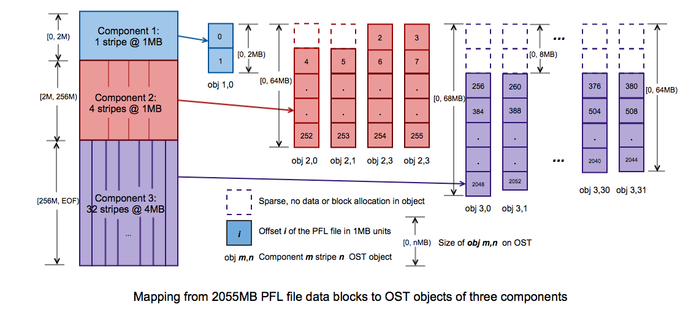
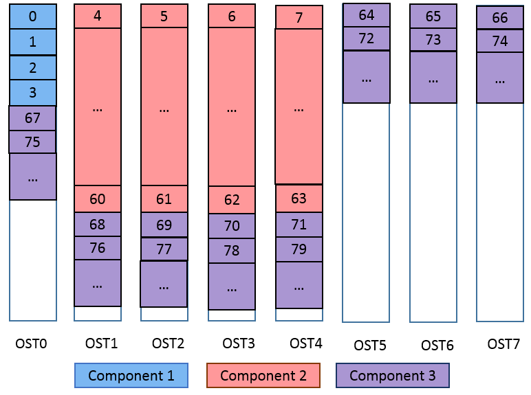
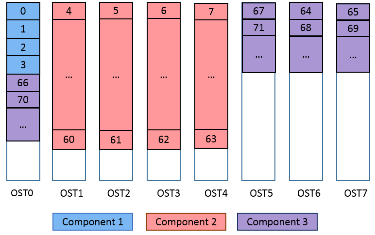
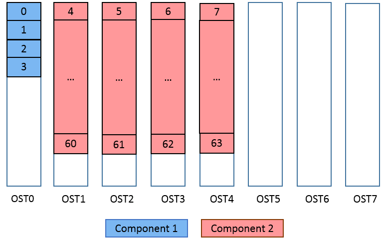
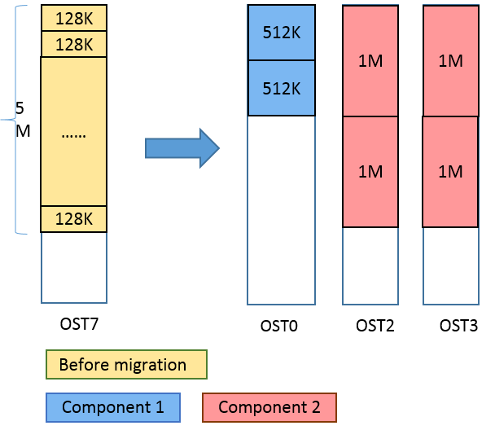
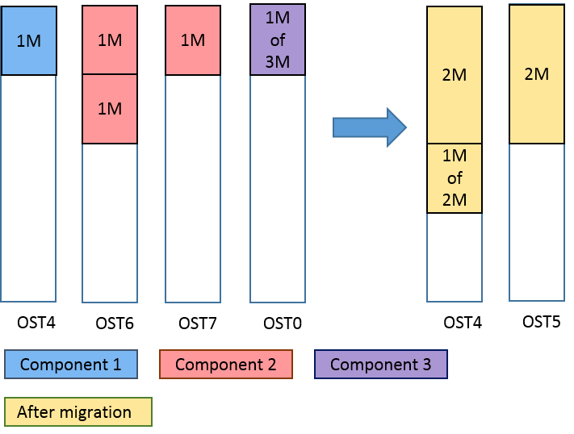
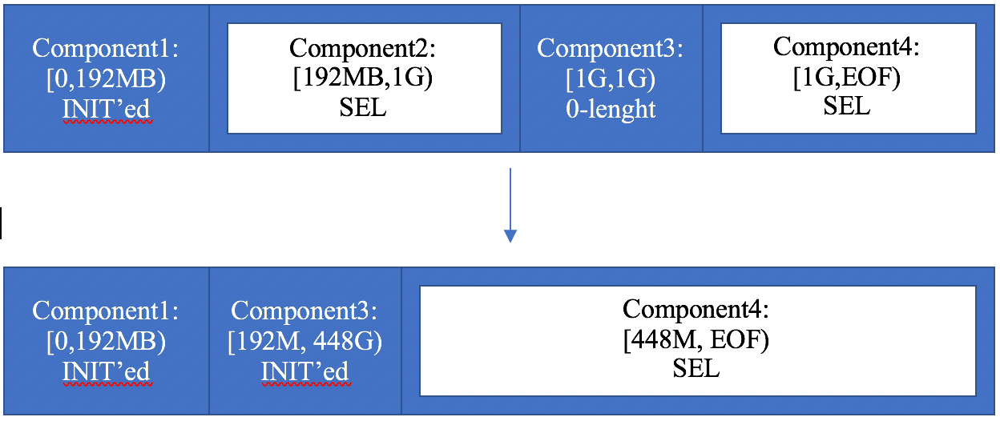
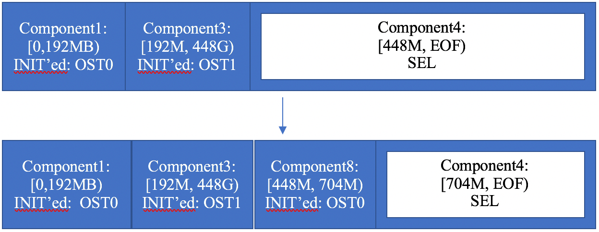
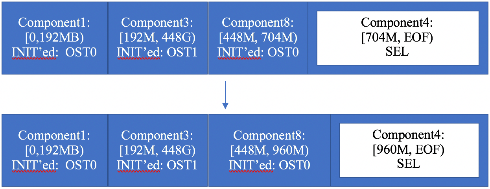

# 04 条带化、PFL 与 MDT 数据内嵌 DoM (第 19~21 章)

> 来源：官方 Lustre 中文操作手册 (Lustre Chinese Operations Manual)


### 18.5.6. 更改快照卷大小

如果您发现每日增量小于或大于预期，您还可以扩展或收缩快照卷，运行：
1 1vextend -L10G /dev/vgmain/MDT0.b1
注意
在更老的LVM版本中，扩展快照卷可能不可用。该功能在LVM v2.02.01 正常。

### 18.6.ZFS 和ldiskfs 目标文件系统间的迁移

从 Lustre 2.11.0开始，可以在 ZFS 和ldiskfs 后端之间进行迁移。要迁移OST，最好
使用1fs find/lfs_migrate 在文件系统正在使用时清空 OST，然后使用新的 fstype
重新格式化 OST。

### 18.6.1.从ZFS 迁移至 ldiskfs 文件系统


## 第一步，请按照本章第3节"备份 OST 或 MDT（后端文件系统级别）“中介绍的方

法使用 tar 进行 ZFS 后端备份。第二步，请将备份恢复到基于 ldiskfs 的系统，参照第4
节"恢复文件级备份"。

### 18.6.2. 从ldiskfs 迁移至ZFS 文件系统


## 第一步，请按照本章第3节"备份 OST或MDT（后端文件系统级别）“中介绍的方

法使用 tar 进行 ldiskfs 后端备份。第二步，请将备份恢复到基于ZFS的系统，参照本章
第4节"恢复文件级备份"。
注意
对于从ldiskfs 到zfs的迁移，需要在卸载目标之前启用 index_backup。这是基于
Idiskfs 常规备份/恢复的一个附加步骤，很容易被忽略。

## 第十九章管理文件布局（条带化）及剩余空间


### 19.1.Lustre 文件系统条带化如何工作

在Lustre 文件系统中，MDS使用循环算法或加权算法将对象分配给OST。当可用
空间大小平衡良好时（默认情况下，不同 OST之间的空闲空间相差不到17%即算平衡
良好），循环算法用于选择要写入条带的下一个 OST。MDS 定期调整条带布局以消除一
些算法退化的情况，如创建非常规律的、总是偏好序列中某个特定OST 的文件布局（条
带化类型）。
OST的使用通常非常均衡。但是，如果用户创建一些特大文件或指定错误的条带参
数，将可能会导致 OST的用量不均衡。当OST之间的可用空间相差超过特定数量（默

认为17% 时，MDS 将使用加权随机分配，从而优先在拥有更多可用空间的OST上分
配对象。（这会影响1/0性能，直到空间使用再次平衡。）有关如何分配条带的更详细说
明，请参见本章第6节"管理可用空间”。
受限于存储在 MDT 上的属性所允许的最大大小，文件只能在有限数量的OST上进
行条带化。如果 MDT 基于ldiskfs，而又不具备 ea_inode 功能，文件最多可以分为160
个 OSTS。如果是基于 ZFS 的MDT，或者如果基于ldiskfs 的MDT 启用了 ea_inode功
能（从Lustre 2.13.0开始默认启用），文件做多可以条带化到2000个OST上。有关更多
信息，请参见本章第7节"Lustre 条带化内部参数"。

### 19.2. Lustre 文件布局（条带化）的一些考量

是否设置文件条带、选择什么样的参数值取决于您的需求。原则上您应该在满足需
求的前提下尽可能地在更少的对象上进行条带化。
进行文件条带化的一些动机包括：

- 提供高带宽访问。许多应用程序都需要对某个文件进行高带宽访问，其对带宽的
需求可能比单个 OSS能提供的带宽要高。比如一些应用程序可能需要将来自数百
个节点的数据写入单个文件，或者在启动时需要从多个节点加载二进制可执行文
件。
在这些情况下，可将文件分割到尽可能多的OSS上，以达到该文件所需的峰值聚
合带宽。请注意，只有当文件大小很大或文件一次被许多节点访问时，才建议使用大量
OSS 进行分条。目前，Lustre 文件可以在多达2000个 OST 上进行条带化。

- 超出OSS 带宽时用于提升性能。如果客户端总带宽超过服务器带宽，且应用程序
数据读写速率足够快而能够充分利用额外的 OSS带宽，则跨越多个OSS 将文件
条带化可以提高性能。最大有效条带数的限制为：客户端/作业的1/O 率除以每个
OSS性能。
（Lustre 2.13引入）
将条带与10模式相匹配。当多个节点对一个文件同时进行写入时，即有一个以上
的客户端写入一个条带，即使需要操作的I0部分没有重合，也会导致锁交换的问题，
即客户端争夺对该条带的写入。如果IO 也能相应条带化，使每个条带只由一个客户端
访问，那么就能避免这个争夺情况。从 Lustre 2.13开始，'overstripe' 功能使可用的，允
许每个 OST包含多个条带。这对于线程数量超过OST 数的情况特别有用，可以使得条
带数量与线程数量相匹配.

- 为大文件提供空间。当单个 OST没有足够多的空闲空间来存放整个文件时，可将
文件分条。

减少或避免使用条带化的原因：

- 增加开销。在常规操作（如stat 和 unlink）期间，条带化会导致更多的锁定
和额外的网络操作。即使这些操作并行执行，一次网络操作所花的时间也少于100
次操作。
同时，服务器竞争情况也会随之增加。考虑一个拥有100个客户端和100个 OSS
的集群，每个OSS含一个OST。如果每个文件只有一个对象并且负载均匀分布，每台
服务器上的磁盘都可以管理线性的1/O，则不存在竞争。如果每个文件都有100个对象，
那么客户端就会彼此竞争以获得服务器的注意，并且每个节点上的磁盘将在100个不同
的方向上寻找，导致不必要的竞争。

- 增加风险。当文件在所有服务器上进行条带化，而其中一台服务器出现故障，这
些文件的一小部分将丢失。相反，如果每个文件只有一个条带，丢失的文件会更
少，但它们将完全丢失。许多用户更能接受丢失部分文件（即使是全部内容），而
不是所有文件都丢失部分内容。

### 19.2.1. 选择条带大小

选择条带大小是一种权衡行为。下面将介绍较为合理的默认值。条带大小对于单条
带文件没有影响。

- 条带大小必须是页大小的整数倍。Lustre 软件工具将强制执行 64KB 的整数倍
（ia64 和 PPC64 节点的最大页大小），避免页规格较小的平台上的用户创建可能会
导致 ia64 客户端出现问题的文件。

- 推荐的最小条带大小是512KB。虽然可以创建条带大小为 64KB 的文件，但最小
的实际条带大小为512KB，因为Lustre 文件系统通过网络发送数据块大小为IMB。
选择更小的条带大小可能会导致磁盘I/O 效率低下，性能下降。

- 适用于高速网络线性1/O 的条带大小在1MB 到4MB之间。在大多数情况下，大
于4MB的条带大小可能导致更长的锁定保持时间，增加共享文件访问期间的争用
情况。

- 最大条带大小为4GB。在访问非常大的文件时，使用较大的条带大小可以提高性
能。它允许每个客户端独占访问文件的一部分。但如果条带大小与1/O 模式不匹
配，较大的条带大小可能会适得其反。

- 选择一个考虑到应用程序的写入模式的条带化模式。跨越对象边界的写入效率要
比在单个服务器上完整写入的效率略低。如果文件以一致且对齐的方式写入，请
将条带大小设置为write （）大小的整数倍。


### 19.3. 配置 Lustre 文件布局（条带化模式）（1fs setstripe）

使用 1fs setstripe 命令创建指定文件布局（条带化模式）配置的新文件。
1 lfs setstripe ［--sizel-s stripe_size］ ［--stripe-count|-c stripe_count］
［--overstripe-countI-C stripe_count］\
2 ［--index |-1 start_ost］ ［--poolI-P pool_namel filenameldi rname
stripe_size
stripe_size 表示移动到下一个 OST 前向现有OST写人的数据量。默认的
stripe_size是1MB。将该参数设置为0，则会使用默认的条带大小。stripe_size
值必须是64 KB 的整数倍。
stripe_count （--stripe-count，--overstripe-count）
stripe_count 表示要使用的条带数量。默认stripe_count值为1。将其设置
为0，则会使用该默认条带数量。将 stripe_count 设置为-1意味着对所有可用的
OST（跳过满 OST）进行条带化。如果使用了--Overstripe-count 参数，则必要时会对每个
OST条带化。
start_ost
start
_ost 是文件写入的第一个OST。start_ost 的默认值是-1，它允许MIDS
选择起始索引。强烈建议使用此默认设置，因为它可根据需要通过MDS 完成空间和
负载均衡。如果将 start
ost 的值设置为非-1，则该文件将从指定的 OST 索引开始。
OST 索引编号从0开始。
注意
如果指定的 OST 处于非活动状态或处于降级模式，则 MDS将自动选择另一个目
标。
如果start_ost值为0， stripe_count 值为1，则所有文件都将写入OSTO，直
到空间耗尽。这很可能不是你想要的。如果您只希望调整 stripe_count，而保持其
他参数为默认设置，请不要指定任何其他参数：
1 client# lfs setstripe -c stripe_count filename
pool_name
Pool_name 指定文件将写入的OST池。这可以将使用的OST 数量限制为文件系
统中所有 OST 的子集。有关使用OST池的更多详细信息，请参阅创建和管理OST池。

### 19.3.1.为单个文件指定文件布局（条带化模式）

使用1fs setstripe 创建新文件，可以指定其文件布局。用户可以覆盖文件系统
的默认参数，从而更好地调整文件布局以适应其应用程序。如果文件已经存在，执行
1fs setstripe 是无效的。


### 19.3.1.1. 设置条带大小 创建一个指定条带大小的新文件的命令类似于：

1 ［client］# 1fs setstripe -s 4M /mnt/Iustre/new_file
该示例创建了新文件：/mnt/1ustre/new_file，条带大小为4MB。
当文件创建时，新的条带设置生效，条带大小为4MB 的新文件将在单个 OST上被
创建。
1 ［client］# lfs getstripe /mnt/lustre/new_file
2 /mnt/Iustre/4mb_file
3 lm_stripe_count: 1
4 lmm_stripe_size：
5 lmm_pattern：
6 Lm_Layout_gen：
7 Imm_stripe_offset: 1
8 obdidx
objid
9 1
objid
0xa8976
grouP

### 19.3.1.2. 设置条带数 下面的命令创建了一个条带数为-1的新文件，表明条带数为所有

可用 OST 的数量：
1 ［client］# 1fs setstripe -c -1 /mnt/lustre/fu11_stripe
下面的例子表明文件 £u11_stripe 在配置中的所有的六个活动 OST 上被条带化：
1 ［client］# lfs getstripe /nnt/lustre/ful1_stripe
2 /mt/Lustre/ful1_stripe
obdidx
objid
objid
group
0x8
0×4
0×5
0×5
0×4
0x2
与3.1.1"设置条带大小”中的输出不同，这里显示的是每个文件的单个对象。

### 19.3.2. 为目录指定文件布局（条带化模式）

在目录中，1fs setstripe 命令为目录下文件设置默认的条带化配置。其用法与
常规文件的1fs setstripe 相同，但在设置默认条带配置之前该目录必须存在。如

果在默认条带配置的目录中创建新文件（没有另外指定条带配置），则Lustre 文件系统
将使用该配置中的参数而不是文件系统默认值。
要更改子目录的条带化模式，请按上述方法为新目录设置您希望的文件布局。子目
录继承根/父目录的文件布局。

### 19.3.3.为文件系统指定文件布局（条带化模式）

在根目录的条带化配置决定了文件系统中创建的所有新文件的条带化配置，除非有
优先级更高的条带化配置进行重载（例如应用程序、父目录，或1fs setstripe命令
指定的条带化布局）。
注意
除非为子目录指定了条带设置，否则根目录的条带设置默认应用于在根目录中创建
的任何新的子目录。

### 19.3.4. 在指定OST上创建文件

您可以使用 1fs setstripe 在特定的OST 上创建文件。在以下示例中，文
件Eile1在第一个 OST （OST 索引 0）上创建。
1 $ lfs setstripe --stripe-count 1 --index 0 filel
2 $dd if=/dev/zero of=file1 count=1 bs=100M
3 1+0 records in
4 1+0 records out
6 $ lfs getstripe filel
7 /mnt/testfs/filel
8 Lmm_stripe_count：
9 lmm_ stripe_size：
10 1m_pattern：
11 1mm_layout_gen：
12 Lmm_stripe_offset:0
obdidx
objid
objid
0x91£4
group

### 19.4. 检索文件布局/条带信息（getstripe）

1fs getstripe命令用于显示文件被分发到哪些 OST上、每个 OST 的索引和
UUID，以及文件中每个条带的OST 索引和对象ID。在目录下运行该命令将显示在该目
录中创建的文件的默认设置。


### 19.4.1. 显示当前条带大小

想要看 Lustre 文件或目录的当前条带大小，请使用 1fs getstripe 命令。例如，
查看某一目录的相关信息，请输入：
1 ［client］# lfs getstripe /mnt/Lustre
输出为：
1 /mnt/Lustre
2 （Default） stripe_count: 1 stripe_size: IM stripe_offset： -1
在这个例子中，默认的条带数是1（数据块在单个 OST 上分条），默认条带大小为
IMB，对象在所有可用 OSTs上创建。
查看某一目录的相关信息，请输入：
1 $ 1fs getstripe /mnt/lustre/f0o
2 /mnt/lustre/foo
3 Lnm_stripe_count：
4 Lrm_stripe_size：
5 Lmm_pattern：
6 Lmm_layout_gen：
7 Lmm_stripe_offset:0
obdidx
objid
objid
mOxcbf9f
group
在这个例子中，该文件位于obdidx 2，对应于 OSTlustre-OST0002。查看服务
该OST 的节点，运行：

```bash
1 $ lctl get_param osc.lustre-OST0002-0sc.ost_conn_uuid
```
2 osc.lustre-OST0002-osc.ost_conn_uuid-192.168.20.1@tcp

### 19.4.2. 搜索文件树

要搜索整个文件树，请使用1fs find命令：
1 1fs find ［--recursive | -r］ fileldirectory ..

### 19.4.3. 为远程目录定位 MDT

Lustre 可以在同一个文件系统中配置多个MDT。每个目录和文件可以位于不同的
MDT上。要确定给定子目录位于哪个MDT上，请将 getstripe ［--mdt-index|-M］
的参数传递给 1fs。第14.9.1节“从文件系统中删除 MDT"中给出了一个该命令的示
例。




*图 10: 渐进式文件布局 PFL 架构*


### 19.5. 渐进式文件布局（PFL）

Lustre 渐进式文件布局（Lustre Progressive File Layout,PFL）功能简化了 Lustre 的
使用，使得用户无需事先明确了解其10 模型或Lustre 使用细节就可以预期各种常规文
件I0 模式的性能。特别是，用户不一定需要在创建输出文件之前就知道其大小或并行
性，也不需要为了实现并行共享单个大文件10 和更小的每进程文件I0 的高性能而为每
个文件明确地指定最佳布局。
PFL 文件的布局以复合布局的方式存储在磁盘上。PFL 文件基本上是一个子布局组
件的数组，每个子布局组件都是一个覆盖不同的不重叠的文件部分的普通布局。对于
PFL 文件，文件布局由一系列组件组成，因此可能有某些文件部分未由任何组件描述。
以下的 PFL 对象映射图显示了 PFL 文件的数据块映射到 OST 对象组件的示例：
个
［0.2M）
Component 1：
1 stripe @ 1MB
^
（0. 2MB）
obj 1,0

### 10.64MB）


### 10.64MB）

I2M,256M）
X
（256M, EOF）
Component 2：
4 stripes @ 1MB
（0,68MB）
ob） 2,0
ob］ 2,1
obj） 2.3
obyj 2,3
obj 3,30 obj 3,31
Component 3：

```bash
$2 stripes @ 4MB
```
obj 3.0
obj 3,1
Offset / of the PFL file in 1MB units
obj m.n Component m stripe n OST object
10.nMB）
Size of obj m,n on OST
Mapping from 2055MB PFL file data blocks to OST objects of three components
图 10:Lustrecluster at scale
图中的PFL 文件包含3个组件，显示了一个大小为2055MB的文件中不同块的映
射。前两个组件的条带大小为1MB，第三个组件的条带大小为 4MB。三个组件的条带
数在不断增加。第一个组件只有两个IMB 的块，一个对象的大小为2MB。第二个组
件将文件接下来的254MB 保存在RAID-0 的4个独立的 OST 对象上，每个对象的大小
为256MB/4=64MB。请注意，前两个对象 obj2,0和 obj2，1 在存储时起始位置处
有一个 1MB大小的空洞。最后的组件存有文件接下来的 1800MB，覆盖了32个 OST
对象。每个对象在开始处有 256MB/32=8MB 的空洞。每个对象的大小为 2048MB/32=
64MB，不同之处在于 obj 3.0包含额外的4MB块，而obj 3，1 包含额外的3MB块。如果
将更多数据写入文件，只有第三个组件中的对象的大小会增加。
当访问具有已定义但未实例化组件的文件范围时，客户端向 MDT发送一个布局意
图 RPC,MDT 将实例化覆盖该范围的组件的对象。
接下来我们将介绍用于操作 PFL 文件的一些命令，并给出一些合成布局的例子。
Lustre 提供命令1fs setstripe 和 1fs migrate 以供用户对PFL 文件进行操作。其
中，1fs setstripe 用于创建PFL 文件，将组件添加到现有组合文件或从现有组合文

件中删除组件；1fs migrate 命令将当前 OST 中的数据复制到新OST 中，使用新布
局参数重新布局现有文件中的数据。另外，1fs getstripe 命令用于列出给定 PFL 文
件的条带化/组件信息，1fs find 命令可用于搜索以给定的目录或文件为根的目录树，
以查找与 PFL 组件参数相匹配的文件。
注意
使用 PFL 文件需要客户端和服务器都能解析 PFL 文件布局，Lustre 2.9 或更早版本
中没有该功能。但这不影响更早版本的客户端访问文件系统中的非PFL 文件。

### 19.5.1.1fs setstripe

1fs setstripe 命令用于创建PFL 文件，将组件添加到现有组合文件或从现有组
合文件中删除组件。（在下面的例子中，我们假设有8个 OST，默认条带大小为 1MB。）

### 19.5.1.1. 创建一个 PFL 文件 命令

1 lfs setstripe
2 ［--component-end| -E end1］ ［STRIPE_OPTIONS］
3 ［--component-end| -E end2］ ［STRIPE_OPTIONS］

- .．filename
-E选项用于指定每个组件的结束偏移量（以字节为单位或使用后缀"kMGTP"，如
256M），同时也指示了 STRIPE_OPTIONS用于此组件。每个组件在［start,end）范围内
定义文件的条带化模式。第一个组件必须从偏移量0开始，所有组件必须彼此相邻，不
允许有空洞，因此每个范围都将从上一个范围的末尾开始。-1为结束偏移，或用eof表
示这是一直延伸到文件结尾的最后一个组件。
示例
1 $ lfs setstripe -E 4M -c 1 -E 64M -C 4 -E -1 -c -1 -i 4\
2 /mnt/testfs/create_comp
该命令创建一个具有如下图所示复合布局的文件。第一个组件有1个条带，覆盖
［0,4M］，第二个组件有4个条带，覆盖［4M，64M］，最后一个组件从 OST4开始，跨越
所有可用的 OST 并覆盖［64M，EOF］。




*图 11: PFL 范围组件布局*

…
…
OSTO
OST1
OST2
OST3
OST4
Component 1
Component 2
图 11:Lustrecluster at scale
该组合布局可通过以下命令显示：
I S lfs getstripe /mt/testfs/create_comp
2 /mnt/testfs/create_comp
1cm_
_layout_gen: 3
1cm_entry_count: 3
Icme_id：
lcme_flags：
Icme_extent.e_start:0
Icme_extent.e_end：
Imm_stripe_count：
lm_stripe_size：
Imm_pattern：
Im_layout_gen：
init
Imm_stripe_offset:0
Irm_objects：
-0：｛1ost_idx:0,1_fid：［0x100000000:0x2:0x01 ｝
lcme_id：
OST5
Component 3
OST6
OST7

lame_flags：
lcme_extent.e_start: 4194304
Lcme_extent.e_end：
1m_stripe_count：
Imm_stripe_size：
Im_pattern：
Im_layout_gen：
1m_stripe_offset：-1
lcme_id：
Icme_flags：
1cme_extent.e_start: 67108864
Icme_extent.e_end：
EOF
Im_stripe_count：
Im_stripe_size：
Imm_pattern：
Im_layout_gen：
Inmm_stripe_offset: 4
注意
当设置文件布局时，只有PFL 文件的第一个组件的OST对象被实例化。其他对象
的实例化操作将延迟到稍后的写入或截断操作。
如果我们向这个 PFL 文件写入128M 数据，第二个和第三个组件将被实例化：
1 s dd if=/dev/zero of=/mnt/testfs/create_comp bs=IM count=128
2 $ lfs getstripe /mnt/testfs/create_comp
3 /mnt/testfs/create_comp
1cm_layout_gen：
1am_entry count: 3
1cme_id：
Icme_flags：
init
lcme_extent.e_start:0
lcme_extent.e_end：
Im_stripe_count：
lm_stripe_size：
Im_pattern：
Im_layout_gen：
1m_stripe_offset: 0

Lm_objects：
- 0： ｛1_ost_idx: 0, 1
_fid：［0x100000000: 0×2:0×01 ｝
lcme_id：
lcme_flags：
init
lcme_extent.e_start: 4194304
Icme_extent.e_end：
1m_stripe_count：
Im_stripe_size：
Imm_pattern：
Im_layout_gen：
Im_stripe_offset: 1
Irm_objects：
- 0： ｛ 1_ost_idx: 1, 1_fid:T0x100010000:0×2:0x01 ｝
- 1： ｛ 1_ost_idx:2, 1_fid： ［0x100020000:0×2:0x0］ ｝
- 2:1 1ost_idx: 3, 1_fid:T0x100030000: 0×2:0x0］ ｝
- 3：｛1_ost_idx:4, 1_fid：［Ox100040000:0x2:0x0］ ｝
lcme_id：
lcme_flags：
init
lcme_extent.e_start: 67108864
lcme_extent.e_end：
EOF
1m_stripe_count：
1mm_stripe_size：
Imm pattern：
Lm_layout_gen：
Irmm_stripe_offset: 4
Im_objects：
- 0：｛1_ost_idx: 4, 1_fid： ［0x100040000:0×3:0x01 ｝
-1：｛ 1_ost_idx:5,1_fid：［0x100050000:0x2:0x0］｝
-2：｛ 1ost_idx: 6,1_fid：［0x100060000:0x2:0x01 ｝
-3：｛ 1_ost_idx: 7,1_fid：［0x100070000:0x2:0x0］｝
-4：｛1ost_idx:0,1_fid：［0x100000000:0x3:0x01 ｝
- 5：｛1_ost_idx: 1,1_fid： ［0x100010000:0×3:0x0］ ｝
- 6：｛ 1_ost_idx:2,1
_fid：［0x100020000:0×3:0×01 ｝
- 7： ｛l_ost_idx: 3, 1
_fid：［0×100030000:0×3:0×01 ｝




*图 12: PFL 条带在 OST 池中的分布*


### 19.5.1.2. 在现有组合布局文件中增加组件 命令

1 lfs setstripe --component-add
2 ［--component-end-E endLJ ［STRIPE_OPTIONS］
3 ［--component-end| -E end2］［STRIPE_OPTIONS］ •• filename
--component-add选项用于将组件添加到现有的组合布局文件中。要添加的第
一个组件范围的开始点等于当前文件中最后一个组件范围结束点，所有要添加的组件必
须相邻。
注意
如果最后一个现有组建被指定为-E-1或-E eof，表明它覆盖了文件的结尾。添
加一个新组件之前必须删除该组件。
示例
1 S lfs setstripe -E AM -C 1 -E 64M -C 4 /mnt/testfs/add_comp
2 $ lfs setstripe --component-add -E -1 -c 4 -0 6-7, 0, 5\
3 /mnt/testfs/add
1_comp
该命令添加了一个新组件，该组件从最后一个现有组件的末尾开始，到文件末尾
结束。下图说明了此示例的布局。最后一个组件的条带跨越了4个 OST，顺序为 OST6、
OST7、OSTO、OSTS，
覆盖［64M,EOF）。
OSTO
OST1
OST2
OST3
OST4
Component 1
Component 2
图 12:Lustrecluster at scale
该布局可通过以下命令显示：
I $ lfs getstripe /mt/testfs/add_comp
2 /mnt/testfs/add_comp
OST5
OST6
Component 3
OST7

=I
1cm_layout_gen: 5
1cm_entry_count:3
Lame_id：
Lome_flags：
init
lcme_extent.e_start:0
Icme_extent.e_end：
Im_stripe_count：
lm_stripe_size：
Imm_pattern：
1m_layout_gen：
Im_stripe_offset: 0
Im_objects：
- 0: 1 1_ost_idx: 0, 1_fid:TOx100000000:0×2:0x01 ｝
Lcme_1d：
lcme_flags：
init
lcme_extent.e_start: 4194304
lcme extent.e end：
Lm_stripe_count：
1mm_stripe_size：
Im_pattern：
Im_layout_gen：
1m_stripe_offset: 1
Lm_objects：
- 0：｛1_ost_idx:1,1_fid： ［0x100010000: 0×2:0×01 ｝
- 1：｛ 1_ost_idx: 2, 1_fid： ［0x100020000: 0x2:0x01 ｝
- 2：｛1_ost_idx: 3,1_fid： ［0x100030000:0x2:0x01｝
- 3： ｛1_ost_idx: 4, 1_fid： ［0x100040000:0×2:0x0］ ｝
lcme_id：
Icme_flags：
lcme_extent.e_start: 67108864
lcme_extent.e_end：
EOF
Imm_stripe_count：
Im_stripe_size：
Imm_pattern：

Lrm_layout_gen：
Lm_stripe
Loffset： -1
组件 ID "lcme_id”随着布局更改而变化。组件ID 不一定是线性的，也就是说它与组
件的顺序无关。
注意
与在文件创建时指定全文件组合布局类似，--component-add 不会实例化OST
对象，实例化将被延迟到稍后的写入或截断操作。例如，写入文件最后一个组件的
64MB 后，新组件的对象完成了分配：
I$ lfs getstripe -I5 /nnt/testfs/add._comp
2 /mnt/testfs/add_comp
lam_layout_gen: 6
1cm_entry_count: 3
Iame_id：
Lame_flags：
init
lcme_extent.e_start: 67108864
lcme_extent.e_end：
EOF
Im_stripe_count: 4
Im_stripe_size：
Im_pattern：
1m_layout_gen：
Im_stripe_offset: 6
Imm_objects：
- 0： ｛1_ost_idx: 6, 1_fid：［0x100060000:0×4:0×01 ｝
- 1： ｛1_ost_idx: 7, 1_fid：［0x100070000:0×4:0×01 ｝
- 2:1 1ost_idx:0,1_fid:T0x100000000: 0×5:0x0］ ｝
- 3：｛ 1_ost_idx: 5,1_fid： ［Ox100050000: 0×4:0x01 ｝

### 19.5.1.3. 从现有文件中删除组件 命令

1 1fs setstripe --component-del
2 ［--component-idl-I conp_id | --component-flags comp_flags］
3 filename
--component-de1 选项用于从现有文件中删除指定组件ID 或标志的组件。此操
作将导致存储在已删除组件中的所有数据都将丢失。
由-工选项指定的ID 是唯一的组件数字ID，可通过命令1fs getstripe -工命
令获取。由 --component-flags选项指定的标志是某种类型的组件，可通过1fs




*图 13: PFL 动态范围扩展*

getstripe --component-flags获得。目前只有两个标志 init 和^init，分别
用于实例化的组件和未实例化的组件。
注意
由于不允许空洞的存在。删除必须从最后一个组件开始。
示例
1 $1fs getstripe -I /mnnt/testfs/del_comp
2 1
3 2
4 5
5 $ lfs setstripe --component-del -I 5 /mnt/testfs/del_comp
该示例删除了文件 /mnt/testfs/de1_comp 的 component 5。
…
…
…
：
OSTO
OST1
OST2
OST3
OST4
OST5
OST6
OST7
Component 1
Component 2
图 13:Lustrecluster at scale
如果你尝试删除不是最末尾的组件，会产生如下错误：
1 $ lfs setstripe -component-del -I 2 /mnt/testfs/del_comp
2 Delete component 0x2 from /mnt/testfs/del_comp failed. Invalid argument
3 error: setstripe: delete component of file'/mnt/testfs/del_comp' failed：
Invalid argument

### 19.5.1.4. 为现有目录设置默认 PFL 布局 与创建PFL 文件类似，您可以为现有目录设

置默认 PFL 布局。目录下创建的所有文件将默认继承此布局。
命令

1 1fs setstripe
2 ［--component-end| -E end1］ ［STRIPE OPTIONS］
3 ［--component-end| -E end2］
【STRIPE_OPTIONS］
…•dirname
示例
I s mkdir /mnt/testfs/pfldir
2 $ lfs setstripe -E 64M -c 2 -i 0 -E -1 -C 4 -i 0 /mnt/testfs/pfldir
运行 lfs getstripe：
1 $ lfs getstripe /mnt/testfs/pfldir
2 /mnt/testfs/pfldir
1cm_layout_gen：
1cm_entry_count: 3
lame_id：
Icme_flags：
1cme_extent.e_start:0
Icme_extent.e_end：
stripe_count: 1
N/A
stripe_size：
Icme_id：
N/A
lcme_flags：
lcme_extent.e_start: 268435456
1cme_extent.e_end：
stripe_count:4
stripe_size：
lcme_id：
N/A
Icme_flags：
1cme_extent.e_start: 17179869184
lcme_extent.e_end：
EOF
stripe count： -1
stripe_offset：-1
stripe_offset： -1
stripe_size：
stripe_offset： -1
如果你在/mnt/testfs/pf1dir目录下创建新的文件，则该文件的布局将从父目
录那继承两个组件：
1 $ touch /mnt/testfs/pfldir/pflfile
2 $ lfs getstripe /mnt/testfs/pfldir/pflfile
3 /mnt/testfs/pfldir/pflfile
1cm_layout_gen：
1cm_entry_count: 3
1cme_id：

Icne_flags：
lcme_extent.e_start:0
Lcme_extent.e_end：
Lm_stripe_count：
Imm_stripe_size：
Im_pattern：
init
raido
Im_layout_gen：
Im_stripe_offset: 1
Im_ objects：
- 0：｛ 1ost_idx: 1,1_fid：［0x100010000: Oxa: 0x0］ ｝
lcme_id：
Icme_flags：
1cme_extent.e_start: 268435456
Icme_extent.e_end：
1m_stripe_count: 4
Im_stripe_size：
Lm_pattern：
raidO
lm_layout_gen：
Im_stripe_offset： -1
Icme_id：
lcme_flags：
Icme_extent.e_start: 17179869184
lcme_extent.e_end：
Imm_stripe_count：
lm_stripe_size：
Lmm_pattern：
EOF
raido
Im_layout_gen：
Im_stripe_offset：
注意
lfs setstripe --component-add/de1 无法在目录上运行。目录中的默认布
局类似于配置，可通过1fs setstripe 对其进行任意更改，而文件中的布局可能会
附加数据（OST对象）。如果您想要删除目录中的默认布局，请运行 1fs setstripe
-d dirname：

1 $ lfs setstripe -d /mnt/testfs/pfldir
2 $ lfs getstripe -d /mnt/testfs/pfldir
3 /mnt/testfs/pfldir
4 stripe_count: 1 stripe_size：
5 /mnt/testfs/pfldir/commonfile
6 lmm_stripe_count: 1
7 lmm_stripe_size：
8 Lmm pattern：
9 Imm_layout_gen：
10 1m_stripe_offset: 0
obdidx
objid
objid
1048576 stripe_ offset： -1
group
0x9

### 19.5.2. 1fs migrate

lfs migrate 命令用于将现有OST 中的数据复制到新 OST 中设置新的布局参数，
从而重新布局现有文件中的数据。
命令
1 1fs migrate ［--component-end|-E comp_end］ ［STRIPE_OPTIONS］••
2 filename
migrate 和 setstripe 的区别在于migrate 用于重新布局现有文件的数据，而
setstripe 用于按照指定的布局创建新的文件。
示例
例1.普通布局到组合布局的迁移
1 $ 1fs setstripe -c 1 -3 128K /mnt/testfs/nom_to_2comp
2 $ dd if=/dev/urandom of=/mnt/testfs/norm_to_2comp bs-1M count=5
3 $ lfs getstripe /mnt/testfs/norm_to_2comp --yaml
4 /mnt/testfs/nomm_to_comp
5 1mm_stripe_count: 1
6 Imm_stripe_size: 131072
7 Imm pattern：
8 Imm_layout_gen：
9lm_stripe_offset:7
10 1mm_objects：
- 1_ost_idx: 7
1_fid：
0x100070000:0x2:0x0




*图 14: PFL 空间耗尽时的降级分配*

13 $ lfs migrate -E 1M -S 512K -c 1 -E -1 -S IM -c 2\
14 /mnt/testfs/norm_to_ 2comp
在这个例子中，一个只有一个条带、条带大小为128K 的5MB 大小的文件被迁移至
有两个组件的组合布局文件中，如下图所示：
128K
128K
M
512K
512K
1M
1M
1M
1M
128K
OST7
Before migration
Component 1
OSTO
OST2
OST3
Component 2
图 14:Lustrecluster at scale
迁移后的条带信息如下：
1 $ lfs getstripe /mnt/testfs/norm_to_2comp
2 /mnt/testfs/nor_to_2comp
1cm_layout_gen：
1cm_entry_count: 2
lame_id：
lcme_flags：
init
lcme_extent.e_start: 0
，
1cme_extent.e_end：
Im_stripe_count：
Im_stripe_size：

8l
6I
Lmm_pattern：
Im_layout_gen：
Lm_stripe_offset:0
Lm_objects：
-0：｛1
_ost_1d×：0, 1
-_Eid：［Ox100000000:0×2:0×01 ｝
Icme_id：
Icme_flags：
init
1cme_extent.e_start: 1048576
Icme_extent.e_end：
EOF
Imm_stripe_count: 2
Im_stripe_size：
Imn_pattern：
Imm_layout_gen：
Im_stripe_offset: 2
Im_objects：
- 0：｛1_ost_idx:2, 1_fid：［Ox100020000:0x2:0x0］ ｝
- 1： ｛ 1_ost_idx: 3, 1，
fid: T0×100030000: 0×2:0×013
例2.一个组合布局到另一个组合布局的迁秘
1 $ lfs setstripe -E 1M -S 512K -c 1 -E -1 -S IM -c 2 \
2 /mnt/testfs/2comp
_to_3comp
3 s dd if=/dev/urandom of=/nnt/testfs/norm_to_2comp bs-IM count-5
4$
lfs migrate -E IM -S 1M -c 2 -E 4M -S IM -c 2 -E -1 -S 3M -c 3\
5 /mnt/testfs/2comp_to_3comp
下图显示了两个组件的组合布局文件到三个组件布局文件的迁移。


*图 15: PFL 镜像组件与条带关系*

512K
512K
1M
1M
1M
1M
1M
1M
of
3M
1M
IM
1M
OSTO
OST3
Component 1
OST4
OST6
Component 3
OST7
OSTO
Component 2
图 15:Lustrecluster at scale
条带信息如下：
I $ lfs getstripe /mt/testfs/2comp_to_3comp
2 /mt/testfs/2comp_to_3comp
1cm_layout_gen: 6
1cm_ entry_ count: 3
1cme_id：
lcme_flags：
init
lcme_extent.e_start:0
lcme_extent.e_end：
stripe_count：
Im_stripe_size：
Im_pattern：
Im_layout_gen：
Im_stripe_offset: 4
Lm_objects：
- 0：｛ 1_ost_idx: 4,1」
_fid：［0x100040000:0×2:0×01 ｝
-1：｛1_ost_idx: 5, 1_fid: T0x100050000:0×2:0×01 ｝
lcme_id：
Icme_flags：
init
Iame_extent.e_start: 1048576
lcme_extent.e_end：

Im_stripe_count: 2
Lmm_stripe_size：
Imm_pattern：
Im_layout_gen：
Im_stripe _offset: 6
Im_objects：
- 0：｛1_ost_idx: 6, 1_fid：［Ox100060000: 0x2:0x0］ ｝
- 1：｛ 1ost_idx:7, 1_fid：［0x100070000: 0x3:0x0］ ｝
Icme_id：
Icme_flags：
init
Icme_extent.e_start: 4194304
lcme_extent.e_end：
EOF
1m_stripe_count: 3
Lm_stripe_size：
Imm_pattern：
Lm_layout_gen：
1Lmm
stripe_offset:0
Im_objects：
- 0：｛1
_ost_idx: 0,1_fid：［0x100000000:0×3:0x01 ｝
- 1： ｛1
_ost_idx: 1, 1.
_fid：［0x100010000:0x2:0x01 ｝
- 2： ｛1
_ost_idx:2, 1
_fid：［0x100020000: 0×3:0×01 ｝
例3. 组合布局到普通布局的迁移
1 $ lfs migrate -E 1M -S IM -c 2 -E 4M -S 1M -c 2 -E -1 -S 3M -c 3\
2 /mt/testfs/3comp_to_nomm
3 $ dd if=/dev/urandom of-/mnnt/testfs/norm_to _2com bs=IM count=5
4 $ 1fs migrate -c 2 -3 2M /mnt/testfs/ 3comp_to_normal
下图显示了3个组件的组合布局文件到普通布局文件（2个条带，条带大小为2M）
的迁移：




*图 16: PFL 组件状态机*

1M
1M
1M
1M
1M
of
3M
2M
2M
1M
of
2M
OST4
OST6
Component 1
After migration
OST7
Component 2
OSTO
OST4
OST5
Component 3
图 16:Lustrecluster at scale
条带信息如下：
1 $ lfs getstripe /mnt/testfs/3comp_to_norm --yaml
2 /mnt/testfs/3comp_to_nomm
3 Im_stripe_count: 2
4 Imm_stripe_size：
5 Lmm pattern：
6 Imm_layout_gen：
7 Imm_stripe_offset: 4
8 Imm_objects：
- 1_ost_idx:4
1_fid：
0x100040000:0×3:0x0
I1
-1_ost.
_idx:5
1_fid：
0x100050000:0×3:0x0

### 19.5.3.1fs getstripe

1fs getstripe 命令可用于列出给定PFL 文件的条带化/组件信息。这里只显示
PFL 文件的新参数。

命令
1 lfs getstripe
2 ［--component-id|-I ［comp_id］］
3 ［--component-flags ［comp_flags］ ］
4［--component-count］
5 ［--component-start ［+-］ ［N］ ［KMGTPE］］
6 ［--component-end| -E ［+-］ ［N］［KMGTPE］］
7 dirnamelfilename
示例
假设我们的组合文件/mnt/testfs/3comp 是由以下命令创建的：
1 $ lfs setstripe -E 4M -C 1 -E 64M -C 4 -E -1 -C -1 -1 4\
2 /mnt/testfs/3comp
并写入数据：
1 $ dd if=/dev/zero of=/mnt/testfs/3comp bs=1M count=5
例1.列出组件 ID 及相关信息

- 列出所有组件 ID
1 $ lfs getstripe -I /mnt/testfs/3comp
2 1
3 2
4 3

- 列出组件ID 为2的所有详细条带信息
1 $ lfs getstripe -I2 /mnt/testfs/3comp
2 /mnt/testfs/3comp
3 1cm_layout_gen: 4
4 1cm_ entry_count: 3
5 lcme_id：
6 lcme_flags：
init
7 1cme_extent.e_start: 4194304
8 1cme_extent.e_end: 67108864
9 lmm_stripe_count: 4
10 lm_stripe_size：

11 1mm_ pattern：
12 Lm_layout_gen：
13 1mm
_stripe_offset: 5
14 Lmm_objects：
15-0： ｛1
_ost_idx: 5, L
fid：［0x100050000:0x2:0×0］｝
16 - 1： ｛ 1
_ost_idx: 6，
fid： ［0x100060000:0×2:0×0］ ｝
17 - 2： ｛ 1_ost_idx: 7，
1_fid： ［0x100070000:0×2:0×01｝
18 - 3：｛ 1_ost_idx: 0, 1_fid： ［0x100000000: 0×2:0x01 ｝

- 列出组件ID 为2的条带大小和位移
I $ lfs getstripe -I2 -1 -c /mnt/testfs/3comp
2 Imn_stripe_count: 4
3 Imm_stripe_offset: 5
例2.列出含指定标志的组件

- 列出每个组件的标志
I $ lfs getstripe -component-flag -I /mnt/testfs/3comp
2 1cme_id：
3 lcme_flags：
4 lcme_id：
5 Iame_flags：
6 lcme_id：
7 lcme_ flags：
init
init

- 列出没有实例化的组件
1 $ lfs getstripe --component-flags=^init /mnt/testfs/3comp
2 /mnt/testfs/3comp
3 1cm_layout_gen：
4 1cm_entry_count: 3
5 lcme id：
6 lcme_flags：
7 lcme_extent.e_start: 67108864
8 1cme_extent.e_end：
EOF
9 lmm_stripe_count： -1

10 lrm_stripe_size: 1048576
11 lm_pattern：
12 Lm_layout_gen：
13 Imm_stripe_ offset: 4
例3.列出所有组件数量

- 列出所有组件数量
1 $ lfs getstripe --component-count /mnt/testfs/3comp
2 3
例 4.列出指定范围起始点和结束点的组件

- 列出每个组件起始位置字节数
I $ lfs getstripe --component-start /mnt/testfs/3comp
2 0
3 4194304
4 67108864

- 列出组件ID 为3的起始位置字节数
1 $ lfs getstripe --component-start -I3 /mnt/testfs/3comp
2 67108864

- 列出起始位置力64M 的组件
1 $ lfs getstripe --component-start=64M /mnt/testfs/3comp
2 /mnt/testfs/3comp
3 1am_layout_gen: 4
4 lcm_entry_count: 3
5 lcme_id：
6 lcme_flags：
7 lame_extent.e_start: 67108864
8 lcme_extent.e_end: EOF
9 Imm_stripe_count： -1
10 lmm_stripe_size：
11 Lmm_ pattern：
12 Lrm layout_gen：
13 lmm_stripe_offset: 4


- 列出起始位置大于5M 的组件
1 $ lfs getstripe --component-start=+5M /mnt/testfs/3comp
2 /mnt/testfs/3comp
3 1cm_layout_gen：
4 1am_entry_count: 3
5 lcme id：
6 lcme flags：
7 Lcme extent.e
_start: 67108864
8 1cme_extent.e_end：
EOF
9 lmm_stripe_count：
10 Lm_stripe_size：
11 Lmm_pattern：
12 lrm_layout_gen：
13 Lmm_stripe _offset: 4

- 列出起始位置小于5M 的组件
1 $ lfs getstripe --component-start=-5M /mnt/testfs/3comp
2 /mnt/testfs/3comp
3 1cm_layout_gen:4
4 1cm_entry_count: 3
5 lcme id：
6 lcme flags：
7 1cme_extent.e_start:0
8 lcme_extent.e_end：
init
9Lrm_stripe_count: 1
10 1m_stripe_size：
11 1mm_ pattern：
12 Imm_layout_gen：
13 lr_stripe_offset: 4
14 lmm objects：
15 - 0：｛ 1_ost_idx: 4,1_fid：［0x100040000:0x2:0x01 ｝
17 1cme_id：
18 1cme flags：
init
19 1cme_extent.e_start: 4194304

20 1cme_extent.e_end: 67108864
21 lmm_stripe_count: 4
22 Imm_stripe_size：
23 Lmm pattern：
24 1mm_layout_gen：
25 lm_stripe_offset: 5
26 Im_objects：
27- 0： ｛ 1_ost_idx: 5, 1_fid： ［0x100050000:0×2:0×01｝
28- 1:1 1_ost_idx: 6, 1_fid： ［0x100060000: 0x2:0x01 ｝
29 - 2: 1 1_ost_idx:7, 1_fid： ［Ox100070000:0x2:0x01 ）
30- 3:1 1_ost_idx: 0, 1_fid： ［0x100000000: 0x2:0x01 ｝

- 列出起始位置在3M 和70M之间的组件
1 $ lfs getstripe --component-start=+3M --component-end=-70M\
2 /mnt/testfs/3comp
3 /mnt/testfs/3comp
4 1cm_layout_gen：
5 1cm_entry_count: 3
6 1cme_id：
7 lame_flags：
init
8 1cme_extent.e_start: 4194304
9 1cme_extent.e_end：
10 1mm_stripe_count: 4
11 1mm_stripe_size：
12 Lmm pattern：
13 lm_layout_gen: 0
14 1mm_stripe_offset: 5
15 Lmm_objects：
16- 0：｛ 1_ost_idx: 5,1_fid： ［0x100050000:0x2:0x0］ ｝
17 - 1： ｛ 1_ost_idx: 6, 1_fid： ［0×100060000:0×2:0×01｝
18 - 2： ｛ 1_ost_idx: 7,1_fid：［0x100070000:0×2:0×01 ｝
19 - 3：｛ 1_ost_idx:0,1_fid：［0x100000000:0×2:0×01 ｝


### 19.5.4. 1fs find

1fs find 命令可用于搜索以给定的目录或文件为根的目录树，以查找与PFL.组
件参数相匹配的文件。这里只显示 PFL 文件的新参数。其用法与 1fs getstripe 命
令类似。
命令
1 1fs find directorylfilename
2 ［［！］ --component-count［+-=］comp_cnt］
3 ［［！］--component-start ［+-=JN［KMGTPE］］
4 ［［！］ --component-end|-E［+-=］N［KMGTPE］］
5 ［I！］--component-flags-comp_flags］
注意
项，搜索所有文件。
示例
使用--component-xxx选项，只搜索组合文件。使用！--component-xxx选
以下面的目录和组合文件为例显示 1fs find 如何工作。
1 S mkdir /mnt/testfs/testdir
2 $ lfs setstripe -E 1M -E 10M -E eof /mnt/testfs/testdir/3comp
3 $ lfs setstripe -E 4M -E 20M -E 30M -E eof /mnt/testfs/testdir/4comp
4 $ mkdir -P /nnt/testfs/testdir/dir_3comp
5 $ lfs setstripe -E 6M -E 30M -E eof /mnt/testfs/testdir/dir 3comp
6 $ lfs setstripe -E 8M -E eof /mnt/testfs/testdir/dir_3comp/2comp
7 $ lfs setstripe -c 1 /mnt/testfs/testdir/dir_3comp/cormnfile
例1. 查找与指定组件计数情况相符的文件
查找目录/mnt/testfs/testdir 下组件个数不为3的文件。
1 $ lfs find /nnt/testfs/testdir ！ --component-count=3
2 /mnt/testfs/testdir
3 /mnt/testfs/testdir/4comp
4 /mnt/testfs/testdir/dir_3comp/2comp
5 /mnt/testfs/testdir/dir_3comp/cormonfile
例2. 查找与指定组件起始/结束点情况相符的文件或目录
查找目录 /mnt/testfs/testdir 下组件起始点在4M 和70M之间的文件和目录
1 $ lfs find /mnt/testfs/testdir --component-start=4M -E -30M
2 /mnt/testfs/testdir/4comp

例3.查找与指定组件标志情况相符的文件或目录
查找目录 /mnt/testfs/testdir 下组件标志含 init的文件和目录。
1 $ lfs find /mnt/testfs/testdir --component-flag=init
2 /mnt/testfs/testdir/3comp
3 /mnt/testfs/testdir/4comp
4 /mnt/testfs/testdir/dir_3comp/2comp
注意
由于1fs find 使用"！"来做反向搜索，这里不支持标志^init。
（Lustre 2.13引入）

### 19.6.自扩展布局

Lustre 自扩展布局（Self-Extending Layout, SEL）功能是第19.5节〝渐进式文件布局
（PFL）"功能的扩展，它允许MDS动态地改变定义的PFL 布局。有了这个功能，MIDS
会监控 OST 的使用空间，当OST 空间不足时则为当前文件交换 OST，从而避免了 SEL
文件在应用程序写入时出现 ENOSPC 问题。
尽管PFL 已经将一些组件的实例化推迟到对应区域发生I0 操作时进行，SEL 仍允
许将这种非实例化的组件分成两部分：一个“可扩展（extendable）"组件和一个“扩展
（extension）"组件。可扩展组件是一个常规的PFL 组件，只覆盖本来就很小的一块区域
的一部分。扩展（或SEL）组件是一个新的组件类型，一般是非实例化和未分配的空
间，覆盖区域的另一部分。当需要对这个未分配的空间进行写入时，客户端调用MDS
对其实例化，MDS决定是否授子可扩展组件额外的空间。允许授子的区域从扩展组件
的头部移动到可扩展组件的尾部，因此可扩展组件的空间增加，而SEL 组件减少了。因
此，文件可以在相同的OST上继续运行，或者在当前的一个 OST上空间不足的情况下，
修改布局以切换到新 OST 上的新组件。特别地，一旦小的SSD OST 池的空间越来越少，
则允许IO 自动溢出到一个大的HDD OST池。
默认的扩展策略以下列方式修改布局：1. 扩展（Extension）：继续在相同的 OST上
—--在当前组件的任何OST上的空间不低时使用该策略；允许在特定的范围授予可扩
展组件。
2. 溢出 （Spill over）：切换到下一个组件的OST上—--仅用于不是最后一个组件，
且在当前的 OST 中至少有一个空间不足时；SEL 组件的整个区域移动到下一个组
件，SEL 组件被依次移除。
3. 重复（Repeating）：在空闲的OST上创建一个具有相同布局的新组件—---仅用于
最后一个组件，且在当前至少有一个 OST 空间不足时；新组件具有与之前相同的
布局，但实例化在有足够空间的（同一个池的）不同OST上。


*图 17: 自扩展布局 SEL 结构*

4. 强制扩展（Forced extension）：尽管空间不足，但继续使用当前组件的OST-----仅
用于最后一个组件，且重复尝试检测到空间不足的情况，此时不可能使用溢出策
略，重复策略也没有意义。
注意 SEL 功能不需要客户端理解已经创建的文件的 SEL 格式，只需要 Lustre 2.13
中引入的MDS 支持功能。然而，由于Lustre 工具不支持，旧的客户端会有一些限制。

### 19.6.1. 1fs setstripe

1fs setstripe命令用于创建具有复合布局的文件，也用于在现有文件中添加或
删除组件，并支持 SEL组件。

### 19.6.1.1. 创建 SEL 文件 命令

1 lfs setstripe
2 ［--component-end| -E end1］ ［STRIPE
OPTIONS］ ••filename
3 STRIPE OPTIONS：
4 --extension-size，--ext-size， -Z <ext_size
添加-z选项是为了指定每次迭代时授予的可扩展组件区域大小。在声明任何组件
时，该选项将声明的组件变成一对组件：可扩展组件和扩展组件。
示例下面的命令创建了两对可扩展和扩展组件：
1 # lfs setstripe -E 1G -Z 64M -E -1 -z 256M /mnt/lustre/file
Componentl：
［0,64MB）
INIT'ed
Component2：
［64MB,1G）
SEL
Component3：
［1G,1G）
0-lenght
Component4：
［1G,EOF）
SEL
图17：示例：创建 SEL 文件
注意和之前一样，在创建时只有第一个 PFL 组件被实例化，因此它立即扩展到扩展
大小（第一个组件为64M），而第三个组件则长度为零。
1 # 1fs getstripe /mnt/lustre/file
2 /mnt/lustre/file
3 1cm_layout_gen: 4
4 1cm mirror_count: 1
5 1cm_entry_count:4
lcne_id: 1
7 lcme mirror_ id: 0
8 lcme_flags: init

9 Lame_extent.e_start:0
10 1cme_extent.e_end: 67108864
11 lmm_stripe_count: 1
12 1mm_stripe_size: 1048576
13 Inm_pattern: raido
14 Imm_layout_gen:0
Inm_stripe_offset: 0
Lmm_objects：
17- 0：｛1_ost_idx:0,1_fid： ［0x100000000:0×5:0x0］ ｝
18 Icme_id: 2
19 lcme_mirror_id: 0
Icme_flags:extension
21 1cme_extent.e_start: 67108864
lcme_extent.e_end: 1073741824
Imm_stripe_count:0
24 lmm_extension_size: 67108864
25 Lmm_pattern: raidO
Im_layout_gen:0
Imm_stripe_offset：-1
lcme_id: 3
29 1cme_mirror_id:0
30 1cme_flags: 0
31 1cmne_extent.e_start: 1073741824
32 1cme_extent.e_end: 1073741824
Irm_stripe_count: 1
34 lmm_stripe_size: 1048576
35 Imm pattern: raid0
36 Imm_layout_gen: 0
37 1mm_stripe_offset： -1
38 lcme_id: 4
39 1cme_mirror_id: 0
40 1cme_flags: extension
41 1cme_extent.e_start: 1073741824
42 1cme_extent.e_end: EOF
43 lmm_stripe_count:0
44 Lm_extension_size: 268435456

45 Imm_pattern: raidO
46 Imm_layout_gen:0
47 lmm_stripe_ offset： -1

### 19.6.1.2. 创建SEL 布局模版 与PFL 类似，可以将SEL 布局模板设置为一个目录。此

后，所有在其下创建的文件默认继承这个布局。
1 # lfs setstripe -E 1G -z 64M -E -1 -Z 256M /mnt/lustre/dir
2 #./lustre/utils/1fs getstripe /mnt/lustre/dir
3 /mnt/lustre/dir
4 1am_layout_gen: 0
5 1am_mirror_count: 1
6 1cm_entry_count: 4
7 lcme_id: N/A
8 Icme_mirror_id: N/A
9 lcme_flags:0
10 1cme_extent.e_start:0
11 1cme_extent.e_end: 67108864
12 stripe_count: 1 stripe_size: 1048576 pattern: raid0
13 lcme_id: N/A
14 1cme_mirror_id: N/A
15 1cme_flags: extension
16 1cme_extent.e_start: 67108864
17 1cme_extent.e_end: 1073741824
18 stripe_count: 1 extension_size: 67108864 pattern: raido stripe_offset： -1
19 lcme_id: N/A
20 1cme_mirror_id: N/A
21 lame_flags: 0
22 1cme_extent.e_start: 1073741824
23 lcme_extent.e_end: 1073741824
stripe_count:1 stripe_size: 1048576 pattern: raido stripe_offset： -1
25 Icne_id: N/A
26 1cme_mirror_id: N/A
27 lcme_flags: extension
lcme_extent.e_start: 1073741824
29 1cme_extent.e_end: EOE

stripe_count: 1 extension_size: 268435456 pattern: raido

### 19.6.2. 1fs getstripe

1fs getstripe命令可以用来列出一个给定的SEL文件的条带/组件信息。这里
只显示了那些对SEL 文件来说新的参数。
命令
1 lfs getstripe
2 ［--extension-size|--ext-size|-z］ filename
增加-z选项来打印扩展大小，单位是字节。对于复合文件来说，这是第一个扩展组
件的扩展大小。如果其他选项（--componentid， --component-start, etc..）识别出了特定的
组件，则打印出该组件的扩展大小。
示例1：列出 SEL 组件的信息假设我们已经有一个由以下命令创建的复合文
件/mnt/lustre/file：
1 # 1fs setstripe -E 1G -z 64M -E -1 -z 256M /mnt/lustre/file
第2个组件可以用下面的命令列出：
1#
lfs getstripe -I2 /mnt/lustre/file
2 /mnt/lustre/file
3 1cm_layout_gen: 4
4 1cm_mirror_count: 1
5 1cm_entry_count: 4
6 1cme
_id:2
7 1cme_mirror
_id:0
8 1cme_flags: extension
9 lcne_extent.e_ start: 67108864
Icme_extent.e_end: 1073741824
Imm_stripe_count:0
12 Lnm_extension_size: 67108864
13 Imm pattern: raidO
lmm_layout_gen:0
15 lm_stripe_offset： -1
注意
指定的扩展大小。
正如所见，SBL.组件被标记为extension标志，1mm_extension_size字段保持


*图 18: SEL 工作流与动态伸缩*

示例2：列出扩展名的大小如上例中的文件，第二个组件的扩展大小可以用以下方
法列出：
1 # lfs getstripe -z -I2 /mnt/lustre/file
2 67108864
示例3：扩展如上例中的文件，假设有一个写入越过了第一个组件的未端（64M），然
后又有一个写入越过了第一个组件的末端（128M），则布局变化如下：
Componentl：
［0,64MB）
INIT'ed
Component2：
［64MB,1G）
SEL
Component3：
［1G,1G）
0-lenght
Component4：
［IG,EOF）
SEL
Componentl：
［0,128MB）
INIT'ed
Component2：
［128MB,1G）
SEL
Component3：
［1G,1G）
0-lenght
Component4：
［IG,EOF）
SEL
Componentl：
［0,192MB）
INIT'ed
Component2：
［192MB,1G）
SEL
Component3：
［1G,1G）
0-lenght
Component4：
「1G,EOF）
SEL
图18：示例：SEL 文件的扩展
该布局可由以下命令打印出：
1 # 1fs getstripe /mt/lustre/file
2 /mnt/lustre/file
3 1cm_layout_gen: 6
4 1cm_mirror_count: 1
5 1cm_entry_count: 4
6 lcme_id: 1
7 1cme_mirror_id: 0
8 lcme_Elags: init
9 lcme_extent.e_start:0
10 1cme_extent.e_end: 201326592
11 1nm_stripe_count: 1
12 Imm_stripe_size: 1048576

13 lmm_pattern:raid0
14 lmm_layout_gen:0
Lmm_stripe_offset:0
16 Lmm_objects：
17 -0：｛Lost_idx:0,1_Eid：［0x100000000:0×5:0x01｝
18 lcme_id: 2
19 1cme_mirror_id:0
20 1cme_flags: extension
21 1cme_extent.e_start: 201326592
22 1cme_extent.e_end: 1073741824
23 Imm stripe count:0
24 lnm_extension_size: 67108864
25 lmm pattern: raido
lmm_layout_gen:0
27 lmm_stripe_offset： -1
28 lcme_id: 3
29 1cme_mirror_id:0
30 Icme_flags:0
31 1cme_extent.e_start: 1073741824
32 1cme_extent.e_end: 1073741824
33 lmm_stripe_count: 1
34 Imm_stripe_size: 1048576
35 Imm pattern: raido
36 Imm_layout_gen:0
37 Irm_stripe_offset： -1
38 lcne_id: 4
39 lame_mirror_id:0
40 1cme_flags: extension
41 1cme_extent.e_start: 1073741824
42 1cme_extent.e end: EOF
43 1mm_stripe_count:0
44 lmm_extension_size: 268435456
45 1mm_pattern: raid0
46 lmm_layout_gen:0
47 lmm_stripe_offset： -1




*图 19: SEL 动态扩容与分配*

示例4：溢出
如果OSTO 的空间不足，而一个 SEL 组件发生了10，就会发生溢出：SEL 组件的
全部区域被添加到下一个组件中，例如，在上面的例子中，下一个布局修改将看起来类
似下图：
Componentl：
［0,192MB）
INIT'ed
Component2：
［192MB,1G）
SEL
Component3：
［1G,1G）
0-lenght
Component4：
［IG,EOF）
SEL
Componentl：
［0,192MB）
INIT'ed
Component3：
［192M,448G）
INIT'ed
Component4：
［448M, EOF）
SEL
图19：示例：SEL 文件的溢出
注意
尽管第三个分量最初是［1G,1G］，但当它没有被实例化时，它不是向后扩展，而是
向后移动到前一个 SEL 分量的起点（192M），并从该位置开始按其扩展大小（256M）扩
展，因此它变成了［192M,448M］。
1 # lfs getstripe /mnt/lustre/file
2 /mnt/lustre/file
3 1cm_layout_gen: 7
4 1cm_mirror_count: 1
5 1cm_entry_count:3
6 lcme_id: 1
7 lcme_mirror_id:0
8 Icme_flags: init
9 lcme_extent.e_start:0
10 1cme_extent.e_end: 201326592
11 1mm_stripe_count: 1
12 lmm_stripe_size: 1048576
13 Im_pattern: raido
14 lr_layout_gen:0
15 1mm_stripe_offset: 0
16 Lmm_objects：
17-0：｛1_ost_idx:0,1_fid：［0x100000000:0x5:0x0］｝




*图 20: SEL 组件分布*

18 Lcme_id: 3
19 1cme_mirror_id:0
20 lcme flags: init
21 1cme_extent.e_start: 201326592
22 1cmne_extent.e_end: 469762048
lm_stripe_count: 1
Im_stripe_size: 1048576
25 lm_pattern: raido
26 1nm_layout_gen:0
27 lmm_stripe_offset: 1
lmm objects：
29 - 0: 11_ost_idx: 1, 1_fid： ［Ox100010000:0×8:0×01 ｝
30 lcne_id: 4
31 1cme_mirror_id: 0
lcme_flags: extension
33 lcme_extent.e_start: 469762048
34 1cme_extent.e_end: EOF
35 lm_stripe_count:0
36 Im_extension_size: 268435456
37 Im_pattern: raido
38 lnm_layout_gen:0
39 Im_stripe_offset：-1
示例5：重复
假设在上面的例子中，OSTO得到了足够的空闲空间，但是OST1 的空间不足，接
下来的对最后一个 SEL 组件的写入导致了在SEL 组件之前分配新组件，它重复之前的
组件布局，但在空闲的 OST上实例化。
Componentl：
［0,192MB）
INIT'ed: OSTO
Component3：
［192M, 448G）
INIT'ed: OST1
Component4：
「448M, EOF）
SEL
Componentl：
［0,192MB）
INIT'’ed: OSTO
Component3：
［192M,448G）
INIT'ed: OST1
Component8：
［448M, 704M）
INIT'ed:OSTO
Component4：
［704M, EOF）
SEL
图20：示例：重复 SEL 组件

1 # lfs getstripe /mnt/lustre/file
2 /mnt/lustre/file
3 1cm_layout_gen: 9
4 1am_mirror_count: 1
lcm entry count: 4
6 lcme_id: 1
7 1cme_mirror_id:0
Lcme_flags: init
9 lcme_extent.e_start:0
10 1cme_extent.e_end: 201326592
11 Lmm stripe count: 1
12 lm_stripe_size: 1048576
13 Imm pattern: raido
14 1m_layout_gen: 0
15 1mm_stripe_offset: 0
16 Lmm_objects：
17-0：｛1_ost_idx:0,1
_fid：［0x100000000:0×5:0×01 ｝
18 lcme id: 3
19 1cme_mirror_id:0
20 1cme_flags: init
21 1cme_extent.e_start: 201326592
22 1cme_extent.e_end: 469762048
23 1mm_stripe_count: 1
24 Imm_stripe_size: 1048576
25 lmm pattern: raido
26 1mm_layout_gen: 0
27 Imm stripe offset: 1
28 1mm_objects：
29 -0：｛ 1_ost_idx:1,1_fid：［0x100010000:0x8:0x01｝
30 lcme_id: 8
31 1cme_mirror_id: 0
32 lcme_flags: init
33 lcme_extent.e_start: 469762048
34 1cme_extent.e_end: 738197504
35 lmm_stripe_count: 1
36 Lm_stripe_size: 1048576




*图 21: SEL 范围组件分配*

37 Imm_pattern: raidO
lnm_layout_gen: 65535
Lmm_stripe_offset: 0
Lmm_objects：
41 - 0：｛ 1_ost_idx:0,1
_fid：［0x100000000:0×6:0×01｝
42 lcme_id: 4
43 lcme_mirror_id: 0
44 lame_flags: extension
45 lcmne_extent.e_start: 738197504
46 lcme_extent.e_ end: EOF
47 1mm_stripe_count:0
48 lmm_extension_ size: 268435456
49 Lm_pattern:raido
50 Lmm_layout_gen:0
Im_stripe_offset： -1
示例6：强制扩展
假设在上面的例子中，OSTO 和 OST1 的空间都很低，则接下来对最后一个 SEL组
件的写入将作为一个扩展，因为无法重复。
Componentl：
［0,192MB）
INIT’ed: OSTO
Component3：
［192M, 448G）
INIT'ed: OST1
Component8：
［448M, 704M
INIT'ed: OSTO
Component4：
［704M, EOF）
SEL
Componentl：
［0,192MB）
INIT'ed: OSTO
Component3：
［192M, 448G）
INIT'ed:OST1
Component8：
［448M, 960M）
INIT'ed: OSTO
Component4：
［960M, EOF）
SEL
图21：示例：SEL 文件强制扩展
1 # lfs getstripe /mnt/lustre/file
2 /mnt/lustre/file
3 1cm_layout_gen: 11
4 1cm_mirror_count: 1
5 1cm_entry_count: 4
6 lcme_id: 1
7 1cme_mirror_id: 0

8 1cme_flags: init
9 lame_extent.e_start:0
10 1cmne_extent.e_ end: 201326592
11 Imm_stripe_count:1
12 lmm_stripe_size: 1048576
13 lmm pattern: raid0
14 lmn_layout_gen:0
15 Lmm_stripe_offset: 0
16 Lrm_objects：
17-0：｛1_ost_idx: 0,1_fid：［0x100000000:0×5:0x01｝
18 lcme_id:3
19 1cme_mirror_id:0
20 1cme_flags: init
21 1cme_extent.e_start: 201326592
1cme_extent.e_end: 469762048
23 lmm_stripe_count: 1
24 lmm_stripe_size: 1048576
25 lmm pattern: raid0
lmm_layout_gen:0
Im_stripe_offset: 1
28 Imm_objects：
- 0：｛1_ost_idx: 1,1_
_fid： ［0x100010000:0×8:0×01 ｝
30 lcne_id: 8
31 lcme_mirror_id: 0
32 lame_flags: init
33 1cme_extent.e_start: 469762048
34 1cme_extent.e end: 1006632960
35 Lrm_stripe_count: 1
36 Imm_stripe_size: 1048576
37 Imm pattern: raidO
38 1mm_layout_gen: 65535
39 lmm_stripe_offset:0
40 1mm_objects：
41 - 0：｛ 1_ost_idx:0,1_fid：［0x100000000:0x6:0x0］ ｝
42 lcme_id: 4
43 lcme_mirror_id: 0

Icme_flags:extension
45 lane_extent.e_start: 1006632960
46 1cme_extent.e_end: EOF
47 ln_stripe_count:0
48 lmm_extension_size: 268435456
49 lm_pattern: raido
50 1m_layout_gen:0
51 Lm_stripe_offset： -1

### 19.6.3. 1£s find

1fs find命令可以用来搜索符合给定SEL 组件参数的文件。这里只显示了那些新
的SEL 文件的参数。
1 lfs find
2 ［［！］ --extension-sizel-ext-sizel-z ［+-］ext-size［KMG］
3 〔［！］ --component-flags-extension］
添加-z选项是为了指定搜索的扩展大小。任何具有符合给定条件的扩展大小的组
件的文件都将打印出来。如往常一样，“+”和〝-"符号用来指定最小和最大的大小。
添加了一个新的 extension 组件标志。只打印至少有一个 SEL 组件的文件。
注意负搜索标志可以搜索包含非 SEL组件的文件（而不是不包含任何 SEL 组件的
文件）。
示例
1 # 1fs setstripe --extension-size 64M -c 1 -E -1 /mnt/lustre/file
2 # lfs find --comp-flags extension /mnt/lustre/*
3 /mnt/lustre/file
4 # lfs find ！--comp-flags extension /mnt/lustre/*
5 /mnt/lustre/file
6 # lfs find -z 64M /mnt/lustre/*
7 /mnt/lustre/file
8 # lfs find -z +64M /mnt/lustre/*
9 # lfs find -z -64M /mnt/lustre/*
10 # lfs find -z +63M /mnt/lustre/*
11 /mnt/lustre/file
12 # lfs find -z -65M /mnt/lustre/*
13 /mnt/lustre/file
14 # lfs find -z 65M /mnt/lustre/*


*图 22: 外部布局 External Layout 结构*

15 # 1fs find ！ -z 64M /mnt/lustre/*
16 # lfs find ！ -z +64M /mnt/lustre/*
17 /mnt/lustre/file
18 # 1fs find ！ -z -64M /mnt/lustre/*
19 /mnt/lustre/file
20 # 1fs find ！ -z +63M /mnt/lustre/*
21 # lfs find ！ -z -65M /mnt/lustre/*
22 # lfs find ！-z 65M /mnt/lustre/*
23 /mnt/lustre/file
（Lustre 2.13引入）

### 19.7.外部布局

Lustre 外部布局功能是LOV 和LMV 格式的扩展，允许创建具有必要规格的空文件
和目录，以指向 Lustre 命名空间以外的相应对象。
新的 LOV/LMV 外部格式可以表示为：
Foreign
LOV/LMV
magic
（__u32）
Length of
free string
（_u32）
Foreign type
（_u32）
Foreign flags
（__u32）
Free string （char （l）
图22：示例：外部格式

### 19.7.1.1fs setldir］stripe

1fs setldirlstripe命令通过调用相应的API 来创建具有外部布局的文件或目
录，API 本身调用相应的ioctll。

### 19.7.1.1. 创建外部文件/目录 命令

1 lfs set［dir］stripe\
2 --foreign［=<foreign_type］ --xattr|-x <layout_string\
3 ［--flags Chex_bitmask］［--mode （mode_bits］\
4 ｛file,dir｝name
--foreign和--xattr|-x选项都是强制性的。<foreign_type>（默认为
"none”，意味着没有特殊行为），以及—-flags和--mode（默认 0666）两个选项
都是可选的。
示例


*图 23: 外部布局工作流程*

下面的命令创建了一个类型为“none”，内容为〝foo@bar"的LOV 文件，以及特定
的模式和标志的外部文件：
1 # 1fs setstripe --foreign-none --flags=0xda08 --mode-0640\
2 --xattr=foogbar /mnt/lustre/file
Foreign
LOV/LMV
magic：
0x0bd70bdO
Length of
free string：
Foreign type：
0 （none）
Foreign flags：
0x0000da08
Free string （char ［）：
《 foo@bar »
图23：示例：创建外部文件

### 19.7.2. 1fs get［dir］stripe

lfs get ldir］stripe命令可以用来检索外部LOV/LMV 信息和内容。
命令
1 lfs get ［dir］stripe ［-v］ filename
列出外部布局信息
假设我们已经有一个由以下命令创建的外部文件/mnt/lustre/Eile：
1 # 1fs setstripe --foreign=none --flags=0xda08 --mode-0640\
2 --xattr=foo@bar /mnt/lustre/file
完整的外部布局信息可以通过以下命令列出：
1 # 1fs getstripe -v /mnt/lustre/file
2 /mnt/lustre/file
3 1fm_magic: Ox0BD70BDO
4 1fm length: 7
5 1fm_type: none
1fmn_flags:0x0000DA08
7 1fm_value: foocbar
正如所见，1fm_length字段的值是可变长度1fm_value字段的字符数。

### 19.7.3. 1fs Eind

1fs find命令可以用来搜索所有的外部文件/目录或符合给定选择参数的文件/目
录。
1 lfs find
2 ［［！］ --foreign［=<foreign_type］

增加了--foreign ［=<foreign_type>］选项，以指定所有［！but not］ 文件和/或
检索具有外部布局的目录［and ［！，but not］ of］。
示例
1 # lfs setstripe --foreign=none --xattr=foo@bar /mnt/lustre/file
2 # touch /mnt/lustre/file2
3 # 1fs find --foreign /mnt/lustre/*
4 /mnt/lustre/file
5 # lfs find ！--foreign /mnt/lustre/*
6 /mnt/lustre/Eile2
7 # lfs find --foreign=none /mnt/lustre/*
8 /mnt/lustre/file

### 19.8.管理空闲空间

为了优化文件系统性能，MDT根据两种分配算法将文件分配给 OST。循环分配法
优先考虑位置（将条带分配到多个 OSS以提高网络带宽利用率），加权分配法优先考虑
可用空间（平衡OST 间的负载）。用户可以调整这两种算法的阈值和加权因子。MDT为
每个 OST 预留总 OST 空间的0.1%和32个inode。如果可用空间小于该预留空间或空闲
inode 少于32个，MDT 会停止该OST 分配对象。当OST 可用空间是预留空间的两倍
且有64个以上的空闲 inode 时，MDT 开始对象分配。请注意，无论对象分配状态如何，
客户端都可以附加现有文件。
Lustre 2.9中，用户可以使用1ct1 set_param命令来调整每个 OST 的预留空间。
如以下命令为所有 OST都设置1GB 的预留空间：
lct1 set_param -P osp.*.reserved_mb_1ow=1024
本节将介绍如何查看磁盘上的可用空间、如何分配可用空间，以及如何设置分配算
法的阈值和加权因子。

### 19.8.1.查看文件系统可用空间

可用空间是分配文件条带需要考虑的重要因素。1fs df 命令可用于显示已安装
的Lustre 文件系统上的可用磁盘空间以及每个 OST 的空间消耗情况。如果安装了多个
Lustre 文件系统，可指定安装路径（不是必需的）。1fs df 命令的选项如下表所示：
选项
说明
-h，--human-readable
以可读的形式显示大小（例如：1K,234M, 5G），
使用基数为2（二进制）的值，如1G=1024M）.

选项
-H，--si
-i，--inodes
-1，--lazy
-P，--POO1
-V，--verbose
说明
与 一样，以可读的格式显示大小，但使用
基数10（十进制）的值（即1G-1000M）。
列出索引节点的使用情况，而不是块使用情况。
不要试图连接当前没有连接到客户端的任何 OST
或MDT，避免在目标离线或无法到达时阻塞
1fs df输出，并且只返回当前可以访问的 OST上
的空间。
限制报告的使用，只报告指定池中的OST。如果
挂载了多个 Lustre 文件系统，则为每个文件系统
列出池中的 OST，或者如果给出fsname.poo1，
则限制显示指定文件系统的池中的OST。同时
指定fsname和poo1相当于指定了一个挂载点。
显示 MDT 和OST 的详细状态，可能包括每行末尾
的一个或多个可选的标志。
如果目标有问题，1fs df也可能报告其额外的状态，作为最后一列显示。目标状
态包括：- D：表示 OST/MDT 是降级的（Degraded）。该目标在 RAID 设备中有一个故
障驱动器，或者正在进行 RAID 重建。这个状态在服务器上通过zed自动标记为 ZFS 目
标，或者通过（用户提供的）脚本监视目标设备并在OST 上设置“lct1 set_param
obdfilter.target.degraded=1”。避免在新的分配中使用这个目标，但仍可读取
位于其上的现有文件，或者在没有足够的非降级的 OST 来组成一个宽条带化文件时也
可使用。

- R：表示 OST/MDT 是只读的（Read-only）。ldiskts 或 ZFS检测到的文件系统损坏，
因此将目标文件系统标记为只读。在这个 OST 上不允许有任何修改，需要卸载并
运行e2fsck或zpoo1 scrub来修复基础文件系统。

- N： 表示 OST/MDT 不能被预创建 （No-precreate）。将目标配置表示拒
绝通过'lct1 set_param obdfilter.target.no_precreate=1"参数或
"-0 no_precreate”挂载选项设定的对象预创建。这样做可能是为了将一个
OST 添加到文件系统中，而不允许在其上分配对象，或出于某些其他原因。


- S：表示 OST/MDT 没有空间（Space）了。目标文件系统的空闲空间小于最低要求，
在它拥有更多的空闲空间之前，不会被用于新的对象分配。

- I：表示 OST/MDT没有Inodes了。目标文件系统的空闲节点少于最低要求，在它
拥有更多的空闲节点之前，不会被用于新的对象分配。

- f：表示 OST/MDT 在闪存f1ash上。目标文件系统正在使用一个闪存（非旋转）
存储设备。这通常是由底层的Linux 块设备检测出来的，但也可以在相应的OST
上用1ct1 set_param osd-*，*.nonrotationa1=1”手动设置。这个小写
的状态只在使用了-v选项时显示，因为它不算是一个错误。
注意df -i 和1fs df -i 命令显示当前可以在文件系统中创建的最小 inode 数
目。如果所有OST 中可用对象的总数小于 MDT 上可用对象的总数，考虑到默认的文件
条带化，则df -1 将报告比实际可创建更少数量的 inode。1fs df -1 将报告每个目
标上实际上空闲的 inode数量。
对于ZFS文件系统来说，可创建的 inode 数量是动态的，取决于文件系统的可用空
间。所报告的 ZFS文件系统的空闲 inode 数和 inode总数只是基于每个目标的当前使用
情况的估计值。已使用的 inode 数是文件系统实际使用的 inode 数量。
示例
1 clients lfs df
2 UUID 1K-blocks Used Available Uses Mounted on
3 testfS-OST0000_UUID 9174328 1020024 8154304 118 /mt/Iustre［MDT:0］
4 testfs-OST0000_UUID 94181368 56330708 37850660 598 /mnt/lustre［OST:0］
5 testfS-OST0001_UUID 94181368 56385748 37795620 59% /mnt/lustre［OST:1］
6 testfs-OST0002_UUID 94181368 54352012 39829356 578 /mnt/lustre［OST:2］
7 filesystem summnary: 282544104 167068468 39829356 578 /mnt/lustre
8 ［client1］ $ lfs df -hv
9 UUID bytes Used Available Usea Mounted on
10 testfs-MDT0000_UUID 8.7G 996.IM 7.8G 11% /mnt/lustre［MDT:0］
11 testfS-OST0000_UUID 89.8G 53.7G 36.1G 59% /mnt/IustreloST:0］ f
12 testfs-OST0001_UUID 89.8G 53.8G 36.0G 598 /mnt/lustre［OST:1］ f
13 testfs-OST0002_UUID 89.8G 51.8G 38.0G 578 /mnt/lustre［oST:2］ f
14 filesystem summary: 269.5G 159.3G 110.1G 59% /mnt/lustre
15 ［client1］ $ lfs df -iH
16 UUID Inodes IUsed IFree IUse% Mounted on
17 testfs-MDT0000_UUID 2.2IM 41.9k 2.17M 18 /mnt/Iustre［MDT:0］
18 testfs-OST0000_UUID 737.3k 12.1k 725.1k 18 /mnt/lustre［OST:0］

19 testfS-OST0001_UUID 737.3k 12.2k 725.Ok 1% /mnt/Lustre［OST:1］
20 testfS-OST0002_UUID 737.3k 12.2k 725.Ok 18 /mnt/lustre ［0ST:2］
21 filesystem summnary: 2.21M 41.9k 2.17M 18 /mnt/lustre［OST:2］

### 19.8.2. 条带分配方法

Lustre 文件系统提供了两种条带分配方法。

- 循环分配法-当OST 的可用空间大小大致相同时，循环分配法将轮流在OSS 的不
同 OST上进行条带化，所以用于每个文件 stripe O 的OST将均匀分布在不同OST
之间，无论条带计数是多少。下面的例子有八个 OST，编号为0-7，对象将按如下
方式分配：
1 File 1:0ST1,OST2,OST3,OST4
2 File 2:0ST5,OST6,OST7
3 File 3:OST0,OST1,OST2,OST3,OST4,0ST5
4 File 4:OST6,OST7,OSTO
以下是几个循环条带分配顺序的示例（每个字母表示 OSS上的不同 OST）：
3:AAA
一个3-OST的OSS
3x3:ABABAB
两个3-OST的OSSs
3x4: BBABABA
一个3-OST的OSS（A） 和一个4-OST的OSS（B）
3x5:BBABBABA
一个3-OST的 OSS （A） 和一个5-OST 的 OSS （B）
3x3x3:ABCABCABC
三个3-OST的 OSSs

- 加权分配法- 当OST 之间的空闲空间大小差异显著时，用加权算法根据大小（每
个OST上的可用空间大小）和位置（均匀分布在 OST上的条带）来决定 OST 排
序。加权分配法能更快地填满空的OST，但由于其使用的是随机算法，每次选择
的不一定是有最多空闲空间的 OST。
该分配方法适用于 OST上的空闲空间不平衡的情况。当 OST 的空闲空间相对平衡
时，请使用更快的循环分配法，从而最大限度地实现网络平衡。而当任何两个 OST的
空闲空间大小差超过指定阈值（默认为17% 时，使用加权分配法。两种分配方式的阈
值由qos_threshold_rr参数定义。
若要将 qos_threshold_r 暂时设置为25，可在每个 MIDS上运行：

```bash
1 mds# lctl set_param lod.fsname*.9os_threshold_rr-25
```


### 19.8.3.调整可用空间和位置的权重

通过gos_prio_free参数可以设置加权分配器中使用的加权优先级。增加
qos_Prio_free 的值，基于各 OST 空闲空间而进行分配的权重会增加，基于OST上
的条带分布方式的权重。默认值是91（百分比）。当空闲空间优先级设置100（百分
比）时，条带算法完全基于空闲空间，而不考虑位置。
若要将分配器权重永久地更改为100，请在MGS上输入此命令：
1 lct1 conf paran fsnane-MDT0000-*，1od.qos_ Prio_free-100
注意
当 qos_Prio_tree设置为100 时，仍然使用加权随机算法来分配条。如果 OST2
的可用空间是OST1 的两倍，则使用OST2 的可能性是 OST1 的两倍，但不能保证就一
定使用 OST2。

### 19.9. Lustre 条带化内部参数

根据能够存储在MDT上的属性的最大大小，单个文件可在有限数量的OST 上进行
分条。如果是基于 ldiskfs 的MDT 且没有启用ea_inode 功能，则文件最多可以在160
个OST 上分条。如果是基于 ZFS 的 MDT 或是基于 ldiskfs 的MDT 启用了 ea_inode
功能，则文件可以在多达2000个 OST 进行分条。
Lustre inode 使用扩展属性来记录每个对象所在的OST 以及每个对象在该OST上的
标识符。扩展属性的大小可以表示为条带数量的函数。
如果使用基于ldiskfs 的MDT，可以通过启用 MDT 上的ea_inode 功能将文件分
割在更多的 OST 上，最大数量为2000：
1 tune2fs -0 ea inode /dev/mdtdev
（Lustre 2.13中引入）
注意从 Lustre 2.13开始，所有新格式化的ldiskfs MDT 文件系统都默认启用ea_inode
功能。
注意
单个文件的最大条带数不会限制整个文件系统中OST的最大数量，只会限制文件
的最大大小和最大聚合带宽。

## 第二十章在 MIDT上存储数据的功能 （DoM）


### 20.1.筒介

LustreMDT 数据功能（DoM）通过将小文件直接放置 MDT上来改进小文件1O，通
过避免使用容易被随机小IO 事件（将导致设备搜索）影响流IO 性能的 OST 来改进大

文件IO。因此，用户在小文件IO 模式和混合I0模式上都得更好的一致性性能。
DoM文件的布局作为组合布局存储在磁盘上，是渐进式文件布局（PFL）的特例。
DoM文件的布局由文件的组件组成，放在 MDT 上，其余的组件放在OST 上（如果需
要）。第一个组件放置在 MDT上的对象数据块中。该组件只有一个条带，大小等于组件
大小。这种具有MDT 布局的组件只能是组合布局中的第一个组件。其余组件像往常一
样通过RAIDO布局放置在OST 上。在超出 MDT组件大小的文件之后，客户端进行数
据写入或截断，OST 组件才被实例化。

### 20.2. 用户命令

Lustre 提供 lfs setstripe 命令以方便用户创建DoM文件。此外，像往常一样，
1fs getstripe 命令可用于列出给定文件的分条/组件信息。而1fs find命令可用
于搜索以给定目录或文件名为根的目录树，以查找与给定 DoM 组件参数（如布局类型）
匹配的文件。

### 20.2.1. 1fs setstripe

lfs setstrip命令用于创建DoM文件。
1 lfs setstripe --component-end| -E end1 --1ayout|-L \
2 mdt ［--component-end| -E end2 ［STRIPE_OPTIONS］••J <filename
上面的命令创建了一个具有特殊组合布局的文件，它将第一个组件定义为MDT 组
件。MDT组件必须从偏移0开始并在end1结束。end1也是该组件的条带大小，并受
MDT的lod.*.dom_stripesize限制。无需其他选项。其余组件使用正常的语法来
创建组合文件。
注意
如果下个组件未指定条带信息，如：
1 1fs setstripe -E IM -L mdt -E EOF <filename
则该组件将使用文件系统默认条带配置。

### 20.2.1.2. 示例 下面的命令将创建一个带有DoM布局的文件。第一个组件为 MDT 布

局，被放置在 MDT 上，覆盖［0，1M）。第二个组件覆盖［1M，EOF），并在所有可用的
OST上进行分条。
1 client$ lfs setstripe -E 1M -L mdt -E -1 -S AM -c -1 \
/mnt/lustre/domfile


*图 24: Data-on-MDT (DoM) 布局与小文件存储*

其布局如下图所示：
MDT
NOSTS
（O,1MB）
N
［0.1M）
MDT component：
1 stripe @ 1MB
［O,4MB）
［1M, EOF）
Component 2：
OST stripes @ 4MB
图 24:Lustre component
相关布局信息也可通过 1fs getstripe 命令显示：
=1
1 clients lfs getstripe /mnt/lustre/domfile
2 /mnt/lustre/domfile
1cm_layout_gen：
1cm_mirror_count: 1
1cm_entry_count: 2
lame_id：
lcme_flags：
lcme_extent.e_start:0
lcme_extent.e_end：
Im_stripe_count：
lm_stripe_size：
Imm_pattern：
init
mdt
lm_layout_gen：
Im_stripe_offset:0
Lrm_objects：
1cme_id：
Icme_flags：
1cme_extent.e_start: 1048576
Icme_extent.e_end：
EOF
Inm_stripe_count：
Im_stripe_size：
Imm_pattern：
raidO
lmn_layout_gen：
Im_stripe_ offset：

上面的输出表明：第一个组件大小为1MB，类型为'mdt。第二个组件还未被示例
化，见标志 lcme_flags:0。
如果有超过1MB 的数据被写入文件，1fs getstripe 的输出也将相应地发生变
化。
=1
6l
1 clients lfs getstripe /mnt/lustre/domfile
2 /mnt/lustre/domfile
1am_layout_gen：
1am_mirror_count: 1
1cn_entry_count：
lcme_id：
lcme_flags：
lcme_extent.e_start:0
lcme_extent.e_end：
Im_stripe_count：
Im_stripe_size：
Im_pattern：
lm_layout_gen：
init
mdt
Im_stripe_offset: 2
In_objects：
Iame_id：
Icme_flags：
init
lcme_extent.e_start: 1048576
Icme_extent.e_end：
EOF
lmm_stripe_count：
Im_stripe_size：
Imn_pattern：
raid0
1m_layout_gen：
1mm stripe offset: 0
Irm_objects：
- 0：｛1_ost_idx: 0,1_fid： ［0x100000000:0x2:0x01｝
- 1： ｛ 1_ost_idx: 1, 1
_fid：［0x100010000:0×2:0×01 ｝
如上所示，第二个组件有对象布置在OSTS，条带大小为4MB。


### 20.2.2. 为现有目录设置DoM 布局

也可在现有目录上设置DoM布局。设置后，所有在此目录下创建的文件将默认继
承此布局。
1 1fs setstripe --component-end|-E endl --layoutI-L mdt \
2 ［--component-end|-E end2 ［STRIPE_OPTIONS］••］ <dirname
1 clients mkdir /mnt/lustre/domdir
2 client$ touch /mnt/lustre/domdir/normfile
3 clients 1fs setstripe -E 1M -L mdt -E -1 /mnt/lustre/dondir/
4 clients 1fs getstripe -d /mnt/lustre/domdir
lcm_layout_gen：
1cm_mirror_count: 1
1cm_entry_count: 2
Iame_id：
N/A
Icme_flags：
Icme_extent.e_start:0
lcme_extent.e_end：
stripe_count:0
pattern: mdt
stripe_size：
stripe_offset：
\
N/A
\
1cme_id：
lcme_flags：
1cmne_extent.e_start: 1048576
lcme_extent.e_end：
EOF
stripe_count: 1
stripe_size：
pattern: raidO
stripe_offset： -1
在上面的输出中，可以看到该目录具有含 DoM组件的默认布局。
查看该目录的文件布局：
1 clients touch /mnt/lustre/domdi r/domfile
2 clients lfs getstripe /mnt/lustre/domdir/normfile
3 /mnt/lustre/domdir/normfile
4 1mm_stripe_count: 2
5 Lmm_stripe_size：

6 Lmm_ pattern：
raido
7 Lnm_layout_gen：
8 Lm_stripe_offset: 1
9 obdidx objid objid group
0×3
0×3
13 clients 1fs getstripe /mnt/Iustre/dondir/domfile
14 /mnt/lustre/domdir/domfile
15 1cm_layout_gen: 2
1an_mirror_count: 1
lcmn_entry_count:2
1cme_id：
Icme_flags：
init
1cme_extent.e_start:0
Icme_extent.e_end：
Lm_stripe_count：
Irm_stripe_size：
Imm_pattern：
mdt
Im_layout_gen：
Im_stripe_offset: 2
Im_objects：
Et
1cme_id：
Icme_flags：
Icme_extent.e_start: 1048576
lcme_extent.e_end：
EOF
Im_stripe_count：
Im_stripe_size：
lm_pattern：
raido
Imm_layout_gen：
1m_stripe_offset： -1
我们可以看到该目录中的第一个文件 normfile 具有普通布局，而文件 domfile 继承
了目录的默认布局，为DoM文件。
注意

尽管服务器的DoM 大小限制会被设置成一个较低的值，该目录的默认布局设置仍
会被新文件继承。

### 20.2.3.DoM条带大小限制

DoM组件的最大大小受到几种限制，以预防 MDT 最终被大文件填满。

### 20.2.3.1. Lustre 文件系统（LFS）限制 1fs setstripe 允许将 MDT 布局的组件大小

设置为1GB，但由于受 Lustre 中的最小条带大小所限（见表5.2"文件和文件系统限制"），
其组件最大大小也只能为64KB。同时，1fs setstripe -E end可以对每个文件有
一个限制，如果对某一特定用途来说，这个限制可能小于 MDT 规定的限制。

### 20.2.3.2.MIDT服务器限制 LOD 参数1od.$fsname-MDTxxxx.dom_stripesize 用

于控制DoM组件的每个 MDT 的最大大小。如果用户指定的DoM组件较大，将被截断
到MDT指定的限制。因此，如果需要的话，每个 MDT 上的DoM空间使用量可能不同，
以获取平衡。它默认为1MB，可通过Ictl工具进行更改。有关设置dom_stripesize
的更多信息，请参见本章第2.6 节"dom_stripesize 参数"。

### 20.2.4. 1fs getstripe

1fs getstripe 命令用于列出给定文件的分条/组件信息。对于 DoM文件，它可
以用来检查其布局和大小。
1 1fs getstripe ［--component-id|-I ［comp_id］［--layout|-I］\
［--stripe-size|-S］ <dirnamelfilename
1 clients lfs getstripe -I1 /mnt/lustre/domfile
2 /mnt/lustre/domfile
3 1cm_layout_gen: 3
1cm mirror_count: 1
1cm_entry_count: 2
Iame_id：
lcme_flags：
lcme_extent.e_start:0
init

=
Lcne_extent.e_end：
1mm_stripe_count:0
Lm_stripe_size：
Im_pattern：
mdt
Lm_layout_gen：
Im_stripe_offset: 2
Lm_objects：
DoM组件布局和大小的简略信息课通过-L选项配合-S 或-E 选项来获取：
1 clients lfs getstripe -I1 -L -S /mnt/lustre/domfile
Im_stripe_size：
Imm_pattern：
mdt
4 clients 1fs getstripe -I1 -L -E /mnt/lustre/domfile
lcme_extent.e_end：
Im_pattern：
mdt
这两个命令都将返回布局类型及其大小。条带大小等于 DoM文件中组件的范围大
小，因此两者都可用于获取 MDT 上的范围大小。

### 20.2.5. 1fs find

1fs find 命令可用于搜索以给定目录或文件名为根的目录树，以查找与指定参数
相匹配的文件。下面的命令输出了 DoM文件的新参数，用法类似于 1fs getstripe
命令.
1 1fs find <directorylfilename［--layout |-L］ ［... ］

### 20.2.5.2. 示例 在目录 /mnt/lustre 下搜索所有 DoM 布局的文件：

1 clients 1fs find -L mdt /mnt/lustre
2 /mt/lustre/domfile
3 /mt/lustre/domdir
4 /mnt/lustre/domdir/domfile
6 clients 1fs find -L mdt -type f /mnt/lustre

7 /mnt/lustre/domfile
8 /mnt/lustre/domdir/domfile
10 clients 1fs find -L mdt -type d /mnt/lustre
11 /mnt/lustre/domdir
通过该命令可查找所有 DoM对象，DoM 文件或具有默认 DoM布局的目录。
搜索指定条带大小的 DoM文件/目录：
1 clients lfs find -L mdt -S -1200K -type f /mnt/lustre
2 /mnt/lustre/domfile
3 /mnt/lustre/domdir/domfile
5 client$ 1fs find -L mdt -S +200K -type f /mnt/lustre
6 /mnt/lustre/domfile
7 /mnt/lustre/domdir/domfile
第一个命令查找条带大小小于 1200KB 的所有DoM文件。第二个命令查找条带大
小大于200KB 的所有DoM 文件。这两种情况下都能返回所有DoM文件，因为这里的
DoM大小1MB。

### 20.2.6.dom_stripesize 参数

MIDT通过LOD 设备上的参数dom_stripesize 控制服务器上默认 DoM最大大
小。必要时，可以为每个 MDT设置不同的dom_stripesize。该参数的默认值力
IMB，可以使用1clt 工具进行更改。
1 lct1 get_param lod. *MDIindex*.dom_stripesize

### 20.2.6.2. Get 示例 运行下面的命令可获取服务器允许的最大DoM大小。之后，我们尝

试创建了一个比参数值还大的文件，和预期一样，该操作失败并报错。
I mds# Ictl get_param lod.*wDT000o* .dom_stripesize
2 1od.lustre-MDT0000-ndt1ov.don_stripesize-1048576
5 1048576
4 mds# lct1 get_param -n lod. *DT0000*.dom_stripesize

7 clients lfs setstripe -E 2M -L mdt /mnt/lustre/dom2mb
8 Create composite file /mnt/lustre/dom2mb failed. Invalid argument
9 error: setstripe: create composite file'/mnt/lustre/dom2mb'failed：
10 Invalid argument

### 20.2.6.3. Set（暂时）命令 暂时性地设置参数值，请运行lct1 set_param：

1 lct1 set_param lod. *MDIindex*.dom_stripesize-<value

### 20.2.6.4. Set（暂时）示例 在下面的例子中，服务器上的默认 DoM限制被更改为

64KB，并尝试创建大小为1MB 的 DoM文件。
1 mds# lct1 set_param -n lod.*DT0000*.dom_stripesize-64K

```bash
2 mds# lctl get_param -n lod.*DT0000*.dom_stripesize
```
3 65536
5 clients 1fs setstripe -E 1M -L mdt /mnt/lustre/dom
6 Create composite file /mnt/lustre/dom failed. Invalid argument
7 error: setstripe: create composite file'/mnt/lustre/dom' failed：
8 Invalid argument

### 20.2.6.5. Set（永久）命令 永久性地设置参数值，请运行 lct1 conf_param：

1 lct1 conf_param <fsname）-MDIindex.lod.dom_stripesize-<value

### 20.2.6.6. Set（永久）示例 参数的新值被永久地存在配置日志中：

I mgs# lct1 conf_param lustre-MDT0000.1od.dom_stripesize-512K
2 mds# lct1 get_param -n lod.*DT0000*.dom_stripesize
3 524288
新设置将在几秒之内被应用，并永久保存到服务器配置中。

### 20.2.7. 禁用 DoM

当 1clt set_param或lct1 conf_param将 dom_stripesize 设置为0时，
所选服务器将禁止 DoM 文件创建。
注意
DoM文件仍可以使用默认的DoM 布局在现有目录中创建。（Lustre 2.11 中引入）


## 第二十一章 MDT 的Lazy 大小功能（LSoM）


### 21.1.简介

在Lustre 文件系统中，MDS上存储着 ctime、mtime、所有者和其他文件属性。OSS
上则存储着每个文件使用的块的大小和数量。要获得正确的文件大小，客户端必须访问
存储文件的每个 OST，这意味着当一个文件在多个 OST 上分条时，需要使用多个 RPC
来取文件的大小和块。MDT 上的Lazy 大小（LSoM）功能将文件的大小存储在MDS
上，如果应用程序能接受获取的文件大小不精准，则可以避免访问多个 OST 以获取文
件大小。Lazy 意味着不能保证存储在 MDS上的属性的准确性。
由于许多 Lustre 安装环境都使用固态硬盘作为MDT，因此LSoM 的目标是通过
将数据存储在 MDT上来加快从 Lustre 文件系统获取文件大小所需的时间。我们希望
Lustre 策略引擎初始使用这一功能，以扫描后端 MDT 存储，或根据不同的大小做出决
策，且不依赖于完全准确的文件大小。类似的例子还包括 Lester, Robinhood, Zester 和各
个供应商的产品。未来将改进为允许通过1fs find等工具访问 LSoM数据。

### 21.2. 启动 LSoM

当使用策略引擎扫描 MDT信息节点时，LSoM 始终处于启用状态，不需要做任
何操作来启用获取LSOM 数据的功能。通过1fs getsom命令也可以访问客户端上的
LSOM数据。因为当前在客户端上通过 xattr接口访问 LSoM 数据，所以只要缓存了索引
节点，xattr_cache 就会在客户端上缓存文件大小和块计数。在大多数情况下，这是可行
的，因为它改善了对LSoM数据的访问频率。但是，这也意味着，如果在首次访问 xattr
后文件大小发生了变化，或者在首次创建文件后不久访问xattr，LSoM数据可能会过时。

```bash
如果需要访问过时的最近 LSoM 数据，可以在客户端通过lctl set.
```
_param
1dlm.namespaces.*mdc*.lru
_size=clear取消 MIDC 锁定，刷新 xattr缓存。否
则，如果在LDLM 锁定超时前未访问文件，则将从客户端缓存中删除文件属性。
通过1ct1 get_param 1dlm.namespaces.*mdc* .lru_max
：_age储存锁定超时时
长。
如果从特定客户端（如HSM 代理节点）重复访问最近创建或频繁修改的文件的
LSOM 属性，则可以使用1ct1 set_param 11ite.*.xattr_cache=0来禁用客户
端上的xattr 缓存。但这可能会导致在访问文件时的额外开销，一般不建议使用。

### 21.3. 用户命令

Lustre 提供了1fs getsom命令以显示存储在 MDT 上的文件属性。
11som_sYnc命令允许用户将 MDT上的文件属性与OSTs上的有效或最新数据同
步。可以在具有Lustre 文件系统载入点的客户端上调用11som_sync命令。该命令使用

