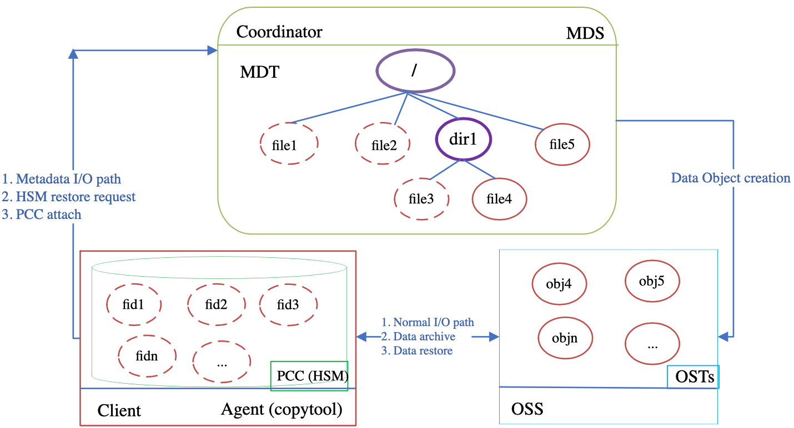

# 06 存储管理、高可用与持久客户端缓存 PCC (第 23~27 章)

> 来源：官方 Lustre 中文操作手册 (Lustre Chinese Operations Manual)

1 #1s /nnt/testfs/mnirrored_file
2 1s: cannot access /mnt/testfs/mi rrored_file: Inval id argument
4 # cat /mnt/testfs/mirrored_file
5 cat: /mt/testfs/mirrored_file: Operation not supported
Lustre 2.10客户端能够理解PFL 布局，但不能理解镜像文件布局。它们能访问但不
能打开在 Lustre 2.11文件系统中创建的镜像文件。这是因为 Lustre 2.10 客户端不会验
证重叠的组件，它们会将镜像文件视为普通的 PFL文件一样进行读写，这将导致已同步
了的镜像实际上包含了不同数据。
以下例子显示了在 Lustre 2.10 客户端上访问和打开（在Lustre 2.11 文件系统中创建
的）镜像文件返回的结果：
1 # 1S /mnt/testfs/nirrored_file
2 /mnt/testfs/mirrored_file
4 # cat /mnt/testfs/mirrored_file
s cat: /mt/testfs/nirrored_file: Operation not supported

## 第二十三章管理文件系统和 1/O


### 23.1. 处理满溢的 OSTs

有时 Lustre 文件系统会变得不平衡，这通常是由于错误的条带设置，或者非常大的
文件在创建时未被分条到所有 OST上。如果OST 已满，试图写入更多信息到文件系统
将会发生错误。以下程序描述了如何处理满溢的 OST。
MIDS一般会在文件创建时自动平衡空间，因此通常不需要此程序，但在某些情况
下（如创建须占用超过所有 OST 的总可用空间的大文件时）可能需要此程序。

### 23.1.1. 查看 OST 空间使用情况

下面的例子显示了一个不平衡的文件系统。
1 client# 1fs df -h
2 UUID
bytes
3 Uses
Mounted on
4 testfs-MDT0000_UUID
5 4∞
6 testfs-OST0000_UUID

### 4.4G

/mnt/testfs ［MDT:0］
2.G
Used
Available
\

### 214.5M


### 3.9G

\

### 751.3


### 1.1G

\

7 37a
8 testfs-OST0001_UUID
9 378
10 testfS-OST0002_UUID
11 86
12 testfS-OST0003_UUID
13 378
14 testfS-OST0004_UUID
15 378
16 testfS-OST0005_UUID
17 368
19 filesystem surary：
20 45%
/mnt/testfs［OST:0］

### 2.0G

/mnt/testfs［OST:1］

### 2.0G

/mnt/testfs［OST:2］****

### 2.0G

/mnt/testfs［OST:3］

### 2.0G

/mnt/testfs［OST:4］

### 2.0G

/mnt/testfs［OST:5］

### 755.3M


### 1.1G

\

### 1.76

155.IM
\

### 751.3M


### 1.10

\

### 747.3M


### 1.1G

\

### 743.3M


### 1.1G

\

### 11.8G


### 5.4G


### 5.8G

\
/mnt/testfs
在这种情况下，OST0002几乎已经全满了，任何往文件系统写入更多信息的尝试
（即使在所有OSTs上平均地分条）都将失败，如下所示：
1 client# 1fs setstripe /mnt/testfs 4M 0 -1
2 client# dd if=/dev/zero of-/mnt/testfs/test_3 bs=10M count=100
3 dd: writing '/mt/testfs/test_3' ： No space left on device
4 98+0 records in
5 97+0 records out
6 1017192448 bytes （1.0 GB） copied, 23.2411 seconds, 43.8 MB/s

### 23.1.2. 在满溢的 OST上禁用创建功能

为避免文件系统空间不足，如果OST 空间使用不平衡，甚至一个或多个 OSTs接近
满溢而其他 OSTs 有很多空间，则可以在MDS上有选择性地停用满溢的 OSTs以防止
MDS 在这些 OSTs上分配新的对象。
1. 登陆 MDS 服务器并使用1ct1命令禁止在满溢的 OSTs上创建新对象：
I mds# lct1 set_param osp.fsname-OSThnnn*.max_create_count=0
在文件系统中创建新文件时，将只使用剩余的OST。可以通过将数据迁移到其他
OST来手动平衡空间（将在下一节介绍），同时，可以通过删除和创建文件来被动地平
衡空间。


### 23.1.3. 在文件系统内迁移数据

如果需要将文件数据从当前的 OST迁移到新的 OST，则必须将数据迁移（复制）
到新的位置。最简单的方法是使用1fs_migrate命令。

### 23.1.4. 将禁用的OST 重新上线

一旦停用的OST 经过主动或被动数据重新分配后不再严重不平衡，它们应该重新
被激活，以便再次分配新文件到这些OSTs上。
1 ［mds］ # 1ctl set_param osp.testfs-OST0002.max_create_count-20000

### 23.1.5. 在文件系统内迁移元数据


### 23.1.5.1. 整体目录迁移 Lustre 2.8引入了在MDTs之间直接迁移元数据（目录和索引节

点）的功能。此迁移只能在整个目录上执行。Lustre 2.12 引入了条带化目录的功能。例
如，要将/testfs/remotedir目录的内容从当前所在的MDT迁移到 MIDT0000，以允
许删除该 MDT，使用的命令如下：
1 $ cd /testfs
2 $ lfs getdirstripe -m ./remotedir which MDT is dir on？
3 1
4 $ touch ./remotedir/file.｛1, 2, 3）.txtcreate test files
5 $ lfs getstripe -m ./remotedir/file.*.txtcheck files are on MDT0001
6 1
7 1
8 1
9 $ lfs migrate -m O ./remotedir migrate testremote to MDT0000
10 $ lfs getdirstripe -m ./remotedir which MDT is dir on now？
11 0
12 $ lfs getstripe -m ./remotedir/file.*.txtcheck files are on MDT0000
14 0
更多信息见man 1fs-migrate。
注意
迁移期间，每个文件都会被分配一个新的标识符（FID）。因此，该文件也会将新的
inode 编号通知给用户空间应用。即使内容未更改，一些系统工具（例如备份、归档工
具，NFS，Samba）可能仍会将迁移文件视为新文件。如果 Lustre 系统通知了新的 FID

给 NFS，但客户端或服务器仍使用旧的FID 缓存过时的文件句柄，则在迁移期间和之
后，迁移的文件可能变得不可访问。重新启动 NFS服务将刷新本地文件句柄缓存，但
客户端也可能需要重新启动，因为它们可能会缓存了过时的文件句柄。

### 23.1.5.2. 条带化目录迁移 Lustre 2.8引入了在MDTs之间迁移元数据（其中的目录

和索引节点）的功能，但是它不支持条带化目录的迁移，也不支持更改现有目录的
条带数。Lustre 2.12 增加了对在迁移时重新分条目录的功能。lfs migrate -m命
令只能对整个目录执行，它会递归地迁移指定的目录及其子条目。例如，要将大型
目录/testfs/1argedir的内容从其在 MDT0000 上的当前位置迁移到 MDT0001 和
MDT0003，请运行以下命令：
1 $ lfs migrate -m 1,3 /testfs/largedir
元数据迁移会将文件和索引节点直接迁移到其他 MDT，但不涉及文件数据的迁移。
在迁移过程中，目录及其子文件可以像普通文件一样被访问，这些同样适用于依赖于文
件索引节点编号的工具。迁移可能会由于多种原因而失败，如 MDS 重启或磁盘已满。
在这些情况下，可能出现一些子文件可能已经迁移到新的 MDT，而其他子文件仍然在
原始 MDT 上，但这些文件仍可正常访问的问题。解决这些问题后，应该再次执行与之
前相同的1£s migrate -m命令来完成此迁移。但是，您不能中止失败的迁移，也不
能从以前的迁移命令迁移到不同的 MDTs。
（Lustre 2.12引入）

### 23.1.5.3. 目录重条带化 Lustre 2.14包括一个改变现有目录的条带数的功能。1fs

setdirstripe -c命令可以在一个现有的目录上执行，以改变其条带数。例如，一个
目录/testfs/testdir正在变大，运行下面的命令，将其条带数增加到2：
1 $ lfs setdirstripe -c 2 /testfs/testdir
默认情况下，目录重条带化将只迁移子文件目录，但不会移动节点。如需同时移动
目录和节点，请在所有的MIDS上运行以下命令：
I mdss lct1 set_param mdt. *.dir_restripe_nsonly=0
在目录中重条带化不允许指定 MDT，相反，服务器会根据空间和节点的使用情况
为增加的条带选择 MDT。在重条带化过程中，目录和其子文件可以像普通文件一样访
问，这和目录迁移是一样的。同样地，你无法中止失败的重条带化，当服务器注意到未
完成的重条带化时，将自动恢复失败的操作。
（Lustre 2.12引入）

### 23.1.5.4. 目录自动拆分 Lustre 2.14包含一个功能，当一个目录变得很大时会自动增加

条带数。这可以通过以下命令启用：


```bash
1 mdss lctl set_param mdt.*.enable_dir_auto_split=1
```
触发目录自动拆分的子文件数是 50k，该值可以通过以下命令改变：

```bash
1 mds$ lctl set_param mdt. *.dir_split_count-value
```
如果是一个普通的目录，目录的条带数将从0增加到4，在第二次拆分时从4增加
到8，以此类推。然而，最终的条带数不会超过总 MDT数，当一个目录在所有的MDT
中分配完毕后，将停止分裂。这个 delta 值可以通过以下命令改变：

```bash
I mds$ lctl set pparam mdt.*.dir_split_delta-value
```

### 23.2. 创建和管理 OST池

有了OST池（OST Pool）功能，用户就能将 OSTs分组，从而更加灵活地放置对象。
“池”（Pool）拥有一个名字，这个名字同Lustre 集群中全体 OST 的一个子集相关联。
OST 池遵循以下规则：

- 一个 OST 可以是多个池的成员。

- OSTs 在池内没有顺序。

- 池内的条带分配遵循普通条带分配规则。

- OST 作为池的成员是灵活的，可以随时更改。
定义OST池时，可以进行文件分配。当为池设置文件或目录条带配置时，只可以使
用池中的 OST 进行条带化。如果为stripe_index指定了一个不是池成员的OST，则
会返回错误。
OST 池仅用于创建文件。如果池的定义发生更改（添加或删除 OST或池被销毁），
已创建的文件不受影响。
注意
如果用空池创建文件，将返回错误（EINVAL）。
如果某个目录使用池条带设置而该池随后被删除，则在该目录中创建的新文件将使
用该目录的默认条带化模式（非池条带模式），不会返回错误。

### 23.2.1. OST池操作

OST 池在 MGS上的配置日志中定义。使用1ct1命令：

- 创建/销毁池

- 在池中增加/移除 OSTs

- 列出所有池及某个池中的 OSTs

1ct1命令必须在MGS上运行。同时，要么将MDT和 MGS 放在同一个节点上，要
么在 MGS 节点上挂载 Lustre 客户端（如果与MDS分离）。这是必须的，以验证正在运
行的池命令是否正确。
注意
在MDS 上运行writeconf命令将擦除所有池信息（以及使用1ct1
conf_param设置的任何其他参数）。我们建议使用脚本执行池定义（和conf_param设
置），以便在执行writeconf后可以轻松地再现它们。
要创建新池，请运行：
1 mgs# lct1 pool_new fsname.poolname
注意
池名称是长达 15个字符的 ASCII 串。
将已命名的OST 加入池，运行：

```bash
1 mgs# lctl pool_add fsname.poolname ost_1ist
```
其中：

- ost_1ist 为fsname-OST index_range

- index_range为
ost_index_start - ost_index_end
或
ost_index
_start- ost
_index_end/step
如果开头的fsname和（或）结尾的_UUID 被省略了，他们将自动被添加。
例如，增加偶数号的 OSTs在文件系统testfs 的poo11中，轻运行 pool_add
（一次性添加多个 OSTs）：
1 lct1 pool_add testfs.ool1 OST［0-10/2］
注意
每次有新的OST 添加到池中，将创建新的11og 配置记录。为方便起见，您可以运
行单个命令添加多个 OSTs。
从池中移除OST，请运行：
1 mgs# lct1 pool_remove
2 Esname.
3 poolname
4 ost_list
销毁池，请运行：
1 mgs# lct1 pool_destroy
2 fsname.
3 poolname

注意
在该池被销毁之前，所有此池中的 OSTs都必须被移除。
列出所指定文件系统中的所有池，运行：
1 mgs# lct1 pool_list
2 fsnamelpathname
列出指定池中所有的 OSTs，运行：
1 lct1 pool_list
2 fsname.
3 poolname

### 23.2.1.1.使用1Es命令操作OST池一些1fs命令可以配合OST池进行操作。使用1fs

setstripe可将目录与OST池相关联，即目录中的所有新常规文件和新目录也将在池
中创建。1fs命令可用于列出文件系统中的池和池中的 OST。
将目录与池相关联，以使新文件和新目录都将在池中创建，请运行：
1 client# 1fs setstripe --p001I-P pool_name
2 filenameldirname
设置条带模式，运行：
1 client# lfs setstripe ［--sizel-s stripe_sizel ［--offset|-o start_ost］
［--stripe-count|-c stripe_count］ ［--overstripe-count|-C
stripe_count］
［--POO1I-P pool_name］
5 dirlfilename
注意
使用无效的池名称（该池不存在或池名称错误）指定条带，1fs setstripe将返
回错误。运行1fs poo1_1ist以确保该池存在且名称输入正确。
1fs setstripe的-poo1选项与其他修饰符兼容。例如，您可以在目录上为条带
设置明确的起始索引。

### 23.2.2.OST池使用建议

以下是使用 OST池的一些建议：

- 目录和文件可以附加扩展属性（EA），使条带设置局限于池内。


- 可以使用池将相同技术或性能（更慢或更快）的OSTs分为一组，或者将某些作业
偏好的 OSTs分为一组。例如，可分 SATA OST 和 SASOST，或者远程OST 与
本地OST。

- 在OST 池中创建的文件通过将池名称保留在文件 LOV EA 中来跟踪池。

### 23.3. 在 Lustre 文件系统中添加 OST

在现存的 Lustre 文件系统中添加一个 OST：
1.通过命令添加一个 OST：

```bash
1 oss# mkfs.lustre --fsname=testfs --mgsnode-mds16@tcp0 --ost --index=12
```
/dev/sda
2 oss# mkdir -P /mnt/testfs/ost12

```bash
3 oss# mount -t lustre /dev/sda /mnt/testfs/ost12
```
2. 迁移数据。
新增空的 OST 将使文件系统非常不平衡。新文件创建将自动进行平衡。如果这是
一个新的文件系统或者文件被定期修剪，那么可能不需要进一步的工作。在扩展之前存
在的文件可以通过就地拷贝来重新平衡，只需简单的脚本来实现。
其基本方法为：复制现有文件到临时文件，然后用临时文件替换旧文件。注意不要
在用户或应用程序正在写入的文件上进行操作。该操作将在整个 OST集上重新进行分
条。
一个明智的迁移脚本将执行以下操作：

- 检查当前数据分配。

- 计算有多少数据需要从每个满溢的OST 迁移至空的 OST。

- 在给定的满溢的 OST搜索文件（使用 1fs getstripe）。

- 限定目标 OST（使用 1fs getstripe）。

- 只复制刚好能够解决不平衡状态的数据。
如果 Lustre 文件系统管理员希望进一步探索此方法，可以在
/proc/fs/lustre/osc/*/rpc_stats下找到每个OST 磁盘使用统计信息。

### 23.4.实施直接1/0

Lustre 软件支持打开O_DIRECT 标志。
使用 read（）和write（）调用的应用程序必须提供在页边界上对齐的缓冲区（通
常为4K）。如果对齐方式不正确，则将返回-EINVAL。在客户端执行大量1/0且受CPU
性能限制（当 CPU 利用率达到100% 的情况下，直接1/0 可能有助于提高性能。


### 23.4.1.将文件系统对象设置为不可变

不可变的文件或目录是指无法修改、重命名或删除的文件或目录。运行以下命令进
行设置：
1 chattr +i
2 file
使用 chattr -i移除该标志。

### 23.5. 其它1/0选项

本节介绍其他1/O选项，包括校验和和 ptlrpcd 线程池。

### 23.5.1. Lustre 校验和

为了防止网络数据损坏，Lustre 客户端可以执行两种类型的数据校验和：内存（用
于客户端内存中的数据）和线路（用于网络中传输的数据）。对于每种校验和类型，计
算在客户端和服务器上读写数据的32位校验和，以确保数据在网络传输中未被破坏。
1diskfs备份文件系统不执行任何持久性校验和，因此它不检测 OST 文件系统中的数
据损坏。
在默认情况下，校验和功能在客户端节点上启用。如果客户端或 OST 检测到校验
和不匹配，则在系统日志中记录类似以下的错误：
1 LustreError: BAD WRITE CHECKSUM:changed in transit before arrival at OST：\
2 Erom 192.168.1.1etcp inum 8991479/2386814769 object 1127239/0 extent［10240\
3 0-106495］
如果发生这种情况，客户端将重读/写受影响的数据五次，以便通过网络获取数据
的完整副本。如果仍然不可行，则将返回1/O错误至应用程序。
启用两种类型的校验和（内存和线路），请运行：
1 lct1 set param 11ite.*.checksum pages-1
禁用两种类型的校验和（内存和线路），请运行：
1 lct1 set_param 11ite.*.checksum_pages=0
查看线路校验和的状态，请运行：
1 lct1 get_param osc. *.checksums

### 23.5.1.1. 更改校验和算法 默认情况下，Lustre 软件使用 adler32 校验和算法，因

其鲁棒性强且对性能影响相较crc32 更低。Lustre 文件系统管理员可以通过lct1
get_param更改校验和算法（具体取决于内核支持情况）。

要查看 Lustre 软件正在使用的校验和算法，请运行：

```bash
1 $ lctl get_param osc.*.checksum_type
```
更改线路校验和算法，请运行：

```bash
I s lctl set_param osc.*.checksum_type-
```
2 algorithm
注意
内存校验和总是使用 adler32算法（如果可用），只有在 adler32 不能使用时才会回
退到 crc32 算法。
在以下示例中，lct1 get_param命令确定了 Lustre 软件正在使用 adler32 校验
和算法，随后使用1ct1 set_param命令将校验和算法更改为 crc32，并运行第二
个Ict1 get_param命令确认现在正在使用crc32 校验和算法。
1 $ lct1 get_param osc.*.checksum_type
2 osc.testfs-OST0000-osc-ffff81012b2c48e0.checksum_type-crc32 ［adler］
3 $ lct1 set_param osc. * .checksum_i
type-crc32
4 osc.testfs-OST0000-osc-ffff81012b2c48e0.checksum_type-crc32

```bash
5 $ lctl get_param osc. *.checksum_type
```
6 osc.testfs-OST0000-osc-ffff81012b2c48e0.checksum_type- ［crc32］ adler

### 23.5.2. Ptlrpc 客户端线程池

使用大型 SMP 节点的Lustre 客户端需要在内核内有显著的并行性，以避免某个
CPU 达到100%的利用率而其他 CPU 却相对空闲的情况。当一个单线程遍历一个大目
录时，这个问题将尤其明显。
Lustre 客户端实现了一个 PIRPC 守护程序线程池，以创建多个线程来提供异步
RPC 请求服务，即使只有一个用户空间的线程在运行。ptlrped线程的数量是在模块加载
时通过模块选项控制的。默认情况下，每个CPU 槽会产生两个服务线程。
线程操作存在将线程上下文从一个 CPU 移动到另一个CPU 的成本问题，这将导致
CPU缓存的损耗。为了降低成本，可以将ptlpc 线程绑定到CPU。但是，绑定的线程在
CPU 忙（可能忙于执行其他任务）时可能无法快速响应，且线程则必须等待。
考虑到这些因素，ptlpc 线程池可以是绑定线程和非绑定线程的混合。系统操作员
可以根据系统大小和工作量来进行平衡。

### 23.5.2.1.

ptlrpcd 参数这些参数作为ptlpc模块的选项，应
在/etc/modprobe.conf或etc/modprobe.d目录中设置.
1 options ptlrpcd ptlrpcd per_cpt_max-xxX

设置每 CPU 槽创建 ptlrpcd 线程的数量。如果未指定，则默认为每槽一个线程，包
括超线程CPU。最多为每槽2线程。
1 options ptlrpcd ptlrpcd bind_policy-［1-4］
有关线程与CPU 的绑定，有以下四种策略：

- PDB
_POLICY
_NONE（plrpcd_bind_ policy=1） 所有线程都不绑定。

- PDB_POLICY_FULL（ptrpcd_bind_policy=2） 所有线程尝试绑定CPU。

- PDB_POLICY_PAIR（ptrpcd_bind_policy=3）这是默认策略。线程被分配为绑定/非
绑定对。每个线程（绑定或空闲）都有一个伙伴线程。ptlrpcd 加载策略时使用伙
伴形式，决定线程在 CPU上如何分配。

- PDB_POLICY_NEIGHBOR（ptlpcd_bind_policy=4）线程被分配为绑定/非绑定对。每
个线程（绑定或空闲）都有两个伙伴线程。

## 第二十四章 Lustre 文件统故障切换和多挂载保护


### 24.1. 概览

多挂载保护（MIMP）功能用于防止 Lustre 文件系统挂载到多个节点。此功能在共
享存储环境中非常重要（如OSS 故障转移对共享同一个 LUN时）。
后端文件系统1diskfs支持 MMP机制。文件系统块由kmmpd守护进程每隔1秒
更新一次，在块中写入序列号。如果文件系统被完全卸载，则在该块中写入一个特殊
的"clean” 序列。挂载文件系统时，1diskfs将会检查 MIMP 块是否包含"clean” 序列。
即使MIMIP块包含该"clean”序列，为防止出现以下情况，1diskfs也会等待一段时
间：

- 如果1/0流量很大，MMP 块更新可能需要更长的时间。

- 如果另一个节点试图挂载相同的文件系统，则可能发生”竞争”情况。
启用 MMP 后，挂载一个干净的文件系统至少需要10秒。如果文件系统未被完全卸
载，则文件系统挂载可能需要更多时间。
注意
MMP 功能仅在 Linux 2.6.9及更新的内核版本上得到支持。

### 24.2. 多挂载保护相关操作

在新的Lustre 文件系统上，如果使用了故障转移且内核和e2fsprogs版本支持，

```bash
mkfs.lustre会在格式化时自动启用MMP。在现有文件系统上，Lustre 文件系统管理
```
员可以在卸载文件系统时手动启用 MMP。

使用以下命令确定MMP 是否正在该Lustre 文件系统中运行，从而启用或禁用 MMP
功能。
确定 MMP是否已启用，请运行：
1 dumpe2fs -h /dev/block_device | grep mmp
输出示例如下：
1 dumpe2fs -h /dev/sdc | grep mp
2 F1lesystem features: has_journal ext_attr resize_inode dir_index
3 filetype extent mmp sparse_super large_file uninit_bg
手动禁用 MMP，请运行：
1 tune2fs -0 Mmp /dev/block_device
手动启用 MMP，请运行：
1 tune2fs -0 mp /dev/block_device
启用 MMP 后，如果1diskfs在文件系统挂载后检测到多次挂载尝试，将会阻止这
些挂载尝试，并报告上次更新 MMP 块的时间、节点名称和当前文件系统所挂载的设备
名。

## 第二十五章配额配置和管理


### 25.1. 配额相关操作

设置配额将允许系统管理员对用户、组或项目可使用的磁盘空间量进行限制。配额
由root 用户设置，可针对个人用户、组或项目进行指定。文件写入配置了配额的分区之
前，将检查创建者所在组的配额情况。如果存在配额，则文件大小将计入组的配额。如
果不存在配额，则在写入文件之前检查所有者的用户配额。同样地，如果用户过度使用
分配的空间，也可对特定功能的 inode 使用情况进行控制。
Lustre 配额执行时与标准的 Linux 配额在以下几个方面有所不同：

- 配额通过1fs和1ct1命令进行管理（挂载后）。

- Lustre 软件中的配额功能分布在整个系统中（因为Lustre 文件系统是分布式文件
系统）。因此，Lustre 上的配额设置和行为与本地磁盘配额在以下几个方面有些不
同：

- 没有单一的管理节点：一些命令必须在 MGS上执行，一些必须在 MDSs和 OSSs
上执行，另一些必须要在客户端上执行。

- 粒度：本地配额通常指定千字节分辨率，而Lustre 使用的最小配额分辨率1兆
字节。


- 准确度：配额信息分布在整个文件系统中，只有对静止的文件系统才能进行精确
计算，以尽可能减少正常使用时的性能开销。

- 配额以量化方式分配和使用。

- 客户端挂载时不设置usrquota或grpquota选项。空间计算功能在默认情况下始
终处于后用状态，同时可以使用1ct1 conf_param在每个文件系统基础上启用
或禁用配额功能。
（Lustre 2.8引入）
值得注意的是，1fs quotaon、lfs quotaoff、lfs quotacheck和
quota
_type子命令从 Lustre 2.4.0 开始废弃，并在 Lustre 2.8.0中完全删除。
注意
尽管Lustre 软件中提供了配额功能，但不会强制执行 root配额。
lfs setquota -u root -不强制执行配额。
lfs quota -u root -显示 Lustre 内部数据（大小动态变化且不能准确反映挂
载点可见块）和 inode 使用情况。

### 25.2. 启用磁盘配额

Lustre 的配额设计将管理和执行与资源使用和计算分开。Lustre 软件负责管理和执
行，后端文件系统负责资源使用和计算。因此，必须先在后端磁盘系统上启用配额。
注意
配额设置由 MGS编排，本节中的所有设置命令必须在MGS上运行。项目配额设置
则需要 Lustre 2.10或更高版本。根据不同的内核版本和后端系统类型，决定是否需要补
丁服务器。
配置
是否需要补丁服务器
ldishfs 且内核版本低于4.5
ldiskfs 且内核版本4.5及以上
版本为0.8及以上，内核版本低于4.5
不需要
需要
版本为0.8 及以上，内核版本为4.5及以上 需要
配额从设备发送获取配额的请求并等待回复。
*注意：低于0.8的zfs版本不支持项目配额。
设置完成后，必须在 MDT上执行配额状态的验证。尽管配额执行由 Lustre 软件管
理，但每个 OSD 的实施依赖于后端文件系统来维护每个用户/组/项目的 block/inode 使
用。因此，使用 ldiskfs 和 ZFS 后端设置配额存在差异。


- ldiskfs 后端。mkfs.lustre创建空配额文件并启用超级块中的QUOTA 功能标
志，该标志会在挂载时自动打开配额功能。当QUOTA 功能标志存在时，通过
修改e2fsck修复配额文件。项目配额功能在默认情况下处于禁用状态，需要运
行tune2fs手动启用每个目标。如果用户、组和项目配额使用不一致，则在所有
未挂载的 MDT 和 OST上运行e2fsck 一f。

- ZFS 后端。ZFS低于 0.8.0的版本尚不支持项目配额功能。计算ZAP 由ZFS文件
系统创建和维护。虽然ZFS 可以跟踪每个用户和组块的使用情况，但它并不处理
zfs-0.7.0之前的 ZFS 版本的 inode 计算。ZFS OSD 本身提供了 inode 跟踪支持。有
两个选项可用：
1. ZFS OSD 根据给定用户或组使用的块的数量来估计正在使用的 inode 的数
量。启用该模式，请在目标的服务器上运行以下命令：lct1 set_param
osd-zfs.S｛FSNAME｝-S｛TARGETNAME｝.quota_iused.
_estimate=1。
2. 与块计算类似，专用 ZAP 也创建了 ZFS OSD 来维护每个用户和组inode 的使用。
默认模式下，quota_iused_estimate被设置为0的默认模式。
注意
如需在 ldiskfs 文件系统上（重新）启用空间使用配额，则需对所有目标运
行tune2fs -0 quota。该命令将设置超级块中的QUOTA 功能标志，并在内部运
行e2fsck（故目标必须处于脱机状态）以针对每个 UID/GID 的磁盘使用情况构建数据
库。
被格式化为 Lustre 2.10版本之前的Lustre 文件系统仍然可以安全地升级到版本

### 2.10，但只有对所有ldiskfs 后端目标运行tune2fs -O project或者在2.15.0版本上

才会有项目配额使用情况报告功能。该命令将设置超级块中的 PROJECT 功能标志，并
运行 e2fsck（故目标必须处于脱机状态）。
注意
在使用ldiskfs 后端的服务器节点上，Lustre 须安装支持配额的 e2fsprog 版本
（ZFS 后端不需e2fsprogs）。通常，我们建议使用https://downloads.hpdd.intel.com/public/
e2fsprogs/上提供的最新 e2fsprogs 版本。
ldiskfs OSD 依赖标准的 Linux 配额功能来维护磁盘上的配额计算信息。因此，如果
使用了 ldiskfs 后端，在 Lustre 服务器上运行的的Linux 内核必须启用CONEIG_QUOTA，
CONEIG_QUOTACTL和CONEIG_QFMT_V2。
配额执行功能可独立地打开或关闭，而与始终启用的空间计算功能无关。存在一个
单一的每文件系统的配额参数来控制 inode/block 配额执行。像所有永久参数一样，此配
额参数可以通过MGS上的1ct1 conf_param按照以下语法来设置：
1 lct1 conf_param fsname.quota.ost |mdt=u|g|plugpInone


- ost：配置 OSTs管理的块配额

- mdt：配置 MDTs 管理的 inode 配额

- u：用户启用配额执行功能

- g：为组启用配额执行功能

- P--项目启用配额执行功能

- ugP - 用户、组及项目启用配额执行功能

- none --禁用用户、组及项目的配额执行功能
示例：
在文件系统testfS1上打开针对块的用户、组、项目配额功能，在MGS上运行：

```bash
1 $ lctl conf_param testfsl.quota.ost=ugP
```
在文件系统testfs2上打开针对 inode 的组配额功能，在 MGS上运行：
1 mgs# lct1 conf_param testfs2.quota.mdt=g
在文件系统testfs3上关闭针对块和 inode 的用户、组、项目配额功能，在MGS
上运行：
1 mgs# lct1 conf param testfs3.quota.ost=none
2 mgs# lct1 conf_param testfs3.quota.mdt=none

### 25.2.1.配额验证

配额参数完成配置后，属于文件系统一部分的所有目标将自动收到新配额设置，并
根据需要启用/禁用配额。通过在 MDS上运行以下命令，可验证每个目标的执行状态：
1 $ lct1 get_param osd-..quota_slave.info
2 osd-zfs.testfs-MDT0000.quota_slave.info-
3 target name：
testfs-MDT0000
4 pOol ID：
5 type：
md
6 quota enabled：
ug
7 conn to master: setup
8 user uptodate：
glb［1］，slv［1］，reint［0］
9 group uptodate: glb［1］，slv［1］，reint［0］

### 25.3. 配额管理

文件系统启动并运行后，可以为用户、组和项目设置块和 inode 的配额限制。这完
全由客户端通过三个配额参数进行控制：

Grace period（宽限期）-允许用户超过软限制的时间段（以秒为单位）。有以下六
种类型：

- 用户块软限制

- 用户 inode 软限制

- 组块软限制

- 组 inode 软限制

- 项目块软限制

- 项目 inode 软限制
宽限期适用于所有用户。例如，用户块软限制针对的是所有使用块配额的用户。
Soft limit（软限制）--宽限定时器在超过软限制时启动。此时，用户、组、项目仍
然可以分配 block或inode。当宽限时间到期并且用户仍然高于软限制时，软限制将变为
硬限制，用户、组、项目不能再分配任何新的block/inode。随后，用户、组、项目应该
删除在软限制下的文件。软限制必须小于硬限制。如果不需要软限制，则应将其设置为
0。
Hard limit（硬限制）-- 当达到硬限制时，block 或inode 分配将失败，并伴随
EDOUOT 标志（即超出配额）。硬限制是绝对限制。如果设置了宽限期，则在硬限制以
下可以在宽限期内超过软限制。
由于 Lustre 文件系统的分布式特性以及保证负载下性能的需求，这些配额参数可能
不是百分之百准确。配额设置可以通过在客户端上执行1fs命令进行操作，包含以下选
项：

- quota-显示通用配额信息（磁盘使用情況和限制）

- setquota -指定配额限制，调试宽限期。默认情况下，宽限期为一周。
用法：
1 1fs quota ［-q］ ［-v］ ［-h］ ［-o obd uuid］ ［-ul-g|-P
uname|uidlgnamelgidlprojid］ /mount_ point
2 lfs quota -t｛-ul-gl-p｝/mount point
3 lfs setquota｛-ul--user|-g|--group|-p|--project｝ usernamelgroupname［-b
block-softlimit］\
［-B block_hardl imit］［-i inode_softlimit］\
［-I inode_hardl imit］ /mount_point
显示当前运行命令用户及其主要组的通用配额信息（磁盘使用情况和限制），请运
行：
1S
lfs quota /mnt/testfs

显示指定用户（如下例中的bob）的通用配额信息，请运行：
1 $ lfs quota -u bob /mnt/testfs
显示指定用户（如下例中的bob）的通用配额信息以及针对每个 MDT 和 OST 的详
细配额统计信息，请运行：
1 S lfs quota -u bob -v /mnt/testfs
显示指定项目（如下例中的〝1"）的通用配额信息，请运行：
1 $ lfs quota -P 1 /mnt/testfs
显示指定组（如下例中的“eng"）的通用配额信息，请运行：
1 $ lfs quota -g eng /mnt/testfs
指定目录下的某一项目设置配额限制（如下例中的"/mnt/testfs/dir"），请运
行：
1 S lfs project -s -p 1 -r /mnt/testfs/dir
2 $ lfs setquota -p 1 -b 307200 -B 309200 -i 10000 -I 11000 /mnt/testfs
递归地列出目录中（本例中力~/mnt/testfs/dir"）的所有子项目属性，请运行：
1 S lfs project -r /mnt/testfs/dir
请注意，如果要使用 1fs quota -P 正确显示目录下的 space/inode 使用率
（比du快得多），则用户或管理员需要为不同的目录使用不同的项目ID。
显示用户配额的 block/inode 宽限期：
1 $ lfs quota -t -u /mnt/testfs
为指定 ID 设置用户或组配额（如下例中的bob），运行：
I $ lfs setquota -u bob -b 307200 -B 309200 -1 10000 -I 11000 /mnt/testfs
在这个例子汇总，"bob" 的配置被设置为300MB（309200*1024），硬限制被设置为
11000个文件。因此，inode 硬限制应为11000。
1fs quota命令显示了每个 Lustre 目标分配和使用的配额：
1 S lfs quota -u bob -v /mnt/testfs
输出内容为：
1 Disk quotas for user bob （uid 6000）：
2 Filesystem
kboytes quota 1imit grace files quota limit grace
3 /mnt/testfs
30720 30920 -
10000 11000 -
4 testfS-MDT0000_UUIDO
'
8192 -
-
2560 -

5 testfs-OST0000
UUIDO
-
8192 -
o
6 testfs-OST0001
_UUID O
-
8192 -
-
-
-
7 Total allocated inode 1imit: 2560, total allocated block 1imit: 24576
全局配额限制被存在配额主目标（QMT）上的专用索引文件中（每种配额类型都有
一个索引）。QMT在 MDT0000上运行并通过lct1 get_param输出全局索引。全局索
引可以通过以下命令转出：
1 # lct1 get_param amt.testfs-OMT0000.*.glb-*
全局索引的格式取决于 OSD 类型。ldiskfs OSD 使用IAM文件，而专用ZAP由ZFS
OSD 创建。
每个从机也在本地存储这个全局索引的副本。当全局索引在主机上修改时，会在
全局配额锁上发出"glimpse callback”，以通知所有从机全局索引已被修改。这个"glimpse
callback"包括受更改影响的标识符的信息。如果 QMT 上的全局索引在从机断开连接时
被修改，则索引版本用于确定全局索引的从属副本是否不再最新。如果是这样，从机将
再次获取整个索引并更新本地副本。全局索引的从副本也通过/proc导出，并可通过以
下命令访问：

```bash
1 lctl get_param osd *.*.quota_slave.1imit*
```
（Lustre 2.12引入）

### 25.4 默认配额

默认配额强制对所有管理员没有设置配额的用户、组或项目执行配额限制。默认配
额可以通过将限额设置为0来禁用。

### 25.4.1用法

1 1fs guota ［-Ul--default-usr |-G|--default-grp|-P|--default-prjl /mount_point
2 lfs setquota｛-UI--default-usr|-G|--default-grpI-PI--default-prj｝［-b
block-softlimit］\
3 ［-B block_hardl imit］［-i inode_softlimit］［-I inode_hardlimit］ /mount_point
4 lfs setquota ｛-ul-gl-p｝ usernamelgroupname -d /mount point
设置默认用户配额
1 # lfs setquota -U -b 10G -B 11G -i 100K -I 105K /mnt/testfs
设置默认组配额
1＃
lfs setquota -G -b 10G -B
11G -i 100K -I 105K /mnt/testfs

设置默认项目配额
1 # lfs setquota -P -b 10G -B 11G -1 100K -I 105K /mnt/testfs
禁用默认用户配额
1 # 1fs setquota -U -b 0 -B 0 -i 0 -I 0 /mnt/testfs
禁用默认组配额
1 # Lfs setquota -G -b 0 -B 0 -i 0 -I 0 /mnt/testfs
禁用默认项目配额
1 # 1fs setquota -P -b 0 -B 0 -i 0 -I 0 /mnt/testfs
注意
如果为某些用户、组或项目设置了配额限制，则将使用这些特定的配额限制而不是
默认配额。如果配额限制设置为0，则所有用户、组或项目的配额限制将使用默认配额。

### 25.5. 配额分配

在Lustre 文件系统中，配额必须正确分配，否则用户将可能遇到不必要的故障。文
件系统块配额在文件系统内的 OSTs之间分配。每个 OST 请求分配的额度都被将被添加
到配额限制里。Lustre 通过量化配额分配减少配额请求相关流量。
Lustre 配额系统中，配额主目标（QMT）负责分配配额。目前，Lustre 仅支持一个
QMT 实例，且只能在类似 MDT0000 的节点上运行。但所有的OST 和 MDT 都建立了配
额从设备（QSD），它们通过连接到 QMT 来分配和释放配额空间。QSD 直接在OSD 层
进行设置。
为了减少配额请求，最初配额空间以非常大的块分配给QSDs。一个目标可以容纳
多少未使用的配额空间由 qunit 大小控制。当给定 ID 的配额空间在 QMT 上快要耗尽时，
qunit 大小将会减少，QSD 将通过"glimpse callback”获悉新的qunit 大小值。随后，从设
备需要释放比新的 qunit 值更大的配额空间。qunit 大小不会无限缩小，对于块来说，其
最小值为1MB，对于 inodes 来说，其最小值1024。这意味着达到此最小值时配额空
间重新平衡过程将停止。因此，即使许多从设备还有 1MB 块或1024个 inode 的剩余配
额空间，仍会返回配额超标的消息。
如果我们再次查看setquota示例，运行以下lfs quota命令：
1 # lfs quota -u bob -v /mnt/testfs
输出为：
1 Disk quotas for user bob （uid 500）：
2 Filesystem
kbytes quota limit grace
files quota 1imit grace
3 /mnt/testfs
30720*30720 30920 6d23h56m44s 10101* 10000 11000

4 6d23h59m50s
S testfS-MDT0000_UUID 0
'
10101-
6 testfs-OST0000
）_UUIDO
-
1024-
-
'
7 testfs-OST0001_UUID 30720* -
29896-
-
-
8 Total allocated inode 1init: 10240, total al located block 1imit: 30920
总共30920的配额限制被分配给了用户bob，又进一步分配给了两个 OSTs。
如上所示，值后面如果跟着*，表明已超过配额限制，尝试写入或创建文件将返回
以下错误：
I 台 cp:writing "/mnt/testfs/foo : Disk quota exceeded.
注意
值得请注意的是，每个OST上的块配额以及每个 MDS上的 inode 配额都会被消耗。
因此，如果其中一个 OST（或 MDT）上配额已用尽，客户端将可能无法创建文件，尽
管其他 OSTs（或MDTs）上还有可用配额。
将配额限制设置得比最小 qunit 更低可能会使用户或组无法创建所有文件。因此建
议使用软/硬限制（OST 数量和最小 qunit 大小的乘积）。
请使用1fs df -1（以及lct1 get_param *.*.filestotal） 确定 inode 的总
数。
statfs接口不直接报告空闲 inode 计数，而是报告总 inode 数和已使用的 inode 数。
空闲 inode 计数是由df（总 inodes - 使用的inode）计算得到。尽管知晓文件系统的总
inode 数并不重要，但您应该知道（准确的）空闲inode 数和已使用的 inode 数。Lustre
软件通过操纵 inode 总计数，以准确报告其他两个值。

### 25.6. 配额和版本互操作性

（Lustre 2.10引入）
要使用 Lustre 2.10中引入的项目配额功能，必须将所有Lustre 服务器和客户端升级
到Lustre 版本2.10或更高版本，项目配额才能正常工作。否则，客户端将无法访问项目
配额，也无法在OSTs上进行核算。另外，服务器可能还需要使用补丁内核，更多信息
见第25.2节启用磁盘配额。
（Lustre 2.14引入）
如果项目配额限制较小，运行命令df与1fs df将返回该项目的可用空间大小，而
不是文件系统的总空间大小。只有客户端需要升级到 Lustre 2.14版本或更高版本时，这
两个命令才会返回以上结果。


### 25.7在.授权缓存和配额限制

在Lustre 文件系统中，授权缓存并不受配额限制影响。为加速1/O，OSTs会向 Lustre
客户端授权缓存。该缓存使数据即使超过OSTs配额，仍能成功写入，并重写配额限制。
顺序是：
1.用户将文件写入Lustre 文件系统。2.如果Lustre 客户端拥有足够的授权缓存，则
会向用户返回”成功”并安排在OSTs上的写入操作。3. 因为 Lustre 客户已经向用户返回"
成功”，OST 不能使这些写入失败。
由于授权缓存，写入操作将始终重新配额限制。例如，如果您为用户 A设置400GB
的配额并使用IOR 从一批客户端为用户 4写入数据，则您将写入比 400GB多得多的数
据，量终导致超出配额的错误（EDQUOT）。
注意
授权缓存对配额限制的作用可以得到缓解，但无法消除。运行以下命令减少客户端
上脏数据最大值（最小值力 1MB）：

- lctl set_param osc.*.max_dirty_mb=8

### 25.8. Lustre 配额统计信息

Lustre 软件可以收集监控配额活动的统计信息，如特定期间发送的配额 RPC 类型、
完成 RPC 的平均时间等。这些统计信息对于衡量 Lustre 文件系统的性能很有用。
每个配额统计信息由配额事件和min_time，max_time和sum_time值组成。
配额事件
说明
sync_acg_reg
sync_reL_req
asynC_acq_rea
async_rel
_rea
wait_for_blk_quota
（lquota_chkquota）
wait_for_ino_quota
（lquota_chkquota）
wait_for_blk_quota
配额从设备发送获取配额的请求并等待回复。
配额从设备发送释放配额的请求并等待回复。
配额从设备发送获取配额的请求但不等待回复。
配额从设备发送释放配额的请求但不等待回复。
在数据写入 OSTs之前，OSTs 将检查剩余块配
额是否足够。这将在 lquota_chkquota 函数中
完成的。
在MDS上创建文件之前，MIDS 检查剩余的 inode
配额是否足够。这将在lquota_chkquota 函数中
完成的。
将块写入 OST 后，会更新相关配额信息。这是在

配额事件
说明
（lquota_pending_commit）
wait_for_ino_quota
（Lquota_pending_commit）
wait_for_pending_blk_quota_req
（qctxt_wait_pending_dgacq）
lquota_pending_commit 函数中完成的。
文件完成创建后，会更新相关配额信息。这是在
lquota_pending_commit 函数中完成的。
在MDS或OSTS上，有一个线程随时为特定
UID/GID 发送块配额请求。其他线程发送配额
请求则需要等待。这是在
qctxt_wait pending_dqacg 函数中完成的。
wait_for_pending_ino_quota_req
（qctxt_wait_pending_dqacq）
在MDS上，有一个线程随时为特定 UID/GID
发送 inode 配额请求。其他线程发送配额请
求则需要等待。这是在
qctxt_wait_pending_dqacg 函数中完成的。
nowait_for_pending_blk_quota_req 在MIDS 或OSTs上，有一个线程随时为特定
（qctxt_wait_pending_dqacq）
UID/GID 发送块配额请求。当线程进入
qctxt_wait pending_dqacq 时，无需再等
待。这是在 qctxt_ wait_pending_dqacq
函数中完成的。
nowait_for_pending_ino_quota_req 在MDS上，有一个线程随时为特定 UID/GID
（qctxt_wait_pending_dqacg）
发送 inode 配额请求。当线程进入
qctxt_ wait pending_dqacq 时，无需再等
待。这是在 qctxt_wait_pending_dqacq
函数中完成的。
quota_ctl
使用 Is setquota,1fs quota 等将
生成quota_ctl 统计信息。
adjust_qunit
每当qunit发生调整时，都将被记录。


### 25.8.1.解析配额统计信息

配额统计是衡量 Lustre 文件系统性能的重要指标。正确解析这些统计信息可以帮助
您诊断配额问题，并做出一些调整，以提高系统性能。
例如，如果您在 OST 上运行此命令：

```bash
1 lctl get_param 1quota.testfs-OST0000.stats
```
您将得到类似以下的结果：
1 snapshot_time

### 1219908615.506895 secs.usecs

2 async_acq_req
1 samples ［us］ 32 3232
3 async_rel_reg
1 samples ［us］
5 5 5
4 nowait_for_pending_blk_quota_req（qctxt_wait_pending_dqacq） 1 samples ［usl 2\
2 2
6 guotactl
4 samples ［us］ 80 3470 4293
7 adjust_gunit
1 samples ［us］ 70 70 70
8……
在第一行中，snapshot_time 表明获得这些数据的时间。其余行列出了配额事件
及其相关数据。
在第二行中，async_acq_req事件发生一次。此事件的min_time，
max_time和sum_time分别为32、32 和32。单位是微秒（HS）。
在第五行中，quota_ct1事件发生四次。此事件的min_time，
max_time和sum_time分别为80、3470 和4293。单位是微秒（us）。
（在Lustre 2.14中引入）

### 25.9 池配额

OST池配额功能提供了一种在 OST池级别上限制用户（组/项目）对磁盘使用的能
力。每个 OST 池配额（Pool Quotas, PQ）直接映射到同名的OST池。因此，PQ 可以用
标准的1ct1 poo1_new/add/remove/erase命令调整大小。所有的PQ都是全局池
的一个子集，全局池包括所有的OST 和MDT（DOM 实例）。由于使用不同的配额设置，
而限制无法使用“全部”配额，该功能听上去可能会令人感到困惑。在Lustre 中，配额
的实质是限制，而非使用一定额度的权利。客户并不总是能使用其配额，如OST 可能
已经没有空间了，或者存在其他配额限制。例如，如果同时存在节点配额和空间配额，
由于受到节点配额限制，即使仍然有足够的空间也无法使用。此外，配额可能很容易被
过度分配：在一个 15PB 的系统中，每个人都分配 10PB的配额。这不是意味着他们有
使用10PB的权利，而是表示使用的空间不能超过10PB。他们很可能在那之前就获取
了ENOSPC- 但不会获得EDQUOT。Lustre 中现在已经包含这种行为，但是池配额增加

了起作用的限制的数量：用户、组或项目全局空间配额，以及现在还可以为每个池单
独定义所有这些配额限制。如果多种配额同时存在，实际效果是可以使用的实际空间
量限制在所有适用的最小（min）配额中。参见 OST 池配额 HLD 中的更多细节 ［http://
wiki.lustrefs.cn/index.php?title=OST池配额概要设计］。

### 25.9.1. DOM池与 MDT池

从 Quota Master 的角度来看，“数据"MIDT 和 OST 都是普通成员。然而，池配额只
支持OST，因为目前没有机制将 MDT 分组到池中。

### 25.9.2. 用于设置配额池的 Lfs quota/setquota 选项

同样的长选项--P001用于设置和报告1fs setquota和1fs 的setquota池配
额。
lfs|
setquota --Pool_name用于设置用户、组或项目的块与使用软限制，用
于指定池的名称。
lfs quota --pool
_name显示指定池名的用户、组或项目的使用情况。

### 25.9.3. 配额池的交互性

客户端和服务器都至少需要Lustre 2.14 来支持池配额。注意如果服务器支持池配额
的话，那么池配额可以在低版本的客户端上运行，但无法查看或修改池配额。由于配额
的执行是在服务器上完成的，所以只需要一个客户端来配置配额。如果需要的话，可以
通过在 MDS上直接挂载一个客户端来完成。

### 25.9.4. 池配额设置硬限制示例

让我们设想一下，你需要为已经存在的 OST 池的 flash_pool 设置配额限制：
1 #it is a limit Eor global pool. PO don't work properly without that
2 lfs setquota -u ivan -B100T /mnt/testfs
3 # set 1TiB block hard 1imit for ivan in a flash_pool
4 1fs setquota -u ivan --pool flash_pool -B1T /mnt/testfs
在设置池配额限制之前，首先需要有系统侧的硬限制。如果你不需要在系统的所有
OST和 MDT上限制用户，只需要在每个池上限制，建议将硬设置设置为一些合理范围
外的超大的值。如果没有全局限制，则不会强制执行配额池限制。所以至少应该设置一
个全局限制，不管是硬限制还是软限制。

### 25.9.5. 池配额设置软限制示例


*图 26: HSM 分层存储管理数据流*

1 # notify OsTs to enforce quota for ivan
2 lfs setquota -u ivan -B10T /mnt/testfs
3#
soft 1imit 10MiB for ivan in a pool flash_pool
4 lfs setquota -u ivan --pool flash poo1 -b1T /mnt/testfs
5#
set block grace
600 s for all users at flash_pool
6 lfs setquota -t -u --block-grace 600 --pool flash pool /mnt/testfs

## 第二十六章分层存储管理（HSM）


### 26.1.简介

Lustre 文件系统可以使用一组特定的功能绑定到分层存储管理（HSM）解决方案。
这些功能可将 Lustre 文件系统连接到一个或多个外部存储系统（通常是 HSM）。通过绑
定到HSM解决方案，Lustre 文件系统可以作为高速缓存在这些速度较慢的HSM 存储系
统的前端工作。
Lustre 文件系统与HSM 的集成提供了一种机制，使文件同时存在于 HSM 解决方案
中，并在 Lustre 文件系统中存有元数据条目可供检查。读取，写入或截断文件将触发文
件数据从 HSM 存储中取回到 Lustre 文件系统中。
将文件复制到 HSM 存储器的过程称为存档。存档完成后，便可删除Lustre 文件数
据（即释放）。将数据从 HSM 存储取回到 Lustre 文件系统的过程称为恢复。存档和恢复
操作需要用到名为"Agent"（代理）的Lustre 文件系统组件。
代理是为装载处理中的 Lustre 文件系统而专门设计的Lustre 客户端节点。在代理
上，运行有一个名为"copytool”（复制工具）的用户空间程序，以协调 Lustre 文件系统和
HSM 解决方案之间文件的存档和恢复。
恢复给定文件的请求由 MDT 上的"coordinator"（协调器）进行注册和分派。
MDS
Coordinator
OSS
OSS
Client
“Agent"
Copy tool
Lustre world
HSM protocols
HSM world
图 26:Overview of the Lustre file system HSM
图25.1 Lustre 文件系统HSM 总览


### 26.2.设置


### 26.2.1.要求

设置 Lustre/HSM 配置，您需要：

- 标准Lustre 文件系统（2.5.0及以上版本）

- 最少两个客户端，一个用于生成有效数据的计算任务，一个作为代理。
可以使用多种代理。所有代理都需要共享对后端存储的访问。对于 POSIX copytool
来说，像 NFS 或其他Lustre 文件系统这样的 POSIX 名称空间是合适的。

### 26.2.2. 协调器 （coordinator）

将 Lustre 文件系统绑定到HSM 系统上，必须在每个文件系统 MDT 上激活协调器，
请运行：

```bash
1 S lctl set_param mdt.SFSNAME-MDT0000.hsm_control-enabled
```
2 mdt.lustre-MDT0000.hsm_control=enabled
确认协调器已被正常启用：
1 $ lct1 get_param mdt.SF SNAMIE-MDT0000.hsm_control
2 mdt.lustre-MDT0000.hsm_control-enabled

### 26.2.3. 代理（agent）

协调器启动后，在每个代理节点载入复制工具 （copytool）以连接到你的HSM 存
储。如果你的 HSM 存储可以进行POSIX 访问，则该命令为：
1 1hsmtool_posix --daemon --hsm-root SHSMPATH --archive-1 SLUSTREPATH
POSIX copytool 只能通过发送 TERM 信号来关闭。

### 26.3. 代理（Agents）和复制工具 （copytool）

代理是运行 copytool 的Lustre 文件系统客户端，而 copytool 是一个在 Lustre 和 HSM
解决方案之间传输数据的用户空间守护程序。由于不同的HSM 解决方案使用不同的
API,copytools 通常只能与特定的HSM一起使用。代理节点只能运行一个 copytool。
以下规则适用于 copytool 实例：Lustre 文件系统每个客户端节点，每个 ARCHIVE
ID（请参见下文）仅支持一个 copytool 进程。这是受制于Lustre 软件，与代理挂载的
Lustre 文件系统的数量无关。
与Lustre 工具捆绑在一起，POSIX copytool 可以与任何导出 POSIX API 的HSM或
外部存储一起使用。


### 26.3.1. ARCHIVE ID 及多后端系统

Lustre 文件系统可以绑定到几种不同的HSM 解决方案。每个绑定的HSM 解决方案
由 ARCHIVE ID 标识。必须为每个绑定的HSM 解决方案选择唯一的 ARCHIVE ID 值，
且其值必须介于1到32之间。
Lustre 文件系统支持无限数量的copytool 实例。每个 ARCHIVE ID 至少需要一个
copytool。当使用 POSIX copytool 时，通过--archives开关定义 ID。
例如，如果单个 Lustre 文件系统绑定到2个不同的HSMs（A 和 B），则可以选择
ARCHIVE ID"1"作为HSMA 的标识，ARCHIVE ID"2”作为HSMB的标识。如果力
ARCHIVE ID 1 启动3个 copytool 实例，则这三个实例都将使用 Archive ID”1"标识。同
样的规则也适用于处理使用 Archive ID"2"为标识的HSMB的 copytool 实例。
发出HSM 请求时，您可以使用--archive开关来选择要使用的后端。在本例中，
文件E00将被存档到后端 ARCHIVE ID"5"中：
1 $ lfs hsm_archive --archive=5 /nnt/lustre/foo
当未指定--archive开关时，可使用默认 ARCHIVE ID。定义默认 ARCHIVE ID：

```bash
1 $ lctl set_param -P ndt.lustre-MDT0000.hsm.default_archive_id=5
```
运行1fs hsm_state命令查看已归档文件的ARCHIVE ID：
1 $ 1fs hsm_state /mnt/Iustre/f00
2 /mnt/lustre/foo：（0x00000009） exists archived, archive_id: 5

### 26.3.2.注册代理

Lustre 文件系统为每个文件系统的每个客户端挂载点分配唯一UUID。每个 Luster
挂载点只能注册一个 copytool。因此，在每个文件系统中，UUID 也是 copytool 的唯一
标识。
通过在 MDS 节点上（每个 MIDT）运行以下命令，可以检索当前注册的copytool实
例（代理 UUID）：
1 $ lct1 get_param -n mdt.$FSNAME-MDT0000.hsm.agents
2 uuid-a19b2416-0930-fc1f-8c58-c985ba5127ad archive_id=1 requests-［current:0
ok:0 errors:0］
返回的值域为：

- uuid：此copytool 使用的客户端挂载点。

- archive_id：此copytool 可访问的ARCHIVE ID 列表（ID之间由逗号隔开）。

- requests：有关此 copytool 处理的请求的各种统计信息。


### 26.3.3. 超时

一个或多个 copytool 实例可能会遇到导致它们无法响应的情况。为避免系统阻塞对
相关文件的访问，我们为请求处理定义了一个超时值。copytool 必须在这段时间内完全
完成请求，其默认值为3600秒。

```bash
1 s lctl set_param -n mdt.lustre-MDT0000.hsm.active_request_timeout
```

### 26.4. 请求

文件系统和 HSM 解决方案之间的数据管理是由请求驱动的。有以下五种类型：

- ARCHIVE：从 Lustre 文件系统拷贝数据至HSM 解决方案。

- RELEASE：从 Lustre 文件系统移除数据。

- RESTORE：从 HSM 解决方案拷回数据至相应的 Lustre 文件系统。

- REMOVE：从HSM 解决方案中删除拷贝数据。

- CANCEL：取消进行中或等待中的请求。
只有 RELEASE 是同步进行且不需要协调器配合的操作。其他请求由协调器处理，
每个MDT 协调器对它们进行弹性的管理。

### 26.4.1.命令

请求通过1fs 命令提交：
1 $ 1fs hsm_archive ［--archive=ID］ FILE1 ［FILE2...］
2 $ lfs hsm
release FILE1 ［FILE2...］
3 $ lfs hsm
restore FILE1 ［FIIE2...］
4 $ 1fs hsm_remove FILE1 ［FIIE2...］
如果没有通过--archive 指定ARCHIVE ID，请求将被发送到默认 ARCHIVE ID。

### 26.4.2. 自动恢复

当一个进程试图读取或修改已释放的文件时，它们将被被自动恢复。相关1/O将被
阻塞直到文件恢复完成。这些操作对进程来说是透明的。例如，以下命令将自动恢复该
文件（如果它已被释放）：
I $ cat /mnt/lustre/released_file


### 26.4.3.请求监控

可以监控每个 MDT 上的已注册请求列表和它们的状况，运行：

```bash
I $ lctl get_param -n mdt.lustre-MDT0000.hsm.actions
```
当前复制工具正在处理的请求列表可通过以下命令获取：
1 $ lct1 get_param -n ndt.lustre-MDT0000.hsm.active_requests

### 26.5.文件状态

命令查看文件状态：
当文件被存档（释放），它们在 Lustre 文件系统上的状态发生改变。使用以下1ES
1 $ 1fs hsm_state FILE1 ［FILE2.•.］
可以为每个文件设置以下的特定策略标志：

- NOARCHIVE：该文件永远不会被存档。

- NORELEASE：该文件永远不会被释放。如果已经设置了RELEASED标志，则不能
再设置此标志。

- DIRTY：文件在复制到 HSM解决方案后发生了更改。DIRTY文件需要再次存档。
DIRTY标志只能在已有EXIST标志的情况下设置。
以下选项只能由 root 用户设置：

- IOST：该文件已存档，但其在 HSM 解决方案上的副本由于某种原因（如磁盘损
坏）丢失，并且不能进行恢复。如果该文件处于 REIEASE状态，则文件丢失；如
果不处于 RELEASE状态，则该文件需要再次存档。
有些标志可通过以下命令手动设置或清除：
1 $ lfs hsm_set ［FLAGS］ FILE1 ［EILE2...］
2 $ lfs hsm_clear ［FLAGS］ FIIE1 ［FILE2...］

### 26.6.调试


### 26.6.1.hsm_controlpolicy

hsm_contro1 负责控制协调器活动并可以清除动作列表。
1 $ lct1 set_param mdt.$FSNAME-MDT0000.hsm_control=purge
可能的值有：


- enabled：启动协调器线程。在可用复制工具实例上分发请求。

- disabled：暂停协调器活动，将不进行新请求分发，不处理超时。新的请求会被
注册，但只有协调器重新启动后才会进行处理。

- shutdown：关闭协调器线程。将无法提交请求。

- purge：清除所有记录的请求。不改变协调器状态。

### 26.6.2.max_requests

max_requests 是同一时间最大的活动请求数（每个协调器）。该值与代理数量无
关。
例如，如果有2个MDT 和4个代理，代理不需要处理2倍的max_requests。

```bash
1 $ lctl set_ param mdt.SFSNAME-MDT0000.hsm.max_requests-10
```

### 26.6.3.policy

更改系统行为，其值可以通过将或- 作力前缀来添加或移除。

```bash
1 s lctl set_param mdt.SFSNAME-MDT0000.hsm.policy=+NRA
```
可以是以下情况组合的值：

- NRA：不进行重试。如果恢复失败，不自动重调度请求。

- NBR：不阻塞1/O 来等待恢复。即触发自动恢复但不阻塞客户端，访问已释放的
文件返回 ENODATA。

### 26.6.4.grace_delay

grace_delay 指的从整个请求列表中清除请求（成功或失败）的延迟，单位为秒。
1 台 lct1 set_param mdt.$FSNAME-MDT0000.hsm.grace_ delay-10

### 26.7.变更日志

Lustre 文件系统添加了记录HSM 相关事件的类型为HSM 的变更日志。
1 16HSM 13:49:47.469433938 2013.10.01 0x280 t=［0×200000400:0×1:0×0］
有两种可用信息可以写入每条HSM 记录：变更文件的FID 和位掩码。位掩码对以
下信息进行编码（最低位在前）

- 错误代码（如果存在）（7 bits）

- HSM 事件（3 bits）


- HE_ARCHIVE= 0：文件已被存档。

- HE_RESTORE = 1：文件已恢复。

- HE_CANCEL = 2：关于此文件的请求已被取消。

- HE_RELEASE = 3：文件已被释放。

- HE_REMOVE = 4：已删除的请求被自动执行。

- HE_STATE = 5：文件标志已更改。

- HSM 标志（3 bits）

- CLF
_HSM_DIRTY=O×1
在上面的例子中，0x280标示错误代码为0，事件为HE_STATE。
使用 1iblustreapi时，可以借助一些辅助函数轻松地从位掩码中提取不同的值，
如：hsm_get_cl_event（）、hsm_get_cl_flags （）、hsm_get_Cl_error（）。

### 26.8.策略引擎

Lustre 文件系统在任何情况下（如空间不足时）都没有内部组件负责自动调度存档
请求和发布请求。自动调度存档操作由策略引擎完成。
策略引擎是一个使用 Lustre 文件系统的特定 HSM API 来监视文件系统和调度请求
的用户空间程序。
我们建议您在专用客户端上运行策略引擎（类似于代理节点），并使用Lustre 2.5以
上版本。推荐使用 Robinhood 策略引擎。

### 26.8.1. Robinhood

Robinhood 是大型文件系统的策略引擎和报告工具。它负责维护数据库中文件系统
元数据的副本，以供任意查询。Robinhood 通过定义基于属性的策略，实现了调度文件
系统条目的批量行为；通过Web 界面和命令行工具，为管理员提供了文件系统内容的
全面视图。同时，它也为快速的Eind 和du操作提供了增强版的克隆。Robinhood是
一个外部项目，可以用于各种配置。更多信息请参阅：https:/sourceforge.net/apps/trac/
robinhood/wiki/Doc。（在Lustre 2.9引入）

## 第二十七章持久客户端缓存（PCC）


### 27.1.简介

基于闪存的固态硬盘有助于（部分地）缩小磁性磁盘和 CPU之间不断扩大的性能
差距。固态硬盘在价格和性能方面都在存储层次中建立了一个新的层次。在Lustre 中存
储的数据集规模很大，在最大的中心中可达到数百个 PiB，这使得将大部分数据存储在
HDD 上，而只将活跃的数据子集存储在SSD上更具性价比。




*图 27: 持久客户端缓存 PCC 架构*

PCC机制允许配备了内部SSD 的客户端具有节点本地I/O 模式的读和写密集型
应用提供额外的性能，而不会失去全球 Lustre 命名空间的优势。PCC与 Lustre HSM 和
布局锁机制相结合，利用本地SSD 存储提供持久的缓存服务，同时允许在本地和共享
存储之间迁移单个文件。这使得1/0 密集型应用能够在客户端节点上读写数据，而不会
失去全局 Lustre 命名空间的优势。
在Lustre 客户端上使用这种缓存的主要优点是，1/O堆栈处理缓存的数据来说要简
单得多，因为没有来自其他客户端的1/O的干扰，从而优化性能。对客户端节点的硬件
也没有特殊要求。任何 Linux 文件系统，如NVMe 设备上的ext4，都可以作为PCC缓
存使用。本地文件缓存减少了对象存储目标（OST）的压力，因为小的或随机的1/O可
以聚集成大的顺序I/O，临时文件甚至不需要刷新到OST 上。

### 27.2.设计


### 27.2.1 Lustre 读-写PCC缓存

Coordinator
MDT
（filel
MDS
1. Metadata I/O path
2. HSM restore request
3.PCC attach
filez ！
dirl
file3 ）
filcS
Data Object creation
file4
obj4
objs
fidl
fid2
fid3
）
fidn
1. Normal I/O path

- 2.Data archive
3. Data restore
objn
Client
PCC （HSM）
Agent （copytool）
OSTs
OSS
图 27:Overview of PCC-RW Architecture
图27.1 PCC-RW架构图
Lustre 通常使用其集成的 HSM 机制，与使用磁带或其他媒体的较大和较慢的归档
存储对接。相反，PCC-RW 实际上是一个 HSM后端存储系统，在Lustre 客户端提供了
一组高速本地缓存。图27.1，"PCC-RW架构图"显示了PCC-RW 的架构。每个客户端
使用自己的本地存储，通常是NVMe 的形式，格式化为本地缓存的本地文件系统。缓存
的1/O 指向本地文件系统中的文件，而正常的1/O则指向OST。
PCC-RW使用Lustre 的HSM机制进行数据同步。每个PCC节点实际上是一个HSM
代理，其上运行了 copytool 实例。Lustre HSM copytool 用于将文件从本地缓存恢复到
Lustre OSTs。任何从其他 Lustre 客户端对PCC缓存文件的远程访问都会触发这种数据

同步。如果一个 PCC 客户端离线，则其缓存的数据将暂时无法被其他客户端访问。在
PCC 客户端重新启动，然后挂载Lustre 文件系统，并重新启动 copytool 之后，这些数据
才能再次被访问。
目前，PCC客户端在其本地文件系统上缓存整个文件。在将1/O 引导到客户端缓存
之前，文件必须被附加到 PCC上。Lustre 的布局锁功能用于确保缓存服务与全局文件系
统状态一致。在附加操作成功后，文件数据可以直接写入/读出本地PCC缓存。如果附
加操作没有成功，客户端将直接退回到正常的1/O路径，并将1/O 直接发送到OST上。
当其他客户端的进程试图读取或修改PCC-RW缓存的文件时，这些文件会自动恢复至
全局文件系统。相应的I/0将阻塞，等待释放的文件恢复。这对应用程序是透明的。
撤销布局锁可以在任何时候自动将文件从 PCC缓存中分离出来。PCC-RW缓存的
文件可以通过1fs pcc detach命令手动分离。缓存文件从缓存中分离并恢复到OST
后，它将从 PCC 文件系统中删除。
失败的PCC-RW 操作通常会返回相应的错误代码。但存在一种特殊情况，即本地
PCC文件系统的空间已经用完。这种情况下，PCC-RW 可以自动回到正常的1/0路径，
因为 Lustre 文件系统的容量远远大于PCC 设备的容量。

### 27.2.2. 基于规则的持久性客户端缓存

PCC包括一个基于规则的、可配置的缓存基础架构，使其能够实现各种目标，比如
定制1/O缓存，提供性能隔离和QoS保证。
对于PCC-RW 来说，当一个文件被创建时，将根据基于规则的策略决定是否会缓存
该文件。其支持针对不同用户、组、项目或文件名扩展的规则。
基于规则的PCC-RW 对新创建的文件的缓存可以直接决定哪个文件可以使用 PCC
上的缓存，而不需要管理员的干预。

### 27.3. PCC 命令行工具

Lustre 为用户提供了1s 和Ictl命令行工具来与PCC 功能进行交互。

### 27.3.1.在客户端添加PCC后端

命令：
1 client# 1ct1 pcc add mountpoint pcapath ［--paraml-p cfgparaml
上面的命令将为 Lustre 客户端添加一个PCC 后端。
参数
说明
mountpoint | Lust
re 客户端的挂载点。

参数
说明
pccpathl 本地文件系
cfgparam
统中用于 PCC缓存的目录路径。整
个文件系统不需要专门用于PCC缓
存，但该目录不应该被普通用户访
问。
一个键-值对形式的字符串，用于配
置PCC后端，如读写 aftach ID（存
档ID）和自动缓存规则等。
注意：当客户节点有一个以上的 Lustre 挂载点或 Lustre 文件系统实例时，参
数mountpoint确保只会配置指定的 Lustre 文件系统实例或Lustre 挂载点的PCC 后端。
如果 PCC 后端被用作PCC-RW 缓存，这个 Lustre 挂载点必须与 HSM（Ihsmtool _posix）
配置相同。另外，参数pccpath应该与POSIX copytool （Ihsmtool_posix）的HSM 根参
数相同。
PCC-RW 使用 Lustre 的HSM 机制进行数据同步。在客户端上使用PCC-RW之前，
仍然需要在 MDT 和PCC 客户端节点上设置HSM。
首先，必须在每个文件系统 MDT 上激活一个协调器。这可以通过以下命令实现：
I mds# lct1 set_param mdt.SFSNAME-MDT0000.hsm_control-enabled
2 mdt.lustre-MDT0000.hsm_control-enabled
接下来，在每个代理节点（PCC 客户节点）上启动 copytool，连接到你的HSM 存
储。这个命令将是以下形式：
1 client# 1hsmtool_posix --daemon --HSM-root $PCCPATH --archive-$ARCHIVE_ID
SLUSTREPATH
示例：
下面的命令为客户端添加了一个 PCC 后端：
1 client# lct1 pcc add /mnt/lustre /mnt/pcc --param
"'projid｛500, 1000｝ &fname-｛*.h5），uid=1001 rwid-2"
配置参数的第一个子串是自动缓存规则，其中“&"代表逻辑 AND运算符，而”，”
代表逻辑 OR运算符。这个例子的规则是新文件只有在满足以下任一条件的情况下才会
被自动缓存：-项目ID 是500或1000，且文件名的后缀是“hS"，- 用户ID是1001。
目前支持的PCC后端配置的键-值对列举如下：-rwidPCC-RW attach ID，与该PCC
节点上运行的 copytool代理的存档ID 相同。-auto_attach "auto_attach=1 "在
下一次打开或1/0时启用自动附加。启用这个选项将导致自动附加有效的PCC缓存文

件，这些文件将会由于手动1fs pcc detach命令或撤销布局锁（即LRU 锁收缩）而
分离。"auto_attach=0 "意味着自动附加文件被禁用，是默认模式。

### 27.3.2. 从客户端删除一个 PCC后端

命令：
1 lct1 pcc del （nountpoint>pccpath
上述命令将从 Lustre 客户端删除一个 PCC 后端。
十--
--十
十--
—----十 |参数 | 说明|十=
=+ |mountpoint | Lustre 客户端的挂载点。|十--
--+Ipccpathl 一个PCC 后端是由这个路径指定的。|I详

```bash
情请参考lctl pcc add。|示例：下面的命令将删除挂载点为“/mnt/lustre”"的客户端上由
```
"/mnt/pcc"引用的PCC 后端。
1 client# lct1 pcc del /mnt/lustre /mnt/pcc

### 27.3.3. 移除客户端上的所有PCC后端

命令：

```bash
1 lctl pcc clear mountpoint
```
上述命令将从 Lustre 客户端删除所有PCC后端。
------+ |参数 | 说明|十=
+
==+ |mountpoint | Lustre 客户端的挂载点。|+-
--+示例：下面的命令将删除挂载点为“/mnt/lustre"的客
户端上所有的PCC后端。
1 client# lct1 pcc clear /mnt/lustre

### 27.3.4.列出客户端上的所有PCC 后端

命令：
1 lct1 pcc list <mountpoint
上述命令将列出 Lustre 客户端上所有PCC后端。
—-----+|参数|说明|十====
=+|mountpoint | Lustre 客户端的挂载点。|+---
-+示例：下面的命令将列出挂载点为“/mnt/lustre”的客
户端上所有的PCC后端。

1 client# lct1 pcc list /mnt/lustre

### 27.3.5. 将指定文件附加到PCC上

命令：
1 1fs pcc attach --idl-i ANUM <file...>
上述命令将把给定的文件附加到 PCC上。
十-
-----十|参数|说明|十== =
十
=+ |--id-i<NUM>| Attach ID 用于选择使用哪个
PCC 后端|+-
--+示例：下面的命令将把/mnt/lustre/
test 引用的文件附加到 PCC-RW attachID 为2的PCC后端上。
1 client# 1fs pcc attach -i 2/mnt/lustre/test

### 27.3.6.通过 FID 将指定文件附加到 PCC上

命令：
1 1fs pcc attach_fid --idl-1 ANUM --mnt |-m （mountpoint><fid...>
上述命令将把由 FID 指定的文件附加到 PCC上。
------+ |参数 | 说明|十===
=+ |--id-i <NUM> | Attach ID 用于选择使用哪个
PCC 后端|+
----+ |--mnt-m<mountpoint> | Lustre 客户
端的挂载点。|+--
---+示例：以下命令将把 FID 为
0x200000401:0x1:0x0的文件附加到 PCC-RW attach ID 为2的PCC 后端上。
1 client# lfs pcc attach_fid -i 2 -m /mnt/lustre Ox200000401:0x1:0x0

### 27.3.7. 将指定文件从 PCC分离

命令：
1 1fs pcc detach ［--keepl-k］ <file...>
上述命令将从 PCC中分离指定的文件。
—-----+|参数| 说明|十==
=+ |-keepl-k | 默认情况下，detach 命令会将文
件|||从PCC 中永久分离出来，并在分离||后删除PCC副本。I||这个选项只分离文
件，II但在缓存中保留PCC副本。I|如果缓存中的文件副本仍然有效，I|则允许在下
次打开时自附加|||被分离的文件。1十---
-----十------
—--+示例：下
面的命令将删除挂载点为“/mnt/lustre”的客户端上所有的PCC后端。

1 client# lct1 pcc clear /mnt/Iustre

### 27.3.8. 通过FID 从PCC 分离指定文件

命令：
1 1fs pcc detach_fid ［--keep|-kl （nountpoint<fid...>
上述命令将通过 FID 从PCC 分离指定文件。
—-----+ |参数|说明|十====
=+ |--keepl-k | 详情请参考 Ifs pcc detach 命令|+----
--十-
-+示例：下面的命令将把FID 为 Ox200000401:0x1:0x0
的文件从PCC上永久分离，并删除PCC上相应的缓存文件。
1 client# 1fs pcc detach_fid /mnt/lustre Ox200000401:0x1:0x0
以下命令将把 FID 为Ox200000401:0x1:0x0的文件从PCC 中分离出来，但允许在下
次打开时自动连接该文件。
1 client# lfs pcc detach_fid -k /mnt/lustre 0x200000401:0x1:0x0

### 27.3.9. 显示指定文件的PCC状态

命令：
1 lfs pcc state <file...>
上述命令将显示指定文件的 PCC状态。
示例：以下命令将显示/mnt/lustre/test 所引用的文件的PCC状态。
1 client# 1fs pcc state /mnt/lustre/test
2 file: /mnt/lustre/test, type: readwrite, PCC file: /mnt/pcc/0004/0000/0bd1
如果文件“/mnt/lustre/test"没有缓存在PCC上，其PCC状态的输出如下。
1 client# lfs pcc state /mnt/lustre/test
2 file: /mnt/lustre/test, type：
none

### 27.4.PCC 配置示例

1. 设置 MDT 上的HSM
1 mds# lct1 set_param mdt.lustre-MDT0000.hsm_control-enabled
2. 设置客户端上的PCC

