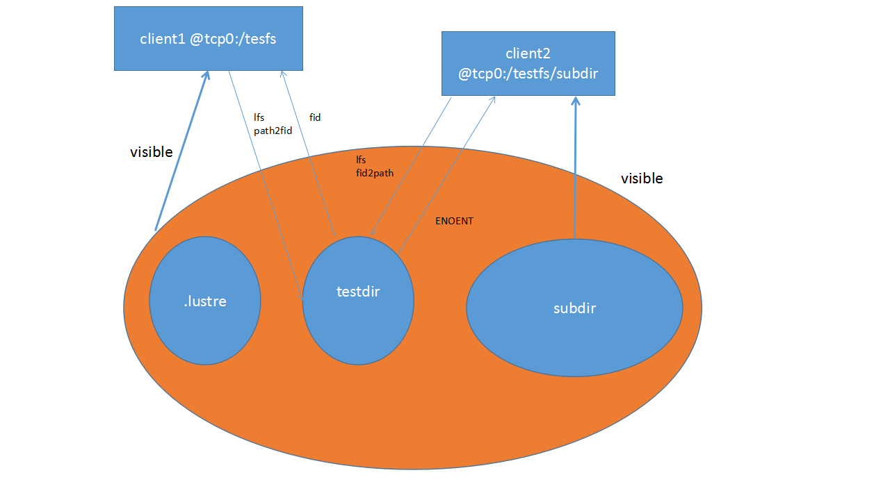

# 10 命令行工具集与 C 语言接口 llapi (第 40~45 章)

> 来源：官方 Lustre 中文操作手册 (Lustre Chinese Operations Manual)

参数
说明
req_active
regbuf_avail
当前正在处理的请求数。
此服务的未经请求的 Inet 请求缓冲区数。
下表列出了一些与服务有关的具体事件：|参数|说明|—------|
--||1d1m_enqueve | 查询锁入队的时间（包括在MDS上打开文件的
时间）。Ilmds_reint |处理一条 MDS 修改记录所需的时间（包括create,mkdir，|||
unlink, rename和setattr）。|

### 39.10.2. MIDT 统计数据解析

MDT stats 文件可用于帮助 MDS 跟踪MDT 统计信息。以下 MDT 统计信息文
件的输出示例。
1 # lct1 get_param mds.*-MDT0000.stats
2 snapshot_time
3 open
4 close
5 getxattr
6 process_config
7 connect
8 disconnect
9 statfs
10 setattr
11 getattr
12 11og_init
13 notify

### 1244832003.676892 secs.usecs

2 samples ［reqs］
1 samples ［reqs］
3 samples ［reqs］
1 samples ［reqs］
2 samples ［reqs］
2 samples ［reqs］
3 samples ［regs］
1 samples ［regs］
3 samples ［regs］
6 samples ［reqs］
16 samples ［reqs］

## 第四十章用户实用程序


### 40.1. 1fs

1fs实用程序可用于用户配置和监控。

### 40.1.1.梗概

1 lfs

2 1fs changelog ［--fo11ow］ mdt_name ［startrec ［endrec］］
3 lfs changelog_clear mdt_name id endrec
4 1fs check mdslosts|servers
5 1fs data_version ［-nrw］ filename
6 lfs df ［-i］ ［-h］［--pool］-P fsname［.pool］ ［path］ ［--lazy］
7 lfs find ［［！］ --atimel-A ［-+］N］ ［［！］ --mtime|-M ［-+JN］
［［！］ --ctimel-C ［-+］N］［--maxdepth|-D N］ ［--namel-n pattern］
［--print|-p］［--printO|-PJ ［［！］ --obdl-0 ost_namel,ost_name...］］
［［！］ --sizel-S ［+-JN［kMGTPE］］--type I-t ｛bcdflpsD｝］
［［！］ --gid|-g|--groupl-G gname|gid］
［［！］ --uid|-u|--userl-U unameluid］
dirname|filename
14 lfs getname ［-h］| ［path...］
15 lfs getstripe ［--obd|-0 ost_name］［--quiet|-ql［--verbosel-v］
［--stripe-count|-c］［--stripe-index|-i］
［--stripe-size|-s］［--poo1|-P］［--directory|-d］
［--mdt-index|-M］［--recursivel-r］ ［--raw|-R］
［--layout|-L］
dirname|filename
21 1fs setstripe ［--sizel-3 stripe_size］ ［--stripe-count|-c stripe_count］
［--overstripe-count|-C stripe_count］
［--stripe-index|-i start_ost_index］
［--ost-1ist|-o ost_indicies］
［--Poo1I-P poo1］
dirnamelfilename
27 lfs setstripe -d dir
28 lfs osts ［path］
29 lfs pool_list filesystenl.pool］ | pathname
30 lfs quota ［-ql ［-v］ ［-hl I-o obd_uuidl-I ost_idxl-i mdt_idx］
［-u usernameluidl-g grouplgidl-P projid］ /mount point
32 lfs quota -t -ul-gl-P /mount_point
33 lfs setquota ｛-u|--user|-g|--groupl-pl--project｝ unameluidlgnamelgidlprojid
［--block-softlimit block_softlimit］
［--block-hardlimit block_hardlimit］
［--inode-softlimit inode_soft1imit］
［--inode-hardl imit inode_hardlimit］

/mount_point
39 lfs setquota -u|--user|-g|--groupl-PI--project unameluid|gnamelgidlprojid
［-b block_softlinit］［-B block_haral imit］
［-i inode-soft1imit］ ［-I inode_hardl imit］
/mount_point
43 lfs setquota -t -uI-g|-P ［--block-grace block_gracel
［--inode-grace inode_grace］
/mount_point
46 1fs setquota -t -ul-gI-P ［-b block_grace］ ［-i inode_grace］
/mount_point
48 lfs help
注意
在上面的例子中，/mount_point参数指的是Lustre 文件系统的挂载点。
在老版本中，1fs quota的输出非常详细，包含集群范围的配额统计信息（包括
用户/组的集群范围限制以及用户/组的集群范围使用情况），以及每个 MDS/OST 的统计
信息。现在，默认情况下，最新的1fs quota仅提供集群范围的统计信息。要获取集群
范围限制、使用情况以及统计信息的完整报告，请在1fs quota中使用-v选项。
（Lustre 2.8引入）
quotacheck、quotaon和quotaoff子命令在 Lustre 2.4版本中弃用，并在 Lustre

### 2.8版本中完全删除。关于配置和检查配额的细节，请参见第25.2节，“启用磁盘配额”。


### 40.1.2. 说明

1fs实用程序可用于创建具有特定条带模式的新文件、确定默认条带模式、收集特
定文件的扩展属性（对象编号和位置）、查找具有特定属性的文件、列出 OST 信息或设
置配额限制。它可以在没有任何参数的情况下以交互方式进行调用，也可以在非交互模
式下使用支持的某一参数进行调用。

### 40.1.3.选项

下表列出了 1fs 的一些不同选项。获取完整列表请在 1fs 窗口下输入help。
选项
说明
changelog
显示 MDT上的元数据更改。起点和终点是可选的。
--fo110w选项会阻止新的更改；此选项仅当直接运行在MDT
节点上时有效。

选项
changelog_clear
check
data_version ［-nrw］
filename
df ［-i］［-hJI-pooll-p
fsname ［. pool］ ［
path］［--lazy］
find
说明
表示某使用者*id*已对*endrec*之前的 changelog 记录不再
感兴趣，即允许 MDT 释放磁盘空间。*endrec *为0则表示
当前的最后一条记录。必须使用1ct1在 MIDT 节点上注册
Changelog使用者。
显示 MDS或OST（在命令中指定）或所有服务器（MDS 和
OST）的状态。
显示文件数据的当前版本。如果指定了-n，则读取数据版本，
不加锁。因此，如果文件系统客户端上有脏的缓存，数据版本
可能已经过时，但这个选项不会强制刷新数据，对文件系统的
影响较小。如果指定了-工，不会强制刷新数据，对文件系统的
影响较小。如果指定了-工，数据版本会在客户端上的脏页被刷
新后读取。如果指定了-w，数据版本会在客户端的所有缓存页
面被刷新后读取。即使使用-r或-w，也有可能出现竞争的情
况，所以在操作前后都要检查数据版本，以确定数据在操作过
程中没有发生变化。数据版本是文件中所有数据对象的最后一
次提交的事务编号之和。HSM策略引擎使用它验证文件数据在
归档操作期间或在发布操作之前是否被更改。在非阻塞模式下
进行 OST 迁移时也使用它，主要用于验在数据复制证文件数据
过程中没有被更改。
使用-1报告每个 MDT 或OST 的文件系统磁盘空间使用情况、
inode 使用情况，或者 OST 子集的实用情况（如果使用-P选项
指定了池）。默认报告所有已挂载Lustre 文件系统的使用情况。
如果包含path选项，则仅报告指定文件系统的使用情况。如
果包含-h选项，则以方便人类查看的格式输出结果，为Mega-、
Giga-、Tera-、Peta-或Exabytes 使用SI base-2后缀。如果指定
了--1azy选项，则将跳过当前与客户端断开连接的所有 OST。
使用--1azy选项可阻止 OST 脱机时的df输出，仅返回当前可
以访问的 OST上的空间。可以启用11ite.*.lazystatfs可
调参数，使其成为所有statfs（）操作的默认行为。
搜索以给定目录/文件名根的目录树以查找与给定参数匹配的
文件。在选项前使用！表示否定（即与参数不匹配的文件）。在
数值之前使用+表示搜索与参数本身或更大值匹配的文件；使
用-表示搜索与参数本身或更小值匹配的文件。

选项
--atime
--ctime
--mtime
--obd
--size
--type
-uid
--user
-gid
-group
--maxdepth
-print/--printO
osts ［path］
aetname ［path.］
说明
最后一次访问是N*24小时前的文件（无法保证atime在集群
中保持一致）。客户端处理读请求时会更新atime，默认情况
下，atime值将暂时写入OST。文件关闭时，atime值将持久
写入 MDT。但磁盘atime只有在atime超过60秒
（mds.*.atime_dift） 时才会更新。（Lustre 2.14引入）在 Lustre

### 2.14中，可以将 OST设置为与每个对象一起持久存储 atime，

这样在使用类似名为 obdfiter.*.atime_diff 参数长时间打开的文
件时，能够获得更准确的持久 atime 更新。Lustre软件考虑了所
有OST和 MDT 的最新时间。如果asetattr 由用户设置，则
其在MDT 和 OST上都会更新，并允许atime值更改更新的
值。
上次文件状态变更发生在N*24小时前的文件。
上次文件内容变更发生在N*24小时前的文件。
在特定OST上有对象的文件。
特定文件大小的文件。文件大小默认单位为bytes，或者给出后
缀为 kilo-， Mega-， Giga-， Tera-， Peta-的不同单位。
具有类型block、character、directory、pipe、file、symlink、
socket、door 的文件（在Solaris 操作系统中使用）。
有指定用户数字ID的文件。
指定用户（可使用用户数字ID）所有的文件。
有指定组 ID 的文件。
指定组（可使用组数字ID）所有的文件。
查找目标树的最多下降N级。
打印完整文件名，新的一行或 NULL 字符跟随其后。
列出文件系统的所有OST。如果指定了挂载Lustre 文件系统的
路径，则仅显示属于此文件系统的 OST。
列出与每个 Lustre 挂载点关联的所有Lustre 文件系统实例。如
果未指定路径，则会询问所有 Lustre 挂载点。如果提供了路径
列表，则将给出相应的路径实例。如果某路径不是Lustre 实例，
则将返回"No such device"。

选项
getstripe
--obd ost_name
--quiet
--verbose
--stripe-count| 列
--index
--offset
--pool
--size
--directory
-recursive
setstripe
--stripe-count
stripe_cnt
--overstripe-count
stripe_cnt
说明
列出给定文件名或目录的条带信息。默认返回条带计数、条带
大小和偏移量。如果您只需要特定的条带信息，可选择
--stripe-count、--stripe-size、--stripe-index、
--layout或--poo1以及这些选项的各种组合以用于检索特定
信息。如果指定了--raw选项，则打印条带信息时不会将文件
系统默认值值替换为未指定的字段。如果未设置条带化 EA，
则将分别打印条带计数、大小和偏移量为0、0和-1。
--mdt-index 打印给定目录下 MDT 的索引（在 Lustre 2.4 中
引入）。
列出在特定 OST上具有对象的文件。
列出有关文件的对象 ID 的详细信息。
打印附加的条带信息。
出条带计数（使用的OST个数）。
列出文件系统每个 OST的索引。
列出文件条带开始的OST 索引。
列出文件所属的池。
列出条带大小（在移至下一个 OST 前写入当前 OST 的数据量）
列出指定目录的条目而不是其内容（与1s -d的方式相同）。
递归到所有子目录。
使用指定文件布局（条带模式）创建新文件。（在使用
setstripe之前，目录必须存在，文件不能存在）
用于将文件条带化的OST 数。当stripe_cnt为0时使用文件
系统范围的默认条带计数（默认值为1）。当stripe_cnt为-1
时，在所有可用 OST上进行条带化。
1与--stripe-count相同，但允许 overstriping，当
stripe_cnt大于 OST 的数量，就会将每个 OST条带化为2
及上个条带。overstriping 对于将条带数与进程数匹配很用帮助，
且对于非常快的OST来说，每个 OST 只对应一个条带，不足
以获得该 OST 的|全部性能。

选项
-size stripe_size
--stripe-index
start_ost_index
--ost-index
--pool pool
说明
移至下一个 OST之前在当前 OST上存储的字节数。
stripe_size为0时，使用文件系统的默认条带大小（默认
为1MB）。可使用k（KB）、m （MB）或g（GB）进行指
定。（默认stripe_size为0，默认的start-ost为-1，注意
不要混淆！如果把start-ost设置0，则所有新文件创建都
发生在OST 0上，这一般不是个好主意）
文件条带化开始的OST 索引（基数为10，从0开始）。
start_ost_index值力-1（默认值），允许 MDS选择起始索
引。这意味着 MIDS 会根据需要选择起始OST。我们强烈建议
选择此默认值，它允许了 MDS根据需要实现空间和负载平衡。
start_ost_index的值与MDS 对文件中的剩余条带使用循
环算法还是 QoS 加权分配无关。
文件条带化开始的OST 索引（基数为10，从0开始）。
用于条带化的预定义OST池名称。还使用了stripe_cnt，
stripe_size 和start_ost值。start-ost值必须是池的
一部分，否则将返回错误。
删除指定目录上的默认条带化设置。
列出文件系统或路径名中的池，或文件系统池中的OST。
setstripe-d
pool_list
｛filesystem｝
［.poolname］|
｛pathname｝
quota ［-qJ［-v］［-O
obduuid-i
mdt_idx|-I
ost_idx］l-u-g-p
uname
uidlgnamelgidl
projid］ /mount_point
quota-t-u-g-p/
mount_point
显示完整文件系统或特定 OBD上对象的磁盘使用情况和限制。
可以指定用户、组名称或 uSr，组和项目ID。如果所有用户、
组项目ID 都被省略了，则显示当前 UID/GID 的配额。使用
-q选项将不会打印其他描述（包括列标题），它使用零来填充宽
限期那一列中的空格（当没有设置宽限期时）来确保列数一致。
使用-v选项将提供更详细（每OBD 统计信息）的输出。
显示用户（-u）、组（-g）或项目（-p）配额的块和 inode宽
限时间。

选项
setquota ｛-ug-P
*unameluidl
namegidl projid｝
［--block -softlimit
block
_softlimit
［--block- hardlimit
block_hardlimit］
--inode- softlimit
inode_ softimit
［-inode-hardlimit
inode_hardllimit］/
mount_point
setquota-t-ul-gl-p
［--block- grace
block_grace
［-inode-grace
inode_grace］/
mount_point
help exit/quit
说明
为用户、组或项目设置文件系统配额。可以使用
--｛blocklinode｝--｛softlimit |hardlimit｝或它们的
简略版-b，-B，-1，-工指定限制。用户可以设置1、2、3或4
个限制。此外，可以使用特殊后缀一b，一K，一m，一g，
-t和-P指定限制，分别表示-b，一k，一m， g，一t和-P指定限
制，分别表示1、210、220、230、240和250的单位。默认情况
下，块限制单位为1千字节（1024），块限制始终为干字节（即
以字节为单位）。请参见下一小节的示例。（支持旧
的setquota接口，但在将来的Lustre 版本中可能被移除。）
设置用户或组的文件系统配额宽限时间。宽限时间
以"XXwXXdXXhXXmXXs” 格式或整数秒进行指定。请参见下
一小节的示例。
提供有关不同1f8 参数的简略帮助。退出1fs交互会话。

### 40.1.4.示例

创建在两个 OST 上条带化的文件，每个条带为 128 KB。
1 $ lfs setstripe -s 128k -c 2/mnt/lustre/file1
删除给定目录上的默认条带模式。新文件使用默认条带模式。
1 $ lfs setstripe -d /mnt/lustre/dir
列出给定文件的对象分配的详细信息。
1 $ lfs getstripe -v /mnt/lustre/filel
列出所有已挂载的 Lustre 文件系统和相应的 Lustre 实例。
1 $ lfs getname
高效地列出给定目录及其子目录中的所有文件。

1 S lfs find /mnt/lustre
递归地列出给定目录中超过30天的所有常规文件。
1 S lfs find /mnt/lustre -mtime +30 -type f -print
递归地列出给定目录中在 OST2-UUID 上有对象的所有文件。1fs服务器查看命令
可用于检查所有服务器（MDT 和 OST）的状态。
1 $ lfs find --obd OST2-UUID /mnt/lustre/
列出文件系统中的所有OST。
1 S Lfs osts
以方便人类查看的格式列出每个 OST 和 MDT 的空间使用情况。
1 $ lfs df -h
列出每个 OST 和MDT 的inode 使用情况。
1 $ lfs df -i
列出特定 OST池的空间或inode 使用情况。
I $ lfs df --p0o1
2 filesystem［.
3 pool］ |
4 pathname
列出用户"bob'的配额情况。
1 $ lfs quota -u bob /mnt/lustre
列出项目号为''的配额情况。
I $ lfs quota -p 1 /mnt/lustre
显示在/mnt/1ustre上的用户配额宽限时间。
1 $ lfs quota -t -u /mnt/lustre
设置用户'bob’的配额，为1GB 的组配额硬限制，2GB 组配额软限制。
1 $ lfs setquota -u bob --block-softlimit 2000000 --block-hardlimit 1000000
2 /mnt/lustre
设置用户配额的宽限时间：块配额为1000秒，inode 配额1周和4天。
1 S lfs setquota -t -u --block-grace 1000 --inode-grace 1w4d /mnt/lustre
检查所有服务器（MDT 和 OST）的状态。

1 $ lfs check servers
在池my_P0o1中创建在两个 OST上条带化的文件。
I $ lfs setstripe --pool my_pool -c 2 /mnt/lustre/file
列出已挂载的 Lustre 文件系统/mnt/luster定义的池：
1 $ 1fs pool_list /mt/lustre/
列出作为文件系统mY_fs中池my_Poo1的成员的OST。
1 $ lfs pool_1ist my_fs.my_pool
查找与poo1A关联的所有目录/文件。
I $ lfs find /mnt/lustre --pool poolA
查找与任何池都没有关联的目录/文件。
1 $ lfs Eind /mnt/ /Iustre --PoOl ""
查找与池有关联的所有目录/文件。
1 $ lfs find /mnt/lustre ！--pool ""
将目录与池my_Poo1关联，以便在池中创建所有新文件和目录。
I 台 lfs setstripe --pool my_ pool /mnt/lustre/dir

### 40.2. 1£s_migrate

1fs_migrate 实用程序是在 OST间迁移文件数据的一个简单的工具。•

### 40.2.1.梗概

1 1fs_migrate ［1fs_setstripe_options］
［-h］ ［-n］ ［-q］ ［-R］ ［-s］［-Y］［fileldirectory ...］

### 40.2.2. 说明

1fs_migrate实用程序是用于帮助文件数据在 Lustre OST 之间迁移的工具。它
使用提供的1fs setstripe选项将指定的文件复制到临时文件（如果有的话），有选
择性地验证文件内容是否未更改，然后交换临时文件和原始文件的布局（即OST 对
象）（Lustre 2.5及更高版本），或将临时文件重命名为原始文件名。这允许用户或管理
员平衡OST之间的空间使用，或者将文件从开始显示硬件问题（尽管仍然可用）或将
被删除的 OST 上移除。
注意

在Lustre 2.5之前的版本中，1fS
_migrate没有与MIDS 整合。使用它作用在正在
被其他应用程序修改的文件是不安全的，因为该文件迁移是通过文件的副本和重命名实
现的。Lustre 2.5及更高版本中，新文件布局将与现有文件布局交换，从而确保保留用
户可见的 inode 编号、文件的打开文件句柄和锁。
要迁移的文件可使用命令行参数指定。如果在命令行中指定了目录，则表示迁移目
录中的所有文件。如果在命令行中未指定文件，则将从标准输入读取文件列表（如使用
1fs find查找特定OST上的文件或匹配其他文件属性，或其他工具标准生成输出的文
件列表）。
除非通过命令行选项另行指定，否则由 MDS上的文件分配策略决定新文件的位置。
同时，把是否通过1ct1在MDS上禁用特定 OST（防止在其上分配新文件），是否有一
些OST过度拥挤（减少放置在这些OST上的文件数），是否父目录有指定的默认文件条
带化设置（可能会影响新文件的条带数，条带大小，OST 池或OST 索引）都列入考虑。
注意
在某些情况下，1fs_migrate实用程序还可以用来减少文件碎片。文件碎片通常
会降低Lustre 文件系统的性能，多在在老化的文件系统上或许多线程写入文件时发生。
如果相对正在复制的文件有足够的没那么碎片化的可用空间（或者文件是在文件系
统接近满溢时写入），则使用1fs_migrate重写文件将导致迁移的文件中碎片的减少。
filefrag工具可用于报告文件碎片，请参见本章第3节"filefrag"。
只要文件的扩展长度几十兆字节（read_bandwidth * seek_time）或更大，
碎片便不会显著影响文件的读取性能。这是因为读取管道可以通过磁盘上的大量读取来
填充（即使偶尔需要进行磁盘搜索）。

### 40.2.3. 选项

1fs_migrate 支持的选项如下：
选项
说明
-c stripecount
-h
-n
使用指定的条带计数重新划分条带文件。此选项可能不会与R
选项同时指定。
显示帮助信息。
使用硬链接迁移文件（默认情况下为跳过）。具有多个硬链接的
文件将被1fs_migrate拆分为多个单独的文件，因此默认情况下
会跳过它们以避免破坏硬链接。
只打印将被迁移的文件名。
静默运行，不打印文件名和状态。

选项
-R
-s
-Y
说明
使用默认目录条带设置重新划分文件。此选项可能不会与-c选
项同时指定。
在迁移完成后跳过文件数据校对。默认情况下，会将迁移的文件
与原始文件进行比较以验证其迁移正确性。
在没有提示的情况下针对使用警告应答y（对于脚本，请谨慎使
用）。
在标准输入中，期待有 NUL.结尾的文件名，如1fs find -printo或
Eind -print0生成的文件名。这样就可以正确处理带有内嵌新行
的文件名。

### 40.2.4.示例

重新平衡 /mnt/1ustre/dir中的所有文件。
I $ lfs_migrate /mnt/Iustre/file
迁移 OST004 上/test文件系统中所有一天前且超过4GB 的文件。
1 $ 1fs find /test -obd test-OST0004 -size +4G -ntime +1 | 1fs_migrate -Y

### 40.3. filefrag

e2fsprogs包中包含了filefrag工具，该工具将报告文件碎片的范围。

### 40.3.1.梗概

1 filefrag ［ -belsv ］ ［ files.. ］

### 40.3.2. 说明

filefrag实用程序可用于报告给定文件的碎片范围，它使用FIEMAP ioct1从
Lustre 文件中获取范围信息。这是非常高效和快速的，即使文件非常大。
在默认模式中，Eilefrag将打印文件中物理上不连续的范围数量。在范围或详细
模式下，将打印每个范围的详细信息（如在每个OST 上分配的块）。Lustre 文件系统中，
范围以设备偏移顺序（首先是当前 OST 的所有范围，然后是下一个 OST等）而不是文

件逻辑偏移顺序进行打印。如果使用文件逻辑偏移顺序，则Lustre 条带化设置将使输出
非常冗长且难以查看是否存在文件碎片。
注意
只要文件的范围长度 几十兆字节或更长（即read_bandwidth *
seek_time>extent_length），文件的读取性能就不怎么会受碎片的影响。这
是因次文件 readahead 可以充分利用磁盘带宽（即使存在偶尔的磁盘搜索）。
在默认模式中，filefrag将返回文件中物理上不连续的范围数量。在范围或详细
模式下，会显示每个范围的详细信息。对于Lustre 文件系统来说，范围按照设备偏移顺
序而不是逻辑偏移顺序打印。

### 40.3.3. 选项

filefrag的选项和其说明如下所示：
选项 说明
-b
输出使用 1024 字节的块大小，为Lustre 文件系统的默认块大小设置。OST 可能使用
-e
-S
-V
不同的块大小。
输出使用范围模式。这也是详细模式下 Lustre 文件的默认值。
以LUN 偏移顺序显示范围。这是Lustre 唯一可用的模式。
在请求映射之前，将任何未写入的文件数据同步到磁盘。
检查文件碎片时，使用详细模式打印文件布局（包括文件中每个范围的逻辑到物理
的映射和 OST 索引）。

### 40.3.4.示例

默认输出：
1 $ filefrag /mnt/lustre/foo
2 /mnt/lustre/foo: 13 extents found
详细模式下的范围信息：
1 $ filefrag -v /mnt/lustre/foo
2 Filesystem type is: bd00bd0
3 File size of /mnt/lustre/foo is 1468297786 （1433888 blocks of 1024 bytes）
ext：
device_logical：
physical_offset: length: dev: flags：
0：
0.. 122879:2804679680..2804802559:122880:0002:network

1：
122880. 245759:2804817920..2804940799:122880:0002:network
245760.. 278527:2804948992..2804981759: 32768:0002:network
2：
3：
4：
278528..
360448..
360447:2804982784..2805064703:81920:0002:network
483327:2805080064..2805202943:122880:0002:network
5：
6：
7：
483328..
606208..
606207:2805211136..2805334015:122880:0002:network
729087:2805342208..2805465087:122880:0002:network
8：
729088.. 851967:2805473280..2805596159:122880:0002:network
851968.. 974847:2805604352..2805727231:122880: 0002:network
9：
974848.. 1097727:2805735424..2805858303:122880:0002:network
1097728.. 1220607:2805866496..2805989375:122880:0002:network
10：
11：
1220608. 1343487:2805997568..2806120447:122880:0002:network
17 12: 1343488.. 1433599:2806128640..2806218751:90112:0002:network
18 /mnt/lustre/foo: 13 extents found

### 40.4.mount

挂载 Lustre 文件系统，可使用标准的mount （8）Linux 命令，它将执
行/sbin/mount.lustre命令以完成安装。mount 命令支持Lustre 文件系统的这些
特定选项：
服务器选项
说明
abort_recov
nosvc
启动目标时中止恢复
仅启动 MGS/MGC 服务器
nomgs
在没有启动MGS 的情况下，启动并置有 MGS的MDT。
exclude
启动已死亡的 OST
md_stripe_cache_size
使用条带 raid 配置为服务器端磁盘设置条带缓存大小
客户端选项
说
flock/noflock/localflock
启用或禁用全局或本地 flock 支持
user_xattr/nouser_xattr
启用或禁用用户扩展属性
user_fid2path/nouser.
_fid2path
启用或禁用常规用户的 FID 到路径转换
（Lustre 2.3中引入）
retry=
客户端挂载文件系统的重试次数

客户端选项
说

### 40.5.处理超时

超时是应用程序挂起的最常见原因。在涉及MDS或OST 故障切换的超时发生后，
应用程序将在连接建立后再尝试访问之前断开连接的资源。
当客户端执行远程操作时，它会允许服务器一个合理的响应时间。如果由于网络故
障、服务器挂起或任何其他原因，服务器未回复，则会发生超时。超时需要恢复。
发生超时时，类似的相应消息将在客户端控制台或/var/1og/messages中显示：
1 LustreBrror: 26597：（client.c: 810;ptlrpc_expire_one_request（））eee tineout
3 reqea2d45200 x5886/tO 038->nds_SvC_UUID@NID_mds_UUID: 12 lens 168/64 ref 1 f1
5 RPC:/0/0 rc0

## 第四十一章程序接口


### 41.1. 用户/组的上行调用（upcall）

本节描述了补充用户/组的上行调用，它将允许MDS进行检索和验证分配特定用户
的补充组，从而避免使用 RPC 将所有补充组从客户端传递到 MDS。

### 41.1.1.梗概

MDS 使用1ct1 get_param mdt.$｛ESNAME）-MDT（xxxx）.identity_upca11指
定的实用程序来查找UID，以便检索用户是否为补充组成员。结果暂时缓存在内核中
（保存时间默认为五分钟），以消除重复调用用户空间的开销。

### 41.1.2.说明

identity_upcal1参数包含用于将数字UID解析为
组成员身份列表的可执行文件的路径。该工具将打开
/proc/fs/1ustre/mdt/$｛FSNAME｝-MDT｛xxxx｝/identity_info
参
数文件并按identity_downcal1_data数 据结构（请参见本章第

### 1.4 节"数据结构"）进行填充。回调可以通过lct1 set_param

mdt.$｛FSNAME｝-MDT（xxxx｝.identity_upcal1进行配置。

有关回调程序的示例，请参阅 Lustre 源代码分发中
的luster/uti1s/1_getidentity.c。

### 41.1.2.1. 主/备组 主/备组的机制如下：


- MDS 发出回调（每个 MDS）将数字 UID 映射到补充组。

- 如果没有回调或回调失败，则最多将添加一个由客户端提供的补充组。

- 默认的回调是/uSr/sbin/1_getidentity，它通过与用户/组数据库交互来获
取 UID/GID/suppgid（补充 GID）。用户/组数据库依赖于身份验证的配置方式，例如
本地的/etc/passwd、网络信息服务（NIS）、轻量级目录访问协议（LDAP）或
SMB 域服务。禁用回调，请将回调接口被设置为 NONE。MDS 使用客户端提供的
UID/GID/suppgid.

- MDS 将在有限的时间内等待组回调程序完成，避免MDS 线程和
客户端因错误访问远程服务节点而挂起。在MDS在没有补充数
据的情况下，回调程序必须在30s内完成。使用 lct1 set_param
mdt.*.identity_acquire_expire=seconds可以在 MDS 上设置回调超时
（以秒为单位）。

- 默认组回调由mkfs.lustre设置，请使用tunefs.lustre --param或lct1
set
_param -P mdt.FSNAME-MDTxxxx.identity_upca11=path设置自定
义回调。

- 组调用（downcall）数据由内核缓存，以避免同一用户的重复回调导致MIDS 速
度变慢。默认情况下，这个内核中的缓存会在1200s后（20分钟）过期。MDS
上的缓存时长（以秒为单位）可以通过以下方法设置：1ct1 set_param
mdt.*.identitY_expire=seconds。

- 为了强制驱逐缓存的身份数据（例如在添加或删除补充组中的用户后，可以通
过 lct1 set_param mdt.*.identitY_flush=UID在 MDS上刷新特定数字
UID 的缓存条目，如需缓存中刷新所有用户的缓存记录，使用-1的UID，可通过：
lct1 set_param mdt.*.identity_flush=-1。

### 41.1.3. 数据结构

1 struct perm downcal1
_datal
5｝i
_164 pdd_nid；
_132 pdd perm；
_u32 pdd_ padding；

7 struct identity_downcal1_datal
—u32
idd_magic；
0I
：
：

## 第四十二章在C程序中设置 Lustre 属性（11api）


### 42.1.11api_file_create

使用11api_file_create 为新文件设置 Lustre 属性。

### 42.1.1.梗概

1 #include <lustre/lustreapi.h>
3 int 11api_file_create（char *name, long stripe_size, int stripe_offset, int
stripe_ count, int stripe_pattern）；

### 42.1.2.说明

定义11api_file_create （）函数对文件描述符的Lustre 文件系统条带信息进行
设置，并随后使用open（）访问文件描述符。
选项
说明
11api_file_create （） 如果文件已存在，则此参数返回EXIST。如果条带参数无效，
则此参数返回EINVAL。
stripe_size
此值必须是系统页面大小的偶数倍，如getpagesize （）所示。
Lustre 条带默认大小为 4MB。
表示此文件的起始OST。
指示此文件条带化使用的OST数。
表示此文件的RAID 模式。
stripe_offset
stripe_count
stripe_pattern
注意
目前，仅支持RAID 0。使用系统默认值，请设置：stripe_size = 0，
stripe_offset =-1,stripe_count = 0, stripe_pattern=0。


### 42.1.3.示例

系统默认大小为 4MB。
1 char *tfile = TESTFTLE：
2 int stripe _size = 65536
以默认配置启动：
1 int stripe_offset =-1
以默认配置启动：
1 int stripe_count = 1
设置单个条带，请运行：
1 int stripe_pattern = 0
目前，仅支持RAID 0。
1 int stripe_pattern = 0；
2 int rc, fd；
3 rc = 1lapi_file_create（tfile, stripe_size stripe_offset，
stripe_count, stripe_pattern）；
结果代码被反转，可能会返回EINVAI或ioct1错误。
1 if （rC）｛
2 fprintf（stderr， "1lapi_file_create failed: eed （es） 0, rC，
strerror （-rC）） ireturn -1； ｝
11api
_file_create 将关闭文件描述符。您必须重新打开描述符，请运行：
I fd = open（tfile, O_CREAT | O_RDWR | O_IOV_DELAY_CREATE, 0644）；if（Ed <0）
\｛
3 str-
4 error （errno））；
5 return -1；
6｝
2 fprintf（stderr， "Can't open es file: ees0, tfile，

### 42.2. 11api_file_get_stripe

使用11api
_file_get_stripe 获取 Lustre 文件系统上的文件或目录的条带信
息。


### 42.2.1.梗概

1 #include <lustre/lustreapi.h>
3 int 1lapi_file_get_stripe（const char *path, void *lum）；

### 42.2.2.说明

11api_file_get_stripe （）函数将以下列格式之一返回lum（应指向足够大的
内存区域）中文件或目录 path 的条带信息：
I struct lov_user_md_vI｛
2 __u32 1m_magic；
_u32 Imm_pattern；
4 _164 Lm_object_id；
5_164 lm_object_seg：
6__u32 1m_stripe_size；
7__u16 1m_stripe_count；
8__U16 1m_stripe_offset；
9 struct lov_user_ost_data_v1 Imm_objects［0］；
10 ）_attribute_（（packed））；
11 struct lov_user_md_v3 ｛
12 __u32 Imm_magic；
13 __u32 Im_pattern；
14__u64 lmm_object_id；
15 __u64 lm_object_seq：
_u32 Imm_stripe_size；
17 __U16 lm_stripe_count；
18 _u16 lm_stripe_ offset；
19 char 1m_pool_name ［LOV_MAXPOOLNAME］；
20 struct lov_user_ost_data_v1 Irm_objects［0］ ；
21 ｝
attribute（（packed））；
选项
1mm_magic
说明
指定返回的条带化信息的格式。LOV_MAGIC.
_V1用于
lov_user_md_v1。IOV_MAGIC_V3用于
lov_user_md_v3。

选项
1mm_pattern
1mm_object_id
Imm_object_gr
Imm_stripe_size
Imm_stripe_count
Imm_stripe_offset
1mm_pool_name
Lmm_objects
1_object_id
1_object_seq
1_ost_gen
1_ost_idx
说明
存有条纹图案。此Lustre 软件版本中只支持LOV_PATTERN_RAIDO。
存有MDS 对象ID。
存有MDS 对象组。
存有条带大小（字节）。
存有文件条带化的 OST数。
存有文件条带化的起始OST 索引。
存有文件所属的OST池名称。
一组包含以下格式的文件信息 （per OST）的
1mm_stripe_count 成员：
struct lov_user_ost_data_v1 ｛
_164 1_object_id；
u64 1_object_seqi
_132 1_ost_gen；
U32 1_ost_idx；
｝_attribute
_（（packed））；
存有OST对象ID。
存有OST 对象组。
存有OST 的索引生成。
存有LOV 中的 OST 索引。

### 42.2.3.返回值

1lapi_file_get_stripe （）将返回：
成功：0；
失败：！= 0，同时，将设置相应的 errno。

### 42.2.4.错误


错误
说明
ENOMEM
分配内存失败
ENAMETOOLONG 路径过长
ENOENT
路径没有指向文件或目录
ENOTTY
路径没有指向 Lustre 文件系统
EFAULT
hum 指向的内存区域未正确映射

### 42.2.5. 示例

1 #include <stdio.h>
2 #include <stdlib.h>
3 #include cerrno.h>
4 #include <lustre/lustreapi.h>
6 static inline int maxint （int a, int b）
7｛
return a > b ?a:b；
9 ｝
10 static void *alloc_1um（）
11｛
int vl, v3, join：
V1 = sizeof（struct lov_user_md VI） +
IOV _MAX_STRIPE_ COUNT * sizeof （struct lov_user_ost_data_VI）；
v3 = sizeof （struct lov_user_md_v3） +
IOV _MAX_STRIPE_ COUNT * sizeof （struct lov_user_ost_data_VI）；
return malloc （maxint （vl, v3））；
18｝
19 int main（int argc, char** argv）
20｛
struct lov_user_md *lum_file = NULL；
int rc；
int lum_size：
if （argc ！=2）｛
fprintf（stderr， "Usage: ees <filename\n"， argv［0］）；

return 1；
｝
1um_file = alloc_1um（）；
if （Ium_file =- NULL）｛
EC = ENOMEM；
goto cleanup；
｝
rC = 11api_tile_get_stripe（argv［1］， 1um_file）；
if （rc）｛
rc = errno；
goto cleanup；
LE
0b
｝
/* stripe_size stripe_count */
printf（"ed edln"，
lum_file->Imm_stripe_size
1um_file->Irm_stripe_count）；
42 cleanup：
if （Ium_file ！= NULL）
Eree （lum_file）；
return rC：
46｝

### 42.3. 11api_file_open

11api_file_open 命令用于在 Lustre 文件系统上打开（或创建）文件或设备。

### 42.3.1. 梗概

1 #include <lustre/lustreapi.h>
2 int 11api_file_open（const char *name, int flags, int mode，
unsigned long long stripe_size, int stripe_offset，
int stripe_count, int stripe_pattern）；
5 int 1lapi_file_create（const char *name，
unsigned long long stripe_size，
6 int stripe_offset, int stripe_count，
int stripe_pattern）；


### 42.3.2.说明

11api_file_create（）调用相当于在标志为O_CREATIO_WRONL.Y，模式
为0644下调用11api_E1le_open后再关闭文件。11ap1
_file_open （）在Lustre 文
件系统上打开给定名称的文件。
选项
说明
flags
mode
stripe_size
stripe_offset
stripe_count
stripe_pattern
可以是 O_RDONLY, O_WRONLY, O_RDWR, O_CREAT, O_EXCL，
O_NOCTTY, O_TRUNC, O_APPEND, O_NONBLOCK, O_SYNC, FASYNC，
O_DIRECT, O_LARGEFILE, O_DIRECTORY, O_NOFOLLON，
O_NOATINE的任意组合。
指定使用0_CREAT时用于新文件的权限位。
指定条带大小（字节）。须 64 KB 的倍数且不超过4GB。
指定文件的起始OST 索引。默认值-1。
指定文件条带化的 OST 数量。默认值为-1。
指定条带模式。在 Lustre 发行版中，仅LOV_PATTERN_RAIDO可用。
默认值为0。

### 42.3.3. 返回值

11api_file_open（）和 11ap1_f1le_create （）返回：
成功：>=0，11api_file_open 的返回值为文件描述符；
失败：<0，其绝对值为错误代码。

### 42.3.4.错误

错误
说明
EINVAL
EEXIST
EALREADY
ENOTTY
stripe_size、stripe_offset、stripe_count 或stripe_pattern 无效。
条带信息已被设置且不能更改；名称已存在。
条带信息已被设置且不能更改。
name 没有指向Lustre 文件系统。


### 42.3.5. 示例

1 #include <stdio.h>
2 #include <lustre/lustreapi.h>
5｛
=I
4 int main（int argc, char *argv［］）
17 ｝
int rc；
if （argc ！= 2）
return -1；
rC = 11api_file_create（argv［1］， 1048576, 0, 2, LOV_PATTERN_ RAIDO）；
if （IC <O）｛
fprintf（stderr， "file creation has failed，
s\n"，
strerror（-rc））；
return -1；
｝
printf（"%s with stripe size 1048576, striped across 2 OSTs， "
" has been created！\n"，argv［1］）；
return O；

### 42.4. 11api_quotact1

使用11api_quotact1管理Lustre 文件系统的磁盘配额。

### 42.4.1.梗概

1 #include <lustre/lustreapi.h>
2 int 1lapi_quotact1（char" " *mnt， " " struct if_quotact］" " *qctl）
II
4 struct if_quotactl ｛
_u32
_u32
_u32
_u32
struct obd_dqinfo
struct obd_dqblk
char
qC_cmd；
qC_type；
gc_id；
qC_stat；
qc_dqinfo；
qC_dgbLk；
obd_type［16］；

struct obd_uuid
13｝；
14 struct obd_dgblk｛
—164 dab bhardl init；
—164 dgb_bsoftlimit；
_464 dgb_curspace；
_164 dgb_ihardlimit；
_u64 dgb_isoftlimit；
_464 dgb_curinodes；
_464 dqb_btime；
_164 dab_itime：
_u32 dgb_valid；
_u32 padding；
25 ｝i
26 struct obd_dqinfo｛
464 dqi_bgrace；
—464 dqi_igrace；
_u32 dqi_flags：
_u32 dqi_valid；
31 ｝；
32 struct obd_uuid｛
char uuid［40］；
34 ｝；
obd_uuid；

### 42.4.2.说明

11api_quotact1（）命令用于操作挂载的 Lustre 文件系统上的磁盘配额。
qc_cmd表示命令将应用于UIDgc_id或GIDgc_id.
选项
说明
LUSTRE_O_GETQUOTA 获取用户或组gc._id 的磁盘配额限制和当前使用情况。ge_bpe
有USRQUOTA或GRPQUOTA。wuid 可以通过OBD UUID字符串
填充以查询特定节点的配额信息。dgb_valid 可设置 非零以查
询来自 MDS 的信息。如果 wwid 是空字符串且 dgb_valid 为零，
则返回集群范围上的限制和使用情况。返回时，obd_dgblk 将包
含所请求的信息（块限制的单位干字节）。在使用此命令之

选项
说明
前必须打开配额功能。
IUSTRE_Q_SETQUOTA 为用户或组gc_id 设置磁盘配额限制。gc_bpe 有USRQUOTA
或GRPQUOTA。根据更新的限制，必须将dgb_valid 设置为
QIE_ILIMITS,QIE_BLIMITS或QIE_LIMITS （inode 限制
和块限制）。必须使用限制值填充 obd_dgblk（如dgb_valid，
块限制单位为千字节）。在使用此命令之前必须打开配额功能。
LUSTRE_O_GETINFO
获取有关配额的信息。gc_bpe 为USRQUOTA或GRPQUOTA。返
回时，dgi_igrace 为 inode 宽限时间（以秒为单位），
dgi_bgrace 是块宽限时间（以秒为单位），当前 Lustre 软件发行
版不使用 dgi_flags。
LUSTRE_Q_SETINEO
获取有关配额的信息。gc_bpe 为USRQUOTA或GRPQU0TA。返
回时，dgi_igrace 为inode 宽限时间（以秒为单位），dgi_bgrace
是块宽限时间（以秒为单位）。当前Lustre 软件发行版不使用
dgi_flags，并且必须将其归零。

### 42.4.3. 返回值

11api_quotact1（）返回：
成功：0；
失败：-1，同时将设置错误便好 （errno）。

### 42.4.4.错误

11api_quotact1的错误类型如下所示：
错误
说明
EFAULT qctl无效。
ENOSYS 内核或 Lustre 模块尚未使用QUOTA选项进行编译。
ENOMEM 没有足够的内存完成操作。
ENOTTY qc_cmd无效。

错误
说明
ENOENT wuid 无法对应 OBD 或mnt 不存在。
EPERM
ESRCH
调用享有特权，但调用者不适超级用户。
找不到指定用户的磁盘配额。尚未为此文件系统启用配额。

### 42.5.11api_path2fid

使用11api_path2fid 从路径名获取 FID。

### 42.5.1.梗概

1 #include <lustre/lustreapi.h>
3 int 11api_path2fid（const char *path, unsigned long long *seg, unsigned 1ong
*oid, unsigned long *ver）

### 42.5.2.说明

11api_path2fid 函数将返回路径名的FID（序列：对象ID：版本）。

### 42.5.3. 返回值

11api_path2fid返回：
成功：0；
失败：非零值。

### 42.6.11api_ladvise

（在Lustre 2.9中引入）
使用11api_1advise 为服务器提供有关 Lustre 文件的I0 建议。

### 42.6.1. 梗概

1 #include <lustre/lustreapi.h>
2 int 11api_ladvise （int fd, unsigned long long flags，
int num_advise, struct 1lapi_1u_ladvise *ladvise）；
5 struct 11api_lu_ladvise ｛

13 ｝；
_U16 11a advice；
U16 11a valuel：
/* advice type */
/* values for different advice types */
_u32 11a_valuez；
464 11a_start；
—164 11a_end；
/* first byte of extent for advice */
/* last byte of extent for advice */
u32 11a_value3；
_u32 11a_ value4：

### 42.6.2.说明

11api_ladvise函数将ladvise 中的 num_achise 1/O 的一组来自应用程序的针对文
件描述符 fa 的提示建议（最多有LAHI COUNT_MAX个条目）传递到一个或多个Lustre
服务器。flags 可以有选择性地按位或值来修改处理建议的方式：

- LF_ASYNC：客户端在提交 ladvise RPC后立即返回用户空间，服务器线程将异步
处理建议。

- LF UNSET：取消或清除以前的建议（目前仅支持IU_ADVISE
_LOCKNOEXPAND）。
每个 ladvise 元素都是一个包含以下字段的 Hlapi_W_ladvise结构：
字段
说明
11a_ladvice
11a_start
1la_end
11a_valuel、
11a_value2、
11a_value3、
11a_value4
11a_lockahead_mode
有关给定文件范围的建议，当前支持：
LU_LADVISE.
_WILLREAD：使用服务器的最优 1/O 大小将数据预
取到服务器缓存中；IU_IADVISE_DONTNEED：清除服务器上指
定文件范围的缓存数据。
此建议开始的偏移量（以字节为单位）。
此建议结束的偏移量（不包含）。
用于未来建议类型的附加参数，例如，供以下这些字段以使用
特定建议。如果对给定的建议类型没有明确要求，则应设置为
零。
使用LU_ADVISE_LOCKAHEAD时，'11a_value1'字段可用于
传达请求的锁模式，可使用11a_1ockahead_mode引用。

字段
说明
11a_peradvice_flags
当使用支持它们的建议时，'11a_value2'字段用于传递特定
于每个建议的标志，可使用11a_peradvice_flags引用。
支持LE_ASYNC和LE_UNSET。
11a_1ockahead_result 使用IU_ADVISE_LOCKAHEAD时，'11a_value3'字段可用
于传达请求结果，可使用11a_lockahead_resu1t引用。
11api_ladvise （）将建议转发给Lustre 服务器，但不保证服务器如何以及何时对
建议作出反应。服务器收到建议可能会也可能不会触发操作，具体取决于建议的类型以
及接收建议的服务器端组件的实时决策。
11api
-1advise （）的典型用法是使应用程序和用户（通过1fs ladvise）获取
关于应用程序1/O模式的扩展知识，以干预服务器端1O 处理。例如，如果一组不同
的客户端正在对文件进行小的随机读取，则在处理随机I0 之前将页面预取到具有
大线性读取能力的OSS缓存中有百利而无一害。由于要向客户端发送更多数据，使
用fadvise（）将数据提取到每个客户端的缓存中可能没有什么好处。
值得一提的是LU
_LADVISE
LOCKAHEAD的使用。尽管您可以（我们也推荐您）在
应用程序中直接使用它以避免锁争用（主要是从多个客户端写入单个文件），但您同样
也可通过 ANL 的MPI-1/O/ MPICH 库的i/o聚合模式来获取它。这也是使用此功能的主
要方式。
目前，此功能仅作补丁，尚未合并到公共 ANL 代码库中。建议用户查看 MPICH
文档或从其供应商处获取更多支持。
虽然在概念上类似于posix_fadvise 和Linusfadvise系统调用，11api
_ladvise （）与
它们的主要区别在于：Eadvise （）和posix
fadvise （）是客户端机制，不会将建议
传递给文件系统；而11api_1advise （）会发送建议或提示至存储文该件的一个或多个
Lustre 服务器。在某些情况下，可能需要使用两种接口。

### 42.6.3. 返回值

11api_ladvise 返回：
成功：0；
失败：-1，同时将设置errno。

### 42.6.4.错误


错误
说明
ENOMEM
没有足够的内存完成操作。
EINVAL
一个以上的无效参数。
EFAULT
ladvise 指向的内存区域未正确映射。
ENOTSUPP 不支持的 advice 类型。

### 42.7. 11api 库使用示例

使用1lapi_file_create为新文件设置Lustre 软件属性。
您可以使用ioct1等内部程序设置条带化。编译以下示例程序，您需要安装 Lustre
客户端源 RPM。
用于演示 API 条带化的简单c程序-libtest.c
1 /* -*- mode: c; c-basicoffset: 8; indent-tabs-mode: nil； -*-
2 * vim:expandtab:shiftwidth=8:tabstop=8：
*
4 * lustredeno - a simple example of lustreapi functions
5*/
6 #include <stdio.h>
7 #include <fcntl.h>
8 #include <dirent.h>
9 #include cerrno.h>
10 #include <stdlib.h>
11 #include<lustre/lustreapi.h>
12 #define MAX_OSTS 1024
13 #define LOV EA_SIZE（1umy num）
（sizeof（*1um） + num *
sizeof （*1um->Imm_objects））
14 #define IOV EA_MAX （1um） IOV FA_SIZE （lum, MAX_OSTS）
16 /*
*/
* This program provides crude examples of using the lustreapi API functions
19 /* Change these definitions to suit */
21 #define TESTDIR "/tmp"
/* Results directory */

22 #define TESTFILE "Iustre_durmy"
23 #define FIIESIZE 262144
24 #define DUMWORD "DEADBEEF"
25 #define MY_STRIPE, WIDIH 2
required */
26 #define MY_LUSTRE_DIR "/mnt/Iustre/ftest"
/* Name for the file we create/destroy */
/* Size of the file in words */
/* Dummy word used to fill files */
/* Set this to the number Of OST
29｛
28 int close_file（int fd）
if （close （fd）<O）｛
fprintf（stderr，
"File close failed: ed（es）\n"，errno，
strerror （errno））；
return -1；
｝
return O；
35｝
37 int write_file（int fd）
38｛
char *stng = DUMNORD；
int cnt = 0；
for（ cnt = 0; cnt < FIIESIZE； cnt++）｛
wEite（fd, stng, sizeof（stng））；
｝
return O；
46 ｝
47 /* Open a file, set a specific stripe count, size and starting OsT
48 *
Adjust the parameters to suit */
49 int open_stripe_file（）
50｛
char *tfile = TESTFILE；
int stripe_size = 65536；
/* System default is 4M */
int stripe_offset =-1；
/* Start at default */
int stripe_count = MY_STRIPE_WIDTH； /*Single stripe for this demo* /
int stripe pattern = 0；
/* only RAID 0 at this time */

6l
int rc, Ed；
rC = 11api_file_create（tfile
stripe_size stripe_offset,stripe_count, stripe_pattern）；
/* result code is inverted, we may return -EINVAL or an ioctI error.
* We borrow an error message from sanity.c
*/
if （rC）｛
｝
fprintf （stderr， "1lapi_file_create failed: 8d （%s）In"， rc，
strerror（-rC））；
return -1；
/* 11api_file_create closes the file descriptor, we must re-open */
fd = open （tfile, O_CREAT | O_RDNR | O_LOV_DELAY_CREATE, 0644）；
if（Ed<O）｛
Eprintf（stderr， "Can't open es file: ed （8s）\n"，tfile，
errno，strerror（errno））；
return -1；
｝
return fd；
74 ｝
76 /* output a list of uuids for this file */
77 int get_my_uuids （int fd）
78｛
struct obd_uuid uuids［1024］， *uuidp；
int obdcount = 1024；
int rc,i；
/* Output var */
rC = 1lapi_lov_get_uuids （Ed uuids， &obdcount）；
if （rc！=0）｛
fprintf（stderr， "get uuids failed: ed （es） \n"'，errno，
strerror（errno））；
｝
printf（'This file system has ed obds\n"， obdcount）；
for （i= 0, uuidp = uuids; i < obdcount;i++， uuidpt+）｛

printf（"UUID ed is esln"， i, uuidp->uuid）；
｝
return 0；
92 ｝
94 /* Print out some IOV attributes. List our objects */
9s int get_file_info（char *path）
96 ｛
g9
struct lov_user_md *lump；
int rc；
int i；
lump = mal1oC（LOV_EA_MAX （Lump））；
if （Lumgp == NULL）｛
return -1；
｝
rC = 11api_file_get_stripe （path, 1ump）；
if （rC ！=0）｛
fprintf（stderr， "'get_stripe failed: 8d
（8s）\n"，errno，
strerror （errno））；
return -1；
｝
printf （'Lov magic guln"， lump->Imm_magic）；
printf（"Lov pattern au\n"， 1ump->Im_pattern）；
printf（"Lov object id 8lluln"， 1ump->Im_object_id）；
printf（"Lov stripe size euln"，1ump->lmm_stripe_size） ；
printf（"Lov stripe count %huln"，1unp->Im_stripe_count）；
printf（"Lov stripe offset gu\n"， 1ump->1m_stripe_offset）；
for（i= 0；i < lump->Imm_stripe_count;i++）｛
printf（"Object index ed Objid elluln"，
Lump->Lr_objects［i］.1_ost_idx，
1ump->lmm_objects［i］.1_object_id）；

｝
Eree （1ump）；
return rci
127 ｝
129 /* Ping al1 osrs that belong to this filesystem */
130 int ping_osts（）
131 ｛
DIR *dir；
struct dirent *d；
char osc_dir［100］；
int rc；
sprintf（osc_dir， "/proc/fs/lustre/osc"）；
dir = opendir（osc_dir）；
if （dir == NULL）｛
printf（"Can't open dir\n"）；
return -1；
｝
while（（d = readdir（dir））！= NULL）｛
if （d-2d_type == DT_DIR）｛
if （！strnamp （d-2d_name， "osC"，3））｛
printf（"Pinging Osc 8s "，d-xd_name）；
rc = 11api_ping（"osc"， d-2d_name）；
if （rC）｛
printf（"bad\n"）；
｝ else｛
printf（" good\n"）；
｝
｝
｝
｝
return O；

158 ｝
160 int main（）
161 ｛
int file：
int rc；
char filename［100］；
char sys_cnd［100］；
sprintf（filename， "es/8s"，MY_LUSTRE_DIR, TESTFTIE）；
printf（"Open a file with striping\n"）；
file = open_stripe_file（）；
if（file<0）｛
printf（"Exiting\n"）；
exit（1）；
｝
printf（"Getting uuid 1ist\n"）；
rC - get_my_uuids （file）；
printf（'Write to the fileln"）；
rc = write_file（f1le）；
rc = close_Eile（file）；
printf（'Listing LOV data\n"）；
rC = get_file_info（fi lename）；
printf（"Ping our OSTs\n"）；
rc = ping_osts（）；
/* the results should match 1fs getstripe */
printf（"Confirming our results with 1fs getstripe\n"）；
sprintf（sys_cmd， "/usr/bin/1fs getstripe 8s/%s"，MY_IUSTRE_DIR，
TESTFTIE）；
sYstem （SYS_cnd）；
192｝
printf（"A11 done\n"）；
exit （rc）；

上述程序的 Makefile 文件：
I gcc -g -02 -Wa11 -o lustredemo 1ibtest.c -11ustreapi
2 Clean：
3 rm -f core lustredemo *.0
4 run：
5 make
6 rm -f /mnt/lustre/ftest/lustredeno
7 rm -f /mnt/lustre/ftest/Iustre_dummy
8 cp lustredemo /mnt/lustre/ftest/

## 第四十三章配置文件和模块参数


### 43.1.简介

网络硬件和路由通过模块参数进行配置，这些参数应在
/etc/modprobe.d/lustre.conf文件中进行指定，如：
1 options Inet networks=tcp0 （eth2）
以上选项指定此节点应在 eth2 网络接口上使用TCP 协议。
首次加载模块时会读取模块参数。当LNet 启动时（通常在modprobe Pt1rpc上），
LNet 模块自动加载特定类型的LND模块（如ksocklnd）。
LNet 配置參数可在 /sys/module/1net/parameters/下查看，LND 特
定参数可在相应 LND 名下查看，例如用于 sockInd（TCP） LND 的
/sys/module/ksocklnd/parameters/。
对于以下参数，默认选项设置显示在括号中。标记为w的参数更改会影响正在运行
的系统，标记为Wc的参数更改仅在建立连接时有效（现有连接不受这些更改的影响），
而无标记的参数只能在LNet 第一次加载时设置.

### 43.2. 模块选项


- 在路由或其他多网络配置中，请使用ip2nets而不是网络，从而使所有节点都可
以使用相同的配置。

- 在路由网络中，请在任何位置使用相同的“路由”配置。指定为路由器的节点将自
动后用转发，并忽略与特定节点无关的路由。请保持使用通用配置以保证所有节
点有一致的路由表。


- 单独的1ustre.conf文件使配置分发更加容易。

- 如果设置了config_on_1oad=1，LNet 将在modprobe期间启动，而不会等待
Lustre 文件系统启动。这确保了路由器在模块加载时开始工作。
1 #lct1
2 # lctl> net down

- 请记得使用1ct1 ping ｛nid｝命令来快速确认您的 LNet 配置是否正确。

### 43.2.1. LNet 选项

此小节将介绍 LNet 选项。

### 43.2.1.1. 网络拓扑 网络拓扑模块参数用于确定每个节点应加入哪些网络，是否应该在

这些网络之间添加路由，以及它非本地网络之间如何通信。
以下是各种网络和其支持的软件堆栈的列表：
网络 软件堆栈
o2ib
OFED Version 2
注意
Lustre 软件会忽略环回接口（100），但可使用别名为环回的任何IP地址（默认情
况下）。如有疑问，请明确指定网络。
ip2nets（"）是一个列出全局可用的网络的字符串，每个网络都有一组『P地址
范围。LNet 通过将IP 地址范围与节点的本地IP进行匹配来确定此列表中的本地可用网
络。此选项的目的是为了能够在不同网络上的各种节点上使用相同的modules.conf文
件。该字符串的语法如下：
1 <ip2nets>：== <net-match>［ <comment> ］｛<net-sep> <net-match> ｝
2 <net-match>：== ［ <w> ］ <net-spec> <w> <ip-range｛<w> <ip-range ｝
3 ［ <w> ］
4 <net-spec：— <network> ［ "（" <interface-list "）" ］
5 <network>：== <nettype> ［ <number> ］
6 <nettype>：== "tcp" | "elan" | "o2ib" 一 ...
7 <iface-list：== <interface［"， " <iface-list ］
8 <ip-range：— ＜r-expr> "." ＜r-expr> "." ＜r-expr> "." ＜r-expr>

9 <r-expr>：=-＜nunber | "*"| "［" <r-list"］"
10 <r-list>：== ＜range ［"， " <r-list> ］
11 ＜range ：== ＜number>［"-" <number>［ "/"＜number> ］ ］
12 <comment：==“#"｛<non-net-sep-chars> ｝
13 <net-sep>：== "；"| "\n"
14 <W>：== <whitespace-chars>｛<whitespace-chars> ｝
<net-spec>包含了足够的信息来标识唯一的网络并加载适当的LND。LND 根据
它可以使用的接口来确定 NID 中缺少的"网络内地址"部分。
<iface-1ist>用于指定网络可以使用的硬件接口。如果此选项被省略，则表示可
使用所有接口。不支持<iface-1ist>语法的LND 不能为其配置使用的特定接口，则
将使用任何可用的接口。此时，一个节点上在任何时候都只能有这些LND 的单个实例，
并且必须省略<iface-1ist>。
<net-match>条目将按声明的顺序进行扫描，逐个查看是否有节点的IP地址
与<ip-range>表达式之一匹配。如果匹配，<net-spec>将指定要实例化的网络。请
注意，我们只采用指定网络匹配的第一个表达式。因此，为简化匹配表达式，我们在特
殊条件之后放置通用条件，例如：
1 ip2nets="tcp（eth1,eth2） 134.32.1.［4-10/2］；tap（eth1）*.*.*.*"
网络 134.32.1.*上的四个节点（134.32.1.｛4,6,8,10｝）有两个接口，其他节点只有一
个接口。
1 ip2nets="o2ib 192.168.0.*； tcp （eth2） 192.168.0.［1, 7, 4,12］"
上述语句描述了192.168.0.* 上的IB 集群。其中四个节点有IP接口，可被用作路由
器。
请注意，match-all 表达式（如*.*、*，*）有效地覆盖了随后指定的所有其
他<net-match>条目，应谨慎使用。
以下是一个更复杂的情况，有如下路由参数：

- 两个TCP 子网

- 一个 Elan 子网

- 设置为路由器的机器，且有 TCP 和Elan 接口

- Elan上配置有IP，但只用于标记节点。
1 options Inet ip2nets=€atcp 198.129.135.* 192.128.88.98；\
elan 198.128.88.98 198.129.135.3；\
routes='cp 1022@elan # Elan NID of router；\
elan

### 198.128.88.98@tcp # TCP NID of router|

-


### 43.2.1.2. ip2nets（"tcp"ip2nets是一个字符串，列出了全球可用的网络，每个网

络都有一组IP 地址范围。LNet 通过将 IP 地址范围与节点的本地IP 相匹配，从这个列
表中确定本地可用的网络。目的是允许同一个 modules.conf文件在不同网络的不同节点
上使用。该字符串的语法如下：
1 <ip2nets：== <net-match>［ <comment> ］｛<net-sep> <net-match ｝
2 <net-match>：== ［ <w> ］ <net-spec <w> <ip-range ｛＜W> <ip-range ｝
3 ［ <w> ］
4 <net-spec：= <network ［ "（" <interface-list "）" ］
5 <network>：== <nettype>［ <number> ］
6 <nettype：== "tcp" | "elan" | "o2ib" | ...
7 <iface-list>：== <interface ［ "， " <iface-list ］
8 <ip-range>：一＜r-expr> "." ＜r-expr> ". " <r-expr>"."＜r-expr>
9 <r-expr>：== <number> | "*"| "［" <r-list> "］"
10 <r-list>：== <range ［"， " <r-list> ］
11 <range：==＜number> ［"-" <number>［ "/"<number> ］］
12 <comment：==“#"｛<non-net-sep-chars｝
13 <net-sep> ：== "；" | "\n"
14 <W> ：== <whitespace-chars> ｛ <whitespace-chars> ｝
<net-spec>包含足够的信息来唯一地识别网络并加载一个适当的 LND。LND 根
据可以使用的接口来确定 NID 中缺少的“网络内地址”部分。
<iface-1ist>用于指定网络可以使用哪个硬件接口。如果省略，则使用所有接
口。不支持<iface-1ist>语法的LND 不能配置使用特定的接口，只是使用现有的
接口。在任何时候，一个节点上只能存在这些 LND的一个实例，且<iface-1ist>必
须省略。
<net-match>条目按照声明的顺序进行扫描，看节点的IP 地址是否
与<ip-range>表达式之一相匹配。如果有匹配的，则<net-spec>指定要实例化
的网络。请注意，特定网络应与第一个匹配才算数。可以通过把通配表达式放在特殊情
况的后面，来简化匹配表达式，如：
1 ip2nets="tcp（eth1,eth2） 134.32.1.［4-10/2］；tcp（eth1）*.*.*.*"
网络 134.32.1.* 上的4个节点包含2个接口（134.32.1.｛4,6,8,10｝），其他的都只有1
个接口。
1 ip2nets="o2ib 192.168.0.*； tcp （eth2） 192.168.0. ［1, 7,4,12］"
上述表达式表示 192.168.0.*上的一个IB 集群。其中四个节点也包含IP接口；这四
个节点可以作路由器使用。

请注意，通配表达式（例如，*、*、*、*）有效地屏蔽了所有其他<net-match>条
目，因此应谨慎使用。
下面是一个更复杂的情况，路由参数如下：-两个 TCP 子网-一个 Elan 子网-一台
设置为路由器的机器，同时有TCP 和 Elan接口-配置了 IP over Elan，但只有IP会被用
来标记节点。
1 options Inet ip2nets-€atcp 198.129.135.* 192.128.88.98；\
2 elan 198.128.88.98 198.129.135.3；\
3 routes='cp 1022@elan # Elan NID of router；\
4 elan 198.128.88.98@tcp # TCP NID of router'

### 43.2.1.3. networks（"'tcp"）用于替代ip2nets，可用于指定要显式实例化的网络。语

法为逗号分隔的<net-spec>列表（见上文）。仅当未指定ip2nets和networks时才
使用默认值。

### 43.2.1.4. routes（"''）这是一个列出转发的路由器网络和 NID 的字符串。

语法如下（<w>是一个或多个空白字符）：
1 <routes>：== <route｛；<route ｝
2 <route：==
［<net>［<w><hopcount］<w><nid［：priority］｛w><nid［：priority］｝
请注意，Lustre 2.5 中添加了优先级参数。
tcp1上的节点必须经过路由器到达 Elan 网络：
1 options lnet networks-tcpl routes="elan 1 192.168.2.20tcpA"
跳数和优先级用于帮助在多路由配置之间选择最佳路径。
以下提供了一种用于描述目标网络和路由器 NID 的简单但功能强大的扩展语法：
1 <expansion> ：== "［" <entry> ｛ "， " <entry ｝"］"
2 <entry>：== <numeric range | <non-numeric item
3 <numeric range：==＜number> ［ "-"<number>［ "/"〈number> ］ ］
扩展部分是用方括号括起来的列表，列表中的数字项可以是单个数字、连续的数
字范围或跨步数字范围。例如，routes="elan 192.168.1.［22-24］etcp" 表示
网络elano为相邻节点（hopcount默认 1），且可以通过tcpO网络上的3个路由器
（192.168.1.22@tcp,192.168.1.23@tcp和192.168.1.24etcp）进行访问。
routes=" ［tcp,o2ib］ 2 ［8-14/21eelan"表示网络tcp0和o2ib0可通过4
个路由器（8@elan,10e elan,12celan和14elan）进行访问。跳数为2意味着这

两个网络的流量将经过2个路由器，首先是此条目中指定的第一个路由器，然后是另一
个。
重复条目、到本地网络的路由条目以及非本地网络上的路由器的条目将被忽略。
在Lustre 2.5之前，通过选择更短跳数的路由器来解决等效条目之间的冲突。跳数
省略时默认为1（远程网络相邻）。
至 Lustre 2.5 起，如果优先级相等，则将选择 priority 号更低或跳数更少的路由条
目。优先级省略时默认为0。跳数省略时默认为1（远程网络相邻）。
使用不同本地网络上的路由器来指点同一目标的路由是错误的。
如果目标网络字符串不包含扩展部分，则跳数默认为1，可以省略（即远程网络是
相邻的）。事实上，大多数多网络配置都是如此。为给定目标网络指定不一致的跳数是
错误的，这也是为什么当目标网络字符串指定来多个网络时需要指定显式跳数。

### 43.2.1.5. forwarding（""1）该字符串可设置为”启用”或”禁用”，用于明确控制此节点

是否应充当路由器的角色，从而在所有本地网络之间转发消息进行通信。使用适当的网
络拓扑选项启动 LNet （modprobe pt1rpc） 可启动独立路由器。
一个独立的路由器可以通过简单地启动 LNet（'modprobe ptlrpc'） 以及适当的
网络拓扑结构选项来启动。

### 43.2.1.6. accept （secure） acceptor是一些LND 用于建立通信的TCPAIP 服务。如

果本地网络需要它并且它尚未禁用，则acceptor可用于在单个端口上监听并将连接请
求重定向到适当的本地网络。acceptor是LNet 模块的一部分，可通过以下选项进行
配置：
变量
acceptor
secure
accept_port （988）
说明
接受器将允许来自远程节点的连接类型。
secure一仅接受来自预留 TCP 端口（1023以下的端口号）的
这是默认的，防止用户空间的进程试图连接到服务器。
al1一接受来自任何 TCP 端口的连接。这可能需要允许
非特权端口上的连接，例如来自在用户空间中运行的虚拟机的
客户端。
none一不运行acceptor。如果TCP连接丢失，而服务
器因某种原因需要联系客户端（例如 LDLM 锁回调或查看大小），
acceptor监听连接请求的端口号。站点配置中需要
acceptor的所有节点必须使用相同的端口。

变量
说明
accept_backlog （127）
挂起连接队列可能的最大长度。
accept_timeout （5,W）
与对等节点通信时允许acceptor阻塞的最长时间（以秒单
位）。
accept_proto_version 传出连接请求应使用的acceptor协议的版本。默认为最新
的acceptor协议版本，也可设置为更早的版本以允许节点启
动与仅适用该版本acceptor协议的节点的连接。acceptor
在某些条件的限制下可以处理任一版本的协议（也就是说，它
可以接受来自”旧日”或"新"的对等节点连接）。对于当前版本的
acceptor协议（VI），如果只有单个本地网络需要，
acceptor与"旧”的对等节点兼容。

### 43.2.1.7. rnet_htable_size rnet_htable_size表示内部 LNet 哈希表配置处理

的远程网络数，为整数值。rnet_htable_size用于优化哈希表的大小，并不限制您
可以拥有的远程网络的数量。未指定此参数时，默认哈希表大小为128。（在 Lustre 2.3
中引入）

### 43.2.2. SOCKLND 内核 TCP/IP LND

SOCKIND 内核 TCP/AIP LND（sockInd）是基于连接的，使用 acceptor 通过套接字与
其对等节点建立通信。
它支持多个实例，在多个接口间使用动态负载平衡。如果ip2nets或网络模块参数
未指定接口，则使用所有非环回IP接口。网络内的地址由sockInd遇到的第一个『P接
口的地址决定。
如果有一个 InfiniBand 网络"边缘"上的节点，配置有低带宽管理以太网（ethO）、
IB 上的IP （ipoibo），以及提供集群外连接的一对GigE NIC （eth1,eth2）。则此
节点应配置'networks=o2ib,tcp（eth1, eth2）'以确保socklnd忽略管理以太网和
IPoIB。
变量
timeout （50,W）
说明
为单位）。
在返回 LND 失败前通信可能会等待的时间（以秒

变量
说明
nconnds （4）
min_reconnectms （1000,W）
设置连接的守护程序数量。
最小连接重试间隔（以毫秒为单位）。连接尝试失
败后进行第一次重试之前必须等待的时间。当连接
尝试失败时，此间隔时间将在每次连续重试时加倍，
直到达到max_reconnectms。
max_reconnectms（6000,W）
eager_ack （0on
1inux,1 on darwin,W）
typed_conns （1,Wc）
最大连接重试间隔（以毫秒为单位）。
布尔值，用于确定sock1nd是否尝试刷新消息边
界上的发送。
布尔值，用于确定sock1nd是否应该为不同类型的
消息使用不同的套接字。清除时，与特定对等节点
的所有通信都在同一个套接字上进行。否则，单独
的套接字用于批量发送，批量接收和其他所有内容。
min_bulk （1024,W）
tx_buffer_size，
rX_buffer_size
（8388608,Wc）
nagle （0,Wc）
确定何时将信息视为"批量"数据。
套接字缓冲区大小。将此选项设置为零（0），表
示允许系统自动调整缓冲区大小。注意：请谨慎更
改此值，不恰当的大小会损害性能。
布尔值，用于确定 nagle 是否启用。不能在生产
系统设置此值。
keepalive_idle （30,Wc）
在发送keepalive probe 前套接字保持空闲的时间
（以秒为单位）。将此值设置为零（0）表示禁用
keepalive。
keepalive_intvl （2,Wc）
重复未应答的keepalive probe 的时间（以秒为单
位）。将此值设置为零（0）表示禁用 keepalive。
keepalive_count （10,Wc）
在发出套接字死亡（对等节点也随之死亡）之前未
应答的 keepalive probe 的数量。
enable_irq_affinity （0,Wc）
布尔值，用于确定是否启用IRQ affinity。默认值

变量
2c_min_frag （2048,W）
说明
为零（0）。设置时，socklnd 将尝试通过处理特定
CPU 上特定（硬件）接口的设备中断和数据移动来
最大化性能。并非所有平台都提供此选项。此选项
需要具备 SMP 系统，并使用多个 NIC 以获取最佳性能。
具有多个CPU 和单个 NIC 的系统可能会禁用此选项来
提高性能。
确定 zero-copy发送应的最小消息片段。如果将其
设置为 PAGE_SIZE 还大的数，则将禁用所有zero-
copy。并非所有平台都提供此选项。

## 第四十四章系统配置工具


### 44.1.e2scan

e2scan 实用程序是ext2 文件系统更改的 inode 扫描程序。e2scan 程序使用 libext2fs
查找ctime 或mtime 比给定时间更新的 inode 并打印出它们的路径名。使用e2scan 可以
快速地生成已更改的文件列表。e2scan 工具包含在 e2fsprogs 包中，可在中找到。

### 44.1.1.梗概

1 e2scan ［options］ ［-f file］ block_device

### 44.1.2.说明

被调用时，e2scan 实用程序会遍历块设备上的所有 inode，查找已更改的inode，并
打印其 inode 编号。另一个类似的迭代器将使用1ibext2fs （5）创建一个表（称次父数
据库）列出了每个 inode 的父节点。使用查找功能，您可以从根用户重建更改的路径名。

### 44.1.3.选项

选项
说明
-b inode buffer blocks
设置readahead inode 块以获取扫描块设备时的更优性能。
-o output file
如果指定了输出文件，则将更改的路径名写入此文件。

选项
-t inodel pathname
-U
说明
否则，更改参数将写入 stdout。
如果为 inode，则将 e2scan 类型设置次 inode。
e2scan 实用程序将更改的 inode 编号打印到 stdout。
默认类型设置路径名。e2scan 实用程序根据更改
的inode 编号列出更改的路径名。
从头开始重建父数据库。否则使用当前父数据库。

### 44.2. 1getidentity

L getidentity 实用程序负责处理 Lustre 用户/组缓存回调。

### 44.2.1.梗概

1 1_getidentity ｛ SESNAME-MDT｛xxxx）| -d） ｛uid）

### 44.2.2.说明

在MDS 中调用1_getidentity实用程序中，将UID 数值映射到该UID 的补充组
值列表中，并将其写入mdt.*.identity_info参数文件中。补充组的列表被缓存在
内核中，以避免重复回调。
1_getidentity工具也可以直接运行以调试，通过使用-d参数代替MDT 名称，
确保特定用户的 UID 映射配置正确。

### 44.2.3.选项

选项
说明

```bash
$｛FSNAME｝-MDT｛xxXx｝ 元数据服务器目标名称
```
uid
用户标识符

### 44.2.4.文件

1_getidentity 文件位于：
1 /proc/Es/lustre/mdt/$｛ESNANE｝-MDT｛xxxx｝/identity_upcal1


### 44.3.lctl

Ictl 实用程序用于根用户的控制和配置。使用Ictl，您可以通过ioctl 接口直接控制
Lustre，从而进行各种配置、维护和调试。

### 44.3.1.梗概


```bash
1 lctl ［--device devno］ comnand ［args］
```

### 44.3.2. 说明

可以通过发出 Ictl 命令在交互模式下调用Ictl 实用程序。最常见的Ictl 命令有：
1 dl
2 dk
3 device
4 network upldown
5 list_nids
6 ping nidhelp
7 guit
获取可用命令的完整列表，请在1ct1提示符下键入help。获得有关命令的含义和
语法，请键入help command。使用TAB 键可补全命令（取决于编译选项），使用上下
箭头键可查询命令的历史记录。
对于非交互式使用，请使用二次调用，即在连接到设备后运行该命令。

### 44.3.3. 使用Ictl设置参数

由于平台的不同，使用 procfs 接口并不总是可以成功访问Lustre 参数。lct1
｛get,set｝param作为独立于平台接口的解决方案，已被 Lustre 引入为可调参数，从
而避免直接引用/proc/｛fS，sYs｝/｛1ustre,Inet｝。考虑到将来使用的可移植性，
请使用 lct1 ｛get,set｝
Param.
文件系统运行时，在受影响的节点上使用1ct1 set_param命令设置临时参数（映
射到/proc/ ｛fs,sys｝/｛lnet,1ustre｝中的项目）。lct1
set_param命令使用以
下语法：
1 lct1 set_param ［-nl ［-P］ ［-d］ obdtype.obdname.property-value
如：
1 mds# lct1 set_param mdt.testfs-MDT0000.identity_upcal1=NONE
（在Lustre 2.5中引入）

使用-P选项设置永久参数，使用-d选项删除永久参数。例如：mgs#lct1
set_param -P mdt.testfs-MDT0000.identitY_upcal1=NONE mgs# 1ct1
set_param -P -d mdt.testfs-MDT0000.identity_upcal1
很多参数也可通过lct1 conf_param进行永久设置。lct1 conf_param 通
常可用于指定任何在文件/proc/fs/lustre可设置的 OBD 设备参数。lct1
conf_param命令必须在 MGS 节点上运行，并使用以下语法：
1 obdl fsname.obdtype.property=value）
如：

```bash
I mgs# lctl conf_param testfs-MDT0000.mdt.identity_upcal1=NONE
```
2$ lct1 conf_param testfs.11ite.max_read_ahead_mb-16
注意
1ct1 conf_param命令可在文件系统配置中为指定类型的所有节点设置永久参
数。
要获取当前 Lustre 参数设置，请在相应节点上使用1ct1 get_param命令，其参
数名称与1ct1 set_param中使用的相同：
1 lct1 get_param ［-nl obdtype.obdname.parameter
如：

```bash
1 mds# lctl get_param mdt.testfs-MDT0000.identity_upcall
```
使用 1ct1 1ist_param 命令列出所有可设置的 Lustre 参数：
1 lct1 1ist_param ［-R1 ［-F
obdtype.obdname.*
例如，列出 MDT 上的所有参数：
1 oss# lct1 1ist_param -RF mdt
网络配置
选项
说明
network upldown l tcplelan 启动或关闭LNet；其他1ct1 LNet 命令选择网络类型。
list_nids
which_nid nidlist
ping nid
interface_1ist
peer_list
打印本地节点上的所有 NID。必须运行 LNet。
从远程节点的 NID 列表中，标识出将发生接口通信的 NID。
通过LNet ping检查 LNet 连接，将使用适合指定 NID 的结构。
打印给定网络类型的网络接口信息。
打印给定网络类型的对端节点信息。

选项
conn_list
active_tx
route_list
设备选择
选项
1ist_param ［-FI-R］
Parameter
［parameter ..］
-F
说明
打印给定网络类型的所有已连接的远端 NID。
打印活动传输，仅适用于Elan 网络。
打印完整的路由表。
选项
说明
device devname 选择指定的OBD设备。所有其他命令以此命令所设置的设备基础。
device_list
显示本地Lustre OBD,a/k/a dl.
设备操作
说明
列出 Lustre 或LNet 参数名。
-R
分别为目录，符号链接和可写文件添加'！’，'@'
或'='。
递归列出指定路径下的所有参数。如果未指定
param_path，则显示所有参数。
从指定路径获取 Lustre 或LNet 参数值。
get_param ［-nl-NI-F］
parameter
［parameter ….］
-n
-N
-F
仅打印参数值而不打印参数名称。
仅打印匹配的参数名称而不打印值；在使用模
式时特别有用。
指定了-N 时，分别为目录，符号链接和可写
文件添加'/'，'e'或'='。

选项
set_param ［-n］
parameter=value
说明
设置指定路径中 Lustre 或LNet 参数的值。
cont_param ［-
d］ device fsname
parameter=value
-d devicelfsname.parameter
activate
deactivate
打印值时禁用key 名称。
通过 MGS 为设备设置永久配置参数。此命令必
须在MGS节点上运行。lct1 1ist_param下
的所有可写参数（如lct1 1ist_param -F
osc.*.*l grep）可使用1ct1 conf_
_Param
进行永久设置，但格式略有不同。conf_param
需要先指定设备后指定 obdtype，且不支持通配
符。此外，可以添加（或删除）故障转移节点，
也可以设置一些系统范围的参数（sys.at_max，
sys.at_min, sys.at_extra, sys.at.
'early_margin，
sys.at_history, sys.timeout, sys.dlm_timeout）。
对于系统范围的参数，device 将被忽略。
删除参数设置（下次重启时使用默认值）。将
值设置空也会删除参数设置。
在停用操作后重新激活导入。此设置仅在重新
启动后有效（见 conf_param）。
停用导入，特别是不要将新文件条带分配给
OSC。在MDS上运行lct1 deactivate会在OST
上阻止其分配新对象。在 Lustre 客户端上运行
1ct1 deactivate会导致它们在访问 OST 上对
象时返回-EIO 而不是持续等待恢复。
在重新启动 MDT或OST时中止恢复过程。
abort_recovery
注意
使用 procfs接口并不总是可以访问Lustre 可调参数，这取决于平台。而lct1

｛get, set,1ist）_param可作为独立于平台的解决方案，从而避免直接引用
/proc/｛fs,SYS｝/｛lustre,1net｝。考虑到未来使用过程中的可移植性，请使
用1ct1 ｛get,set,1ist｝_param。
虚拟块设备操作
Lustre 可以在常规文件上模拟虚拟块设备。当您尝试通过文件设置空间交换时，需
要使用此功能。
选项
blockdev_attach
filename/dev/1100P_device
blockdev_detach /dev/110op_device
blockdev_info /dev/110op_device
说明
将常规 Lustre 文件添加到块设备。如果设备节点
不存在，则使用1ct1创建它。由于模拟器使用
的是动态主编号，我们建议您使用1ct1s创建
设备节点。
删除虚拟块设备。
提供有关附加到设备节点的Lustre 文件的信
息。
Changelogs
选项
说明
changelog_register 为特定设备注册新的 changelog用户。每个文件系统操作发
生时，相应 changelog条目将永久保存在MDT 上，仅在超出
所有注册用户的最小设置点时进行清除（请参阅
lfs changelog_clear）。如果 changelog 用户注册了却
从不使用这些记录，则可能导致 changelog 占用大量空间，
最终填满 MDT。
changelog_deregister id
注销现有的 changelog用户。如果用户的"清除"记录号是该设
备的最小值，则 changelog 记录将被清除，直到出现下一个设
备最小值。
调试

选项
说明
debug_daemon
启动和停止调试守护程序，并控制输出文件名
和大小。
debug_kernel ［filel lraw］
debug_file input_
file Toutput_file］
clear
将内核调试缓冲区转储到 stdout 或文件中。
将内核转储的调试日志从二进制转换力纯文本
格式。
清除内核调试缓冲区。
mark text
在内核调试缓冲区中插入标记文本。
filter subsystem_idldebug_mask 通过子系统或掩码过滤内核调试消息。
show subsystem_id|debug_mask
显示特定类型的消息。
debug_1ist subsystemsItypes
列出所有子系统和调试类型。
modules path
提供 GDB 友好的模块信息。

### 44.3.4. 选项

选项
--device
使用以下选项调用lctl。
--ignore_errors | ignore_errors
说明
用于操作的设备（由名称或编号指定）。
请参阅 device_ list。
在脚本处理期间忽略错误。

### 44.3.5. 示例

lctl
1 $ lctl

```bash
2 lctl > dl
```
0 UP mgc MGC192.168.0.20etcp btbb24e3-7deb-2ffa-eab0-44dffe00f692 5
1 UP ost OSS OSS_uuid 3
2 UP obdfilter testfs-0ST0000 testfs-OST0000 UUID 3
6 lct1 > dk /tmp/log Debug log: 87 lines, 87 kept, 0 dropped.

7 lct1 > guit

```bash
也可参见"14.mkfs.lustre"， "15. mount.lustre"，"3. Ictl"。
```

### 44.4.IL_decode_filter_fid

11_decode_filter_fid实用程序用于显示 Lustre 对象 ID 和 MDT 的父FID。

### 44.4.1.梗概

1 11_decode_filter_fid object_file ［object_file …..］

### 44.4.2.说明

IL_decode_ filter_fid 实用程序为指定OST 对象解码并打印 Lustre OST对象 ID、MDT
FID 和条带索引，这些信息存储在每个 OST 对象的"trusted.fid" 属性中。当OST 文件系
统在本地挂载为 ldiskts 类型时，可通过Il_decode_ filter_fid 访问。
"trusted.fid”扩展属性在首次修改（数据写入或属性集）时即被存储在OST 对象上，
并在此之后不可被 Lustre 访问或修改。
即使通常情况下 LFSCK 可以重建整个 OST 对象目录层次结构（详见36.4节，“用
LFSCK 检查文件系统"），OST 对象 ID （objid） 在OST 目录损坏的情况下仍可能有用。
MDS FID 可用于确定 OST 对象（曾经）所使用的MDS inode。条带索引可以在 MDT
inode 丢失的情况下联合其他 OST 对象来重建文件布局。

### 44.4.3. 示例

1 root@ossl# cd /mnt/ost/lost+found
2 root@oss1# 11_decode_filter_fid #12345［4, 5,8］
3 #123454:objid-690670 seq=0 parent-［0x751c5:Oxfce6e605:0x0］
4 #123455:objid-614725 seq=0 parent-［0x18d1 1:0xebba84eb:0x1］
5 #123458:objid-533088 seq=0 parent=［0x21417:0×19734d61:0x0］
上面的例子中显示了lost + found 中的三个十进制对象ID 690670、614725 和
533088 的文件。当前所有 OST对象的对象序列号（以前的对象组）为0。
MDT 父节点FID 是序列格式为oid:idx的十六进制数。由于在所有这些情况下序
列号都低于 Ox100000000，因此FID 位于传统的 Inode 和 Generation In FID （IGIF）命
名空间中，并直接映射到 MDT inode = seq 和 generation = oid 值；MDT inode 分别为
0x751c5、0x18d11 和 0x21417。对于 MDT 父序列号大于 0x200000000的对象，则需要
通过MDT 上的 MDT 对象索引（OI）文件来将FID 映射到内部 inode 编号。
idx 字段将显示 Lustre RAID-0条带文件中此 OST 对象的条带编号。

也可参见"5.IL_recover_lost_found_objs"。

### 44.5.IL_recover_lost_found_objs

IL_ recover_lost_found_objs 实用程序有助于从lost+found目录中恢复 Lustre OST
对象（文件数据），并根据存储在每个包含数据的OST 对象上的trusted.fid扩展属
性中的信息，将它们返回到正确的位置。
注意
在 Lustre 2.6和更高版本中不需要这个实用程序，并且已在Lustre 2.8中被移除，因
为LESCK在线扫描会自动将对象从 1ost+found 恢复到OST中的正确位置上。

### 44.5.1.梗概

1 11obdstat ost_name ［interval］

### 44.5.2.说明

Ilobdstat 实用程序按照间隔时间显示给定ost_name 的OST 统计信息。它应该直接
在OSS节点上运行。键入CTRL-C停止统计信息的打印。

### 44.5.3. 示例

1 # 1lobdstat 1iane-OST0002 1
2 /usr/bin/1lobdstat on /proc/fs/lustre/obdfilter/1iane-OST0002/stats
3 Processor counters run at 2800.189 MHz
4 Read: 1.2144.1e+07,Write: 9.93363e+08,create/destroy: 24/1499,stat: 34，
p\
5 unch:18
6 ［NOTE:cx: create, dx: destroy, st: statfs, pu: punch ］
7 Timestamp Read-delta ReadRate Write-delta WriteRate
9 1217026053 0.00MB 0.00MB/s 0.00MB 0.00MB/s
10 1217026054 0.00MB 0.00MB/s 0.00MB 0.00MB/S
11 1217026055 0.00MB 0.00MB/s 0.00MIB 0.00MIB/S
12 1217026056 0.00MB 0.00MB/s 0.00MB 0.00MIB/S
13 1217026057 0.00MB 0.00MB/s 0.00MB 0.00MB/s
14 1217026058 0.00MB 0.00MB/s 0.00MB 0.00MB/S
15 1217026059 0.00MB 0.00MB/s 0.00MB 0.00MB/s st:1

### 44.5.4.文件


1 /proc/fs/lustre/obdfilter/ostname/stats

### 44.6. Ilog_reader

Ilog_reader 实用程序将 Lustre 配置日志转换易于人们阅读的格式。

### 44.6.1.梗概

1 11og_reader filename

### 44.6.2.说明

Ilog_reader 实用程序可解析 Lustre 磁盘配置日志的二进制格式文件。Llog_reader 只
能读取日志，请使用 tunefs.lustre 进行写入操作。
检查已停止的 Lustre 服务器上的日志文件，请将其后备文件系统挂载为 ldiskfs 或
zfS，然后使用 1log_reader 转储日志文件的内容，例如：
1 mount -t ldiskfs /dev/sda /mnt/mgs
2 11og_reader /mnt/mgs/CONFIGS/tfs-client
在正在运行的Lustre 服务器上检查相同的日志文件，请使用启用了ldiskfs 的debugts
实用程序（在某些版本中称为debug.ldiskfs）来提取文件，例如：
1 debugfs -c -R 'dump CONFIGS/tfs-client /tmp/tfs-client' /dev/sda
2 11og_reader /tmp/tfs-client
注意
虽然它们存储在 CONFIGS 目录中，但 mountdata 文件不使用配置日志格式，会混
淆 1log_reader 实用程序。
也可参见'18. tunefs.lustre'。

### 44.7.Ilstat

IIstat 实用程序将显示 Lustre 统计信息。

### 44.7.1.梗概

1 11stat ［-c］ ［-gl ［-i interval］ stats_file

### 44.7.2. 说明

IIstat 实用程序将显示使用通用格式的所有Lustre 统计文件的统计信息，并每
隔interva1秒更新一次。停止打印统计信息，请使用ctr1-c。


### 44.7.3.选项


选项
-c
-i
-h
说明
清除统计文件
指定轮询周期（以秒为单位）
指定图形输出格式
输出帮助信息
stats_file 指定统计文件的完整路径或快捷引用（mds或ost）

### 44.7.4.示例

1 11stat -i 1 ost
监控/proc/ts/lustre/ost/OSS/ost/stats 文件，时间间隔为1秒，运行：

### 44.7.5. 文件

IIstat 文件位于：
1 /proc/fs/lustre/mdt/MDS/*/stats
2 /proc/fs/lustre/mdt/*/exports/*/stats
3 /proc/fs/lustre/mdc/*/stats
4 /proc/fs/lustre/1dlm/services/*/stats
5 /proc/fs/lustre/ldlm/namespaces/*/poo1/stats
6 /proc/fs/lustre/mgs/MGS/exports/*/stats
7 /proc/fs/lustre/ost/OSS/*/stats
8 /proc/fs/lustre/osc/*/stats
9 /proc/fs/lustre/obdfilter/*/exports/*/stats
10 /proc/fs/lustre/obdfilter/*/stats
11 /proc/fs/lustre/1lite/*/stats

### 44.8. Ilverdev

Ilverdev 用于验证块设备是否全设备运行正常。

### 44.8.1.梗概

1 1lverdev ［-c chunksize］ ［-f］ ［-h］ ［-o offset］［-1］ ［-p］ ［-r］ ［-t timestamp］
［-v］
［-w］
device


### 44.8.2.说明

有时，内核驱动程序错误或硬件设备故障影响了对完整的设备的正常访问。或者，
磁盘上存在的坏扇区妨碍了数据的正确存储。通常情况下，主要为系统边界相关的缺陷
（如 2~32 bytes, 2~31 sectors, 2^31 blocks, 2^32 blocks上）。
llverdev 实用程序在整个设备上写入并验证唯一的测试模式来确保数据在写入后可
访问，且写入磁盘某一部分的数据不会覆盖磁盘另一部分上的数据。
Ilverdev 应在大型设备（TB）上运行。在verbose 模式下运行 Ilverdev 总是更好，以
便设备测试可以轻松地从停止点再次启动。
在非常大的设备上运行完整验证可能非常耗时。我们建议您可以从部分验证开始，
从而在进行完整验证之前确保设备至少部分可用。

### 44.8.3. 选项

选项
-cl--chunksize
-El--force
-hl--help
-o offset
-11--1ong
-PI--partial
-rl--read
-t timestamp
-vl--verbose
-wl --write
说明
1/O 组块大小（字节，默认值 1048576）。
强制运行测试，不进行是否设备会被覆盖或所有数据被永久销毁
的确认。
显示简短的帮助消息。
测试开始时的偏移量（千字节，默认值力 O）。
运行完整检查，即写入然后读取并验证磁盘上的每个块。
运行部分检查，仅对设备进行定期检查（每次1GB）。
在以w模式运行测试之后，仅在只读（验证）模式下运行测试。
将测试开始时间设置为先前中断测试开始时打印的时间，以确保
整个文件系统中的验证数据相同（默认值当前时间）。
在verbose 模式下运行测试，列出所有读写操作。
在写模式（测试模式）下运行测试（默认运行读和写测试）

### 44.8.4.示例

在/dev/sda 上运行部分设备验证：
1 11verdev -v -P /dev/sda
2 11verdev: permanently overwrite all data on /dev/sda （yes/no）？Y

3 11verdev: /dev/sda is 44.98046511104 bytes （4096.0 GB） in size
4 Timestamp: 1009839028
5 Current write offset: 4096 kB
使用与上一次运行相同的时间戳，在相对起始位置偏移量4096kB处继续中断的
验证：
1 11verdev -f -v -P --offset=4096 --timestamp-1009839028 /dev/sda
2 1lverdev: /dev/sda is 44.98046511104 bytes （4096.0 GB） in size
3 Timestamp: 1009839028
4 write complete
5 read complete

### 44.9.Ishowmount

Ishowmount 将显示 Lustre 导出信息。

### 44.9.1.梗概

1 1showmount［-ehlv］

### 44.9.2.说明

Ishowmount 实用程序将显示有Lustre 挂载到服务器的主机，并查找MGS、MDS 和
obdfilter的导出信息。

### 44.9.3. 选项

选项
-el--enumerate
-hl--help
-11--10okup
-v|--verbose
说明
迫使Ishowmount 在单独一行中列出所有挂载的客户端，而不是将
客户端列表压缩为 hostrange 字符串。
打印这些命令的用法相关帮助。
迫使Ishowmount 查找看起来像IP 地址的 NID 主机名。
迫使 Ishowmount 输出每个服务的导出信息，而不是仅显示服务器
上所有 Lustre 服务的总体信息。


### 44.10.4.文件

1 /proc/Es/lustre/mgs/server/exports/uuid/nid
2 /proc/fs/lustre/mds/server/exports/uuid/nid
3 /proc/fs/lustre/obdfilter/server/exports/uuid/nid

### 44.10. Ist

Ist 将启动 LNet 自检。

### 44.10.1.梗概

1 lst

### 44.10.2. 说明

LNet 自检可帮助站点管理员确认 Lustre Networking （LNet）是否已正确安装和配
置，以及LNet 及其网络软件和硬件是否按预期运行。
每个 LNet 自检都在会话环境中运行。一个节点一次只能与一个会话相关联，以确
保会话独占其运行的节点。每个会话由从单个节点进行创建、控制和监视，即自检控制
台。
任何节点都可以充当自检控制台。节点被命名并分配给组中的自检会话。这将允许
组中的所有节点都能被单个名称引用。
测试配置通过描述和运行测试批次来进行创建。测试批次即命名的测试的集合，每
个测试由并行运行的多个单独的点对点测试组成。这些单独的点对点测试在被添加到测
试批次时根据指定的不同的测试类型、源组、目标组和分布来进行实例化。

### 44.10.3. 模块

运行 LNet 自检，请加载以下模块：libcfs、Inet、Inet_ selftest 和任何一个 klnds
（ksockInd,koziblnd ..）。加载所有必需的模块，请运行 modprobe Inet_selftest，它将
以递归方式加载 Inet_selftest 所依赖的模块。
LNet 自检有两种类型的节点：控制台节点和测试节点。两种节点类型都需要加载
所有先前指定的模块。（用户空间测试节点不需要这些模块）
测试节点可以位于内核或用户空间中。控制台用户可以通过运行1st add_group
NID来邀请内核测试节点加入测试会话，但用户无法主动将用户空间测试节点添加到测
试会话。当测试节点运行 Ist 客户端以连接到控制台时，控制台用户可以被动地接受测
试节点添加到测试会话。


### 44.10.4. 功能

LNet 自检包括两个用户实用程序，Ist 和 Istclient。
Ist 为自检控制台的用户界面（在控制台节点上运行）。它提供控制整个测试系统的
命令列表，例如创建会话、创建测试组等。
Istclient 为用户空间自检程序，它与用户空间LND和 LNet 链接。用户可以调用
Istclient 来加入自检会话：
1 Lstclient -sesid CONSOLE_ NID grOUP NAME

### 44.10.5. 脚本示例

这是一个 LNet 自检脚本的示例，它模拟了 TCP 网络上一组 Lustre 服务器的流量模
式，由IB 网络上的Lustre 客户端（通过LNet 路由器连接）访问，一半客户端读，一半
客户端写。
1 #！/bin/bash
2 export LST_SESSION=-$9
3 lst new
_session read/write
4 Ist add_group servers 192.168.10.［8, 10,12-16］@tcp
s lst add_group readers 192.168.1.［1-253/2］eo2ib
6 lst add_group writers 192.168.1.［2-254/2］0o2ib
7 Ist add batch bulk_rw
8 lst add_test --batch bulk_rw --from readers --to servers
brw read check\
9 =simple size=IM
10 lst add
Ltest --batch bulk_rv --from writers --to servers
brw write chec\
11 k=ful1 size-4K
12 # start running
13 lst run bulk rw
14 # display server stats for 30 seconds
15 lst stat servers & sleep 30; kill $！
16 # tear down
17 lst end session

### 44.11.lustre_rmmod.sh

lustre_rmmod.sh 实用程序将删除所有 Lustre 和 LNet 模块（假设没有运行 Lustre 服
务）。它位于/usr/bin中。
注意

如果正在使用 Lustre 模块或您已手动运行lct1 network up命令，则lus-
tre_rmmod.sh 无法工作。

### 44.12.lustre_rsync

lustre_rsync 实用程序可将Lustre 文件系统同步（复制）到目标文件系统。

### 44.12.1.梗概

1 lustre_rsync --sourcel-s src --targetI-t tgt
--mdt|-m mdt ［--userl-u userid］
［--xattr|-x yeslno］［--verbosel-v］
［--statuslogl-1 1og］［--dry-runl ［--abort-on-err］
6 lustre_rsync --statuslog|-1 10g
8 lustre_rsync --statuslogl-1 log --sourcel-s source
--targetl-t tgt --mdt|-m mdt

### 44.12.2.说明

lustre_rsync 实用程序旨在将 Lustre 文件系统（源）同步（复制）到另一个文件系统
（目标）。目标可以是Lustre 文件系统或任何其他类型，只要它是正常、可用的文件系统。
此同步操作非常有效，由于 lustre_rsync 使用 Lustre MDT 更改日志来识别Lustre 文件系
统中的更改，因此不需要遍历目录。
在使用 lustre_rsync 前：

- 必须注册 changelog 用户 （Ictl （8）changelog_register）

- 在注册 changelog 用户前，验证 Lustre 文件系统（源）和副本文件系统（目标）
是否相同。如果文件系统不一致，请使用实用程序（如常规 rsync，注意，不是
lustre_rsync）将它们统一。

### 44.12.3.选项

选项
--source=SrC
说明
被同步的 Lustre 文件系统（源）的根路径。如果未指定在先前
同步操作期间创建的有效状态日志（-statuslog），则这是强
制选项。

选项
--target=tgt
--mdt=mdt
--user=userid
--statuslog=l0g
--xattryes Ino
--verbose
--dry-run
--abort-on-err
说明
源文件系统被同步到的根路径（目标）。如果未指定在先前同步
操作期间创建的有效状态日志（-statuslog），则这是强制选项。
如果有多个目标，则可以重复此选项。
被同步的元数据设备。必须为此设备注册 changelog 用户。如果
未指定在先前同步操作期间创建的有效状态日志（--statuslog），
则这是强制选项。
指定MDT 的更改目志用户标识。使用lustre_rsync，必须注册

```bash
changelog 用户。有关详细信息，请参阅lctl 手册中的
```
changelog_register 参数介绍。如果未指定在先前同步操作
期间创建的有效状态日志（--statuslog），则这是强制选项。
同步状态的日志文件。当lustre_rsync启动时，将从此处读取先
前复制的状态。如果指定了先前同步操作的状态日志，则可以跳
过如--source、-target 或--mdt 等强制选项。除了--statuslog选
项外，通过指定--source，--target 或--mdt 等选项也可以覆盖状态
日志中的参数。命令行选项优先于状态日志中的选项。
指定是否同步其扩展属性（xattrs）。默认为同步扩展属性。注
意：禁用 xattrs 会导致 Lustre 条带化信息无法同步。
输出详细信息。
显示目标文件系统上lustre_rsync 命令（copy、mkdir 等）的输出，
而不实际执行它们。
显示目标文件系统上 lustre_rsync 命令（copy、mkdir 等）的输出，
而不实际执行它们。

### 44.12.4.示例

为某一MDT（如 Lustre-MIDT0000）注册一个 changelog 用户。
1 $ ssh
2 $ MDS 1ct1 changelog_register\

4 c11
--device lustre-MDT0000 -n
将 Lustre 文件系统 （/mnt/lustre） 同步/复制到目标文件系统 （/mnt/target）。
1 $ lustre_rsync --source-/mnt/lustre --target=/mnt/target\
--mdt=lustre-MDT0000 --user=cl1\
--statuslog replicate.log --verbose
4 Lustre filesystem: lustre
5 MDT device: lustre-MDT0000
6 Source: /mnt/lustre
7 Target:/mnt/target
8 Statuslog:sync.1og
9 Changelog registration: c11
10 Starting changelog record: 0
11 Errors:0
12 lustre_rsync took 1 seconds
13 Changelog records consumed: 22
文件系统变更后，将更改同步到目标文件系统。仅需指定 statuslog 名称，其他所有
参数已在之前传递。
1 $ lustre_rsync --statuslog replicate.log --verbose
2 Replicating Lustre filesystem: lustre
3 MDT device: lustre-MDT0000
4 Source:/mnt/lustre
5 Target:/mnt/target
6 Statuslog: replicate.log
7 Changelog registration: c11
8 Starting changelog record: 22
9 Errors:0
10 lustre_rsync took 2 seconds
11 Changelog records consumed: 42
将 Lustre 文件系统 （/mnt/lustre） 同步到两个目标文件系统（/mnt/targetl 和/mnt/
target2）。
1 $ lustre_ rsync --source=/mnt/lustre\
--target=/mnt/target1 --target=/mnt/target2 \
--mdt=lustre-MDT0000 --user=cl1

--statuslog replicate.log

### 44.13.mkfs.lustre


```bash
mkfs.lustre 实用程序为 Lustre 服务格式化磁盘。
```

### 44.13.1.梗概


```bash
I mkfs.lustre target_type loptions］ device
```
其中，target_bype 必须为以下列表中的其中一种：
选项
说明
--ost
对象存储目标（OST）
--mdt
元数据存储目标 （MDT）
--network=net •.
此OST/MDT 限制的网络。可以根据需要重复此选项。
--mgs
配置管理服务（MGS），每个站点一个。可以将此服务与
--mdt 服务结合使用来指定两种类型。

### 44.13.2.说明


```bash
mkfs.lustre可用于格式化磁盘设备并将其作为 Lustre 文件系统的一部分。格式
```
化后，可以装入磁盘并启动此命令定义的Lustre 服务。

```bash
创建文件系统时，可以简单地将参数作为--Param选项添加到mkfs.lustre命令
```
中。
选项
--backfstype=fstype
--comment=comment
--device-size=N （KB）
--dryrun
--servicenode=nid，...
说明
强制设置后备文件系统的格式，如 ldiskfs
（默认）或zfs。
设置有关此磁盘的用户注释，会被 Lustre
软件忽略。
设置loop 设备的大小。
仅打印执行的输出结果；它不会影响磁盘。
设置所有服务节点的 NID，包括主服务器节

选项
--failnode=nid，••
--fsname=filesystem_name
--index=index_number
--mkfsoptions=opts
--mountfsoptions=opts
--network=net，...
说明
点和故障转移服务节点。--servicenode
选项不能与-failnode 选项一起使用。
为目标的主服务器设置故障转移服务节点
的NID。--failnode 选项不能与
--servicenode 选项一起使用。注意，
使用-failnode 选项时会有一些限制。
该服务/节点将成为此指定 Lustre 文件系统
的一部分。默认文件系统名称力lustre。
注意，文件系统名称最长为8个字符。
用于指定 OST 或MDT编号（0...N）。这
将允许 OSS 和 MDS 节点与OST或MDT 所在
设备之间的映射。
格式化备份文件系统的选项（如，可设置
为 ext3）。
挂载备份文件系统时使用的挂载选项。请

```bash
注意，与早期版本的mkfs.lustre不同，
```
此版本完全将默认挂载选项替换内命令行中
指定的挂载选项，如果省略任何默认挂载选
项，则会在 stderr 上发出警告信息。ldiskfs
的默认值为：MGS/MDT - errors=
remount-ro,iopen_nopriv,user_xattr；
OST -errors=remount-ro,extents，
mballoc（在 Lustre 2.5中 OST -
errors=remount-roUse）。请谨慎更
改默认的挂载选项。
此OST/MDT 限制的网络。可以根据需要重

选项
--mgsnode=nid，•.
--param key=value
--param sys.timeout=40
--param lov.stripesize=2M
param lov.stripecount=2
--param failover.mode=failout
--quiet
--reformat
--stripe-count-hint=stripes
--verbose
说明
复此选项。
设置MGS节点的 NID（除MGS 以外的所有目
标都需要指定此选项）。
将永久参数key 的值设置为value。可以根据
需要重复此选项。以下为常用设置：
系统 obd 超时时间
默认条带大小
默认条带数量
返回错误，不等待恢复
打印简明信息。
重新格式化已有的Lustre 磁盘。
用于优化 MDT 的 inode 大小。
打印更多信息。

### 44.13.3.示例

在文件系统 testfs 的节点cfs21上创建组合的 MGS 和 MDT：

```bash
1 mkfs.lustre --fsname=testfs --ndt --ngs /dev/sda1
```
在文件系统testfs 的任一节点上创建一个 OST（使用以上MGS）：

```bash
1 mkfs.lustre --fsname-testfs --mgsnode-cfs21@tcp0 --ost --index=0 /dev/sdb
```
在节点cfs22上创建独立的 MGS：

```bash
1 mkfs.lustre --mgs /dev/sdal
```
在文件系统 myfs1 的任一节点上创建一个 MDT（使用以上 MGS）：

```bash
1 mkfs.lustre --fsname-myfs1 --ndt --mgsnode-cfs22@tcp0 /dev/sda2
```

```bash
也可参见"本章滴 14. mkfs.lustre"，"15.mount.lustre"。
```

### 44.14. mount.lustre

mount.lustre 实用程序可用于启动Lustre 客户端或目标服务。


### 44.14.1.梗概


```bash
1 mount -t lustre ［-o options］ device mountpoint
```

### 44.14.2.说明

使用 mount.lustre 实用程序启动 Lustre 客户端或目标服务，不应直接调用。它是通
过 mount（8） 调用的辅助程序。使用 umount 命令停止 Lustre 客户端和目标。
device 选项有两种形式，具体取决于客户端或目标服务是否已启动：
选项
说明
mgsname:/fsname ［/subdir］ 通过联系 mgsname上的 Lustre Management
Service，在目录 mountpoint 中的客户端上挂
载名次 fsname 的 Lustre 文件系统（如果指定了
subdir，则从文件系统的子目录subdir 启动）。
mgsname 的格式定义如下。可在Estab （5）中
列出客户端文件系统，以便在启动时自动挂载。
客户端文件系统即可像其他本地文件系统一样使
用，并提供完整的 POSIX 标准兼容接口。
block_device
在物理磁盘 block_device 上启动由

```bash
mkfs.lustre （8）命令定义的目标服务。指定
```
block_device，可使用L label 来查找具有该
标签（如testfs-MDT0000）的第一个块设备，
或通过 uuid 选项使用UUID。如果在同一
节点上存在目标文件系统的设备级备份，请格外
小心。这是因为如果目标文件系统没有使用
tune2fs （8）或类似命令进行更改，会产生重复
的标签和 UUID。挂载在 mountpoint 上的目标服
务文件系统仅对df（1）操作有用，并会出现在
/proc/mounts中，表明该设备正在使用中。


### 44.14.3.选项

选项
mgsname=ngsnode ［：mgsnode］
mgsnode=mgsnidl,mgsnid］
mgssec=flavor
skpath=fileldirectory
exclude=ostlist
说明
mgsname 是以冒号分隔的 mgsnode 名称列表，
可运行 MGS服务。如果 MGS 服务配置为HA故
障切换模式且可能在任何一个节点上运行，则
可指定多个 mgsnode 值。
如果 mgsnode 有不同的 LNet 接口，则每个
mgsnode 通过逗号分隔的 NID 列表进行指定。
指定连接MGS的初始网络RPC的加密特性。非
安全的特性有：nu11，Plain和gssnu11，
分别表示用于测试目的的禁用、无加密功能或非
完整性功能。Kerberos特性有：krb5n，
krb5a，krb5i和krb5p。共享密钥的风格
有：skn，ska，ski和skpi。客户端到服
务器连接的安全特性在客户端从 MGS获取的文
件系统配置中指定。
为此 mount 命令加载的密钥文件的文件路径或目
录路径。密钥将被插入到内核的
KEY_SPEC_SESSION_KEYRING密钥环中，并附带
有包含1ustre：字样及后缀的说明。该后缀取决
于 mount 命令的会话是用于 MGS,MDT/OST 还是
客户端。
启动客户端或 MDT，指定不尝试连接的已知的非
活动 OST 列表（由冒号分隔）。
除了标准的 mount（⑧）选项外，Lustre 还能读懂以下特定于客户端的选项：

选项
always_ping
Elock
localflock
noflock
lazystatfs
nolazystatfs
user_xattr
nouser_xattr
说明
即使服务器ptIrpc模块配置了suppress_pings选项，客户端
也会在空闲时定期 ping服务器。这使得客户端即使不是外部客户
端运行状况监视机制的一部分也能够可靠地使用文件系统。（在
Lustre 2.9中引入）
使用f1ock（2）系统调用在参与的应用程序之间启用文件锁定支
持，以便文件锁定在所有使用此挂载选项的客户端节点上保持一
致。这将在应用程序需要跨多个客户端节点进行一致的用户空间
文件锁定时非常有用，但为了保持此一致性同时也增加了通信开
销。
启用客户端本地f1ock（2）支持，仅使用客户端本地的文件锁定。
这比使用全局f1ock选项更快，并且可以用于依赖于E1ock（2）
但仅在单个节点上运行的应用程序。它通过仅使用Linux 内核锁
实现了最小开销。
完全禁用f1ock（2），为默认选项。调用王1ock（2）的应用程序
会出现ENOSYS错误。管理员可以根据需要选择1ocalflock或
f1ock挂载选项。可使用不同的选项挂载客户端，但只有那些
使用f1ock挂载的客户端才能相互保持一致性。
在某些OST 或MDT 无响应或已在配置中暂时或永久禁用时仍允许
返回statfs（2）（被dE（1）和1fs-df（1）使用），从而避免
所有目标都可用前的阻塞。这是自 Lustre 2.9.0以来的默认行为。
使statfs （2）阻塞，直到所有OST 和MDT 都可用后再返回空间
使用情况。
允许user.*命名空间中的普通用户获取/设置扩展属性。有关
更多详细信息，请参见attr（5）手册页。
禁用user.*命名空间中的普通用户使用扩展属性。root 和系统
进程仍可以使用扩展属性。

选项
说明
verbose
启用额外的 mount/umount 控制台消息。
noverbose
禁用额外的 mount/umount 控制台消息。
user_fid2path
允许普通用户进行 FID 的路径转换。注意：此选项存在潜在的安全
漏洞，因为它允许了普通用户绕过基于POSIX路径的权限检查（会
阻止用户访问他们无权访问的目录中的文件）而直接通过其文件ID
访问文件。仍然会对文件本身执行常规权限检查，因此用户无法访
问他们没有访问权限的文件。（在 Lustre 2.3中引入）
nouser_fid2path 禁止普通用户进行FID 的路径转换。root 和系统进程仍可以使用
CAP_DAC_READ_SEARCH进行FID 的路径转换。
除了标准安装选项和后备磁盘类型（如ldiskfs）选项之外，Lustre 还能读懂以下特
定于服务器的挂载选项：
选项
noSvC
nomgs
abort_recov
max_sectors_kb=KB
说明
为目标服务而不是实际服务启动MGC
（以及 MGS（co-located））。
仅启动 MDT（以及 MGS （co-located）），
不启动 MGS。
中止该服务器上的客户端恢复并立即启动
目标服务。
设置挂载的 MDT 或OST 目标的块设备参
数max_sectors_kb（千字节数）。当
未指定max_sectors_kb为挂载选项时，
将自动设置为该块设备的
max_hw_sectors_kb（最大为 16MiB）。
此默认行适用于大多数用户。设置
max_sectors_kb =0时，将保留此可调

选项
说明
参数的当前值。（在Lustre 2.10中引入）
md_stripe_cache_size
使用条带化 RAID 配置服务器端磁盘设置条
带高速缓存大小。
recoverY_time_soft=timeout
允许客户端在服务器崩溃后重新连接，超时
秒数设置次timeout。如果该超时即将到
期而服务器仍在处理来自可恢复客户端的新
连接，则此超时时间将逐步增加。默认软恢
复超时值（5分钟）是Lustre 超时参数值
（100秒）的3倍。软恢复超时在挂载时设置，
即使Lustre 超时值在挂载后更改，软恢复超时
值不变。
recoverY_time_hard=timeout
允许服务器将其超时递增延长到最大为
timeout的硬恢复超时值。默认的硬恢复超时
（15分钟）是 Lustre 超时参数值（100秒）的9
倍。硬恢复超时在挂载时设置，即使Lustre 超
时值在挂载后更改，硬恢复超时值不变。
noscrub
通常，MDT 将在挂载期间检测文件级备份的恢
复，以避免挂载 MDT 时 OI Scrub 自动启动。在
挂载后手动启动 LFSCK 可以更好地控制启动条
件。此挂载选项还可以防止在检测到 OI 不一致
时 OI Scrub 自动启动。

### 44.14.4.示例

在挂载点/mnt/chip 上启动客户端的 Lustre 文件系统 chipfs。此客户端可通过
cfs21@tcpO NID 访问管理服务正在运行的节点。

```bash
1 mount -t lustre cfs21@tcp0:/chipfs /mnt/chip
```
将chipfs 的子目录作文件集进行挂载（在Lustre 2.9 中引入）。

1 mount -t Lustre cfS21@tcpo: /chipfs/V1_0 /mnt/chipvl.
从挂载点/mnt/test/mdt 上的/dev/sdal 启动 Lustre 元数据目标服务。

```bash
1 mount -t lustre /dev/sdal /mnt/test/mdt
```
启动 testfs-MDT0000 服务（使用磁盘标签），但中止恢复过程。

```bash
1 mount -t lustre -I testfs-DT0000 -o abort_recov /mnnt/test/mdt
```

```bash
也可见本章第 14节"mkfs.lustre"
```
，第18 节"unefs.lustre" 和第3节"Ictl”。

### 44.15.plot-llstat

plot-llst 实用程序可用于绘制 Lustre 统计信息。

### 44.15.1.梗概

1 plot-11stat results
_filename ［parameter_index］

### 44.15.2.说明

plot-llstat 实用程序从 Ilstat 的输出生成用于 gnuplot 的CSV 文件和说明文件。由于
IIstat 本质上是通用的，因此 plot-llstat 也是一个通用脚本。
plot-llstat 使用用户指定的操作数创建.dat（CSV）文件。CSV 文件中的列数与操作
数相等，这些列中的值对应于输出文件中 parameter_index 值。
plot-llstat 还会创建一个.scr 文件，其中包含了 gnuplot 绘制图形的说明。生成.dat
和.scr 文件后，plot-lIstat 工具调用 gnuplot 来显示相应的图形。

### 44.15.3.选项

选项
说明
results_filename plot-llstat 生成的输出
parameter_index
值可以为：1一每个时间间隔的计数；2一每秒的计数
（默认值）；3一总计数。

### 44.15.4.示例

1 11stat -i2 -g -c lustre-OST0000 > 1og
2 plot-11stat log 3


### 44.16. routerstat

routerstat 实用程序可用于打印 Lustre 路由器统计信息。

### 44.16.1.梗概

1 routerstat ［interval］

### 44.16.2.说明

routerstat 实用程序将显示 LNet 路由器统计信息。如果未指定interva1，则仅对
统计信息采样及打印一次。否则，将以指定的时间间隔（interva1以秒为单位）对统
计信息进行采样和打印。

### 44.16.3.输出

routerstat 的输出包含了以下内容：
条目说明
M
E
S
R
F
D
LNet 当前正在处理的消息数（LNet 并行处理的最大消息数）
LNet 错误数
发送的消息总大小（字节长度）/发送的消息数
接收的消息总大小（字节长度）/接收的消息数
路由转发的消息总大小（字节长度）/路由转发的消息数
丢失的消息总大小（字节长度）/丢失的消息数
指定了 interva1 时，还将打印以下附加的统计信息：
条目说明
M
E
S
R
F
D
LNet 当前正在处理的消息数（LNet并行处理的最大消息数）
每秒发生的LNet 错误数
数据发送率（Mbytes/s）/每秒发送的消息数
数据接收率（Mbytes/s）/每秒接受的消息数
数据转发率（Mbytes/s）/每秒转发的消息数
数据丢失率（Mbytes/s）/每秒丢失的消息数


### 44.16.4. 示例

1 # routerstat 1
2 M O（13） E OS 117379184/4250 R 878480/44.56 F 0/0 D 0/0
3 M
0（13）EOS

### 7.00/

7 R
4 M
0（13）EOS

### 7.00/

7 R
5 M
0（13）EOS

### 8.00/

8 R
6 M
0（13）EOS

### 7.00/

7 R
7 M
0（13）EOS

### 7.00/

7 R
8 M
0 （13） EOS

### 7.00/

7 R
9 M
0 （13）EOS

### 7.00/

7 R
10 M
0 （ 13）EOS

### 8.00/

8 R
11 M
0（13）EOS

### 7.00/

7 R

### 0.00/


### 0.00/


### 0.00/


### 0.00/


### 0.00/


### 0.00/


### 0.00/


### 0.00/


### 0.00/

14 F
14 F
16 F
14 F
14 F
14 F
14 F
16 F
14 F
12 ⋯

### 44.16.5.文件


### 0.00/


### 0.00/


### 0.00/


### 0.00/


### 0.00/


### 0.00/


### 0.00/


### 0.00/


### 0.00/

0 D0.00/0
0D 0.00/0
0D 0.00/0
0 D0.00/0
0D 0.00/0
0 D 0.00/0
0D0.00/0
0 D 0.00/0
0D0.00/0
routerstat 可从以下文件中提取统计信息：
1 /proc/sys/Inet/stats

### 44.17.tunefs.lustre

The tunefs.lustre 实用程序可用于修改Lustre 目标磁盘上的配置信息。

### 44.17.1.梗概

1 tunefs.lustre ［options］ /dev/device

### 44.17.2. 说明

tunefs.lustrek 可用于修改 Lustre 目标磁盘上的配置信息。这不会重新格式化磁盘或
擦除目标信息，但修改配置信息可能会导致文件系统无法使用。
注意
此处所做的更改只在下次挂载目标时产生效果。
使用 tunefs.lustre 时，参数是”附加的”。即除旧参数外，指定的新参数不会替换它
们，而是附加上去的。要删除所有旧日的 tunefs.lustre 参数并仅使用新指定的参数，请运
行：
1 $ tunefs.lustre --erase-params --param-new_parameters

tunefs.lustre命令可用于设置 /proc/fS/lustre文件中可设置具
有自己的OBD设备的任何参数，因此可以将其指定为
bdl ts-
nameobdl fsname.obdtype.Proc_file_name=value。 例如：
1 $ tunefs.lustre --param mdt.identity_upcal1=NONE /dev/sdal

### 44.17.3.选项

tunefs.lustre 选项如下所示：1选项|说明||—-
-||--comment=comment | 设置有关此磁盘的用户注释，会被
Lustre 忽略。|I--dryrun| 只打印命令的输出，不执行命令。II--erase-params
|删除所有先前的参数信息。I--servicenode=nid，••.I设置所有服务节点的
NID，包括主服务器节点和I||故障切换服务节点。--servicenode选项不能||
与--failnode选项一起使用。I|--failnode=nid，••.|次目标的主服务器设置故
障切换服务节点的 NID。II|--servicenode选项不能与--failnode选项一||起使
用。注意使用--failnode 选项时有一些限|||制。||--fsname=filesystem_name
|该服务将成所指定 Lustre 文件系统其中的一部分。II| 默认文件系统名称为lustre。 ||
--index=index | 强制设置特定的 OST 或 MDT 索引。||--mountfsoptions=opts
|设置备份文件系统挂载时使用的挂载选项。注意，1I|与早期版本的 tunefs.lustre
不同，此版本完全将现|||有挂载选项替换为命令行中指定的挂载选项。
如果|| 省略任何默认挂载选项，将在 stderr 上发出警告。11| ldiskfs 的默
认值为：MGS/MDT -errors=remount- |1| ro,iopen_nopriv,user_xattr；
OST - ||| errors=remount-ro, extents,mbal1oc|1|（在 Lustre 2.5 中，OST
-errors=remount-）。ro||| 请不要在不明状况时轻易更改默认挂载选项。|
--network=net，••.IOST / MDT 限制的网络。可以根据需要重复此选项。II--mgs
|添加此目标的配置管理服务。||--msgnode=nid，•..I设置 MGS 节点的NID（除
MGS 之外的所有目标）。||--nomgs|删除此目标的配置管理服务。||--quiet|打印
简短的信息。I--verbose | 打印更多信息。I|--writeconf | 擦除此 MDT 所属的文
件系统的所有配置日志，并重新|||生成它们。这是非常危险的操作，请务必卸载所有
客|户端并停止此文件系统的服务器。随后，请重启所有||I 目标（OST/MDT）以重
新生成日志。在重新启动所|||有目标之前，请不要启动任何客户端。正确的操作顺|I
序是：1.卸载文件系统上的所有客户端，2.卸载文件系统 |||上的MDT 和所有 OST，3.
在每个服务器上运行|||tunefs.lustre --writeconf device, 4. 挂载 MDT 和|
||OST，5.挂载客户端。|

### 44.17.4.示例

更改MGS的NID 地址。（在每个目标磁盘上执行，它们都应联系同一个 MGS。）

1 tunefs.lustre --erase-param --ngsnode-new_nid --writeconf /dev/sda
为此目标添加故障转移 NID 位置。
1 tunefs.lustre --param="fai lover.node-192.168.0.13@tcpo" /dev/sda

```bash
也可见本章第14 节"mkfs.lustre"，第15 节"mount.lustre”和第3节"Ictl”。
```

### 44.18. 附加系统配置程序

本节主要介绍 Lustre 的其他系统配置实用程序。

### 44.18.1.应用程序分析工具

lustre_req_history.sh位于/ust/bin 中，它从客户端运行，从本地节点和连接
的服务器收集尽可能多的 Lustre RPC 请求历史记录，从而更好地了解协调网络活动。

### 44.18.2. More/proc 统计信息

vfs_ops_stats提供了更多统计信息，它通过PID, PPID, GID 等来跟踪Linux VFS
操作调用。
1 /proc/fs/lustre/llite/*/vfS_ops_stats
2 /proc/fs/Iustre/1lite/*/fs_track_［pidlppidlgid］
extents_stats可用于显示来自客户端的1/0调用的大小分布（累计值和每进程
值）。
1 /proc/fs/lustre/11ite/*/extents_stats, extents_stats_per_proces
offset_stats通过偏移和范围显示客户端的读/写搜索活动。
1 /proc/fs/lustre/11ite/*/offset_stats
Lustre 也包含了 Per-client（每个客户端的）和优化的 MDT统计信息：

- 服务器上追踪的 Per-client统计信息
每个 MDS和OSS都会跟踪每个连接客户端的LDLM 和操作统计信息，以便对分
发的作业的统计信息进行更方便的收集和比较。
1 /proc/fs/lustre/mds|obdfilter/*/exports/

- 优化的 MDT 统计信息
收集更详细的 MDT操作统计信息以获得更好的分析。
1 /proc/fs/lustre/mdt/*/md_stats


### 44.18.3.测试和调试工具

Lustre 提供了以下测试和调试实用程序。

### 44.18.3.1. Ir_reader Ir_reader 实用程序将 last_rcvd 和 reply_data 文件的内容转换为易于

人们阅读的格式。
以下工具也是 Lustre I/O 工具包的一部分。

### 44.18.3.2. sgpdd-survey sgpdd-survey 实用程序可绕过尽可能多的内核从而测试"裸机”

性能。它不需要 Lustre，但需要 sgp_dd 包。
注意 sgpdd-survey 将擦除设备上所有数据。

### 44.18.3.3.obdfilter-survey obdfilter-survey 实用程序是一个 shell 脚本，用于测试被隔离

的 OST 的性能、echo 客户端网络，以及端到端测试。

### 44.18.3.4. ior-survey ior-survey 实用程序是用于运行IOR 基准测试的脚本。Lustre 支持

IOR 2.8.6。

### 44.18.3.5. ost-survey ost-survey 实用程序可用于调查 OST 性能，将测试 Lustre文件系

统中各个 OST 的客户端到磁盘的性能。

### 44.18.3.6. stats-collect stats-collect 实用程序包含用于从 Lustre 客户端和服务器收集应

用程序分析信息的脚本。

### 44.18.4. Fileset（文件集）功能

（在Lustre 2.9中引入）
Lustre 通过文件集功能来提供子目录挂载支持。子目录挂载（也称 文件集）允许
客户端挂载父文件系统的子目录，从而限制文件系统命名空间在特定客户端上的可见
性。一个常见的用法是：为防止挂载的子目录之外的文件的意外，客户端可以使用子目
录挂载，以限制整个文件系统命名空间的可见性。
值得注意的是，是否调用子目录挂载是客户端自愿的，这不会影响对多个子目录中
硬链接可见的文件的访问。此外，它也不会影响客户端随后在没有指定子目录的情况下
挂载整个文件系统。




*图 29: LNet 配置 C-API 结构*

client1 @tcpO:/tesfs
client2
@tcpO:/testfs/subdir
path2fid
visible
fid2path
visible
testdir
|ustre
图 29:Lustre file system fileset feature
图 44.1 Lustre 文件集

### 44.18.4.1. 示例 以下示例将在 clientl 上挂载chipfs文件系统，并在该文件系统中

创建子目录v1
_1。随后，Client2 将把v1_1子目录挂载为文件集，从而限制 client2 访
问chipfs文件系统中的任何其他内容。

```bash
1 client1# mount -t lustre mgs@tcp:/chipfs /mnt/chip
```
2 client1# mkdir /mnt/chip/v1_1

```bash
1 client2# mount -t lustre mgsetcp:/chipfs/V1_1 /mt/chipv1_1
```
您可以在/etc/mtab 中检查所创建的挂载。它应该如下所示：
1 client1
2 mds@top0:/chipfs/ /mnt/chip lustre rw
1 client2
2 mdsetcpO:/chipfs/v1_1 /mnt/chipv1_1 lustre rw
在/mnt/chip 下创建一个目录，并获取其FID：
1 client1# mkdir /mnt/chip/v1_2
2 cLjent1# 1fs path2fid /mnt/chip/V_2
3［0x200000400:0x2:0x0］
如果您尝试在 client2上解析 /mnt/chip/v1_2路径的FID（如上例中所示），则
会返回错误。无法在 client2上解析 FID 是因为它在该客户端上不属于已挂载文件集的
一部分（client2上的文件集挂载在chipfs文件系统根目录下的V1_1子目录）。

1 client2# 1fs fid2path /mnt/chip/V1_2 ［Ox200000400:0x2:0x0］
2 fid2path: error on FID ［0x200000400:0x2:0x0］：No such file or directory
子目录挂载不包含.lustre目录，这将阻止客户端通过FID 直接打开或访问文件。
1 client1# 1s /mnt/chipfs/.lustre
fid lost+found
3 client2# 1s /mt/chipvl_1/.lustre
1s: cannot access /mnt/chipv1_1/.lustre: No such file or directory

## 第四十五章 LNet 配置的 C-API


### 45.1.AP1通用信息


### 45.1.1.API 返回代码

I LUSTRE_CFG RC_NO_ERR
2 LUSTRE CFG_RC_BAD_PARAM
3 LUSTRE
'_CFG_RC_MISSING_PARAM
4 LUSTRE_ CFG_RC_OUT_OF.
_RANGE_PARAM
S LUSTRE_CFG_RC_OUT_OF MEM
6 LUSTRE CFG RC_GENERIC_ERR

### 45.1.2. API 普通输入参数

所有 API 都将序列号作为输入，这是一个由API 的调用者分配的数字，并且会包含
在YAML 错误返回块中。它用于将请求与响应相关联。它在通过YAML 接口进行配置
时尤其有用，因为 YAML 接口通常用于配置多个项目，而在返回错误块中，需要知道哪
些项目已正确配置、哪些项目未正确配置。序列号正好达到了这个目的。

### 45.1.3.API 普通输出参数


### 45.1.3.1. YAML 内部表征（CYAML）YAML 块完成解析后，需要进行结构化存储它，以

便于将其传递给不同的函数、查询或打印。此外，还需要能够从内核返回的数据构建此
内部表征，并将其返回给调用者以供调用者查询和打印。此结构表征用于 Error 和 Show
API Out参数。YAML 在内部被结构化表示为：
1 typedef enum｛
EN YAML_TYPE_FALSE = 0，
EN_ YAML_TYPE_TRUE，
EN_YAML_TYPE_NULIL，

EN_ YAML_ TYPE_NUMBER，
EN_ YAML_TYPE_STRING，
EN_YAML_TYPE ARRAY，
EN YAML_TYPE_OBJECT
9） CYAML_Object.
_type_t；
11 typedef struct cYAML｛
/* next/prev allow you to walk array/object chains. */
struct cYAML *cy_next， *cy_prev：
/* An array or object item wil1 have a child pointer pointing
to a chain of the items in the array/object. */
struct CYAML *cY_child；
/* The type of the itemy as above. */
CYAML_object_type_t cy_type；
/* The item's string, if type--EN_ YAML_TYPE_STRING */
char *cy_valuestring；
/* The item's nunber, if type--EN_YAML_TYPE_NUMBER * /
int cy_valueint；
/* The item's number, if type--EN_ YAML_TYPE_NUMBER * /
double cy_valuedouble：
/* The item's name string, if this item is the child of，
or is in the list of subitems of an object. */
char *cy_string；
/* user data which might need to be tracked per object */
void *cy_user_data；
30 ｝ CYAML：

### 45.1.3.2. 错误块 所有API 都会返回一个 cYAML 错误块。打印输出时，所有配置错误

都应以 YAML 序列表示，具有以下格式：
1 <cmd>：
- <entity>：
CrrnO：
cerror number
seqno：
＜sequence number>
descr： <error description

7 Example：
8 add：
9 - route
errno：-2
seqno:1
descr: Missing mandatory parameter （s）- network

### 45.1.3.3. 显示块 所有显示 API 都会返回一个 cYAML 显示块。此显示块将表征以

YAML 格式请求的信息。每个配置项都有自己的YAML 语法。所有支持的配置项的
YAMIL 语法将在本文档的后面部分介绍。以下是显示块的示例：
1 net：
- nid: 192.168.206.130etcp4
status: up
interfaces：
0:etho
tunables：
peer_timeout: 10
peer_credits: 8
peer_buffer_credits: 30
credits: 40

### 45.2. LNet 配置 C-API


### 45.2.1. 配置 LNet

1 /*
*
2 * lustre_Inet_config_ni
_sYstem
Initialize/Uninitialize the LNet NI system.
*
*
up - whether to init or uninit the system
*
*
8 *
9 *
load_ni_from_mod - load NI from mod params.
seq_no - sequence number of the request
err_IC - ［OUT］ struct CYAML tree describing the error. Freed by
caller
10*/
11 int lustre_lnet_config_ni_system （bool up, bool load_ni_from_mod，

int seq_no, struct CYAML **err_rC）；
IOCTL to Kernel：
IOC_LIBCFS_CONFIGURE 或 IOC_LIBCFS_UNCONFIGURE
说明：

- 配置 LNet：
如果设置了1oad_ni_from_mod，则初始化 LNet 内部并加载模块参数中指定的任
何网络。否则不要加载任何网络接口。

- 取消 LNet 的配置：
关闭LNet 并清除网络接口、路由和所有 LNet 内部信息。

- 返回值：
成功力0；失败相应的 erro。

### 45.2.2. 启用/禁用路由

1 /*
2 * lustre_Inet_enable_routing
3*
Send down an IOCTL to enable or disable routing
4*
enable - 1 to enable routing, 0 to disable routing
seq_no - sequence number of the request
err_IC - ［OUT］ CYAMIL tree describing the error. Freed by caller
9 extern int lustre_Inet_enable_routing （int enable，
int seq_no，
CYAML **ErI_rC）；
IOCTL to Kernel：
IOC_LIBCFS_ENABLE_RTR
说明：

- 启用路由：
使用默认值分配路由器缓冲池。然后在内部将节点标记为路由器节点（即该节点此
时起可以用作路由器）。

- 禁用路由器：

释放未使用的路由器缓冲池。目前正在使用的缓冲区在返回到未使用列表之前不会
被释放。在内部将节点的路由标志关闭。不是发往此节点的任何后续消息都将被删除。

- 在已启用的节点上启用路由器（或相反）：
在这两种情况下，LNet Kernel模块都会忽略这个请求。

- 返回值：
成功为0；如果没有足够的内存分配缓冲池则为 ENOMEM。

### 45.2.3.添加路由

1/*
*
4*
5*
6*
7*
8*
2 * lustre_Inet_config_route
Send down an IOCTL to the kernel to configure the route
nw - network
gw- gateway
hops - number of hops passed down by the user
prio - priority of the route
err_rC - ［OUT］ CYAML tree describing the error. Freed by caller
10 */
bI
11 extern int lustre_Inet_config_route（char *nw, char *gw，
int hops, int prio，
int seq_no，
CYAML，**err_rC）；
IOCTL to Kernel：
IOC_LIBCFS_ADD_ROUTE
说明：
LNet 内核模块将此路由添加到现有路由列表（如果还不在此列表中）。如果未指定
跳数参数（IE：-1），则将跳数设置为1。如果未指定优先级参数（IE：-1），则将优先级
设置0。使用循环法处理具有相同跳数和优先级的路由，优选选取较低跳数和/或较高
优先级（0代表最高优先级）的路由。
如果路由已存在，则忽略此添加路由请求。

- 返回值：

- EINVAL：该条路由指向本地网络。

- ENOMEM：无足够内存。


- EHOSTUNREACH： 主机不在本地网络上。

- 0：成功。

### 45.2.4.删除路由

1 /*
2 * lustre_Inet_del_route
3*
Send down an IOCTL to the kernel to delete a route
4*
5*
6*
nw - network
gw - gateway
7*/
8 extern int lustre_Inet_del_route（char *nw,char *gw，
int seqno，
CYAMIL **err_rC）；
IOCTL to Kernel：
IOC_LIBCFS_ DEL，_ROUTE
说明：
LNet 将删除与传入的网络和网关匹配的路由。如果没有路由匹配，则操作将失败
并显示相应的错误编号。

- 返回值：
成功0；如果没有要删除的条目不存在 ENOENT。

### 45.2.5.显示路由

1 /*
3*
2 * lustre_lnet_show_route
Send down an IOCTL to the kernel to show routes
This function wi11 get one route at a time and filter according to
provided parameters. If no filter is provided then it wi11 dump all
routes that are in the system.
*
8*
9 *
10 *
11 *
nw - network. Optional. Used to filter output
g - gateway. Optional. Used to filter ouptut
hops - number of hops passed down by the user
Optional. Used to filter output.

12*
13*
14 *
*
16 */
6I
prio - priority of the route. Optional. Used to filter output.
detail - flag to indicate whether detail output is required
show_rc - ［OUT］ The show output in YAML. Must be freed by caller.
eLr_IC - ［OUT］ CYAML tree describing the error. Freed by caller
17 extern int lustre_Inet_show_route （char *nw, char *gw，
int hops, int prio, int detail，
int seq_no
CYAML **show_rc，
CYAML **err_rC）；
IOCTL to Kernel：
IOC_LIBCFS_GET_ROUTE
说明：
根据传入的参数进行过滤后，将从内核中逐个获取路径并打包在 CYAML 块中。
cYAML 块随后将返回给 API 的调用者。
以下为 detail 参数设置1时的示例：
1 route：
net: tcp5
gateway: 192.168.205.130etcp
hop:1.000000
priority: 0.000000
state: up
以下为 detail 参数设置为0时的示例：
1 route：
net:tap5
gateway:192.168.205.130etcp

- 返回值：
成功为0；如果没有足够的内存则为 ENOMEM。

### 45.2.6. 添加网络接口

1 /*
*
2 * lustre_lnet_config_net
Send down an IOCTL to confiqure a network.

4*
5*
*
*
*
*
10*
11*
12*
13 *
14*/
net - the network name
intf - the interface of the network of the form net_name （intf）
peer_to - peer timeout
peer_cr - peer credit
peer_buf_cr - peer buffer credits
- the above are IND tunable parameters and are optional
credits - network interface credits
smp - cpu affinity
err_rC - ［OUT］ CYAML tree describing the error. Freed by caller
15 extern int lustre_Inet_config_net （char *net，
char *intf，
int peer_to，
int peer_Cr，
int peer buf_cr，
int credits，
char *smp，
int seq_no，
CYAML **erE_IC）；
IOCTL to Kernel：
IOC_LIBCFS_ADD_NET
说明：
添加并初始化一个新的网络。这与从模块参数配置网络具有相同的效果。API 允许
指定如对等超时、对等信用，对等缓冲信用和信用等网络参数，同时也可指定添加的网
络接口的 CPU亲和性。这些参数在动态 LNet 配置（DLC）下变为特定于网络，而不是
特定于 LND。
如果添加的网络已经存在，该请求将被忽略。

- 返回值：

- EINVAL：传入的网络无法识别。

- ENOMEM：无足够内存。

- 0：成功。

### 45.2.7. 删除网络接口

1 /*

2 * lustre_Lnet_del_net
3*
Send down an IOCTL to delete a network.
4*
5*
6*
nw - network to delete.
Err_IC - ［OUT］ CYAML tree describing the error. Freed by caller
7*/
8 extern int lustre_Inet_del_net （char *nw，
int seq_no，
CYAML **erE_rC）；
IOCTL to Kernel：
IOC_LIBCFS_DEL_NET
说明：
指定的网络接口将被删除，与此网络接口关联的所有资源将被释放，通过该网络接
口的所有路由也都将被清除。

- 返回值：
成功时为0；该请求指向无存在的网络时为 EINVAL。

### 45.2.8. 显示网络接口

1/*
2 * lustre_Inet_show_net
3*
Send down an IOCTL to show networks.
4*
This function will use the nw paramter to filter the output. If it's
5*
not provided then al1 networks are listed.
6*
7*
8 *
nw - network to show. Optional. Used to filter output.
detail - flag to indicate if we require detail output.
9*
show rc - ［OUT］ The show output in YAML. Must be freed by caller.
err_rC - ［OUT］ CYAML tree describing the error. Freed by caller
11*/
12 extern int lustre_Inet_show_net （char *nw，
int detail，
int seq no，
CYAML * *show_rc，
CYAML **err_IC）；
IOCTL to Kernel：

IOC_LIBCFS_GET_NET
说明：
在网络上过滤（EX:tcp）后，将从内核逐个查询网络接口并打包在CYAML 块中。
如果 detail 字段设置为1，则显示块的可调节部分将被包含在返回值中。
详细输出示例如下：
1 net：
nid: 192.168.206.130etcp4
status: up
interfaces：
intf-0:ethO
tunables：
peer_timeout: 10
peer_credits: 8
peer_ buffer_credits: 30
credits: 40
非详细输出示例如下：
1 net：
nid: 192.168.206.130etcp4
status: up
interfaces：
intf-0:etho

- 返回值：
成功为0；如果没有足够的内存分配错误块或显示块则为 ENOMEM。

### 45.2.9.调整路由器缓冲池

1/*
3 *
*
2 * lustre_Inet_config_buf
Send down an IOCTL to configure buffer sizes. A value of 0 means
default that particular buffer to default size. A value of -1 means
leave the value of the buffer unchanged.
*
*
*
9*
tiny - tiny buffers
smal1 - smal1 buffers
large - large buffers.

10*
11 */
bI
err_IC - ［OUT］ cYAML tree describing the error. Freed by caller
12 extern int lustre_Inet_config_buf （int tiny，
int small
int large，
int seq_no，
CYAML， **erI_IC）；
IOCTL to Kernel：
IOC_LIBCFS_ADD BUF
说明：
此 API用于动态配置微型、小型和大型路由器缓冲区。这些缓冲区用于缓存正在被
路由到其他节点的消息。这些缓冲区（每个 CPT）的最小值是：
1 #define LNET_NRB_TINY_MIN
2 #define LNET NRB
_SMALL_MIN
3 #define INET_NRB_IARGE_MIN
这些缓冲区的默认值是：
I #define INET_NRB_TINY
（LNET_NRB_TINY_MIN * 4）
2 #define INET_NRB_ SVALL
（LNET_NRB_SMALI_MIN * 4）
3 #define INET_NRB_IARGE
（LNETT_NRB_LARGE_MIN * 4）
这些默认值在所有 CPT中均匀分配。但是每个 CPT 最低不能低于上述最小值。
使用相同的值多次调用此 API 为无效操作。

- 返回值：
成功为0；如果没有足够的内存分配缓冲池则为 ENOMEM。

### 45.2.10. 显示路由信息

1 /*
3*
4*
*
6*
7*
8 */
2 * lustre_Inet_show_routing
Send down an IOCTL to dump buffers and routing status
This function is used to dump buffers for a11 CPU partitions.
show_rc - ［OUT］ The show output in YAML. Must be freed by caller.
err_rC - ［OUT］ struct cYAML tree describing the error. Freed by caller

9 extern int lustre_Inet_show_ routing （int seq_no, struct CYAML， **show_rC，
struct CYANIL **err_rC）；
IOCTL to Kernel：
IOC_LIBCFS_GET_BUF
说明：
此 API 将返回一个 cYAML 块，用于描述以下值（每个 CPT）：
1.每个缓冲区的页数。这是一个常数。
2. 分配的缓冲区数。这是一个常数。
3.缓冲信用积分。这是当前可用的缓冲信用数的实时值。如果此值为负，则表示的
是排队的消息数。
4. 系统中曾到达的最低信用积分。这是历史数据。
显示块同时也将返回路由状态（无论启用或禁用）。
以下是该 YAML 块的一个示例：
1 routing：
- cptlO］：
tiny：
npages:0
nbuffers: 2048
credits: 2048
mincredits: 2048
smal1：
npages: 1
nbuffers: 16384
credits: 16384
mincredits: 16384
large：
npages: 256
nbuffers:1024
credits: 1024
mincredits: 1024
- enable: 1

- 返回值：
成功为0；如果没有足够的内存分配错误块或显示块则为 ENOMEM。


### 45.2.11. 显示 LNet 流量统计数据

1 /*
2 * lustre_Inet_show_stats
3*
Shows internal INet statistics. This is useful to display the
*
current INet activity, such as nuber of messages route, etc
5*
6 *
7*
8*
seq_no - sequence number of the command
show_re - YAML structure of the resultant show
err_rC - YAML strucutre of the resultant return code.
9 */
10 extern int lustre _Inet_show_stats （int seq_no, CYAML， **show_rG，
CYAML **erE_KC）；
IOCTL to Kernel：
IOC_LIBCFS_GET_LNET_STATS
说明：
此API 将返回用于描述 LNet 流量统计信息的CYAML块。当LNet 存活时，统计数
据会不断累加。此 API 在 API 调用时返回统计信息。统计数据包括以下内容：
1. 已分配的消息数。
2. 系统中做的最大消息数。
3.分配或发送消息的错误。
4. 发送的累积消息数。
5. 收到的累积消息数。
6. 路由的累积消息数。
7. 丢弃的累积消息数。
8. 发送的累积字节数。
9.收到的累积字节数。
10. 路由的累积字节数。
11. 丢弃的累积字节数。
以下是该 YAML 块的一个示例：
1 statistics：
nsgs_alloc:0
msgs_max:0
errors:0
send_count：

recv_count:0
route_count:0
drop_count:0
send_length:0
recv_length:0
route_length:0
drop_length:0

- 返回值：
成功为0；如果没有足够的内存分配错误块或显示块则为 ENOMEM。

### 45.2.12. 添加/删除/显示参数

1/*
2 * lustre_yaml_config
3 * Parses the providedYAMLfile and then calls the specific APIs
4*
to configure the entities identified in the file
*
6*
E -YAMLfile
*
err_IC - ［OUT］ CYAML tree describing the error. Freed by caller
8 */
9 extern int lustre_yaml_config（char *f,CYAML * *err_rC）；
11 /*
12 * lustre_yaml_del
13 *
Parses the providedYAMLfile and then calls the specific APIs
14 *
to delete the entities identified in the file
15*
16 *
f -YAMLfile
17*
erK_IC - ［OUT］ CYAML tree describing the error. Freed by caller
18 */
19 extern int lustre_yaml_del （char *f,CYAML * *err_rC）；
21 /*
22 * lustre yaml_show
*
Parses the providedYAMLfile and then calls the specific APIs

24*
25 *
26*
27*
28 *
29 */
to show the entities identified in the file
E - YAML file
show_rc - ［UTl The show output in YAML. Must be freed by caller.
err_rC - ［OUT］ CYAML tree describing the error. Freed by caller
30 extern int lustre_yaml_shov（char *f，
CYAML **show_rc，
CYAML **erE_rC）；
IOCTL to Kernel：
依赖于配置的实体。
说明：
这些 API 将分别添加、删除、显示在 YAML 文件中指定的参数。这些实体不必是
统一，可以在一个 YAML 块中添加/移除/显示多个不同的实体。
以下是该 YAML块的一个示例：
1 --
2 net：
- nid: 192.168.206.132etcp
status:up
interfaces：
0:eth3
tunables：
peer_timeout:180
peer_credits: 8
Peer_buffer_credits: 0
credits: 256
SMP： "［0］"
13 route：
- net: top6
gateway: 192.168.29.1@tcp
hop:4
detail: 1
seq_no:3
- net: tcp7
gateway: 192.168.28.1@tcp

hop:9
detail: 1
seq_no: 4
24 buffer：
- tiny:1024
smal1:2000
large: 512
28……

- 返回值：
返回值将对应于将在配置项上操作的API 的返回值。

### 45.2.13. 添加路由的代码示例

1 int main（int argc, char **argv）
2 ｛
char *network = NULL，
*gateway = NULL；
long int hop = -1, prio = -1；
struct CYAML *err_KC = NULL；
int rc, opt；
Optind = 0；
const char *const short_options = "n:g:c:p:h"；
const struct option 1ong_options［］ = ｛
｛"net"， 1, NULLy'n'｝，
｛ "'gateway"，1,NULL，'g'｝，
｛ "hop-count"，1,NULLy 'c' ｝，
｛ '"'priority"，1, NULL，'p' ｝，
｛"help"，0,NULLy'h'｝，
｛ NULL, O,NULL, 0｝，
｝；
while （（opt = getopt_long（argc, argv, short_options，
long_options, NULL））！= -1）｛
Switch （opt）｛
case 'n'：
network = optarg；

break；
case'g'：
gateway = optarg：
break；
case'c'：
rc = parse_long（optarg， &hop）；
if （rc ！=0）｛
/* ignore option */
hop=-1；
continue；
｝
break；
case'p'：
rC = parse_long（optarg， &prio）；
if （rc ！=0）｛
/* ingore option */
prio = -1；
continue；
｝
break；
case 'h'：
print_help（route_cmds， "route"，"add"）；
return O；
default：
return 0；
｝
｝
rc = lustre_Inet_config_route（network, gateway, hop, prio， -1，&err_rc）；
if （KC ！= LUSTRE_CFG_RC_NO_ERR）
CYAML_print_tree2file（stderr, err_rc）；
CYAML_free_tree（err_rc）；
return rc；

60｝
其他代码示例请参照：
1 1net/utils/lnetctl.c

