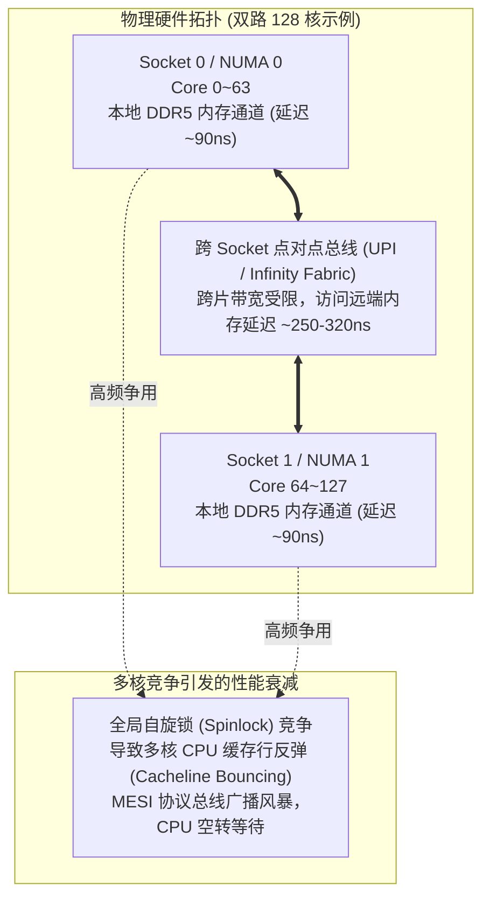

# 1.1 硬件矛盾：NUMA 拓扑开销与 Linux 内核演进

现代存储服务器（如 Lustre OSS 或 MDS）通常配备双路或四路 CPU 插槽（如 AMD EPYC 或 Intel Xeon），整机集成 128 至 256 个物理计算核心，并细分为多个 NUMA（Non-Uniform Memory Access）节点。此外，系统还挂接了多块 200Gb/s 或 400Gb/s 的 InfiniBand / RoCE 网络适配器以及数十块 NVMe 固态硬盘。

在多核高并发硬件架构下，存储系统面临两类核心矛盾：

## 1. 跨 NUMA 远端访存与自旋锁争用
在多核心并发处理网络报文接收与页面缓存分配时，若采用全局单线程队列或单实例全局锁，不同 Socket 上的核心将频繁发起跨片总线访问。跨片内存访问延迟是本地访问的 2.5 至 3.5 倍。更为严重的是，当大量物理核心同时争用同一把全局自旋锁时，CPU 缓存一致性协议（MESI/MOESI）会产生大量的缓存行失效与回写风暴（Cacheline Bouncing），导致处理器流水线长期停顿，系统吞吐量急剧下降。

## 2. Linux 内核无稳定 KABI
Linux 内核内部未维护稳定的二进制接口（KABI）。Lustre 既要在长期服役的企业级发行版（如 CentOS 7.9，基于 Linux 3.10 内核）上保持稳定运行，又需支持高版本发行版（如 RHEL 9 / Ubuntu 22.04+，基于 Linux 5.14 及 6.x 内核）以发挥现代硬件特性。从内存回收收缩器（`shrinker`）、等待队列（`wait_queue`）到虚拟文件系统接口（`inode_operations` / `file_operations`），内核 API 历经多次重构与函数签名调整。

为了解决多核扩展瓶颈并屏蔽内核差异，Lustre 在最底层构建了 **`libcfs`（Lustre Cluster File System Base Library）**。该子系统为上层网络（LNet）与分布式对象存储栈提供了 CPU 分区调度、零锁内存日志、故障注入框架及跨平台兼容抽象。

---

