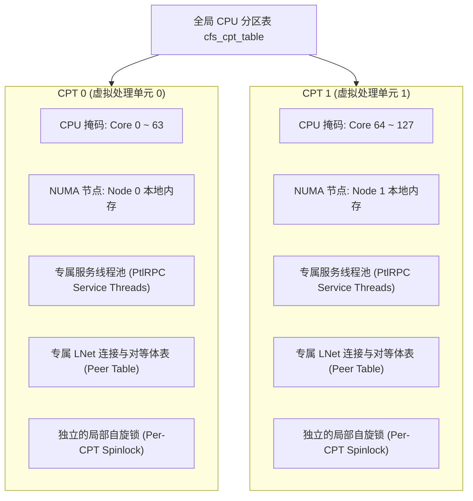
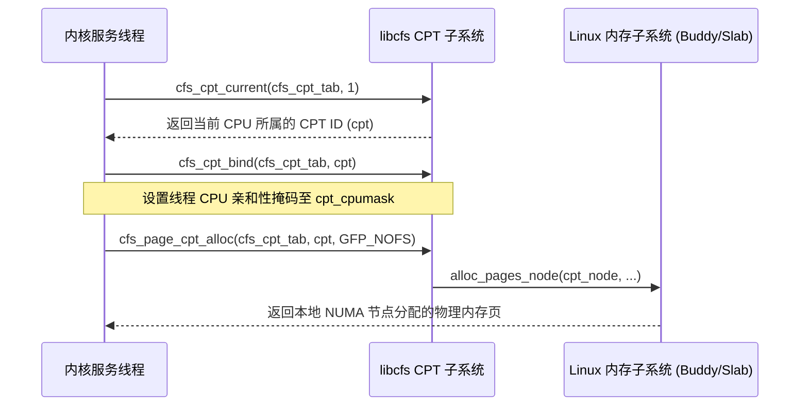

# 1.2 CPT（CPU Partition Table）虚拟处理单元架构

针对多核争用与 NUMA 跨节点访存开销，Lustre 引入了 **CPT（CPU Partition Table，CPU 分区表）** 机制。

## 1.2.1 架构设计

`libcfs` 将整机的物理计算核心与物理 NUMA 内存节点统一划分为若干个独立的虚拟处理单元（CPU Partition，简称 CPT）。



所有上层关键服务与数据结构均以 CPT 为边界进行实例划分：
- **线程亲和性绑定**：服务处理线程绑定在所属 CPT 的 CPU 核心掩码内，避免线程在跨 Socket 核心间无序迁移。
- **内存局部性约束**：每个 CPT 优先从其绑定的本地 NUMA 节点分配对象内存与 DMA 缓冲区。
- **细粒度分段锁**：原本由全机共享的全局锁被拆解为 Per-CPT 局部锁。每个 CPT 仅管理本分区内的并发状态，消除了跨 Socket 的锁争用。

## 1.2.2 核心数据结构

CPT 的实现主要集中在 `libcfs/libcfs/libcfs_cpu.c` 与 `libcfs/include/libcfs/libcfs_cpu.h` 中。

### 1. 单个分区结构体：`cfs_cpu_partition`
每个 CPT 分区由 `struct cfs_cpu_partition` 表示：

```c
struct cfs_cpu_partition {
    /* 本分区包含的物理 CPU 核心位图 */
    cpumask_var_t       cpt_cpumask;
    /* 本分区绑定的 NUMA 内存节点位图指针 */
    nodemask_t         *cpt_nodemask;
    /* 到其他各个 CPT 分区的 NUMA 拓扑距离数组 */
    unsigned int       *cpt_distance;
    /* NUMA 轮询分配游标，用于在绑定的多个节点间均衡负载 */
    unsigned int        cpt_spread_rotor;
    /* 若 cpt_nodemask 仅包含单个节点，直接记录其节点 ID */
    int                 cpt_node;
};
```

### 2. 全局分区表结构体：`cfs_cpt_table`
全局的 CPT 管理实例通过 `struct cfs_cpt_table` 维护：

```c
struct cfs_cpt_table {
    /* 分区表层级的轮询游标 */
    unsigned int                ctb_spread_rotor;
    /* 系统各 NUMA 节点间的综合距离矩阵基准 */
    unsigned int                ctb_distance;
    /* 当前配置的 CPT 分区总数量 */
    int                         ctb_nparts;
    /* 指向各个分区实体的数组，长度为 ctb_nparts */
    struct cfs_cpu_partition   *ctb_parts;
    /* 物理 CPU 编号到 CPT ID 的全局直接映射表 */
    int                        *ctb_cpu2cpt;
    /* 物理 NUMA 节点编号到 CPT ID 的全局直接映射表 */
    int                        *ctb_node2cpt;
    /* 系统中全部可用物理 CPU 核心的集合位图 */
    cpumask_var_t               ctb_cpumask;
    /* 系统中全部可用物理 NUMA 内存节点的集合位图 */
    nodemask_t                 *ctb_nodemask;
};
```

## 1.2.3 核心 API 与控制流

在内核运行时，`libcfs` 向外暴露了一组标准的 CPT 调度接口：



1. **获取当前 CPT 分区号**：
   ```c
   int cpt = cfs_cpt_current(cfs_cpt_tab, 1);
   ```
   该调用根据当前执行上下文的 CPU 核心号，快速通过 `ctb_cpu2cpt[smp_processor_id()]` 索引定位所属分区。

2. **Per-CPT 数据结构申请**：
   ```c
   void *cfs_percpt_alloc(struct cfs_cpt_table *cptab, unsigned int size);
   ```
   为系统中的每一个 CPT 分别申请一份独立的内存对象副本（返回指针数组），确保各 CPT 在读写各自数据结构时不产生跨核伪共享（False Sharing）。

3. **亲和性物理页分配**：
   ```c
   struct page *cfs_page_cpt_alloc(struct cfs_cpt_table *cptab, int cpt, gfp_t flags);
   ```
   底层通过 Linux 内核的 `alloc_pages_node()` 强制从该 CPT 绑定的本地 NUMA 节点上获取内存页，避免发生跨总线远端内存分配。

## 1.2.4 分区划分策略与配置语法

CPT 支持三种划分策略，可通过内核模块参数 `cpu_npartitions` 与 `cpu_pattern` 进行配置：

1. **NUMA 拓扑自动匹配模式**（默认）：  
   当未指定特殊参数时，`libcfs` 检测硬件 NUMA 节点数。若检测到 $N$ 个物理 NUMA 节点，则自动建立 $N$ 个 CPT 分区，各个分区与 NUMA 节点形成 1:1 映射。

2. **核心数均分模式（SMP 模式）**：  
   通过指定 `cpu_npartitions=<N>`，系统将所有在线 CPU 核心平均切分为 $N$ 组。当节点未启用 NUMA 或单个 NUMA 内核心数过大时，可用于细化分区粒度。

3. **微拓扑字符串模式（`cpu_pattern`）**：  
   支持使用语法字符串显式绑定。语法支持两种前缀格式：
   - 基于物理 CPU 编号：`"0[0-31], 1[32-63]"` 表示创建 2 个 CPT，CPT 0 包含 CPU 0~31，CPT 1 包含 CPU 32~63。
   - 基于 NUMA 节点编号（前缀 `N`）：`"N 0[0-3], 1[4-7]"` 表示创建 2 个 CPT，分别挂接 NUMA 0 与 NUMA 1，并指定核心子集。

---

