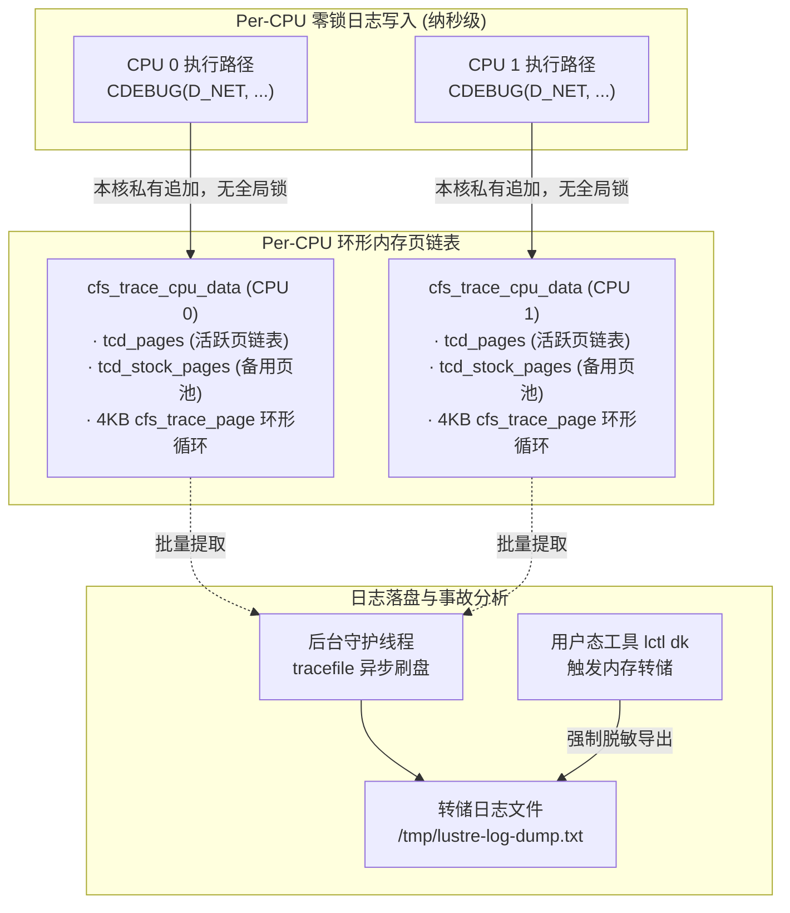

# 1.3 零锁环形内存跟踪日志（Tracefile）

在内核级分布式存储系统中，调试与故障现场捕获需要极高的时效性。传统内核打印机制 `printk()` 依赖全局控制台自旋锁，且可能触发同步终端 I/O。如果在每秒处理数万次网络请求的高并发路径中直接调用 `printk()`，会导致严重的锁竞争和线程阻塞，不仅吞吐量骤降，还会改变原有的并发时序，掩盖偶发性竞态故障（Heisenbug）。

`libcfs` 设计了专用的内存跟踪日志引擎 **Tracefile**（`libcfs/libcfs/tracefile.c`）。



## 1.3.1 Per-CPU 环形缓冲架构

Tracefile 的核心设计原则在于：**内存驻留、Per-CPU 独立缓冲与零全局锁写入**。

1. **核心数据结构**：
   - `struct cfs_trace_page`：表示单个 4KB 物理日志页面，内嵌已写入偏移量、数据长度与双向链表节点。
   - `struct cfs_trace_cpu_data`：每个 CPU 拥有专属的控制块，管理当前核心的页面集合：
     - `tcd_pages`：当前已记录日志的页面双向循环链表。
     - `tcd_stock_pages`：预先分配的空闲可用页链表，避免在记录日志时调用底层分配器引发死锁。
     - `tcd_cur_pages` 与 `tcd_max_pages`：记录当前使用的页数与设定的配额上限。

2. **零锁写入机制**：  
   当某一 CPU 核心执行 `CDEBUG()` 或 `CERROR()` 时，首先禁用本地中断，获取本核心私有的 `cfs_trace_cpu_data`。写入操作直接追加至当前活跃的 `cfs_trace_page`。整个过程不涉及任何跨核心锁或跨 Socket 内存同步，写入单条日志仅需数十纳秒。

3. **内存循环覆写**：  
   日志页面在内存中形成环形缓冲。当 `tcd_cur_pages` 达到配置上限（通过 `/proc/sys/lnet/debug_mb` 控制）时，系统自动回收最早的页面并重新初始化写入。在系统正常运行时，Tracefile 完全在内存中循环滚动，不产生物理磁盘 I/O。

## 1.3.2 二维掩码过滤体系

Tracefile 通过两组 32 位位掩码在运行时动态过滤日志生成：

```c
/* 1. 子系统位图 (Subsystem Mask) - 标识模块 */
#define S_LNET      (1 <&lt; 1)   /* LNet 网络通信层 */
#define S_RPC       (1 <&lt; 2)   /* Portal RPC 框架 */
#define S_MDC       (1 <&lt; 6)   /* 元数据客户端 */
#define S_OSC       (1 <&lt; 8)   /* 对象存储客户端 */
#define S_LLITE     (1 <&lt; 10)  /* VFS 与挂载层接口 */

/* 2. 调试级别掩码 (Debug Mask) - 标识严重程度与类别 */
#define D_TRACE     (1 <&lt; 0)   /* 函数进出追踪 (高频，生产禁用) */
#define D_INODE     (1 <&lt; 1)   /* Inode 元数据操作 */
#define D_NET       (1 <&lt; 3)   /* 网络连接与数据包传输 */
#define D_HA        (1 <&lt; 6)   /* 高可用与节点状态迁移 */
#define D_ERROR     (1 <&lt; 17)  /* 严重错误状态 */
```

过滤决策在宏展开第一阶段执行：
```c
if ((libcfs_subsystem_debug & S_xxx) && (libcfs_debug & D_xxx)) {
    libcfs_debug_vmsg2(...);
}
```
若掩码未匹配，代码仅执行两次位运算和一次分支判断即可返回，保证未开启级别时的最低指令开销。

## 1.3.3 现场转储与断言机制

当内核遭遇致命异常或触发断言宏 `LASSERT()` 时：
1. 内核调用 `libcfs_debug_dumplog()`，立即停止所有 CPU 的环形覆写机制，锁定现场日志。
2. 触发控制台简要报警，并由用户态守护进程或管理员通过命令导出完整日志：
   ```bash
   lctl dk /var/log/lustre-crash.dump
   ```
3. 导出的日志中精确包含了故障发生前数秒内各 CPU 核心上执行的函数调用链、行号、进程 PID 及 RPC 报文序列，便于定位时序竞态问题。

---

