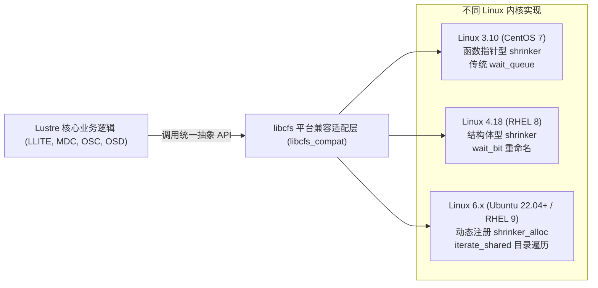

# 1.5 跨内核平台兼容层设计

为避免在分布式业务逻辑中充斥散落的条件编译宏（`#if LINUX_VERSION_CODE >= KERNEL_VERSION(...)`），`libcfs` 将所有的内核接口差异封装在底层兼容目录中（如 `libcfs/include/libcfs/linux/`）。

下表列出几个具有代表性的内核重构痛点及 `libcfs` 的抹平方案：

## 1. 内存回收收缩器（Memory Shrinker）
- **内核变更**：Linux 3.10 中使用函数指针签名；4.x 中引入 `struct shrinker` 并要求静态内嵌；Linux 6.7 之后废弃了静态声明，强制要求使用 `shrinker_alloc()` 动态分配并注册。
- **libcfs 兼容抽象**：封装统一的 `cfs_shrinker_create()` 与 `cfs_shrinker_destroy()` 接口，在底层适配不同内核版本的生命周期管理。

## 2. 等待队列与位等待（Wait Bit）
- **内核变更**：内核在不同版本中频繁变更 `wait_queue_t` 的类型名称（更名为 `wait_queue_entry_t`），重写了 `wake_up_bit` 的传参形式。
- **libcfs 兼容抽象**：在 `libcfs/linux/linux-fs.h` 中提供统一的 `cfs_wait_event()` 与 `cfs_wake_up_bit()` 宏，隔离底层结构体成员命名的变动。

## 3. VFS 目录遍历接口
- **内核变更**：`file_operations` 中的 `readdir` 先后被迁移为 `iterate`，后又在多核心高并发优化中演进为 `iterate_shared`。
- **libcfs 兼容抽象**：在客户端层对外暴露稳定的统一上下文，底层根据内核宏自动切换读写锁类型与函数调用约定。

---

