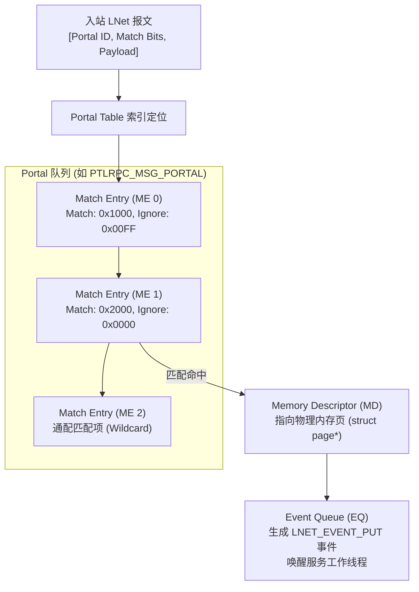

# 2.3 Portals 3.3 核心机制：ME、MD 与 EQ

LNet 继承并实现了 Portals 3.3 的内存匹配模型，用于在无连接、异步的分布式环境下实现接收缓冲区的高效解复用。

## 1. 匹配条目（Match Entry, ME）
在接收端，每个特定的业务服务（Portal）维护一个 ME 链表。每个 ME 包含匹配位（`match_bits`）与忽略掩码（`ignore_bits`）。入站报文根据算法执行比对：

$$(\text{Incoming Bits} \oplus \text{ME.match\_bits}) \ \& \ (\sim \text{ME.ignore\_bits}) == 0$$

只有当计算结果为 0 时，报文才与该 ME 匹配成功。通过配置 `ignore_bits`，LNet 支持范围匹配、会话 ID 匹配以及全通配匹配。

## 2. 内存描述符（Memory Descriptor, MD）
MD 描述一段具体的物理内存或页表向量（Scatter-Gather 链表）。当报文命中 ME 后，网卡硬件将有效载荷直接 DMA 写入该 MD 指向的物理地址，完全跳过协议栈中间拷贝。

## 3. 事件队列（Event Queue, EQ）
EQ 是环形无锁事件队列。当数据写入完成或发送操作被确认时，底层 LND 硬件中断触发 LNet 向 EQ 写入事件（如 `LNET_EVENT_PUT`、`LNET_EVENT_GET` 或 `LNET_EVENT_SEND`），唤醒处于等待状态的 PtlRPC 处理线程。

---

