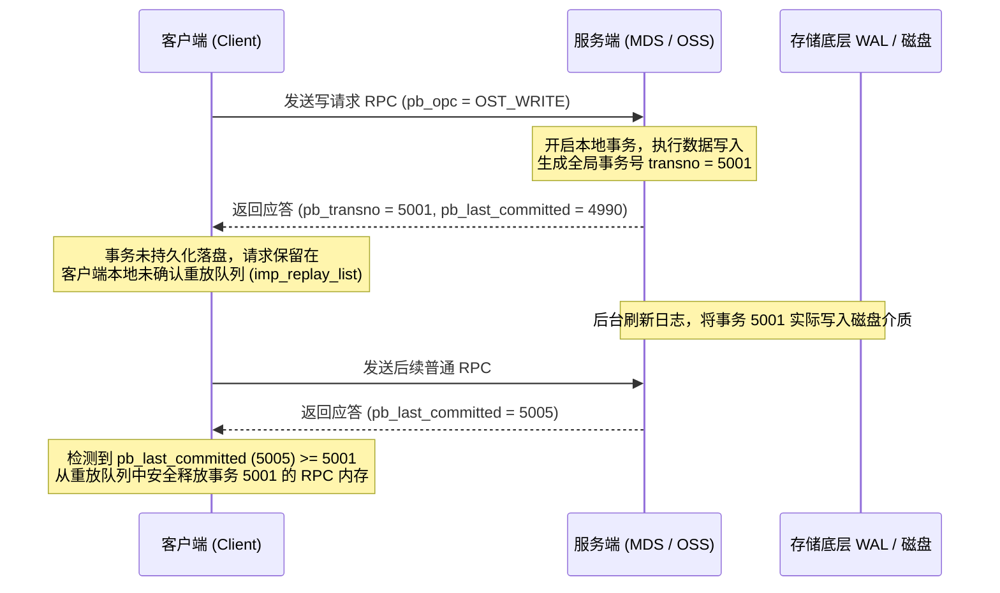

# 3.3 分布式调度中枢：struct ptlrpc_body_v3

在所有通过 `struct lustre_msg_v2` 封装的 RPC 报文中，**第 0 号子缓冲区（`MSG_PTLRPC_BODY_OFF = 0`）固定为 `struct ptlrpc_body_v3`**。该结构体承载了请求的事务号、会话句柄、自适应超时状态以及分布式锁参数。

```c
struct ptlrpc_body_v3 {
    struct lustre_handle pb_handle;         /* 客户端与服务端绑定的全局会话句柄 */
    __u32                pb_type;           /* 报文类型：PTL_RPC_MSG_REQUEST / REPLY / ERR */
    __u32                pb_version;        /* 协议版本号 */
    __u32                pb_opc;            /* 顶级业务操作码 (如 OST_WRITE, MDS_REINT) */
    __u32                pb_status;         /* 返回错误码 (标准 Linux errno 负值，如 -ENOENT) */
    __u64                pb_last_xid;       /* 客户端确认已接收到的最高连续事务 XID */
    __u16                pb_tag;            /* 批量/并发操作的虚拟槽位标识 */
    __u16                pb_padding0;       /* 填充字段 */
    __u32                pb_projid;         /* 项目配额/TBF 流量控制标识 */
    __u64                pb_last_committed; /* 服务端已落盘持久化的最高全局事务号 */
    __u64                pb_transno;        /* 服务端为修改型操作分配的单调递增事务号 */
    __u32                pb_flags;          /* 状态控制标记 (MSG_RESENT, MSG_REPLAY 等) */
    __u32                pb_op_flags;       /* 握手协商功能标记 */
    __u32                pb_conn_cnt;       /* 客户端在服务端的连接代数计数器 */
    __u32                pb_timeout;        /* 请求超时限制或服务端估算的处理耗时 */
    __u32                pb_service_time;   /* 服务端处理该 RPC 的实际执行耗时 (秒) */
    __u32                pb_limit;          /* LDLM 分布式锁客户端 LRU 缓存上限 */
    __u64                pb_slv;            /* LDLM 服务端锁体积 (Server Lock Volume) */
    __u64                pb_pre_versions[PTLRPC_NUM_VERSIONS]; /* VBR: 修改前对象的版本号 */
    __u64                pb_mbits;          /* RDMA Bulk 传输匹配位 */
    __u64                pb_padding64_0;    /* 保留填充位 */
    __u64                pb_padding64_1;    /* 保留填充位 */
    __u32                pb_uid;            /* 发起进程的用户 UID */
    __u32                pb_gid;            /* 发起进程的组 GID */
    char                 pb_jobid[LUSTRE_JOBID_SIZE]; /* 超算调度作业标识 (Job ID) */
};
```

## 3.3.1 事务一致性契约：`pb_transno` 与 `pb_last_committed`

Lustre 依赖事务号机制实现服务端崩溃后的请求重放（Transaction Replay）：



1. **事务分配**：当服务端处理一个修改型请求（如文件创建、写入或属性修改）时，底层文件系统将其封装为本地事务，并分配一个全局严格递增的 64 位事务号 `pb_transno`。
2. **应答缓存**：服务端在应答报文中回传该 `pb_transno` 以及当前已经落盘的最高事务号 `pb_last_committed`。客户端收到回复后，不会立即销毁请求上下文，而是将其放入 `imp_replay_list` 链表中暂存。
3. **安全释放**：仅当服务端后续回复中通告的 `pb_last_committed >= pb_transno` 时，证明该修改已安全持久化到物理介质，客户端才将该请求从重放链表中释放。若服务端在中途崩溃重启，客户端会重新发送未提交的 RPC 进行状态重建。

## 3.3.2 基于版本的恢复（VBR, Version-Based Recovery）

在节点恢复阶段，客户端重放事务时需验证操作的前提条件是否依然成立。`pb_pre_versions` 记录了修改前目标对象的前置版本号。在重放执行时，服务端对比磁盘上现存对象的版本号与请求中的 pre-version：
- 若版本号一致，说明尽管存在崩溃恢复重放，但该对象在此期间未被其他并发操作修改，事务可以安全执行；
- 若版本号不一致，说明发生了数据竞态冲突，服务端返回错误以避免破坏元数据一致性。

---

