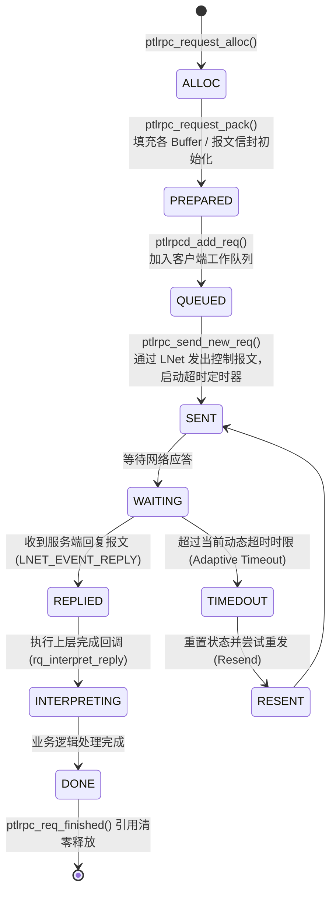

# 4.3 客户端请求状态机：七阶段生命周期

单个 RPC 请求从创建到释放，严格遵循客户端状态机演进：

- **重试状态（`rq_resend`）**：若服务端返回 `-EBUSY`（服务队列过载）或发生网络瞬态抖动，状态机将请求重置为 `RESENT`，重新进入就绪队列。此时请求保留原本的事务编号（XID），服务端据此识别是否为重复请求。
- **重放状态（`rq_replay`）**：在服务端发生崩溃并重启时，客户端进入容错恢复流程，将处于历史已提交但尚未永久快照的已提交修改类 RPC（如 `CREATE`、`SETATTR`）重新灌入发送队列。

---

