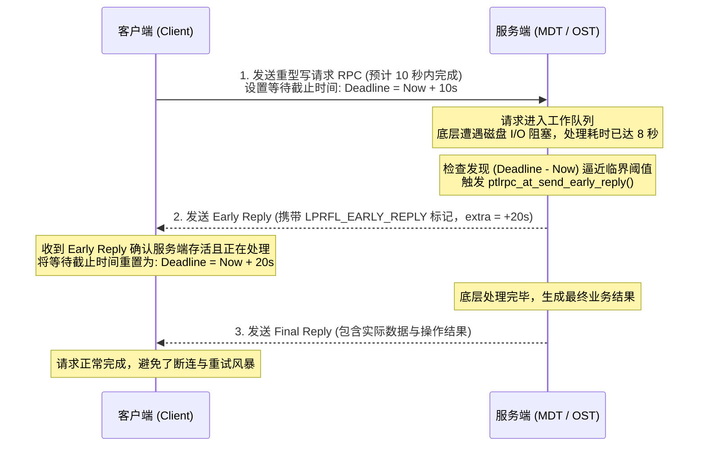

# 5.2 延时补偿机制：Early Reply（提前应答）

在实际存储生产环境中，某些操作可能出现长尾延迟（例如元数据 Journal 同步刷盘、底层 RAID 校验重构或大块脏页回写），处理耗时可能偶发性超过历史预测均值。

为防止客户端因请求耗时接近设定的 Deadline 而误判服务端宕机断开连接，Lustre 设计了 **Early Reply（提前应答）** 机制：



## 核心实现逻辑

在 `lustre/ptlrpc/service.c` 中，服务端在处理耗时较长的请求时执行如下检查：

```c
static int ptlrpc_at_send_early_reply(struct ptlrpc_request *req)
{
    /* 计算当前时刻距离客户端 Deadline 的剩余时间 */
    timeout_t olddl = req->rq_deadline - ktime_get_real_seconds();
    
    /* 若已经超过 Deadline，说明网络或逻辑严重超时，不再发送 Early Reply */
    if (olddl &lt; 0)
        return -ETIMEDOUT;

    /* 构建轻量级应答报文，标记为早期回复，并附加额外的预估等待时间 */
    req->rq_early_reply = 1;
    return ptlrpc_send_reply(req, PTLRPC_REPLY_EARLY);
}
```

客户端收到带有早期回复标志的报文后，确认服务端处于存活状态并正在执行操作，随后延长该请求在本地的超时等待截止时间，消除了慢 I/O 场景下的误判断开。

---

