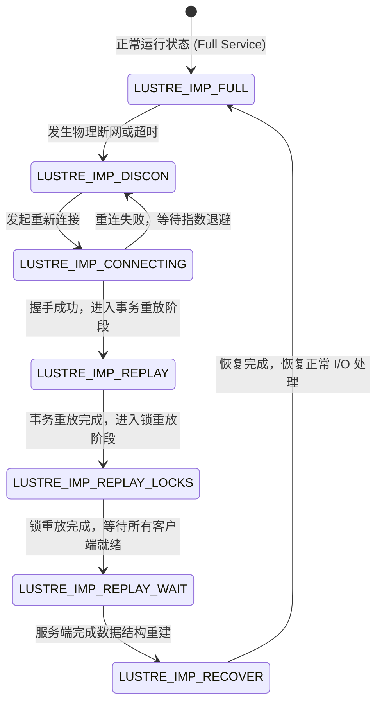

# 5.3 分布式故障恢复与 Import 状态机

Lustre 客户端与服务端之间的逻辑会话由 `struct obd_import`（客户端侧）与 `struct obd_export`（服务端侧）对应管理。当底层物理链路中断或服务端重启时，客户端的 Import 实例进入恢复状态机（`enum lustre_imp_state`）。

## 关键状态流转解析

1. **`LUSTRE_IMP_DISCON`**：连接断开状态。当发送 RPC 连续超时或底层网卡抛出断开事件时进入该状态，所有待发送的新请求被暂存在本地待发队列中。
2. **`LUSTRE_IMP_CONNECTING`**：重连状态。客户端定期向服务端各可用 NID 发起连接协商请求，重新交换通信协议参数。
3. **`LUSTRE_IMP_REPLAY`**：事务重放阶段。服务端在重启后开启一个限时的“恢复窗口”（Recovery Window），客户端在此阶段将尚未持久化落盘的修改型操作重新推送到服务端。
4. **`LUSTRE_IMP_REPLAY_LOCKS`**：锁重放阶段。客户端将其持有的分布式锁状态上报给服务端，由服务端重新建立锁拓扑。
5. **`LUSTRE_IMP_REPLAY_WAIT`**：等待窗口阶段。服务端等待集群中绝大多数活跃客户端完成重放，或等待超时倒计时结束。
6. **`LUSTRE_IMP_RECOVER`**：最终清理阶段。服务端完成孤儿对象清理并激活正常请求调度，Import 状态随后迁回 `LUSTRE_IMP_FULL`。

---

