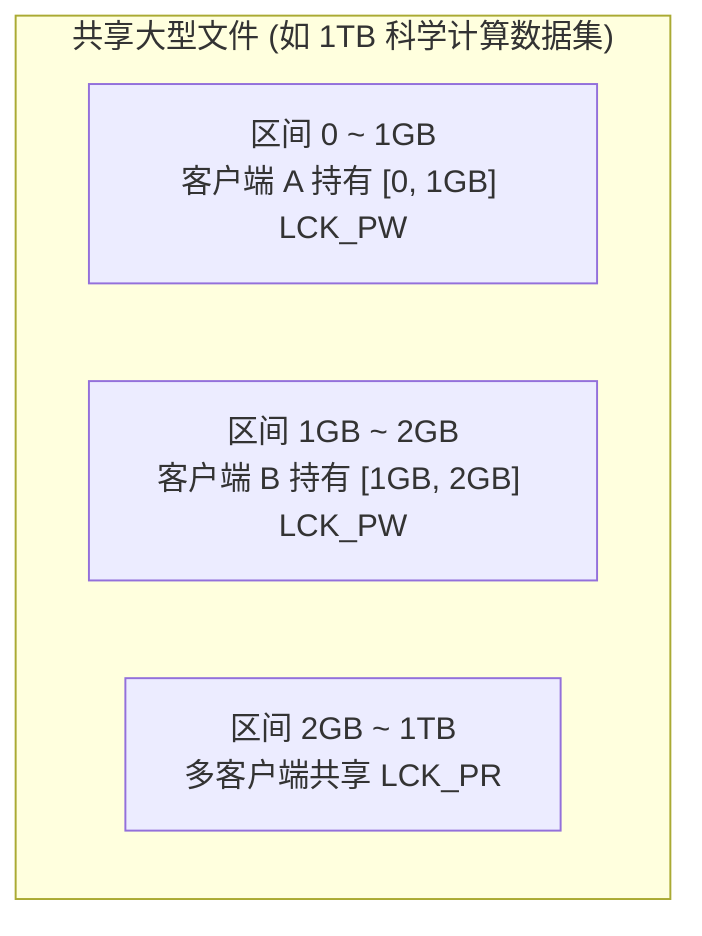

# 6.2 锁特化形态：针对不同存储实体的定制化隔离

为避免对所有文件系统实体采用统一粒度的粗暴加锁，LDLM 支持四种特化的锁类型（`enum ldlm_type`）：

```c
enum ldlm_type {
    LDLM_PLAIN  = 10,   /* 扁平锁：全对象互斥 */
    LDLM_EXTENT = 11,   /* 范围锁：面向文件字节区间的细粒度锁 */
    LDLM_FLOCK  = 12,   /* POSIX 文件锁：对应应用态 fcntl / flock */
    LDLM_IBITS  = 13,   /* 字段位锁：面向元数据属性维度的细粒度锁 */
};
```

## 6.2.1 范围锁（Extent Lock）：文件字节区间的并发隔离

在 OST 数据对象上，LDLM 采用范围锁（`LDLM_EXTENT`）。每个锁定义了一个闭合字节区间 $[start, end]$（最大支持至 `OBD_OBJECT_EOF = ~0ULL`）。



- **区间树（Interval Tree）算法**：服务端通过区间树结构组织锁范围，能够以 $O(\log N)$ 的时间复杂度快速判断新申请区间是否与现有已授予锁发生重叠。
- **并发写入无阻塞**：多个计算节点（如 MPI 并行写入任务）可以同时持有同一文件不同字节区间的写锁（`LCK_PW`），各自在本地执行 Page Cache 缓冲与后台异步刷盘，互不发生锁冲突。

## 6.2.2 字段位锁（Inode Bits Lock）：元数据维度的属性解耦

在元数据服务器（MDS）上，传统单机锁通常对整个 Inode 加锁。但元数据包含多种正交属性（如文件名目录项、大小时间戳、扩展属性、布局描述符等）。为此，LDLM 引入了字段位锁（`LDLM_IBITS`）：

```c
#define MDS_INODELOCK_LOOKUP   (1 <&lt; 0)  /* 目录项名称与路径映射缓存 */
#define MDS_INODELOCK_UPDATE   (1 <&lt; 1)  /* 文件大小、修改时间 (mtime) 与链接数 */
#define MDS_INODELOCK_OPEN     (1 <&lt; 2)  /* 文件打开状态与句柄引用 */
#define MDS_INODELOCK_LAYOUT   (1 <&lt; 3)  /* 文件数据条带布局 (Striping Layout) */
#define MDS_INODELOCK_PERM     (1 <&lt; 4)  /* 访问权限与属主 (UID/GID/ACL) */
#define MDS_INODELOCK_XATTR    (1 <&lt; 5)  /* 扩展属性 (Extended Attributes) */
```

- **锁粒度解耦**：当客户端修改文件扩展属性时，仅需申请针对 `MDS_INODELOCK_XATTR` 位的排他锁。其他正在并发读取该文件数据条带布局（持有 `MDS_INODELOCK_LAYOUT` 锁）或查询路径（持有 `MDS_INODELOCK_LOOKUP` 锁）的客户端完全不受影响，消除了无关元数据属性变更引发的锁失效风暴。

---

