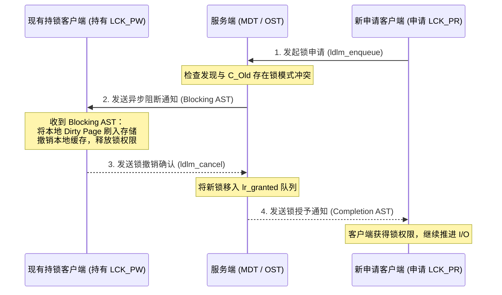

# 6.3 三大异步 AST 回调机制

在分布式无中心或弱中心环境下，状态变更需要主动通知各参与方。LDLM 通过三组异步系统陷阱（AST, Asynchronous System Traps）机制驱动分布式锁状态协同。

## 1. 阻断通知（Blocking AST）
当新客户端申请的锁与已授予的现有锁发生冲突时，服务端并不直接粗暴剥夺旧锁，而是向现有持锁方发送 Blocking AST。
- 持锁客户端接收到通知后，执行缓存同步（如将本地未回写的脏页 Flush 到 OST，或废弃过期的 Inode 缓存）；
- 缓存同步完成后，持锁客户端向服务端发送 `ldlm_cancel` 释放或降级锁模式，让出并发通道。

## 2. 完成通知（Completion AST）
当新锁由于资源冲突暂时无法获得授权被放入 `lr_waiting` 等待队列后，一旦冲突方释放锁资源，服务端通过 Completion AST 异步通知等待客户端，驱动其由等待状态迁移至生效执行状态。

## 3. 探测通知（Glimpse AST）
在常规文件读取或属性获取（如 `ls -l`、`stat`）时，客户端需要获取文件当前最新的精确大小（`st_size`）与修改时间。然而，当前拥有写权限的客户端可能在本地 Page Cache 中写入了新数据，尚未触发回写刷盘。
- 若采用传统逻辑，必须向持写锁方发送 Blocking AST 强行收回写锁并刷新全部脏页，开销巨大；
- **Glimpse 机制**：服务端向持写锁方发送轻量的 Glimpse AST 探测消息。持锁客户端就地读取本地尚未刷盘的最新偏移量与时间戳回传，**写锁保留不被撤销**，兼顾了属性精准性与写缓存性能。

---

