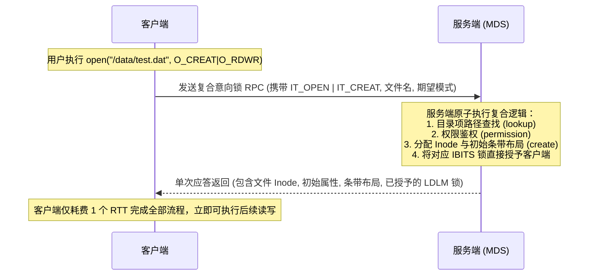

# 6.4 意向锁（Intent Lock）：1-RTT 复合元数据操作

在传统 POSIX 文件系统中，打开或创建一个文件涉及多个步骤的交互：
1. 路径解析与元数据查找（`lookup`）并获取目录锁；
2. 权限校验与属主检查（`permission`）；
3. 文件创建或打开操作（`create` / `open`）；
4. 获取针对该文件的操作锁。

若上述每一步骤均对应一次独立的 RPC 往返，单次文件访问需经历 4 至 5 个 RTT 网络延迟。

Lustre 首创了 **意向锁（Intent Lock）** 机制：

客户端在申请锁的同时，通过在 `ldlm_enqueue` 请求中嵌入意向数据块（Intent Data，如 `IT_OPEN`、`IT_CREAT`、`IT_GETATTR`），通告服务端自身后续的操作目的。服务端在锁仲裁路径中一次性完成文件创建、权限校验、句柄打开并返回所需的数据属性，**将元数据操作的网络往返时延压缩至 1 个 RTT**。

---

