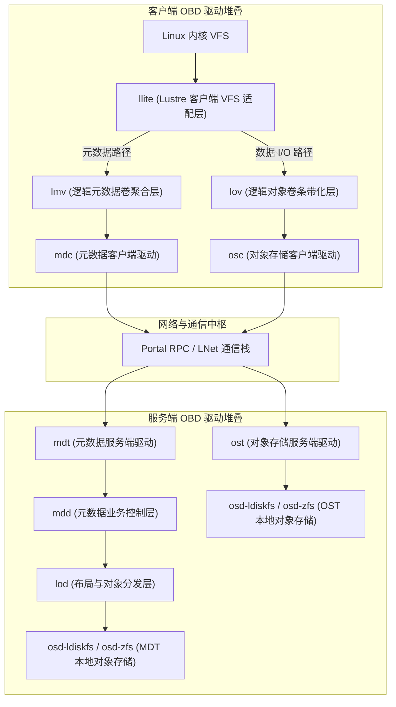

# 7.1 分层架构设计：从块抽象到虚拟对象栈

在传统的存储体系中，通用块存储（如 iSCSI 或 Ceph RBD）向操作系统暴露的是平坦的逻辑块地址空间（LBA）。文件系统的元数据结构（如 Superblock、Inode 表、位图及目录项）全部需要在客户端本地进行解析与修改。当多个计算客户端需要并发挂载同一存储卷时，必须引入复杂的分布式单机文件系统（如 GFS2、OCFS2），并在客户端之间频繁同步块级缓存与锁，导致元数据处理扩展性受限。

Lustre 采纳了对象存储设备（OBD, Object-Based Device）模型：
- **存储端面向对象建模**：底层存储目标不再暴露裸扇区，而是对外暴露具备独立属性和变长数据流的“存储对象”。
- **职责解耦**：磁盘空间分配、块位图管理及 Extent 映射完全下沉至 MDS 与 OSS 本地的本地存储驱动（如 `osd-ldiskfs` 或 `osd-zfs`）自行处理；客户端仅需发起逻辑对象层级的读取、写入与属性修改请求。

整个文件系统各层功能组件（包括网络客户端、本地驱动与聚合分发器）均统一抽象为标准化的 OBD 设备，在内核中通过统一接口自底向上分层装配。

*图 7-1: 客户端 llite 与 mgc 子系统通过通用的 obdclass 接口及 OBP 宏进行解耦调用（来源：Understanding Lustre Internals）*

*图 7-2: mgc 与 llite 子系统交互中的关键内存数据结构（ll_sb_info、obd_device、obd_export）（来源：Understanding Lustre Internals）*

---

