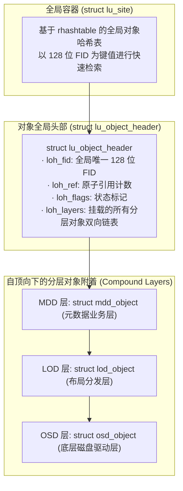

# 8.2 复合对象模型（Compound Object）与核心结构

在 Linux 内核 C 语言环境中，系统采用“统一头部、多层附着”的复合对象模型实现面向对象的继承与多态：



## 8.2.1 核心数据结构拆解

1. **`struct lu_object_header`（对象统一头部）**：  
   每个逻辑存储实体在内存中拥有唯一的头部，保存该对象的 128 位全局标识符 FID（`loh_fid`）、全局引用计数（`loh_ref`）以及连接各层实现的链表头（`loh_layers`）。

2. **`struct lu_object`（分层对象基类）**：  
   每一层驱动（如 MDD、LOD、OSD）通过内嵌 `struct lu_object` 实现逻辑扩展：
   ```c
   struct lu_object {
       struct lu_object_header *lo_header; /* 反向指针，指向所属的统一头部 */
       struct lu_device        *lo_dev;    /* 指向负责本层逻辑的 lu_device */
       struct lu_object_ops    *lo_ops;    /* 本层生命周期与对象操作函数表 */
       struct list_head         lo_linkage;/* 链接进 loh_layers 的链表节点 */
   };
   ```

3. **`struct lu_site`（站点容器）**：  
   每个独立文件系统或服务维护一个 `lu_site`，内部采用无锁或分段锁哈希表（`rhashtable`）管理所有在线对象的头部实例，并负责 LRU 内存淘汰。

---

