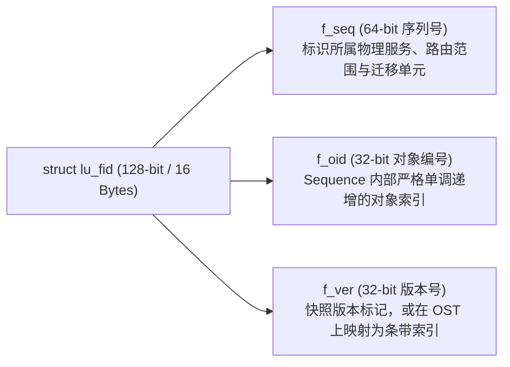

# 9.1 分布式环境下的标识需求与 128 位 FID

在单机 Linux 系统中，操作系统依靠 32 位或 64 位的 inode 编号定位磁盘上的文件实体。但在跨越数十个元数据节点（MDS）、数百个对象存储节点（OSS）与上百亿文件的分布式集群中，单机 inode 抽象面临三项本质局限：
1. **全局编号碰撞**：不同 MDT 或 OST 本地文件系统独立分配 inode，极易产生相同的数字编号，导致客户端无法通过单一数值唯一区分文件。
2. **缺乏网络路由信息**：纯数字 inode 不包含该对象位于哪台物理节点的归属信息，客户端每次查找都必须从根目录依次递归解析路径，产生大量网络往返开销。
3. **条带化关联割裂**：单个文件的元数据位于 MDT，而其对应的数据切片分布在多个独立的 OST 上。单机 inode 无法在这些跨节点的数据分片与母体元数据之间建立确定性的对应关系。

为此，Lustre 构建了 **128 位全局文件标识符（FID, File Identifier）** 体系。



## `struct lu_fid` 内存结构

在 `include/uapi/linux/lustre/lustre_user.h` 中，FID 的定义如下：

```c
struct lu_fid {
    __u64   f_seq;      /* 64 位序列号 (Sequence)：标识物理归属与路由区间 */
    __u32   f_oid;      /* 32 位对象编号 (Object ID)：序列内部自增索引 */
    __u32   f_ver;      /* 32 位版本号 (Version)：用于快照或条带编号映射 */
} __attribute__((packed));
```

每个 FID 占用 16 字节物理内存，是贯穿客户端 VFS、Portal RPC 报文头、服务端对象栈及底层磁盘索引的全局唯一凭证。

---

