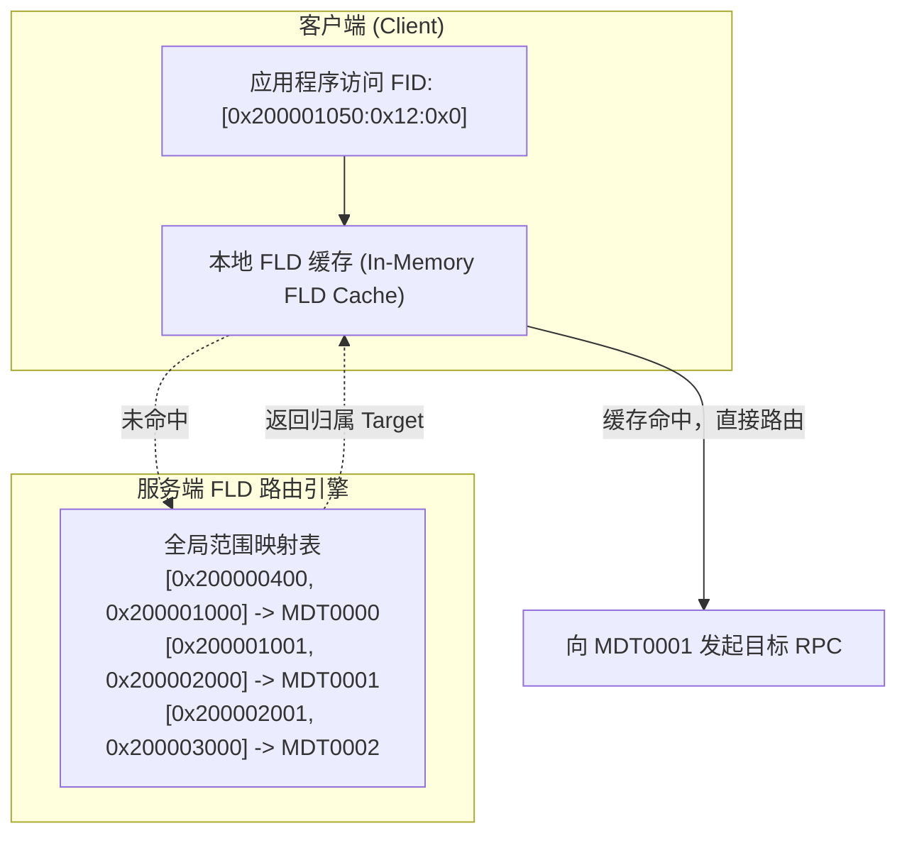

# 9.5 分布式命名空间路由：FLD（FID Location Database）

在多元数据服务器（DNE）架构下，集群并存着多个 MDT。当客户端仅持有某个文件的 FID 时，必须能够迅速确定该文件实际驻留在哪个具体的 MDT 上。

这一路由映射由 **FLD（FID Location Database，FID 位置数据库）** 承载。

- **范围聚合存储**：FLD 并不记录每个独立文件的映射关系，而是以 Sequence 区间为单位进行聚合记录（`[seq_start, seq_end] -> target_index`）。
- **客户端内存缓存**：客户端本地缓存已查询过的区间映射。当客户端后续访问属于同一 Sequence 的海量文件时，全部由本地缓存直接完成路由判定，消除了集中的路由查找瓶颈。

---

