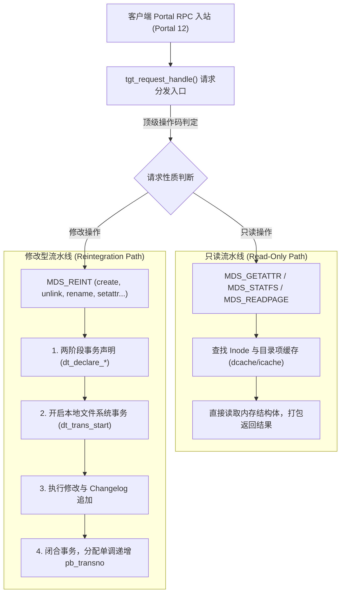

# 10.2 元数据双轨流水线：只读与修改型操作

在 MDT 内部，入站请求按照其是否修改持久化元数据，被划分为两条性质不同的处理路径：



## 1. 只读流水线（Read-Only Pipeline）
包含 `MDS_GETATTR`、`MDS_STATFS`、`MDS_READPAGE` 等操作。请求到达后，线程直接在内存的目录项缓存（dcache）与 Inode 缓存（icache）中检索。若命中则就地打包回复，无需启动底层存储事务与 WAL 日志，单请求处理延迟通常处于微秒级。

## 2. 修改型流水线（Reintegration Pipeline）
所有涉及元数据状态变更的操作统一通过顶级操作码 `MDS_REINT` 提交，内部细分为多种子操作码（`enum mds_reint_op`）：

```c
enum mds_reint_op {
    REINT_SETATTR   = 1,    /* 修改文件权限、属主或时间戳 */
    REINT_CREATE    = 2,    /* 创建普通文件或命名管道 */
    REINT_LINK      = 3,    /* 创建硬链接 */
    REINT_UNLINK    = 4,    /* 删除文件或空目录 */
    REINT_RENAME    = 5,    /* 移动重命名文件或目录 */
    REINT_OPEN      = 6,    /* 打开并可能附带创建文件 */
    REINT_SETXATTR  = 7,    /* 设置文件扩展属性 */
    REINT_MIGRATE   = 8,    /* DNE 目录在线平滑迁移 */
};
```

修改型流水线严格执行两阶段事务：先调用 `dt_declare_*` 测算与预留日志块及 Inode 资源，再调用 `dt_trans_start()` 开启原子事务执行磁盘更新，并分配全局单调递增的事务序列号 `pb_transno`，保证状态变更具备持久化重放能力。

---

