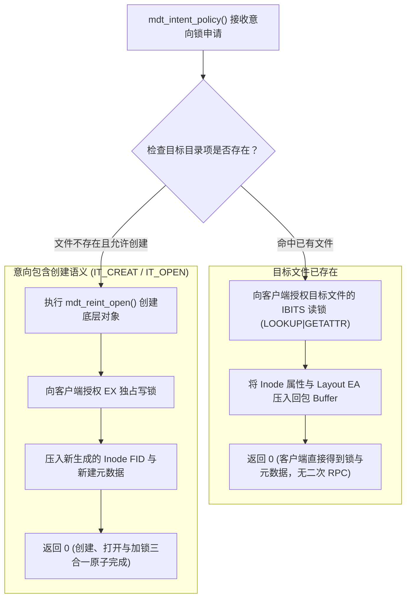

# 10.3 意向调度中枢：mdt_intent_policy()

意向锁机制的服务端核心仲裁实现位于 `lustre/mdt/mdt_handler.c` 的 `mdt_intent_policy()` 函数中：

通过这一单 RTT 复合裁决逻辑，客户端原本分离的“查找 $\rightarrow$ 属性拉取 $\rightarrow$ 锁申请 $\rightarrow$ 打开创建”四次网络请求被压缩至单个 RPC 轮次内，极大降低了万卡集群中海量小文件的遍历延迟。

---

