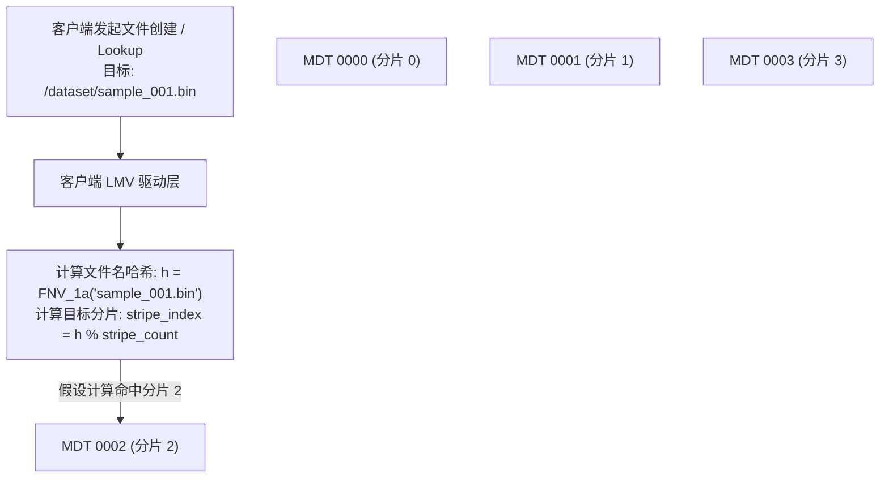

# 11.2 目录条带化核心算法与 LMV 哈希机制

在条带化目录中，目录在逻辑上被划分为 **主分片（Master Stripe）** 与多个 **从分片（Slave Stripes）**：
- **主分片**：存放该目录的主 Inode，记录目录权限、属主以及扩展属性中的 LMV 条带布局（LMV EA）。
- **从分片**：分布在指定的一组 MDT 上，底层对应各 MDT 上的实际子目录，用于分散存储真实的文件目录项（dentry）。

## 11.2.1 哈希算法：客户端免中心寻址

客户端的 `lmv` 模块在解析目录条带布局后，利用哈希算法在本地直接计算文件所属的目标分片：

1. **哈希计算**：采用经过优化的 FNV-1a 或 CRUSH 算法，对文件名字符串进行哈希运算生成 32 位整型散列值。
2. **分片定位**：
   $$\text{StripeIndex} = \text{Hash}(\text{filename}) \pmod{\text{StripeCount}}$$
3. **直接通信**：根据 `StripeIndex` 查询 LMV 布局中的对应 MDT 编号，直接向目标 MDT 发起元数据 RPC。整个寻址过程在客户端本地内存完成，不经过 Master MDT 中转，消除了中心节点的通信开销。

---

