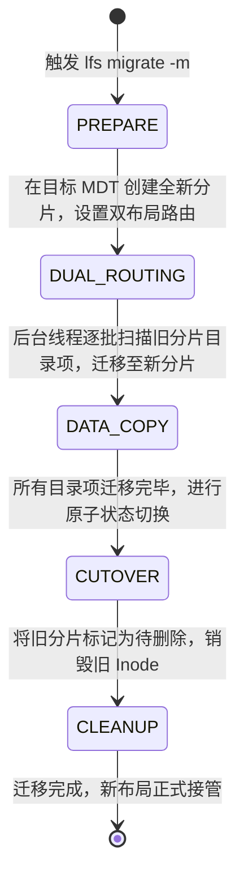

# 11.4 目录在线平滑迁移（Directory Migration）

当集群扩容新增了 MDT，或者某一特定目录因数据量暴增导致原有 MDT 空间告急时，管理员可以使用 `lfs migrate -m` 命令将目录在线迁移至其他 MDT，业务读写全程不中断。

1. **预备与双布局路由（Dual Routing）**：在目标 MDT 上分配新的目录分片，并在主 Inode 上挂载过渡态布局标记。在此阶段，客户端发起的新文件创建直接路由至新分片，旧文件的读取仍可回溯至旧分片。
2. **后台迭代数据搬迁**：内核工作线程以批次为单位，遍历旧目录下的目录项，通过内部事务将其安全移动至新分片中。
3. **原子切换（Cutover）**：当旧分片全部排空后，系统原子更新主分片的 LMV EA 布局，彻底解除对旧分片的引用并释放底层空间。

---

