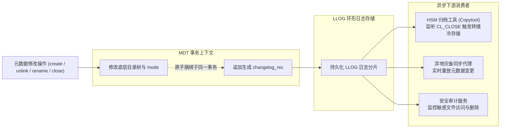

# 12.1 变更捕获机制：从定时扫描到事件驱动

在容纳数亿至百亿级文件的分布式存储集群中，数据备份、分层归档（HSM）与灾备同步若依赖传统的文件系统全盘扫描（如定时执行 `find` 或 `readdir`），会面临严峻的性能挑战：

| 评估维度 | 传统全盘遍历扫描 (Namespace Crawling) | Lustre Changelogs 事件驱动 (CDC 机制) |
| :--- | :--- | :--- |
| **元数据 I/O 影响** | 触发数十亿次磁盘读取，占用大量 dcache/icache 内存，影响正常业务 | 零额外扫描 I/O：在元数据修改落盘的同一事务中顺手追加一条日志 |
| **事件感知延迟** | 取决于扫描周期（通常为数小时甚至数天） | 毫秒级：元数据操作落盘完成瞬间即可被消费者实时读取 |
| **变更捕获精度** | 易遗漏在两次扫描间被创建后迅速删除的“短命”临时文件 | 绝对记录：完整保留文件生命周期的每一次关键状态演进 |
| **审计信息完整度** | 仅能获知操作发生后的最终静态属性 | 记录上下文：附带发起修改的用户 UID、GID 以及超算 Job ID |

Lustre 内置的 **Changelogs** 机制采用变更数据捕获（CDC, Change Data Capture）模型，为下游应用提供高吞吐、按序递增的实时元数据事件流。

---

