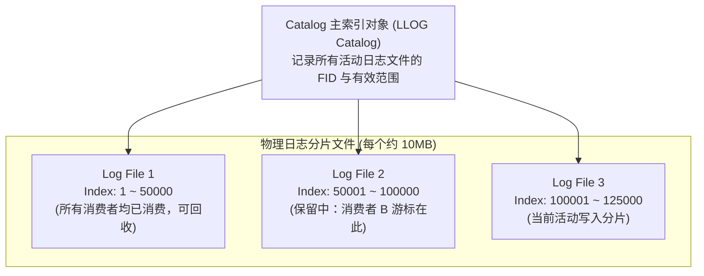

# 12.3 存储引擎：LLOG（Lustre Log）组织架构

Changelog 并不保存在普通用户文件中，而是交由内核专用的追加型日志引擎 **LLOG（Lustre Log）** 管理。

- **分片管理**：日志被切分为若干个定长的物理分片文件（通常为 10MB）。一个分片写满后，自动分配并链接下一个新分片，避免单文件无限膨胀。
- **原子追加**：Changelog 的写入与引发该变更的元数据操作严格捆绑在底层同一个磁盘文件系统事务中（如 `ext4` 的 `journal_start/stop` 或 ZFS 的同一个 TXG），确保不会发生“元数据已生效但事件未记录”的不一致状态。

---

