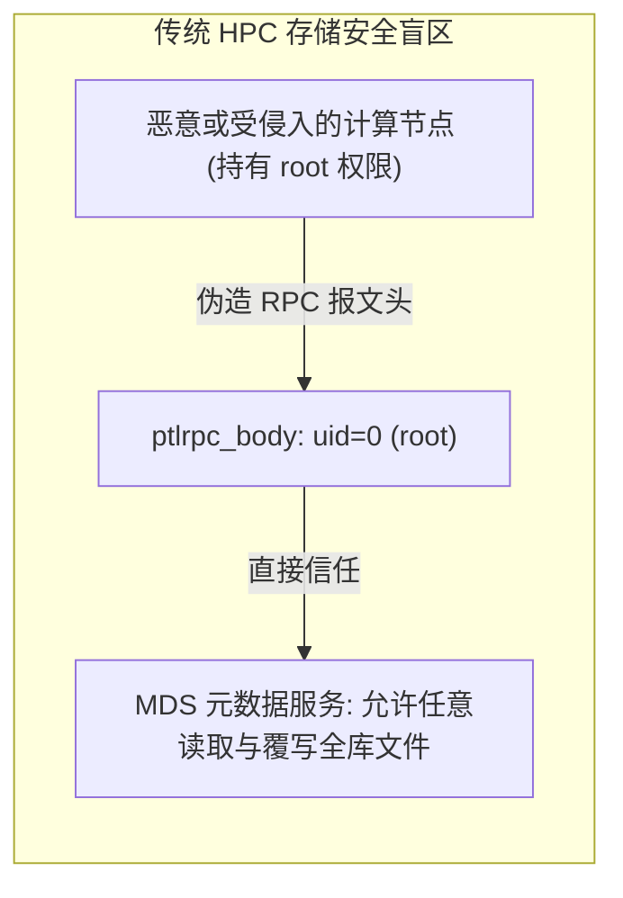

# 13.1 企业级多租户安全诉求与传统 HPC 存储盲区

在传统高性能计算（HPC）环境中，存储系统通常假设运行在物理隔离的专用受信内网中。POSIX 权限模型完全信任计算客户端汇报的 UID 与 GID。客户端发出系统调用时，内核 `llite` 直接将当前进程的有效用户标识（`current_fsuid()`）填入 RPC 报文头部并发往 MDS：

在公有云 HPC、智算算力租赁以及跨部门多租户混合调度场景中，这种信任模型面临毁灭性风险：
1. **Root 提权逃逸**：租户在具备容器或物理机 root 权限时，可任意伪造 UID 为 0 发送 Lustre RPC，非法篡改全集群核心数据；
2. **多租户 UID/GID 冲突**：租户 A 内部的 UID 1001 对应开发人员张三，而租户 B 内部的 UID 1001 对应算法工程师李四，传统共享存储无法区分两者的数据归属；
3. **数据跨界越权遍历**：挂载整个全局文件系统后，租户可通过路径猜测或遍历访问其他租户的私有目录结构。

为此，现代 Lustre 构建了包含 **Nodemap 租户虚拟化**、**Shared-Secret Key（SSK）网络鉴权** 以及 **子目录挂载隔离（Fileset）** 的立体化安全防护架构。

如图 13-1 所示，现代 Lustre 逐步完善了从底层数据完整性校验（DIF/DIX）、Nodemap 身份隔离、SSK 共享密钥鉴权到分布式配额治理的完整矩阵。

---

