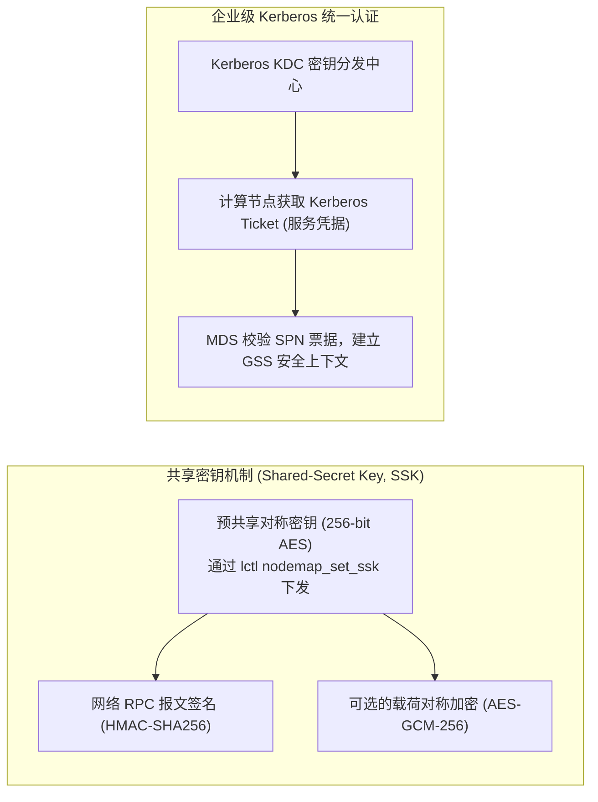

# 13.4 网络层鉴权：共享密钥（SSK）与 Kerberos GSS

在传输链路上，若网络未经加密与鉴权，恶意节点可通过伪造 ARP、IP 欺骗或网络嗅探冒充受信客户端。Lustre 支持基于通用安全服务应用编程接口（GSS-API）的两种认证体系：

## 13.4.1 共享密钥（SSK）
适用于智算集群与轻量化租户隔离。管理员在 MGS 上生成唯一的对称密钥文件，并通过专有通道分发给属于特定 Nodemap 的客户端节点：
- **认证模式（`null` / `skpi`）**：在 RPC 头部注入 HMAC 签名，服务端校验报文完整性与来源合法性，防止中间人篡改；
- **加密模式（`skpn`）**：对跨网络传输的 Bulk 数据载荷执行端到端 AES 加密，防止敏感训练数据被交换机镜像抓包泄露。

## 13.4.2 Kerberos GSS
适用于大型企业域环境。通过与企业现有的 Active Directory 或 MIT Kerberos KDC 对接，所有挂载与访问必须持有有效的 Kerberos 凭据，实现了与企业级 LDAP/IAM 系统的单点登录（SSO）与审计打通。

---

