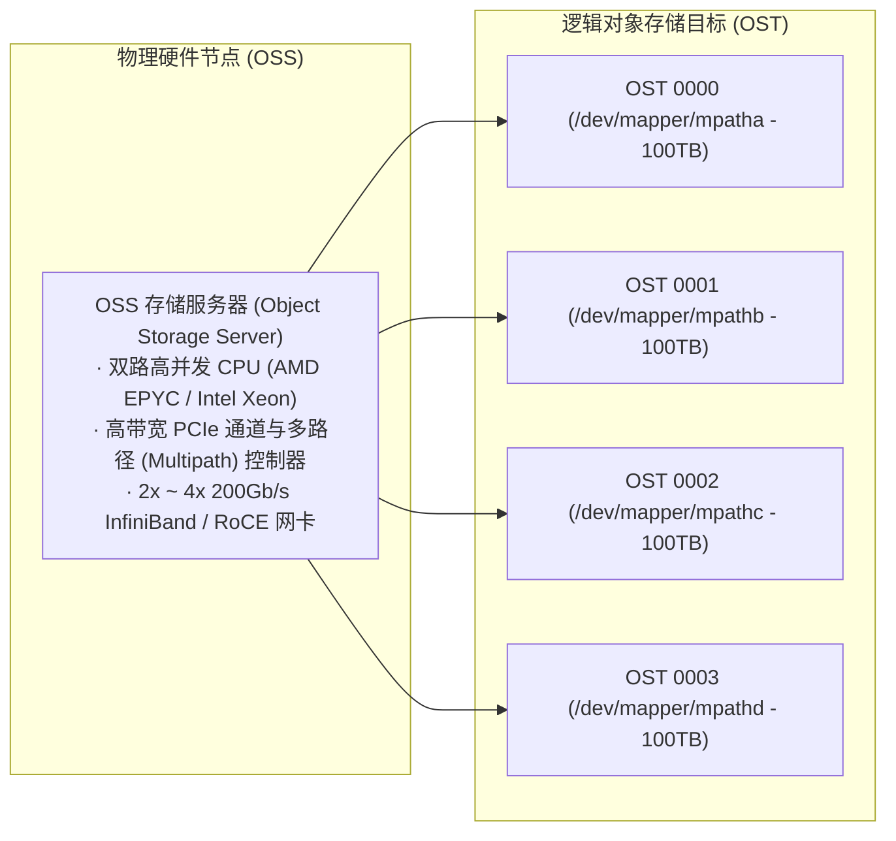

# 14.1 数据存储节点全景：OSS 与 OST

在 Lustre 数据存储平面中，系统同样区分为物理硬件服务与逻辑存储目标：

- **OSS（Object Storage Server，对象存储服务器）**：物理存储服务器节点，配置高并发处理器、大容量内存、高速网络适配器以及硬件 SAS/NVMe 磁盘控制器。
- **OST（Object Storage Target，对象存储目标）**：导出的逻辑存储设备单元，每个 OST 对应后端一个独立的物理文件系统卷（LUN）。一台物理 OSS 通常挂接 2 到 8 个 OST，从而利用多存储目标并发打满节点的总线与网络带宽。

---

