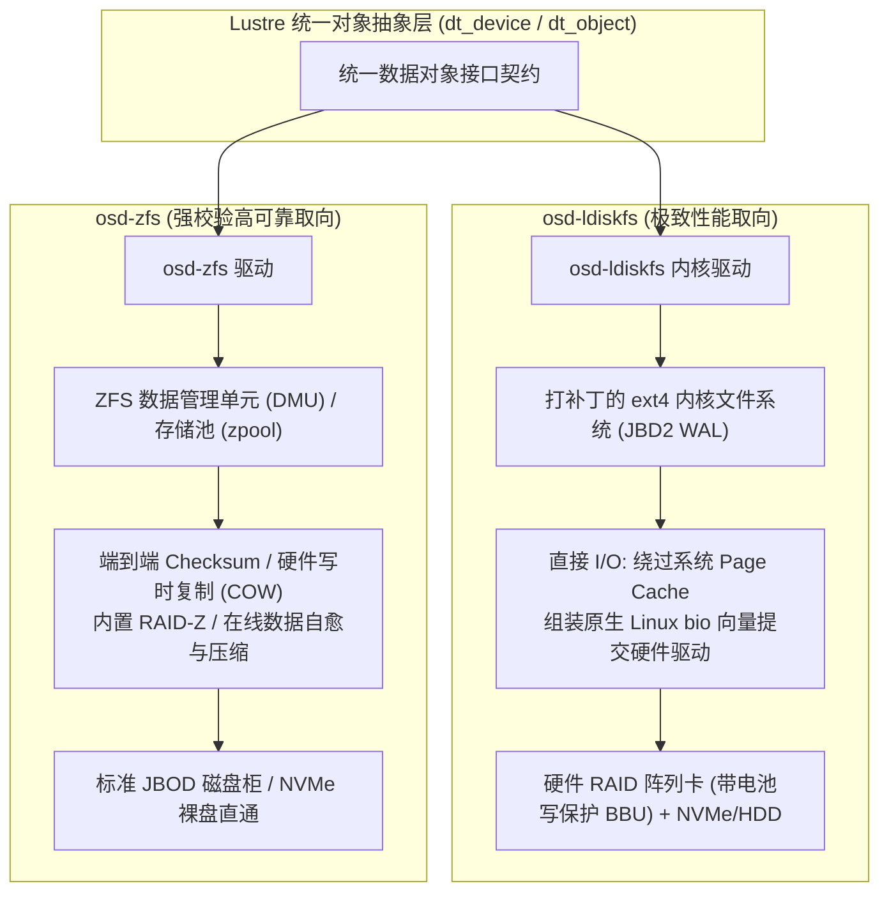

# 14.3 后端存储引擎抉择：osd-ldiskfs vs osd-zfs

Lustre 提供了两套物理存储后端驱动，支持根据业务需求选择不同的底层文件系统：

## 特性与选型对比

| 评估维度 | `osd-ldiskfs`（基于 ext4 深度优化） | `osd-zfs`（基于 OpenZFS 构建） |
| :--- | :--- | :--- |
| **架构定位** | 极致裸性能取向，计算与超算密集型中心首选 | 数据安全与易维护取向，大容量冷热存储首选 |
| **底层硬件依赖** | 强依赖硬件 RAID 阵列卡（配备掉电保护缓存 BBU/Flash） | 支持直接挂接裸 JBOD 盘柜，利用软件 RAID-Z 容错 |
| **静默数据损坏检测** | 依赖外部校验工具，底层无持续自愈校验和 | 全链路 SHA256 / Blake3 校验和，读取时自动修复静默损坏 |
| **I/O 执行流水线** | 采用 Direct I/O，直接组装 `bio` 向量直通块设备驱动 | 经由 ZFS DMU 缓冲池与事务组（TXG）流水线回写 |
| **高级特性支持** | 支持 Quota 配额与快速恢复，不支持软快照 | 原生支持存储池快照、在线透明压缩（LZ4/ZSTD）与去重 |

---

