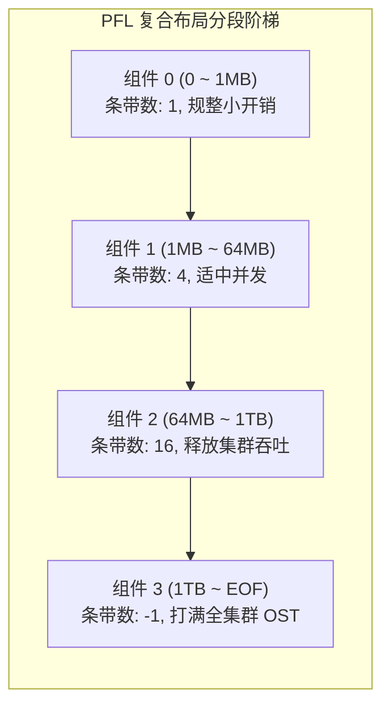

# 15.2 渐进式文件布局（PFL, Progressive File Layout）

为消除传统固定布局的配置矛盾，Lustre 引入了 **复合布局架构（Composite Layout）**，其工业级实践即为 **渐进式文件布局（PFL, Progressive File Layout）**。

*图 14-2: PFL 渐进式文件布局整体架构：随文件大小动态扩展条带宽度（来源：Lustre Chinese Operations Manual）*

*图 14-3: PFL 复合组件的 Extent 区间切分与条带配置（来源：Lustre Chinese Operations Manual）*

## 14.2.1 动态按需分配与存储池协同

*图 14-4: PFL 组件与 OST 存储池（Flash 闪存池与 HDD 机械盘池）阶梯绑定拓扑（来源：Lustre Chinese Operations Manual）*

*图 14-5: 客户端写入跨越边界时触发的 PFL 动态范围扩展流程（来源：Lustre Chinese Operations Manual）*

- **延迟实例化（Late Allocation）**：文件刚创建时，系统仅在 MDT 上生成组件元数据模板，并不立即在所有组件对应的 OST 上分配实际对象。
- **跨界动态实例化**：当客户端写入量突破组件 0 的上限（如 1MB）时，客户端向 MDS 发起布局扩展请求，MDS 才会即时在下一级指定的 OST 上分配物理对象并挂接，保证“小文件零冗余开销，大文件自动全打散”。

*图 14-6: PFL 高速存储池空间耗尽时自动降级写入备用存储池的容错流程（来源：Lustre Chinese Operations Manual）*

*图 14-7: PFL 组件状态演进：从 Init、Stale 到 In-Sync 的状态机转换（来源：Lustre Chinese Operations Manual）*

---

