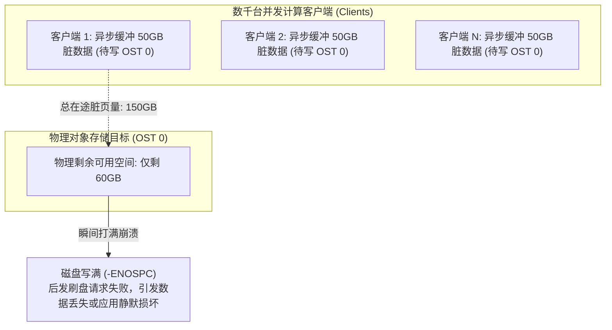

# 16.1 异步写入的空间超卖风险与 Grant 机制的产生

在 POSIX 文件系统语义中，应用程序调用 `write()` 时，操作系统通常先将数据写入本地 Page Cache 并立即返回成功（异步写入），随后由内核后台线程（如 `flusher`）择机刷写至底层存储。

然而，在拥有成千上万个并发客户端的分布式存储集群中，朴素的异步缓存模型会引发严重的 **空间超卖灾难（Space Overcommit Disaster）**：

若各个客户端在将数据写入本地缓存时不进行全网空间校验，当所有客户端同时向同一台 OST 刷盘时，在途脏数据的总量若超过了该 OST 的实际剩余物理空间，先刷盘的客户端能够写入，而后刷盘的客户端将遭遇空间不足（`-ENOSPC`）。由于最初的 `write()` 已经返回成功，这会导致不可逆的数据截断与损坏。

为此，Lustre 设计了 **Grant 空间预留与流控机制**。

---

