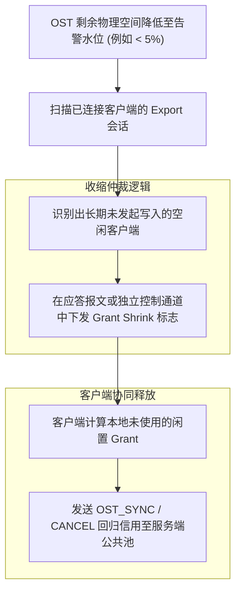

# 16.3 动态回收机制：Grant Shrinking

当 OST 的物理磁盘空间逐渐耗尽（如剩余空间低于 5%）时，若允许部分空闲或低负载客户端长期持有大量未使用的 Grant 额度，会导致其他正在进行密集写入的活跃节点因申请不到 Grant 发生写入停顿。

OFD 实现了 **Grant 动态收缩机制（Grant Shrinking）**：

- **高水位感知**：服务端在剩余空间不足时，动态削减新下发的 Grant 配额；
- **主动召回**：通过网络通告空闲客户端主动释放其闲置的预留额度，将其集中调配给高负载写入的客户端，实现集群级存储资源的高效利用。

---

