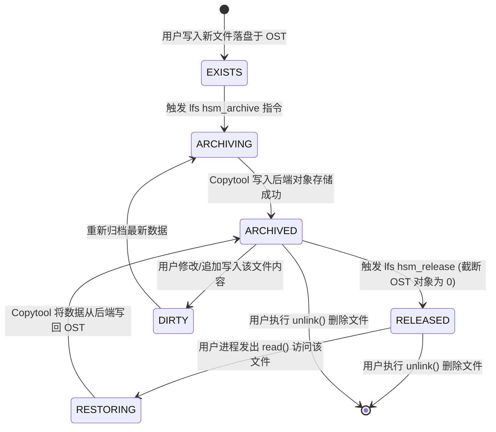

# 17.3 文件生命周期状态机与状态跃迁

在 HSM 体系中，文件的生命周期通过一组位图掩码精确定义：



## 核心状态标志位定义

```c
#define HS_NONE         0x00000000
#define HS_EXISTS       0x00000001  /* 文件物理数据块当前存在于 Lustre OST 上 */
#define HS_ARCHIVED     0x00000002  /* 文件完整副本已成功写入二级归档后端 */
#define HS_RELEASED     0x00000008  /* OST 上的数据已被释放 (大小为 0)，仅保留元数据 */
#define HS_DIRTY        0x00000010  /* 文件在归档后又被修改，归档副本已过时 */
#define HS_LOST         0x00000020  /* 归档后端副本损坏或不可达 */
```

- **`RELEASED`（关键空间释放态）**：  
  当文件处于 `RELEASED` 状态时，客户端执行 `ls -lh` 依然能看到文件的真实大小、权限、创建时间与目录归属，其元数据 Inode 完好无损地驻留在 MDT 上；但在底层 OST 存储介质上，该文件占用的对象扇区已被完全抹除并归还存储池，实现了**逻辑命名空间存在与物理存储空间归还的完美解耦**。

---

