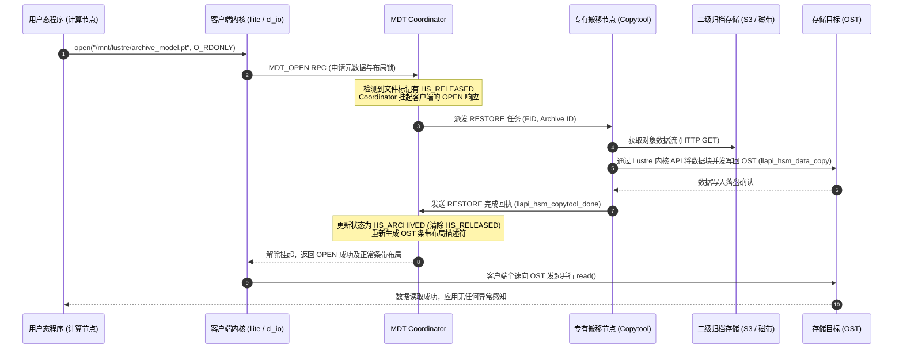

# 17.4 透明召回流水线与数据流（Transparent Recall）

当用户进程尝试打开并读取一个处于 `RELEASED` 状态的冷数据文件时，Lustre 的透明召回机制确保应用程序无须感知任何底层复杂性：

结合图 17-4 展示的交互数据流，完整召回流程如下：

在整个透明召回期间，客户端进程仅仅表现为系统调用微秒/秒级的暂时挂起。一旦 Copytool 将数据灌回 OST，I/O 管道瞬间打通，用户程序平滑恢复。

---

