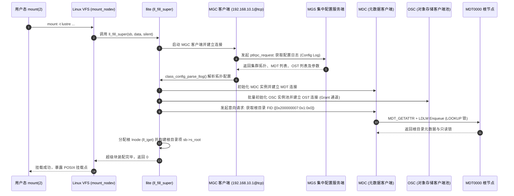

# 18.2 挂载与装配流程：ll_fill_super()

当系统管理员在客户端节点执行挂载命令时：
```bash
mount -t lustre 10.10.10.1@o2ib:10.10.10.2@o2ib:/lustrefs /mnt/lustre
```
内核 VFS 解析 `lustre` 文件系统类型并调用注册的入口函数 `ll_fill_super()`（位于 `lustre/llite/llite_lib.c`）。该流程完成从配置拉取、网络建链到本地根目录绑定的完整装配：



## 装配核心步骤详解

1. **MGC 配置日志订阅**：
   `llite` 根据挂载命令传入的 MGS NID（支持高可用双活 NID），在本地生成临时 MGC 设备，向 MGS 请求获取 `<fsname>-client` 配置日志。该日志以二进制 llog 形式存储在服务端，包含了当前文件系统所有活动的 MDT、OST 命名、UUID、网络地址和全局参数。
2. **底层 OBD 堆栈级联展开**：
   根据配置日志中的指令序列，内核依次调用 `class_process_config()`：
   - 实例化 `lmv`（Lustre Metadata Virtual）设备，并在其下方挂载各个 MDT 对应的 `mdc` 设备；
   - 实例化 `lov`（Lustre Object Virtual）设备，并在其下方挂载各个 OST 对应的 `osc` 设备；
   - 启动本地 LDLM 客户端命名空间与 RPC 守护线程池。
3. **根 Inode 锚定与 VFS 绑定**：
   客户端向主元数据节点 MDT0000 发起 RPC，查询根目录对象。根据 Lustre 规范，根目录具有固定的保留 FID（`ROOT_FID = [0x200000007:0x1:0x0]`）。MDT 返回根目录的 `struct mdt_body` 及其 Inode Bits 锁。`llite` 调用 `ll_iget()` 分配内存 `struct inode`，将其包装为 `struct ll_inode_info`，设置 `sb->s_root = d_make_root(root_inode)`。

---

