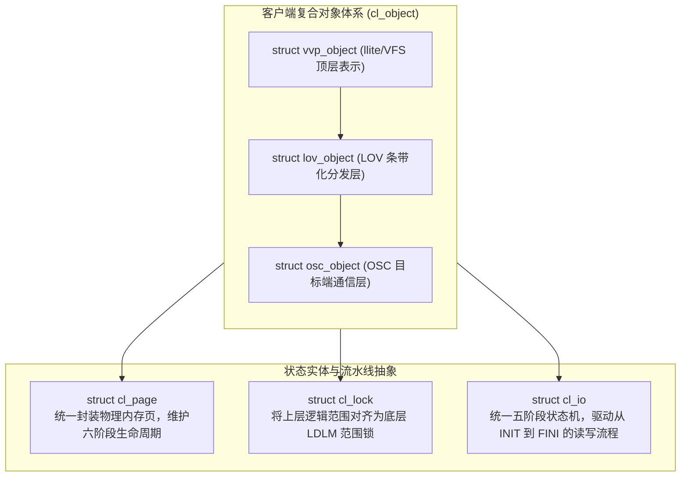
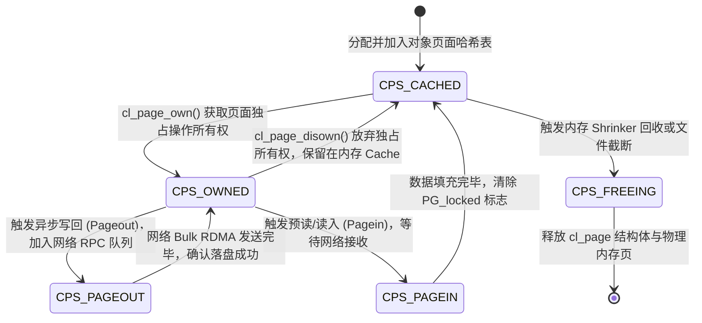

# 19.2 核心架构模型：对象、页面、锁与 I/O



## 17.2.1 客户端复合对象结构体：`struct cl_object`

类似于服务端的 `lu_object`，客户端的 `cl_object` 同样由多层设备（Layers）嵌套构成，各层私有数据通过 `co_slice` 链表串联：

```c
struct cl_object {
    struct lu_object_header *co_lu;         /* 关联的全局 lu_object 头 */
    struct cl_object_header *co_hdr;        /* 客户端对象专用头信息 */
    struct cl_object_operations *co_ops;    /* 分层操作跳转表 */
    struct list_head        co_lu_list;     /* 同一复合对象的多层切片链表 */
};

struct cl_object_header {
    struct lu_object_header coh_lu;
    atomic_t                coh_refcount;   /* 客户端对象引用计数 */
    struct lu_fid           coh_fid;        /* 全局唯一 128 位 FID */
    struct cl_page_list     coh_page_list;  /* 该对象挂载的所有活动页面链表 */
    struct mutex            coh_lock_mutex; /* 锁操作并发互斥锁 */
};
```

各层对象的对应关系为：
- **`vvp_object`**：位于 `llite`，内嵌 `struct inode` 指针，直接承接 VFS 属性请求；
- **`lov_object`**：位于 `lov`，缓存当前文件的 PFL/FLR 条带化布局组件数组；
- **`osc_object`**：位于 `osc`，每个 `osc_object` 严格对应某一台后端 OST 上的底层数据对象。

---

## 17.2.2 统一页面抽象与六阶段生命周期：`struct cl_page`

`cl_page` 是对 Linux 物理内存页（`struct page`）的统一安全封装。在 `cl_object` 体系中，页面被严格定义为离散的状态机：

```c
struct cl_page {
    struct cl_object       *cp_obj;         /* 所属的客户端对象 */
    struct page            *cp_vmpage;      /* 指向 Linux 内核原生物理 struct page */
    pgoff_t                 cp_index;       /* 文件的页面逻辑索引偏移量 (offset >> PAGE_SHIFT) */
    enum cl_page_state      cp_state;       /* 页面当前生命周期状态 */
    enum cl_page_type       cp_type;        /* CPT_CACHEABLE 或 CPT_TRANSIENT */
    struct list_head        cp_batch;       /* 批处理网络 RPC 发送队列 */
    atomic_t                cp_ref;         /* 页面引用计数 */
};
```

### 页面六阶段状态跃迁机理



1. **`CPS_CACHED`**：页面数据已在内存就绪，与磁盘内容保持一致或为干净页，可被任意读线程并发读取；
2. **`CPS_OWNED`**：某个 I/O 上下文（`cl_io`）通过 `cl_page_own()` 获取了该页面的排他所有权。此时禁止任何其他内核线程发起写回或并发修改；
3. **`CPS_PAGEOUT`（Writeback 保护态）**：页面已被打包进底层 OSC 的 RPC 发送队列，网络适配器（HCA）正通过 PCIe DMA 读取该页内存。**在整个 `CPS_PAGEOUT` 期间，任何试图写入该页的进程均会被强制阻塞**，杜绝了网络传输期间数据被覆盖导致校验和（Checksum）不匹配的风险；
4. **`CPS_FREEING`**：页面正从对象的活动树中注销并交还给 Linux SLUB 分配器。

---

## 17.2.3 统一范围锁抽象：`struct cl_lock`

在 Lustre 中，POSIX 文件锁和 LDLM Extent 锁在客户端通过 `struct cl_lock` 完成语义折叠：

```c
struct cl_lock_descr {
    struct cl_object       *cld_obj;        /* 锁所属的对象 */
    pgoff_t                 cld_start;      /* 起始逻辑页面索引 */
    pgoff_t                 cld_end;        /* 结束逻辑页面索引 (CL_PAGE_EOF 表示文件末尾) */
    enum cl_lock_mode       cld_mode;       /* CLM_READ (共享读) 或 CLM_WRITE (独占写) */
    enum cl_lock_type       cld_type;       /* CLT_MDS (元数据锁) 或 CLT_OST (数据范围锁) */
};
```

当上层应用执行 `write(fd, buf, 10MB)` 时：
1. `llite` 生成一个覆盖 $[0, 2560\text{ pages}]$ 的顶层 `cl_lock`；
2. 该锁传递至 `lov` 层，根据条带宽度（例如 4 条带、1MB 条带大小），自动将这个大锁分解为 4 个互不重叠、面向各自 OST 的子锁描述符；
3. 各个子锁下发至对应的 `osc` 模块，由 OSC 向具体的 OST 发起 `LDLM_ENQUEUE` RPC；
4. 只有当全部子锁均被远端授予后，顶层的 `cl_lock` 才转为持有（Held）状态，允许 I/O 状态机向下推进。

---

