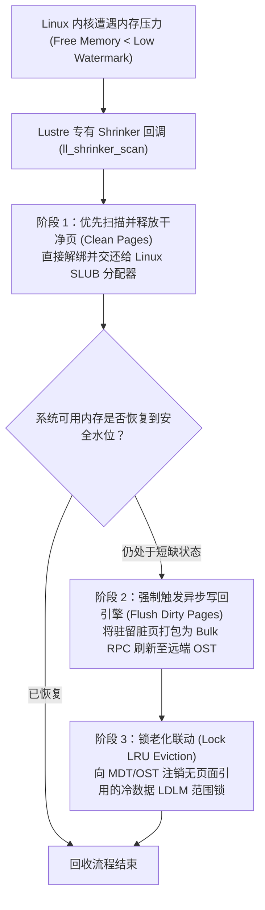

# 20.3 客户端内存收缩器（Memory Shrinker）与页面淘汰

在长时间运行的高吞吐计算节点上，随着读取和写入的持续推进，大量数据页会缓存在 Linux Page Cache 中。若不加以精细化治理，极易导致计算作业在申请新内存时遭遇系统突发停顿（Direct Reclaim）甚至触发 OOM。

`lustre/llite/lcommon_cl.c` 实现了向 Linux 内核虚拟内存系统注册的专有 **Memory Shrinker（内存收缩器）**：

1. **洁净页优先淘汰**：内核触发 Shrinker 时，系统优先释放未被修改的文件页面缓存（Clean Pages），避免产生昂贵的磁盘与网络 I/O；
2. **脏页主动平滑回写**：若内存压力仍未缓解，收缩器促使 OSC 后台工作队列对积压的脏页（Dirty Pages）实施批处理回写，强制落盘后将其标记为洁净页并释放；
3. **LDLM 锁老化联动**：随着物理页面的逐一释放，对应区间的 `cl_lock` 引用计数降为零，进入客户端 LDLM LRU 队列，在下一次锁收缩时被注销，从而杜绝内核结构体泄露。

---

