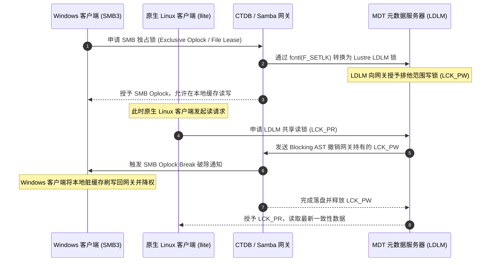

# 21.4 跨协议分布式并发锁转换（Lock Translation）

多协议网关最复杂的工程挑战在于维护跨协议的缓存与文件锁一致性：
- 客户端 A 通过原生 Lustre 挂载点（`llite`）打开了 `/data/model.pt`；
- 客户端 B 通过 Windows SMB 映射盘打开了同一个文件；
- 客户端 C 通过 NFSv4 挂载点并发写入该文件。

通过将上层的 SMB Oplocks（机会锁）与 NFSv4 Delegations（委托锁）通过网关底层的 `fcntl(2)` 系统调用实时转换为 Lustre 原生的 LDLM Extent 锁与 Inode Bits 锁，系统在异构网络环境下实现了全局严格的分布式缓存一致性。

---

