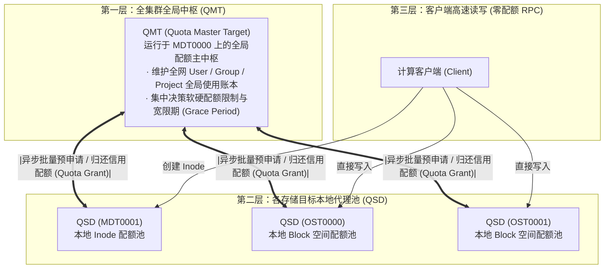

# 24.1 传统配额痛点与分布式配额工程矛盾

在数万台计算节点、数百台存储目标（OST/MDT）的大规模共享存储集群中，实现强一致性的磁盘配额面临极端的工程矛盾：
- **集中式计费的性能瓶颈**：如果每一次文件写入或 Inode 创建都必须同步向中央元数据节点发起网络 RPC 校验配额余额，超算集群的 IOPS 和写入带宽将被彻底掐死在配额锁竞争上；
- **纯本地粗放管理的失控风险**：如果各 OST 完全独立统计，由于用户文件分布在不同的条带对象上，系统无法获知全集群聚合使用总量，极易产生严重的跨节点容量超卖（Over-subscription）与底层磁盘被打爆。

为此，Lustre 构建了 **分层两级分布式配额架构（QMT / QSD 体系）**，在纳秒级本地高性能校验与全集群全局强一致性之间达成了精密的工程平衡：

---

