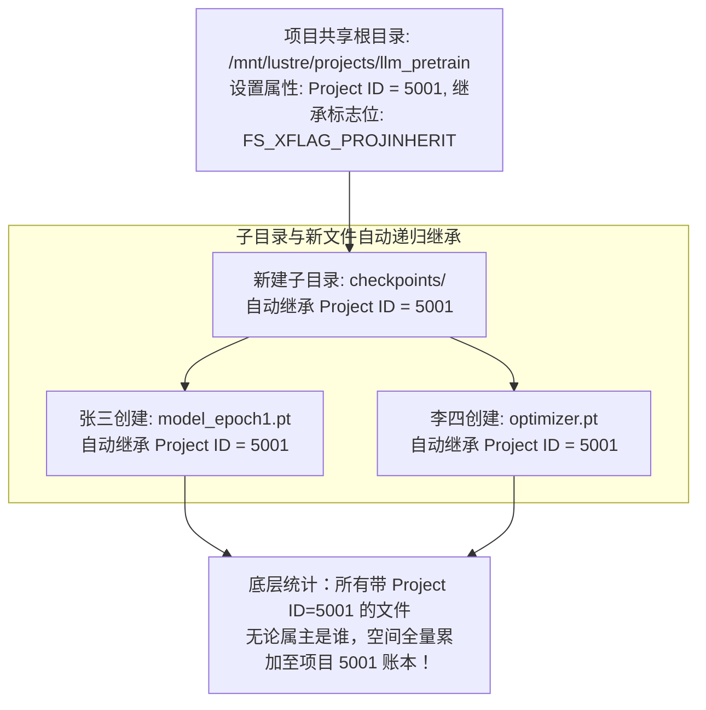

# 24.3 企业级目录级配额：Project Quota 机制

在多部门、多项目协同的现代大模型研发体系中，传统的 POSIX 用户配额（User Quota）与组配额（Group Quota）存在天然缺陷：
- 算法团队 A 包含 20 名研发人员，大家共同维护一个共享的数据集清洗目录 `/mnt/lustre/projects/nlp_clean`；
- 每个人都在该目录下写入数据，文件属主各不相同。传统 User Quota 无法限制整个目录树的总容量；
- 如果配置 Group Quota，要求所有成员的 Primary GID 严格一致，极大限制了跨组协作灵活性。

Lustre 实现了基于底层 Inode 扩展属性的 **项目配额（Project Quota）**：

- **目录树原子继承（Project Inheritance）**：  
  只要通过 `lfs project -s` 在目标目录上打上 Project ID 并开启继承位，未来在该目录下由任意用户创建的任何子目录、硬链接与文件，均在内核 Inode 分配时原子继承该 Project ID；
- **打破用户边界**：项目配额直接对该 Project ID 对应的全集群物理块数与 Inode 总量实施硬限制，实现了真正的多租户项目级存储空间精准管控。

---

