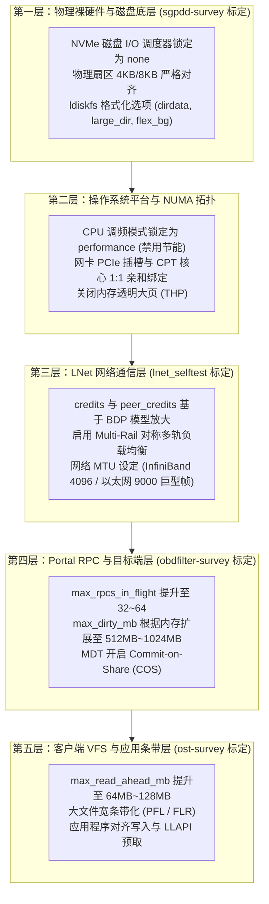

# 27.1 全栈性能调优分层架构

在由数千张 GPU 构成的大模型训练集群或国家级超算平台中，单纯依靠高性能硬件（如 NVMe SSD、400Gbps InfiniBand）无法自动换取理想的端到端吞吐。若系统采用默认的保守参数，由于网络信用受限、NUMA 跨片访存延迟、RPC 并发管道受阻以及文件系统调度争用，整体性能可能仅能发挥出硬件物理上限的 30%~50%。

高性能存储工程的调优必须建立在“分层消除瓶颈”的模型之上：

---

