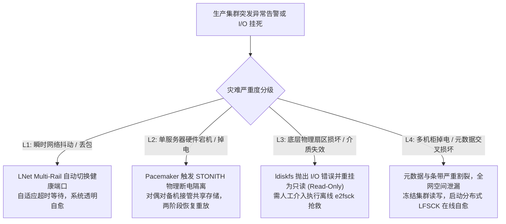

# 28.1 生产灾难分级与应急排障铁律

在管理跨越数百个节点与数十万块存储介质的企业级分布式集群中，硬件故障、光纤断连与异常全机房掉电属于必然遭遇的统计常态。在高压事故现场，**最致命的风险往往不是故障本身，而是运维人员因焦虑或缺乏准则采取盲目操作引发的“二次毁灭”**。

必须确立标准化的灾难分级与处置准则：

## 应急排障三大铁律

1. **第一铁律：抢救事故黑匣子，严禁盲目直接强制重启（`reboot -f`）**：  
   当服务器出现内核卡顿或进程陷入 D 状态时，若控制台尚有响应，首选执行 `lctl dk /tmp/lustre-panic.log` 转储内核环形日志，或通过 `sysrq-t` 导出全量调用栈。盲目硬重启会抹除内存证据，使偶发竞态故障陷入无法溯源的被动循环。
2. **第二铁律：未确认物理硬断电前，严禁在备机强行重复挂载存储卷**：  
   若某台存储节点因网络中断被高可用集群判定失联，在通过带外管理卡（IPMI）或智能 PDU 确认原主机 100% 物理掉电之前，**严禁手动执行 `mount` 重复挂载共享 LUN**，彻底杜绝操作系统双挂引发的双主脑裂元数据损毁。
3. **第三铁律：执行具有破坏性修复命令前，必须备份底层关键扇区**：  
   在对底层块设备执行带有修改属性的命令（如 `e2fsck -y`）前，必须使用 `dd` 备份磁盘头部前 100MB 物理扇区（包含 Superblock、Block Group 描述符与根 Inode 区），保留灾备退路。

---

